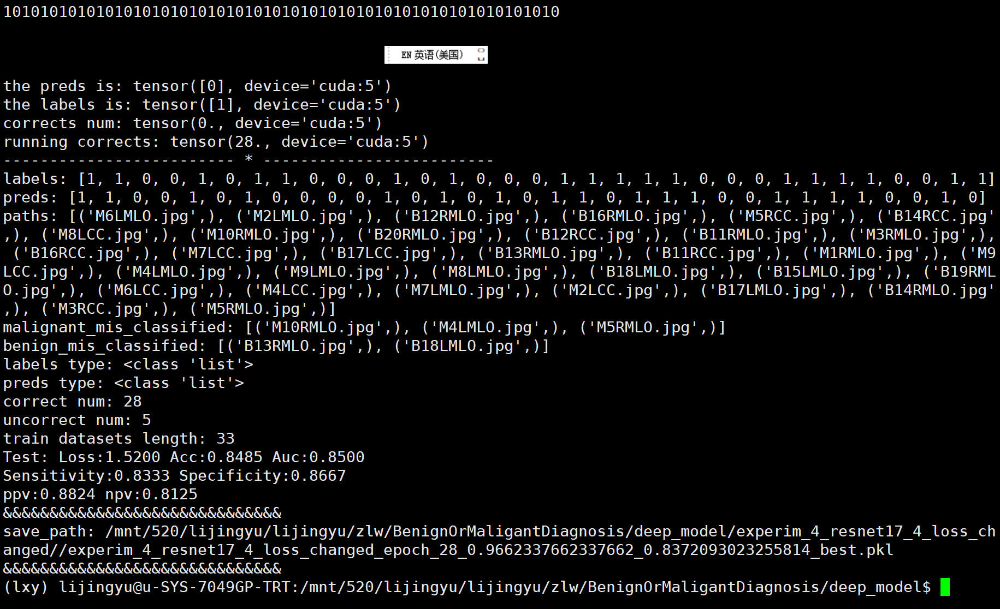

- DONE 研究清楚这个排版的大致思路
  :LOGBOOK:
  CLOCK: [2022-06-25 Sat 09:11:01]
  CLOCK: [2022-06-25 Sat 09:11:02]--[2022-07-02 Sat 10:30:27] =>  169:19:25
  :END:
- DONE 把方法重新写完
  :LOGBOOK:
  CLOCK: [2022-06-25 Sat 09:11:15]
  CLOCK: [2022-06-25 Sat 09:11:21]--[2022-07-02 Sat 10:08:15] =>  168:56:54
  :END:
- DONE 把对比实验弄完
  :LOGBOOK:
  CLOCK: [2022-06-25 Sat 09:11:27]
  CLOCK: [2022-06-25 Sat 09:11:28]--[2022-07-09 Sat 15:35:25] =>  342:23:57
  :END:
- DONE 把消融实验弄完
  :LOGBOOK:
  CLOCK: [2022-06-25 Sat 09:11:37]
  CLOCK: [2022-06-25 Sat 09:11:38]--[2022-07-07 Thu 09:16:30] =>  288:04:52
  :END:
- DONE 把GRAD-CAM分析弄完
  :LOGBOOK:
  CLOCK: [2022-06-25 Sat 09:11:46]
  CLOCK: [2022-06-25 Sat 09:11:47]--[2022-07-09 Sat 13:04:01] =>  339:52:14
  :END:
- [[PaperWriting]]
- 之前思维特别活跃，特别是在撰写文档的时候，现在却完全找不那种感觉了，继续加油写吧 ，可能真的是脑力是个空水桶  想倒却只能成水滴状留下。这一行真的很长。现在实验最后一个想法，这里的话，模型结构需要重新写了，最好在输出上面做文章吧；模型写完的话，训练部分和测试部分的代码需要改吗，感觉是需要的。这次需要去修改三个损失函数的权重，中间的结果权重最高吧
- 题目
	- 针对小样本开发的一种resnet和densenet之间的简单融合机制
	-
	- A Simple Fusion Mechanism for resnet and densenet predicting the pathological status of mammographic microcalcifications
	-
	- 研究目的
- 到底是用训练集还是用验证集上的指标呢  还是两者都描述呢
- 怎么把训练和验证集上的那几个值也给保存下来
-
-
- 文献调研也需要变成resnet和densenet之间的融合方式了
- 
-
- 为了结合不同简单模型的特征表达能力以达到复杂建模的目的，最近的研究求助于模型融合策略，其融合哲学可以粗略分为两类。
- 第一类是从数学本质出发对多种模型的子结构进行融合，比如DPN模型提出了dual-path架构，能够很好地结合resnet的特征复用能力和densenet的特征生成的能力，模型的参数量和计算速度都更小；Acmix模型发现卷积和自注意力机制实际上都是基于1*1的卷积的，通过在数学层面设计组合方式来同时捕获全局和局部信息；还有深度学习与随机森林结合的Deep Regression Forest，Neural Regression Forest， Deep Neural Decision Forest和Adaptive Neural Trees、继承深度学习“深层”思想的模型：Deep Forest。然后，这一类方法总体上并不能大幅度地降低参数量。
- 第二类是从模型的预测结果层面直接进行融合的，包括使用硬投票或者软投票策略的投票、使用简单算术平均或者加权平均的平均、使用有放回抽样的样本建立多个子模型再融合的Bagging、每次迭代更关注上一轮错误分类样例的Boosting，以及对不同模型结果再次建立分类模型的Stacking。
-
- In order to combine the expression power of different simple models, recent research resorts to model fusion strategies, whose philosophies can be roughly divided into two categories. One tries to integrate the substructures of various models in terms of the mathematical essence. For example, the DPN[] proposes a dual-path architecture that simultaneously models the feature reuse capability of resnet and the feature generation capability of densenet, leading to fewer parameters and faster calculation; the Acmix[] finds the fact that the convolution and self-attention mechanisms are actually both based on 1*1 convolution operation, and therefore reconstructs the procedure so as to capture the global and local information; Deep Regression Forest[], Neural Regression Forest[], Deep Neural Decision Forest[], Adaptive Neural Tree[], and Deep Forest[] are five approaches injecting the random forest into neural networks.  However, this type of method does not generally reduce the number of parameters by a large margin. Another focuses on the direct merging of model outputs, including voting using hard voting or soft voting strategies, and averaging using simple arithmetic average or weighted average.  The more complex belongs to the three classical ensemble methods: bagging[] which builds multi sub-models from samples collected by replacement sampling, boosting[] which puts more emphasis on the previous round of misclassification examples, and stacking[] which establishes a meta-model for different model results. Nonetheless, such methods are time-consuming and complex.
-
-
- Breast cancer screening by detecting breast MCs has great significance for reducing the pain of breast cancer patients [2]. Among the means, digital mammography (DM) has been shown to be superior to other methods like breast magnetic resonance imaging (MRI) and ultrasound, as it provides chances for radiologists to further scrutinize possible invasive ductal carcinoma in situ (DCIS) [3][4][5][6]. According to the Breast Imaging Reporting and Data System (BI-RADS) Atlas [7], a mammographic abnormality with a radiological score of 4 is considered highly suspicious for malignancy, requiring pathological examination for final confirmation of being noncancerous or cancerous. However, true clinical statistics show that only about 35% of cancerous MCs require mastectomy of all the biopsied samples [8].
-
- 贴出3张良性和3个恶性肿瘤的图片
	- 大多图片中的微钙化灶都与高亮背景组织的灰度范围接近，肉眼看上去非常混杂，难以区分
	- 尽管临床诊断时医生在一般情况下可以按照以下两个标准来判断微钙化灶的良恶性：
	- 1）在分布上较为分散的是良性，而呈现节段性和集群等密集分布的则是恶性
	- 2）在形态上呈现圆形、卵形、爆米花型等粗大形状的是良性，而呈现蠕虫样、铸型、分枝状等微小形态的则是恶性，
	- 但是不同病人在钙化点的数量、分布的位置等疾病方面有较大的差异性。
	- During clinical diagnosis, the benignity and malignancy of microcalcifications can be generally judged according to the following two criteria: 1) distribution: the one scattering more tends to be benign while the one with dense distribution (segment or cluster) tends to be malignant; 2) shape: the one with coarse shapes (round, oval, or popcorn shape) tends to be benign while the one with tiny shapes (worm-like, cast, branched) tends to be malignant. The two main differences can be clearly seen in Fig. 1. But it's of great difficulty to make accurate recognition in practice. On one hand, the microcalcifications in most of the images are close to the grayscale range of the highlighted background tissue, making it difficult to distinguish; on another hand, great differences have lied between patients in the number of calcifications and the location of the distribution.
	  id:: 62b72376-7573-4a60-be82-cd3a7fbdf8cb
	-
	-
-
-
-
-
- Currently, the use of artificial intelligence technology, including traditional machine learning based on radiomics and deep learning models, has become a popular trend on the issue.
- The former consists of two core steps. Firstly, statistical properties on pixel intensity, which include energy, entropy, and gray-level co-occurrence matrix (GLCM), are calculated and then filtered to be the interpretable handcrafted features. It is noteworthy that the process is carried out both on original and transformative images derived by wavelet decomposition or by multiscale operators such as the Laplacian of Gaussian filter (LoG) and the Local Binary Pattern technique (LBP). Following that,  these features are fed into traditional machine learning models, including KNN [9], AdaBoost [10], Random Forest [11] and Gaussian Naive Bayes [12].
-
-
-
- The latter puts emphasis on the block design of deep learning models, including ordinary convolution [13], dilated convolution [14], self-attention mechanism [15], autoencoder [16], etc. However, the small size of the dataset leads to the only use of simple classic models, such as resnet [17], densenet [18], alexnet,  vgg [19], mobilenet and etc, since it is highly probable for recent models with complex structures and huge parameters like swin-transformer [20], vision-transformer [21], CaiT[22] and Deep ViT[] to be undertrained.
-
-
- In this work, we present a similarity-decoding-based weighted fusion mechanism(SDFM) targeting small samples to overcome the above challenges.
- 我们的融合对象是两个基础模型：resnet系列中参数量最小的resnet18和densenet系列中参数量最小的densenet121
- 这两个基础模型在我们的例子中均使用两个全连接层，我们旨在倒数第二个全连接层进行融合得到一个单一的融合后的向量，再对这个向量进行一层fc就可以得到分类预测结果。两个模型导数第二层的输出向量维度是一样的
-
- 在本工作中，为了尽可能地减小参数量，我们设想只在两个模型的全连接层的等长输出向量之间进行信息融合， 在这种情况下，有两种最常见的融合方式。一种是拼接融合（见图），对输出向量在维度上进行拼接，然后再线性转化到分类类别总数；一种是加权融合（见图），一个模型的输出向量整体对应一个权重，两个模型对应的权重之和为1，加权求和之后同样线性转化到分类类别总数。显而易见，后面一种方法参数量更少，但同时其权重不好确定也缺乏可解释性。我们希望能对后者做出两点改进：一是权重能依据两个输出向量进行自适应的计算，输入一张新的图片权重就会重新计算一次；二是权重不是与模型而是与输出向量的每个位置一一对应，也就是说两个输出向量的同一个位置的权重之和为1（见图）。于是，我们提出了一种基于相似性解码的加权融合机制。
- In this work, in order to minimize the number of parameters, we envisage information fusion only between the equal-length vectors outputting from fully connected layers of two separate models, in which case there are two common approaches. One is concatenation fusion (see Fig), where the output vectors are concatenated in dimensionality, and the other is weighted fusion (see Fig), where the output vectors of the two models correspond to different weights whose sum is one. In addition, the dimension of the fused vector in these two cases is finally transformed into the total number of categories. Obviously, the latter has less number of parameters, but its weights are not easy to determine in an interpretable way. We aim to improve the latter in two aspects: the weights can be calculated adaptively based on the two vectors, which means that the weights are recalculated for each new input; the weights correspond to each position of the output vector rather than to the model, which means that the weights of the same position of the two output vectors sum to one (see Fig.). Therefore, we propose a similarity-decoding-based weighted fusion mechanism to fulfill our expectations.
-
-
-
- 起初我们设想全连接层进行直接加权，但是权重的设置缺乏可解释性；于是，我们想到设置一个潜在嵌入，利用潜在嵌入与两个fc的输出的内积得到权重，但是这种方法当fc的输出向量维度过高难以训练；最后，我们希望两个fc层的两个输出向量在每一个特征位置上都能有不同的对应权重。
-
-
- 最后，这428张图片按照8：1: 1的比例被划分为训练集、验证集和测试集，其中每个集合的正负标签比例与整个样本的比例保持一致。具体来说，训练集中有168张良性图片，174张恶性图片；验证集中有21张良性图片，22张恶性图片；测试集中有21张良性图片，22张恶性图片。
-
- According to the model input, RGB images were entailed generation from the original dicom images of each patient. As shown in Fig 2, the preprocessing procedure was performed in the order: a) ROI selection: a rectangle box containing the most visible calcifications was drawn on every single image by a radiologist with experience in excess of 10 years; b) image cropping: images were cropped exactly along the border of ROI; c) image resizing: all ROIs (regions of interest) including MCs were scaled to the same size (128 * 128 pixels) through bi-linear interpolation before the feeding into the network; d) calcification segmentation: discrete wavelet transform and closed operation in gray morphology were employed to achieve the automatic segmentation of calcification while some false positive points in the results were explicitly removed under the guidance of radiologists. After this, since each patient has multiple pictures taken from different angles, a total of 428 images were finally included, of which 218 were labeled as malignant and 210 as benign. Finally, the 428 images were divided into the training set, validation set, and test set according to the ratio of 8:1:1, where the proportion of positive and negative labels in each set is consistent with that of the whole sample. Specifically, there are 168 benign images and 174 malignant images in the training set,  21 benign images and 22 malignant images in the validation set, and 21 benign images and 22 malignant images in the test set.
-
- The contributions of the proposed SDFM are in three folds:＋
	- 参数量比普通的拼接融合方式参数量小，适用于小样本分类问题
	- 比普通的加权融合方式的优点是什么
	- 设计了两种预训练的方法
	- 融合效果好，比单独使用resnet和densenet要好
	- 一种通用的、可插拔的融合结构
		- 可以将分类模型最后一层的平均池化层替换成使用该结构进行融合
			- 【5,512,12,12】
			- [5, 144, 512]
			- [5, 144, 512, 1]  * [1, 2] = [5, 144, 512, 2]
			- [5, 144, 512, 2] * [2, 1] = [5, 144, 512, 1]
			- [5, 144, 512] => softmax
			- [5, 144, 512] *［5,  144, 512］=> [5, 144, 512]
			- 求和 =》[5, 512]
		- 可以融合不同图像变化后的特征图
		-
	-
- The contributions of the proposed SDFM are in four folds:
	- 增加了融合机制的模型效果比单独使用任意一个模型的效果都要好，这证明了融合机制的有效性
		- The model with the addition of the fusion module works better than either one of the two models alone, which proves the effectiveness of the fusion mechanism;
	- 基于相似性解码的加权融合机制比简单的串联融合机制的参数量更小但效果更好，这证明了这种融合策略的高效性和对小样本分类问题的适用性；
		- The similarity-decoding-based weighted fusion mechanism has fewer parameters but better performance than simple concatenation, which proves the efficiency of this fusion strategy and applicability to classification problems on few-shot samples；
	- 设计了一种多输出的加权损失函数来替代传统的预训练方式，使得模型能够一次性进行训练
		- A multi-output weighted loss function is designed to replace the traditional pre-training approach, enabling the model to be trained in one pass;
	- 设计了一种基于深度学习的简单方法来验证传统特征工程提取到的特征的有效性，结果表明手工特征包含的鉴别信息有限
		- A simple method based on deep learning is invented to verify the validity of features extracted by traditional feature engineering, and the results show that discriminative information is limited in the manual features.
-
- 模型的预览
- 本研究中的融合对象是两个简单模型：resnet18和densenet121，这两个模型分别是稳定的网络体系结构resnet和densenet中参数量最小的一种。这两个模型有两方面的差别：resnet18的网络层数较少，提取的更多是浅层特征，而dense121的网络层数较多，提取的更多是深层次特征；resnet18倾向于重用已有特征，densenet倾向于发现新特征。因此从理论上来说，通过融合，它们捕获的特征可以互相补充。如图所示，是经典的resnet18和densenet121结构，它们都是由特征提取块和分类头（单层的全连接层）组成的，由于设计时是为了解决ImageNet的1000分类问题，所以分类头的输出向量都是1000维的。我们研究的乳腺癌良恶性诊断属于二分类问题，如果仍然只使用单层全连接层，两个模型的输出向量就都是2维的了，很显然这个维度太小不足以进行充分的信息融合，所以如图所示，我们将分类头改成连续的两层fc层，第一个fc层的输出向量被用做融合，最后一个fc层则直接输出类别预测的概率向量。
	-
	- Firstly, the objects to be fused in this study are specified as two simple models: resnet18 and densenet121, which are the type with the smallest number of parameters in the network architecture of resnet and densenet, respectively. The two differ in two ways: resnet18 extracts more shallow features due to fewer network layers, while densenet121 extracts more deep features due to more network layers; resnet18 tends to reuse existing features and densenet tends to discover new features. Therefore, theoretically, the features resnet18 and densenet121 capture can complement each other.
	- Then, a slight modification is imposed on the classical structures of resnet18 and densenet121 shown in Fig . Originally, they are both composed of a feature extraction block and a classification head (i.e. a single fully connected layer).  Importantly,  the output vectors of the classification heads are both 1000-dimensional to solve the 1000 classification problem of ImageNet.  However, since the diagnosis of benign and malignant breast cancer is a binary-classification issue, the 2-dimensional vector from single fully connected layer is obviously insuffcient for effective information fusion. As a result, the classification head is adjusted into two consecutive full connective layers fc1 and fc2.
	- Then, a slight modification is imposed on the classical structures of resnet18 and densenet121 shown in Fig . Originally, they are both composed of a feature extraction block and a classification head (i.e. a single fully connected layer).  Importantly,  the dimension of output vectors is the total number of categories,  which is 2 instead of 1000 in our problem.  However,  the 2-dimensional vector is obviously insuffcient for effective information fusion due to low info density.  As a result, the classification head is adjusted into two consecutive full connective layers fc1 and fc2,  where output vectors from fc1 are used for model fusion block  and output vectors from fc2 are used for final probability prediction.
	-
	-
	-
- 我们模型的整体架构如图所示，resnet18和densenet121在第一个fc层的两个输出向量被送入模型融合模块，通过基于相似性解码的加权融合方式融合后我们得到一个融合后的特征向量，再经过一层fc层线性转化，得到二分类的概率预测向量（也就是最终的预测标签）。由于样本数据量小，直接训练由resnet18、densenet121和融合模块组成的这个大结构必然欠拟合，于是将单输出改为多输出，并对每个输出的损失进行加权求和来进行训练。
-
- 如图所示，提出的融合方法分为三个步骤：1）单个特征的线性转换（见）：对于resnet18第一个fc层的输出向量m，对其上每一个位置的单个特征值使用同一个矩阵M进行线性转换（维度从1到d进行变化），于是每个位置都对应于一个长度为d的token；对于densenet121第一个fc层的输出向量n也进行相同的操作，不同的是使用一个不同的矩阵N； 2）计算权重（见）：由上一步操作可知，在输出向量m和n的每个相同位置i, 都有两个长度均为d的token与之对应，分别记作si和ti，然后我们初始化一个长度同样为d的潜在嵌入L，L分别和si和ti做点积然后进行softmax,  就得到了位置i上m和n的对应权重wim和win，注意这里的L是在所有位置i上共享的；3）加权求和（见）：在每个位置i上利用计算出来的权重wim和win对m和n上i位置对应的特征值mi和ni进行加权求和，最终得到融合后的特征向量XX，整个过程可以形式化表示为：
-
- 模型融合块中可学习的参数来自线性转换矩阵M、线性转化矩阵N以及潜在潜入L，每个的参数量都是d，总参数量为3d。
- 借鉴多头注意力的思想，我们将该融合策略拓展为多头方式，即每个头都按照上述过程得到一个融合后的特征向量，再把每个头的输出进行拼接融合，就得到了最终的融合向量。但是鉴于我们这里的样本数量过少，只使用单头就可以了。
-
- 通常情况下，我们使用预训练策略来训练多个模型集成后的整体结构。在我们的例子中，就是先按照图所示结构在完整数据集上预训练resnet18和densenet121，然后在图所示的整体架构（注意，此时需要去除resnet18和densenet121最后一层全连接层以及对应的loss1和loss3）进行迁移学习，再将整个结构在完整数据集上进行训练。这整个过程一共需要三次不同的训练，所以相对繁琐，且resnet18和densenet121预训练结果的好坏对最后一步的训练效果有较大影响。
- Normally, a pre-training strategy is adopted to train the architecture which is the integration of multiple models. In our case, we first pre-train resnet18 and densenet121 in the way displayed in Fig. 1; then, we reuse the trained weights into the model which just remove the the last fully connected layer of resnet18 and densenet121 and the corresponding loss from the proposed one;
-
- 于是，除了模型融合模块后的最终预测标签的输出o0，我们还增加了resnet18预测标签、densenet121预测标签的两个输出o1和o2。这三个输出都需要与真实标签进行损失计算，然后通过加权得到模型的总损失，设o0、o1、o2对应的比重分别是r0、r1和r2，则总损失的表达式为：
	- XXX
- 模型按照总损失的梯度下降过程进行训练。o1和o2计算损失是为了分别训练resnet18和densenet121使之能够产生有意义的特征向量，o0是为了训练融合模块能进行合理的融合，一般情况下设置 r1 = r2 = r0 = 1即可，但是因为o0与模型最终预测结果直接相关，所以r0需要设置得稍微更大一些。
-
-
-
-