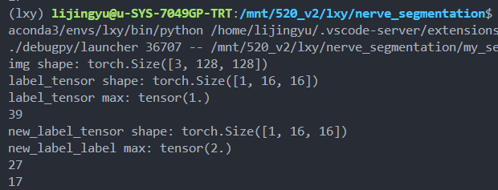

- DOING 跑其他可以尝试的模型
  :LOGBOOK:
  CLOCK: [2022-09-28 Wed 09:56:14]
  CLOCK: [2022-09-28 Wed 09:56:22]
  :END:
- DOING 尝试复现论文、阅读剩下一篇相关性很大的论文
  :LOGBOOK:
  CLOCK: [2022-09-28 Wed 09:56:49]
  CLOCK: [2022-09-28 Wed 09:57:31]
  CLOCK: [2022-09-28 Wed 09:58:03]
  :END:
	- DONE 先修改resnet101的结构吧
	  :LOGBOOK:
	  CLOCK: [2022-10-09 Sun 15:31:00]
	  CLOCK: [2022-10-09 Sun 15:31:02]--[2022-10-10 Mon 09:43:45] =>  18:12:43
	  :END:
	- DONE 完成损失函数的编写
	  :LOGBOOK:
	  CLOCK: [2022-10-10 Mon 09:48:41]
	  CLOCK: [2022-10-10 Mon 09:48:45]--[2022-10-10 Mon 17:15:18] =>  07:26:33
	  :END:
		- 预测值 不需要事先进行softmax  （N, C, H, W）
		- GT  不需要变成one-hot 直接为对应的类别即可  （N, H, W）
	- DONE 完成数据集的重新获取
	  :LOGBOOK:
	  CLOCK: [2022-10-10 Mon 09:48:54]--[2022-10-10 Mon 17:15:24] =>  07:26:30
	  :END:
		- 这篇文章很奇怪 没有说明怎么解决长度和宽度的问题 但是示意图中给出的却是完整的原始长方形
		- 这里的分割并没有上采样的过程，所以输出得到的分割和边缘预测结果必然不是原始的尺寸，而是缩小的尺寸。那么计算损失函数的时候应该是把GT缩小相应的大小，再来进行计算。
		- 这里需要原始尺寸的分割结果和将边缘视为新类别的新的分割结果。这里不需要从分割结果计算额外的边缘。
		- mask resize导致的问题实在是太严重了，导致每次resize到不同尺寸的时候就会出现新问题，因为这里是向下进行resize，信息会丢失，向下的程度越高，信息丢失就越多。这次有两个issue:
			- resize之后使用原本的阈值过滤感觉得到的图像很奇怪，所以到底要怎么重新设置阈值呢？先查看一下阈值化后的图片吧？
				- 
			- canny边缘检测的结果不对劲？感觉检测出来的不是正确的边缘，所以这是函数参数的设置问题还是说canny本身就没有办法做到百分比准确的边缘检测呢？
				- 
				- 
	- DONE 运行程序
	  :LOGBOOK:
	  CLOCK: [2022-10-10 Mon 09:49:11]--[2022-10-11 Tue 16:10:58] =>  30:21:47
	  :END:
	- DOING 调整学习率、aspp的输出维度，node的特征维度
	  :LOGBOOK:
	  CLOCK: [2022-10-10 Mon 09:49:19]
	  :END:
	-
	-
	-
- DONE 背诵20个多邻国单词
  :LOGBOOK:
  CLOCK: [2022-09-28 Wed 09:58:08]
  CLOCK: [2022-09-28 Wed 09:58:20]--[2022-09-29 Thu 16:09:07] =>  30:10:47
  :END:
- DONE 写《negotiate》的阅读感悟
  :LOGBOOK:
  CLOCK: [2022-09-28 Wed 09:58:41]
  CLOCK: [2022-09-28 Wed 09:58:57]--[2022-10-02 Sun 08:39:57] =>  94:41:00
  :END:
- DONE 修改摘要和introduction
  collapsed:: true
  :LOGBOOK:
  CLOCK: [2022-09-28 Wed 09:59:13]
  CLOCK: [2022-09-28 Wed 09:59:28]--[2022-09-30 Fri 07:44:56] =>  45:45:28
  :END:
	- 摘要：
		- 突出单独应用到resnet模型这个创新点
		- 提出的模型是怎么实现自适应的，自适应又体现在哪些地方
			- 对加权融合的改进我决定也可以提，不然作者完全不懂这个方法就不想再继续读下去了
			- 通过将普通加权求和中权重的作用对象从整个模型切换到单个特征值，
			- 在这篇论文中，我们尝试对普通的加权融合进行改进，权重的作用对象从整个模型切换到单个特征值。
			- In this paper,  we adapt the vanilla weighted averaging in terms of fusion object and weight calculation.
			- In this paper, we have improved the weighted average in the fusion scope and weight calculation, making it adaptive. We adopt a novel multi-group single feature fusion scheme, narrowing down the fusion scope from the entire model to each single feature corresponding to each position of the feature vector. Within every group of single features, a share latent embedding is utilized to decode their similarities and then obtain their relative importance in the form of weights. Therefore, we call the proposed as multi-group similarity-decoding-based weighted fusion mechanism, denoted as MG-SDWFM. We add an auxiliary output for each model to provide supervision, and devise a multi-output loss to help the model train in one pass.
			- In addition, the extension experiment and grad-cam analysis further proved the reasonableness of the fusion mechanism.
			- we switch the fusion object from the entire model represented by the whole feature vector to every single feature corresponding to every position of the feature vector,
			- 整个模型之间的融合  切换到  不同模型提取的特征向量上对应位置的单个特征值的融合  这个权重融合的新概念是多组单个特征融合
			- 为了关注单个特征的
			- 我们将原本的普通加权平均改成
			- 计算权重的方法是基于相似性的
			- 我们将模型之间的融合转化为
			- 多组特征融合是否是一个前后不一致的新概念呢
		- 对这个shared latent的作用解释得完全不清楚
		-
	- 引言：
		- 第一段的目的描写应该写一个更为general
		- 我们旨在通过融合不同模型的特征来更好地预测XX的病理状态，这个目的需要明确地写出来
		- BI-RADS4的诊断结果需要进一步分析，以确定良恶性，进而减少活检次数
		- 不需要写uncessaray
		- BI-RADS 4 诊断与钙化点关系要指明
		- 给出第二个创新点的描述
		- 把第一个创新点的描述进行精简，然后突出
- DOING 阅读关于社会养老的书籍、视频
  :LOGBOOK:
  CLOCK: [2022-09-28 Wed 14:30:48]
  CLOCK: [2022-09-28 Wed 14:30:54]
  CLOCK: [2022-09-28 Wed 14:31:02]
  :END:
-
-