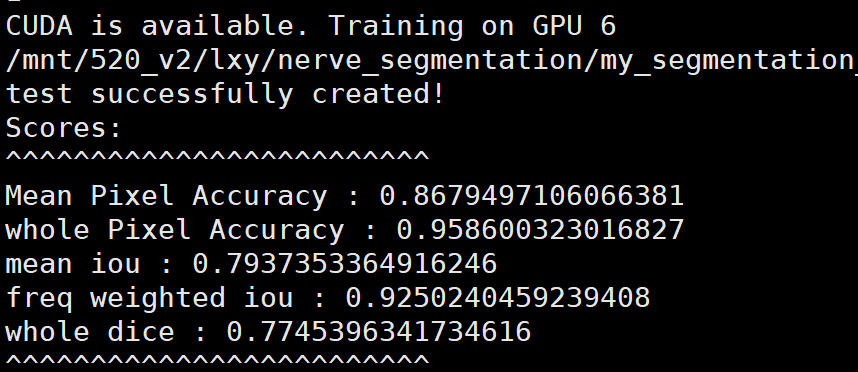

- 
-
- [[研究生毕设]]
  collapsed:: true
	- Dice，HD(HD95)，ASD(ASSD)
	- 其中HD95有多种工具，只有medpy可用
		- medpy.metric.binary.hd
			- 2D：https://blog.csdn.net/qq_36484003/article/details/114363112
			- 3D：https://blog.csdn.net/hpulittle_804/article/details/118367573
		- from mindspore import Tensor  
		  from mindspore.nn.metrics import HausdorffDistance （输入必须是Tensor类型）
			- https://blog.csdn.net/lijiaqi0612/article/details/113925215
		- from hausdorff import hausdorff_distance （必须是二维矩阵）
			- https://github.com/mavillan/py-hausdorff
		- surface-distance
			- https://github.com/deepmind/surface-distance
			- https://zhuanlan.zhihu.com/p/378796770
			-
			-
-
- from hausdorff import hausdorff_distance
  import numpy as np
  from mindspore import Tensor
  from mindspore.nn.metrics import HausdorffDistance
  import medpy
-
-
- [[研究生毕设]][[开题]]
	- 背景：
	  collapsed:: true
		- 乳腺癌的危害以及自动化的乳腺肿块分割对于诊断的积极意义
		- 搜集看看治疗乳腺癌的相关医学筛查和诊断技术，比较不同成像技术的优缺点
		- 乳腺肿块的2D超声图像有斑点噪声、低对比度、强阴影、非同质的分布（噪声和分布对结果的影响有多大呢，所以需要进行什么样的预处理）
		- 肿块和非肿块区域的边缘模糊、边缘丢失
		- 乳腺肿块的多样性：
			- 形状不规则（怎么用深度学习获取单独的、明显的形状信息）
			- 病人乳腺结构的个体差异大（搜集看看乳腺癌患者相关的数据：年龄分布、国家和地区分布、疾病致死率、疾病完全康复率等）
			- 大小还有分布方式很多
		- 超声图像中远处的像素点与乳腺肿块本身相似，使得区分难度增大
		-
		-
	- 实验数据集：
		- 论文里面有三个，看看能下载到几个
	- [[文献综述]]
		- 调研一下uncertainty-aware在分割中是怎么使用的
		- 对边缘的处理要进行分类和总结
		- 对输入进行增强的几篇文章
		-
-
-