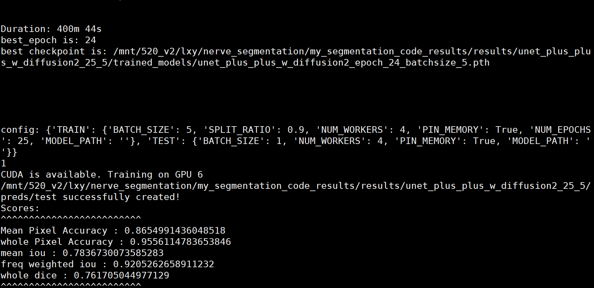

- 
- [[MathRoaming]]
-
- 五、参考文献（要求30篇以上，其中英文文献1/3以上，近五年文献1/2以上，并在开题报告中标注引用）
  [1] International Agency for Research on Cancer. World Cancer Report: Cancer Research for Cancer Prevention [EB/OL]. https://publications.iarc.fr/586, 2020.
  [2] 郑莹, 吴春晓, 吴凡. 中国女性乳腺癌死亡现况和发展趋势[J]. 中华预防医学杂志, 2011, 45(2): 150-154.
  [3] Munoz D, Near A M, Van Ravesteyn N T, et al. Effects of screening and systemic adjuvant therapy on ER-specific US breast cancer mortality[J]. JNCI: Journal of the National Cancer Institute, 2014, 106(11).
  [4] Islami F, Goding Sauer A, Miller K D, et al. Proportion and number of cancer cases and deaths attributable to potentially modifiable risk factors in the United States[J]. CA: a cancer journal for clinicians, 2018, 68(1): 31-54.
  [5] Berg W A, Zhang Z, Lehrer D, et al. Detection of breast cancer with addition of annual screening ultrasound or a single screening MRI to mammography in women with elevated breast cancer risk[J]. Jama, 2012, 307(13): 1394-1404.
  [6] Li Y, Li J, Wang Y, et al. Roles of cancer/testis antigens (CTAs) in breast cancer[J]. Cancer letters, 2017, 399: 64-73.
  [7]周星彤,沈松杰,孙强.中国乳腺癌筛查现状及进展[J].中国医学前沿杂志(电子版),2020,12(03):6-11.
  [8] Sahiner B, Chan H P, Roubidoux M A, et al. Malignant and benign breast masses on 3D US volumetric images: effect of computer-aided diagnosis on radiologist accuracy[J]. Radiology, 2007, 242(3): 716.
  [9] Xu Y, Wang Y, Yuan J, et al. Medical breast ultrasound image segmentation by machine learning[J]. Ultrasonics, 2019, 91: 1-9.
  [10] Ohuchi N, Ishida T, Kawai M, et al. Randomized controlled trial on effectiveness of ultrasonography screening for breast cancer in women aged 40–49 (J-START): research design[J]. Japanese journal of clinical oncology, 2011, 41(2): 275-277.
- Lei B, Huang S, Li R, et al. Segmentation of breast anatomy for automated whole breast ultrasound images with boundary regularized convolutional encoder–decoder network[J]. Neurocomputing, 2018, 321: 178-186.
   [15] Xing J, Li Z, Wang B, et al. Lesion segmentation in ultrasound using semi-pixel-wise cycle generative adversarial nets[J]. IEEE/ACM transactions on computational biology and bioinformatics, 2020.