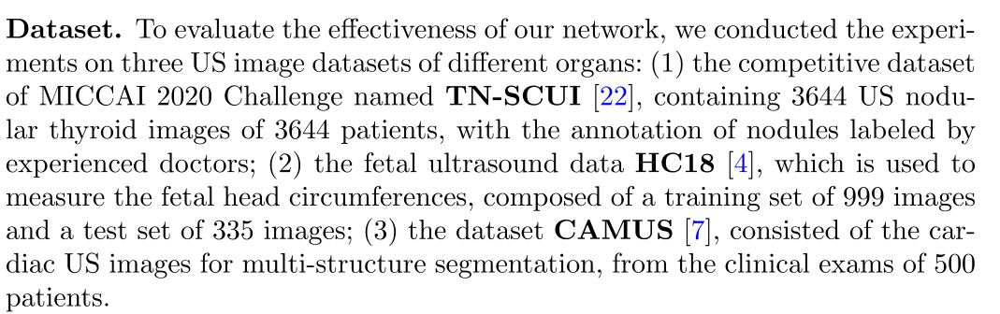
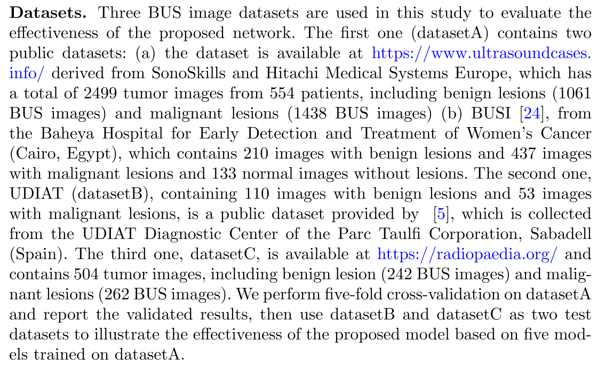
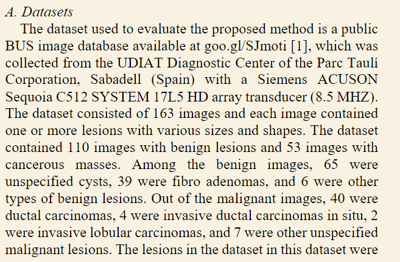
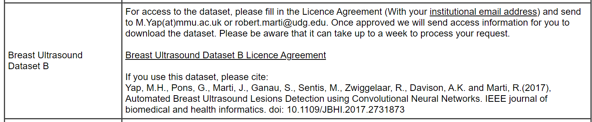

- [[PaperList]]
	- Dynamic  graph  cnn  for  learning  on  point  clouds 28 edge-conv
	- Hierarchicalpoint-edge interaction network for point cloud semantic segmentation, 54
	- Contrastive  boundarylearning for point cloud segmentation 55
	- senet:  Joint  semanticsegmentation  and  edge  detection  network  for  3d  point  clouds 56
	- Graph  attentionconvolution  for  point  cloud  semantic  segmentation 32
	- Chen L C, Barron J T, Papandreou G, et al. Semantic image segmentation with task-specific edge detection using cnns and a discriminatively trained domain transform[C]//Proceedings of the IEEE conference on computer vision and pattern recognition. 2016: 4545-4554.
	- Hayder Z, He X, Salzmann M. Boundary-aware instance segmentation[C]//Proceedings of the IEEE conference on computer vision and pattern recognition. 2017: 5696-5704.
	- Takikawa T, Acuna D, Jampani V, et al. Gated-scnn: Gated shape cnns for semantic segmentation[C]//Proceedings of the IEEE/CVF international conference on computer vision. 2019: 5229-5238.
	- Bertasius G, Shi J, Torresani L. High-for-low and low-for-high: Efficient boundary detection from deep object features and its applications to high-level vision[C]//Proceedings of the IEEE international conference on computer vision. 2015: 504-512.
	- Kirillov A, Wu Y, He K, et al. Pointrend: Image segmentation as rendering[C]//Proceedings of the IEEE/CVF conference on computer vision and pattern recognition. 2020: 9799-9808.
	-
- [[研究生毕设]]
  collapsed:: true
	- 其实就是当你参考的资料太多的时候，反而无从下手了，就按照最开始的思路来，想到什么写什么，后面想到再补充，想错的直接修改就行了
	- 传统方法
		- 传统方法进行分割具体是怎么做的呢？这里的传统方法是说手工方法还是说机器学习方法？
			- 传统方法中需要手动裁剪出以肿瘤为中心的感兴趣区域并进行复杂的预处理和后处理：
				- [10] A novel segmentation approach combining region- and edge-based information for ultrasound images
				- [11] Segmentation of breast ultrasound image with semantic classifcation of superpixels
			- 分为四类：基于区域的方法、基于可变现的模型、基于图的方法、基于学习的方法
				- 这些方法通常使用纹理特征来表示像素强度的局部变化，然后检测异常超声图像中的区域。然而，这些方法依赖于手工制作的特征，表示能力有限
		- 超声AI的培训问题，这个一定要提出来，这是一个十分重要的工程应用价值
		- 把分割的作用再具体化一点
		- 直接放几张乳腺的超声图像说明一下
		- 需不需要指出乳腺分割与乳腺癌的良恶性密切相关  可以一句话指出
		- 咋感觉传统方法里面的描述非常少，而且感觉不一致，就简单的把传统方法综合一下吧，反正不重要，但是需要罗列出来，因为这样比较全面；重点是对深度学习的方法进行分类，其实我觉得residual feedback和uncertainty都是去把分割的不好的像素点的特征去进行增强；
		- deep snake应该是属于动态轮廓模型的深度学习化的结果
		- 我那个diffusion denoise也相当于是把传统方法给深度学习化
		- 将长距离依赖和上下文信息包含在网络当中
	- 深度学习方法
	- 边缘问题
		- 损失函数
		- 增加边缘检测的分支为分割提供额外监督
		- 分割和分类信息进行结合
		- 分类和分割合并成一个任务
		- 增强边缘处的特征
		- 利用Unet来作为模型的基础架构
		- 我在想你现在的这个技术路线并不一定非得是最后的技术路线啊
	- 超声图像分割的综述  剑桥大学
	- 其实我感觉技术路线应该就三个方向：
		- 一是怎么显示地捕获边缘信息
			- Global guidance那篇论文预测额外的边缘
			- 其他几篇通过分支进行边缘检测的
			- 改变Unet编码器和解码器的连接方式，利用不同层级的信息融合输出边缘结果
		- 二是怎么对uncertainmap不确定的特征进行增强
			- 基于损失函数（boundary iou loss）
			- 进行特征增强  residual feedback  + cascade
			- patch快划分导致的，我记得这一篇说的是 [[CF2-Net: Coarse-to-Fine Fusion Convolutional Network for Breast Ultrasound Image Segmentation]]
		- 三是怎么捕获全局的感受野（空间注意力机制和通道注意力机制是否能够合二为一）
			- [[Global guidance network for breast lesion segmentation in ultrasound images]]
		- 四是怎么关注到感兴趣区域，排除无关ROI区域的特征干扰
		- 五是怎么和分类进行结合
			-
		- 既增强特征也进行边缘检测的
			- [[icpr-2020-Boundary-aware Graph Convolution]]
		- 隐式地捕获边缘信息
			- DU论文
		- 将边缘分割和中间分割任务给区分开来
		- 在输入端增加边缘信息
			- [[CF2-Net: Coarse-to-Fine Fusion Convolutional Network for Breast Ultrasound Image Segmentation]]
			- [[Breast ultrasound tumor image classification using image decomposition and fusion based on adaptive multi-model spatial feature fusion]]
		- 利用多任务
		- 对边缘进行回归预测的
		- 对Unet的高频细节和低频细节进行思考的，因为浅层特征会关注非肿块区域，而深层特征会关注肿块区域
		- 双边过滤GCN的文章
			- [[ICCV-2021-Graph-BAS3Net: Boundary-Aware Semi-Supervised Segmentation Network with Bilateral Graph Convolution]]
		- 可以增加一个类别叫做基于GCN的吗
- [[研究生毕设]][[数据集]]
  collapsed:: true
	- 
	  collapsed:: true
		- nodular thyroid 甲状腺结节
		- fetal head circumferences 胎儿头围 （胎儿的头的周长）
		- cardiac 心脏的
	- 
	  collapsed:: true
		- https://www.ultrasoundcases.info/ [[NotFound]]
		- Yap,M.H., et al.: Automated breast ultrasound lesions detection using convolutional neural networks.IEEE J.Biomed.Health Inform.22(4)，1218-1226(2018) [[NotFound]]
		- https://radiopaedia.org [[NotFound]]
	-
	- BUSI数据集 [[Found]]
		- W.AlDhabyani,M.Gomaa,H.Khaled,A.Fahmy,Datasetofbreastultrasoundimages,Datainbrief28(2020),doi:10.1016/j.dib.2019.104863.
	- OMI 数据集 [[Found]]
		- http://www.onlinemedicalimages.com/index.php/en/component/record/,(19April2012).
			- 需要一张张进行下载，可以写程序完成
	- Dataset B [[NotFound]]
		- Automatic tumor segmentation in breast ultrasound images using a dilated fully convolutional network combined with an active contour model
	- 
		- goo.gl/SJmoti [[NotFound]]
			- [1] M. H. Yap, G. Pons, J. Marti, S. Ganau, M. Sentis, R. Zwiggelaar et al., “Automated breast ultrasound lesions detection using convolutional neural networks,” IEEE Journal of Biomedical and Health Informatics, vol. 22, no. 4, pp. 1218-1226, Jul. 2018.
				- To obtain Dataset A, the user needs to purchase the didactic media file
				  from Prapavesis et al. [16]. 需要付费
				- http://www2.docm.mmu.ac.uk/STAFF/m.yap/dataset.php
					- 
					-
- [[主题调研]]
- 