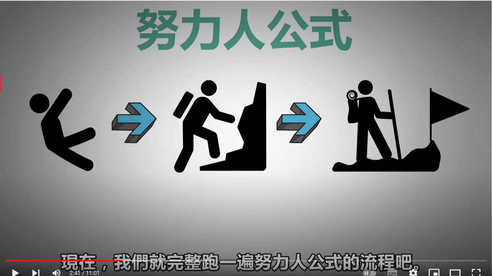
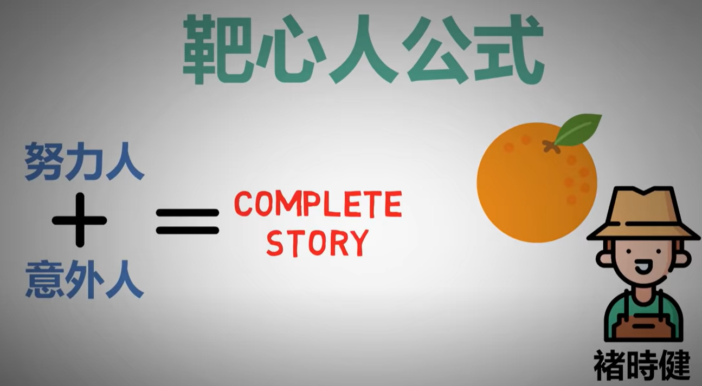
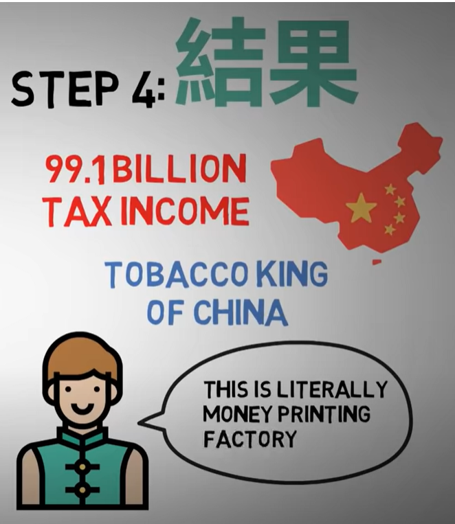
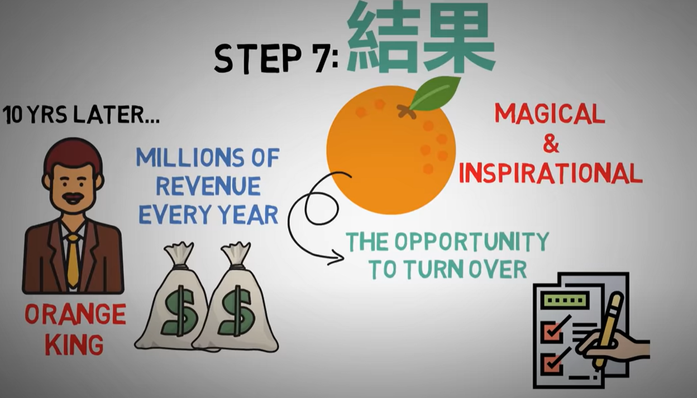

- {{youtube https://www.youtube.com/watch?v=Wc4SxBkfT54}}
	- [[故事(Story)]]
		- [[努力人公式]] 主角历尽千辛万苦夺取胜利
			- 
			- 第一步：目标
				- 登上世界第一高峰
			- 第二步：阻碍
				- 忙于事业而患上癌症，但只剩下三个月去完成梦想
			- 第三步：努力的过程
				- 体力很快丧失；天气恶劣；疾病复发
			- 第四步：努力人的结果
				- 在最后一口气时登顶
			- 核心：努力，再努力，极端的努力
		- [[意外人公式]]
			- 强调[[Unexpectable]]]，比如主角登上最高山峰后意外跌落悬崖，发现比登上世界第一高峰还要重要的事情，因而展开了一段不可思议的人生旅程。
			- 核心：意外是叙事情节，而转弯后新的人生目标才是重点
			- 步骤：
				- 第一步：目标
					- 为了政治联姻而需要去登山
				- 第二步：意外
					- 联姻方的国王派人暗杀主角，在山顶将主角推下山崖
				- 第三步：转弯
					- 男主落入神秘山洞，被生活在这里的异族部落的公主救下
				- 第四步：结果
					- 男主成为异族部落的继承人，然后报复了原来的国外，创办了一个新的国家
		- [[靶心人公式]][[Cases]]
			- 
			- 步骤：
				- 第一步：目标
					- 褚时健是个农村小孩，但想成就一番事业；
				- 第二步：阻碍
					- 褚时健在战场上当过兵，性格直接且执著，容易得罪人
				- 第三步：努力
					- 跳过烟草公司，直接向烟农买货，与当地供销局、税务局合作后自己铺设专卖店，自己卖货
				- 第四步：结果
				  collapsed:: true
					- 
				- 第五步：意外
					- 匿名举报信举报褚时健贪污300w美金，因为褚时健的月薪只有3000，被判无期徒刑
				- 第六步：转弯
					- 褚时健因为身体不好，办理了保外就医；回到农村老家，承包起荒山种橙子，准备[[StartOverAgain]]
					- 被赋予“翻身橘”的内涵
						- 
-