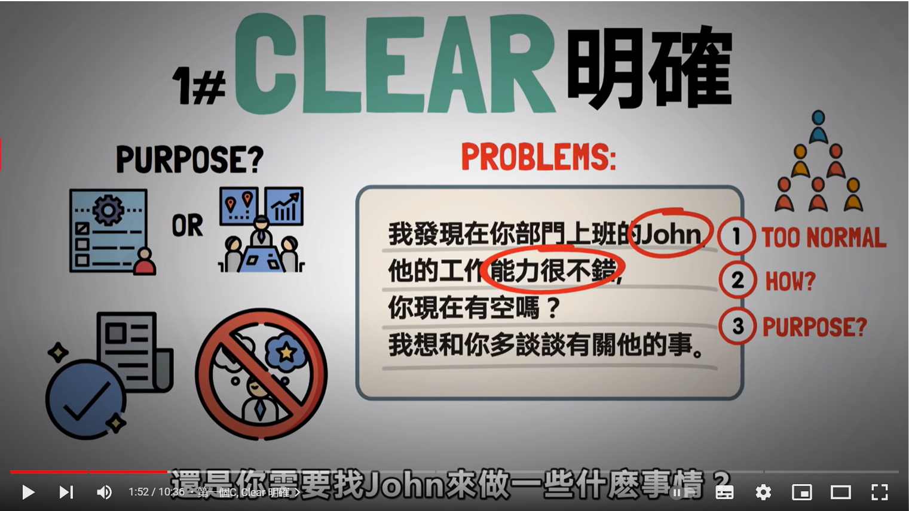
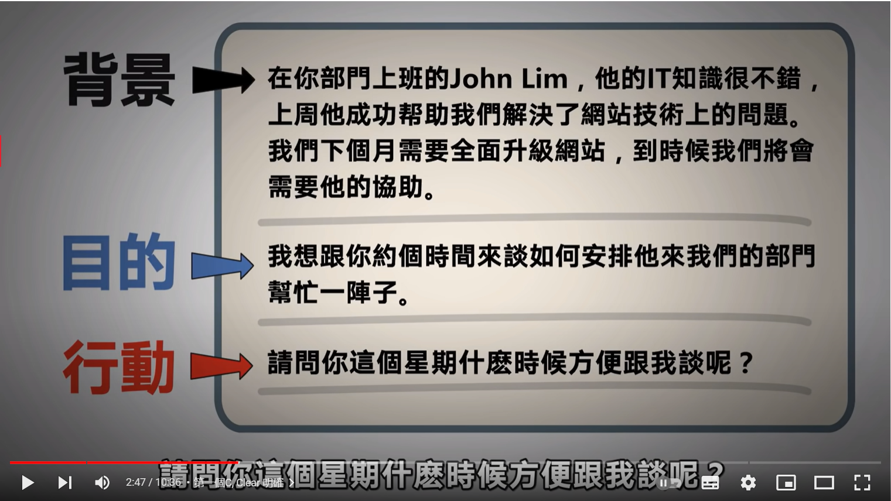
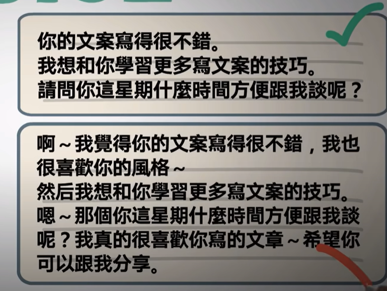
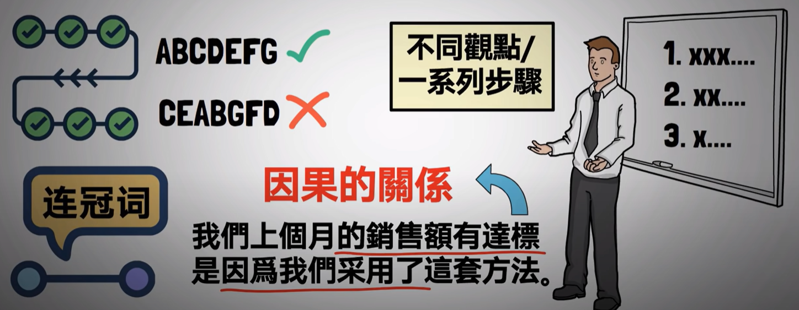
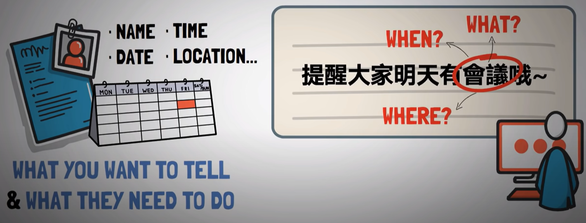
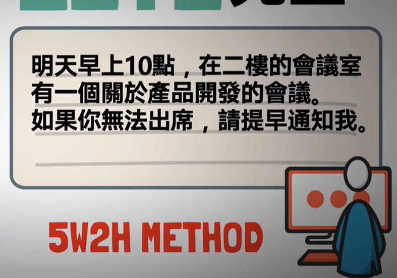

- {{youtube https://www.youtube.com/watch?v=lWHQuSYaRDo}}
	- [[ExpressionSkills]]
		- [[表达能力的7C原则]]是什么？
			- [[Clear(明确)]] [[#red]]==不能让对方有可以假设的空间==。比如名字最好不能是太常见的，可以用完整的姓名来明确标识一个人；描述某人的某能力，要用他或者她具体完成的事情来说明；描述目标时要有参与对象、参与时间、具体做什么等具体表述。
			  collapsed:: true
				- [[#green]]==描述的策略是：[[背景]] =》[[目的]] =》[[行动]]。== 这个[[行动]]是一个具体的行动方案或者行动诉求，或者说是[[提供选项]]，能更加[[促进目的的实现]]
				  collapsed:: true
					- 
					- 
			- [[Concise(简洁)]] [[#red]]==把废话去掉，让你的表达内容更精简；尽量只用三句话；减少口头语的使用；表达过的观点不要重复，会让人觉得啰嗦==。
			  collapsed:: true
				- 
				-
				-
			- [[Consistent(一致性)]] [[#red]]==要确保说的话是前后一致的，不然会给人一种不信任的感觉；==
				- 当两人辩论时，最好直接表明自己的立场，然后添加上理由或者补充说明，因为当你同时认为这两种事时就是一种不一致了
				- [[内容]]、[[语气]]、[[肢体语言]]也是要有一定的一致性
			- [[Correct(正确)]] 是为了避免一些不必要的[[误会]]
			- [[Coherent(连贯性)]] 不同观点之间要前后连接起来
			  collapsed:: true
				- 
				-
			- [[Complete(完整)]]
			  collapsed:: true
				- 
				- 
				- [[5W2H]]
					- WHAT+WHY+WHEN+WHERE+WHO+HOW+HOW MUCH
			- [[Courteous(礼貌)]] 就是使得每句话亲切且开放
				-
-