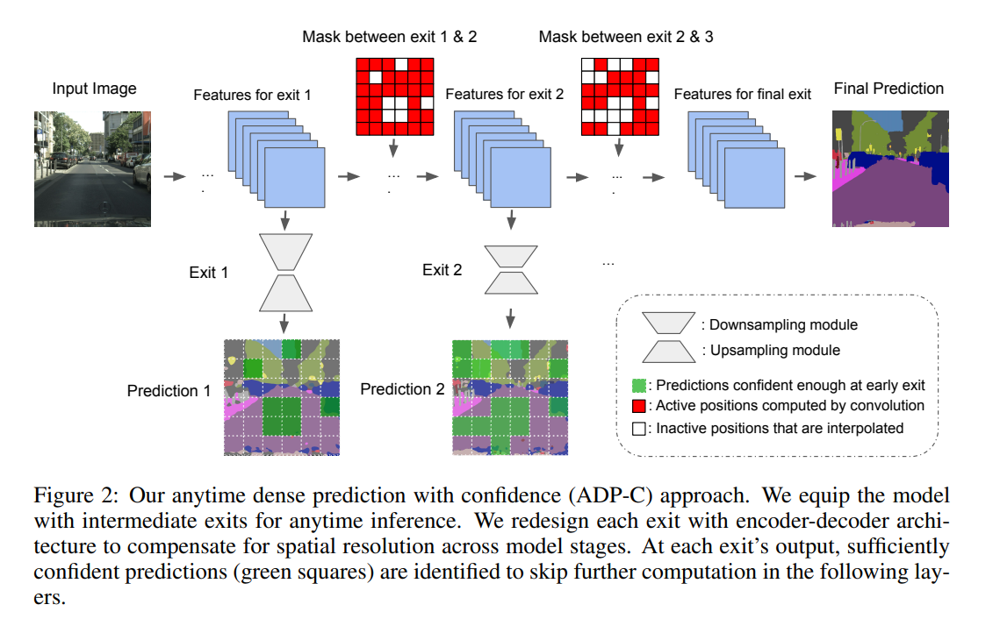
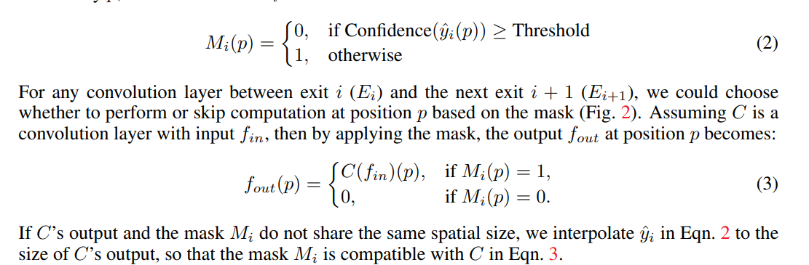
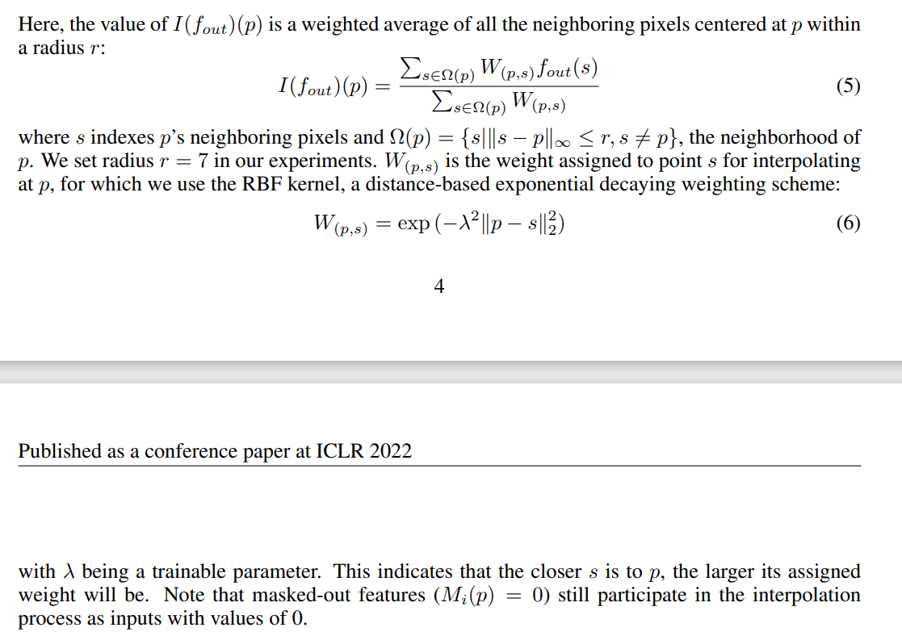
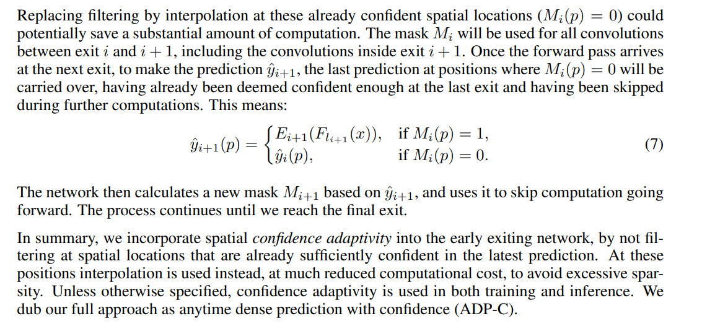

- 贡献：
	- 提出了一个 **利用置信度来实现实时密集预测** 的网络 ADP-C，这是一个统一且端到端的模型
	- 其能够在不损失准确性的前提下极大降低计算量
	- 与 其他的  深度等价网络  和 基于特征的随机抽样  对比，其 实现了 性能-计算量 的 最佳平衡
- 论文创新点：
	- 重新设计了“exits”，并且 引入了置信度的自适应性
- 论文模型：
	- 一个重要的知识前提：
		- 实时推断中，用户可以依据当前的输入或者事件来终止  推断过程。对于每个计算实例，其计算负担由 时间 和 输入 这两个变量来决定；计算负担可以是时间无关的，也就是说可以只与输入有关，而与外部的任何事件都无关。实时推断的输出与计算负担是息息相关的。
	- 整体架构图：
		- 
	- 整体思路的描述：
	  collapsed:: true
		- 重新设计的"Exit":
			- 实时推断已经被成熟用于图片分类当中，**但是还没有在图像分割中得到大幅应用**
			- 正常的普通分割是只有一个出口来输出预测结果，但是实时推断中是：**将中间的特征提取层 按照先后顺序拆解成 多个层，每层作为一个新的分支或者说新的“Exit”,  这样多少个出口就会对应多少个预测分割结果，同时这些分割结果的损失之和来作为整体的损失函数**
			- 将[[#red]]==原本单纯由卷积组成的"Exit”== 设计成 [[#red]]==Unet类型的结构==
				- 结构：连续的“池化-卷积”（池化是为了增加感受野，卷积是为了提取更粗糙的特征）、连续的“双线性上采样-卷积”
				- 注意：
					- 每个exit的上下层数不一样：**越早的Exit其能够提取到的特征越细节，会有更多深度和感受野上的限制，因而也具有更多的噪音和不准确的预测结果，所以越早的Exit需要更多的下采样层**
					- [[#green]]==每个exit的U型结构的层数 = N - i (N为出口的总个数，i为该出口的序号)==
		- 置信度自适应：
		  collapsed:: true
			- 原因：
				- **模型预测图像中每个位置的结果 都 花费几乎相同的计算量，但是的确部分像素点比其他像素点要更容易分辨**
			- 基本思路：
				- 选择预测概率向量（或者说所有类的预测概率）中的最大值，然后进行阈值化，大于该阈值的标记为0，小于该阈值的标记为1，只有标记为1的这些像素点才被继续用于下一个出口的预测
					- 
					- 因为当前出口的输出特征图 A 和 下一个出口的输出特征图 B尺寸大小一般不一样，而mask的尺寸是和 当前出口的输出特征图A 一致的，所以需要：先将当前出口的输出特征图A 调整到 和 B一样大，也就是resized_A = B. 然后再从resized_A上通过阈值化获得mask，再用mask来对B的结果进行过滤
					-
				- 但是这样造成的缺陷是：下一个出口经过卷积得到的输出结果会非常稀疏，在很多位置都是0，这会损害进一步的卷积计算。解决方法是：
					- [[#red]]==[[#green]]对阈值化后为0的像素点进行邻居插值运算，使用的是一定半径范围内的加权求和，加权的权重使用RBF核来进行计算；阈值化为0的像素点仍然参与计算过程。==
						- 
					- 这种用插值来取代过滤掉的方法确实可以潜在节约相当一部分计算量
					- 出口i和i+1之间的所有卷积都会使用这种mask方式，这个过程一直持续到最后一个出口为止；[[#red]]==将空间上的置信度自适应 整合进 早期的出口网络当中，而不是直接过滤掉预测已经非常确信的空间位置==
						- 
	- 课题思路：
		- 尝试在Unet的连续的4个编码器层或连续的4个解码器层使用这种多个出口之间uncertainty进行传递的方法
		- 在原本的uncertain-map方法中同样不使用完全过滤的方法，而是也增加插值过程；结合MICCAI那篇的论文思考到底如何进行迭代，本论文相当于是前后迭代，MICCAI相当于是对自身的迭代
		-
- [[研究生毕设]]
	- 思路1：
		- 因为这里是要从特征图卷积后的输出中获取uncertainty-map, 而编码器输出与分割结果的关系不够直接，[[#red]]==所以只在解码器之间进行==
		- 解码器如果个数过多的话，会验证影响计算效率，一方面是因为从当前解码器到上一个解码器需要mask和插值运算，另一方面是多输出的损失函数收敛会更慢。所以[[#red]]==这里考虑从U型结构的从底向上的连续2层、连续3层，越往上分辨率越大误差越大==
		- 这里并[[#red]]==没有在每个分割结果的输出使用论文中的小型Unet==，因为我觉得这样的话参数量太大了，只用了普通的卷积
		- 后续思路：将多输出换成小型Unet
	- 思路2：
		- 不采取多输出，只在最后一层的输出进行自身的迭代过程，[[#red]]==每次得到的uncertainty-map中的为0利用插值法进行插值，然后进行第二遍的阈值化==，再对阈值化后为0的像素点进行特征增强
		- 但是，现在不知道要何时让这个自身迭代终止？得看参考的那篇论文代码才能理解。论文中的迭代次数应该是个动态的参数。
			- 直接把迭代次数当成超参数，使用调参来确定效果，但是这个在不同数据集上就得重新凋参，围绕这个方法做了实验：
			- 设计了两个类型的指标：
				- 绝对指标： 本轮迭代中图像中0的像素比例超过95%或者1的像素比例小于5%
				- 相对指标：就是本轮迭代结束后图像中1的像素个数和迭代之前图像中1的像素个数之比，当这个比例连续5次达到95%时，停止迭代过程