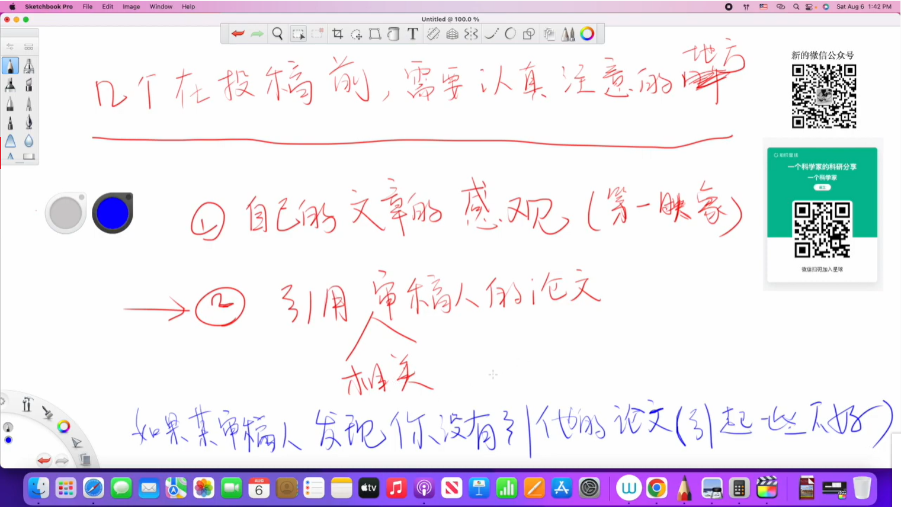
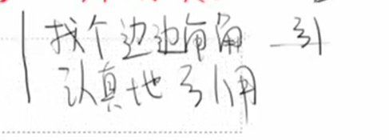
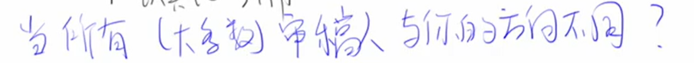
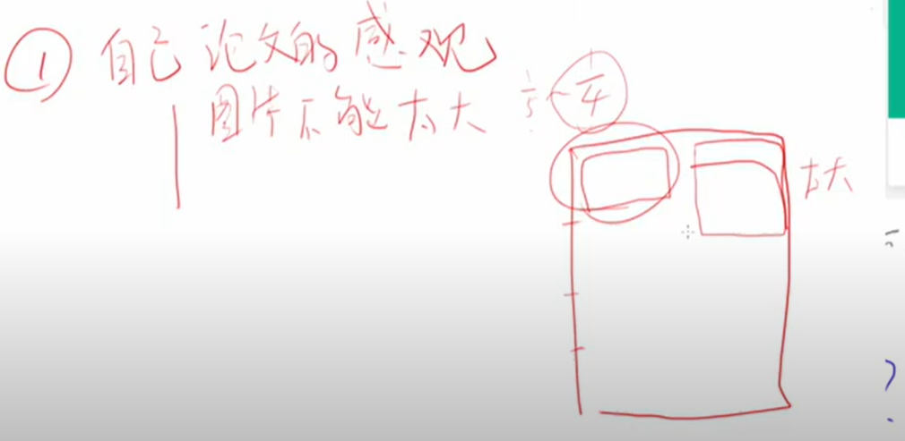
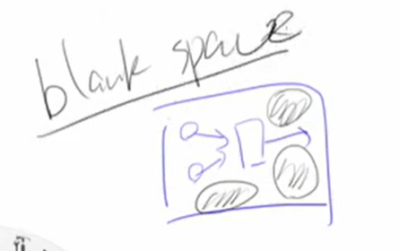

- # Points
	- 记录做学术中的一些经验和感悟
	- 整理一些实验设计的知识
	- 构建自己学术工作的一个framework
-
- # Knowledge
	- ## 投稿
		- 
		- 
		- 
		- 
		- 
			- 内容要丰富，不要留太多空白
			- 信息量大的图片大一点没有特别不舒服
			- 图片中的字体大小最好与论文一样，或者稍微小一点
			- 直接打印出来或者直接用软件打开时图片上的文字必须清晰
			-
			-
			-