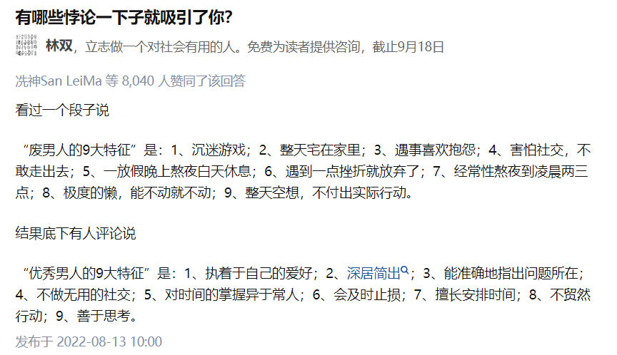
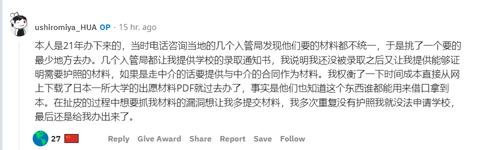
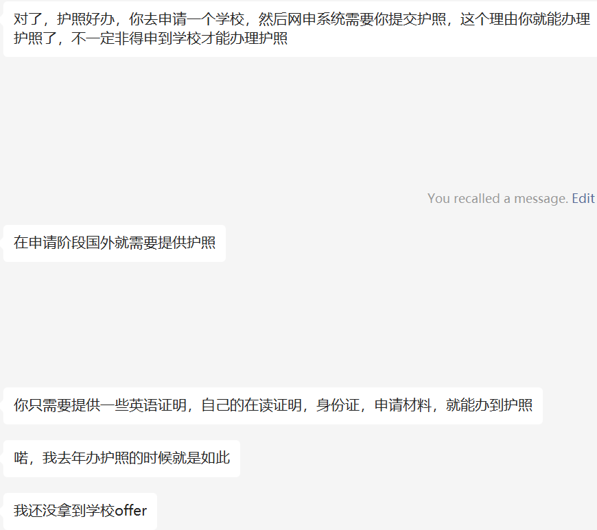
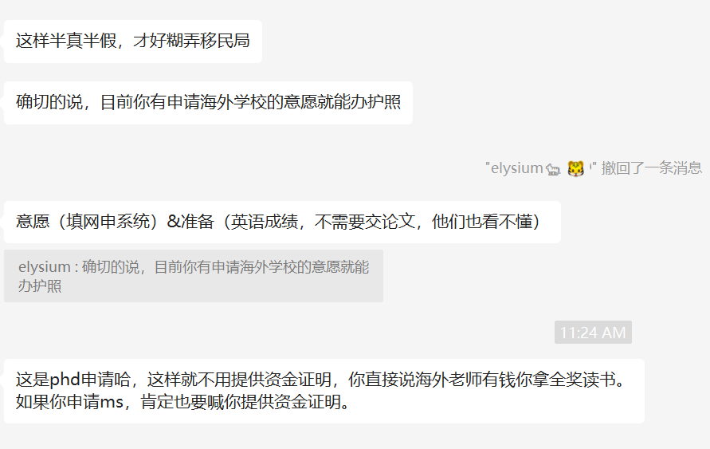
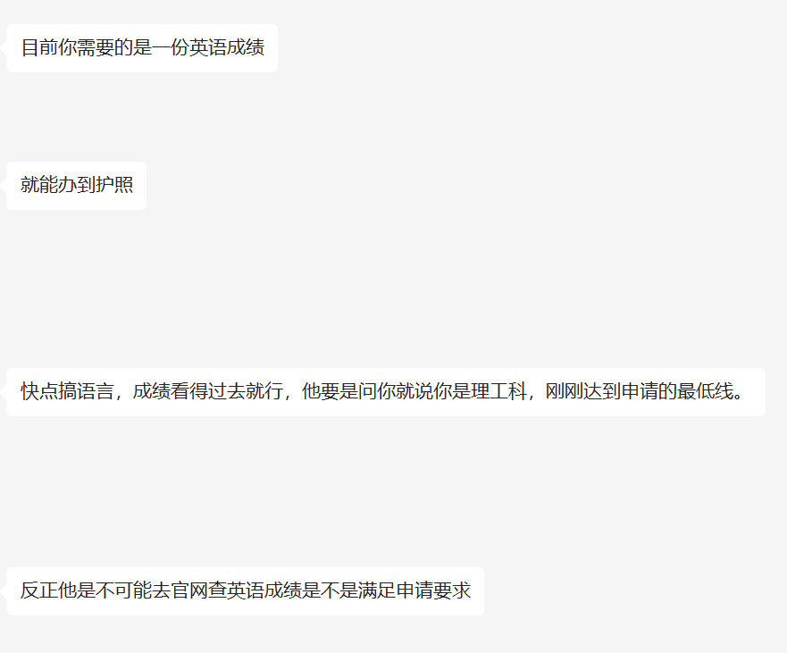
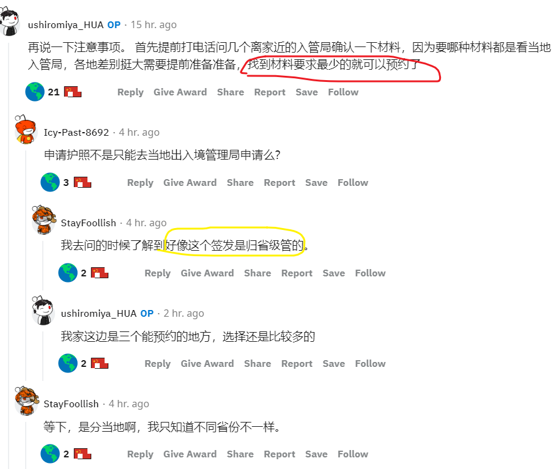
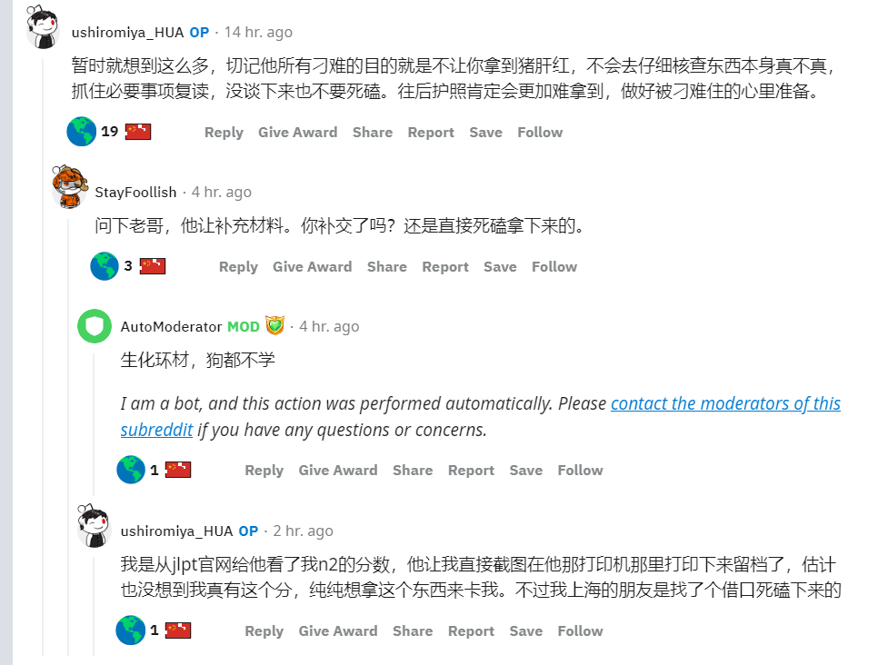

- # Decisions and Determinations
  collapsed:: true
	- Decisions
	  collapsed:: true
		- [[Aug 20th, 2022]]
		  collapsed:: true
			- 首先，去美国读phd，满足以下几个硬性条件：
			  collapsed:: true
				- 找到特别感兴趣的偏系统应用和工业界应用的方向
				- 套磁到相对不错的导师
					- 人品
					- 资金
					- 指导
					- 资源
					- 人脉
				- 自己对于该研究领域有一定的工作积累
			- 资金不足，能够找到不错的德国导师和博士项目，就必然去德国读phd
				- CSC的奖学金目前是尽量想不申请就不申请
				- 尽量是工作制的博士合同，企业制合同由于存在风险需要慎重
				- 选择毕业要求中等难度的或者说是可以写一本厚书作为毕业答辩结果的
			- 再其次，就只拿到美帝硕士学位来薅帝国主义的羊毛
				- 如果薅羊毛政策变动，才考虑加拿大读硕士 或者 国内直接跳槽加拿大
				- 到时候需要重新再考虑其他机会
			- 对德国和美国纠结最大的原因：
				- 美国是个机会场，但未必能轮到我们这样的人，凤姐在美国有机会、sara在美国有机会，但这些机会一方面优秀的国人竞争激烈，去了之后大多数时候还是得与自己的同胞进行卷的斗争，另一方面在美国这样宏大的繁华场面前我这样的普通人更容易迷失自己。德国读好处就是相对小众、安静、沉稳，在培养了这样的能力之后再去美国不妨是个更好的选择。
				- 德国的英文环境没有那么好，我更喜欢沉浸式英文环境；德国的生活相对美国更枯燥，缺少中餐美食。
	- Determinations
	  collapsed:: true
		- 一定要润：
			- 为了思想上的自由
				- 虽然任何媒体任何国家都带有自己起码的立场，但是起码别的媒体有基本媒体人的职业能力，而不是幼稚到只会哄骗和愚弄百姓。
				- 外文书籍里面有不少珍贵的思想和科学知识，了解这些能帮助我不断破除认知的边界、破除思想上的框架、打破现有的约束
				- 最起码能随时随地主动地表达自己的思想，为自己发声，能毫不怯懦地与别人展开辩论
			- 为了基本权利的自由
				- 国内的财富和权利是被极少部分的5%所掌控，而这5%的人，变异者居多，从善者可怜见的，且制度和文化的底层垃圾无法根除
					- 具体来说，有一些事是你在国内一辈子也做不到的：
						- 购买独立的house。国内在稍微好一点的二线或者新一线城市买房都只能是公寓，而且还面临着多年贷款压力巨大、烂尾楼、房屋质量差、被gov强制搬迁、农村土地进一步被特区阶级掌控等
				- 随时接受教育的权利
				- 弱小者被尊重，也能拥有选择的权利
			- 一些永远会存在的烂事：
				- 银行让用户为自己的坏账买单
				- 根本不会教育，只会做技术和体力式的培训
				- 只会不停息的内卷、相互攀比、思想雷同单一
				- 根本没有法律意识，法律变成了为自己意志所操纵的工具
				- 人与人之间其实隐藏的敌意很深，真正的友好四处难寻
				- 人的身体健康和身心健康从未被真正正视过，一切都变成了数字GDP的螺丝钉和工具
			- 为了自己的自由
				- 能follow my heart and dive into sth I love, 能让执着变成真正的执着，能让坚持变成有意义的坚持，能让心流贯彻始终
		- 润学必须坚守的原则：
			- 越早越好，只有出去了才能有可以争辩的机会，就算现实不总是理想，坚定下去总能分外开明，也能别有一番冻天
			- 英语，特别是口语、听力这种沟通能力极其的重要，因为阅读和写作拥有更多的工具可以辅助
			- presentation的能力极其主要，完整、准确、有逻辑地表达自己
			- 要尽可能地多的赚钱、攒钱
			- 不要跟没有这个意愿的人进行任何无效沟通，你以为你把有用的知识分享给了他们，到头来却只被嫌弃和孤立。
			- 网上信息量过大，要及时地获取的信息进行整理和鉴别，千万不要贪多和心急。
			  collapsed:: true
				- 看见一个有用的点就记录一个点，产生一个不同的新想法就记录新的领悟。但是有个点就是，同样的东西用两种悖论解释起来看上去都会很合理，于是很多人就不停地在两种观点之间来回纵跳，比如像下面这个图所展示的，我觉得解决这个问题的关键在于对问题的细节、问题本身的定义和范围有准确的把握，下面这个图： 
					- 后面的一种表述更明显具有更为广泛的内涵，将这两种表述甚至于将这两种表述内容本身的定性归结于同一类很明显是毫无道理的，“执着于本身的爱好”这种行为是没有对错好坏之分的，执着或者不执着都只是基于个人情况的选择，有些人没有执着自己的爱好而是在其他方向上执着，区别在于“执着的”这个爱好在人们心中的价值感是不一样的，“游戏”如果被视为影响个人进步的爱好，则定性就是贬义，如果视为电竞比赛的训练，则定性就是褒义，所以很多时候的悖论是由于人民的主观情感倾向和价值观判断产生的，这与问题本身实际上没有任何关系。产生一个想法时，记得追问4点：
					  collapsed:: true
						- ValidateAnIdea
						  collapsed:: true
							- 这个想法是否存在其他可能的解释？
							- 这个想法可以分为哪些子步骤，每一步要如何进行佐证？
							- 这个想法隐含了什么样的价值判断和情感倾向？
							- 这个想法的上层源头是什么？
			- 要构建起自己出国所需要的朋友圈
		- 润学计划的注意事项：
			- 为了更好地看到自己的进度，就在这个板块按照天为单位记录润的efforts and progresses。如果什么都没做，也如实地写。
			- 微信群里获取的新消息，按照模板MessageAnalysis进行整理。
			-
			-
		-
		-
		-
-
- # Systematic Knowledge
	- ((62fdf22f-2f55-49d4-abcf-63204ea529c1))
	- ((62fdf22f-2f55-49d4-abcf-63204ea529c1))
	- ((62fdfd39-408a-412a-b484-6d9dae655635))
	- [[签证申请]]
	- [[护照办理]]
		- 
		- 
		- 
		- 
		- 
		- 
		- 
		- 
		- https://www.reddit.com/r/iwanttorun/comments/ycdf9y/%E5%88%86%E4%BA%AB%E6%9C%AC%E4%BA%BA%E6%8B%BF%E5%88%B0%E6%8A%A4%E7%85%A7%E7%9A%84%E7%BB%8F%E5%8E%86%E5%92%8C%E9%9C%80%E8%A6%81%E6%B3%A8%E6%84%8F%E7%9A%84%E7%82%B9/?sort=top
	-
	-
-
- # Blank to be filled
  collapsed:: true
	- 美国银行卡
	  collapsed:: true
		- 需要办理哪些银行卡？各自的目的是什么？
	- 美国出行前准备
	- 美国基础文化知识预备
	  collapsed:: true
		- 宗教基础知识
	- 选校
	  collapsed:: true
		- 地理位置
		- 毕业时长
		- 毕业去路
		- 话费开销
		- 工资收入
		- 前途
	- 陶瓷
	  collapsed:: true
		- 可以提前陶瓷做项目？
		- 陶瓷在网申系统之前还是之后？大概在什么时间节点？
-
- # Run Examples
  collapsed:: true
	- 
-
- # Piecemeal Knowledge
  collapsed:: true
	- Electrical Engineering and Computer Sciences EECS
	- AI system方向可能偏应用？
	- 德国的企业博士：
		- https://www.bosch-ai.com/
		- https://www.research-in-germany.org/en/your-goal/phd/two-ways-to-get-your-phd.html
		- https://india2germany.com/interview-with-dr-ajay-pai/
		- https://www.quora.com/What-companies-in-Germany-offer-industrial-PhD-opportunities
		- https://scholarshipdb.net/scholarships-in-Germany?q=Computer%20Science
		-
		-
-
-
- # 2022-Running-Marathon
  collapsed:: true
	- [[Aug 20th, 2022]]
	  collapsed:: true
		- 最终百分百确定了润
		-
		-
- # 2023-Running-Marathon
- # 2024-Running-Marathon
-
-
-
-
-
-
-
-
-
-
-