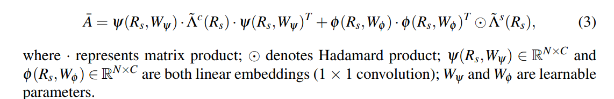

title:: BI-GCN: Boundary-Aware Input-Dependent Graph Convolution Network for Biomedical Image Segmentation

- 
	- 后面的 XX^T = （N, C) × (C, N) = (N, N)，字面意思是计算出了N个结点的嵌入表示之间的相似性，是一个对称矩阵。与后面的 (N, N)进行按位相乘的含义是什么呢？因为后面的除了对角线上的值都为0，所以最终它计算的结果也是除了对角线其他的值都为0，感觉像是结点之间的相似性  除了利用嵌入值还得利用到其他信息。这里前面计算出来的(N, N)中对角线上的是不是都是1呢？应该不是，不然前面这个运算就毫无意义了
		- 为何后面这里不是继续矩阵相乘呢，（N, N) × （N, N) = (N, N)，如果说此处的对角是为了引入空间注意力的信息，也就是为了引入不同顶点的权重，为何只在结点自身的相似性处进行引入呢？很奇怪
	- 前面的这半个公式就更奇怪了，为啥不采用跟后半个公式一样的形式？应该是矩阵维度的原因。前半个公式的中间的对角矩阵是（C, C) 。前半个公式使用的都是矩阵相乘，并没有使用哈达玛积，（N, C) × （C, C) 相当于是对(N, C)的每一列乘上了（C,C)中对应列的对角值，彷佛是每一列C都乘上了对应的权重。（N, C) * (C, C) * (C, N) = (N, C) * (C, N) 的结果彷佛是计算结点相似性时考虑到了不同通道的重要性。
	-