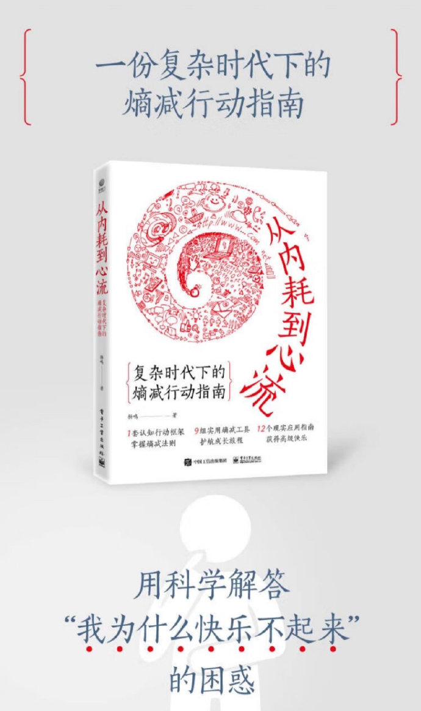
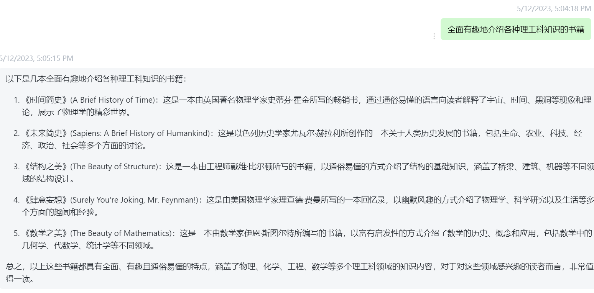
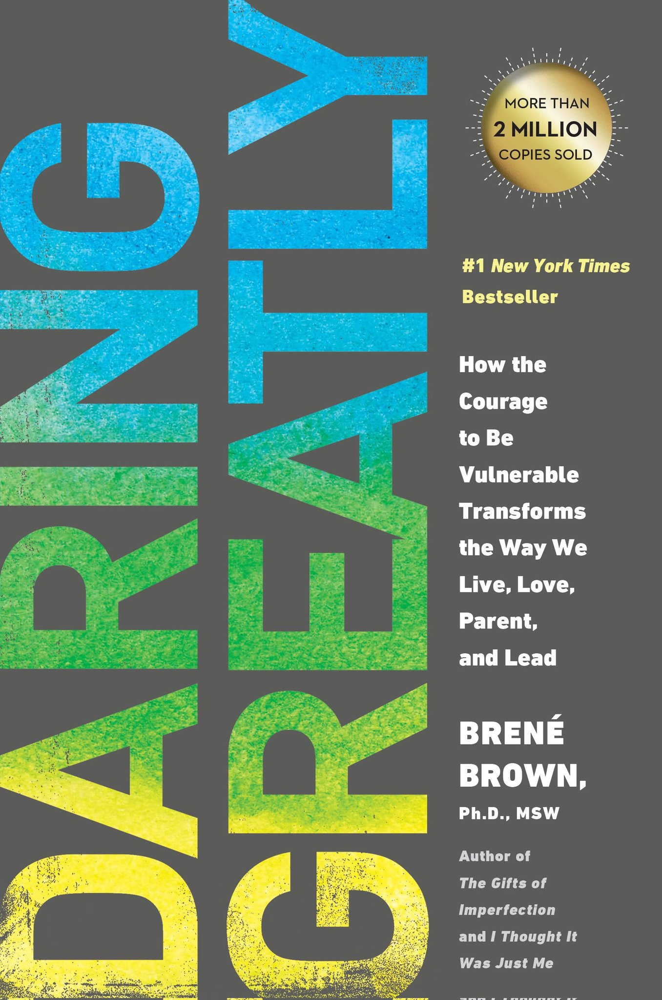
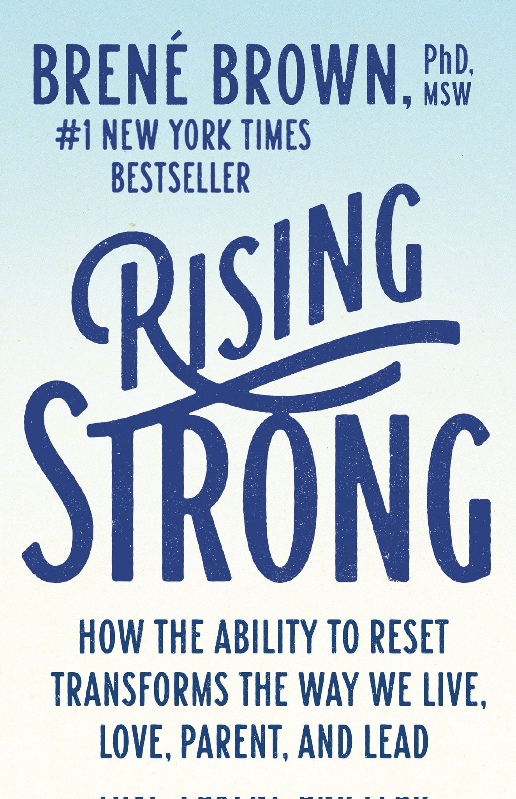
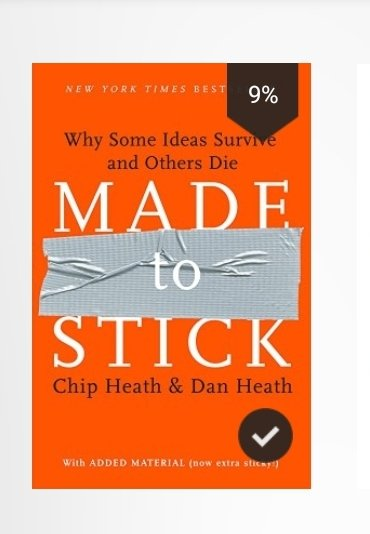

- [[ReadingMethod]]
- 🍏2022
  collapsed:: true
	- DOING [[You can negotiate anything]]
	  :LOGBOOK:
	  CLOCK: [2022-10-16 Sun 09:48:15]
	  :END:
	- DOING [[减压脑科学]]
	  :LOGBOOK:
	  CLOCK: [2022-10-16 Sun 09:48:27]
	  :END:
	- DOING [[Hijacked by Your Brain]]
	  :LOGBOOK:
	  CLOCK: [2022-10-16 Sun 10:09:24]
	  :END:
	- TODO [[高效休息法]] 
	  :LOGBOOK:
	  CLOCK: [2022-10-16 Sun 11:53:32]--[2023-02-07 Tue 14:55:55] =>  2739:02:23
	  :END:
	- DOING [[Thinking, Fast and Slow]]
	  :LOGBOOK:
	  CLOCK: [2022-10-16 Sun 11:53:53]
	  :END:
	- DOING [[The Minto Pyramid Principle Logic in Writing Thinking]]
	  :LOGBOOK:
	  CLOCK: [2022-10-16 Sun 12:05:55]
	  CLOCK: [2022-10-16 Sun 12:05:57]
	  :END:
	- DOING [[动物庄园]]
	  :LOGBOOK:
	  CLOCK: [2022-11-17 Thu 21:44:38]
	  CLOCK: [2022-11-17 Thu 21:44:49]
	  :END:
	- DOING  [[明朝那些事儿]]
	  :LOGBOOK:
	  CLOCK: [2022-11-17 Thu 21:47:32]
	  :END:
	- DOING [[基督山伯爵]]
	  :LOGBOOK:
	  CLOCK: [2022-11-17 Thu 21:44:54]
	  CLOCK: [2022-11-17 Thu 21:44:55]
	  CLOCK: [2022-11-17 Thu 21:46:55]
	  :END:
	- DOING  [[詹青云-趁着年轻我偏要勉强]]
	  :LOGBOOK:
	  CLOCK: [2022-11-17 Thu 22:13:03]
	  :END:
	- DOING [[平面国]]
	  :LOGBOOK:
	  CLOCK: [2022-11-19 Sat 16:41:15]
	  CLOCK: [2022-11-19 Sat 16:41:23]
	  :END:
	- DOING [[经济学原理]]
	  :LOGBOOK:
	  CLOCK: [2022-11-24 Thu 16:19:47]
	  CLOCK: [2022-11-24 Thu 16:20:12]
	  :END:
	- DOING [[系统之美]]
	  :LOGBOOK:
	  CLOCK: [2022-11-24 Thu 16:20:15]
	  CLOCK: [2022-11-24 Thu 16:20:20]
	  :END:
	- DOING [[微观经济学]]
	  :LOGBOOK:
	  CLOCK: [2022-11-24 Thu 16:20:23]
	  CLOCK: [2022-11-24 Thu 16:20:32]
	  :END:
	- DOING [[Deep Work Rules]]
	  :LOGBOOK:
	  CLOCK: [2022-11-27 Sun 14:18:12]
	  CLOCK: [2022-11-27 Sun 14:18:18]
	  :END:
	- DONE [[不可打扰]]
	  :LOGBOOK:
	  CLOCK: [2022-11-27 Sun 14:18:21]
	  CLOCK: [2022-11-27 Sun 14:18:25]--[2022-11-27 Sun 19:49:18] =>  05:30:53
	  :END:
	- DOING [[Factfulness_ Ten Reasons We're Wrong About the World – and Why Things Are Better Than You Think]]
	  :LOGBOOK:
	  CLOCK: [2022-12-06 Tue 17:23:45]
	  CLOCK: [2022-12-06 Tue 17:23:48]
	  :END:
	- DOING [[如何成为领先的少数人]]
	  :LOGBOOK:
	  CLOCK: [2022-11-27 Sun 14:18:48]
	  CLOCK: [2022-12-06 Tue 17:23:50]
	  :END:
	- DOING [[极简工作法则]]
	  :LOGBOOK:
	  CLOCK: [2022-11-27 Sun 14:21:16]
	  CLOCK: [2022-11-27 Sun 14:21:44]
	  :END:
	- DOING [[极简生活法则]]
	  :LOGBOOK:
	  CLOCK: [2022-11-30 Wed 17:49:41]
	  :END:
	- DOING [[how not to be wrong]]
	  :LOGBOOK:
	  CLOCK: [2022-11-30 Wed 16:59:34]
	  CLOCK: [2022-11-30 Wed 16:59:37]
	  :END:
	- DOING [[Noise - Darin Bradley]]
	  :LOGBOOK:
	  CLOCK: [2022-11-30 Wed 17:00:28]
	  :END:
	- DOING [[Talking to Strangers]]
	  :LOGBOOK:
	  CLOCK: [2022-11-30 Wed 17:00:36]
	  CLOCK: [2022-11-30 Wed 17:00:43]
	  :END:
	- DOING [[The Age of Surveillance Capitalism]]
	  :LOGBOOK:
	  CLOCK: [2022-11-30 Wed 17:00:50]
	  CLOCK: [2022-11-30 Wed 17:01:09]
	  :END:
	- DOING [[The Conquest of Happiness]]
	  :LOGBOOK:
	  CLOCK: [2022-11-30 Wed 17:01:11]
	  CLOCK: [2022-11-30 Wed 17:01:27]
	  :END:
	- DOING [[The Intelligence Trap_ Why Smart People Do Stupid Things and How to Make Wiser Decisions]]
	  :LOGBOOK:
	  CLOCK: [2022-11-30 Wed 17:01:29]
	  CLOCK: [2022-11-30 Wed 17:01:44]
	  :END:
	- DOING [[Thinking Again]]
	  :LOGBOOK:
	  CLOCK: [2022-11-30 Wed 17:01:50]
	  CLOCK: [2022-11-30 Wed 17:02:02]
	  :END:
	- DOING [[Unfolding the Napkin]]
	  :LOGBOOK:
	  CLOCK: [2022-11-30 Wed 17:02:13]
	  CLOCK: [2022-11-30 Wed 17:02:16]
	  :END:
	- DOING [[What English Really Is_ A Self-Study Guide for Chinese Students on Mastering English]]
	  :LOGBOOK:
	  CLOCK: [2022-11-30 Wed 17:02:30]
	  :END:
	- DOING [[Refactoring：Improving the Design of Existing Code]]
	  :LOGBOOK:
	  CLOCK: [2022-11-30 Wed 17:03:23]
	  :END:
	- DOING [[中式英语之鉴]]
	  :LOGBOOK:
	  CLOCK: [2022-11-30 Wed 17:02:32]
	  CLOCK: [2022-11-30 Wed 17:02:46]
	  :END:
	- DOING [[Antifragile——Things That Gain from Disorder]]
	  :LOGBOOK:
	  CLOCK: [2022-12-06 Tue 15:58:33]
	  CLOCK: [2022-12-06 Tue 15:58:36]
	  :END:
	- DOING [[Fooled by Randomness]]
	  :LOGBOOK:
	  CLOCK: [2022-12-06 Tue 15:58:38]
	  CLOCK: [2022-12-06 Tue 15:59:44]
	  :END:
	- DOING [[The Black Swan_ The Impact of the Highly Improbable (Random House, 2007)]]
	  :LOGBOOK:
	  CLOCK: [2022-12-06 Tue 16:00:37]
	  CLOCK: [2022-12-06 Tue 16:00:39]
	  :END:
	- DOING  [[Out of Control]]
	  :LOGBOOK:
	  CLOCK: [2022-12-06 Tue 16:01:52]
	  CLOCK: [2022-12-06 Tue 16:01:53]
	  :END:
	- DOING [[Economics of Money, Banking, and Financial Markets]]
	  :LOGBOOK:
	  CLOCK: [2022-12-06 Tue 16:02:47]
	  CLOCK: [2022-12-06 Tue 16:03:11]
	  :END:
	- DOING [[The Fifth Discipline]]
	  :LOGBOOK:
	  CLOCK: [2022-12-06 Tue 16:03:40]
	  CLOCK: [2022-12-06 Tue 16:03:57]
	  :END:
	- DOING  [[irresistable]]
	  :LOGBOOK:
	  CLOCK: [2022-12-12 Mon 10:06:23]
	  :END:
	- DOING [[Structure and Interpretation of Computer Programs]]
	  :LOGBOOK:
	  CLOCK: [2022-12-14 Wed 22:14:00]
	  CLOCK: [2022-12-14 Wed 22:14:18]
	  :END:
	- DOING [[数学之美]]
	  :LOGBOOK:
	  CLOCK: [2022-12-14 Wed 22:49:28]
	  :END:
	- [[你不懂咖啡]]
	- [[世界咖啡学]]
	- [[Great work  how to make a difference people love]]
	- [[Good Economics for Hard Times Better Answers to Our Biggest Problems]]
	- [[101 Essays That Will Change The Way You Think]]
	- [[Social Psychology]]
	- [[The Oxford Essential Guide to Writing]]
	- [[Oxford Dictionary of Idioms]]
	- [[Finish What You Start The Art of Following Through, Taking Action, Executing,  Self-Discipline]]
	- [[How to Win Friends and Influence People in the Digital Age]]
	- [[科学休息]]
	- [[大脑的奥秘（人类如何感知世界）]]
	- [[大脑简史]]
	- [[大脑总指挥]]
	- [[脑内乾坤]]
	- [[寻找爽点（是什么让我们欲罢不能）]]
	- [[Reading in the brain]]
	- [[The future of the brain]]
	- [[The hidden rationale behind our irrational behavior]]
	- [[Ageless memory]]
	- [[A thousand brains]]
	- [[Great myths of the brain]]
	- [[Willpower]]
	- [[In search of memory]]
	- [[Brain & behavior]]
	- [[Incognito: The secret lives of the brain]]
	- [[Principles RAY DALIO]]
	- [[The Spiritual Brain]]
	- [[Subliminal How your unconscious mind rules your behavior]]
	- [[The meaning of human existence]]
	- [[Neuro Science]]
	- [[美丽新世界]]
	- [[霍乱时期的爱情]]
	- [[恶意]]
- 🧑‍🏫 2023
  collapsed:: true
	- [[刻意练习]]
	- [[跨能致胜]]
	- [[学习王道]]
	- [[要忙就忙的有意义]]
	- [[怪诞行为学]]
	- [[匮乏经济学-Scarcity]]
	- [[你发生过什么事？]]
	- [[亲密关系(IntimateRelationship)]]
	- [[大局思维]]
	- [[A mind for numbers]]
	- [[人生胜利法]]
	- [[The story factor]]
	- [[3分钟说出18万个故事，打造影响力]]
	- [[激发潜能]]
	- [[99%的故事行销，创造品牌力]]
	- [[高绩效心智(GreatAtWork)]]
	- [[7个C的通技巧]]
	- [[零秒反应力]]
	- [[精准提问的力量]]
	- [[QBQ问题背后的问题]]
	- [[原子习惯(AtomicHabits)]]
	- [[YouAreNotListening]]
	- [[TheRenaissanceSoul(热情人生的冰淇淋哲学）]]
	- [[一流的人如何保持巔峰]]
	- [[HighPerformanceHabits]]
	- [[反脆弱]]
	- [[沉默契约]]
	- [[Trillion Dollar Coach(教练)]]
	- [[橡皮擦计划]]
	- [[The Paradox Of Choice]]
	- [[亲密的陌生人]]
	- [[TheDumbThingsSmartPeopleDoWithTheirMoney(理财盲点）]]
	- [[象与骑象人]]
	- [[第二座山]]
	- [[如何让你爱的人爱上你]]
	- [[彼得原理]]
	- [[我们为什么会犯错]]
	- [[我们为什么活得这么累]]
	- [[哈佛Google行为科学家的脱单指南]]
- 2024
	- TODO [[精要主义(Essentialism)]]
	- TODO [[轻松主义(Effortless)]]
	- TODO [[元宇宙改变一切]]
	- TODO [[哈佛的变革]]
	- TODO [[给科学家的科学思维]]
	- TODO [[艾伦图灵传]]
	- TODO [[津巴布口述史]]
	- TODO [[我缔造了新世界 影响人类历史进程的商业巨人亨利福特传]]
-
	- TODO [[欲望的博弈]] [[冥想(Meditation)]]
	- TODO [[冥想5分钟等于熟睡一小时]] [[冥想(Meditation)]]
	- TODO [[生命之书：365天的静心冥想]] [[冥想(Meditation)]]
	- TODO [[一日一冥想]] [[冥想(Meditation)]]
	- TODO [[每一日的呼吸冥想练习]] [[冥想(Meditation)]]
	- TODO [[每天练习照顾自己]]
	- TODO [[消除压力从大脑开始]]
-
	- [[博弈论与生活 ([英]兰·费雪) (Z-Library)]]
	- [[博弈论的诡计：日常生活中的博弈策略]]
	- [[妙趣横生博弈论 事业与人生的成功之道]]
	- [[囚徒的困境：冯·诺伊曼、博弈论，和原子弹之谜 ([美]威廉姆·庞德斯通 吴鹤龄(译)) (Z-Library)]]
	- [[博弈论 (弗登博格, 梯若尔) (Z-Library)]]
	- [[从一到无穷大 ([美] 乔治·伽莫夫 [译] 暴永宁 [校注] 吴伯泽) (Z-Library)]]
	- [[逻辑学导论]]
	- [[一份复杂时代下的熵减行动指南]]
	  collapsed:: true
		- 
	- [[理工科必读书籍]]
	  collapsed:: true
		- 
	- 
	- 
	- 
	- [[《起初·纪年》王朔]]
	- [[幸福感的神经基础]]
	- [[Strangers to Ourselves_ Discovering the Adaptive Unconscious]]
	- [[Strategic intuition]]
	- [[The Seventh Sense]]
	- [[近距离看美国]]
	- [[为什么]]
	- [[我的二本学生]]
	- [[理想国]]
	- [[大败局]]
	- TODO [[十三邀1-“我还是更喜欢失败”]]
	- TODO [[十三邀3-“我们都在给大问题做注脚”]]
	  :LOGBOOK:
	  CLOCK: [2023-06-29 Thu 14:53:34]
	  CLOCK: [2023-06-29 Thu 14:53:39]--[2023-06-29 Thu 14:53:44] =>  00:00:05
	  :END:
	- TODO [[十三邀4：“这样的时代，有这样一个人”]]
	  :LOGBOOK:
	  CLOCK: [2023-06-29 Thu 14:53:43]
	  :END:
	- TODO [[十三邀2：“偶像是生意，是符号，是忍辱负重”]]
	- TODO [[阅人无数Rapport]]
	- TODO [[详谈系列]]
	- TODO [[最后的访谈系列]]
	- TODO [[简单的复杂]]
	- TODO [[听，科学家说]]
	- TODO [[The Art of Thinking clearly]]
	- TODO [[Creative-Problem-Solving-Toolkit]]
	- TODO [[The culture map]]
	-
- [[DigitalBook]]
  collapsed:: true
	- {{youtube https://www.youtube.com/watch?v=QZOOvWYlz0M}}
	- {{youtube https://www.youtube.com/watch?v=OvU2uwFdXE8}}
	- {{youtube https://www.youtube.com/watch?v=ID3jj1qeR3w}}
	- {{youtube https://www.youtube.com/watch?v=jfnx_EWgqBo}}
	-
-
	-
-
-