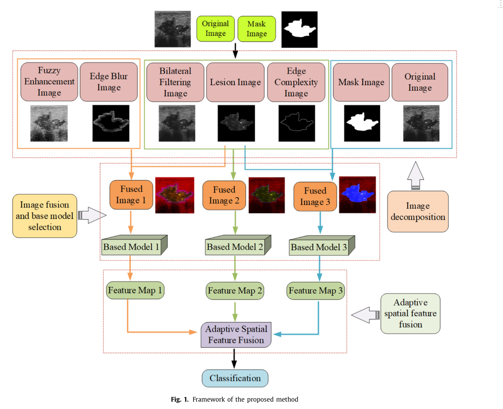
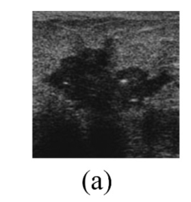
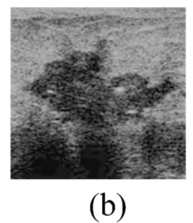
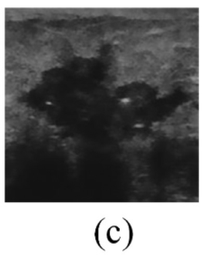
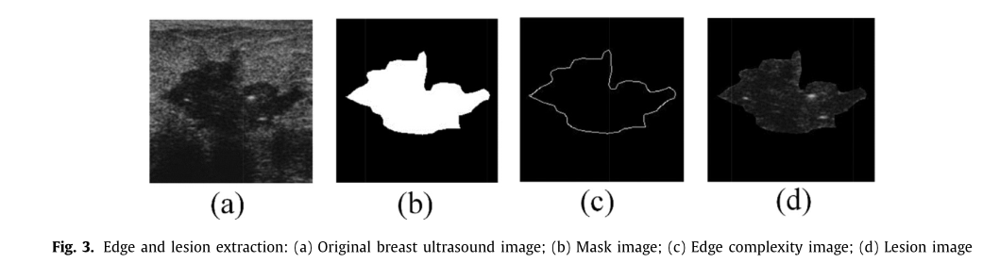
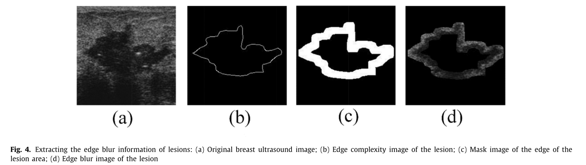
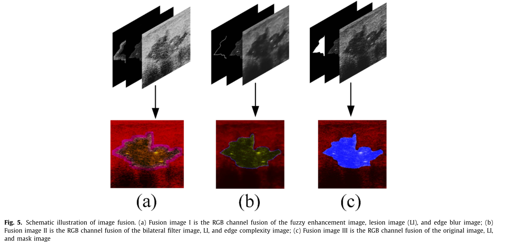
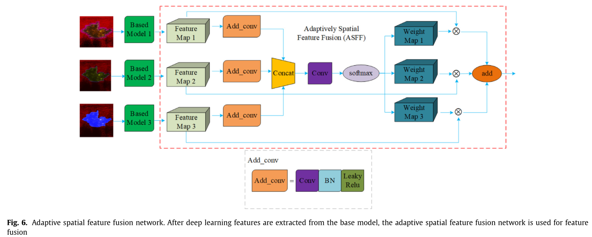

- 论文整体架构图：
	- 
- 论文整体理解：
	- 论文首先通过模糊增强和形态学两类操作来增强图像肿块部位的相关特征，不同类型的增强图像分别进行融合，于是得到三种类型的融合图像；然后，这三类融合图像分别通过不同的基础模型提取特征图；接着，这三类特征图通过自适应的空间特征融合机制进行融合；最后融合后的特征图直接用于进行分类。
- 论文详细理解：
  collapsed:: true
	- 图像融合：
		- 目的：广泛应用于医学图像重点中的目标检测、肿块的检测
		- 对原图进行的五种图像变换：
			- 原图：
			  collapsed:: true
				- 
			- 模糊增强：增强图像的对比度，可以减轻图像分类中其他组织的干扰
			  collapsed:: true
				- 
			- 双边过滤：减少斑点噪音的影响
			  collapsed:: true
				- 
			- 边缘复杂性图：突出肿块的边缘复杂性，同时弥补由于图像增强导致的信息丢失
			  collapsed:: true
				- 使用canny算法得到
				- 恶性肿块的边缘会对周围组织有不规则的侵润，比良性肿块的边缘要复杂得多
				- 
			- 边缘模糊图：属于边缘的模糊性研究，是临床医生鉴别的一个重要指示符
				- 
			- 肿块图：乳腺肿块超声图像包含着区分良恶性肿瘤的丰富特征，包括回声、钙化点
		- 3种融合：
			- 融合示意图：
			  collapsed:: true
				- 
				-
			- 融合1：模糊增强 + 边缘模糊（后者用于增加边缘模糊性的重要性）
			- 融合2：双边过滤 + 肿块图 + 边缘复杂度图
			- 融合3：原图和其mask
			  collapsed:: true
				- 可以展示超声图像的原始特征
				- 更清晰地展示乳腺肿块的形态学特征，包括纵横比和病变面积
			- 备注：
				- 三个融合图对应的特征提取网络分别是vgg、resnet和densenet；
				- 其中vgg的最后一个卷积层和分类头都需要进行微调；而resnet和densenet只需要进行微调分类头即可
	- ASFF机制：
		- [[Learning spatial fusion for single-shot object detection, (2019)]]
		- 
			- 特征融合：常用于图片分类、数据融合
			- 这里因为特征图尺寸相同，所以只有一个权重网络
- 质疑和思考：
	- 为什么要分开成三种融合图，不能把所有的7张图片堆叠在一起进行融合？
	- mask和原图融合时，是按照那种方式融合的呢？哪个图片数量更多呢？
	- 为什么不对图像变换进行分类，把原图、双边过滤、模糊增强的归为一类，边缘模糊和边缘复杂归为一类，mask、肿块归为一类呢？
- 