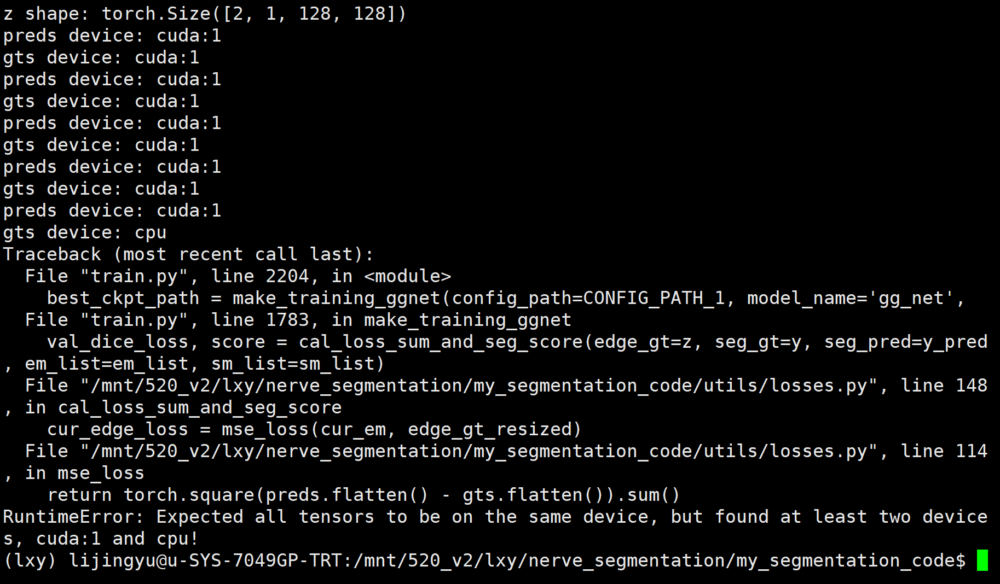
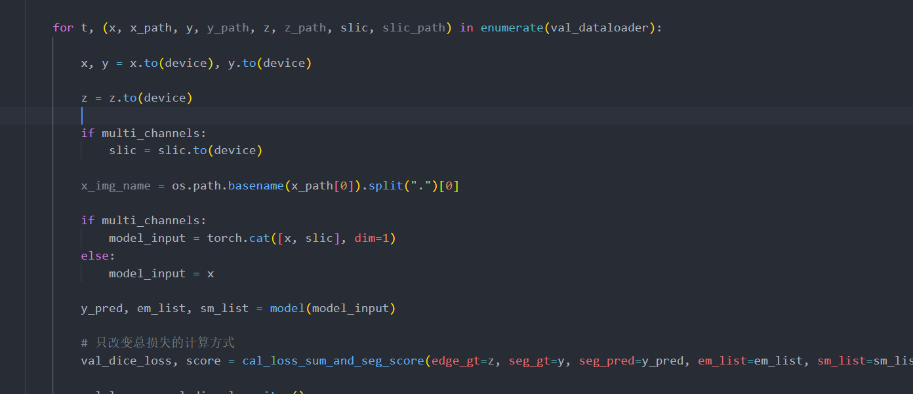

- # 疑问
	- 超声视频帧为啥需要进行筛选？目前我们获取的数据是视频帧吗，如果不是是否也需要进行筛选呢？
	- 超声图像的实时性是拍摄获取数据需要实时性、还是进行处理分析需要实时性？
	- 超声造影数据和超声灰阶数据有什么区别？为啥超声会有彩色的？
	-
-
- # 待搜索论文
	- CEUSegNet: A Cross-Modality Lesion Segmentation Network for Contrast-Enhanced Ultrasound
	- miccai2020
		- Automatic Breast Lesion Classification by Joint Neural Analysis of Mammography and Ultrasound
		- Multi-scale Gradational-Order Fusion Framework for Breast Lesions Classification Using Ultrasound Images
		- Auto-weighting for Breast Cancer Classification in Multimodal Ultrasound
	- IBSI 2022
		- Enhancing Non-Mass Breast Ultrasound Cancer Classification with Knowledge Transfer
		- Multi-Task Learning with Context-Oriented Self-Attention for Breast Ultrasound Image Classification and Segmentation
	- miccai 2021
		- Realistic Ultrasound Image Synthesis for Improved Classification of Liver Disease
	-
- # 论文阅读
	- X片的缺点
	- 超声的优点以及缺点
	- 非深度学习方法
	- 深度学习方法
-
- # 待学习
	- 双通道注意力融合是什么？
	- shunted transformer？
	- cross attention？
-
- # 代码问题
  collapsed:: true
	- 这里训练的时候 训练和验证  是依据种子值随机划分的，为了比较有必要设定固定种子吗？训练集和验证集的图片到底需不需要拆开放在两个文件夹里面呢？
		- 首先得验证一下这个sampler的索引作用的原始列表是什么，可以首先打印一下
		- 然后输出一下训练索引和验证索引的图片
		- 使用列表收集一下训练、验证的图片
		- 不需要两个顺序完全一样，只需要列表的元素是相同的就行
		- 其实你这里的目的是为了把训练集和验证集的图片分开，没必要进行验证，设置两个子目录就行了
		  collapsed:: true
			- train_splited_train
			- train_splited_val
			-
	- 训练和测试的代码是写在一个函数还是两个函数里面好？
		- 都行，但是最好要在一次程序运行当中都得出结果
	- 分割的可视化代码需要直接写在测试代码里面吗？验证和训练的部分需要进行可视化吗？
	- 分割结果可视化的原理是什么？
	- 数据集划分之后的图片命名要怎么样才是清晰的？
	- 原始图片到底是tif还是jpg？原始图片的文件夹到底是哪个？
	- 有多个肿块的mask应该是需要合并的？
	- 需要合并mask的图片
	  collapsed:: true
		- benign (92)_mask_1.png
		  benign (93)_mask_1.png
		  benign (181)_mask_1.png
		  benign (315)_mask_1.png
		  benign (98)_mask_1.png
		  benign (346)_mask_1.png
		  benign (25)_mask_1.png
		  benign (173)_mask_1.png
		  benign (4)_mask_1.png
		  benign (54)_mask_1.png
		  benign (83)_mask_1.png
		  benign (58)_mask_1.png
		  benign (163)_mask_1.png
		  benign (424)_mask_1.png
		  benign (100)_mask_1.png
		  benign (195)_mask_1.png
		- malignant (53)_mask_1.png
		-
	- 合并mask之后的数据集
		- 全部以processed结尾的文件夹
		- 重新划分后的结果
	- focal loss又是什么鬼？不同的模型比较的时候选择不同的学习率优化器或者学习率对于公平比较模型是否存在影响？
	- DOING  写完交叉验证的代码
	  :LOGBOOK:
	  CLOCK: [2022-09-04 Sun 10:27:49]
	  CLOCK: [2022-09-04 Sun 10:27:58]
	  :END:
	- DONE 验证一下边缘损失是否有问题
	  collapsed:: true
	  :LOGBOOK:
	  CLOCK: [2022-09-04 Sun 14:13:20]
	  CLOCK: [2022-09-04 Sun 14:16:40]--[2022-09-18 Sun 10:06:27] =>  331:49:47
	  :END:
		- 要搞清楚为什么分割结果ToTensor之后就有处于0到1之间的小数了
		- 可以这样，那我是怀疑这个ToTensor或者这个PIL.Image的读取是存在问题的
		- 先把PIL.Image读取的数据给转化成arr，看看里面是否存在非0-255的像素点
		- 然后一边使用cv2库来读取mask，看看这个里面是否存在非0-255的像素点
	- DONE  去掉ASPP和边缘模型，以判断级联融合模块和TinyUnet的结构是否有问题
	  :LOGBOOK:
	  CLOCK: [2022-09-04 Sun 14:16:51]--[2022-09-18 Sun 10:06:30] =>  331:49:39
	  :END:
	- DONE 换用一下学习策略看是否有问题
	  :LOGBOOK:
	  CLOCK: [2022-09-04 Sun 20:21:47]--[2022-09-04 Sun 20:26:03] =>  00:04:16
	  :END:
		- dce的值依然非常的低，排除此原因
	- DONE 核查为什么dice计算值和acc、iou的计算值差距如此大
	  collapsed:: true
	  :LOGBOOK:
	  CLOCK: [2022-09-04 Sun 20:21:53]
	  CLOCK: [2022-09-04 Sun 20:21:57]
	  CLOCK: [2022-09-04 Sun 20:22:55]
	  CLOCK: [2022-09-04 Sun 20:23:08]--[2022-09-13 Tue 10:23:37] =>  206:00:29
	  :END:
		- 刚才check时发现主要是混淆矩阵中只有1个类的像素点，这是由于读取到的mask全部是黑色，也就是得到的mask信息不正确导致的
		- 先看这个计算过程是否有误？可是如果这个有错，前面直接使用unet跑的时候就也会有问题啊
		- 先直接压缩，再读取一下，看看？
		  collapsed:: true
			- 跟resize时的插值方法有关吗？
				-
			- 随便设置一个阈值  感觉没有道理  我决定这样对结果的影响不是很大  因为这些特殊点本身就少  再加上阈值设置错误导致的点也就更少了
				- 跟数据格式应该没有关系？
				- 接近125是最难处理的，肉眼很难观察到不同阈值时的差异
				- 就是阈值化处理了，可是后面的dce为啥计算值还是如此的小？是不是dice小不是因为分割mask的原因？
			- 有几种改进思路：
				- 使用图像填充
					- 能不能在一张图片上叠加旋转、平移的结果
				- 在长宽方向上分别卷积
					- 特殊模型是不是不能用？常见模型是不是都要进行改写？
					- 仅仅在第一层卷积处使用长宽不同的卷积，但卷积结果是正方形的特征图？
				- 先进行肿块的检测，然后裁剪成正方形？
					- 正方形的大小必须能包含最大的乳腺肿块
				- 把长方形剪切成多个正方形？然后这多个正方形构成graph结构？
				- 能否做到对于肿块不完整的图像也能分割出来？
				- 对不同图像处理的结果进行有效融合
				-
		- 解决方案：
		  collapsed:: true
			- 还是使用cv2， 但是使用其他的库来辅助解决锯齿抖动的问题
			- 奇怪的是，这里的antialias为啥会对结果有这么大的影响？很明显这时候不是由长宽比造成的
			  collapsed:: true
				- 是这个antialias算法对这个灰度值的处理存在bug吗
					- 换一张其他的正常彩色图像进行尝试？
				- 可能就是灰度范围导致的，因为两个灰度范围不match啊
	- DONE 超声的背景组织对结果影响大吗？这些灰度纹理到底是不是不需要用的？
	  :LOGBOOK:
	  CLOCK: [2022-09-05 Mon 12:49:03]--[2022-09-19 Mon 22:02:02] =>  345:12:59
	  :END:
	- DONE 核查阈值化导致的一系列问题
	  collapsed:: true
	  :LOGBOOK:
	  CLOCK: [2022-09-13 Tue 10:23:42]
	  CLOCK: [2022-09-13 Tue 10:23:46]--[2022-09-18 Sun 10:06:36] =>  119:42:50
	  :END:
		- 如果要设置一个合理的阈值，这个阈值到底怎么设置呢？
		- 为啥这个模型的损失函数会使得预测结果的sigmoid后的0-1范围如此之小呢？说实话我感觉输出一个二维向量的方式和这个并没有什么区别啊？
	- DONE 搞清楚为啥gts会在cpu device上
	  collapsed:: true
	  :LOGBOOK:
	  CLOCK: [2022-09-18 Sun 10:06:49]
	  CLOCK: [2022-09-18 Sun 10:08:10]--[2022-09-18 Sun 19:33:28] =>  09:25:18
	  :END:
		- 
		- 
			- val部分忘记对edge加上cuda设置了
			-
	-
	-
	-
	-
	-
-
- # 创新点思考
	- 现在是觉得没有办法显示地把轮廓的特征给拿出来
	- 因为单独的轮廓图片里面包含有太多的黑色背景了，会对轮廓本身的特征造成极大的掩盖
	-