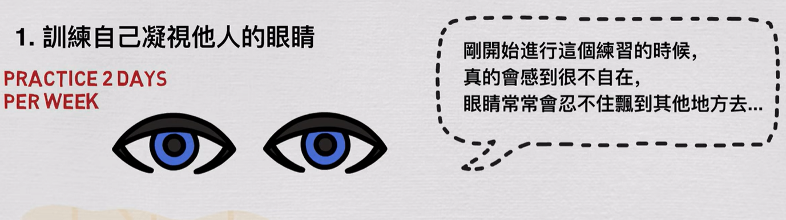

- 🍏记录一些可以做的疯狂实验、疯狂的想法 [[CrazyIdeas]]
	- TODO  6个月最节省最穷困潦倒的生活
	- TODO 骑单车从南京到杭州，或者从杭州到上海
	- TODO  一个月完全断网
	  :LOGBOOK:
	  CLOCK: [2023-01-07 Sat 22:05:16]
	  CLOCK: [2023-01-07 Sat 22:05:49]--[2023-01-07 Sat 22:05:56] =>  00:00:07
	  :END:
	- TODO 花2个月来学习一份副业：工业设计
- ⚾ 记录有趣的想法 [[InterestingIdeas]]
	- TODO 思考这个星期学到的五件事，以及如何将其实际应用到生活中
	- TODO 写出10种可以节约时间的方法
	- TODO 写下童年想做的10件事并想办法完成它
- 🗽打破原来的想法 [[ReThink]]
	- TODO 如果我们要面对的某件事很简单，会是什么样子？[[BlindPoints]]
	- TODO 用更短的时间来完成自己的目标，怎么样？
- 🔮可以参加的社会公众事物或者说社会性活动 [[PublicActivity]]
	- TODO 参加一场联合国的宣传
- 🌚做一些奇怪的训练
	- TODO 训练自己凝视他人的眼睛，为了避免过于奇怪，可以适当眨眼
	  id:: 63ba413d-3b46-441f-80c2-c078ff642487
	  collapsed:: true
		- 
		-
		-
-
-