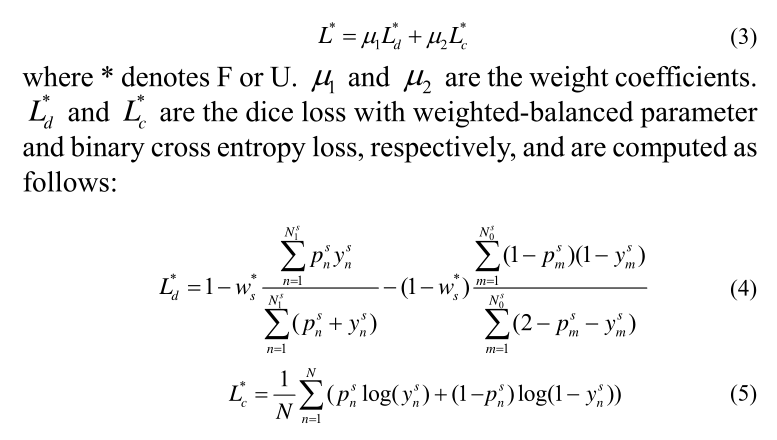
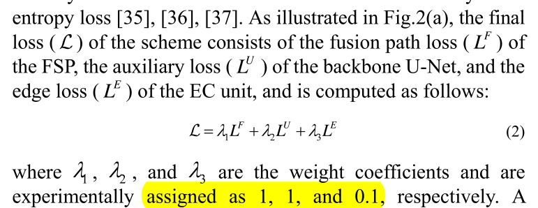

title:: CF2-Net: Coarse-to-Fine Fusion Convolutional Network for Breast Ultrasound Image Segmentation

- 论文背景：
  collapsed:: true
	- 基于超声的CAD主要包含图像分割、特征提取和模型重建，其中图像分割会直接影响到诊断的准确性和鲁棒性
	- 主要困难是：
		- 1）图片质量低，包括对比度低、散斑噪声和伪影
		- 2）超声图像中的乳腺肿块具有各种各样的尺寸和形状，并且边缘比较模糊
	- 现有的方法：
		- 1）基于邻居像素或者区域相似性的：需要形状、外观、以及空间位置的先验知识
		- 2）基于模型的方法：使用独特的基于先验或者后验能量函数以及优化算法
		- 1）2）都对于噪声敏感，并且倾向于过分割
		- 4）现有的深度学习：仅仅使用残差连接来连接编码器和解码器之间的信息
- 论文创新点：
  collapsed:: true
	- 【1】将超像素图像和原始图像在通道方向进行连接，一同作为模型的输入，而不是把超像素操作作为模型输出的后处理
		- 使用的是simple linear iterative clustering (SLIC) algorithm
			- SLIC 可以生成紧凑的patch，保持轮廓完整性，为网络提供额外的细节
			- 来自原始图像通道的信息可以指导网络微调分割结果
	- 【2】提出了一种“E”形的融合方式来融合编码器和解码器之间的信息
		- 同一尺度下的编码器提取的特征浅、粗糙，而解码器提取的特征深、细致。提出的融合方法能够去除两种信息之间冗余的部分，实现更紧凑的信息整合。
		- 模块包含四个组成部分：
			- ASPP：
				- 目的：通过多个感受野来同时捕获多种尺寸的乳腺肿块的信息。
				- 过程：
					- 此模块的输入包括同一尺度下来自编码器和解码器输出的两个特征图
					- 这两个特征图分别进行ASPP，得到各自更新后的特征图
			- CFF unit （Cascade Feature Fusion）：
				- 目的：对更新后得到的两个特征图与上一层该模块输出的特征图进行整合
				- 过程：
					- 更新后的两个特征图各自再经过一层1*1的卷积层，然后再进行拼接
					- 上一层该模块的输出图先上采样然后进行2*2空洞卷积
					- 将上述两类特征图进行相加融合，得到融合的特征图
			- Edge Constraint：
				- 目的：利用边缘信息对提取的特征进行约束
				- 过程：
					- 融合特征图经过1 * 1,3 * 3,1 * 1的三次卷积，再与原始的融合特征图进行残差连接。连接后的结果直接输入下一个模块。
					- 融合特征图经过1 * 1,3 * 3的两次卷积后，增加一个额外的分支：这个分支利用1*1的卷积输出边缘的分割结果
			- Tiny Unet:
				- 目的：对增加了边缘约束后的特征图提取更高层次的特征
				- 过程：
					- 使用一层Unet的结构来提取一个
		- 【3】提出了类平衡的损失函数
			- 目的：每张图片中的乳腺肿块尺寸都不太一样，这样背景和肿块这两个类别的像素比例在每张图片中都是不同的，但都是 背景像素总数  远大于 肿块像素总数，所以就分割任务来说，无论是交叉熵损失函数还是dice损失函数，都应该把这两类像素区别开。
			- 过程：
				- 
				- 分割损失使用加权的交叉熵损失和dice损失和。但是这两种损失的任意一种，都将背景像素和肿块像素区别开，分别计算两种像素的权重。
				-
			- 补充：整个模型对Unet FSP 和 EC模块的输出都构建相应的损失，并进行加权，其中EC模块的权重最低。
				- 
			-
			-
			-
			-
		-
		-
		-
- 关于论文模型的疑问：
  collapsed:: true
	- 这里并没有用Fusion Stream Path来替代原有的残差连接，而是增加这样的一条分支？
	- 来自编码器和解码器的特征图在经过ASPP之后在直接相连前，为什么还要各自再进行卷积？
	- 这里不同层级的特征图之间为什么使用相加融合而不是拼接融合？
	- 为什么边缘约束模块要放在与上一层级特征图融合之后，而不是之前？
	- 边缘约束模块看上去只是单纯增加了3层卷积层，为什么可以保证输出的特征图就具有边缘语义？
	- 为什么边缘模块不直接将第二个卷积层的特征图作为边缘预测图，还需要再经过一个卷积层？为什么边缘图的通道数要固定为32？
	- 为什么要设计一个微缩版本的tinyUnet，而不直接使用边缘模块的输出结果？Unet能work的根本原因是？
- 关于改进的思考：
  collapsed:: true
	- 边缘约束模块可以再参考一些其他的论文进行改进，这里的该模块感觉没有那么make sense。
	- 个人理解Unet能work的原因有2点：一是通过残差连接实现上下层级间的信息融合，从而每个像素点对应的特征向量既有局部信息又有全局信息，而分割任务的关键在于获取每个像素点的信息；二是不同层级之间的信息融合时，对应的通道数是相同的，这就使得每个像素上的特征向量是不同深度的信息的一种均匀混合。
		- 所以思路是：
			- 一是增加每个层次信息的丰富程度，设想的是每个层级的编码器后再接一个对应的ASPP，然后将编码器的特征图和ASPP的特征图进行融合；
			- 二是改变不同层次之间融合的方式，未必需要使用级联的解码器层，可以直接在原有的编码器层次上融合，也就是向下和向上的两个分支都可以在同一模块上进行，或者向上向下的分支可以同时进行而不先下后上；
			- 三是在每一层都增加对于信息的引导，或者对于在最后一个输出模块增加。引导模块怎么增加还在思考。
	- 现有的分割损失函数中dce损失描述的是预测和目标间整体上的关系，而交叉熵损失则描述的是预测和目标上每个像素点之间的关系。训练的先后可以使用不同的损失函数吗？
- 论文复现：
  collapsed:: true
	- 大不了就两个都添加一下，如果不确定是哪一种的
	- 需要先写这个FSP模块
		- CFF中到底用的是3*3还是2*2的卷积核，图片和文字描述不一致
		- upsample后需不需要使用relu
		- upsample是否需要align corners
		- 连续的卷积层之间一定需要加上BN + relu吗
		- 卷积层的bias到底需不需要添加，Unet的实现代码里面是除了最后的像素分类卷积层的bias才为TRUE，其余所有卷积层的bias都设置为false
		- 没有说明edge_map拼接之后的卷积模块到底使用多大的卷积核，不过此时应该要保持图片大小不变，而且为了参数量不至于过大，猜测应该还是1 × 1的卷积核
			- 这个卷积模块之后必须要接上bn和relu吗？
		- fsp路径中最后一个fsp模块输出的特征图通道数是128，为啥不需要再一层的卷积来输出分割结果？难道这里的分割结果就是32个通道？
		-
		- 输出结果是单通道还是双通道？
			- 若是单通道，模型里面需不需要使用sigmoid等还是其他激活函数，这时候应该用什么损失函数呢？
			- 若是双通道，激活函数和损失函数又是什么情况呢？
			- 选择单通道还是双通道会对最终结果的可视化产生影响吗？分割结果的可视化依靠的到底是什么呢？
			-
	- 写损失函数
	- 写训练和测试的代码
	- 怎么获得边缘分割的ground truth图，如果有两个肿块分割区域要怎么做呢
	- 交叉熵损失自己怎么手动实现呢
	- dice损失怎么自己手动实现呢
	- 这样吧先直接把代码找全
	- 这里需要的是sensitivity和PPV
	- 其实只需要通过混淆矩阵进行求解就行了
	- 返回的hist本身就是矩阵形状的，而非向量形状
	- 对于每个类来说，TP就只有对角线上位置（X, X）上的那个值，FP对应的是（X,X)所在列除了(X,X)的其他所有值，FN对应的是(X,X)所在行除了（X,X)的其他所有值
	- 有很多问题没有解决：
		- 超像素的输出结果是1通道还是3通道？
			- 如果是1通道，那就是原图划分为多个区域簇的灰度图
			- 如果是3通道，那就是原图叠加上簇边界的RGB图
			- 从论文给定的图示来看，更像是3通道
		- 论文中给定的官方数据集链接都打不开；使用了原先的数据集，但要不要丢弃分割结果为空mask的normal类的数据，存疑？
			- 不丢弃，因为模型应该具有识别出超声图像中不存在肿块的能力
			- 丢弃，因为模型中normal: benign: malignant = 133: 437: 210，normal的数据比例占到了约17.05%，而normal中的空mask会导致背景像素点远多于肿块像素点，对模型的学习会造成方向性的bias
			- 是否能先设计一个模块来判断肿块是否存在？
				- 如有较大概率能判断不存在，可直接得出normal类，
				- 否则若判断肿块不存在的概率小于制定阈值，则才进行良性和恶性的2分类
		- 这里的原图是一个长方形的超声图像，如果resize成为正方形，会改变肿块的形状，
			- 图片填充的方法则会改变肿块的数目，所以什么方法改变图片的大小才合适呢？
			- 如果必须得用正方形，模型中可以增加什么模块来缓解resize造成的影响？
		- dice损失计算时是在概率mask和mask gt之间计算的，那么dice作为指标的时候是不是用 预测的分割结果（对概率mask进行阈值化）和mask_gt之间进行计算呢？ 阈值化是否需要设置为除了0.5以外的其他数值？
		- 边缘检测是在原始的矩形图像上进行的，然后按照和mask一样的预处理方法对edge进行处理，这种方式是否会对edge的准确性造成较大干扰？ 如果从预处理后的mask上进行边缘检测，会存在代码上的困难，因为数据集类里面是直接对Image可以类型进行操作，修改尺寸、进行裁剪、将其转化为灰度图像、进行归一、转化为张量等，而cv2.canny库只能作用于numpy类型的数据上， 可否先将转化的mask tensor转化为numpy矩阵，然后放大到【0,255】的范围内，然后在这个新矩阵上进行边缘检测，检测之后转化为Image类型，然后再transform？关键的一点是transform作用的数据类型到底是什么？
		- 为啥论文中给定的实验结果都会有一个标准差，而不是一个确切值？这个标准差的上下范围到底是怎么算出来的？
		- 图片进行预处理时到底有没有必要使用立足于该数据集本身的均值和方差进行归一化？
		-
	-
	-
	-
	-
-
- 
- 有关于[[TraditionalMethod]]的 [[LiteratureSummary]]
-
-