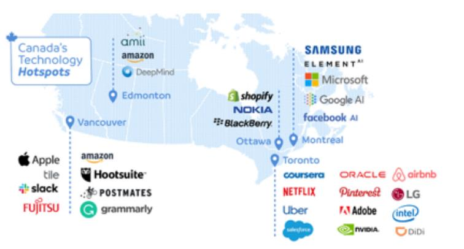
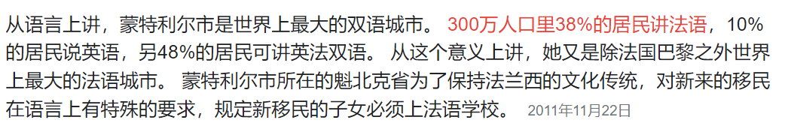
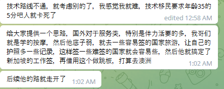
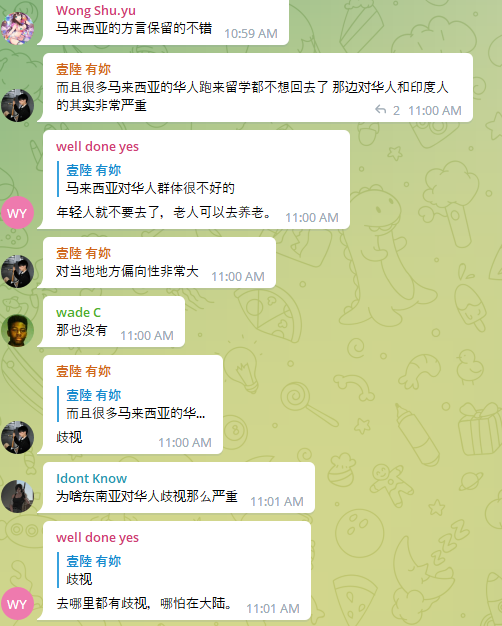
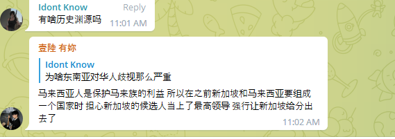

- # 在加拿大学习生活找工作的一些困惑？
  collapsed:: true
	- 加拿大互联网行业不够发达，赚到的钱不够多，从加拿大跳槽到美国大厂的机会多吗？
	- 加拿大中等程序员赚钱多少年才能在卡尔加里买上独立屋？
	- 加拿大远程接美国工作任务的机会多吗？
	- 加拿大程序员可以开展什么副业呢？
		- daycare：早教中心
	- 想做一名有价值的软件工程师这一职业梦想，该如何利用加国的资源呢？
	- 如何才能认识在加拿大生活工作的程序员或者华人呢？
	- #CanadaPhd
		- 加拿大cs phd的去向有哪些呢？加拿大cs phd在美国的认可度如何呢？加拿大phd的毕业要求是什么呢？
		- 加拿大的cs phd和德国的cs phd进行对比？
	- 为何加拿大高校的cs科研要远比互联网产业发达呢？互联网产业发达与否的关键性因素是什么？
	- 加拿大创业的空间有多大？
	- 加拿大的互联网行业是处在上升期、平稳期还是衰退期？
	- 加拿大的经济发展有什么明显的规律或者特点吗？
	- 加拿大哪些省的cs phd可以migrate？
	- 为什么计算机硕士推荐BC省？
	- 渥太华地区北称为加拿大的硅谷地区，渥太华地区有什么好的高科技IT公司吗？
	- 人口与房价是直接挂钩的，人口越多房价越高，所以卡尔加里房价低的原因也是因为人口不高。那么渥太华的房价又是怎么样的一个情况呢？
	- 不同省份的migration policy都有所不同，那是不是只有换了citizenship之后才可以选择搬迁到其他省份呢？
	- 加拿大的互联网企业集中分布在哪些城市和地区？
	  collapsed:: true
		- 
		- 草原三省指代的是alberta，萨斯喀切温省Saskatchewan，曼尼托巴省Manitoba
		- 温哥华在BC省（不列颠哥伦比亚省）
		- 多伦多在安大略省
		- 蒙特利尔在魁北克省
		- 埃德蒙顿在阿尔伯塔省
		- ottawa在安大略省的东南部，是加拿大的政治中心
		- 温哥华属于西部，多伦多和渥太华属于中部，蒙特利尔属于东部
		- Halifax在东南部，属于Nova Scotia，新苏格兰
		- kitchener是基奇纳，位于安大略省
		- 渥太华和滑铁卢不是一个地方，waterloo水卢是在安大略省
		- 加拿大的多伦多与美国纽约比较近，温哥华与西雅图比较接近
		- 
		-
		-
	- 加拿大的房地产行业为何能赚钱？为何那么多的华人房地产中介？房产中介在加拿大需要相关的学位吗？
	-
	-
	-
- 
- [[ChatInfoCollection]]
  collapsed:: true
	- 
	- 
	- 
	- 
	- 
	-
	-
- [[养老]]
-
-