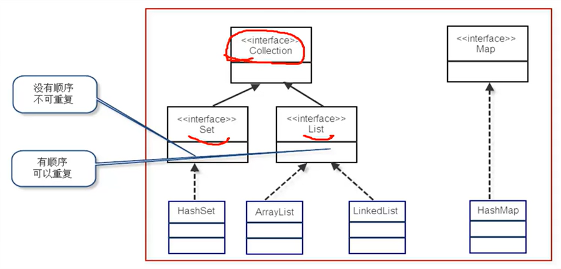

public:: true

- Java中的容器有什么作用？
  collapsed:: true
	- 用来存储对象和基本数据类型的。容器本身也是一种对象。
- Java中的容器或者说集合具体可以分为哪两类？
  collapsed:: true
	- 分为集合和列表两类。Map接口并不是Collection接口的子接口。
		- 
- JAVA中数组的缺点是什么？
  collapsed:: true
	- 不能动态扩容
- JAVA中的泛型有什么用途？
  collapsed:: true
	- 其帮助我们建立类型安全的集合，在JDK 1. 5之后就都被支持了
	- 泛型的本质就是：数据类型的参数化。我们知道函数中的形参变量名是实参变量名的占位符，那么同理可以把泛型也理解成类定义或者函数定义时的一种形参，它对应的实参是某个具体的数据类型。
	- [[编译器]]在调用泛型时必须传入实际类型
- List的实现类包含哪些？
	- 
	- ArrayList和Vector的底层都使用的是数组，LinkedList底层使用的是循环双向链表，Vector保证了线程安全
	-
-
-
-
-