## Intention
collapsed:: true
	- 分析清楚自己拖延的原因，并慢慢改变
- ## Reason
  collapsed:: true
	- 被娱乐转移了注意力
	- 被body addiction消耗了身体的精力，导致疲惫
		- 如果确实很疲惫了，不要强行要求自己早起，这样只会更糟糕
	- 对于想要达成的目标，虽然动力感很强，但是：目标实现过程复杂，难以制定一个清晰或者明确的计划，容易陷入每天随心所欲地执行计划的陷阱；目标实现周期太久，的确很重要，但是很容易被眼前的短暂的愉快所诱惑
	- 设置的目标太多了，导致每天一下执行这个，一下执行另外一个
	- 执行的task非常消耗脑力，特别是需要多次修正时
	- 聊天过于上头，而导致预期的task被大幅打断
	- 因为任务困难导致注意力分散，导致开启了一个新task的新线程
	- 发布朋友圈后会不时想要查看点赞或者评论情况，一方面会不间断打断注意力，另一方面会让自己很飘
	- 感觉今天的任务注定做不完了，或者说只完成了一小部分，就更想摆烂不做
	- 追求完美
	- 信息爆炸 導致我們猶豫不決，做不了決定
- ## Important Method
  collapsed:: true
	- [[#red]]==戒掉拖延症五個方法==
	  📍[[#green]]==321法則 立刻行動==
	  📍[[#blue]]==用正向態度面對不認定自己為拖延症的患者==
	  📍[[$green]]==82法則 先做關鍵且重要的事情==
	  📍[[$blue]]==把大目標拆成小目標==
	  📍[[$red]]==製作睡前明日清單==
	- [[#red]]==一定要为自己设置deadline，该参加的活动该做的事情不能缺席==
		- [[$green]]==采用倒數記時法和期限砍半，以制造急迫感==
	- [[#blue]]==化繁為簡，了解自己真正的需求，把不相幹的資訊和想法給斷舍離==
	- [[$red]]==不要糾結自己的不完美，放大自己的優勢更實際==
	- 启动学习的方法：
	  collapsed:: true
		- http://xhslink.com/lOcwDm
	- [[#red]]==提前很久开始慢慢思考，或者做一些简单的准备，确保自己对这件事不再陌生==
	- [[#red]]==硬着头皮连续坚持做三天==
- ## Unrealized Postpone Behavoirs
  collapsed:: true
	- 看到一个学习英文短语，总是收藏而不是立马记忆
	- 对某个人想说的话，拖延很久才去说
	- 当感觉视线不清晰时，就应该马上擦眼镜了
	- 当感觉听觉模糊、头脑混账时，就应该马上休息了
	- 背单词时，不立马朗诵，而是拖到以后不得不读
	- 与别人的交流对话中，没有搞懂的还是装自己搞懂了，同时也拖延很久才去解决这个疑问
	- 收藏公众号推文或者聊天记录之后，拖延打标签
- ## Actions
	- [[Jan]][[2023]]
	  collapsed:: true
		- [[Jan 3rd, 2023]]
		  collapsed:: true
			- DONE 完成摘要第一版的书写
			  :LOGBOOK:
			  CLOCK: [2023-01-03 Tue 19:27:45]
			  CLOCK: [2023-01-03 Tue 19:27:48]--[2023-01-03 Tue 22:23:42] =>  02:55:54
			  :END:
			- DONE 完成雅思写作两篇的练习
			  :LOGBOOK:
			  CLOCK: [2023-01-03 Tue 19:30:13]
			  CLOCK: [2023-01-03 Tue 19:30:18]--[2023-01-03 Tue 23:34:58] =>  04:04:40
			  :END:
			- DONE  完成青佬句式模仿
			  :LOGBOOK:
			  CLOCK: [2023-01-03 Tue 19:39:37]
			  CLOCK: [2023-01-03 Tue 19:39:38]--[2023-01-03 Tue 20:54:42] =>  01:15:04
			  :END:
		- [[Jan 7rd, 2023]]
		  collapsed:: true
			- DOING 每周六的晚上执行拖延任务的大扫除，也就是把这段时间一直拖延的任务集中解决
			  :LOGBOOK:
			  CLOCK: [2023-01-03 Tue 19:23:08]
			  CLOCK: [2023-01-03 Tue 19:23:14]
			  :END:
		- [[Jan 4th, 2023]]
		  collapsed:: true
			- DONE 确定好办理护照的计划
			  collapsed:: true
			  :LOGBOOK:
			  CLOCK: [2023-01-03 Tue 19:28:05]
			  CLOCK: [2023-01-03 Tue 19:28:30]
			  CLOCK: [2023-01-03 Tue 19:28:51]
			  CLOCK: [2023-01-03 Tue 19:29:12]--[2023-01-12 Thu 02:56:16] =>  199:27:04
			  :END:
				- 怎么最快去高河
			- DONE  把剩下的RFNET的一半看完
			  :LOGBOOK:
			  CLOCK: [2023-01-03 Tue 19:27:32]
			  CLOCK: [2023-01-03 Tue 19:34:45]
			  CLOCK: [2023-01-03 Tue 19:34:48]--[2023-01-04 Wed 00:48:16] =>  05:13:28
			  :END:
			- DOING 跑步10min
			  :LOGBOOK:
			  CLOCK: [2023-01-03 Tue 20:25:09]
			  CLOCK: [2023-01-03 Tue 20:25:11]
			  :END:
			- DONE 下载spring的源码包 + 梳理文件的结构  
			  :LOGBOOK:
			  CLOCK: [2023-01-03 Tue 23:35:11]
			  CLOCK: [2023-01-03 Tue 23:57:13]--[2023-02-10 Fri 17:02:41] =>  905:05:28
			  :END:
			- DOING 验证一下自己代码的结果每次运行是一样的
			  :LOGBOOK:
			  CLOCK: [2023-01-04 Wed 00:21:17]
			  CLOCK: [2023-01-04 Wed 00:21:18]
			  CLOCK: [2023-01-04 Wed 00:21:20]
			  :END:
			- DOING  完成GCN局部信息的代码
			  :LOGBOOK:
			  CLOCK: [2023-01-04 Wed 00:21:43]
			  CLOCK: [2023-01-04 Wed 00:21:46]
			  :END:
			- DOING  继续完成上次的雅思听力模拟题
			  :LOGBOOK:
			  CLOCK: [2023-01-04 Wed 00:48:30]
			  CLOCK: [2023-01-04 Wed 01:03:59]
			  CLOCK: [2023-01-04 Wed 01:04:00]
			  :END:
			- DOING 确定一个简单可执行的雅思学习计划
			  :LOGBOOK:
			  CLOCK: [2023-01-04 Wed 01:09:41]
			  CLOCK: [2023-01-04 Wed 01:09:45]
			  :END:
			- DOING 重新规划自己的找工作计划
			  :LOGBOOK:
			  CLOCK: [2023-01-04 Wed 01:09:56]
			  CLOCK: [2023-01-04 Wed 01:09:57]
			  :END:
			- DONE 整理一下自己的房间
			  :LOGBOOK:
			  CLOCK: [2023-01-04 Wed 01:10:57]
			  CLOCK: [2023-01-04 Wed 01:10:59]--[2023-01-07 Sat 02:14:53] =>  73:03:54
			  :END:
			- DONE 10点10按时起床 + 睡眠8h
			  :LOGBOOK:
			  CLOCK: [2023-01-04 Wed 01:12:42]
			  CLOCK: [2023-01-04 Wed 01:12:46]--[2023-01-04 Wed 11:05:02] =>  09:52:16
			  :END:
			- DONE  互动式电影院设想 [[MyWeChatFeeds]]
			  :LOGBOOK:
			  CLOCK: [2023-01-04 Wed 21:29:53]
			  CLOCK: [2023-01-04 Wed 21:30:12]--[2023-01-27 Fri 05:14:17] =>  535:44:05
			  :END:
			- DONE 问清楚到底可不可以不去那边就直接线上办理 [[出国材料]]
			  collapsed:: true
			  :LOGBOOK:
			  CLOCK: [2023-01-04 Wed 21:32:31]
			  CLOCK: [2023-01-04 Wed 21:32:41]--[2023-01-08 Sun 00:31:39] =>  74:58:58
			  :END:
				- [[护照]]必须线下
		- [[Jan 7th, 2023]]
		  collapsed:: true
			- DONE 把论文发给周老师
			  collapsed:: true
			  :LOGBOOK:
			  CLOCK: [2023-01-07 Sat 02:09:08]
			  CLOCK: [2023-01-07 Sat 02:09:14]--[2023-01-07 Sat 08:49:06] =>  06:39:52
			  :END:
				- 整体思路：乳腺钙化点形状和分布多样 =》传统机器学习耗时、普通深度学习泛化性不足 =》深度集成学习可以提供泛化性，但是现有围绕加权平均的方法存在两个问题：性能容易受到单个模型的影响, 或者说对biased的模型比较敏感；需要复杂的技巧才能实现数据自适应 =》解决问题1，将模型的集成过程转化成特征级别的融合过程；解决问题2，提出基于相似性解码的权重计算方法。
			- DONE  7:30按时起床
			  :LOGBOOK:
			  CLOCK: [2023-01-07 Sat 02:09:59]
			  CLOCK: [2023-01-07 Sat 02:10:05]
			  CLOCK: [2023-01-07 Sat 02:10:15]
			  CLOCK: [2023-01-07 Sat 02:11:03]--[2023-01-07 Sat 08:39:34] =>  06:28:31
			  :END:
			- DONE [[#red]]==完成二叉树纲领部分的学习==
			  :LOGBOOK:
			  CLOCK: [2023-01-07 Sat 02:11:58]
			  CLOCK: [2023-01-07 Sat 02:12:17]--[2023-01-07 Sat 14:26:44] =>  12:14:27
			  :END:
			- DONE [[#red]]==学习插件怎么使用==
			  :LOGBOOK:
			  CLOCK: [2023-01-07 Sat 02:12:25]
			  CLOCK: [2023-01-07 Sat 02:12:44]
			  CLOCK: [2023-01-07 Sat 02:13:25]--[2023-01-07 Sat 12:42:42] =>  10:29:17
			  :END:
			- TODO  [[#red]]==完成递增子序列的全部整理和代码==
			  :LOGBOOK:
			  CLOCK: [2023-01-07 Sat 02:15:37]
			  CLOCK: [2023-01-07 Sat 02:15:49]--[2023-01-07 Sat 12:42:42] =>  10:26:53
			  :END:
			- DONE  [[#red]]==完成10节spring视频的学习实践==
			  :LOGBOOK:
			  CLOCK: [2023-01-07 Sat 02:17:59]--[2023-01-07 Sat 12:42:41] =>  10:24:42
			  CLOCK: [2023-02-25 Sat 08:00:36]--[2023-02-25 Sat 08:00:40] =>  00:00:04
			  :END:
			- DONE  [[#green]]==思考并整理下自己真正害怕的事== [[Self]][[FearManager]]
			  collapsed:: true
			  :LOGBOOK:
			  CLOCK: [2023-01-07 Sat 02:13:43]
			  CLOCK: [2023-01-07 Sat 02:15:09]
			  CLOCK: [2023-01-07 Sat 02:15:14]--[2023-01-07 Sat 12:42:41] =>  10:27:27
			  CLOCK: [2023-01-08 Sun 11:47:26]--[2023-01-08 Sun 11:47:27] =>  00:00:01
			  :END:
				- 害怕因为自己拖沓、解决问题速度慢而无法及时完成任务
				- 害怕自己进度远远落后别人，因为这样会让我怀疑自己的能力有问题
				- 害怕即兴回答或者提问或者演讲时语无伦次、没有办法让别人理解我的意思
				- 害怕自己衣着不够decent、身高不够高而被人diss
				- 害怕自己为目标做了很多准备，但是最后却离目标很远
			- DONE [[#green]]==了解日本的创新== [[Innovation]] [[Japan]]
			  collapsed:: true
			  :LOGBOOK:
			  CLOCK: [2023-01-07 Sat 02:17:13]
			  CLOCK: [2023-01-07 Sat 02:18:38]
			  :END:
				- https://www.163.com/dy/article/GD3T131U05149FK0.html
		- [[Jan 8th, 2023]]
		  collapsed:: true
			- DONE [[#green]]==查找计算机 + 工业产品结合的行业；查找工业设计在m国的发展情况==
			- DONE [[#green]]==回想之前关于创新的那边书的要点 [[Innovation]]==
			- DONE [[#green]]==简化出今年最需要完成的五个目标 [[GoalMachine]] ==
			- DONE 打电话问护照 + 和妈提前说电动车的事
			- TODO [[#red]]==完成剩余两道leetcode的代码和笔记==
		- [[Jan 9th, 2023]]
		  collapsed:: true
			- DONE [[#red]]==办护照==
			- DONE 完成两个读书视频的观看，并通过问题法和回想法来记笔记
		- [[Jan 10th, 2023]]
		  collapsed:: true
			- TODO [[#green]]==学习怎么阅读JAVA的源码==
			- DONE 完成Apples Exchange[[MyWeChatFeeds]]
			  collapsed:: true
				- DONE 如何才能不平淡
			- TODO [[#green]]==罗列出最基础的要做好的事、可以尝试的事、需要观望的事== [[Principles]]
			- TODO [[#green]]==参加ACWing的一次直播课==
			- DONE [[#green]]==观看冥想第4节动画，并记相关笔记== [[Headspace Guide To Meditation]]
			- DONE [[#green]]==再阅读两个文森读书视频==
		- [[Jan 11th, 2023]]
		  collapsed:: true
			- DONE [[#red]]==使用新方法练习冥想== [[MeditationPractice]]
			- DONE 寻找可以辅助冥想的工具
			- DONE 沐浴、理发、更衣
			- DONE 写下目前困惑的问题，并给出目前的解决方案
		- [[Jan 12th, 2023]]
		  collapsed:: true
			- DONE 给抖音APP设置时间控制，并严格执行1天最多玩10min策略
		- [[Jan 13th, 2023]]
		  collapsed:: true
			- DONE 到四点为止，把自己所有感兴趣的重点书籍视频全部摘录完毕
			- DONE 把英语学习的目标拆成一个又一个想要实现的情景 [[EnglishGoals]]
		- [[Jan 14th, 2023]]
		- [[Jan 15th, 2023]]
		  collapsed:: true
			- DONE 完成雅思写作4篇阅读
			- DONE [[#red]]^^完成可见山峰对问题的代码^^
				- DONE 完全理解参考代码
				- DONE 不看参考代码自己回顾着敲一遍
			- DONE 看看小红书上之前怎么用思维导图来对[[如何阅读一本书]]进行阅读的
			- DONE  [[#blue]]==跑出指标更改后的结果==
			  collapsed:: true
				- 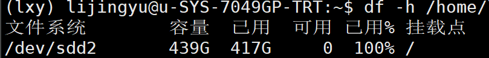
				-
		- [[Jan 16th, 2023]]
		  collapsed:: true
			- DONE 做好汇报PPT
		- [[Jan 17th, 2023]]
		  collapsed:: true
			- DONE 给福子买书：今天先选好书的内容，然后见面或者春节后买
		- [[Jan 23rd, 2023]]
		  collapsed:: true
			- DONE 两个雅思写作
			- DONE 买书，问问能不能到点再发货
		- [[Jan 27th, 2023]]
		  collapsed:: true
			- DONE 冥想练习 #habit-tracker
			- DONE 阅读“为啥生活不要太丰富”的微博
	- [[Feb]][[2023]]
	  collapsed:: true
		- [[Feb 2nd, 2023]]
		  collapsed:: true
			- DONE 购买火车票
			- DONE 冥想
			- DONE 整理零食和书包
		- [[Feb 3rd, 2023]]
		  collapsed:: true
			- DONE 把spring八股文在1h内阅读一遍
			- DONE 找周老师修改论文
		- [[Feb 4th, 2023]]
		  collapsed:: true
			- DONE 跑步十分钟
			- DONE 冥想
		- [[Feb 6th, 2023]]
		  collapsed:: true
			- DONE 冥想
			- DONE 运动10分钟
			- DONE 解决testng测试的bug [[ProjectIssues]]
			  collapsed:: true
				- https://blog.csdn.net/adminBfl/article/details/81321809
				- 使用了idea maven设置里面的always update snapshots
			- DONE 阅读一篇uncertain-map的论文，做好简单笔记
				- [[PaperInsight]]
			- DONE 把要讲的PPT做完
			- DONE 下午手机断网6h
			- TODO 完成第二个数据结构的学习
			- TODO 学习完JDK源码
			- DONE 完成Spring所有基础知识的学习
			- DOING 照抄hot100的题目列表
			  :LOGBOOK:
			  CLOCK: [2023-01-27 Fri 03:54:27]
			  :END:
			- DONE 重新确定雅思考试时间
			  :LOGBOOK:
			  CLOCK: [2023-03-13 Mon 13:15:04]--[2023-03-13 Mon 13:15:05] =>  00:00:01
			  :END:
			- TODO 彻底解决服务器硬盘空间不足的问题
			- TODO 完成一篇雅思写作并查看答案
			- TODO 完成第一篇雅思模拟的听力纠错
			- TODO 雅思阅读答案批改和学习
			- TODO 把论文中可以改正的地方改一遍就行了
		- [[Feb 7th, 2023]]
		  collapsed:: true
			- DONE 学习完模板模式的代码
			- DONE 学习完spring源码第二章
			- DONE 冥想
			- DONE 跑步十分钟
			- DONE 洗澡
			- DONE 收拾行李
			- TODO b站每天录制一段语音视频：可以是内容复盘、可以是情绪发泄、可以是思考某个话题、可以是雅思的口语 [[DailyPractice]]
			  collapsed:: true
				- 直接用手机自带的录音软件录制吧，直接命名每日复盘就可以
		- [[Feb 8th, 2023]]
		  collapsed:: true
			- DONE 找宿舍的钥匙和校园卡
			- DONE 把5000兑换成online asset
		- [[Feb 9th, 2023]]
		  collapsed:: true
			- DONE 学[[#red]]==习完spring源码第四章==
			  :LOGBOOK:
			  CLOCK: [2023-02-09 Thu 09:59:11]--[2023-02-09 Thu 17:47:37] =>  07:48:26
			  :END:
			- DONE [[#red]]==学习完spring源码第五==章
			- DONE 理发
			- DONE 让东南理发店的阿姨给自己一个电话，防止阿姨跑路，同时记得自己还剩多少次免费理发机会
			  collapsed:: true
				- 只用了两次，包括这一次在内
			- DONE 拿完所有快递
			  collapsed:: true
				- DONE 百世快递
				- DONE 太平北街快递
			- DONE 整理下行李
		- [[Feb 11th, 2023]]
		  collapsed:: true
			- DONE 冥想6min #habit-tracker
			- DONE 如何才能算是[[有效输出]]？ [[ReThink]]
				- 要学会使用图表和图画的方式
				- 除了对内容进行大纲性的分类，还可以按照不同的维度
				- 使用一些语言结构模型，比如 [[STAR法则]]
			- DONE 学习完spring源码第六章
			- DONE 晚上把东西搬到实验室里去
			  collapsed:: true
				- DONE 找到手表的插头
			- DONE 运动10min
		- [[Feb 12th, 2023]]
		  collapsed:: true
			- DONE 学习完spring源码第七章
			- DONE 学习完spring源码第八章
		- [[Feb 13th, 2023]]
		  collapsed:: true
			- DONE 学习完spring源码第9章
		- [[Feb 14th, 2023]]
		  collapsed:: true
			- DONE 学习完spring源码10章
			- DONE 半个小时快速浏览springboot的面试题
		- [[Feb 15th, 2023]]
		  collapsed:: true
			- DONE 学习springboot的5节视频
			  :LOGBOOK:
			  CLOCK: [2023-02-16 Thu 08:42:42]--[2023-02-18 Sat 19:47:20] =>  59:04:38
			  :END:
		- [[Feb 16th, 2023]]
		  collapsed:: true
			- TODO 学习完spring源码11章
			- TODO 学习完spring源码12章
			- TODO 学习完spring源码13章
			- TODO 学习完spring源码14章
			- TODO 学习完spring源码15章
			- TODO 学习完spring源码16章
			- TODO 学习完spring源码17章
			- TODO 学习完spring源码18章
			- DONE 花30min速读springboot的面试题
			- TODO check牛客网和boss上的面经
			- TODO 直接粗看下后面搞哪个项目
			- TODO 补充学习java泛型在方法中要怎么使用
			- TODO 简单整理下最近小红书上看到的有效内容或者复看内容写一些评价或者语录
		- [[Feb 17th, 2023]]
		  collapsed:: true
			- DOING 发现PropertiesSource无法读取person.properties，并且因为这个bug会影响到测试程序中其他原本可以正常运行的Test结果，原因应该是这个bug属于编译期的问题，这个问题不解决程序没法正常运行。但是明明已经按照https://blog.csdn.net/weixin_44736853/article/details/124459374将自定义的spring配置文件变成项目可以感知到的类，为啥还是显示FileNotFoundException呢？ [[ProjectIssues]]]
			  :LOGBOOK:
			  CLOCK: [2023-02-19 Sun 18:07:36]
			  :END:
			- DONE 解决了自定义person.properties的person.dog.name中dog属性无法识别的问题 [[ProjectIssues]]
			- DONE 解决了beans.xml无法正常读取的问题，因为配置的xsl的网络链接数目必须是偶数 [[ProjectIssues]]
			- DONE 解决了SpringBoot中ApplicationConext ioc的导包问题，必须导入正确包下的ApplicationContext [[ProjectIssues]]
			- DONE 解决了“Error:java: Invalid additional meta-data in ‘META-INF/spring-configuration-metadata.json‘: End of in”问题 [[ProjectIssues]]
			  collapsed:: true
				- https://blog.csdn.net/weixin_50569789/article/details/124300613
				-
			- DONE maven comple时的报错：org/testng/ITestListener has been compiled by a more recent version of the Java Runtime (class file version 55.0), this version of the Java Runtime only recognizes class file versions up to 52.0
			  collapsed:: true
				- https://stackoverflow.com/questions/73075884/org-testng-itestlistener-has-been-compiled-by-a-more-recent-version-of-the-java
				- 改变testng的版本
		- [[Feb 18th, 2023]]
		  collapsed:: true
			- DOING 解决spring源码11章之前测试时的bug
			  :LOGBOOK:
			  CLOCK: [2023-02-19 Sun 18:07:39]
			  :END:
			- DOING 继续看springboot的日志章节，把它看完并进行必要的实践、
			  :LOGBOOK:
			  CLOCK: [2023-02-19 Sun 18:07:41]
			  :END:
				- [[springboot]]
			- DONE 安装完成mysql和Workbench，学习完第二节
			- DOING 学习完mysql45讲第二讲
			  :LOGBOOK:
			  CLOCK: [2023-02-19 Sun 18:07:45]
			  :END:
			- TODO 把论文的方法部分粗略看一些，思考一下大概怎么进行修改
		- [[Feb 19th, 2023]]
		  collapsed:: true
			- TODO 实现是搞不懂springboot中多个注解堆叠在一起的源码，也搞不懂单一注解到底是怎么发挥作用的。原因是：对JAVA使用注解的基本语法知识非常欠缺。 [[ProjectIssues]]
			- DONE WARN No appenders could be found for logger (org.springframework.test.context.BootstrapUtils) [[ProjectIssues]]
			  collapsed:: true
				- https://www.baeldung.com/log4j-no-appenders-found
					- 此处所说的JAVA Properties文件并不确定是不是xxx.properties文件？
				- https://cloud.tencent.com/developer/article/1534762
					- “http://jakarta.apache.org/log4j/”在IDEA中标红：
						- 最先开始使用 https://stackoverflow.com/questions/42569634/uri-is-not-registered-settings-languages-frameworks-schemas-and-dtds-in 中的方法，即以为必须加上xmlns:log4j="http://jakarta.apache.org/log4j/"，但加上后反而报错“no such external source”，说明并不是正确解决方案
						- 直接把下面这段话加在xml文件的开头，就不再标红了，无需加上xmlns：
						  collapsed:: true
							- ```
							  <?xml version="1.0" encoding="UTF-8"?>
							  <!DOCTYPE log4j:configuration PUBLIC "-//log4j/log4j Configuration//EN" "log4j.dtd">
							  ```
							-
				- 注意log4j对应的配置文件名是log4j.xml或者log4j.properties，而不是logger.xml或者logger.properties
			- DONE 在运行时能够看到控制台logger.info、logger.debug、logger.warn等打印出的信息，但是等运行结束在控制台里进行搜索却搜索不到了，这是为啥呢？ [[ProjectIssues]]
			  collapsed:: true
			  :LOGBOOK:
			  CLOCK: [2023-02-19 Sun 17:00:38]--[2023-02-19 Sun 20:29:19] =>  03:28:41
			  :END:
				- 是不是控制台的缓冲长度不够？
					- 按照 https://blog.csdn.net/m1195900241/article/details/122187176 中将缓冲区设置为不限制大小，并重启了idea，但是依然没有打印信息，说明并不是该原因
				- 是不是因为log4j.xml中appender的配置问题？
					- 应该是的。当保持原来的log4j.xml文件不变时，运行不包含logger.info等的其他测试方法时，会出现：原本要打印的对象信息在运行时能够看到，但是等运行完也看不到了。当我注释掉<log4j: configuration></log4j: configuration>里面的内容之后，其他测试方法恢复正常，能够看到对象信息。
					- 但是暂时不清楚要如何进行配置。
			- TODO 思考 what can I talk to my mom? How could I stop relying with an en en en? [[WalkingOutOfComfortZone]] [[BreakTheCycle(打破循环)]]
			- DOING over和to有什么区别，A over B是A替换B，还是B替换A ? [[ProjectIssues]]
			  :LOGBOOK:
			  CLOCK: [2023-02-19 Sun 19:04:45]
			  :END:
				- 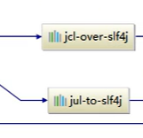
				- 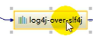
					- A over B 有种类层次上 A在B上方 的意思。这里是说把log4j替成slf4j, 但是我们现在需要使用的就是log4j。
		- [[Feb 20th, 2023]]
		  collapsed:: true
			- DONE 简单总结雅思写作的内容：抓住核心方法和技巧
				- [[雅思写作]]
			- DONE 完成组会PPT：主要是代码展示 和 深入的模型思路
			  :LOGBOOK:
			  CLOCK: [2023-02-21 Tue 08:43:06]--[2023-02-21 Tue 08:43:07] =>  00:00:01
			  :END:
		- [[Feb 21st, 2023]]
		  collapsed:: true
			- DONE 完成logseq在线博客的使用
			  :LOGBOOK:
			  CLOCK: [2023-02-22 Wed 12:53:15]--[2023-02-22 Wed 17:56:35] =>  05:03:20
			  :END:
			- DONE 完成论文方法部分的修改
			- TODO 完成毕设开题PPT的大致思考
			  :LOGBOOK:
			  CLOCK: [2023-02-22 Wed 12:53:10]--[2023-02-22 Wed 12:53:13] =>  00:00:03
			  :END:
			- TODO 粗略观察一遍开题报告中存在的问题
			  :LOGBOOK:
			  CLOCK: [2023-02-22 Wed 12:53:11]--[2023-02-22 Wed 12:53:12] =>  00:00:01
			  :END:
		- [[Feb 22nd, 2023]]
		  collapsed:: true
			- DONE 搞清楚代码随想录要不要买、如何应用其中的信息
			  :LOGBOOK:
			  CLOCK: [2023-02-24 Fri 14:43:42]--[2023-02-24 Fri 14:43:43] =>  00:00:01
			  :END:
			- TODO 搞懂代理和反向代理的原理；java设计模式中的代理和这个有相关性吗？ [[ProjectIssues]]
		- [[Feb 23rd, 2023]]
		  collapsed:: true
			- DOING 完成springboot所有视频的学习和实践
			  :LOGBOOK:
			  CLOCK: [2023-02-23 Thu 09:06:06]
			  :END:
				- DONE 完成缓存部分的学习
				  :LOGBOOK:
				  CLOCK: [2023-02-24 Fri 14:43:07]
				  CLOCK: [2023-02-24 Fri 14:43:08]--[2023-02-25 Sat 00:52:34] =>  10:09:26
				  :END:
				- DOING 完成消息队列的学习
				  :LOGBOOK:
				  CLOCK: [2023-02-24 Fri 14:43:25]--[2023-02-24 Fri 15:12:33] =>  00:29:08
				  CLOCK: [2023-02-25 Sat 17:14:15]
				  :END:
				- DONE 完成Dubbo的学习
				  :LOGBOOK:
				  CLOCK: [2023-02-24 Fri 14:43:37]--[2023-02-24 Fri 15:12:33] =>  00:28:56
				  CLOCK: [2023-02-25 Sat 00:52:40]--[2023-02-25 Sat 17:14:12] =>  16:21:32
				  :END:
			- DONE 搞懂HashMap的底层原理
			  :LOGBOOK:
			  CLOCK: [2023-03-13 Mon 13:14:46]--[2023-03-13 Mon 13:14:48] =>  00:00:02
			  :END:
			- TODO 阅读一节MySql
			- DONE 使用华为手机
			  :LOGBOOK:
			  CLOCK: [2023-03-13 Mon 13:14:50]--[2023-03-13 Mon 13:14:51] =>  00:00:01
			  :END:
			- TODO 想看看pytorch的源码是怎么写的
			- TODO 之前写的JAVA Webserver有时间的话还是需要完成
			- TODO 服务器和客户端之前到底是怎么传递数据的，是通过网络吗？ [[ProjectIssues]]
			- DONE Caused by: com.mysql.cj.exceptions.CJCommunicationsException: Communications link failure [[ProjectIssues]] 根本无法解决，貌似是连接不上数据库，可是明明我可以用mysql的workbench打开啊
			  collapsed:: true
			  :LOGBOOK:
			  CLOCK: [2023-02-23 Thu 20:57:06]
			  CLOCK: [2023-02-23 Thu 20:57:07]--[2023-02-24 Fri 12:05:29] =>  15:08:22
			  :END:
				- [(87条消息) com.zaxxer.hikari.pool.HikariPool : HikariPool-1 - Exception during pool initialization._wowYuXuan808的博客-CSDN博客_zaxxer.hikari](https://blog.csdn.net/m0_46619073/article/details/105646296)
				- 应该还是url地方出现的问题，但是很难定位是哪个字符或者空格的问题，直接用上面博客里的连接复制一下，改下数据库的名称就行。有些时候重新建立一个新文件或者重新反而是最快定位的方法，不要纠结于能搞清楚所有的文本细节。
		- [[Feb 24th, 2023]]
		  collapsed:: true
			- DONE 微信读书同步插件的payload too large [[ProjectIssues]]
			  collapsed:: true
			  :LOGBOOK:
			  CLOCK: [2023-02-24 Fri 14:42:22]--[2023-02-25 Sat 06:30:10] =>  15:47:48
			  :END:
				- 等待插件作者向logseq APIS SERVER申请权限，或者分批次与logseq进行同步
			- TODO 如何化劣势为优势、化落后为赶超、被困到突出重围？简单言，就是如何从大幅度的进度落后上来快速追赶，减小生存的劣势？历史上、职场上、学习上、科研上都有哪些相关的例子呢？ [[SolutionNotes]]
			- TODO 对于哲学问题的思考怎么才能真正地对自己的生活起到帮助？ [[SolutionNotes]]
			- TODO 如何看待信息的过于开放以及人们对完美利益的追求导致的内卷现象？如何看待知识星球带来的个人能力贬值？ [[SolutionNotes]]
			- TODO 要提高生存优势，大多数人都比较难以做到的事情包括什么？你去做这些事，才能让自己获得竞争优势。 [[SolutionNotes]]
			- TODO 哪些细节是不需要关注的？ [[SolutionNotes]]
			- DONE 找不到对应的key生成器类 [[ProjectIssues]]
			  collapsed:: true
			  :LOGBOOK:
			  CLOCK: [2023-02-24 Fri 17:36:06]
			  CLOCK: [2023-02-24 Fri 17:36:08]--[2023-02-24 Fri 17:36:26] =>  00:00:18
			  :END:
				- 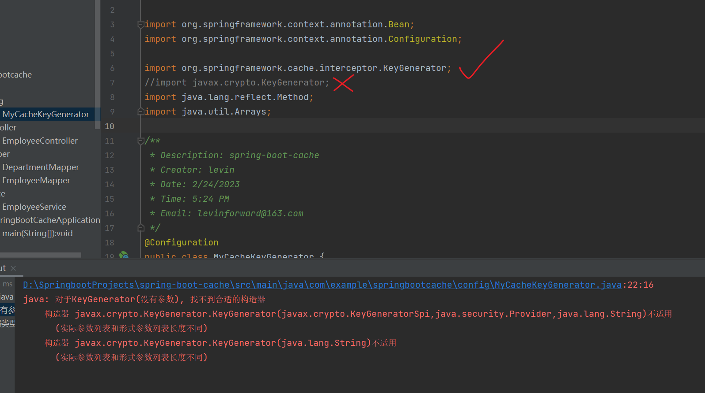
			- DONE 标注了Cacheable的方法报错如下： [[ProjectIssues]]
			  collapsed:: true
			  :LOGBOOK:
			  CLOCK: [2023-02-24 Fri 17:44:54]
			  CLOCK: [2023-02-24 Fri 17:45:01]--[2023-02-24 Fri 17:54:54] =>  00:09:53
			  :END:
				- 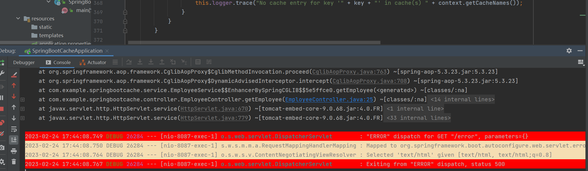
				- 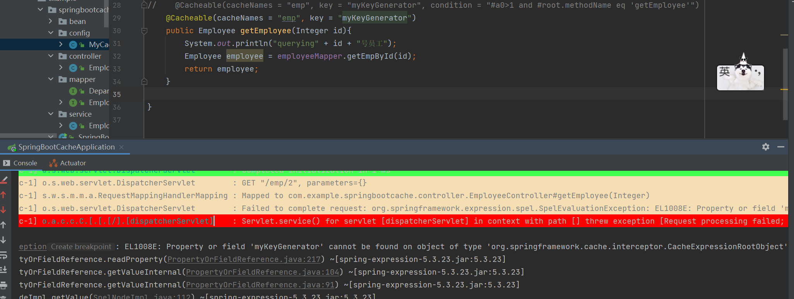
				- 加单引号的方法有效：[spring - @Cacheble annotation on no parameter method - Stack Overflow](https://stackoverflow.com/questions/33383366/cacheble-annotation-on-no-parameter-method)
			- DOING 时间一天实际上是三天、一个月实际上是90天的做法
			  :LOGBOOK:
			  CLOCK: [2023-02-24 Fri 19:17:36]
			  CLOCK: [2023-02-24 Fri 19:17:39]
			  :END:
				- 感觉没有闹钟提醒自己，并没有这种特别的意识
				- 可以按照早中晚这三个阶段来写todo，这是一个好的提醒
			- DONE docker run 的参数报错： [[ProjectIssues]]
			  collapsed:: true
			  :LOGBOOK:
			  CLOCK: [2023-02-24 Fri 19:40:34]
			  CLOCK: [2023-02-24 Fri 19:40:41]--[2023-02-24 Fri 19:47:07] =>  00:06:26
			  :END:
				- 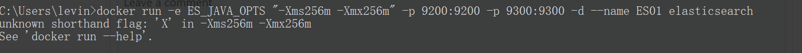
				- 在优化内存的大写常量名处少写了等于号：
					- 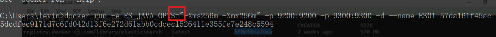
			- DONE 再次遇到发送GET请求时的报错：错误的分发 [[ProjectIssues]]
			  collapsed:: true
			  :LOGBOOK:
			  CLOCK: [2023-02-24 Fri 20:26:34]
			  CLOCK: [2023-02-24 Fri 20:26:35]--[2023-02-24 Fri 20:28:15] =>  00:01:40
			  :END:
				- 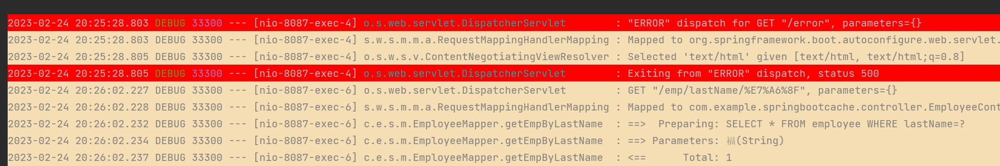
				- 错误原因是在浏览器发送的get请求的链接，函数返回的结果为null，可能是因为数据库中本来就没有该数据，也可能是因为get请求当中有文字或者空格等错误
		- [[Feb 25th, 2023]]
		  collapsed:: true
			- DONE Zookeeper Client在pom中配置可能存在问题，导致相关的slf4j日志系统报错如下： [[ProjectIssues]]
			  collapsed:: true
			  :LOGBOOK:
			  CLOCK: [2023-02-25 Sat 07:00:10]
			  CLOCK: [2023-02-25 Sat 07:00:11]--[2023-02-25 Sat 07:38:45] =>  00:38:34
			  :END:
				- 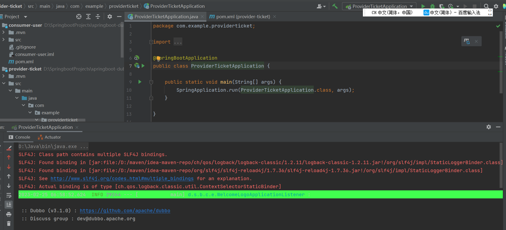
				- 这是因为zkclinet依赖中引入了其他日志相关的jar包：
				  collapsed:: true
					- 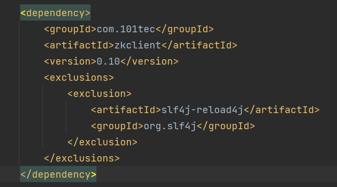
				- 这些jar包会与spring-boot-starter-logging中的logback-classic.jar包发生冲突：
				  collapsed:: true
					- 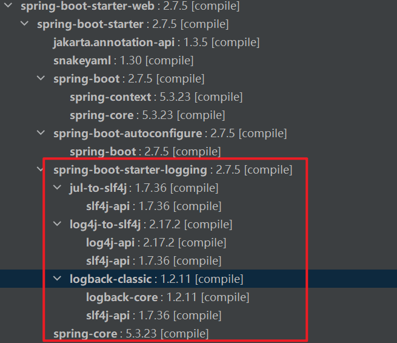
					-
				- 关于红色报错语句的含义, 参考：
					- https://www.baeldung.com/slf4j-classpath-multiple-bindings
				- 在maven repository中存在https://mvnrepository.com/artifact/com.github.sgroschupf/zkclient/0.1，其maven dependency的写法中将ZooKeeper Client简写为zkclient， **这是我们这次使用的这个**；但是也存在https://mvnrepository.com/artifact/com.101tec/zkclient，其依赖的全称是ZkClient，但是其maven dependency的写法中也是将其全部小写为zkclient.
					- 如果使用后面这个依赖，不会出现冲突
			- DONE 当使用不会引起依赖冲突的zkclient时，再将dubbo-depenencies-zookeeper在pom配置中引入后，又再次出现了slf4j日志系统的报错： [[ProjectIssues]]
			  collapsed:: true
			  :LOGBOOK:
			  CLOCK: [2023-02-25 Sat 10:02:44]
			  CLOCK: [2023-02-25 Sat 10:02:45]
			  CLOCK: [2023-02-25 Sat 10:03:20]--[2023-02-25 Sat 11:45:31] =>  01:42:11
			  :END:
				- 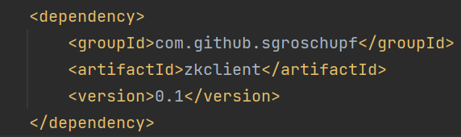
				- 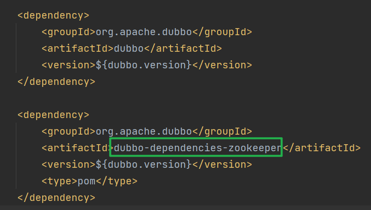
				- 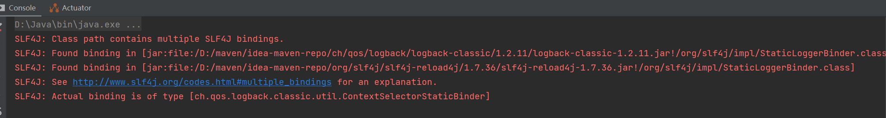
				- **原因分析与解决办法：**
					- 会造成两个jar包出现依赖冲突：
						- 一是zookeeper，其在三个地方都出现了：一是zkclient依赖中，二和三都在dubbo-dependencies-zookeeper依赖中，只不过一个是一级子依赖，另一个是五级子依赖；**其中默认使用的是3.4.13[compile] 版本，而非三个版本中的最高版本3.5.4-beta[compile].** 因为依赖冲突只会报告warning，并不会报错，由系统自己来处理exclude掉哪些，所以不处理也行，但是最好手动exclude掉版本不同的同一个依赖。**可以看到这里的console连关于zookeeper的warning都没有，只有关于日志系统的warning，这说明这个依赖冲突对项目影响不大。**
						  collapsed:: true
							- 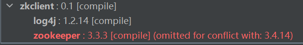
							- 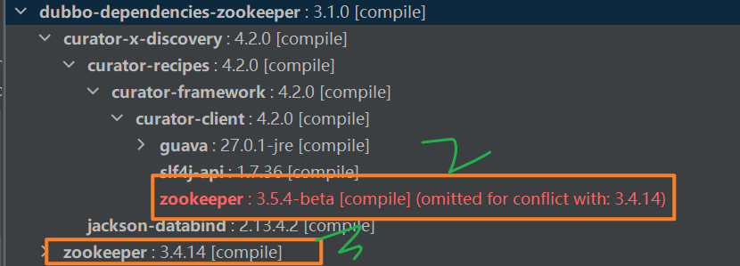
							- **其实，这也就说明导入了zkclient之后并不需要再额外导入zookeeper相关的其他依赖了，对吗？**
								- 在参考代码里是没有再导入dubbo-dependencies-zookeeper或者zookeeper的
						- 二是zkclient和dubbo-dependencies-zookeeper分别依赖了不同版本的log4j，但是系统默认排除是这个较高版本的log4j
						  collapsed:: true
							- 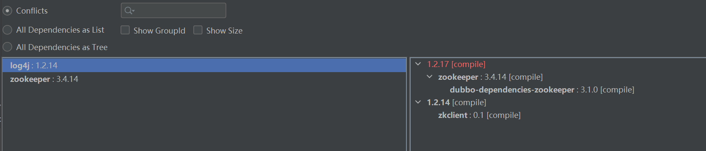
							-
			- DOING 如何不断创造聊天的话题? 如何跟任何人都能聊得开？ [[SolutionNotes]] [[ExpressionSkills]] [[InterpersonalSkills]]
			  :LOGBOOK:
			  CLOCK: [2023-02-25 Sat 09:26:05]
			  CLOCK: [2023-02-25 Sat 09:26:07]
			  :END:
			- DONE  application.properties文件对dubbo没有代码提示，同样编辑器会有一层白色的mask [[ProjectIssues]]
			  collapsed:: true
			  :LOGBOOK:
			  CLOCK: [2023-02-25 Sat 11:45:45]
			  CLOCK: [2023-02-25 Sat 11:45:52]
			  CLOCK: [2023-02-25 Sat 11:46:28]
			  CLOCK: [2023-02-25 Sat 11:46:36]--[2023-02-25 Sat 11:47:50] =>  00:01:14
			  :END:
				- 使用dubbo-spring-boot-starter的依赖, 而不使用dubbo的依赖就可以解决该问题
					- 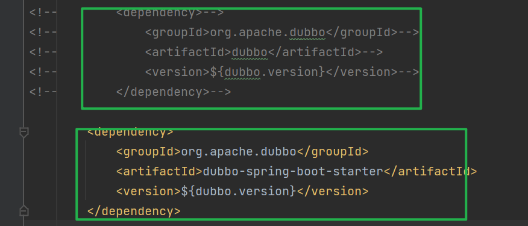
			- DOING 在consumer-user来测试是否能够正常调用provider-ticket里的函数时，发现报错如下： [[ProjectIssues]]
			  background-color:: peru
			  collapsed:: true
			  :LOGBOOK:
			  CLOCK: [2023-02-25 Sat 12:10:34]
			  CLOCK: [2023-02-25 Sat 12:10:38]
			  CLOCK: [2023-02-25 Sat 12:10:43]
			  CLOCK: [2023-02-25 Sat 12:10:52]
			  :END:
				- 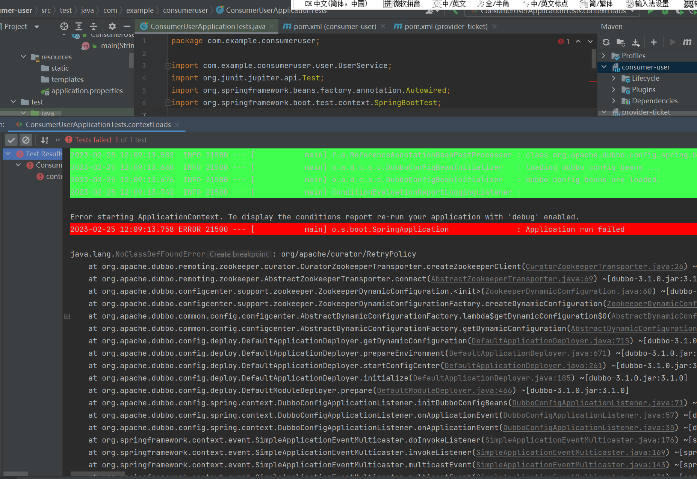
				- 
				- 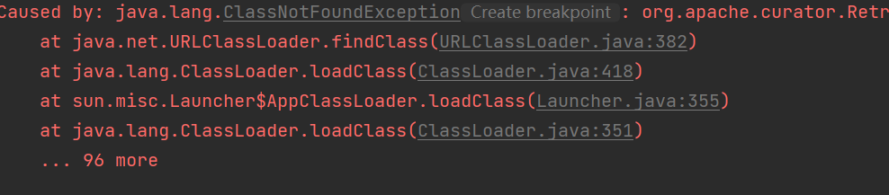
				- 问题分析与解决方案：
					-
				-
			- TODO 5min回顾这一天所学到的一些信息
			  :LOGBOOK:
			  CLOCK: [2023-02-25 Sat 14:45:21]
			  CLOCK: [2023-02-25 Sat 14:45:32]--[2023-02-25 Sat 14:45:59] =>  00:00:27
			  :END:
			- TODO 分析实用性的干货文章到底是怎么写的？哪些题材才算是干货？ [[SolutionNotes]][[主题调研]]
			- TODO 硬核能力或者说万金油能力包括哪些？ [[SolutionNotes]]
			- TODO 如何从知乎赚到我的第一桶金？ [[SolutionNotes]]
			- TODO RabbitMQ始终报错500？ [[ProjectIssues]]
			- DOING 在3天内完成抽奖系统项目
			  :LOGBOOK:
			  CLOCK: [2023-02-25 Sat 17:02:22]
			  :END:
			- TODO 刷三道leetcode题
		- [[Feb 26th, 2023]]
		  collapsed:: true
			- DONE 把学生证放在班长宿舍门口
			  :LOGBOOK:
			  CLOCK: [2023-03-03 Fri 22:20:21]--[2023-03-03 Fri 22:20:22] =>  00:00:01
			  :END:
			- DONE 看看是否需要重新安排雅思考试时间
			  :LOGBOOK:
			  CLOCK: [2023-02-27 Mon 17:57:13]--[2023-02-27 Mon 17:57:14] =>  00:00:01
			  :END:
		- [[Feb 27th, 2023]]
		  collapsed:: true
			- DONE 下午两点开年级大会 [[会议摘要]]
			  :LOGBOOK:
			  CLOCK: [2023-02-27 Mon 17:55:10]--[2023-02-27 Mon 17:55:11] =>  00:00:01
			  :END:
			- TODO 今天开始就准备写一部的简历内容：主要是项目和技术栈，这两个部分
			- TODO 大概梳理一下八股文的背诵方法
			- TODO 快速学习Redis的动力机构的视频
			- DONE 回顾下进度和预期不符的原因所在 #habit-tracker
			  :LOGBOOK:
			  CLOCK: [2023-02-27 Mon 17:55:16]
			  CLOCK: [2023-03-02 Thu 09:20:37]--[2023-03-02 Thu 09:20:39] =>  00:00:02
			  :END:
	- [[Mar]][[2023]]
	  collapsed:: true
		- [[Mar 2nd, 2023]]
		  collapsed:: true
			- DONE 去m和canada可以继续当中文作者吗，是否有相关的机构或者大学可以加入呢
			  collapsed:: true
			  :LOGBOOK:
			  CLOCK: [2023-03-02 Thu 09:21:00]
			  CLOCK: [2023-03-02 Thu 09:22:41]--[2023-03-02 Thu 10:59:39] =>  01:36:58
			  :END:
				- 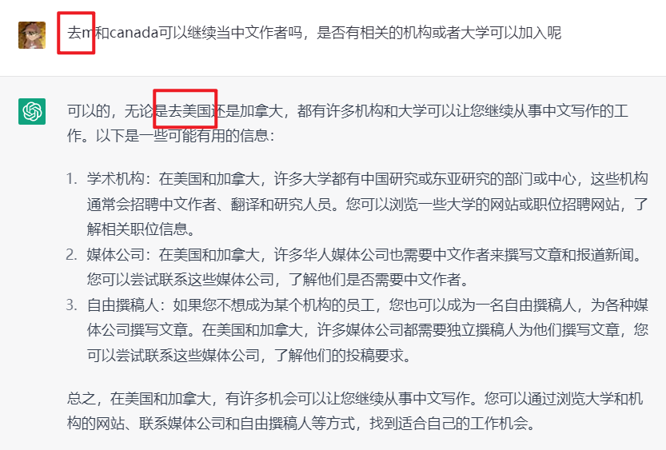
				- 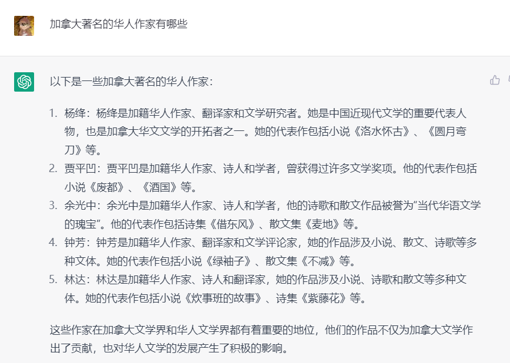
				- 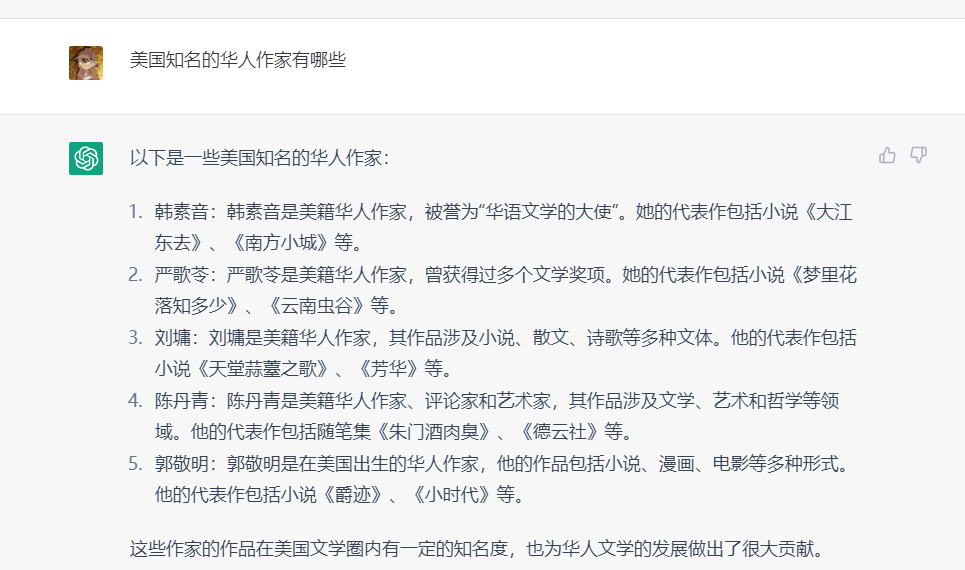
				- 
			- DONE 完成项目第九章
			  :LOGBOOK:
			  CLOCK: [2023-03-02 Thu 10:59:53]
			  CLOCK: [2023-03-02 Thu 11:10:04]
			  CLOCK: [2023-03-02 Thu 11:10:07]--[2023-03-02 Thu 15:25:22] =>  04:15:15
			  :END:
			- DONE 完成项目第10章
			  collapsed:: true
			  :LOGBOOK:
			  CLOCK: [2023-03-02 Thu 15:28:56]--[2023-03-04 Sat 08:29:46] =>  41:00:50
			  :END:
				- DONE 学习什么是散列算法
				  :LOGBOOK:
				  CLOCK: [2023-03-02 Thu 16:26:33]
				  CLOCK: [2023-03-02 Thu 16:26:35]--[2023-03-02 Thu 16:33:00] =>  00:06:25
				  :END:
				- DONE 学习什么是开放寻址和拉链寻址
				  collapsed:: true
				  :LOGBOOK:
				  CLOCK: [2023-03-02 Thu 16:33:02]--[2023-03-02 Thu 16:34:26] =>  00:01:24
				  :END:
					- 
				- DONE  编写完成代码
				  :LOGBOOK:
				  CLOCK: [2023-03-02 Thu 16:39:58]
				  CLOCK: [2023-03-02 Thu 16:40:01]
				  CLOCK: [2023-03-02 Thu 16:40:03]--[2023-03-04 Sat 08:29:45] =>  39:49:42
				  :END:
					- DONE 先梳理清楚新增代码的结构吧
					  :LOGBOOK:
					  CLOCK: [2023-03-02 Thu 20:23:29]--[2023-03-02 Thu 22:27:07] =>  02:03:38
					  :END:
					- DONE 搞懂自定义中间件的代码
					  collapsed:: true
					  :LOGBOOK:
					  CLOCK: [2023-03-02 Thu 22:27:12]
					  CLOCK: [2023-03-02 Thu 22:27:14]--[2023-03-03 Fri 17:44:12] =>  19:16:58
					  :END:
						- DONE 搞懂mybatis拦截器的作用
						  :LOGBOOK:
						  CLOCK: [2023-03-03 Fri 09:09:51]
						  CLOCK: [2023-03-03 Fri 09:09:52]--[2023-03-03 Fri 17:43:59] =>  08:34:07
						  CLOCK: [2023-03-03 Fri 17:44:05]--[2023-03-03 Fri 17:44:06] =>  00:00:01
						  CLOCK: [2023-03-03 Fri 17:44:07]--[2023-03-03 Fri 17:44:07] =>  00:00:00
						  CLOCK: [2023-03-03 Fri 17:44:08]--[2023-03-03 Fri 17:44:09] =>  00:00:01
						  :END:
					- DONE 完成测试部分的代码并跑通
					  :LOGBOOK:
					  CLOCK: [2023-03-02 Thu 16:40:22]
					  CLOCK: [2023-03-02 Thu 16:40:23]--[2023-03-02 Thu 16:41:00] =>  00:00:37
					  CLOCK: [2023-03-03 Fri 17:44:22]--[2023-03-03 Fri 22:36:30] =>  04:52:08
					  :END:
					- DONE 简单回顾或者查看他人作业
					  :LOGBOOK:
					  CLOCK: [2023-03-02 Thu 16:40:37]
					  CLOCK: [2023-03-02 Thu 16:40:51]--[2023-03-02 Thu 16:41:01] =>  00:00:10
					  CLOCK: [2023-03-03 Fri 22:20:33]--[2023-03-03 Fri 22:20:33] =>  00:00:00
					  CLOCK: [2023-03-03 Fri 22:20:35]--[2023-03-04 Sat 08:29:43] =>  10:09:08
					  :END:
			- TODO 真的搞懂动态代理，并用讲故事的方向写一篇公众号谈谈自己对其的理解
			- TODO 将接口的拓展性的本质、插件生态的本质扩展到自身的工作和学习，要弹出具体来怎么做
			- DONE check logseq wechat sync
			  :LOGBOOK:
			  CLOCK: [2023-03-02 Thu 13:11:57]--[2023-03-02 Thu 13:30:57] =>  00:19:00
			  :END:
			- TODO 思考哪些是赚钱的不变的商业逻辑，也就是哪些行业过去、现在以及将来都将能够持续赚钱
		- [[Mar 3rd, 2023]]
		  collapsed:: true
			- TODO 总结小红书上的热点话题分类以及什么才是年轻人真正的痛点问题：如何做到真知灼见
			- TODO 由小红书SDE群里的讨论进一步思考如何创建自己的副业和开启自己的第二事业
			- TODO web3创业风口是否靠谱；投资人是依据什么来进行投资判断的
			- DONE 洗澡洗衣服
			  :LOGBOOK:
			  CLOCK: [2023-03-03 Fri 13:31:10]--[2023-03-03 Fri 13:31:11] =>  00:00:01
			  :END:
			- DONE 师兄改论文
			  :LOGBOOK:
			  CLOCK: [2023-03-03 Fri 22:19:52]--[2023-03-03 Fri 22:19:53] =>  00:00:01
			  :END:
			- TODO 搞懂JDK中动态代理的源码，尝试写一些笔记总结
			- TODO 如何理解springboot中的XXXXAutoConfig类
			- TODO 写一本访谈录：记录一些深刻的东西
			- [[Reward]]
				- TODO 固定每天买外卖的时间为11点、固定中午吃饭的时间是12:10
				- DONE 继续摆弄微信插件
				  :LOGBOOK:
				  CLOCK: [2023-03-03 Fri 22:19:42]--[2023-03-03 Fri 22:19:43] =>  00:00:01
				  :END:
				- TODO 问问张斌龙如何看待大家的技术最终都差不多这件事
		- [[Mar 4th, 2023]]
		  collapsed:: true
			- TODO 微信公众号架构和框架能力连续打卡5次：把生活中一些常见的框架给可视化在纸张上
			- TODO 沟通能力训练大挑战：给自己设定一些对话场景，去进行挑战
			- [[Morning]]
				- DONE 完成项目学习第11章
				  collapsed:: true
				  :LOGBOOK:
				  CLOCK: [2023-03-04 Sat 08:30:03]
				  CLOCK: [2023-03-04 Sat 08:30:04]--[2023-03-05 Sun 00:21:22] =>  15:51:18
				  :END:
					- DONE 阅读基本思路
					  :LOGBOOK:
					  CLOCK: [2023-03-04 Sat 08:30:27]--[2023-03-04 Sat 09:18:48] =>  00:48:21
					  :END:
					- DONE 看懂和编写主要代码，剩余代码复制
					  :LOGBOOK:
					  CLOCK: [2023-03-04 Sat 09:18:56]--[2023-03-05 Sun 00:21:18] =>  15:02:22
					  :END:
					- DONE 查看和跑通测试类，在测试类里debug相关流程
					  :LOGBOOK:
					  CLOCK: [2023-03-05 Sun 00:21:19]--[2023-03-05 Sun 00:21:20] =>  00:00:01
					  :END:
					- DONE 阅读部分其他人的笔记
					  :LOGBOOK:
					  CLOCK: [2023-03-05 Sun 00:21:20]--[2023-03-05 Sun 00:21:21] =>  00:00:01
					  :END:
				- DONE 完成项目学习第12章
				  :LOGBOOK:
				  CLOCK: [2023-03-05 Sun 00:21:26]--[2023-03-06 Mon 14:00:21] =>  37:38:55
				  :END:
			- [[Afternoon]]
				- DONE 完成项目学习第13章
				  :LOGBOOK:
				  CLOCK: [2023-03-07 Tue 23:15:43]--[2023-03-07 Tue 23:15:44] =>  00:00:01
				  :END:
				- DONE 完成项目学习第14章
				  :LOGBOOK:
				  CLOCK: [2023-03-07 Tue 23:15:45]--[2023-03-07 Tue 23:15:47] =>  00:00:02
				  :END:
				- DONE 完成项目学习第15章
				  :LOGBOOK:
				  CLOCK: [2023-03-07 Tue 23:15:47]--[2023-03-07 Tue 23:15:49] =>  00:00:02
				  :END:
			- [[Night]]
				- DONE 完成项目学习第16章
				  :LOGBOOK:
				  CLOCK: [2023-03-07 Tue 23:15:54]--[2023-03-13 Mon 13:14:22] =>  133:58:28
				  :END:
				- TODO 完成项目学习第17章
				- TODO 完成项目学习第18章
				- TODO 完成项目学习第19章
			- [[Reward]]
				- [[52句生日祝福]]
				  collapsed:: true
					- TODO 分为生活篇、读书篇等，重新思考如何写得具有知识性和科学性，参考chatGPT的回复
					  :LOGBOOK:
					  CLOCK: [2023-03-04 Sat 16:26:39]--[2023-03-04 Sat 16:26:40] =>  00:00:01
					  :END:
					- TODO 以自己吃的午饭和晚饭来写一首关于福子的东西
					- TODO 以刚才那句诗句来写一下福兴
					- TODO 听众和读者的关系
		- [[Mar 5th, 2023]]
		  collapsed:: true
		  :LOGBOOK:
		  CLOCK: [2023-03-05 Sun 14:12:12]
		  :END:
			- DONE 完成简历第一版：达到能够直接投递各种公司的效果
			  collapsed:: true
			  :LOGBOOK:
			  CLOCK: [2023-03-05 Sun 14:12:31]
			  CLOCK: [2023-03-05 Sun 14:12:38]--[2023-03-07 Tue 23:15:58] =>  57:03:20
			  :END:
				- DONE 确定使用什么简历模板、什么风格
				  :LOGBOOK:
				  CLOCK: [2023-03-06 Mon 14:00:13]--[2023-03-06 Mon 14:00:15] =>  00:00:02
				  :END:
				- DONE 设计一下简历的各个模块内容：重点突出、搭配企业需求
				  :LOGBOOK:
				  CLOCK: [2023-03-06 Mon 14:00:14]--[2023-03-06 Mon 14:00:17] =>  00:00:03
				  :END:
				- DONE 让别人帮忙修改一下
				  :LOGBOOK:
				  CLOCK: [2023-03-06 Mon 14:00:14]--[2023-03-07 Tue 23:15:57] =>  33:15:43
				  :END:
		- [[Mar 6th, 2023]]
		  collapsed:: true
			- TODO 搞清楚外企面试的流程
			  :LOGBOOK:
			  CLOCK: [2023-03-06 Mon 14:17:37]--[2023-03-06 Mon 14:17:42] =>  00:00:05
			  :END:
			- TODO 筛选几家非常想去的公司
			- TODO 思考为啥这些计算机大牛能够设计出巧妙的东西，作为一名计算机科学家最重要的想象力是什么呢
			- TODO 为了避免面试时，电脑出现一些故障，需要提前做一些准备
			- TODO 分析下几个大V的写作风格和话题
			- TODO 谈谈积累这个话题 简单谈论
			- TODO 写一些别人没有写过的项目或者工具吧
			- TODO 问问卡哥或者小傅哥修改简历，以及后面要怎么争取外企或者合适的国内私企
			- TODO 指定一个基本的海投策略
		- [[Mar 7th, 2023]]
		  collapsed:: true
			- TODO 公众号写哈佛三个建议以及自己需要的三类导师和三类朋友
				- 辩论之友
				- 读书之友
				- 写作之友
				- 编程之友
			- TODO 思考上瘾的坏处；哪些问题的思考属于过度思考
			- TODO 随时从头开始的能力组成要素？有哪些名人做到了如此？随时从头开始的勇气来自何方？
		- [[Mar 8th, 2023]]
		  collapsed:: true
			- TODO 找到牛客网上想去公司的编程题
				- DONE 刷完一个公司
				  :LOGBOOK:
				  CLOCK: [2023-03-08 Wed 13:51:11]--[2023-03-08 Wed 13:51:12] =>  00:00:01
				  :END:
			- TODO 11号之前修改完第二版简历，开始投递
			- TODO 学习一个JDK的源码
			- TODO 完成对JVM部分的学习和理解，思考如何进行有效记忆
		- [[Mar 9th, 2023]]
		  collapsed:: true
			- TODO 做完paypal的笔试题
			- TODO 公众号：as an ordinary people who are not willing to be tolerant of the boredom of life, what interesting thing could I create? What valuable things could I do? 罗列出具体的我可以创造出价值的事情
			- TODO 逻辑能力训练的题目和小游戏：一周一次，甚至可以以此来写一个小红书主题
			- TODO 复习所有的排序算法代码（时间复杂度以及稳定不稳定）
			- TODO java中常用的数据结构用法
			- TODO 把当前的笔记本作为creative book
		- [[Mar 10th, 2023]]
		  collapsed:: true
			- TODO 思考自己到底喜欢不同国家的根本是什么：是物质还是精神层面
		- [[Mar 13th, 2023]]
		  collapsed:: true
			- DONE 记录导致我效率降低的事情
			  collapsed:: true
			  :LOGBOOK:
			  CLOCK: [2023-03-13 Mon 13:26:09]--[2023-03-13 Mon 13:26:10] =>  00:00:01
			  :END:
				- [[EfficiencyLoweringSourceCheckList]] [[CheckList]]
			- DONE 记录昨日犯下的蠢事
			  collapsed:: true
			  :LOGBOOK:
			  CLOCK: [2023-03-13 Mon 13:35:11]--[2023-03-13 Mon 13:35:16] =>  00:00:05
			  :END:
				- [[Yesterday'sStupidness]]
			- DOING 写stringbuffer的代码实例
			  :LOGBOOK:
			  CLOCK: [2023-03-13 Mon 16:23:07]
			  CLOCK: [2023-03-13 Mon 16:23:08]
			  :END:
			-
		- [[Mar 14th, 2023]]
			- DOING 调研一下加拿大博士和澳洲博士的去向问题
			  :LOGBOOK:
			  CLOCK: [2023-03-14 Tue 20:58:22]
			  :END:
			- DONE 完成JVM八股文的学习
			  :LOGBOOK:
			  CLOCK: [2023-03-14 Tue 20:58:35]--[2023-03-14 Tue 20:58:37] =>  00:00:02
			  CLOCK: [2023-03-17 Fri 18:48:28]--[2023-03-19 Sun 08:54:45] =>  38:06:17
			  :END:
		- [[Mar 15th, 2023]]
			- TODO 看看能不能搞到往年各个外企或者其他大厂的面试题和笔试题
			- TODO 完成项目的后面部分
		- [[Mar 16th, 2023]]
			- TODO 现在的推荐算法容易让人陷入信息茧房、如何设计一个有趣的推荐算法来打开读者的视野而不是同质化内容呢
			- TODO 算法业务的痛点是什么、现存开发业务系统的痛点问题又是什么，微信公众号写一篇：what is the common problem of current java development?
		- [[Mar 17th, 2023]]
			- DONE 开始思考的最佳时机 [[MyWeChatFeeds]]
			  :LOGBOOK:
			  CLOCK: [2023-03-18 Sat 23:21:52]--[2023-03-18 Sat 23:21:53] =>  00:00:01
			  :END:
				- 别人开始贪婪时我开始恐慌，别人开始恐慌时我开始贪婪
			- TODO 像小傅哥那样写完一个完整的项目分析
			- DONE 编程语言中的套娃术 [[MyWeChatFeeds]]
			  collapsed:: true
			  :LOGBOOK:
			  CLOCK: [2023-03-18 Sat 23:22:03]--[2023-03-18 Sat 23:22:07] =>  00:00:04
			  CLOCK: [2023-03-18 Sat 23:22:39]--[2023-03-18 Sat 23:22:40] =>  00:00:01
			  CLOCK: [2023-03-18 Sat 23:22:41]--[2023-03-18 Sat 23:22:42] =>  00:00:01
			  :END:
				- 可以用java语言来解析jvm，可以用python代码生成的模型来写模型
				- 如果他自己能够修改自己，也就具备了智能的基础
				- 套娃 是 一种逻辑悖论吗？套娃逻辑可以被破坏吗？
			- DONE 整理一下求职过程中需要做的事情
			  :LOGBOOK:
			  CLOCK: [2023-03-17 Fri 18:22:05]
			  CLOCK: [2023-03-17 Fri 18:22:07]--[2023-03-17 Fri 18:48:17] =>  00:26:10
			  :END:
				- [[JobSearching]]
			- DOING 运动10min
			  :LOGBOOK:
			  CLOCK: [2023-03-17 Fri 18:48:56]
			  CLOCK: [2023-03-17 Fri 18:48:58]
			  :END:
			- DONE 总结一下自己看到的比较好的学习笔记的特点 [[MyWeChatFeeds]]
			  collapsed:: true
			  :LOGBOOK:
			  CLOCK: [2023-03-17 Fri 18:56:33]
			  CLOCK: [2023-03-17 Fri 18:56:34]--[2023-03-17 Fri 18:56:50] =>  00:00:16
			  CLOCK: [2023-03-17 Fri 18:56:51]--[2023-03-18 Sat 23:20:57] =>  28:24:06
			  :END:
				- 通俗易懂：对于知识点的理解采用 官方 + 自己的话 的方式进行阐述
				- 喜欢用类比的方法
				- 知识点之间的结构层次关系非常清楚，不会让人觉得非常混乱
				- 增加必要的图片以及手写图
				- 尽可能地去讲述为什么这样做，而不只是怎么做
			- DONE 分析一下车库工程师的文字特点 [[MyWeChatFeeds]]
			  collapsed:: true
			  :LOGBOOK:
			  CLOCK: [2023-03-17 Fri 19:00:34]
			  CLOCK: [2023-03-17 Fri 19:00:35]--[2023-03-18 Sat 23:17:13] =>  28:16:38
			  :END:
				- 文章结构是总分总巨多，篇幅不多不少，非常合适一次性阅读
				- 语言非常连贯，读起来没有让人感到困惑或者纠结的地方
				- 有对别人观点的参考或者隐述
				- 对题目扣得非常紧凑，一环接着一环，没有一种逻辑中断的感觉，反而是逻辑递增
				- 文章有一个整体性的框架脉络
				- 文章的内容非常干，虽然看上去也是有一些理论性，但是却让人觉得非常具体，像是跟你在面对面说闲话的感觉，不会有书面气
		- [[Mar 18th, 2023]]
			- TODO 模仿达芬奇笔记的一页纸来把自己所有喜欢的东西放在一张纸上
			- DONE 谈谈制造业中能够收获的东西 [[MyWeChatFeeds]][[制造业]]
			  collapsed:: true
			  :LOGBOOK:
			  CLOCK: [2023-03-18 Sat 23:03:49]--[2023-03-18 Sat 23:06:15] =>  00:02:26
			  :END:
				- 成本控制和质量把控很重要
				- 对于流程中可能被员工利用的环节要多加小心
			- DONE 总结一下前期文章烂在哪里 [[MyWeChatFeeds]]
			  collapsed:: true
			  :LOGBOOK:
			  CLOCK: [2023-03-18 Sat 23:08:52]--[2023-03-18 Sat 23:11:48] =>  00:02:56
			  :END:
				- 没有必要总是写自己的计划或者一些想法的过程，而是直接展示结果
				- 图片和内容缺乏关联，图片只是为了吸引读者
				- 自己还没有对内容思考清楚，就开始写，完全是把公众号当成了草稿；只要是面向外界的就一定要进行一定层次的加工
				- 最好是把图片和文字分开，因为图片上的文字不便修改也不便阅读
				- 没有数据或者故事的支撑
				- 排版还不够精简大方
			- DONE 直面我一天中的痛苦之处
			  collapsed:: true
			  :LOGBOOK:
			  CLOCK: [2023-03-18 Sat 21:04:42]--[2023-03-18 Sat 22:36:27] =>  01:31:45
			  :END:
				- [[PainPointsCheckList]]
			- DONE 写下自媒体的后续思路 [[MyWeChatFeeds]]
			  collapsed:: true
			  :LOGBOOK:
			  CLOCK: [2023-03-18 Sat 22:36:30]
			  CLOCK: [2023-03-18 Sat 22:36:35]--[2023-03-18 Sat 23:03:30] =>  00:26:55
			  :END:
				- 小红书平台和微信公众号都命名为“坎德的二次重构”，签名改为：“爱因斯坦说过，想象力比知识更重要。在这个被信息流淹没的时代里，你是否反而失去了对知识的好奇和热忱？你是否愈来愈对繁杂错乱的声音感到厌烦？我是坎德，历经坎坷，也曾忐忑，但却不愿同世俗讲武德，希望终能胜之有德。我呼吁每个人都能在头脑空间里慢下来，我希望每个人都能重新呼唤自己的想象力，我期待每个人都可以重构对于自我以及外部世界的固有看法。”
				- 知识星球和博客写“分布式系统”的学习笔记
		- [[Mar 19th, 2023]]
			- [[今天的杂思和杂绪]]
				- DONE 我的笔记模型 [[MyWeChatFeeds]]
				  collapsed:: true
				  :LOGBOOK:
				  CLOCK: [2023-03-19 Sun 16:07:12]--[2023-03-19 Sun 16:07:13] =>  00:00:01
				  :END:
					- 还是以logseq博客为主，辅助添加csdn、gitbook、知识星球和语雀链接
					- 尝试开发一款插件能更好地展示logseq的侧边栏
				- DONE 关于我的技术学习如何进一步提高 [[MyWeChatFeeds]]
				  collapsed:: true
				  :LOGBOOK:
				  CLOCK: [2023-03-19 Sun 16:13:45]
				  CLOCK: [2023-03-19 Sun 16:13:52]--[2023-03-20 Mon 09:17:23] =>  17:03:31
				  :END:
					- 也就是我有哪些东西是我没有真的学会的
					- 我没有学会如何做技术笔记，没有形成自己笔记的一套框架
					- 我没有学会如何造轮子，在有参考资料的情况下不知道如何对轮子进行优化和改进
					- 我没有学会自己从不方便中提取需求，编写自己的工具
					- 我没有学会进行交流，如何找话题、如何谈话题、如何拓展话题
			- [[今天用不同的模式做一件事]]
				- DONE 只睡中午一次午觉，其余时间不能再打瞌睡
				  :LOGBOOK:
				  CLOCK: [2023-03-19 Sun 16:08:12]
				  CLOCK: [2023-03-19 Sun 16:08:14]--[2023-03-20 Mon 09:12:02] =>  17:03:48
				  :END:
			- [[今天做一件让自己保持活力的事]]
				- DONE 阅读10min
				  :LOGBOOK:
				  CLOCK: [2023-03-19 Sun 13:45:51]--[2023-03-19 Sun 13:45:52] =>  00:00:01
				  :END:
			- [[每日三件事]]
				- DONE 完成mysql八股文的学习
				  :LOGBOOK:
				  CLOCK: [2023-03-19 Sun 08:53:00]
				  CLOCK: [2023-03-19 Sun 08:53:04]
				  CLOCK: [2023-03-19 Sun 09:07:17]--[2023-03-21 Tue 10:59:39] =>  49:52:22
				  :END:
			- [[每日零散任务]]
				- DONE 理发
				  :LOGBOOK:
				  CLOCK: [2023-03-19 Sun 21:58:46]--[2023-03-19 Sun 21:58:47] =>  00:00:01
				  :END:
		- [[Mar 20th, 2023]]
			- [[昨日复盘]]
			  collapsed:: true
				- 还是太固定在一件事上了，不懂得切换
				- 不知道如何才能有效切换注意力
				- 被繁杂信息干扰过重，即便有些信息的质量很高，却未必是需要的，同时也应该学会集中管理
				- 只完成了目标中的一件事的80%
			- [[今天的杂思和杂绪]]
				- 关于自己的目标和行动，开始阶段最好只让自己知道
				- 要用放大镜看自己与model之间的区别、目前的能力与目标之间的具体区别
					- [[MaginifyingDifferenceLocations]]
			- [[今天用不同的模式做一件事]]
				- DOING  整理刷题的关键思路提示
				  :LOGBOOK:
				  CLOCK: [2023-03-20 Mon 09:43:51]
				  CLOCK: [2023-03-20 Mon 09:43:53]
				  CLOCK: [2023-03-20 Mon 09:44:07]
				  :END:
				- DOING 开始学习雅思的听力部分了
				  :LOGBOOK:
				  CLOCK: [2023-03-20 Mon 13:18:06]
				  CLOCK: [2023-03-20 Mon 13:18:09]
				  :END:
			- [[今天做一件让自己保持活力的事]]
			- [[每日三件事]]
				- DONE  完成Redis部分的学习
				  :LOGBOOK:
				  CLOCK: [2023-03-21 Tue 10:56:53]--[2023-03-21 Tue 10:56:54] =>  00:00:01
				  :END:
				- DONE 阅读完上次的论文，写完组会汇报的PPT
				- TODO 刷完paypal的笔试题
			- [[每日零散任务]]
				- TODO 投递阿里的小公司小部门
				- TODO 投递其他一些小公司
			- [[昨日时间补偿]]
				- DONE 阿里一道leetcode
				  :LOGBOOK:
				  CLOCK: [2023-03-20 Mon 20:25:54]--[2023-03-21 Tue 10:56:49] =>  14:30:55
				  :END:
				- TODO 阿里第二道leetcode
		- [[Mar 21st, 2023]]
			- [[今天的杂思和杂绪]]
			  collapsed:: true
				- 发现自己总喜欢切换主题的原因是，无法对抗无聊和重复的pattern
				- 只要切换到全屏模式，能够减少我对主题的厌烦感
				- 只有每天都是生产者，才能真正地保持活力
				- DONE 如何框架性地去设计自己的简历投递过程？
				  collapsed:: true
				  :LOGBOOK:
				  CLOCK: [2023-03-21 Tue 14:23:56]--[2023-03-21 Tue 14:28:53] =>  00:04:57
				  :END:
					- 招聘方和求职者的博弈动态
					- 竞争者的竞争状态
					- 招聘者对人才的竞争状态
					- 竞争者自己个人实力和能力期望的平衡
					- 招聘者利润和成本的平衡
					- 第三方学校、政策、以及社会评价体系的介入
					- 个人简历投递的关键要素：
						- 时间线：真正理解不同公司不同招聘策略变动的原因，比如为何延迟招聘、为何提前招聘、企业是如何确定某个岗位的HC人数的
						- 面试内容的均衡掌控，要确保自己具有灵活的专业能力，对于面试问题的解答要有专业性、拓展性、细节性
						- 与HR、内推人、面试官的有效沟通：避免在同一问题上反复拉扯，要增加自己给对方的印象、避免自己这一方的频繁变动
			- [[今天用不同的模式做一件事]]
				- DONE 明确且固定的阅读时间、睡眠时间
				  collapsed:: true
				  :LOGBOOK:
				  CLOCK: [2023-03-21 Tue 13:05:15]
				  CLOCK: [2023-03-21 Tue 13:05:16]--[2023-03-21 Tue 14:16:17] =>  01:11:01
				  :END:
					- 吃完饭就阅读10min，然后睡觉60min
			- [[今天做一件让自己保持活力的事]]
				- DONE 阅读10min
				  :LOGBOOK:
				  CLOCK: [2023-03-21 Tue 12:43:10]
				  CLOCK: [2023-03-21 Tue 12:43:12]
				  CLOCK: [2023-03-21 Tue 12:43:15]--[2023-03-21 Tue 12:43:20] =>  00:00:05
				  :END:
			- [[每日三件事]]
				- DOING 刷完携程算法题
				  :LOGBOOK:
				  CLOCK: [2023-03-21 Tue 11:00:03]
				  :END:
				- TODO 看完抽奖系统后面三节的文字版内容
				- NOW 做完会议室的两道leetcode和K个数的leetcode题
				  :LOGBOOK:
				  CLOCK: [2023-03-27 Mon 21:11:29]
				  :END:
			- [[每日零散任务]]
				- DONE 完成CAS八股文的学习
				  :LOGBOOK:
				  CLOCK: [2023-03-27 Mon 21:11:19]--[2023-03-27 Mon 21:11:20] =>  00:00:01
				  :END:
				- TODO 简单看下网络部分的八股文
		- [[Mar 22nd, 2023]]
			- [[今天的杂思和杂绪]]
				- DONE  高中的数学题到底是谁出的、怎么出的，同样Leetcode的题目又该如何去出 [[MyWeChatFeeds]]
				  :LOGBOOK:
				  CLOCK: [2023-03-22 Wed 13:20:44]
				  CLOCK: [2023-03-22 Wed 13:20:46]
				  CLOCK: [2023-03-22 Wed 13:20:51]--[2023-03-22 Wed 17:13:57] =>  03:53:06
				  :END:
				- DOING  手撕代码github项目
				  :LOGBOOK:
				  CLOCK: [2023-03-22 Wed 13:35:27]
				  CLOCK: [2023-03-22 Wed 13:35:29]
				  :END:
				- DOING 创建一个分布式系统学习的github项目
				  :LOGBOOK:
				  CLOCK: [2023-03-22 Wed 13:35:51]
				  CLOCK: [2023-03-22 Wed 13:35:53]
				  :END:
				- DOING 后续java的细分子方向 [[MyWeChatFeeds]]
				  :LOGBOOK:
				  CLOCK: [2023-03-22 Wed 13:37:40]
				  CLOCK: [2023-03-22 Wed 13:37:42]
				  :END:
				- DONE  出题家的春天系列 [[MyWeChatFeeds]]
				  collapsed:: true
				  :LOGBOOK:
				  CLOCK: [2023-03-22 Wed 13:54:16]
				  CLOCK: [2023-03-22 Wed 13:54:18]--[2023-03-22 Wed 17:13:55] =>  03:19:37
				  :END:
					- 有没有可能在没有开天眼的情况下暴力路径才是正确
					- life就像刷题一样
			- [[今天用不同的模式做一件事]]
				- DOING 把leetcode 2000题的题目看完
				  :LOGBOOK:
				  CLOCK: [2023-03-22 Wed 15:28:39]
				  :END:
			- [[今天做一件让自己保持活力的事]]
			- [[每日三件事]]
				- DONE 刷完美团的算法题
				  collapsed:: true
				  :LOGBOOK:
				  CLOCK: [2023-03-22 Wed 13:24:04]--[2023-03-23 Thu 19:40:26] =>  30:16:22
				  :END:
					- DONE 美团第二题
					  :LOGBOOK:
					  CLOCK: [2023-03-22 Wed 20:05:26]
					  CLOCK: [2023-03-22 Wed 20:05:28]--[2023-03-22 Wed 23:57:37] =>  03:52:09
					  :END:
						- 错误的原因是色彩的种数与位置不具有单调的相加或者相减的关系
						- 我为啥觉得不需要使用map来统计统计不同颜色出现的次数？
							- 因为我觉得次数可能并不会被用到
							- 次数必须被直接用到的，因为当从区间范围内移除一个元素时，并不一定会导致该区间内的颜色总数减小1，此时该区间范围内必然存在该颜色大于等于2次。如果不统计每种颜色出现的次数，当左指针向后移动时，就无法判断此时区间内的颜色总数了
							- 如果次数不直接用到，会有问题：如果使用set，当增加元素时，可以判断该颜色是否已经存在，若已经存在，则颜色总是加一；set的大小也可以反应区间内的颜色总数；但是，当移除元素时，无法判断移除该元素后的区间的颜色总数是否减少，因为并不清楚该元素在区间内有几个
						- 我改正后的代码问题又出现在哪里？
							- 认为选取的彩带的颜色的总数目必须为K
							- 也连带认为 N不能比K小
							- 复杂度为N^2, 超时了
						- 色彩的种数应该并不是一定能够达到K，因为N 有可能小于 K，但是应该当种树越接近所给的K时，长度会更长
					- DONE 美团第三题
					  :LOGBOOK:
					  CLOCK: [2023-03-23 Thu 08:49:52]
					  CLOCK: [2023-03-23 Thu 08:49:56]--[2023-03-23 Thu 14:22:53] =>  05:32:57
					  :END:
					- DONE 美团第四题
					  :LOGBOOK:
					  CLOCK: [2023-03-23 Thu 14:22:56]--[2023-03-23 Thu 19:40:25] =>  05:17:29
					  :END:
						-
				- TODO 找一下牛客中的输入输出练习
					- DONE HashMap怎么只获得其中一个元素？这个元素的类型是Map.Entry吗？
					  :LOGBOOK:
					  CLOCK: [2023-03-26 Sun 08:08:14]--[2023-03-26 Sun 08:08:29] =>  00:00:15
					  :END:
					- DONE 哪些数据结构需要使用迭代器进行遍历？怎么进行迭代的呢？
					  :LOGBOOK:
					  CLOCK: [2023-03-26 Sun 08:08:29]--[2023-03-26 Sun 08:08:30] =>  00:00:01
					  :END:
					- DONE 完成stringbuffer的代码练习
					  :LOGBOOK:
					  CLOCK: [2023-03-26 Sun 08:08:38]
					  CLOCK: [2023-03-26 Sun 08:08:39]--[2023-03-26 Sun 08:40:39] =>  00:32:00
					  :END:
				- TODO 扫读一下代码随想录中的dp部分
			- [[每日零散任务]]
			- [[昨日复盘]]
		- [[Mar 23rd, 2023]]
		  collapsed:: true
			- [[今天的杂思和杂绪]]
				- DONE 算法岗和开发岗的形象理解 [[MyWeChatFeeds]]
				  :LOGBOOK:
				  CLOCK: [2023-03-23 Thu 09:27:13]
				  CLOCK: [2023-03-23 Thu 09:27:14]--[2023-03-25 Sat 00:13:29] =>  38:46:15
				  :END:
					- 皇帝的淘金师和房屋构造师
					- 用意象理解其他事物：比如如何理解二维数组的前缀和的思想
				- DOING  菜与不菜的真正判断点是什么 [[MyWeChatFeeds]]
				  :LOGBOOK:
				  CLOCK: [2023-03-24 Fri 11:21:20]
				  CLOCK: [2023-03-24 Fri 11:21:22]
				  :END:
					- 大佬也有很多菜的地方，哪是因为你没有看到一个更厉害的大佬，没有经历过降维打击
					- 对不确定性的积累
					- 技术人为啥赚不了太多钱？普遍现象，而非单纯在计算机行业
				- DOING 写作的坏处 [[MyWeChatFeeds]]
				  :LOGBOOK:
				  CLOCK: [2023-03-23 Thu 09:31:17]
				  CLOCK: [2023-03-23 Thu 09:31:22]
				  :END:
				- DOING 事件组合的逻辑有哪些 [[MyWeChatFeeds]]
				  :LOGBOOK:
				  CLOCK: [2023-03-23 Thu 10:18:45]
				  CLOCK: [2023-03-23 Thu 10:18:48]
				  :END:
				- DONE  写作就像蜘蛛网 [[MyWeChatFeeds]]
				  :LOGBOOK:
				  CLOCK: [2023-03-24 Fri 15:36:20]
				  CLOCK: [2023-03-24 Fri 15:36:22]--[2023-03-25 Sat 00:13:24] =>  08:37:02
				  :END:
				- DOING 自己的写作简单纠错 [[MyWeChatFeeds]]
				  :LOGBOOK:
				  CLOCK: [2023-03-24 Fri 15:36:49]
				  CLOCK: [2023-03-24 Fri 15:36:50]
				  :END:
				- DOING 八股文创新式记忆法 [[MyWeChatFeeds]]
				  :LOGBOOK:
				  CLOCK: [2023-03-24 Fri 15:37:31]
				  CLOCK: [2023-03-24 Fri 15:37:32]
				  :END:
				- DOING 怎么构建深度关系 [[MyWeChatFeeds]]
				  :LOGBOOK:
				  CLOCK: [2023-03-24 Fri 16:19:59]
				  CLOCK: [2023-03-24 Fri 16:20:00]
				  CLOCK: [2023-03-24 Fri 16:20:07]
				  :END:
				- DOING 如何让积累的东西更有效果 [[MyWeChatFeeds]]
				  :LOGBOOK:
				  CLOCK: [2023-03-24 Fri 17:23:46]
				  CLOCK: [2023-03-24 Fri 17:23:48]
				  :END:
				- DOING 化学学科如何改变了我，但是又绑定了我的学习模式，要学习一些彻底能够改变你思维模式的东西
				  :LOGBOOK:
				  CLOCK: [2023-03-24 Fri 17:28:20]
				  CLOCK: [2023-03-24 Fri 17:28:22]
				  :END:
				- DOING 为啥对于我来说做比想更能，因为做给我带来的正反馈和多巴胺要更少，做的多巴胺并不是直接作用在身体上的 [[MyWeChatFeeds]]
				  :LOGBOOK:
				  CLOCK: [2023-03-24 Fri 17:31:51]
				  CLOCK: [2023-03-24 Fri 17:31:55]
				  :END:
			- [[今天用不同的模式做一件事]]
			- [[今天做一件让自己保持活力的事]]
				- DOING 开启分布式系统的学习过程
				  :LOGBOOK:
				  CLOCK: [2023-03-23 Thu 09:44:17]
				  CLOCK: [2023-03-23 Thu 09:44:18]
				  :END:
			- [[每日零散任务]]
			- [[昨日复盘]]
		- [[Mar 25th, 2023]]
		  collapsed:: true
			- [[今天的杂思和杂绪]]
			  collapsed:: true
				- DOING 意识到自己对于所看的金融学知识其实是毫无理解的：国债、银行赚钱的方式、信用在金融中的重要性、美元为何能够作为经济的支撑体系、甚至是税收方式、经济危机
				  :LOGBOOK:
				  CLOCK: [2023-03-25 Sat 08:41:57]
				  CLOCK: [2023-03-25 Sat 08:42:01]
				  :END:
				- DOING 理解微博抖音存在的价值
				  :LOGBOOK:
				  CLOCK: [2023-03-25 Sat 09:04:41]
				  CLOCK: [2023-03-25 Sat 09:04:43]
				  :END:
					- 改变世界，是从改变最普通的人的观念开始的
					- 改变偏见的唯一方式，是走到偏见的对立面看一次
				- DOING 继续写意象
				  :LOGBOOK:
				  CLOCK: [2023-03-25 Sat 09:05:49]
				  CLOCK: [2023-03-25 Sat 09:05:50]
				  :END:
					- 马踏飞燕、脚踏自行车、真空失重还是重力托管
					- 高铁、链条、拉链的数据结构
				- DOING  检验学会的标准
				  :LOGBOOK:
				  CLOCK: [2023-03-25 Sat 09:20:53]
				  CLOCK: [2023-03-25 Sat 09:20:55]
				  :END:
					- 提高学会的标准，就能最大化发挥学习的价值
			- [[今天用不同的模式做一件事]]
			- [[今天做一件让自己保持活力的事]]
			- [[每日三件事]]
			- [[每日零散任务]]
			- [[昨日复盘]]
		- [[Mar 26th, 2023]]
			- [[今天的杂思和杂绪]]
			- [[今天用不同的模式做一件事]]
			- [[今天做一件让自己保持活力的事]]
			- [[每日三件事]]
				- DONE 5题
				  :LOGBOOK:
				  CLOCK: [2023-03-26 Sun 08:08:08]
				  CLOCK: [2023-03-28 Tue 08:58:55]--[2023-03-28 Tue 08:59:03] =>  00:00:08
				  :END:
					- DONE 完成股票三连
					  :LOGBOOK:
					  CLOCK: [2023-03-26 Sun 14:34:13]
					  CLOCK: [2023-03-26 Sun 14:34:15]--[2023-03-26 Sun 14:34:25] =>  00:00:10
					  CLOCK: [2023-03-27 Mon 01:00:26]--[2023-03-27 Mon 11:59:55] =>  10:59:29
					  :END:
					- TODO 完成二叉树相关的所有问题
			- [[每日零散任务]]
				- TODO 把最终版本的博客确定
				  collapsed:: true
					- TODO 学习使用GITBOOK
				- TODO 完成拼多多、阿里的评测
				- TODO  在脉脉上去询问一些有用的职场建议
			- [[昨日复盘]]
			  collapsed:: true
				- 容易被对比后的挫败击垮，瞬间大悲大喜
				- 温度对我的睡眠质量提高有更明显的作用，所以需要尽量让自己感觉到暖和一些
				- 最好还是夜晚的时候释放desire，这样能够促进睡眠且不干扰正常工作
				- 我的题目还是刷的不行，一方面是解题的思路还不够优化，导致总是超时；另一方面是见识过的题型还不够全面，导致无法一下子反应过来；三是对于栈、队列、堆的java数据结构还不知道怎么使用
					- 不仅是刷题，我整个计算机体系都学得不够行，需要重新思考计算机学习的方法，需要重新进行一些计算机学习的新实践 [[HowCouldIImproveMyCSLearning]]
				- 现在感觉到自己在任何方面都不具备相对明显的优势，所以让我产生了巨大的落差；我觉得这种优势是非常难以赶上的，所以陷入了无望当中；我需要培养起自己的一些优势是什么？
					- [[WhatAdvantagesShouldIDevelop]]
		- [[Mar 27th, 2023]]
		  collapsed:: true
			- [[今天的杂思和杂绪]]
				- 先明天完成一轮面试的所有准备工作，确保能够一来就能面试；然后29号完成论文的修改
			- [[今天用不同的模式做一件事]]
			- [[今天做一件让自己保持活力的事]]
			- [[每日三件事]]
				- TODO 完成差分数据部分的力扣
				- TODO 完成论文的阅读和PPT
				- TODO 完成阿里和拼多多的测评
			- [[每日零散任务]]
			- [[昨日复盘]]
		- [[Mar 28th, 2023]]
			- [[今天的杂思和杂绪]]
				- 我觉得对我来说致命吸引力的东西包括：从未见过的新奇的东西；非常有趣、知识丰富、气质温和雅致的人；超级舒畅的英语口音和英文表达；计算机中炫酷的demo；把事情做完且做得特别；完全迥异的风格；完全超群的学习方式；一项很大又很细致的工程；
			- [[今天用不同的模式做一件事]]
			- [[今天做一件让自己保持活力的事]]
			- [[每日三件事]]
				- TODO 查找昨天做的第一题和第二题的突破口是什么
				- TODO 完成昨天的最长前缀题
				  :LOGBOOK:
				  CLOCK: [2023-03-28 Tue 08:58:32]--[2023-03-28 Tue 08:58:34] =>  00:00:02
				  :END:
				- TODO 完成项目剩余几章的学习
			- [[每日零散任务]]
			- [[昨日复盘]]
			  collapsed:: true
				- 刷题还是比我想象得要久，即便是看答案，回顾时也需要不少时间
				-
	- [[April]][[2023]]
		- [[拿到Offer]]
		  collapsed:: true
			- DOING 刷完华为的笔试题列表
			  :LOGBOOK:
			  CLOCK: [2023-03-31 Fri 17:41:09]
			  :END:
				- DONE 刷完1094题
				  :LOGBOOK:
				  CLOCK: [2023-03-31 Fri 17:17:46]
				  CLOCK: [2023-03-31 Fri 17:17:48]--[2023-03-31 Fri 17:40:35] =>  00:22:47
				  :END:
				- DONE 刷完差分数组 1094,
				  :LOGBOOK:
				  CLOCK: [2023-03-31 Fri 15:43:45]
				  CLOCK: [2023-03-31 Fri 15:43:47]--[2023-03-31 Fri 17:40:58] =>  01:57:11
				  CLOCK: [2023-03-31 Fri 18:53:11]--[2023-03-31 Fri 18:53:12] =>  00:00:01
				  :END:
				- DONE 刷完127
				  :LOGBOOK:
				  CLOCK: [2023-03-31 Fri 17:40:42]--[2023-03-31 Fri 17:40:55] =>  00:00:13
				  CLOCK: [2023-03-31 Fri 22:45:30]--[2023-03-31 Fri 22:45:32] =>  00:00:02
				  :END:
				- TODO 刷 139
				  :LOGBOOK:
				  CLOCK: [2023-03-31 Fri 17:40:51]--[2023-03-31 Fri 17:40:56] =>  00:00:05
				  :END:
				- TODO 130
				- TODO 529
				- TODO 815
				- TODO 做一道线段树的leetcode
				- TODO 把pdd4.18的四道搞懂
				- TODO 把华为最近一次笔试刷完
			- TODO 把蚂蚁今年的笔试题刷完
			- TODO 手写HashMap
			- TODO 学完netty的大部分知识点
			- TODO 刷完剩下的top100
			- TODO 刷完两个公众号上的重点算法题
			- TODO 准备好英文简历
			- TODO 再次完善两遍中文简历
			- TODO 补充学习DUBBO的知识
			- TODO 尝试对抽奖系统进行优化
			- TODO 把黑马redis的项目弄完
			- TODO 补充学习微服务的知识点
			- DOING 把抽奖系统的面试题准备一下
			  :LOGBOOK:
			  CLOCK: [2023-04-02 Sun 23:26:52]
			  :END:
			- TODO 把抽奖系统的剩余部分完全搞完
			  :LOGBOOK:
			  CLOCK: [2023-04-02 Sun 23:26:49]--[2023-04-02 Sun 23:26:51] =>  00:00:02
			  :END:
			- TODO 准备自我介绍
				- TODO 准备中文
				- TODO 准备英文
			- TODO 把八股文完整地搞完一遍
				- TODO 把HashMap的相关题目进行下答案的重新组织
				  :LOGBOOK:
				  CLOCK: [2023-04-02 Sun 16:43:50]--[2023-04-02 Sun 16:43:51] =>  00:00:01
				  :END:
				- DONE 先把TCP搞完
				  :LOGBOOK:
				  CLOCK: [2023-04-01 Sat 23:15:03]--[2023-04-02 Sun 16:43:34] =>  17:28:31
				  :END:
				- TODO 再把DFS和BFS 复习一下
				- TODO 复习排序算法
				- TODO 准备摩根的英文面试
					- https://www.nowcoder.com/discuss/353159239042539520
				- DONE 把线程池相关理解并搞定
				  :LOGBOOK:
				  CLOCK: [2023-04-01 Sat 22:37:25]--[2023-04-01 Sat 22:37:31] =>  00:00:06
				  :END:
				- DONE 把微服务相关概念搞定
				  :LOGBOOK:
				  CLOCK: [2023-04-01 Sat 22:37:36]--[2023-04-01 Sat 23:14:51] =>  00:37:15
				  :END:
				- TODO 把Redis分布式锁或者其他分布锁理解
				- TODO 学习dubbo和zookeeper的最核心基础
				- DONE 补充CAS和AQS的知识
				  :LOGBOOK:
				  CLOCK: [2023-04-02 Sun 00:15:35]--[2023-04-02 Sun 23:26:44] =>  23:11:09
				  :END:
				- TODO 补充学习SpringMVC
				- TODO 把JVM相关内容进行再次回顾
				- TODO 复习自己项目中用到的设计模式
				- TODO 直接把阿里的面经题都看一遍
				- TODO 学习NIO
				- TODO 在网上查找阿里、蚂蚁、携程等大中厂的场景面试题
				- TODO 把springboot和spring的区别进行巩固
				- TODO 把springboot的八股重点看一下
				- TODO 一些只有对框架很熟悉才能问出的问题
			- TODO 把sql的基础知识赶紧学完
			- TODO 投递猿辅导
			- DONE 投递虹软科技
			  :LOGBOOK:
			  CLOCK: [2023-04-24 Mon 10:59:37]--[2023-04-24 Mon 10:59:39] =>  00:00:02
			  :END:
			- TODO 准备好morgan的英文面试
		- [[毕业设计]]
		  collapsed:: true
			- TODO 尝试对diffusion那个创新点完成优化
			- DONE 再次检查下开题报告中是否存在错误，然后打印
			  :LOGBOOK:
			  CLOCK: [2023-05-01 Mon 14:27:28]
			  CLOCK: [2023-05-01 Mon 14:27:29]--[2023-05-01 Mon 14:57:27] =>  00:29:58
			  :END:
			- DONE 完成小论文的修改和投稿
			  collapsed:: true
			  :LOGBOOK:
			  CLOCK: [2023-04-07 Fri 16:22:38]--[2023-04-07 Fri 16:22:40] =>  00:00:02
			  :END:
				- DONE 看完师兄的comment, 划分出核心修改点
				  :LOGBOOK:
				  CLOCK: [2023-04-05 Wed 09:35:35]--[2023-04-05 Wed 09:36:44] =>  00:01:09
				  :END:
				- DONE 看摘要、介绍、方法部门是否存在描述不太一致的地方
				  :LOGBOOK:
				  CLOCK: [2023-04-05 Wed 09:35:54]
				  CLOCK: [2023-04-05 Wed 09:36:49]--[2023-04-05 Wed 14:18:09] =>  04:41:20
				  CLOCK: [2023-04-07 Fri 16:22:34]--[2023-04-07 Fri 16:22:35] =>  00:00:01
				  :END:
				- DONE 把缺点部分去掉一些不必要、或者引起审稿人反感的点
				  :LOGBOOK:
				  CLOCK: [2023-04-07 Fri 16:22:36]--[2023-04-07 Fri 16:22:37] =>  00:00:01
				  :END:
				- DONE 修改摘要
				  :LOGBOOK:
				  CLOCK: [2023-04-05 Wed 14:18:09]--[2023-04-05 Wed 16:40:27] =>  02:22:18
				  :END:
					- We then ensemble resnet18 and densenet121 using MG-SDWFM and apply it on mammograms. The experimental results on the in-house dataset show the effectiveness of the proposed over other state-of-the-art methods, achieving an AUC of 0.885.
					- In the fusion process, a shared latent embedding $L$ is introduced to represent the most essential features for classification. With the help of the inner product, the similarity between $L$ and each vectorized feature is calculated and the relative importance of different features is then obtained in the form of weights.
					- All individual features are vectorized through linear transformation first. Then their similarities with a learnable latent embedding, which is introduced to denote most task-related features, are calculated using inner product. With larger similarity, there is greater significance that feature. After normalizing the similarity values among features within each group, the corresponding weights are computed.
					- Apparently a feature with a larger similarity means a greater significance, so we obtain corresponding weights by normalizing the similarity values among features within each group.
				- DONE 修改介绍部分的正文
				  :LOGBOOK:
				  CLOCK: [2023-04-05 Wed 16:40:43]--[2023-04-06 Thu 10:23:28] =>  17:42:45
				  :END:
					- Depending on the distribution of MCs, the abnormality can be classified into 7 levels, ranging from BI-RADS (Breast Imaging Reporting and Data Sytem) 0 to BI-RADS 6. The BI-RADS 4 means the MCs are highly suspicious for malignancy and require biopsy for final confirmation of being cancerous (malignant) or noncancerous (benign).
						- The Breast Imaging Reporting and Data Sytem (BI-RADS) has defined 7 levels of abnormality according to the distribution of MCs. BI-RADS 4 warrants special attention as it indicates a highly suspicious malignancy but requires further confirmation through biopsy to determine if it is malignant (cancerous) or benign (noncancerous).
					- In order to reduce the pain of patients caused by excess biopsies, making further diagnosis of BI-RADS 4 cases accurately, i.e. labeling it as benign or malignant, has become gradually important.
						- Therefore, to reduce the pain of patients caused by excess biopsies, making accurate classification of BI-RADS 4 cases has become increasingly significant.
					- there is a large variance of MCs among different patients. However, under true circumstances, there is a large variance of MCs among different patients. Specifically, MCs usually have a radius size that ranges mostly from 0.1 to 1.0 mm, even sometimes $<$ 0.1 mm [11]. This issue makes doctors' years of experience sometimes unreliable and requires doctors to spend more time performing a diagnosis. Therefore, there is a strong demand of achieving diagnostic automation and improving the diagnosis performance.
						- 不同病人钼靶图像上的钙化点具有很大的方差
						- In clinical practice, a notable variance of MCs exists among different patients. Typically, MCs have a radius size ranging from 0.1 to 1.0 mm, and occasionally less than 0.1 mm [11]. Consequently,  the diagnostic procedure would take longer and heavily rely on the personal experience of physicians, ultimately affecting the quality of diagnosis. Nowadays the automated diagnosis of BI-RADS 4 cases has been in high demand.
						-
					- In the literature, clustered MCs can be classified by traditional machine learning or traditional deep learning. Traditional machine learning takes a two-steps strategy. The first step is feature extraction, which refers to the use of engineering methods to generate and filter out handcrafted features. For example, Li et al. [13] extracted 837 texture features and 9 shape features from raw images. Fanizzi et al. [16] performed a multi-scale image decomposition based on the Haar wavelet transform and then extracted features on each decomposition. To make features more informative, some work turn to research on the topological structure of the graph formed by MCs. Alam et al. [14] generated a series of multi-scale MC cluster graphs to investigate the scale-specific graph topological changes. Notably, filtering schema is also important in this step. Alam et al. [17] employed a correlation-based feature selection technique and discussed clinical relevance of the selected features. Avsar et al. [18] reduced irrelevant features using principal component analysis (PCA) [19]. The second step is feature classification. Off-the-shelf models of machine learning are used directly here, such as KNN [20], AdaBoost [21], Random Forest [22], and Gaussian Naive Bayes [23]. However, although the first step provides some interpretability, it is time-consuming; in the second step, models usually have poor performance. 
					  Later, deep learning methods, have been successfully applied to many medical image analysis tasks, including image classification [24][25]. Multi-task strategy has gained popularity in its employment. Y. C. Hsieh et al. [26] first used VGG16 and Mask RCNN to find MCs, and then used Inception V3 to identify benignity and malignancy. But this is a multi-stage method. X. Ouyang et al. [27] proposed an end-to-end model combining classification, segmentation and clustering detection. However, these models tend to be overfitting and have poor generalization performance due to huge parameters.
						- In the literature, clustered MCs can be classified by either traditional machine learning or deep learning methods. Traditional machine learning typically involves a two-step strategy. The first step involves feature extraction, which employs engineering methods to generate and filter out handcrafted features. For instance, Li et al. [13] extracted 837 texture features and 9 shape features from raw images, while Fanizzi et al. [16] performed a multi-scale image decomposition by the Haar wavelet transform before extracting features on each decomposition. Some studies also investigate the topological structure of the graph formed by MCs. For instance, Alam et al. [14] generated multi-scale MC cluster graphs to investigate scale-specific graph features. Notably, filtering schema is also important in this step. Alam et al. [17] employed a correlation-based feature selection technique and discussed clinical relevance of the selected features. And Avsar et al. [18] removed irrelevant features using principal component analysis (PCA) [19]. In the second step, off-the-shelf machine learning models like KNN [20], AdaBoost [21], Random Forest [22], and Gaussian Naive Bayes [23] are used for feature classification. However, it is unconvenient to manually select features and set parameters; and the model performance tends to be easily affected by the dataset itself [].
						-
						- In recent years, deep learning methods have been successfully applied to many medical image analysis tasks, including image classification [24][25]. Y. C. Hsieh et al. [26] first applied VGG16 and Mask RCNN to locate MCs, and then utilized Inception V3 for benign-malignant classification. Apparently this is a multi-stage method. X. Ouyang et al. [27] proposed an end-to-end model combining classification, segmentation and clustering detection. Nevertheless, these models tend to be overfitting and have poor generalization performance due to huge parameters of complicated models.
					- Deep ensembling has been widely applied in image classification, approximately 22.5\% of its total applications [28]. However, it has only been applied on breast histopathology images but seldom on mammograms.
					  For example, Z Hameed et al. [33] took simple averaging to ensemble VGG16 and VGG19 for the classification of non-carcinoma and carcinoma breast cancer histopathology images.
					- So in the paper, we decide to explore the use of deep ensemble learning on classification of mammograms MCs. Of all current ensemble strategies, decision fusion matters. It means aggregating the outputs of well trained base learners using certain rules [28]. The rules of ensembling outputs mostly follow naive weighted average which performs either on the direct outputs or on the predicted probabilities [28]. However, it is not data adaptive due to the fixed weights; it also tends to be less optimal [29] because it is sensitive to the performance of the biased learners. To resolve the data-adaption issues, unweighted averaging has been further researched. Bayes Optimal Classifier represented each base learner as a hypothesis and used the sum of likelihood to predict [28]. But the weight vector would be dominated by a single base learner when the sample size is large [28]. Van der Laan et al. [30] proposed super learner which used cross validation to select the optimal weights for combining the predictions of the base learners. Stacked generalization [31] used cross-validation data and least squares under non-negativity constraints [32] to help meta learner learn the weights. Nevertheless, these implementations of data-adaption are dependent on complex mathematical theories or cross-validation tricks.
						- Of available ensemble strategies, decision fusion is one of the most commonly used which aggregates the outputs of well trained base models using certain rules []. The rule mostly followed is naive weighted average that perform either on the direct outputs or on the predicted probabilities. It should be clarified here that each model corresponds to a weight. However, it can be sensitive to biased models, which may be assigned large weights even if they perform poorly on certain data subsets []. To achieve data-adaption, two types of dynamic weights calculation are adopted. The first type is data-driven. For instance, each base model was represented as a hypothesis in Bayes Optimal Classifier and weights were obtained by maximizing the expected logarithmic posterior probability []. Van der Laan et al. []  used cross validation to select the optimal weights for combining the predictions of the base models and proposed super model. The second type is model-driven. Stacked generalization [] used cross-validation data and least squares under non-negativity constraints [] to help meta model learn the weights. Nevertheless, these implementations of data-adaption are dependent on complex mathematical or training tricks.
					- Deep ensembling has been widely applied in image classification, approximately 22.5\% of its total applications [28]. However, it has only been applied on breast histopathology images but seldom on mammograms.
					  For example, Z Hameed et al. [33] took simple averaging to ensemble VGG16 and VGG19 for the classification of non-carcinoma and carcinoma breast cancer histopathology images.
					- So in the paper, we 
					  decide to explore the use of deep ensemble learning on classification of mammograms MCs. Of all current ensemble strategies, decision fusion matters. It means aggregating the outputs of well trained base learners using certain rules [28]. The rules of ensembling outputs mostly follow naive unweighted averaging which performs either on the direct outputs or on the predicted probabilities [28]. However, it is not data adaptive due to the fixed weights; it also tends to be less optimal [29] because it is sensitive to the performance of the biased learners. To resolve the data-adaption issues, unweighted averaging has been further researched. Bayes Optimal Classifier represented each base learner as a hypothesis and used the sum of likelihood to predict [28]. But the weight vector would be dominated by a single base learner when the sample size is large [28]. Van der Laan et al. [30] proposed super learner which used cross validation to select the optimal weights for combining the predictions of the base learners. Stacked generalization [31] used cross-validation data and least squares under non-negativity constraints [32] to help meta learner learn the weights. Nevertheless, these implementations of data-adaption are dependent on complex mathematical theories
					  or cross-validation tricks.
					- The sensitivity comes from the fact that all individual features produced by single model are assigned the same weight. However, inspired from radiomics, these features should have varying degrees of relevance to the classification object. In order to calculate a unique weight for every feature, we invented a multi-group strategy.  To achieve data-adaption in a simple way, we design a similarity-decoding-based method to calculate weights within each group. For brevity, we denote this feture-level data-adaptive strategy for deep models ensembling as multi-group similarity-decoding-based weighted fusion mechanism (MG-SDWFM). When applying MG-SDWFM on classification of mamograms MCs, we choose two models, resnet18 and densenet121, to ensemble.
						- To mitigate sensitivity, we developed a multi-group strategy to assign unique weights to each individual feature produced by a single model. This strategy was inspired by radiomics [], where features should have varying relevance to classification task. To achieve simple data-adaption, we designed a similarity-decoding-based approach to calculate weights within each group. To be concise, we refer to the proposed procedure for ensembling deep models as the multi-group similarity-decoding-based method (MG-SDM). MG-SD was then applied to ensemble resnet18 and densenet121 on the task of MCs classification.
						-
				- DONE 修改介绍部分的贡献
				  :LOGBOOK:
				  CLOCK: [2023-04-06 Thu 10:23:42]--[2023-04-06 Thu 11:15:46] =>  00:52:04
				  :END:
					- We proposed a multi-group similarity-decoding-based method (MG-SDM) for deep model ensembling.  And MG-SDM was successfully utilized to ensemble resnet18 and densenet121. On clinical dataset, the proposed outperforms resnet18 or densenet121 alone and the concatenation fusion strategy, demonstrating the effectiveness of our scheme.
					- On the classification of MCs scored at BI-RADS 4, the proposed beat machine learning and traditional deep models in terms of both qualitative and quantitative performance. Through Grad-CAM visualizations, we demonstrate that our method not only identifies calcifications, but also accurately locates them with high precision.
					- With the capability of fusing multiple feature vectors of equal length, MG-SDM could establish the concept of weighted pooling by replacing the global average pooling operation. By applying this concept separately to resnet18 and densenet121, we observed improved performance. This further demonstrates the rationale behind the utilization of MG-SDM.
					- We add an auxiliary output for resnet18 and densenet121 separately and design a multi-output weighted loss to provide supervision. This alleviates the training difficulties caused by parameter proliferation and allows for single-pass training without additional pre-training.
				- DONE 将介绍部分的论文引用找全，确保序号和论文对应上
				  :LOGBOOK:
				  CLOCK: [2023-04-06 Thu 11:16:00]
				  CLOCK: [2023-04-06 Thu 11:16:05]--[2023-04-06 Thu 15:34:39] =>  04:18:34
				  :END:
				- DONE 修改方法
				  :LOGBOOK:
				  CLOCK: [2023-04-06 Thu 15:37:25]--[2023-04-07 Fri 14:22:12] =>  22:44:47
				  :END:
					- DONE 增加一小节
					  :LOGBOOK:
					  CLOCK: [2023-04-06 Thu 16:15:33]--[2023-04-07 Fri 14:22:03] =>  22:06:30
					  :END:
					- DONE 修改对于pipeline过程的描述
					  :LOGBOOK:
					  CLOCK: [2023-04-06 Thu 15:56:40]--[2023-04-06 Thu 19:38:18] =>  03:41:38
					  CLOCK: [2023-04-06 Thu 20:14:12]--[2023-04-06 Thu 20:14:13] =>  00:00:01
					  :END:
						- 就是说你要把这个结构给说清楚，人家一听就知道你为啥要做这个改动。其实你这里不就是只有一个改动，但是改动后的两个FC层有不同的用途，一个是用于特征的聚合，另外一个是为特征的提取进行监督。其实这两个用途也是这样改动的一个好处吧，不然的话若只使用一个FC层，特征维度太小没办法进行有效融合。
						- 可以先描述为啥需要改动、怎么改动、然后改动后的用法
						- 然后关于模型的训练再单独写一段吧，没有必要再这里插入，显得很混乱
						- 现在的难点是需要把这个pipeline中我们模型的优势和其他模型的区别突出，同时需要把这个过程描述得更加详细一些：我觉得得把这个加权的过程给写一下，让别人更好理解；
						- On the classification task of  mammographic images, resnet18 and densenet121 has both been adopted to extract morphological, textural and edgel features of MCs [][].  Besides, they can theoretically capture complementary features as resnet18 can well extract shallow features and reuse them while densenet121 can extract deep features and discover new ones []. Therefore, they are selected as two basic models to be ensembled.
							- For the classification of mammographic images, resnet18 and densenet121 have been once used to extract morphological, textural, and edge features of microcalcifications (MCs) []. Moreover, resnet18 can efficiently extract shallow features and reuse them, while densenet121 can extract deep features and discover new ones []. Therefore, these two models are chosen as basic models to be ensembled, as they can theoretically capture complementary features.
						- Two modifications are made on the structure. Firstly,  we adjust backbones' structures from a conventional single Fc (fully connected layer) into two consecutive Fcs  (see $fc_1$ and $fc_2$ in Fig. 4). And two $c_1$-lengthy feature vectors $m$ and $n$ are obtained right after corresponding $fc_1$. The reason is that the number of output neurons of the Fc (i.e. the number of categories N) is insufficient for effective fusion. To provide supervision for feature extraction, we also allow addition outputs of classification from $fc_2$ and adopt the multi-output weighted loss function to train the model. Secondly,  $m$ and $n$ are fused into  vector $f$ with the same length of $c_1$ in the model ensembling block. The block functions through our proposed MG-SDM.
							- To ensemble resnet18 and desnet121,  their classification heads were adjusted from one single fully connected layer (FC) into two consecutive FCs (see $fc_1$ and $fc_2$ in Fig. 4 (b)). We made this modification because the dimensionality of the original FC (i.e. the number of categories N) was insufficient for effective information fusion. The first FC layer is used to generate dense feature vectors. In our case, two $c_1$-lengthy feature vectors, $m$ and $n$, are obtained from the first FC layer of the two models, respectively. Then in the model ensembling block, $m$ and $n$ are weightedly fused into a more informative vector $f$ using the proposed multi-group similarity-decoding-based method (MG-SDM). The second FC layer still outputs the classification results, which provides certain supervision for the feature extraction of a single branch. With the existence of additional outputs, we designed a multi-output weighted loss function to train the whole model in an end-to-end manner.
						- 请给出下面论文的latex的含有``和\bibitem的引用, 给整个引用加上\textcolor{black}
					- DONE 修改标题、损失函数等
					  :LOGBOOK:
					  CLOCK: [2023-04-07 Fri 14:22:06]--[2023-04-07 Fri 14:22:07] =>  00:00:01
					  :END:
					- DONE 修改图片的位置和清晰度
					  :LOGBOOK:
					  CLOCK: [2023-04-07 Fri 14:22:08]--[2023-04-07 Fri 14:22:10] =>  00:00:02
					  :END:
				- TODO 对文献引用是否存在错误进行一遍全面的检查
			- DONE 完成开题报告的修改和答辩
			  collapsed:: true
			  :LOGBOOK:
			  CLOCK: [2023-04-29 Sat 19:15:44]--[2023-04-29 Sat 19:15:45] =>  00:00:01
			  :END:
				- DONE 确定大概的思路
				  :LOGBOOK:
				  CLOCK: [2023-04-29 Sat 19:15:36]--[2023-04-29 Sat 19:15:37] =>  00:00:01
				  :END:
				- DONE 最重要完成文献综述部分
				  :LOGBOOK:
				  CLOCK: [2023-04-29 Sat 19:15:38]--[2023-04-29 Sat 19:15:39] =>  00:00:01
				  :END:
				- DONE 给开题报告PPT列个大概的大纲，写上每个小节应该focus的点，避免冗余
				  :LOGBOOK:
				  CLOCK: [2023-04-29 Sat 19:15:40]--[2023-04-29 Sat 19:15:41] =>  00:00:01
				  :END:
			- DONE 完成小论文第二版的修改
			  collapsed:: true
			  :LOGBOOK:
			  CLOCK: [2023-04-24 Mon 11:01:10]--[2023-04-29 Sat 19:15:31] =>  128:14:21
			  :END:
				- We use accuracy, sensitivity and specificity as metrics for classification. The accuracy describes the proportion of correctly predicted samples to the total number of samples. Sensitivity describes the proportion of actual positive samples that are correctly predicted as positive, while specificity describes the proportion of actual negative samples that are correctly predicted as negative. The specific formulas for these metrics is as follows, where TP, TN, FP, and FN respectively represent the number of true positives, true negatives, false positives, and false negatives:
				- 近年来，深度学习在各种不同类型的任务上都取得了突破，比如[]提出了一种基于知识图的模型Rec-RN用于物品推荐，[]提出了一种自动化的视频分析框架来识别曝光区域。当然，
					- In recent years, deep learning has achieved significant breakthroughs in various types of tasks. For example, [19] proposed a knowledge graph-based model Rec-RN for item recommendation, while [20] presented an automated video analysis framework to identify the exposure region. Naturally, deep learning methods have also been successfully applied to many medical image analysis tasks, including image classification [][].
					- In recent years, deep learning has made significant breakthroughs across various types of tasks. For instance, [19] introduced a knowledge graph-based model known as Rec-RN for item recommendation, while [20] developed an automated video analysis framework that enables the identification of the exposure region. Furthermore, it is worth noting that deep learning techniques have also found successful applications in medical image analysis tasks, such as image classification [][].
		- [[Run]]
		  collapsed:: true
			- TODO 把三个知识星球里面的相关资料给拷贝下来，进行整理
			-
			- TODO 刷完三套完整的雅思试卷
			- DONE 学完车库工程师目前提供的学习内容
			  :LOGBOOK:
			  CLOCK: [2023-03-31 Fri 22:45:56]--[2023-03-31 Fri 22:46:01] =>  00:00:05
			  :END:
			- TODO 尝试写一篇英文的技术博客
			- TODO 尝试在medium上发布一次英文的post
			- TODO 学习使用英文口语来讲解一道leetcode的解题过程
			- DOING 确定最终的研究方向
			  :LOGBOOK:
			  CLOCK: [2023-05-16 Tue 10:11:31]
			  :END:
				- TODO 查找清楚GMU的招生要求
				- TODO 列举所有待学习的内容
			- TODO 指定口语练习的大致计划
			- TODO 制定写作练习的大致计划
			- TODO 梳理自己对时间利用的“非有效度”
			- TODO 刷完三套听力
			- TODO 刷完两篇阅读
			- DOING 看完Tina姐的Task2写作视频
			  :LOGBOOK:
			  CLOCK: [2023-05-16 Tue 09:08:13]
			  :END:
			- TODO 练习一次：随机拿一本英文书中的英文片段进行朗读
			- DONE 完成第5套阅读试卷
			  collapsed:: true
			  :LOGBOOK:
			  CLOCK: [2023-06-01 Thu 18:33:08]--[2023-06-01 Thu 18:33:10] =>  00:00:02
			  :END:
				- DONE 完成第一篇阅读
				  :LOGBOOK:
				  CLOCK: [2023-05-27 Sat 23:15:03]--[2023-06-01 Thu 18:32:56] =>  115:17:53
				  :END:
				- DONE 完成第二篇阅读
				  :LOGBOOK:
				  CLOCK: [2023-06-01 Thu 18:32:59]--[2023-06-01 Thu 18:33:00] =>  00:00:01
				  :END:
				- DONE 第三篇
				  :LOGBOOK:
				  CLOCK: [2023-06-01 Thu 18:33:02]--[2023-06-01 Thu 18:33:03] =>  00:00:01
				  :END:
			- DONE 完成两套听力阅读题，先不看答案，直接快速做完
			  :LOGBOOK:
			  CLOCK: [2023-06-01 Thu 20:10:42]--[2023-06-03 Sat 00:20:22] =>  28:09:40
			  :END:
				- DONE 完成第一套
				  :LOGBOOK:
				  CLOCK: [2023-06-01 Thu 18:45:29]--[2023-06-01 Thu 20:10:37] =>  01:25:08
				  :END:
				- DONE 完成第二套
				  :LOGBOOK:
				  CLOCK: [2023-06-03 Sat 00:20:19]--[2023-06-03 Sat 00:20:20] =>  00:00:01
				  :END:
			- DONE 在图书馆外进行一次口语练习10min
			  :LOGBOOK:
			  CLOCK: [2023-06-03 Sat 00:20:15]--[2023-06-03 Sat 00:20:17] =>  00:00:02
			  :END:
			- DONE 完成口语第一章的阅读
			  :LOGBOOK:
			  CLOCK: [2023-06-01 Thu 19:45:20]
			  CLOCK: [2023-06-01 Thu 19:45:26]--[2023-06-01 Thu 20:10:26] =>  00:25:00
			  :END:
			- DONE 搞清楚雅思写作论文的类型：Overview里面查看
			  :LOGBOOK:
			  CLOCK: [2023-06-03 Sat 00:20:11]--[2023-06-03 Sat 00:20:13] =>  00:00:02
			  :END:
			- DOING 顾家北的写作书的阅读计划
			  :LOGBOOK:
			  CLOCK: [2023-06-27 Tue 09:46:47]
			  CLOCK: [2023-06-27 Tue 09:46:51]
			  :END:
			- TODO 整理一次口语上的关键词汇到medium平台上面
			  :LOGBOOK:
			  CLOCK: [2023-06-27 Tue 09:47:02]
			  CLOCK: [2023-06-27 Tue 09:47:19]
			  :END:
		- [[21天自我调整自我挑战计划]]
		  collapsed:: true
			- DONE 不登第二个微信或者登录了也不能发消息
			  :LOGBOOK:
			  CLOCK: [2023-04-11 Tue 08:47:24]--[2023-04-13 Thu 09:10:11] =>  48:22:47
			  :END:
			- DOING 测试一下自己每天最高效的睡眠时长是多少、睡眠方式是什么
			  :LOGBOOK:
			  CLOCK: [2023-04-11 Tue 14:26:50]
			  CLOCK: [2023-04-11 Tue 14:26:53]
			  CLOCK: [2023-04-18 Tue 23:16:04]
			  CLOCK: [2023-04-18 Tue 23:16:05]
			  :END:
			- DONE 购买并使用结构化思维笔记本，用来进行个人思考
			  :LOGBOOK:
			  CLOCK: [2023-04-29 Sat 21:47:18]
			  CLOCK: [2023-04-29 Sat 21:47:20]--[2023-05-01 Mon 14:59:32] =>  41:12:12
			  :END:
			- TODO 如果感到烦躁，出去跑步10min或者练习如何静下心来
			- DOING 评估自己现在的系统状态，然后找出怎么才可以优化这个系统
			  :LOGBOOK:
			  CLOCK: [2023-05-20 Sat 23:15:41]
			  :END:
				- [[EvaluationMySystemStateByJottingDailyWorkAndFeelings]]
			- TODO 整理回想之前看过的yt的一些有用观点，并提出一些有用的问题来思考
			- DONE 重新build一套系统 [[CurrentIssues]]
			  collapsed:: true
			  :LOGBOOK:
			  CLOCK: [2023-06-01 Thu 16:44:02]
			  CLOCK: [2023-06-01 Thu 16:44:06]--[2023-06-01 Thu 17:49:48] =>  01:05:42
			  :END:
				- 人这个系统的复杂性是由于社会系统的复杂性、头脑系统的复杂性所综合而成的结构，其实这个系统非常脆弱，因为它非常容易陷入熵增和混乱不堪的状态。社会系统可以看作是外部系统，而头脑系统是内部系统，内部系统所起到的作用更大，因为内部系统的运转方式决定了怎么对外界系统进行输入和输出。
				- 我觉得自己不应该用非常官方或者术语式的方式来应用书中的模型和理论，因为这说明你并没有理解其中的关键点，最好的方法就是忘了它，针对自己解决的问题自动地去调用这些知识。
				- 按照不同的维度，我为自己构造的新的system如下（相对有序、充满活力热情和创造力、充满改变的乐趣），意识到自己处于哪个系统中，就能更好地把握自己的行为：
				  collapsed:: true
					- 睡眠系统 + 吃饭系统：
					  collapsed:: true
						- 依据自己每天的睡眠状况，为今天的自己明确午休的时长 + 吃饭的次数和时长
					- 工作系统：该系统的任务是指你不得不完成的工作，这些工作通常是外部的评价体系要求的有明确deadline和质量要求的产出物，比如必须完成的毕设算法模型的创新和论文工作的撰写、老板交给你的闲杂任务、教务老师的一些活动安排等，如果这些任务无法完成，人生的进度就无法进一步向下推进，所以必须要在这些事情上保持高度的专注、清醒、理智：
					  collapsed:: true
						- 为今天的自己明确一个固定的工作系统时长：每天花在工作系统上的时间最低为连续的8h，最长为14.5h
						- 按照不同的主题将工作系统划分为主工作系统、次级工作系统。比如我现在的主题有三个：雅思考试工作系统（主）、Go语言学习系统（次）、leetcode刷题系统（次），每天固定在主工作系统投入事80%~95%的时间，剩下的工作系统时间配额从两个次级系统中进行选择
					- 重要场合系统：
						- 一些里程碑式或者关键的task：
							- 比如开题和解题答辩
							- 某类职业考试考前的一周内
							- 准备出国前的一周内
							- 与重要的朋友进行聚餐
					- Mental Effort系统：
					  collapsed:: true
						- 人的大脑总是忍不住地随性思考，并且会上瘾，但是很多时候这些思维活动反而扰乱正常生活，所以要觉察到自己当前正在进行什么类型的活动，通过为这个思维活动确立一个相对明确的目标，将使得思维活动充满价值
						- 我对自己的[[思维活动]]进行了以下几种分类：
							- 主动类型的[[思维活动]]：
								- 阅读相关社交媒体产生的思维活动：包括微信公众号和朋友圈、小红书、微博、推特的posts、文章和评论，比如某个社会事件、某个朋友的最近日常会让我们产生窥探欲和讨论欲
								- 阅读相关视频网站产生的思维活动：包括电影电视剧视频、影视解说视频、娱乐短视频、欲望视频、鸡汤类视频、知识科普类视频、文学阅读类视频等
								- 阅读书籍时产生的思维活动：听书、看书
								- 工作中解决某个具体的问题产生的思维活动：
								- 查找某个具体的信息时产生的思维活动：
								- 对过去进行思考和总结所产生的思维活动：也可以说是[[反思和评估系统]]
							- 被动类型的[[思维活动]]
								- 无意识或许下意识的思维活动：通常由所处的地理环境、社交环境等不自觉产生的物理性刺激，比如看见某个人产生某些联想
								- 沟通交流所产生的交流活动
								- 人际关系造成的思维活动：情绪上的低沉或者兴奋迫使我们怀疑、揣测、焦虑、争论，也主要是情绪引发的自我思考
								- 困难或者挑战造成的思维活动：比如畏难产生的、失败产生的，但这些主要还是由情绪造成的
							- 主动类型，可以主动地不去做，就不会产生相关的思维活动；而被动类型，则很难去控制，因为刺激源是你不能控制的
							- 有些思维活动是有益处的，但是有些没有。关键在于你能不能为这个思维活动找到一个不得不的目的和目标，如果不能，就应该果断摈弃相关的思维活动
							- 思维活动要想有价值，就必须通过输出进行重整合和再加工
					- 放松系统：让自己的大脑和身体自然地得到休息和放松
					  collapsed:: true
						- 身体：
							- 散步或小跑 10min
							- 跑步或者骑单车10min
							- 洗热水澡
							- 接触大自然
							- 打羽毛球
						- 大脑：
							- 放空大脑10min
							- 冥想10min
							- 深呼吸5min
							- 简单胡乱绘画
							- 参观博物馆、艺术馆、书店、公园等
							- 胡乱书写10分钟
					- 个人成长系统：工作系统以外可以按照自己的愿意决定做或者不做、可以延迟做的内容。我觉得不要把过多时间放在这个上面，因为会因为缺乏明确的目标和行动，导致只有头脑上的成长而没有实际的行动和结果增长；最近使用这个系统的时刻是当出现严重困惑的成长问题、暂时没有工作任务、工作完成后的总结阶段，要限制这个成长系统的单次时长为半天或者一天，除非特别大的难题可以用三天或者一周；尽量将这个成长系统分散到做每件事的总结、每天的工作总结等，也就是说每次成长系统的粒度应该是非常具体且细小的
					  collapsed:: true
						- 看书系统
						- 看纪录片系统
						- 写作系统
					- 娱乐系统或者多巴胺缺乏系统：当觉得无聊或者懒惰或者没有心力做事时的系统
					  collapsed:: true
						- 看影视剧和娱乐内容
						- 渴望亲密关系和body contact和have 6
						- 疯狂找人聊天或者说话
						- 做一些疯狂的举动
					- 困惑系统：遇到巨大的困难而感到压力倍增时的系统
					- 本我系统：
					  collapsed:: true
						- 任何符合自己潜意识的、难以控制的本能行为和情绪都指向一个更清晰的本我
							- 比如相比于在图书馆座位上呆坐一天，我总想找点乐子，这说明我的本我是非常外向活泼、好动、好奇的、耐不住性子的；
							-
					- 崩溃系统：
						- 心情极其低沉、无法作出任何行动时的状态
			- DONE 按照闹钟起床1次
			  :LOGBOOK:
			  CLOCK: [2023-06-01 Thu 18:39:46]--[2023-06-02 Fri 08:21:07] =>  13:41:21
			  :END:
			- TODO 阅读微观经济学
			- DOING 自我审视计算机学习中的学习方法问题
			  :LOGBOOK:
			  CLOCK: [2023-07-30 Sun 01:20:23]
			  CLOCK: [2023-07-30 Sun 01:20:25]
			  :END:
			- DOING 自我批判写作上的问题，后续的写作要怎么继续提高
			  :LOGBOOK:
			  CLOCK: [2023-07-30 Sun 01:20:38]
			  CLOCK: [2023-07-30 Sun 01:20:39]
			  :END:
		- [[个人杂活]]
		  collapsed:: true
		  :LOGBOOK:
		  CLOCK: [2023-04-11 Tue 08:47:28]
		  CLOCK: [2023-04-11 Tue 08:47:29]
		  :END:
			- DONE 拿快递
			  :LOGBOOK:
			  CLOCK: [2023-05-01 Mon 14:27:04]--[2023-05-01 Mon 14:27:04] =>  00:00:00
			  :END:
			- DONE 修眼镜
			  :LOGBOOK:
			  CLOCK: [2023-04-18 Tue 23:16:40]--[2023-04-18 Tue 23:16:41] =>  00:00:01
			  :END:
			- DONE  打电话给京东快递让他返回货物
			  :LOGBOOK:
			  CLOCK: [2023-04-18 Tue 23:16:38]--[2023-04-18 Tue 23:16:39] =>  00:00:01
			  :END:
			- DONE 完成毕业拍照事宜
			  :LOGBOOK:
			  CLOCK: [2023-05-13 Sat 09:40:41]
			  CLOCK: [2023-05-13 Sat 09:40:43]--[2023-05-14 Sun 09:43:08] =>  24:02:25
			  :END:
			- DONE 玩一下中夹英
			  :LOGBOOK:
			  CLOCK: [2023-05-13 Sat 14:11:04]
			  CLOCK: [2023-05-13 Sat 14:11:06]--[2023-05-14 Sun 09:44:21] =>  19:33:15
			  :END:
			- DONE 再次理发
			  :LOGBOOK:
			  CLOCK: [2023-06-01 Thu 18:36:41]--[2023-06-01 Thu 18:36:47] =>  00:00:06
			  CLOCK: [2023-06-01 Thu 18:36:49]--[2023-06-01 Thu 18:36:51] =>  00:00:02
			  :END:
			- DONE 拿袜子快递 + 洗衣服
			  :LOGBOOK:
			  CLOCK: [2023-06-03 Sat 00:20:02]--[2023-06-03 Sat 00:20:03] =>  00:00:01
			  :END:
			- DOING 查看考场：南京市玄武区北京东路4号,荔枝广场8楼
			  :LOGBOOK:
			  CLOCK: [2023-06-18 Sun 23:11:00]
			  CLOCK: [2023-06-18 Sun 23:11:05]
			  CLOCK: [2023-06-18 Sun 23:11:18]
			  :END:
			- DOING 把钱存到银行里面去，注意时间放久了容易把纸币损坏
			  :LOGBOOK:
			  CLOCK: [2023-06-19 Mon 17:32:03]
			  CLOCK: [2023-06-19 Mon 17:32:05]
			  :END:
			- DOING 理发
			  :LOGBOOK:
			  CLOCK: [2023-06-27 Tue 09:49:36]
			  CLOCK: [2023-06-27 Tue 09:49:37]
			  :END:
			- TODO 学习andrology的基础知识
			- TODO 学习关于跑步和骑车的各种基础知识
		- [[专注力训练]]
		  collapsed:: true
			- DONE 一个上午不看一次手机
			  :LOGBOOK:
			  CLOCK: [2023-06-01 Thu 18:41:32]
			  CLOCK: [2023-06-01 Thu 18:41:34]--[2023-06-03 Sat 00:20:06] =>  29:38:32
			  :END:
			- TODO 开始“行动力系统”系列
			- TODO 开始“休息力系统”系列
			- TODO 开始“英语学习系统”系列
		- [[耐心训练]]
		- [[为他人着想不胡闹训练]]
		- [[控制愤怒训练]]
		- [[控制自己不要经常打扰别人]]
		- [[锻炼体力或者说体能]]
		  collapsed:: true
			- DONE 散步10min
			  :LOGBOOK:
			  CLOCK: [2023-06-25 Sun 19:31:59]
			  CLOCK: [2023-06-25 Sun 19:32:04]--[2023-06-25 Sun 19:32:06] =>  00:00:02
			  :END:
			- DOING 跑步运动10min
			  :LOGBOOK:
			  CLOCK: [2023-06-27 Tue 09:47:54]
			  CLOCK: [2023-06-27 Tue 09:47:59]
			  CLOCK: [2023-06-27 Tue 09:48:09]
			  :END:
			- TODO 加入南京本地的运动组一次
		- [[了解自己的身体健康]]
		  collapsed:: true
			- TODO 去医院检查尿频的原因
			- TODO 解决脚部灰指甲的原因
			- TODO 在公众号开更健康系统系列
			- TODO 关注一些高质量的健康博主
			-
		- [[不要做那些令人愉悦但很难完成当前目标的事情了]]
		  collapsed:: true
			- DOING 不再公众号上写长作了，完成目标再开始写，不会错过太多灵感的，因为你好多选择的话题其实也没有那么大的价值，最多就写个纠错系统
			  :LOGBOOK:
			  CLOCK: [2023-06-25 Sun 19:33:53]
			  CLOCK: [2023-06-25 Sun 19:34:00]
			  :END:
			- DOING 不再阅读任何成长类的文章什么了，暂时关闭阅读系统吧，那么多阅读的内容你有付出实际吗？把时间全部放在听口语材料上吧！
			  :LOGBOOK:
			  CLOCK: [2023-06-25 Sun 19:35:07]
			  CLOCK: [2023-06-25 Sun 19:35:09]
			  :END:
			- DOING 不要再看小红书的各种利弊分析了吧！你连门都踏不出去，看那些又何尝不是精神鸦片呢！
			  :LOGBOOK:
			  CLOCK: [2023-06-25 Sun 19:36:03]
			  CLOCK: [2023-06-25 Sun 19:36:06]
			  :END:
		- [[完成MIT6.814]]
		  collapsed:: true
			- DOING 完成introduction
			  :LOGBOOK:
			  CLOCK: [2023-06-25 Sun 19:48:09]
			  CLOCK: [2023-06-25 Sun 19:48:11]
			  :END:
				- DONE 看完视频
				  :LOGBOOK:
				  CLOCK: [2023-06-25 Sun 19:48:23]
				  CLOCK: [2023-06-25 Sun 19:48:25]--[2023-06-27 Tue 09:48:23] =>  37:59:58
				  :END:
				- DONE 看完别人的文字版笔记
				  :LOGBOOK:
				  CLOCK: [2023-06-25 Sun 19:48:57]
				  CLOCK: [2023-06-25 Sun 19:48:58]--[2023-06-25 Sun 19:49:05] =>  00:00:07
				  CLOCK: [2023-06-27 Tue 09:48:25]--[2023-06-27 Tue 09:48:27] =>  00:00:02
				  :END:
				- DOING 搞懂mapreduce的论文
				  :LOGBOOK:
				  CLOCK: [2023-06-25 Sun 19:48:31]
				  CLOCK: [2023-06-25 Sun 19:48:33]--[2023-06-25 Sun 19:48:48] =>  00:00:15
				  CLOCK: [2023-06-27 Tue 09:48:31]
				  :END:
				- TODO 做完lab1
				  :LOGBOOK:
				  CLOCK: [2023-06-25 Sun 19:48:44]
				  CLOCK: [2023-06-25 Sun 19:48:45]--[2023-06-25 Sun 19:48:49] =>  00:00:04
				  :END:
			- DONE 看完Lecture02的视频
			  :LOGBOOK:
			  CLOCK: [2023-06-27 Tue 09:48:37]
			  CLOCK: [2023-06-27 Tue 09:48:38]--[2023-06-29 Thu 08:26:44] =>  46:38:06
			  :END:
			- TODO 看完GFS的文字版
			  :LOGBOOK:
			  CLOCK: [2023-06-27 Tue 14:57:57]
			  CLOCK: [2023-06-27 Tue 14:57:58]--[2023-06-27 Tue 14:58:23] =>  00:00:25
			  CLOCK: [2023-06-27 Tue 14:58:23]--[2023-06-27 Tue 14:58:24] =>  00:00:01
			  CLOCK: [2023-07-01 Sat 09:27:44]--[2023-07-01 Sat 09:27:49] =>  00:00:05
			  :END:
			- DONE 看完GFS的视频
			  :LOGBOOK:
			  CLOCK: [2023-06-27 Tue 14:58:13]
			  CLOCK: [2023-06-27 Tue 14:58:15]--[2023-06-27 Tue 14:58:21] =>  00:00:06
			  CLOCK: [2023-07-01 Sat 09:27:50]--[2023-07-06 Thu 23:05:06] =>  133:37:16
			  :END:
			- TODO 完成lab2
			- TODO 完成lab3
			- TODO 完成lab4
			- DONE 看完raft的b站视频
			  :LOGBOOK:
			  CLOCK: [2023-07-02 Sun 08:27:33]--[2023-07-02 Sun 09:33:29] =>  01:05:56
			  CLOCK: [2023-07-02 Sun 11:07:32]--[2023-07-06 Thu 23:05:20] =>  107:57:48
			  CLOCK: [2023-07-06 Thu 23:05:23]--[2023-07-06 Thu 23:05:25] =>  00:00:02
			  :END:
			- TODO 阅读分布式机器学习老师的论文
				- [[分布式机器学习（distributed machine learning）]]
			- DOING 看完raft的两节视频
			  :LOGBOOK:
			  CLOCK: [2023-07-06 Thu 23:05:35]
			  CLOCK: [2023-07-06 Thu 23:05:36]
			  :END:
			-
		- [[Phd申请准备]]
		  collapsed:: true
			- TODO 写RP
			- TODO 写SOP
			- TODO 选定最终的学校清单和导师清单
				- 北卡罗纳州立大学
				- 乔治梅森大学
				- 爱荷华州立大学
				- 佐治亚大学
				- 乔治华盛顿大学
				- 乔治亚理工
				- Gatech
				- 弗吉尼亚理工
				- 宾夕法尼亚州立大学
				- 德州州立大学
				- 俄克拉何马州立大学（Oklahoma State University）
				- 亚利桑那州立大学
				- 佛罗里达州立大学
			- TODO 梳理过去的经历，完成自己的学术主页的建设
			- TODO 完成Go的分布式存储的7天速成项目
			- TODO 完成极客时间的金融分布式架构课程学习
			- TODO 完成极客时间的分布式数据库30讲
			- TODO 完成王益的分布式机器学习讲座课程的学习
			  collapsed:: true
				- {{video https://www.youtube.com/watch?v=dqE50moCwno&list=PLFze15KrfxbH2rGxJqcpFAgKp-iZv5uW0}}
				-
			- TODO 完成Go的小型数据库项目
			- TODO 学习AI系统的底层分布式计算相关的内容
			- TODO 调研分布式目前的研究情况
			- TODO 分析清楚跨领域的真正优势所在：金融的真正优势是什么呢
			- TODO 学习Spark、Hadoop、OpenWhisk、MPI等内部细节
			- TODO 熟悉linux内核编程技术
			- TODO 阅读DDIA这本书
			- TODO 在脉脉和小红书上把所有跟phd相关的事情进行下讨论
			- TODO 搞清楚CV和resume的区别
			- TODO 搞清楚该怎么套磁：哪些学校需要套磁，哪些学校不需要套磁
			- TODO 需要准备phd的面试：搞清楚要从哪些方面进行准备
			- TODO 把transcript准备好
			- TODO 找相关的老师索要推荐信
			- TODO 了解Cyber-Physical Systems的科研方向
			- TODO 如何确定选定的实验室的工作“气氛”和生活“气氛”是自己喜欢的
				- TODO 如何从确定导师的学术水平是货正价真还是靠同行引用
				- TODO 如何确定最终的毕业要求，老师回给出书面承诺吗
				- TODO 如何确定导师的人品
		- [[资源存储库]]
		  collapsed:: true
			- [[AirportNow]]
		- [[向上社交圈]]
		  collapsed:: true
			- TODO 在脉脉上和小红书上把自己所有有困惑的问题都写下来进行讨论
			- TODO 选择两个技术大佬进行跟踪学习
			- TODO 在小红书的一些群聊展开更积极的讨论
		- [[赚钱心得]] [[商业头脑]]
		  collapsed:: true
			- TODO 怎么通过好的[[销售系统]]或者[[营销系统]]赚到第一笔钱
			- TODO 怎么锻炼自己的英文或者中文口才
			- TODO 怎么才能把别人约出来
			- TODO 国际类营收手段
				- 外贸
				- 网络销售
				- 虚拟货币玩家
				- 跨国公司经营者
				- 股票或者金融投资者
			- TODO 必须要找出其他类的工作我可以做的，不要要求太高
			-
		- [[吃瓜心得]]
		  collapsed:: true
			- TODO 为什么很多大佬逃不过生物本能
		- [[冥想思绪练习]]
		  collapsed:: true
			- TODO 一直想着怎么突破重围的好方法或者好主意，甚至有点fight dirty worth for的intention了 [[CurrentIssues]]
				- 很想着结交自己能够很幸运地凭借着运气或者外貌或者学识结交到自己所不能够接触的领域。因为你有一次这样的经验的，就很再通过这种廉价或者相对容易的方式再来获取资源
				- 你的内心深处的不安全感是很强的，只是现实还没有刺痛你，迟早会再次被暴露
			- TODO 各种欲望的牛鬼蛇神
			  collapsed:: true
				- TODO uncle addiction
				- TODO food addiction and beverage addiction
				- TODO collecting books and read without thinkings
				- TODO social media scanning crazily
				- TODO fascination of funny and emotional videos
				- TODO talking or debating endlessly even ignoring the main thing
				- TODO get a thrill from novelty and excitement, but I find depth and perseverance dull
			- TODO 如何才能突破阶级，如何才能赚取到非技术本身以外的收入
			- TODO 如何才能挖掘更多的机会和机遇
			- TODO 自己在计算机学习方面的结构性优势是什么
			- TODO 我目前在计算机学习方面最大的一些问题是什么？怎么解决？
			- TODO 各个行业本身的结构性优势要怎么综合利用？有哪些行业本身是跨行业性质的？
			- TODO 北美华人的生存难度图：宝塔升级塔层的图
			- TODO how to have better relationships
			- TODO 每天相对让自己的阅读量或者输入量保持一个稳定：3个b站高质量的视频、3个小红书高质量的帖子
			- TODO 了解罗伯特*清奇这个人的故事
			- TODO 自己搜集资料、自己分析所有从0起步的人的共性和特点，建议一套自己的“判断人”的判断系统
			- TODO 建立一套判断某事是否要去做的“判断事”的判断系统
			- TODO 怎么在所有事情上都完成“消费者”向“生产者”的转变，把它称作“生产力系统”
			- TODO 为自己确定“原则系统”
				- TODO 每条起床后做的第一件正事绝对不能是娱乐性质的
			- TODO “回顾系统”：回顾哪些事情是你不自觉地忽略了但是有重大价值的
			- TODO “效率系统”：怎么提高自己的效率
			- TODO 记录让你醍醐灌顶的话：不是随随便便的摘抄，而是加上自己的很多理解
			- TODO 如何真的做到面向结果有效学习
			- TODO 设计方面的工作真的不能作为第二职业吗，怎么通过设计比赛获奖甚至拿到美国的EB1A呢
			- TODO 幽默训练营
			- TODO 怎么才能逐步梳理清楚学习一个东西的路线和脉络，使得自己能够在这个方向上持续积累和深耕
			- TODO 如何才能提高自己的情商，为什么说情商和阶级起点才决定一个人的上限呢
			- TODO 什么样的内容适合通过视频来学习，什么样的视频则通过看书学习来得更好呢
			- DOING 观察自己在什么情况下会不自觉地意志力和专注力的丧失 [[CurrentIssues]]
			  :LOGBOOK:
			  CLOCK: [2023-07-08 Sat 15:28:49]
			  :END:
				- 午饭或者晚饭后：很疲倦很困，完全没有脑力和体力做事
				- 跟别人畅快聊天后：聊天时大脑很活跃，但是一到自己要学的东西上反而不活跃了，或者说很难很快地进入多巴胺心流状态
				- 突然想到一件很烦心的事情，或者突然想起一个很有难度但解决不了的问题：卡在上面而没有办法调头
				- 被零碎的活动打乱节奏，但是又不得不这么做
				- 听音乐或者看视频之后久久不能平静，不断重播或者回味
				- 当身体感到需要释放压力、亲密的欲望、孤独、焦虑、无聊、苦闷、寂寞、虚无时，这时候就会被这种想要释放的生物本能所控制，且这种释放的冲动总是不定期地不稳固地无法控制地到来
				- 长时间地不开口说话，没有声音出来，没有人可以交流；长时间待在室内，不去室外；长时间做同一件繁杂琐碎的事情...
				-
			- TODO 不仅要找出福子的错误，还要证明给他看；通过找出别人的逻辑错误，并且自己能够修正或者完善它，能够增加对自己的自信
			- TODO 要识别出自己身上的一些[[脆弱点]]并设计一些不干预随机性的方法来增加[[反脆弱性]] [[CurrentIssues]]
			- TODO 避免陷入新鲜狂热症状
			- TODO 微小受挫后的悲伤沉溺
			- TODO 持续性的社交孤独带来的压力和烦闷
			- TODO 对每件微小的事情获得掌控感是自制和自由的开始
			- TODO 不要带着预设的负面情绪开始一段对话
			- TODO 始终唤醒别人的积极情绪，这不是在帮别人，是在帮你自己
			- DONE 对日本人的压抑要怎么深刻的理解和解读
			  :LOGBOOK:
			  CLOCK: [2023-07-23 Sun 23:14:59]--[2023-07-23 Sun 23:15:01] =>  00:00:02
			  :END:
			- TODO 当任务很多且都比较紧张的时候就完全手足无措了，陷入摆烂和混乱
			- DONE 今后怎么控制阅读的输入渠道呢？ [[CurrentIssues]][[信息过载]]
			  :LOGBOOK:
			  CLOCK: [2023-07-23 Sun 23:52:27]--[2023-07-23 Sun 23:52:28] =>  00:00:01
			  :END:
				- 阅读《微信读书》上的实用类型的书：书名不是浮夸的成功主义或者刻板的精英主义或者落俗的精英主义，而是实用主义、事实主义、批评或者反讽主义、强烈的个人风格、幽默趣味的，书的作者不一定是畅销书的作者，但是最好有大量的生活实际或者工程类别的实践经验
				- medium平台上的优质文章
				- substack平台上的技术博客
				- 各大中英文私人的知名博客
				- 小宇宙
				- reddit、discord、quora、yt、微博、知乎、小红书、高质量的公众号、天涯社区、虎扑、豆瓣等都可以作为信息检索频道和社交渠道，但是要减少使用（最多一周一次），且尽量在固定的时间内完整地使用
				- 阅读的策略：重复的话题要找不同的信息点，然后尝试比较整合以往的信息点
		- [[爱好拓展]]
		  collapsed:: true
			- TODO 学习guitar
			- TODO 学习围棋和象棋
			- TODO 学习历史
			- TODO 看悬疑日漫[[Monster]]
			- TODO 学习法律知识中的逻辑严密性
		- [[口才训练]]
		  collapsed:: true
			- TODO 小红书一天一个主题
				- 就把自己看到的某些帖子谈谈自己的看法就可以了，就这么简单
			- TODO 在公众或者人多的场合感觉非常不自然
			- TODO 一听就会，一练就废的原因到底是什么
		- [[写作系统]]
		  collapsed:: true
			- TODO 学习一个完整的英文写作视频课
		- [[幽默语言系统]]
		- [[疯狂总动员-我的黑天鹅事件]]
		  collapsed:: true
			- TODO challenge 自己每天日常的不合理之处
		- [[规划系统]]
		  collapsed:: true
			- TODO 确定今天的最低工作量和最高工作量
				- 最低：看完并搞懂raft的视频
				- 最高：读完相关的FAQ + 外加阅完mapreduce的lab题目
			- TODO 分布式计算学习路线
			- TODO 并行计算学习路线
			- TODO cloud native的学习路线
			- TODO servless computing
			- TODO UNC NCSU
			- TODO 印第安纳州立大学和印第安纳大学
			- TODO 斯蒂文斯理工学院CS系  高性能计算                    SIT
			- TODO 伊利诺伊[理工大学]市区，是一所综合私立性理工大学 IIT
			- TODO UC Merced
		- [[怎么保护我的大脑]]
		  collapsed:: true
			- TODO 有哪些坏习惯会无意识地损伤大脑的功能呢
		- [[工业设计系统]]
		  collapsed:: true
			- TODO 绘制基本的有意义的工业产品素描
			- TODO 学习完整的明确子方向的设计课程
			- TODO 机械制图、电子电工原理
			-
		- [[准备日企面试]]
		  collapsed:: true
			- DONE 安装zoom
			  :LOGBOOK:
			  CLOCK: [2023-10-26 Thu 10:00:23]--[2023-10-26 Thu 10:00:24] =>  00:00:01
			  :END:
			- DONE 准备对应的面试题
			  collapsed:: true
			  :LOGBOOK:
			  CLOCK: [2023-10-24 Tue 09:36:03]--[2023-10-26 Thu 10:00:32] =>  48:24:29
			  :END:
				- 面试参考：
					- 1、日文自我介绍（如果会日语的话）
						- 我用中文做一个简短的研究。
						- 我本科毕业于西北大学的软件工程专业，然后以年级综排4/200顺利保送为东南大学计算机科学与工程学院的研究生。本科期间我两次获得一等奖学金、获得过全国大学生数学建模竞赛陕西省的一等奖、全国大学生英语竞赛国家二等奖等，获得了西北大学2021届优秀毕业生称号；在东南大学期间，目前主要是获得过入学奖学金、模拟国奖会议的三等奖、做一些医学图像分割方面的研究。
					- 2、想去日本的原因，日语是什么时间开始学习的，是用什么形式学的日语（自学/和老师学）
						- 主要是有三点原因：
							- 对日本文化的喜爱：
								- 我本人是一个柯南迷，非常喜欢像东野圭吾和江户川乱步等一些推理小说作家，我很想去日本能够有机会亲自见一面这些作家
							- 对国际化的一种认知：
								- 就是我喜欢通过不同的环境来更好地认识我自己，也希望能够通过在日本的工作获得一些国际化的视野，如果能去日本的话，我起码会待三到五年；如果特别适应，估计就直接留在日本了
							- 工作环境的考虑：
								- 国内技术环境其实还可以，但是整体上过于浮躁了，我比较喜欢日本那种能够让人静下心来的气氛。我认识一个北航计算机硕士毕业的前辈，他是在国内百度大概工作了五年，然后现在在日本东京，他好像是去了日本乐天。从他的描述和朋友圈来说，工作是相对比较纯粹的，同事之间的相处也比较友善，不会过分有太多的利益纠葛。
								- 国内有35岁危机，但是日本这边我了解到是只要认真工作，不会被随便辞退，也就是对打工人的权益要保护得更好一点。
						- 日语学习：
							- 我在很之前就有了解一些日本IT企业的信息，但是得到一个比较粗糙的结论是：只有在日本当地留学过或者在国内中大厂有三四年以上的工作经验，才有可能直接从国内找到日本IT的岗位。所以，我当时没有再考虑日本了。
							- 大概是在八九月份时的时候我才联系到Doris，了解到这个机会，所以日语也才是九月末才刚开始学。我过去就是比较专注于学业，虽然很想学习日语，但是一直没有提上日程；因为觉得如果不能系统进行学习，就不如不学。
							- 我目前学习日语是通过b站以及一些百度网盘里面的视频资源，这样相对比较高效一点。我觉得一种语言代表的就是一种思维方式，就是从这个语言背后的思维习惯，能够改进自己的思维结构，比如说日语里面谓词放在最后，这让我们必须得仔细听完整个一段话，才能理解意思，就能让人更加注重倾听；比如日语里面敬语很多，就可以理解一些人际相处的学问。
						- 总结一下就是，之所以参与这次面试，也是想抓住这个去日本的机会，机不可失时不再来。如果这次能通过面试，那我基本上五天之内就能够签合同。
					- 3、优点缺点，兴趣爱好
						- 优点我觉得是：
							- 学习能力强，热爱思考和分析，比较勤奋
								- 关于我本科，其实有一个插曲，我大一学了一年的化学专业，后来我转专业到了软件工程专业；但是我当时化学学得很好，年级第二，后来转专业后也拿到了保研资格
							- 对自己的选择比较坚定，不从众，但是在具体做事的时候还是比较灵活的
								- 我当时转专业其实有被当时学院的副院长劝退的，但是我更喜欢计算机，所以我还是放弃了，这个我的本科成绩单里可以证实这一点
								- 国内大厂的技术比日本那边还是要先进一些，但是我觉得这种先进更多的是一种工程性方面的量的积累，而并不是在思维层面的；据我了解，日本的创新实力是非常强的，有很多小但是有用的发明，比如二维码也是由日本发明的；所以，我不从众追求国内中大厂，而是更追求思维和视野的不同
						- 缺点我觉得是：
							- 有时候在有些问题上过度思考了，有时候会把简单的问题复杂化 =》比如某个特别重要的程序模块，我会把相关模块的代码看得比较细致，但是有时候是不用的，只用抓住关键部分，剩下的通过程序测试就能够快速定位潜在代码缺陷了=》不过我现在一直在学习结构化思考的这种思维方式，就是画各种思维导图、流程图之类的，确实对我有很大的改进
							- 有一点完美主义，有时候会陷入到细节里 =》比如某个程序模块，可能相关的模块只用简单看一下就可以了，但是我有时候会看得特别细致，后面发现有些部分是不用阅读的 =》我对自己缺点的改进就是通过结构性的思考，也就是《金字塔原理》那本书里面所提倡的自上而下表达  自下而上思考的思考方式
						- 兴趣爱好：
						  collapsed:: true
							- 我喜欢写作，主要是通过写作来思考，我有csdn这个技术账号，来进行技术的纠错；也在自己的个人公众号上写一些文章之类的
							- 也比较喜欢和不同的人进行交流，主要是每次都能有新的收获
					- 4、高考成绩
						- 我是在2017年参加的安徽省的全国一卷的高考的，我当年的总分是568，一本线是487，也就是我比一本线高出了81分。全国一卷也就是高考卷里面最难的那一套。
						- 我的数学成绩一直挺不错的，高考是121；然后本科的高数上和高数下分别考了98和99.
					- 5、简历中体现的自己实习过的项目的介绍（如果有写的话一定准备）
						- 我第一个项目的名称是“微服务抽奖系统”。我主要是负责进行后端部分的开发。因为我们硕士学校实验室不允许实习，所以这个项目其实是来自于一个大厂架构师的作品，我是看到这个项目涉及到的技术栈比较全面，所以自己进行了相关的编码和学习。=》我从what，how这两个层面来说明 =》what就是这个项目的内容是什么：这个项目其实就是把抽奖活动当成系统提供的免费商品，每种类型的抽奖活动都有一定的库存量。核心的业务流程其实分为四步：第一步是用户领取抽奖活动单，第二步是系统按照对应的抽奖策略执行抽奖，第三步是抽奖结果落库，也就是将奖品的id写入数据库，第四步是执行发奖服务。=》how就是具体怎么实现这个项目的，我从宏观和微观这两点来说明一下 =》宏观的点，就是项目的技术栈。这个项目是基于DDD也就是领域驱动模型来开发的，使用的核心技术框架是springboot，数据管理的技术包括mysql、mybatis、redis，消息队列技术用的是kafka,  注册中心用的是zookeeper =》微观的点，就是我具体所做的工作。我按照四步的业务流程来分别说明。=》在第一步里业务需求有两个：第一个需求是要依据用户的年龄 消费情况来分配对应的抽奖活动，比如一个中年人每月消费1w人民币的话，抽奖可能会涉及数码产品，我是实现了一个基于决策树的规则引擎组件来完成，决策树的每一层对应于一个逻辑过滤器，也就是一个特定字段的规则，比如age >10,  age > 20, 而所有层组合起来就是一个引擎执行器，也就是通过对规则树的遍历来得到决策结构；第二个需求是抽奖活动秒杀，也就是大量用户同时执行抽奖，可能会击垮数据库，所以需要通过redis缓存来进行流量的缓冲，我是设计了一个redis分布式锁首先在redis缓存中集中扣减活动库存，我对这个分布式锁的粒度进行了三次优化：第一次的粒度是活动编号，但是会出现活动少卖的情况，因为当一个用户进程抢占到该锁后执行出了故障，将不会释放该锁，其他用户进程就必须要一直进行等待；第二次的粒度是活动编号 + 当前库存剩余数量，但是会出现活动超卖的情况，因为redis的自减操作不是原子性的，所以可能会把库存减到小于0；第三次粒度是活动编号 + 当前已使用的库存数量，因为redis的自增操作是原子性的，所以不会出现并发竞态，只要超过已有库存总量，就可以停止 =》第二步业务就是通过随机值落在的区间范围来抽奖 => 第三步奖品写入数据库时，一个业务需求点是数据量太大，也就是把数据打散到不同的数据库和不同的表中，我就实现了一个分库分表的中间件，一个数据被分配的库和表的位置是通过 扰动函数 + 哈希散列 来实现的，分库和分表都是通过自定义的java注解来实现，分库是通过继承AbstractRoutingDatasource的动态路由数据源类来实现的，分表是通过实现了Intercept接口的拦截器，也就是修改sql里面的表的名称加上对应的分表序号 =》第四步执行发奖时，一个业务需求是将奖品落库和发奖进行解耦，避免用户长时间等待，我是用kafka MQ来实现的，消息的发送方是奖品落库服务，接收方是发奖服务，为了避免消息丢失，我使用了xxl-job框架来进行消息重发。
						- 我的第二个项目名称是“手写Spring IOC源码” 。spring是JAVA所有目前主流开发框架的基础，这个项目是对spring源码进行了一定的简化和重新设计，我重点学习了其中的IOC模块。因为这不是一个商业型的项目，主要是对其中的设计思想加深理解，所以没有太多的技术描述。重点是理解了spring作为容器的本质，是将对象看作是单独的零件，将其拆解为Bean的定义，然后使用hashmap来按照Bean的名称为key来进行注册，后面通过key来获取；其中Bean对象的实例化，一个点如果对象含有入参构造函数，需要使用Cglib的enhancer和JDK的DeclaredConstructor来进行Bean对象的实例化；另外一个点就是单例和多例的区别，单例就是这个对象只能存在一个，被不断复用，而多例就是每次都创建一个新的对象
						-
					- 6、有没有学习过Java
					- 7、反问
						- 一般的工作场景是怎么样的？是得外出帮客户服务吗？
						- 公司的工作时间安排是固定的还是得按照客户的需求来决定呢?
						- 能够支持几年的工作签证呢？
					- 8、你的几个荣誉奖项分别讲讲？
					  collapsed:: true
						- 模拟国际会议 是东南大学外国语学院举办的研究生英语比赛，我们小组一共六个同学设计了一个主题为人工智能前沿科技与应用的学术会议，我主要负责的角色是学术专家，负责该学术会议的开场白和结束致辞：
						  collapsed:: true
							- 我在开场白中用了三个例子来说明了目前AI的不可靠性：汽车不停地绕圈旋转是因为算法避免一切碰撞、游戏程序得出只要在俄罗斯方块中暂停就不会输的奇怪结论、翻译程序的一些搞笑翻译等，然后引出了目前在很多子领域需要进一步探索解决方案，最后欢迎大家来南京；
							- 结束致辞主要是对各位小组同学所扮演的“各大学者”学术报告的总结，以及欢迎大家后续于各位学者进行私下交流
							-
						- 那一次数学建模竞赛我们组选择的是“同心协力”策略研究，也就是一个牛皮双面鼓的圆周被均等地分为若干份，每一份的对应位置由一个人进行牵引，然后一起颠球；主要是研究每个人怎么协同控制发力的时机和大小，使得颠球的高度最高、以及如果时机和大小不均匀，对球的运动有什么影响；这个主要是一个物理模型，也就是多个力的合成与分解；当时我是用matlab来写的代码
					- 9、如果有大厂offer和我们公司的offer，要怎么进行选择呢？
						- 大厂有光环但是光环只是短暂的，而去日本工作的机会更加难得，物以稀为贵。我还是非常珍惜这次面试机会的，鉴于我是一个长期主义者且不喜欢从众，我会优先选择贵公司的offer
			- DONE 学习完日语五十英图
			  :LOGBOOK:
			  CLOCK: [2023-10-23 Mon 11:06:27]--[2023-10-23 Mon 20:15:23] =>  09:08:56
			  CLOCK: [2023-10-23 Mon 20:15:24]--[2023-10-23 Mon 20:15:25] =>  00:00:01
			  :END:
			- DONE 学会基本的日语礼貌用语和自我介绍
			  collapsed:: true
			  :LOGBOOK:
			  CLOCK: [2023-10-23 Mon 21:17:39]--[2023-10-26 Thu 10:00:37] =>  60:42:58
			  :END:
				- 您好，我的名字是邹刘文。我于2017年本科毕业于西北大学的软件工程专业，同时将于2024年7月硕士毕业于东南大学的计算机科学与工程学院。
				-
			- DONE 测试一下耳麦
			  :LOGBOOK:
			  CLOCK: [2023-10-25 Wed 10:22:57]--[2023-10-25 Wed 10:22:58] =>  00:00:01
			  :END:
			- DONE 思考一下着装
			  :LOGBOOK:
			  CLOCK: [2023-10-25 Wed 10:22:58]--[2023-10-25 Wed 10:22:59] =>  00:00:01
			  :END:
		- [[专硕实践报告]]
		  collapsed:: true
			- DONE 去掉文献重新来吧 + 到底要不要加上文献呢
			  :LOGBOOK:
			  CLOCK: [2023-10-26 Thu 10:00:46]--[2023-10-26 Thu 10:00:47] =>  00:00:01
			  :END:
			- DONE 联系陈阳说清楚评语、签名、还有评级、我需要的帮助、组会的安排
			  :LOGBOOK:
			  CLOCK: [2023-10-26 Thu 10:00:51]--[2023-10-26 Thu 10:00:52] =>  00:00:01
			  :END:
			- DONE 联系李总说清楚签字、盖章、评语
			  :LOGBOOK:
			  CLOCK: [2023-10-30 Mon 09:52:12]--[2023-10-30 Mon 09:52:14] =>  00:00:02
			  :END:
			- DONE 打印所有的开题报告封面
			  :LOGBOOK:
			  CLOCK: [2023-10-27 Fri 17:07:31]--[2023-10-27 Fri 17:07:31] =>  00:00:00
			  :END:
			- DONE 送材料给李宣
			  :LOGBOOK:
			  CLOCK: [2023-11-01 Wed 20:39:47]--[2023-11-01 Wed 20:39:57] =>  00:00:10
			  :END:
			- DONE 联系陈杨搞电子签
			  :LOGBOOK:
			  CLOCK: [2023-10-27 Fri 17:07:33]--[2023-10-27 Fri 17:07:34] =>  00:00:01
			  :END:
			- DONE 打印所有的校内校外导师工作指导记录 + 校外导师代为签字
			  :LOGBOOK:
			  CLOCK: [2023-10-27 Fri 17:07:37]--[2023-10-27 Fri 17:07:38] =>  00:00:01
			  :END:
			- DONE 扫描7个人的考核报告为pdf
			  :LOGBOOK:
			  CLOCK: [2023-10-27 Fri 17:16:00]--[2023-10-27 Fri 17:16:01] =>  00:00:01
			  :END:
			- TODO 学期末把开题封面给刑老师
		- [[平复情绪或者平复脑压练习]]
		  collapsed:: true
			- TODO 脑压大时尝试冥想5min
			- DONE 拿快递 + 喝咖啡
			  :LOGBOOK:
			  CLOCK: [2023-10-23 Mon 21:17:25]--[2023-10-23 Mon 21:17:26] =>  00:00:01
			  :END:
			- DONE 拿快递
			  :LOGBOOK:
			  CLOCK: [2023-11-06 Mon 18:55:13]
			  CLOCK: [2023-11-06 Mon 18:55:14]--[2023-11-13 Mon 23:10:36] =>  172:15:22
			  CLOCK: [2023-11-13 Mon 23:10:36]--[2023-11-13 Mon 23:10:37] =>  00:00:01
			  :END:
		- [[继续面试]]
		  collapsed:: true
			- DONE 准备百度测试二面
			  :LOGBOOK:
			  CLOCK: [2023-10-26 Thu 16:29:43]--[2023-10-26 Thu 16:29:44] =>  00:00:01
			  :END:
			- DONE 准备浪潮面试
			  :LOGBOOK:
			  CLOCK: [2023-10-27 Fri 09:12:12]--[2023-10-27 Fri 17:07:22] =>  07:55:10
			  :END:
			- DONE 完成北森云计算的测评
			  collapsed:: true
			  :LOGBOOK:
			  CLOCK: [2023-10-27 Fri 09:12:05]--[2023-10-27 Fri 09:12:10] =>  00:00:05
			  :END:
				- 您好！邹刘文同学
				- 感谢您投递满帮集团的Java开发工程师岗位，很高兴地通知您已经通过了我们的筛选进入了笔试环节。
				- 笔试时间：(北京时间，UTC+08:00)
				- 2023-10-29 10:00:00至2023-10-29 11:30:00
				- 笔试链接：[https://exam.nowcoder.com/cts/17304177/summary?id=247DC0A68393367E5D2B1AAD67C4DCC3](https://exam.nowcoder.com/cts/17304177/summary?id=247DC0A68393367E5D2B1AAD67C4DCC3)（笔试链接为你的私人专属地址，请勿转发。如无法直接打开，请拷贝完整链接并粘贴至浏览器地址栏，建议提前15分钟打开链接进行考试信息核对、调试设备等考前准备工作）
				-
			- DONE 完成太极国企的面试
			  collapsed:: true
			  :LOGBOOK:
			  CLOCK: [2023-11-06 Mon 18:52:48]--[2023-11-06 Mon 18:52:48] =>  00:00:00
			  :END:
				- 【太极股份招聘】邹刘文  您好
				       感谢您关注中国电科太极股份有限公司！很高兴收到您的简历，现邀请您参加企业专场面试
				   
				  面试职位：Java开发工程师
				  面试日期：2023-11-03
				  面试时间：13:30
				  面试形式：集体面试
				  面试链接： #腾讯会议：597-128-490
				  面试安排：技术笔试（仅限开发岗位）+  素质面试
				  面试准备：请保障周边环境安静、网络稳定，需同时准备好电脑和手机进行笔面试 
				  联系人：杨馨喆
				  联系电话：13522277644
				  以上面试信息，如有时间变动请及时与我们沟通，谢谢！
			- DONE 完成保险的管培生面试
			  collapsed:: true
			  :LOGBOOK:
			  CLOCK: [2023-11-03 Fri 09:33:18]--[2023-11-06 Mon 18:52:47] =>  81:19:29
			  :END:
				- 感谢关注平安产险科技中心校园招聘，现邀请您参加2024届总部科技管培生-后端开发岗位的面试，面试安排如下:
				-
				- 面试时间:2023-11-03 10:00
				-
				- 面试地点:腾讯会议978 460 027
			- DONE 参加阅文集团的笔试
			  collapsed:: true
			  :LOGBOOK:
			  CLOCK: [2023-11-06 Mon 18:52:44]--[2023-11-06 Mon 18:52:45] =>  00:00:01
			  :END:
				- 笔试信息
				- 试卷名称：2024阅文秋招Java笔试试卷
				  考试时间：(北京时间,UTC+08:00)2023-11-03 19:00:00 -- 20:30:00
				- 考试时长：90分钟
				- 考试地址：[https://exam.nowcoder.com/cts/17304909/summary?id=185A15F7F74405C65D2B1AAD67C4DCC3](https://exam.nowcoder.com/cts/17304909/summary?id=185A15F7F74405C65D2B1AAD67C4DCC3) （考试地址为你的私人专属地址，请勿转发。如无法直接打开，请拷贝完整链接并粘贴至浏览器地址栏，建议提前15分钟打开链接进行考试信息核对、调试设备等考前准备工作）
			- DONE 参加杭州微策略的笔试
			  collapsed:: true
			  :LOGBOOK:
			  CLOCK: [2023-11-02 Thu 10:18:47]--[2023-11-06 Mon 18:52:56] =>  104:34:09
			  :END:
				- 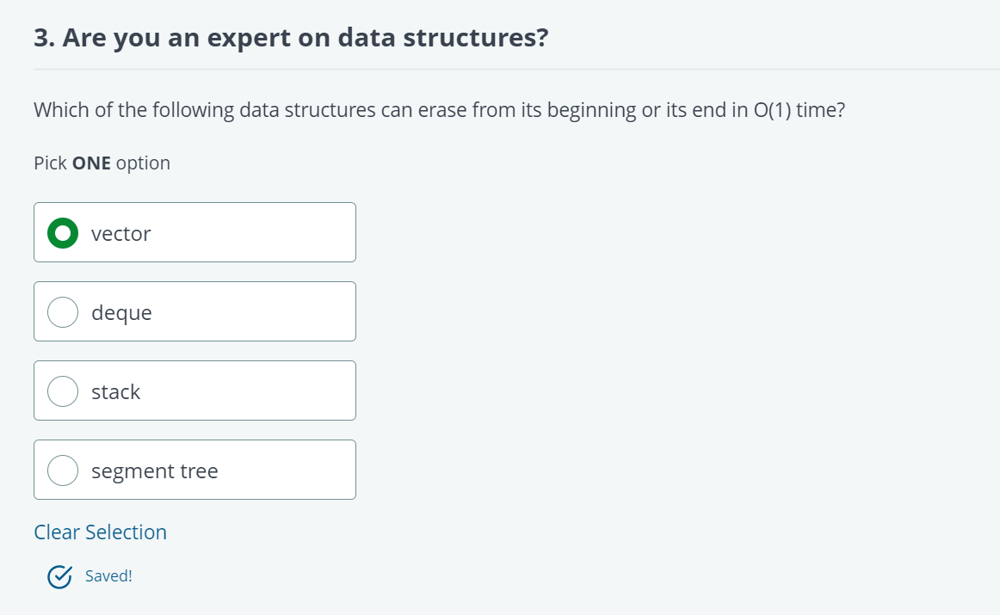
				- 
			- TODO 面试中补充学习内容
				- https://www.cnblogs.com/myseries/p/11778568.html
				- TODO BigDecimal要怎么处理excel
				- TODO 文件输入输出流的读写
				- DONE 自定义排序
				  :LOGBOOK:
				  CLOCK: [2023-11-02 Thu 11:41:33]--[2023-11-02 Thu 11:41:34] =>  00:00:01
				  :END:
				- TODO linux的日志管理
				- TODO 重写函数的异常类型可以进行拓展吗？
				- TODO 接口的修饰符问题
				- DOING 堆排序
				  :LOGBOOK:
				  CLOCK: [2023-11-13 Mon 09:35:44]
				  CLOCK: [2023-11-13 Mon 09:35:53]
				  :END:
				- TODO 复习LRU和大数相加算法
				- TODO 阅读使用到的几种设计模式的英文介绍
				- TODO 写一个BFS的题
				- TODO 复习堆栈在计算表达式中的应用
				- TODO 复习一下快排
				- DONE mock一下英文自我介绍
				  :LOGBOOK:
				  CLOCK: [2023-11-13 Mon 19:18:07]--[2023-11-13 Mon 19:18:08] =>  00:00:01
				  :END:
				- DONE mock一下项目的英文自我介绍
				  :LOGBOOK:
				  CLOCK: [2023-11-13 Mon 19:18:10]--[2023-11-13 Mon 19:18:10] =>  00:00:00
				  :END:
			- DONE 完成英文简历
			  collapsed:: true
			  :LOGBOOK:
			  CLOCK: [2023-11-07 Tue 15:42:48]--[2023-11-13 Mon 09:35:32] =>  137:52:44
			  :END:
				- DONE 小红书上查找英文简历模板，总结下核心要点
				  collapsed:: true
				  :LOGBOOK:
				  CLOCK: [2023-11-07 Tue 15:42:43]--[2023-11-07 Tue 15:42:44] =>  00:00:01
				  :END:
					- 
					-
		- [[对BSPC论文进行修改]]
		  collapsed:: true
			- DONE 找到论文当初使用的数据集是哪一个
			  :LOGBOOK:
			  CLOCK: [2023-11-10 Fri 17:49:10]--[2023-11-10 Fri 17:49:11] =>  00:00:01
			  :END:
			- DONE 对论文中相关模型的代码进行重新定位和清理
			  :LOGBOOK:
			  CLOCK: [2023-11-10 Fri 17:49:17]--[2023-11-10 Fri 17:49:20] =>  00:00:03
			  :END:
			- DONE 增加confusion matrix
			  :LOGBOOK:
			  CLOCK: [2023-11-13 Mon 23:10:53]--[2023-11-14 Tue 00:59:28] =>  01:48:35
			  :END:
			- DONE 增加分类指标：precision 和F1 score
			  :LOGBOOK:
			  CLOCK: [2023-11-13 Mon 23:10:52]--[2023-11-14 Tue 00:59:30] =>  01:48:38
			  :END:
			- DONE 梳理一下完整的实验流程
			  :LOGBOOK:
			  CLOCK: [2023-11-15 Wed 17:39:06]--[2023-11-15 Wed 17:39:08] =>  00:00:02
			  :END:
				- DONE 深度学习实验怎么进行加速呢？
				  :LOGBOOK:
				  CLOCK: [2023-11-13 Mon 23:10:26]--[2023-11-13 Mon 23:10:27] =>  00:00:01
				  :END:
			- DONE 调参到可以与论文结果相匹配，或者说差距不大
			  collapsed:: true
			  :LOGBOOK:
			  CLOCK: [2023-11-14 Tue 00:58:53]--[2023-11-14 Tue 00:58:54] =>  00:00:01
			  :END:
				- 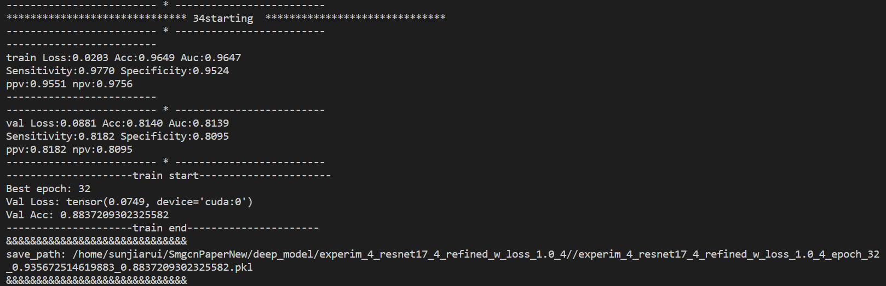
				- 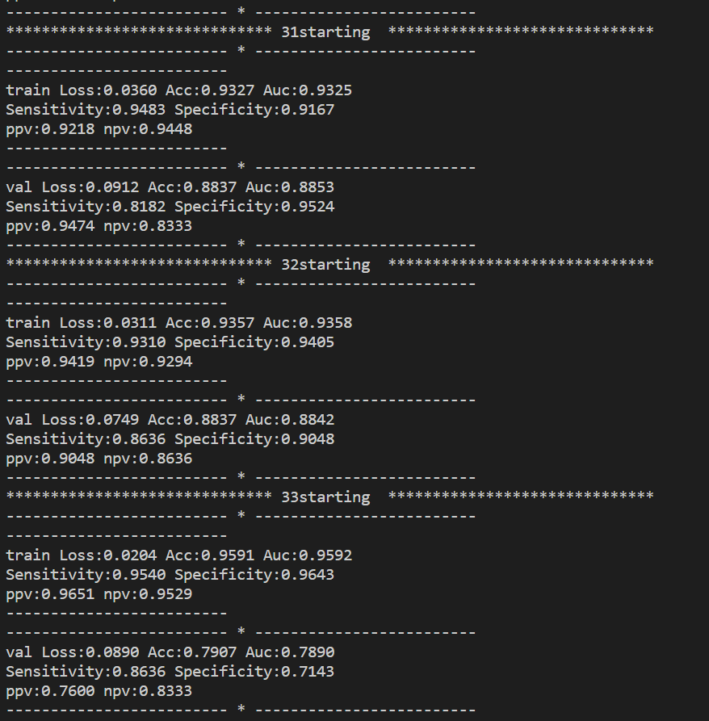
				- 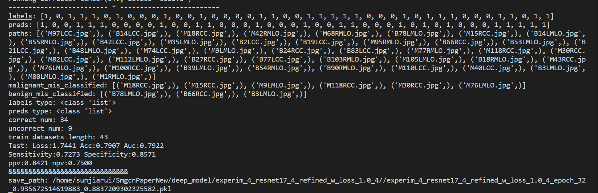
				- 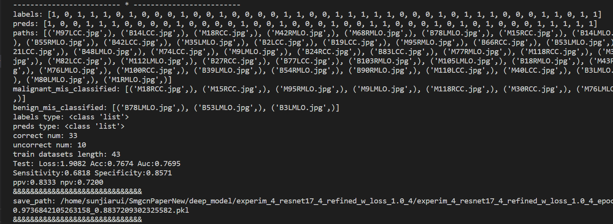
				- 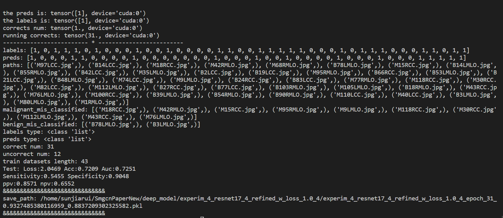
				- 
				- 
				-
			- DONE 完成最后一次paper model的SGD的调参：也就是第五次实验结果
			  collapsed:: true
			  :LOGBOOK:
			  CLOCK: [2023-11-14 Tue 20:43:31]--[2023-11-14 Tue 21:32:54] =>  00:49:23
			  :END:
				- 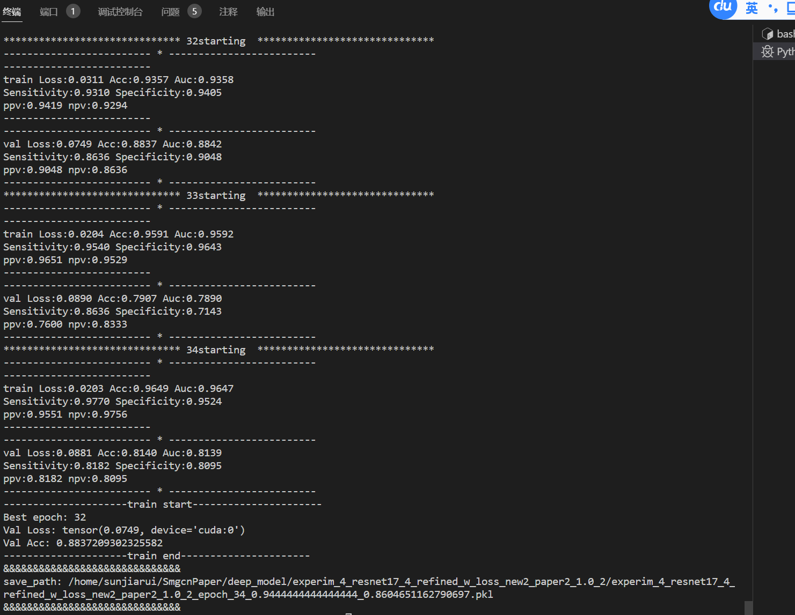
				- /home/sunjiarui/SmgcnPaperNew/deep_model/experim_4_resnet17_4_refined_w_loss_1.0_5/experim_4_resnet17_4_refined_w_loss_1.0_5_epoch_32_0.935672514619883_0.8837209302325582.pkl
				- 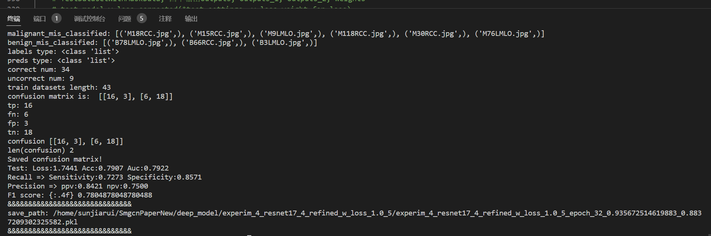
				-
			- DONE 提取增强后的数据的特征 =》看看需不需要重新进行提取 =》不需要
			  :LOGBOOK:
			  CLOCK: [2023-11-14 Tue 20:43:52]
			  CLOCK: [2023-11-14 Tue 20:45:28]--[2023-11-14 Tue 23:39:18] =>  02:53:50
			  :END:
			- DONE 看看增强后的数据里train目录下的topo_mask需不需要
			  collapsed:: true
			  :LOGBOOK:
			  CLOCK: [2023-11-14 Tue 20:46:00]
			  CLOCK: [2023-11-14 Tue 20:46:02]--[2023-11-14 Tue 22:20:20] =>  01:34:18
			  :END:
				- 不需要
				- 因为模型里面并不需要用到topo_mask这个数据，但是原先的数据库返回接口里面保留了这个返回值，需要修改其返回任意一个tensor就行了
			-
			- DONE 计算传统机器学习里面的三种模型的结果
			  collapsed:: true
			  :LOGBOOK:
			  CLOCK: [2023-11-14 Tue 23:28:25]
			  CLOCK: [2023-11-14 Tue 23:28:26]--[2023-11-15 Wed 22:10:56] =>  22:42:30
			  :END:
				- DONE 计算SVM
				  collapsed:: true
				  :LOGBOOK:
				  CLOCK: [2023-11-14 Tue 23:28:41]
				  CLOCK: [2023-11-14 Tue 23:28:45]--[2023-11-15 Wed 16:35:14] =>  17:06:29
				  :END:
					- DONE 计算class_weight为0.3: 0.7
					  collapsed:: true
					  :LOGBOOK:
					  CLOCK: [2023-11-15 Wed 16:22:44]
					  CLOCK: [2023-11-15 Wed 16:22:45]--[2023-11-15 Wed 16:34:53] =>  00:12:08
					  :END:
						- 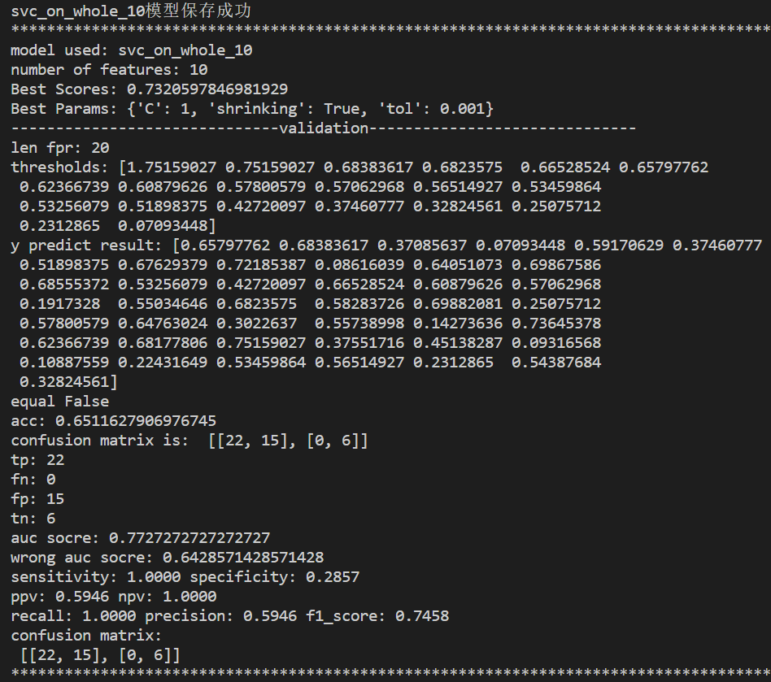
						- 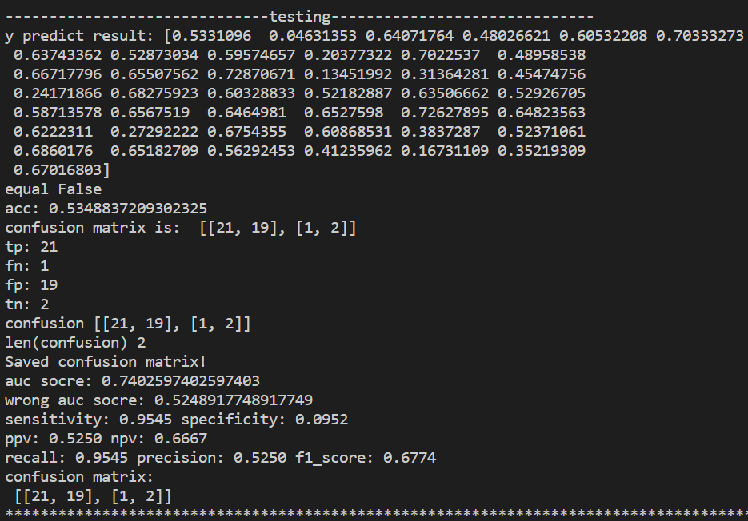
						-
					- DONE 计算class_weight 为 0.4: 0.6
					  collapsed:: true
					  :LOGBOOK:
					  CLOCK: [2023-11-15 Wed 16:24:13]
					  CLOCK: [2023-11-15 Wed 16:24:14]--[2023-11-15 Wed 16:34:55] =>  00:10:41
					  :END:
						- 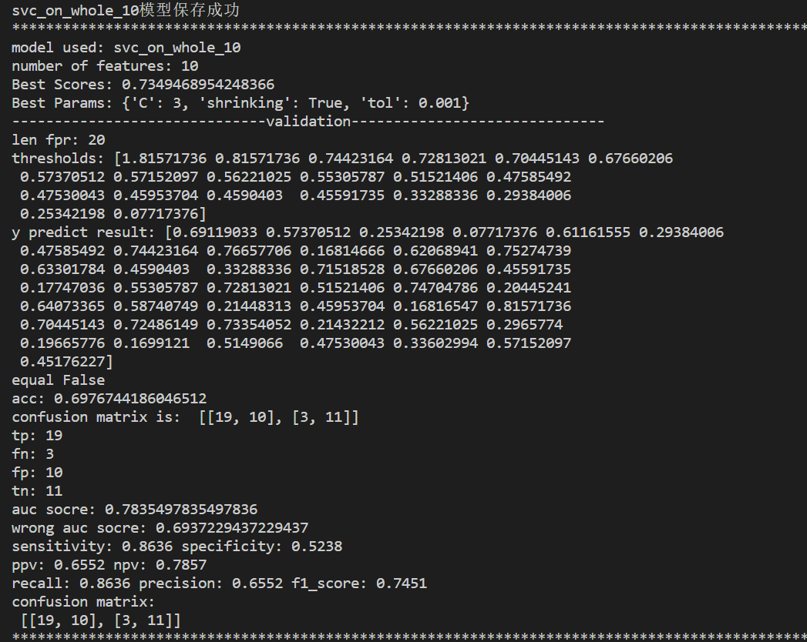
						- 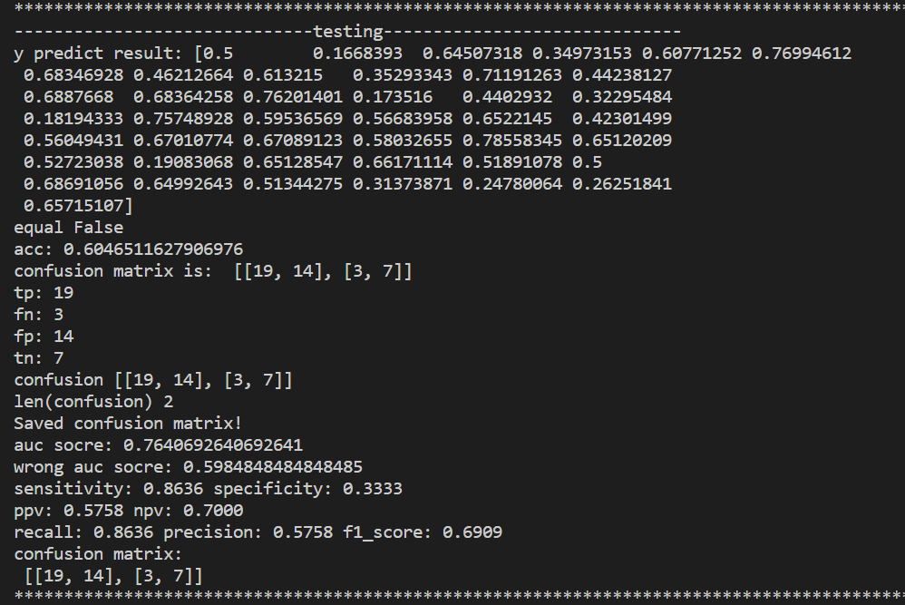
						-
					- 第二种更好
				- DONE 计算KNN
				  collapsed:: true
				  :LOGBOOK:
				  CLOCK: [2023-11-14 Tue 23:28:47]
				  CLOCK: [2023-11-14 Tue 23:28:49]--[2023-11-15 Wed 16:11:04] =>  16:42:15
				  :END:
					- 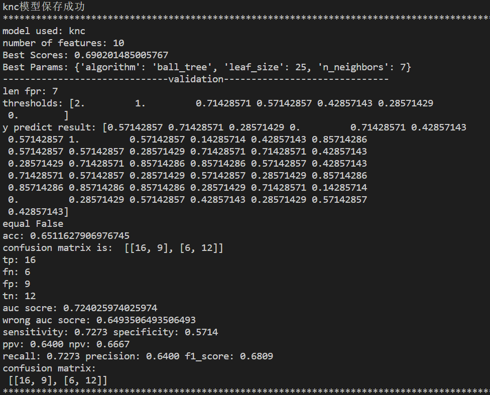
					- 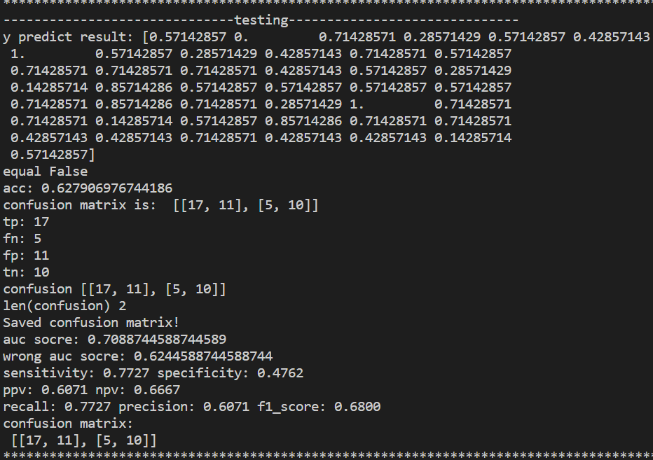
					-
				- DONE 把权重改为{0.4,0.6}后重新运行KNN后的结构
				  collapsed:: true
				  :LOGBOOK:
				  CLOCK: [2023-11-15 Wed 16:11:10]
				  CLOCK: [2023-11-15 Wed 16:11:12]--[2023-11-15 Wed 16:22:32] =>  00:11:20
				  :END:
					- 原本的权重设置是{0.3, 0.7}，这与其他深度学习模型都是{0.4，0.6}的设置不同
					- 后来发现KNN模型并不需要class_weight这个参数项
				- DONE 计算随机森林
				  collapsed:: true
				  :LOGBOOK:
				  CLOCK: [2023-11-14 Tue 23:28:52]
				  CLOCK: [2023-11-14 Tue 23:28:54]--[2023-11-15 Wed 18:57:44] =>  19:28:50
				  :END:
					- DONE {0.4, 0.6}的结果
					  collapsed:: true
					  :LOGBOOK:
					  CLOCK: [2023-11-15 Wed 17:46:20]
					  CLOCK: [2023-11-15 Wed 17:46:21]--[2023-11-15 Wed 17:46:52] =>  00:00:31
					  :END:
						- 
					- DONE {0.3，0.7}的结果
					  collapsed:: true
					  :LOGBOOK:
					  CLOCK: [2023-11-15 Wed 17:46:58]--[2023-11-15 Wed 17:49:34] =>  00:02:36
					  :END:
						- 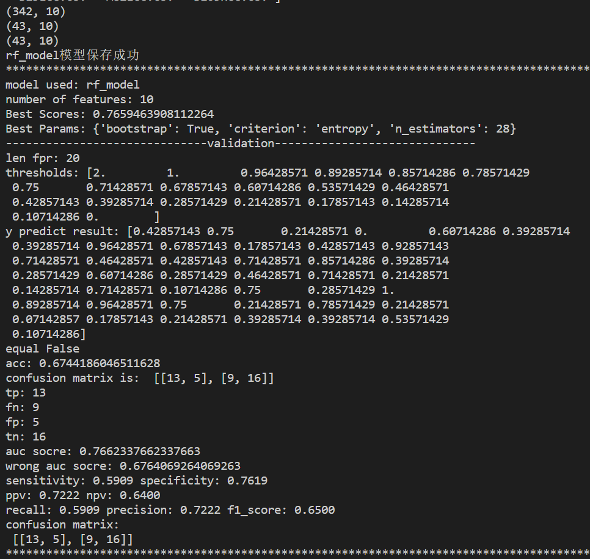
						- 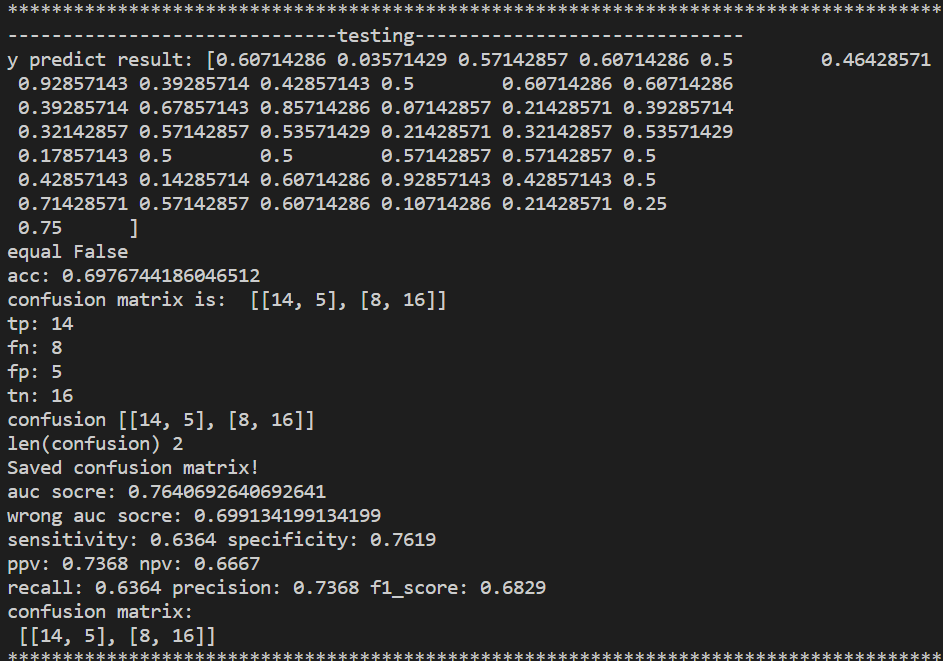
				- DONE 随机森林和论文模型对不上，找到对应的模型保存文件尝试了一下 =》成功
				  collapsed:: true
				  :LOGBOOK:
				  CLOCK: [2023-11-15 Wed 21:24:52]
				  CLOCK: [2023-11-15 Wed 21:24:53]--[2023-11-15 Wed 21:26:53] =>  00:02:00
				  :END:
					- 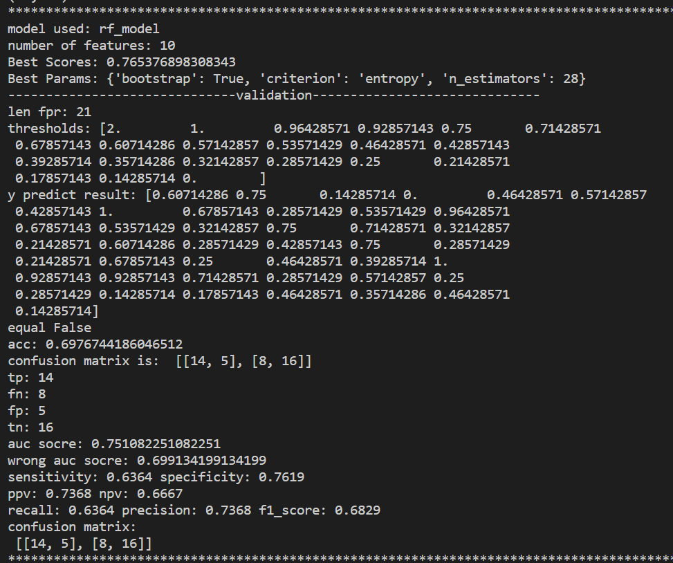
					- 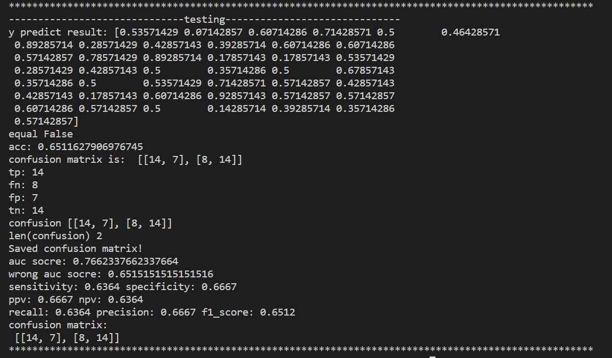
					-
				- DONE 把机器学习模型的confusion matrix保存的代码写一下
				  :LOGBOOK:
				  CLOCK: [2023-11-15 Wed 16:35:22]
				  CLOCK: [2023-11-15 Wed 16:37:25]--[2023-11-15 Wed 17:38:57] =>  01:01:32
				  :END:
			- DONE 重新跑论文模型的val数据集部分的结果
			  collapsed:: true
			  :LOGBOOK:
			  CLOCK: [2023-11-15 Wed 22:12:09]
			  CLOCK: [2023-11-15 Wed 22:12:10]--[2023-11-15 Wed 22:17:32] =>  00:05:22
			  :END:
				- 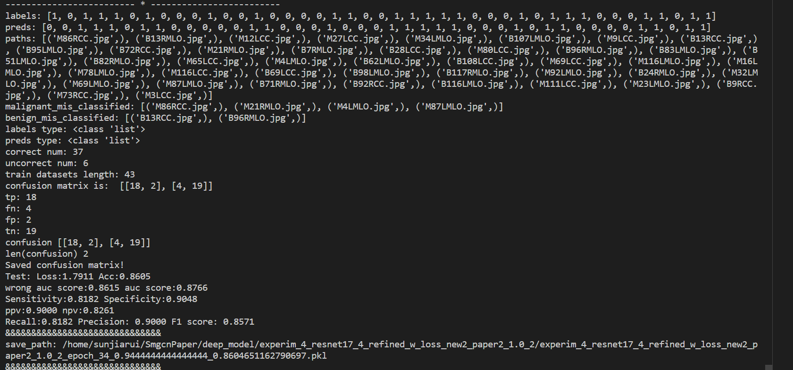
				-
			- DONE 重新跑论文模型的test数据集部分的结果
			  collapsed:: true
			  :LOGBOOK:
			  CLOCK: [2023-11-15 Wed 22:12:28]
			  CLOCK: [2023-11-15 Wed 22:12:29]--[2023-11-15 Wed 22:21:21] =>  00:08:52
			  :END:
				- 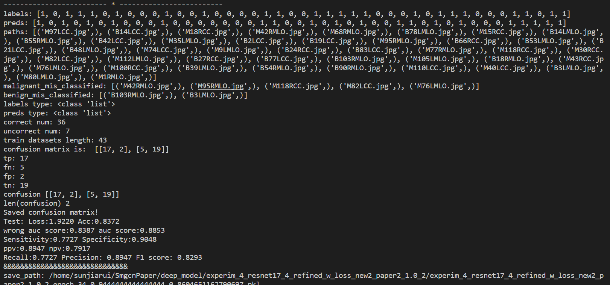
				-
			- DONE 开启第六次实验，将数据集切换为数据量二倍增强后的，结果如下
			  :LOGBOOK:
			  CLOCK: [2023-11-15 Wed 22:23:29]
			  CLOCK: [2023-11-15 Wed 22:23:30]--[2023-11-16 Thu 00:22:12] =>  01:58:42
			  :END:
				- DONE 模型训练得到的模型
				  collapsed:: true
				  :LOGBOOK:
				  CLOCK: [2023-11-15 Wed 22:23:45]
				  CLOCK: [2023-11-15 Wed 22:23:46]--[2023-11-16 Thu 00:11:02] =>  01:47:16
				  :END:
					- 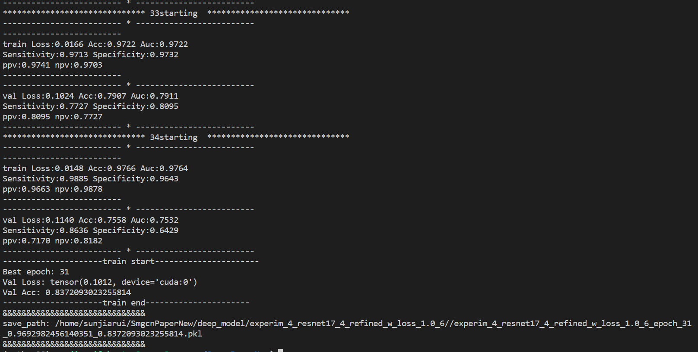
					- 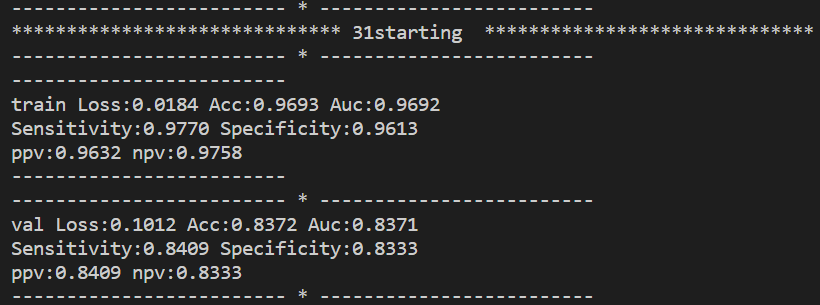
					-
				- DONE 模型在test数据集部分的结果
				  :LOGBOOK:
				  CLOCK: [2023-11-15 Wed 22:24:06]
				  CLOCK: [2023-11-15 Wed 22:24:08]--[2023-11-16 Thu 00:22:05] =>  01:57:57
				  :END:
					- 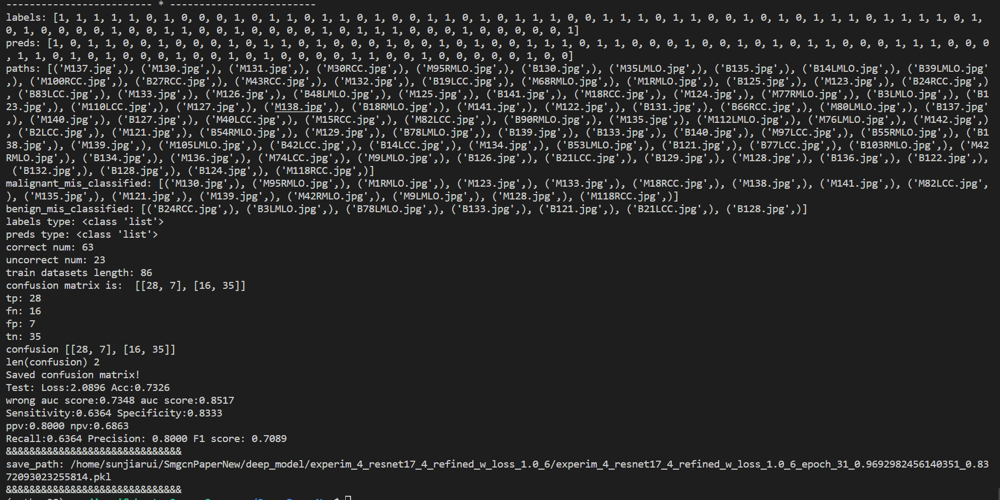
					-
				- DONE 模型在val数据集部分的结果
				  collapsed:: true
				  :LOGBOOK:
				  CLOCK: [2023-11-16 Thu 00:21:14]
				  CLOCK: [2023-11-16 Thu 00:21:15]--[2023-11-16 Thu 00:22:08] =>  00:00:53
				  :END:
					- 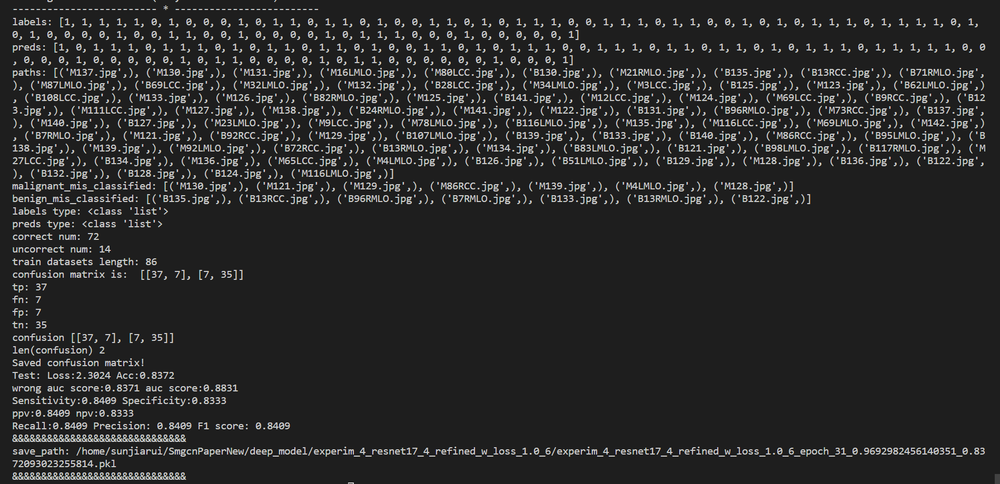{:height 311, :width 625}
					-
			- DOING 古装里面的美好法术哪些真的可以实现呢？
			  :LOGBOOK:
			  CLOCK: [2023-11-15 Wed 19:15:34]
			  CLOCK: [2023-11-15 Wed 21:15:48]
			  :END:
			- DOING 笛与竹、橘生淮南则为橘、
			  :LOGBOOK:
			  CLOCK: [2023-11-15 Wed 21:16:10]
			  CLOCK: [2023-11-15 Wed 21:16:11]
			  :END:
			- DONE 重新跑resnet18的模型，因为pkl文件和论文貌似对不上
			  collapsed:: true
			  :LOGBOOK:
			  CLOCK: [2023-11-16 Thu 15:15:25]
			  CLOCK: [2023-11-16 Thu 15:15:26]--[2023-11-16 Thu 15:53:20] =>  00:37:54
			  :END:
				- 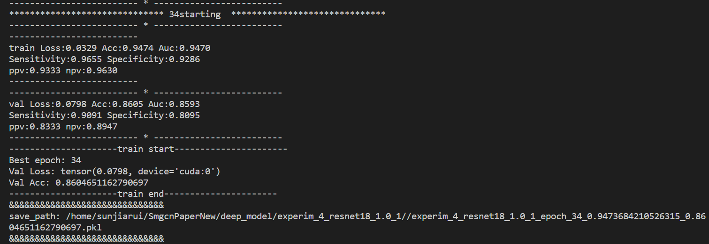
				- 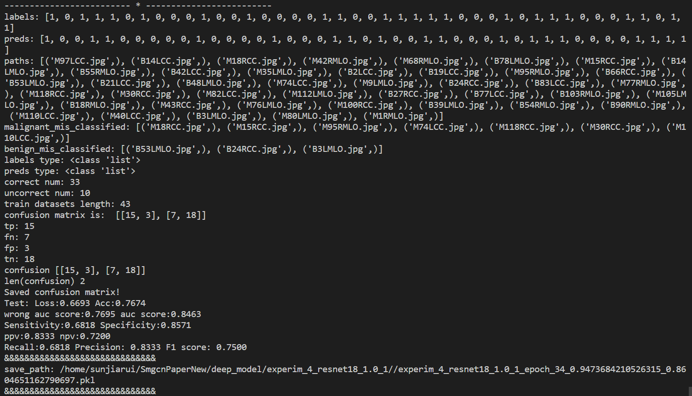
				- 但是结果不如原先对应的resnet18模型检查点文件，所以启用此训练结果
			- DONE 找到了resnet18对应的模型检查点文件
			  collapsed:: true
			  :LOGBOOK:
			  CLOCK: [2023-11-16 Thu 15:53:25]
			  CLOCK: [2023-11-16 Thu 15:53:27]--[2023-11-16 Thu 16:25:28] =>  00:32:01
			  :END:
				- DONE 测试数据集上的结果
				  collapsed:: true
				  :LOGBOOK:
				  CLOCK: [2023-11-16 Thu 15:57:40]
				  CLOCK: [2023-11-16 Thu 15:57:41]--[2023-11-16 Thu 16:12:31] =>  00:14:50
				  :END:
					- 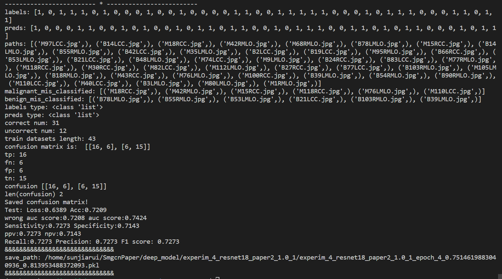
				- DONE val数据集上的结果
				  :LOGBOOK:
				  CLOCK: [2023-11-16 Thu 15:58:01]
				  CLOCK: [2023-11-16 Thu 15:58:04]--[2023-11-16 Thu 16:12:30] =>  00:14:26
				  :END:
					- 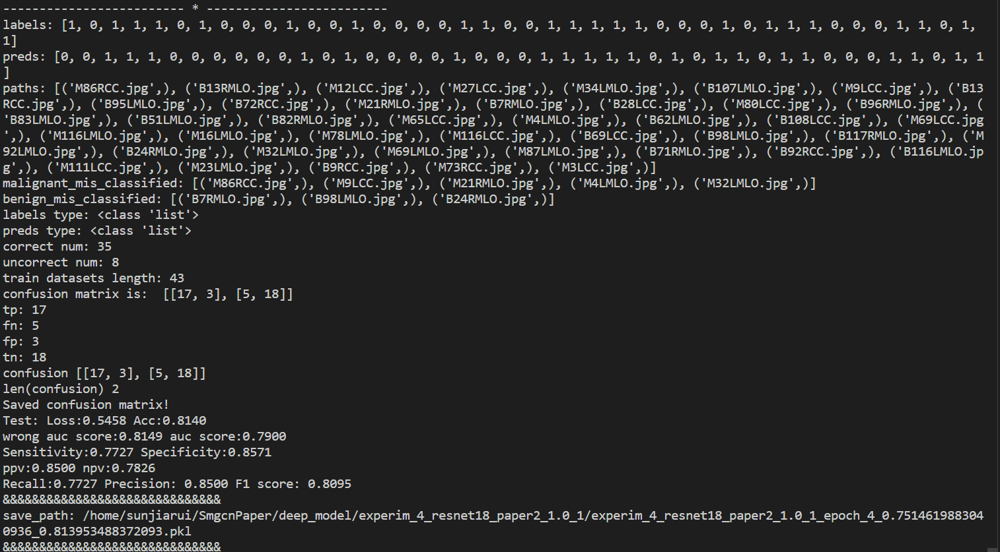
					-
			- DONE 找到了densenet121的模型检查点文件
			  collapsed:: true
			  :LOGBOOK:
			  CLOCK: [2023-11-16 Thu 16:25:35]
			  CLOCK: [2023-11-16 Thu 16:25:38]--[2023-11-16 Thu 16:57:03] =>  00:31:25
			  :END:
				- DONE 测试数据部分
				  :LOGBOOK:
				  CLOCK: [2023-11-16 Thu 16:27:20]
				  CLOCK: [2023-11-16 Thu 16:27:22]--[2023-11-16 Thu 16:28:43] =>  00:01:21
				  CLOCK: [2023-11-16 Thu 16:47:20]--[2023-11-16 Thu 16:47:22] =>  00:00:02
				  :END:
					- 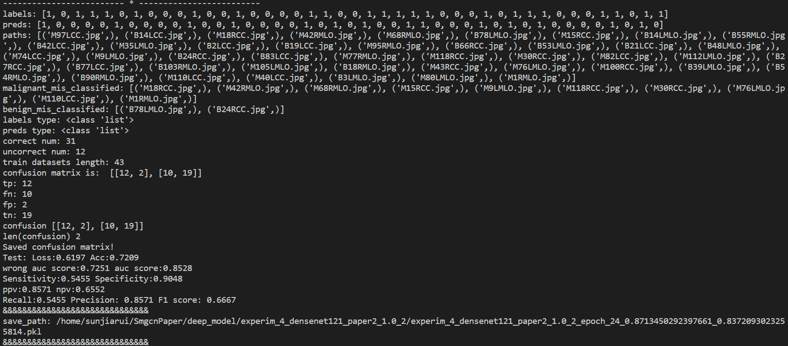
				- DONE val数据集部分
				  collapsed:: true
				  :LOGBOOK:
				  CLOCK: [2023-11-16 Thu 16:27:30]
				  CLOCK: [2023-11-16 Thu 16:27:32]--[2023-11-16 Thu 16:57:01] =>  00:29:29
				  :END:
					- 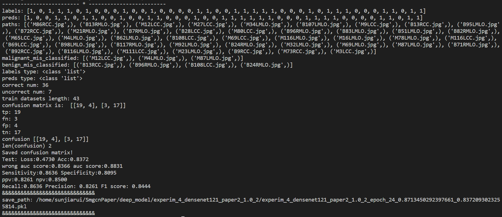
					-
			- DONE 找到了 proposed without multi-out的模型检查点文件
			  collapsed:: true
			  :LOGBOOK:
			  CLOCK: [2023-11-16 Thu 16:26:12]
			  CLOCK: [2023-11-16 Thu 16:26:13]
			  CLOCK: [2023-11-16 Thu 16:26:16]--[2023-11-16 Thu 17:53:38] =>  01:27:22
			  :END:
				- DONE 测试数据部分
				  collapsed:: true
				  :LOGBOOK:
				  CLOCK: [2023-11-16 Thu 16:27:20]
				  CLOCK: [2023-11-16 Thu 16:27:22]--[2023-11-16 Thu 16:28:43] =>  00:01:21
				  CLOCK: [2023-11-16 Thu 17:53:30]--[2023-11-16 Thu 17:53:31] =>  00:00:01
				  :END:
					- 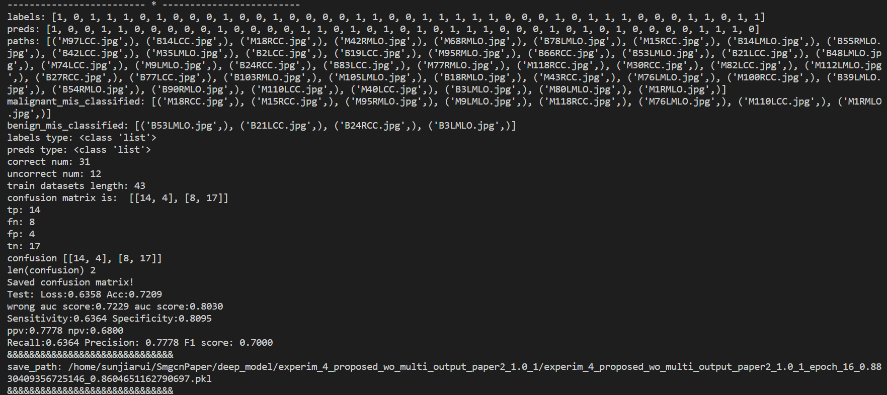
				- DONE val数据集部分
				  collapsed:: true
				  :LOGBOOK:
				  CLOCK: [2023-11-16 Thu 16:27:30]
				  CLOCK: [2023-11-16 Thu 16:27:32]--[2023-11-16 Thu 17:53:36] =>  01:26:04
				  :END:
					- 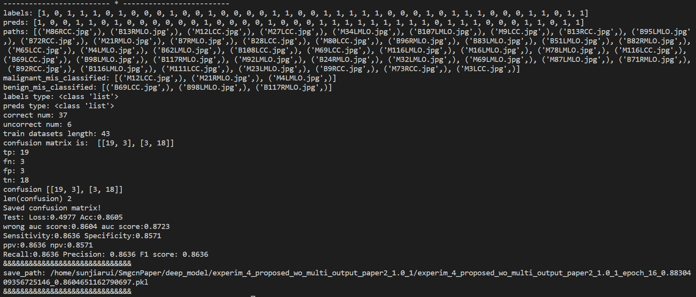
					-
			- DONE 找到了proposed w concat fusion的模型检查点文件
			  collapsed:: true
			  :LOGBOOK:
			  CLOCK: [2023-11-16 Thu 17:53:56]
			  CLOCK: [2023-11-16 Thu 17:59:01]--[2023-11-16 Thu 18:05:52] =>  00:06:51
			  :END:
				- DONE 找到了测试数据集上的部分
				  :LOGBOOK:
				  CLOCK: [2023-11-16 Thu 17:59:25]
				  CLOCK: [2023-11-16 Thu 17:59:27]--[2023-11-16 Thu 18:05:50] =>  00:06:23
				  :END:
					- 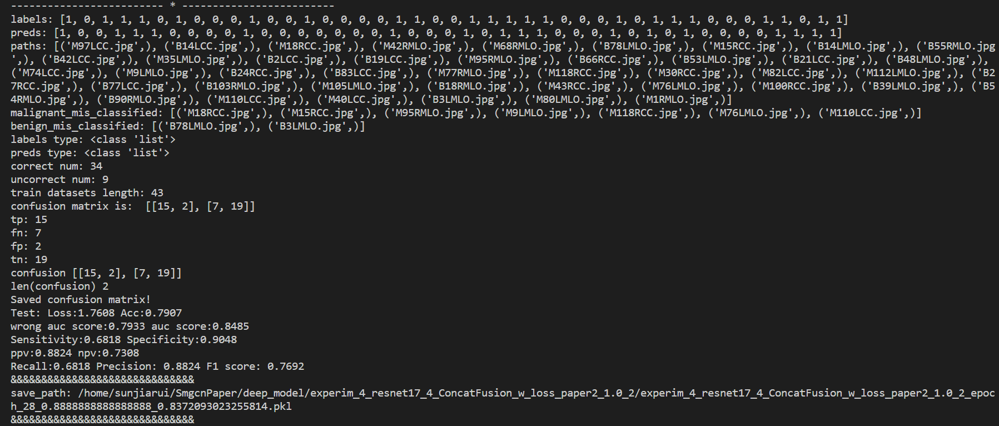
				- DONE 找打了验证数据集上的部分
				  collapsed:: true
				  :LOGBOOK:
				  CLOCK: [2023-11-16 Thu 17:59:35]
				  CLOCK: [2023-11-16 Thu 17:59:37]--[2023-11-16 Thu 18:04:35] =>  00:04:58
				  :END:
					- 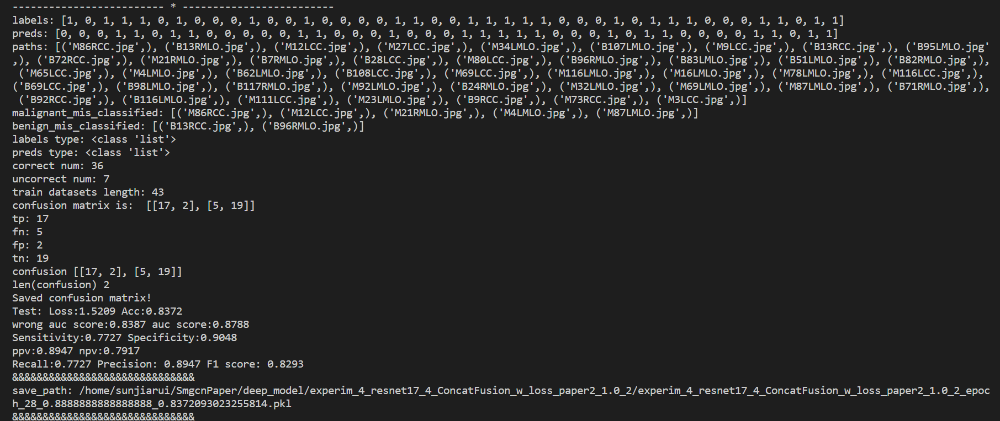
			- DONE 找到了FDFFE的模型检查文件
			  collapsed:: true
			  :LOGBOOK:
			  CLOCK: [2023-11-16 Thu 18:21:12]
			  CLOCK: [2023-11-16 Thu 18:21:14]--[2023-11-16 Thu 18:32:48] =>  00:11:34
			  :END:
				- DONE  测试数据集
				  :LOGBOOK:
				  CLOCK: [2023-11-16 Thu 18:21:24]
				  CLOCK: [2023-11-16 Thu 18:21:25]--[2023-11-16 Thu 18:32:47] =>  00:11:22
				  :END:
					- 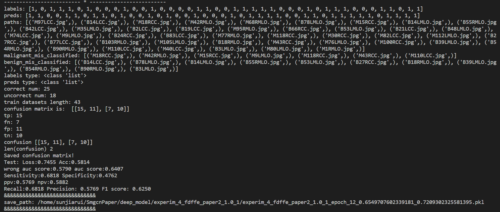
				- DONE val数据集
				  collapsed:: true
				  :LOGBOOK:
				  CLOCK: [2023-11-16 Thu 18:21:30]
				  CLOCK: [2023-11-16 Thu 18:21:32]--[2023-11-16 Thu 18:32:46] =>  00:11:14
				  :END:
					- 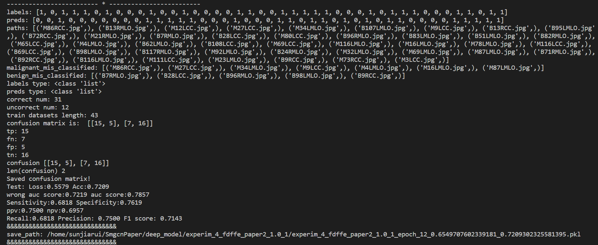
					-
			- DONE vgg11
			  collapsed:: true
			  :LOGBOOK:
			  CLOCK: [2023-11-16 Thu 18:32:55]
			  CLOCK: [2023-11-16 Thu 18:32:57]--[2023-11-16 Thu 18:39:15] =>  00:06:18
			  :END:
				- DONE  test
				  :LOGBOOK:
				  CLOCK: [2023-11-16 Thu 18:33:00]
				  CLOCK: [2023-11-16 Thu 18:33:03]--[2023-11-16 Thu 18:36:02] =>  00:02:59
				  :END:
					- 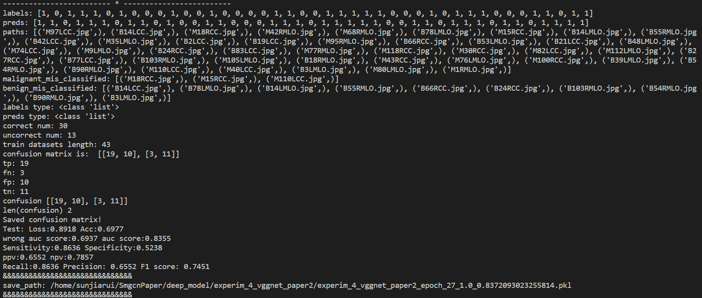
				- DONE val
				  collapsed:: true
				  :LOGBOOK:
				  CLOCK: [2023-11-16 Thu 18:33:06]
				  CLOCK: [2023-11-16 Thu 18:33:07]--[2023-11-16 Thu 18:38:35] =>  00:05:28
				  :END:
					- 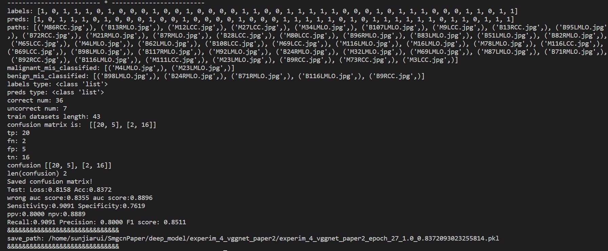
					-
			- DONE vgg16
			  collapsed:: true
			  :LOGBOOK:
			  CLOCK: [2023-11-16 Thu 18:39:28]--[2023-11-16 Thu 19:14:47] =>  00:35:19
			  :END:
				- DONE test
				  collapsed:: true
				  :LOGBOOK:
				  CLOCK: [2023-11-16 Thu 18:40:29]--[2023-11-16 Thu 19:11:47] =>  00:31:18
				  :END:
					- 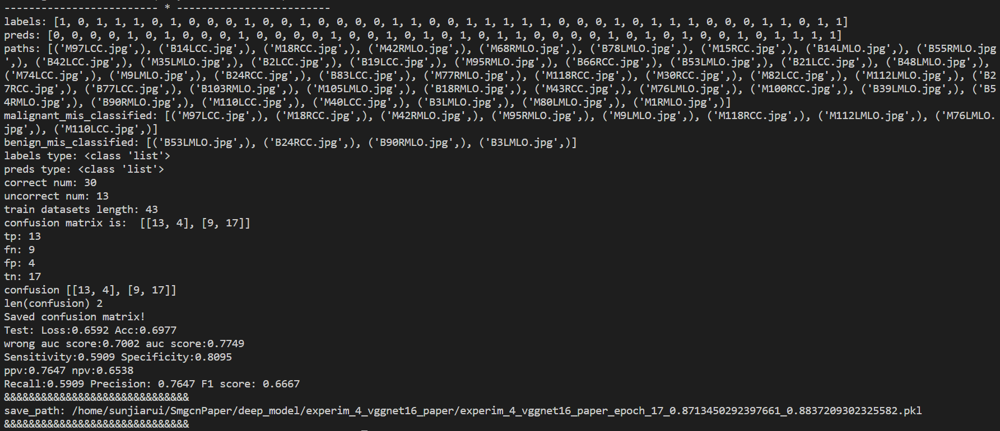
				- DONE val
				  collapsed:: true
				  :LOGBOOK:
				  CLOCK: [2023-11-16 Thu 18:40:32]--[2023-11-16 Thu 19:14:46] =>  00:34:14
				  :END:
					- 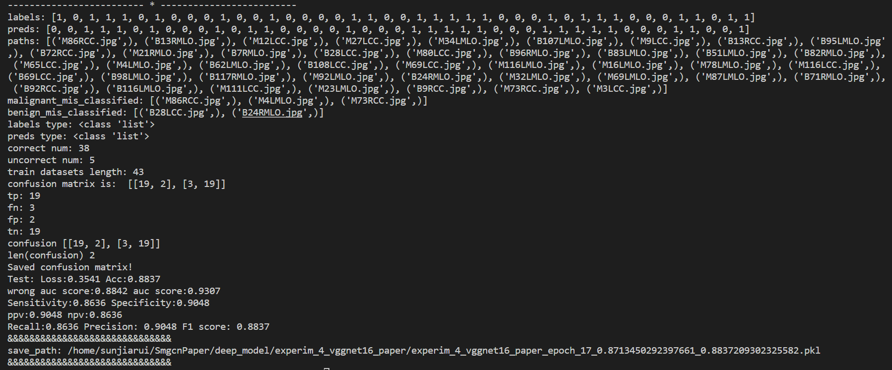
			- DONE efficient-net
			  collapsed:: true
			  :LOGBOOK:
			  CLOCK: [2023-11-16 Thu 18:39:32]
			  CLOCK: [2023-11-16 Thu 18:39:39]--[2023-11-16 Thu 19:22:37] =>  00:42:58
			  :END:
				- DONE test
				  :LOGBOOK:
				  CLOCK: [2023-11-16 Thu 18:40:39]--[2023-11-16 Thu 19:19:54] =>  00:39:15
				  :END:
					- 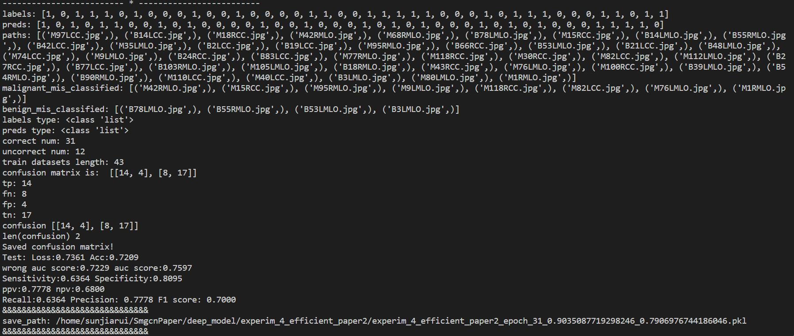
				- DONE val
				  collapsed:: true
				  :LOGBOOK:
				  CLOCK: [2023-11-16 Thu 18:40:45]--[2023-11-16 Thu 19:22:33] =>  00:41:48
				  :END:
					- 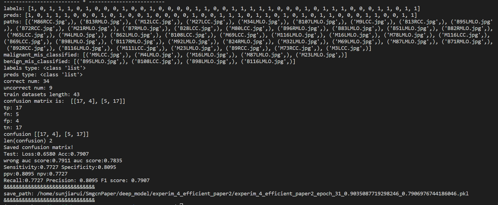
			- DONE alexnet
			  collapsed:: true
			  :LOGBOOK:
			  CLOCK: [2023-11-16 Thu 18:39:47]--[2023-11-16 Thu 19:43:33] =>  01:03:46
			  :END:
				- DONE test
				  collapsed:: true
				  :LOGBOOK:
				  CLOCK: [2023-11-16 Thu 18:40:39]--[2023-11-16 Thu 19:43:31] =>  01:02:52
				  :END:
					- 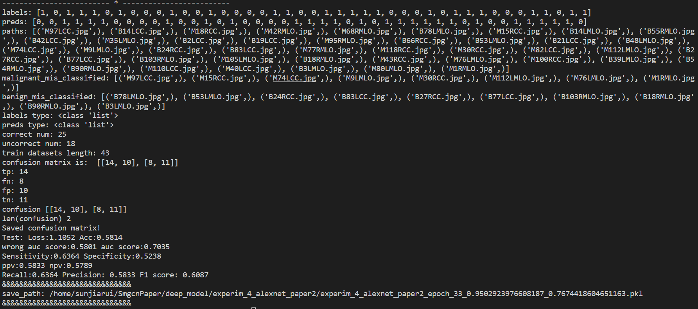
				- DONE val
				  collapsed:: true
				  :LOGBOOK:
				  CLOCK: [2023-11-16 Thu 18:40:45]--[2023-11-16 Thu 19:30:34] =>  00:49:49
				  :END:
					- 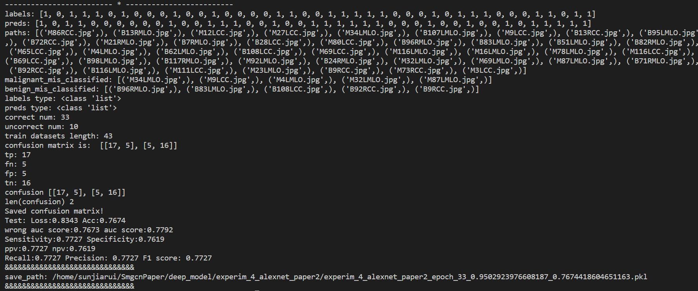
			- DONE resnet18 + weighted_pooling
			  collapsed:: true
			  :LOGBOOK:
			  CLOCK: [2023-11-16 Thu 18:39:49]
			  CLOCK: [2023-11-16 Thu 18:39:57]--[2023-11-16 Thu 20:02:24] =>  01:22:27
			  :END:
				- DONE test
				  collapsed:: true
				  :LOGBOOK:
				  CLOCK: [2023-11-16 Thu 18:40:39]--[2023-11-16 Thu 19:57:31] =>  01:16:52
				  :END:
					- 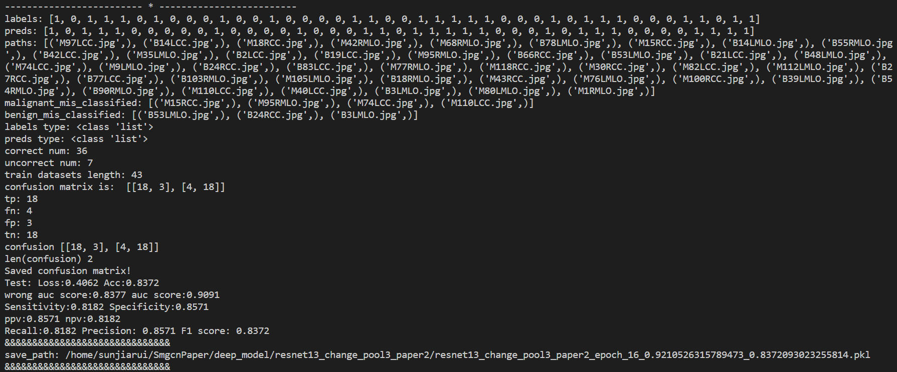
				- DONE val
				  collapsed:: true
				  :LOGBOOK:
				  CLOCK: [2023-11-16 Thu 18:40:45]--[2023-11-16 Thu 20:02:23] =>  01:21:38
				  :END:
					- 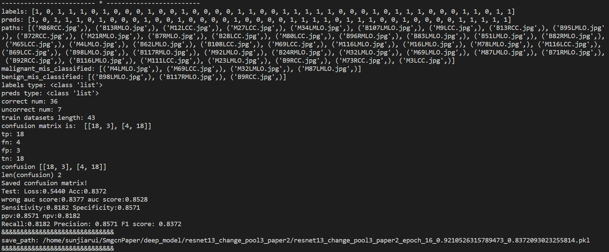
			- DONE  densenet121 + weighed_pooling
			  collapsed:: true
			  :LOGBOOK:
			  CLOCK: [2023-11-16 Thu 18:40:10]--[2023-11-16 Thu 20:09:42] =>  01:29:32
			  :END:
				- DONE test
				  collapsed:: true
				  :LOGBOOK:
				  CLOCK: [2023-11-16 Thu 18:40:39]--[2023-11-16 Thu 20:09:35] =>  01:28:56
				  :END:
					- 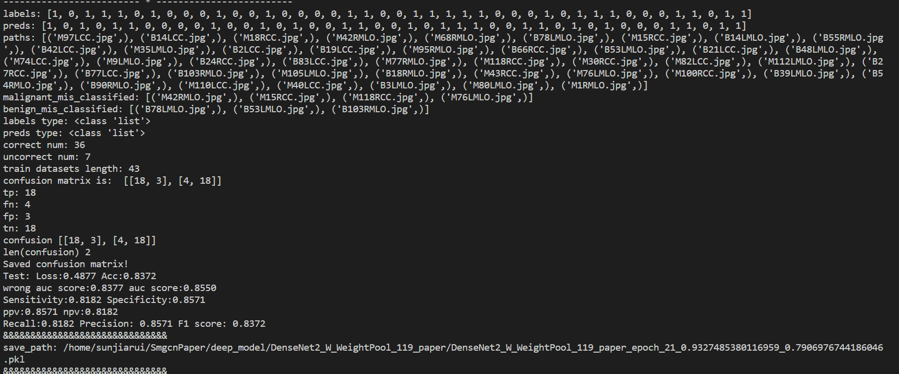
				- DONE val
				  collapsed:: true
				  :LOGBOOK:
				  CLOCK: [2023-11-16 Thu 18:40:45]--[2023-11-16 Thu 20:09:40] =>  01:28:55
				  :END:
					- 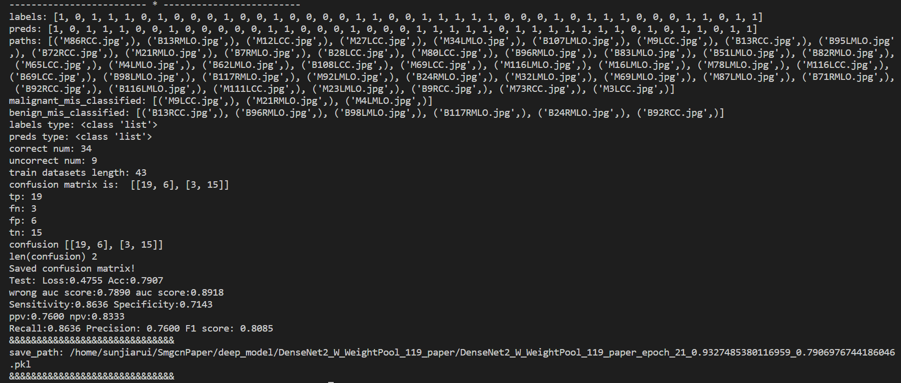
			- DONE 确认CM大小
			  collapsed:: true
			  :LOGBOOK:
			  CLOCK: [2023-11-16 Thu 22:23:49]
			  CLOCK: [2023-11-16 Thu 22:23:55]
			  CLOCK: [2023-11-16 Thu 22:24:07]
			  CLOCK: [2023-11-16 Thu 23:20:19]--[2023-11-16 Thu 23:20:22] =>  00:00:03
			  :END:
				- 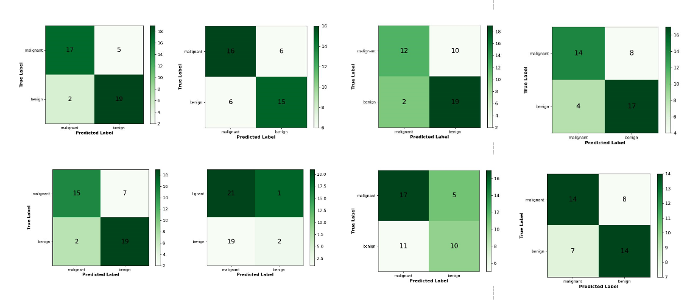
				- 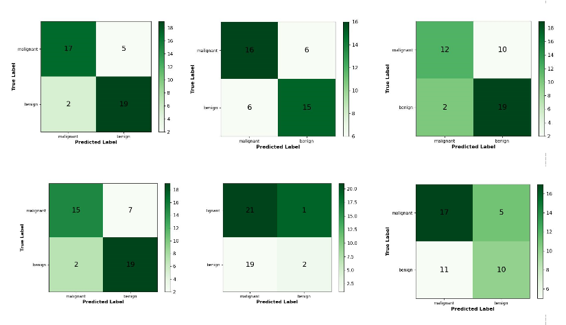{:height 482, :width 825}
				-
			- DONE 确定CM代码存在的问题
			  collapsed:: true
			  :LOGBOOK:
			  CLOCK: [2023-11-17 Fri 12:15:47]
			  CLOCK: [2023-11-17 Fri 12:15:51]--[2023-11-17 Fri 12:17:56] =>  00:02:05
			  :END:
				- 位置对应错了，上面截图中的混淆矩阵的（0,1）和（1,0）要进行值的互换
				- 数字的颜色要依据数值大小来进行显示：>10显示白色，否则显示黑色
		- [[继续阅读书籍]]
		  collapsed:: true
			- TODO 关于理性方面的书籍
				- TODO 《The art of love》
			- TODO 知乎提问:
			  collapsed:: true
				- INTP为什么没有敬畏感？或者说如何培养自己的敬畏感？
				- 如何培养对于小的事实片段和小的逻辑推断的记忆力？
				- 日本的敬畏感、西方人的敬畏感是不是都是通过严谨来体现的？中国人在什么领域会体现出这种敬畏感呢？
				- 如何看待工业互联网的发展？
				- 如何判断一个说高尚之言的人说的是真还是假？
				- 中国哪个地方的高人多? 国内的高人一般指代的是什么？会什么会有这么奇怪的叫法？
				- 厌烦重复的事情，有哪些心理原因？为什么会对重复的事情感到极度无聊？
				- 阻止一个人竭尽全力的原因有哪些？人真的能感觉到自己是竭尽全力的吗？
				- 对深情的人总是动心？
				- 为什么我最讨厌言语戏谑的人？是因为我过于严肃或者正式了吗？
				- 经融更接近理科还是工科？
				- 实证思维的书籍推荐？
				- 应用思维或者应用能力的书籍推荐？
				- 如何把一篇写得详实的文章 =》转化成一个口头解说或者说口头表达呢？=》要怎么做呢？
				- 怎么才算把握了规律？
				- 怎么写一部non-fiction的作品？=》感觉非虚构类作品更是我的菜
				- 程序员的术和道是什么？=》我的术和道又是什么呢？
				- 国内会有超越微信的设计平台吗？你觉得微信最大的设计缺陷在什么地方呢？
				- 小红书或者抖音的零散化既是优势，也是劣势：优势是通过分片方式降低了单位面积内的信息量，也使得不同的分片有信息隔离感，也使得能够关联不同特点的信息；而劣势是界面变得混乱，不如微信读书的阅读页面那样让人舒展，容易让人产生心浮气躁的焦虑感、不耐心感和数量激增感。要怎么样才能结构化结合这两个特点呢？
				- 谁能降低技术的繁琐度，谁就能创造计算机的未来吗？
				- DOING 举一反三的应用思维的本质是什么呢？是领域知识和实际世界的二元映射图吗？为什么有些人应用能力强，而理论能力弱？为什么有些人应用能力弱，而理论能力强？有没有两者都很强的？
				  :LOGBOOK:
				  CLOCK: [2023-11-18 Sat 08:23:17]
				  CLOCK: [2023-11-18 Sat 08:23:20]
				  :END:
				- DOING 怎么写一本像《万万没想到：用理工科思维理解世界》这样的非虚构类小说？怎么保证里面的论证逻辑靠谱呢？
				  :LOGBOOK:
				  CLOCK: [2023-11-18 Sat 08:37:54]
				  CLOCK: [2023-11-18 Sat 08:37:55]
				  :END:
				- DOING 为什么大家都说不要相信夜间思考？夜间思考的价值一定是不好的吗？夜间思考和白天思考的生理性基础有什么不一样的？为什么我觉得夜间思考和清晨思考时，我总是能有一些有趣的灵感呢？
				  :LOGBOOK:
				  CLOCK: [2023-11-18 Sat 08:38:41]
				  CLOCK: [2023-11-18 Sat 08:38:43]
				  :END:
			- TODO 关注一些有价值的健康医学科普什么的
			- TODO 卓别林喜剧
			- TODO 周星驰的喜剧原片
			- TODO 编辑部的故事
			- TODO 自己写完知乎上大佬文字描述的文章
				- 模仿这个知乎账号的一部分？
			- TODO 写一篇互联网的素材信息源吧？
				- 就是查找各大知名up主和知乎账号 =》判断他们的信息数据源是什么
			- TODO 总结归纳所有的逻辑推理规则
			- TODO 怎么才能叫按照规律做事呢？
			- TODO 生死劫、恋爱劫
			- TODO 投名状、其他各种状
			- TODO 我的目标就是没有目标，率性而为，当时当地什么最适合我、什么对我最友好、我最想做什么，我就选择什么，比如如果我想去北美或者欧洲读cs phd，那么我就一定需要出来找计算机的工业界或者教职吗 =》并不一定，我读了之后想找什么类型的工作都可以，很多地方给了phd更多的职业选择 =》因为phd最重要的是思维的锻炼，而不是那些功利性的结果 =》要是抱着功利性的结果，去读phd，迟早会把自己限定在欲望的牢笼里面，也会被这个世界上各种各样的随机性和不确定性所困住 =》就像丁元英关于佛性和成佛的论述一样
			- DOING 写一个时事类型的题目的回答：比如openAI这个人的，可以先看别人怎么写的，然后自己找新角度 =》反复修改 =》先让自己在某种类型的时事分析上得到一定程度的锻炼吧
			  collapsed:: true
			  :LOGBOOK:
			  CLOCK: [2023-11-18 Sat 13:56:43]
			  CLOCK: [2023-11-18 Sat 13:56:44]
			  :END:
		- [[完成超声AI毕设]]
			- TODO 日常简单查阅如何撰写毕业论文设计
			  collapsed:: true
				- TODO 如何在撰写时就避免重复
				- TODO 如何增加工程量：比如实验结果多样化
				- TODO 思考论文中可能会被judge的点
			- DONE  确认basic settings
			  collapsed:: true
			  :LOGBOOK:
			  CLOCK: [2024-01-17 Wed 19:55:16]--[2024-01-17 Wed 20:15:18] =>  00:20:02
			  :END:
				- DONE 确定最终实验所用到的指标
				  :LOGBOOK:
				  CLOCK: [2024-01-01 Mon 09:38:56]--[2024-01-01 Mon 09:38:57] =>  00:00:01
				  :END:
				- DONE 确认模型的输出是否已经用sigmoid归一化到[0，1]了，还是说只是两个原始概率值？
				  :LOGBOOK:
				  CLOCK: [2024-01-17 Wed 19:55:37]--[2024-01-17 Wed 20:15:11] =>  00:19:34
				  :END:
					- 这会影响到损失函数如何计算 + 指标的计算
					- 查看了下之前的代码，都是没有torch.sigmoid, 因为sigmoid之后就不方便绘制heatmap了；也就说尽量把一切的后处理都放在模型后，这样将来能够利用更多的原始数据
			- DONE 思考可视化对比不同模型的分割结果
			  collapsed:: true
			  :LOGBOOK:
			  CLOCK: [2024-01-17 Wed 19:42:09]--[2024-01-17 Wed 19:42:12] =>  00:00:03
			  :END:
				- 保留在preds子文件夹了
				- 所有的绘图的代码其实只需要在测试部分写就可以了
				- 一般的loss这样与训练相关的图其实没有特别大的意义，除非这个模型本身很难训练
				  collapsed:: true
					- 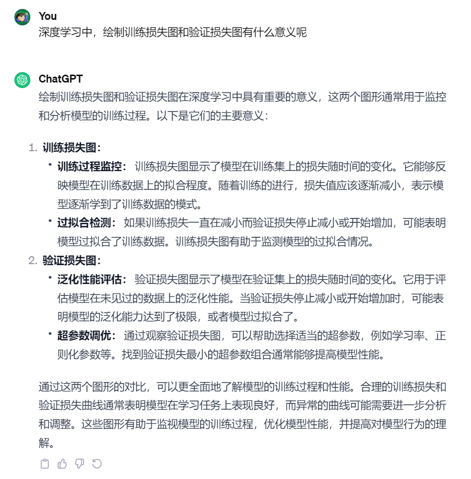
					-
			- DONE 总结一下师兄毕设中实验设计的思路和技巧
			  :LOGBOOK:
			  CLOCK: [2024-01-17 Wed 18:44:41]--[2024-01-17 Wed 18:44:42] =>  00:00:01
			  :END:
			- TODO 完成基本的baseline实验
				- DONE 分析数据方面的问题
				  collapsed:: true
				  :LOGBOOK:
				  CLOCK: [2024-01-11 Thu 20:59:57]--[2024-01-11 Thu 20:59:58] =>  00:00:01
				  :END:
					- 一个是没有把normal数据放进去
					- 第二个是数据划分比例的问题，应该将8:1:1改成6:2:2
					- 第三个是没有进行数据的预处理
				- DOING 完成关于数据问题setting的组合实验
				  :LOGBOOK:
				  CLOCK: [2024-01-11 Thu 21:03:31]
				  :END:
					- DONE no normal + no processing + 8:1:1
					  collapsed:: true
					  :LOGBOOK:
					  CLOCK: [2024-01-11 Thu 21:22:43]--[2024-01-11 Thu 21:22:44] =>  00:00:01
					  :END:
						- train + val
						  collapsed:: true
							- 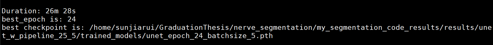
							- 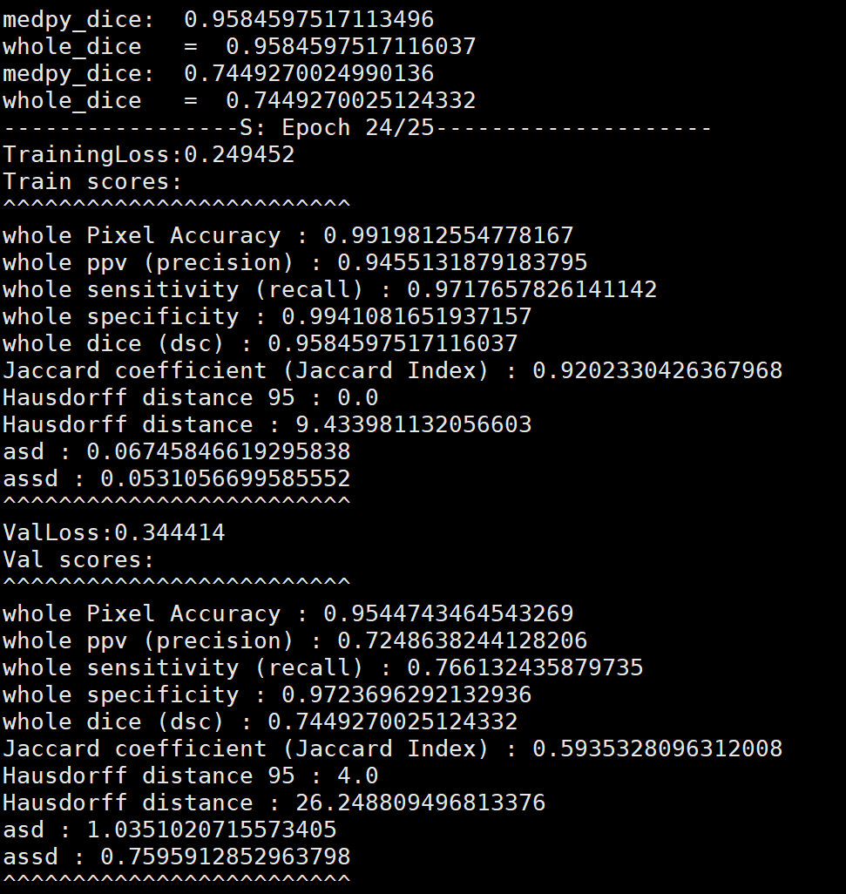
							-
						- test
						  collapsed:: true
							- 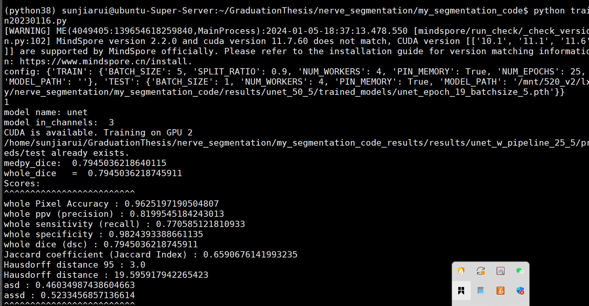
							-
						-
					- DONE 看下MICCAI上使用BUSI论文分割的结果大概是哪个范围水平的，如果和加入了normal的结果差距太大，那还是不要加上NORMAL了
					  collapsed:: true
					  :LOGBOOK:
					  CLOCK: [2024-01-17 Wed 19:28:01]--[2024-01-17 Wed 19:30:11] =>  00:02:10
					  :END:
						- 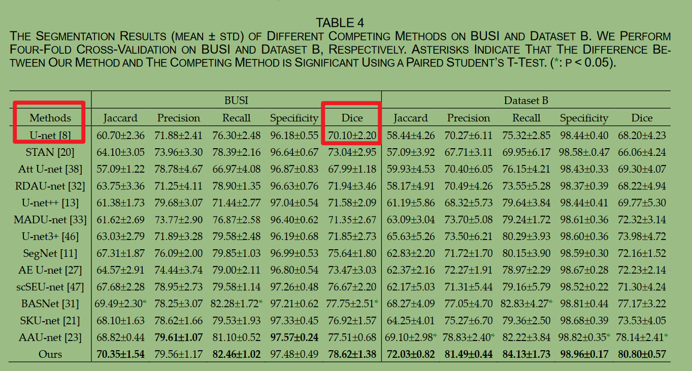
						- 迭代25次的结果在test上是59.83%，远远低于这里的70.10
						- 但是迭代50次在test上的结果是 70.71%
					- DONE 使用第一批数据来对比加不加normal的情况
					  collapsed:: true
					  :LOGBOOK:
					  CLOCK: [2024-01-21 Sun 20:31:45]--[2024-01-21 Sun 20:32:34] =>  00:00:49
					  :END:
						- DONE normal + no processing  + 6:2:2
						  :LOGBOOK:
						  CLOCK: [2024-01-11 Thu 21:23:05]
						  CLOCK: [2024-01-11 Thu 21:23:45]
						  CLOCK: [2024-01-11 Thu 21:25:55]--[2024-01-17 Wed 19:27:18] =>  142:01:23
						  :END:
							- 迭代25次的结果
							  collapsed:: true
								- train + val
									- 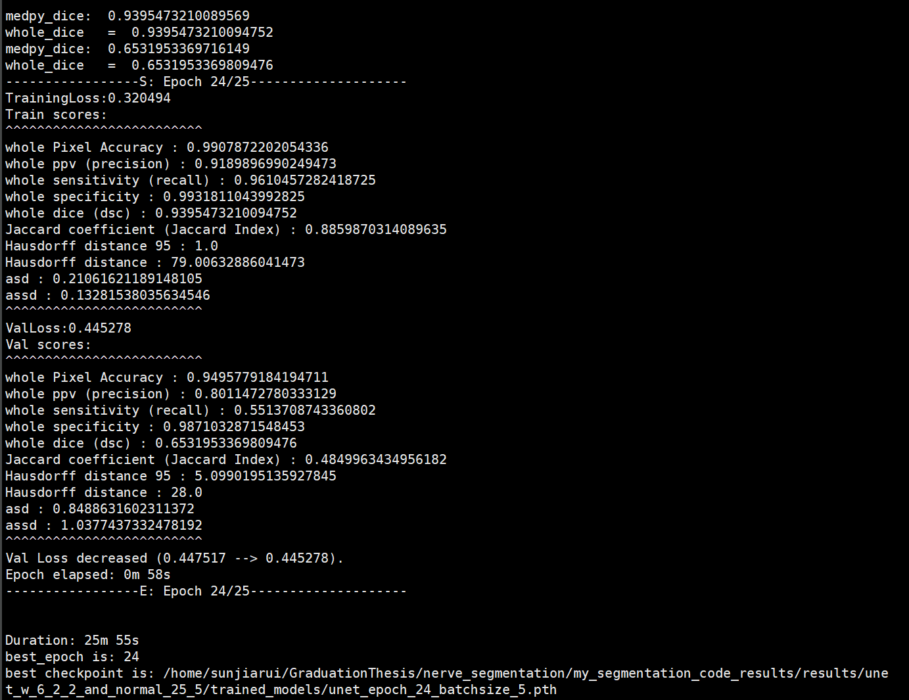
								- test
									- 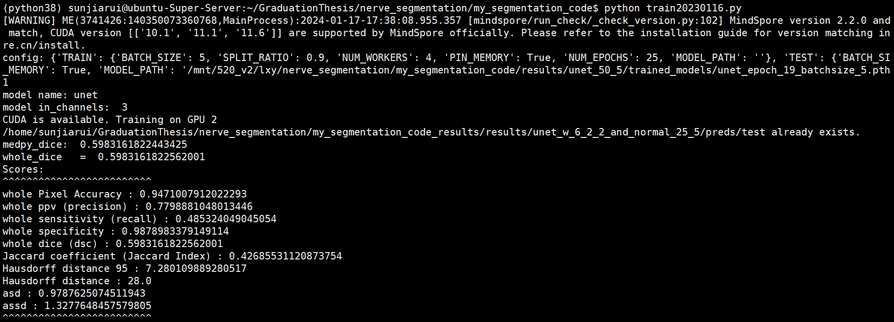
									-
							- 迭代50次的结果
							  collapsed:: true
								- train + val (44次迭代时val结果最好)
								  collapsed:: true
									- 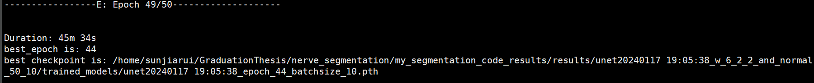{:height 69, :width 594}
									- 
								- test
									- 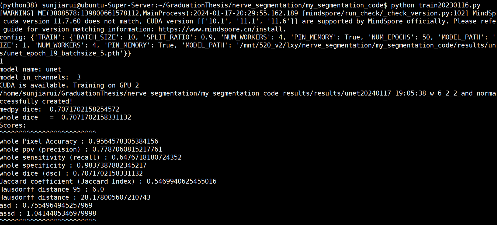
									-
						- DONE  no normal  +  no processing  + 6:2:2
						  :LOGBOOK:
						  CLOCK: [2024-01-11 Thu 21:26:20]--[2024-01-17 Wed 23:35:00] =>  146:08:40
						  :END:
							- train + val （50次迭代，batch大小设置为10）
							  collapsed:: true
								- 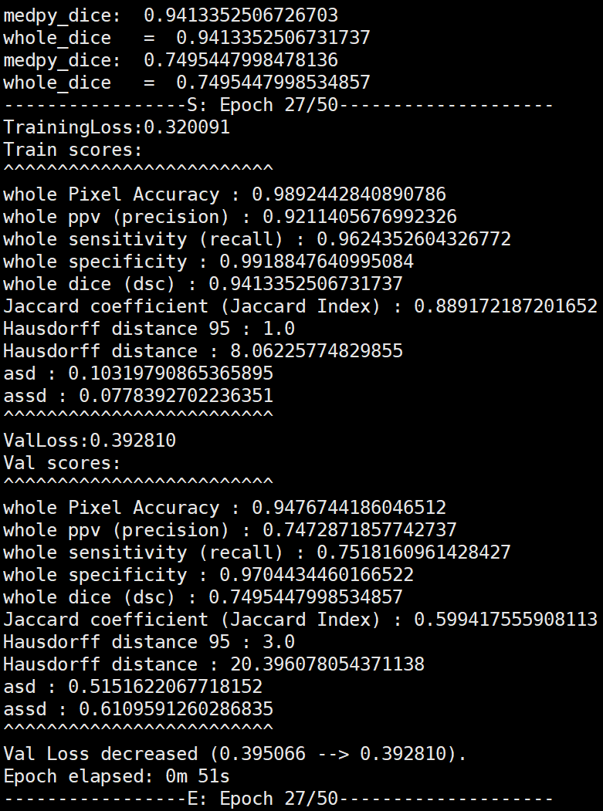
								- 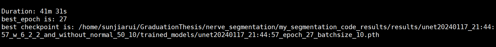
							- test
								- 
								-
						- 这里是加上normal的结果更好
					- DONE  使用第二批数据来对比加不加normal的情况
					  collapsed:: true
					  :LOGBOOK:
					  CLOCK: [2024-01-17 Wed 23:46:49]
					  CLOCK: [2024-01-17 Wed 23:46:50]--[2024-01-21 Sun 02:50:41] =>  75:03:51
					  :END:
						- DONE 第二批数据划分
						  :LOGBOOK:
						  CLOCK: [2024-01-17 Wed 23:47:29]
						  CLOCK: [2024-01-17 Wed 23:47:32]--[2024-01-18 Thu 00:52:56] =>  01:05:24
						  :END:
						- DONE 加上normal数据的
						  collapsed:: true
						  :LOGBOOK:
						  CLOCK: [2024-01-18 Thu 00:53:16]
						  CLOCK: [2024-01-18 Thu 00:53:23]
						  CLOCK: [2024-01-18 Thu 00:54:05]--[2024-01-18 Thu 01:08:16] =>  00:14:11
						  :END:
							- train + val
							  collapsed:: true
								- 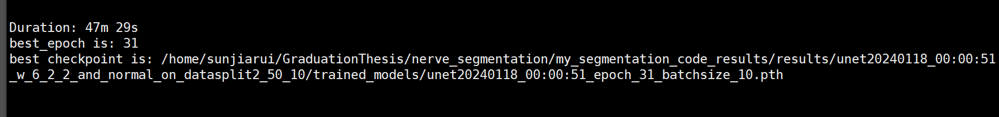{:height 70, :width 532}
								- 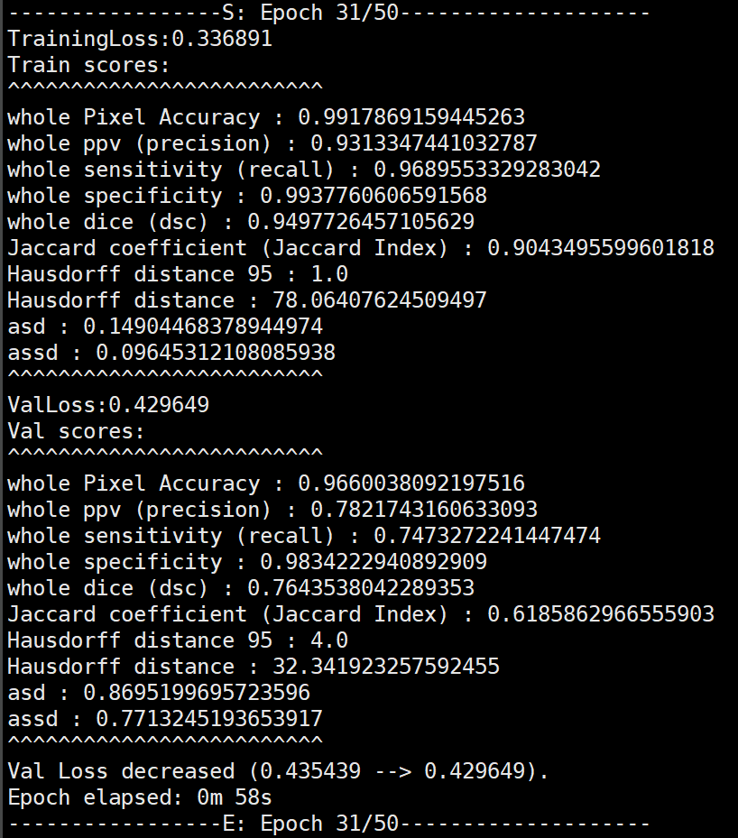
								-
							- test
								- 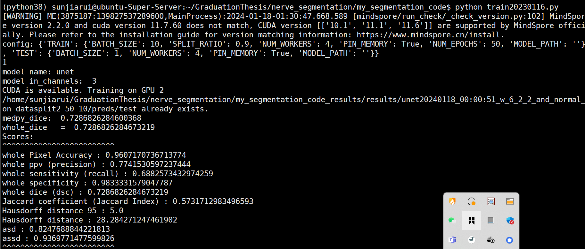{:height 235, :width 532}
						- DONE 不带normal数据的
						  collapsed:: true
						  :LOGBOOK:
						  CLOCK: [2024-01-18 Thu 01:08:29]
						  CLOCK: [2024-01-18 Thu 01:08:31]--[2024-01-21 Sun 02:44:45] =>  73:36:14
						  :END:
							- train + val
							  collapsed:: true
								- 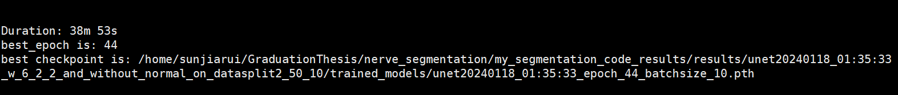
								- 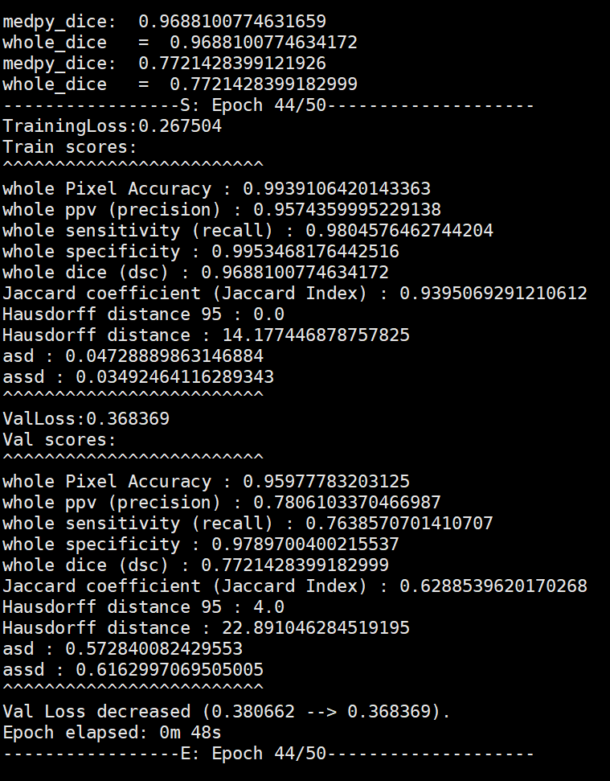
							- test
							  collapsed:: true
								- 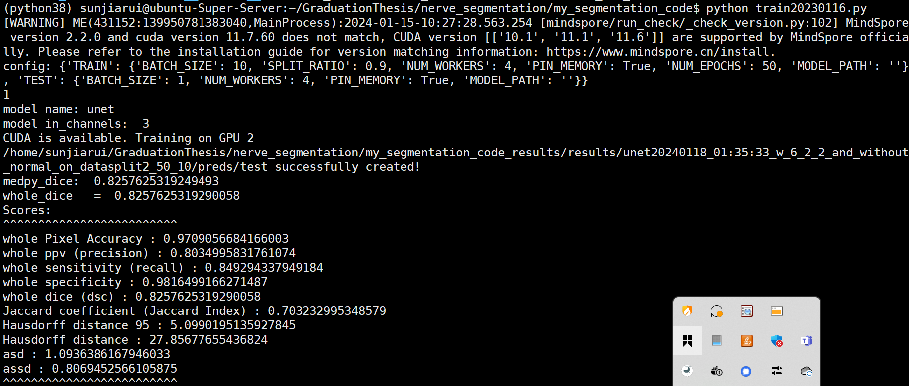
								-
						- 此例中不带normal数据比带normal要更好，而且好得多，不带normal的dsc是0.8258，带上normal的dsc是0.7287
					- DONE 使用第三批数据来对比加不加normal的情况
					  collapsed:: true
					  :LOGBOOK:
					  CLOCK: [2024-01-21 Sun 02:51:57]
					  CLOCK: [2024-01-21 Sun 02:52:00]--[2024-01-21 Sun 20:24:48] =>  17:32:48
					  :END:
						- DONE 第三批数据划分
						  :LOGBOOK:
						  CLOCK: [2024-01-21 Sun 02:54:50]
						  CLOCK: [2024-01-21 Sun 02:54:52]--[2024-01-21 Sun 04:04:17] =>  01:09:25
						  :END:
						- DONE 加上normal数据的
						  collapsed:: true
						  :LOGBOOK:
						  CLOCK: [2024-01-21 Sun 02:54:59]
						  CLOCK: [2024-01-21 Sun 02:55:00]--[2024-01-21 Sun 04:14:53] =>  01:19:53
						  :END:
							- train + val
							  collapsed:: true
								- 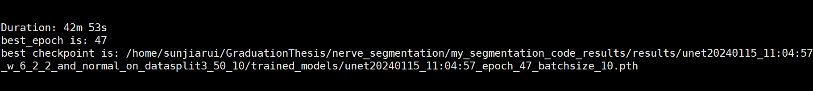
								- 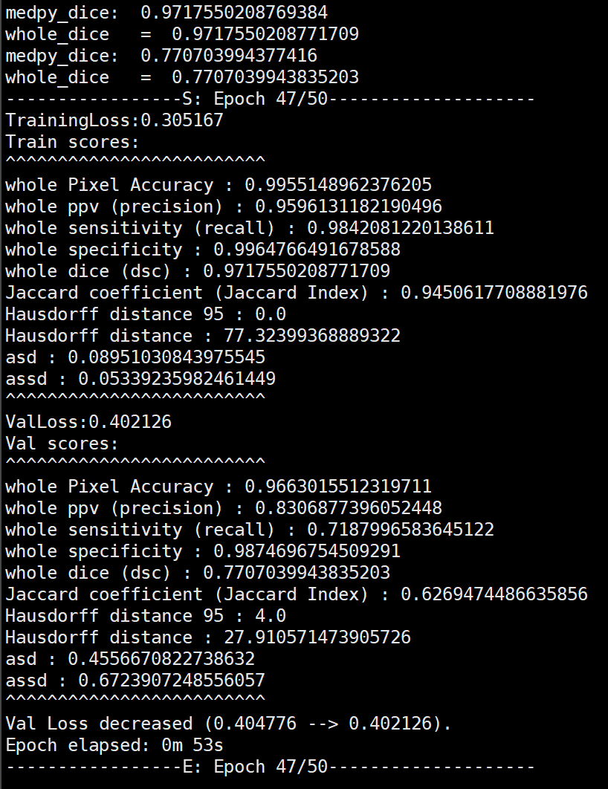
							- test
								- 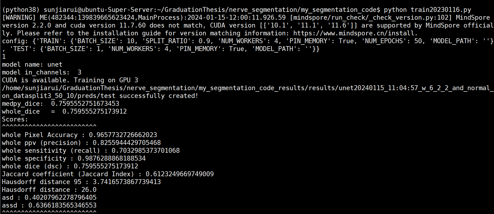
						- DONE 不带normal数据的
						  collapsed:: true
						  :LOGBOOK:
						  CLOCK: [2024-01-21 Sun 02:55:05]
						  CLOCK: [2024-01-21 Sun 02:55:06]--[2024-01-21 Sun 20:23:53] =>  17:28:47
						  :END:
							- train + val
							  collapsed:: true
								- 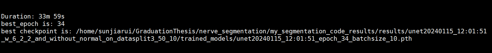
								- 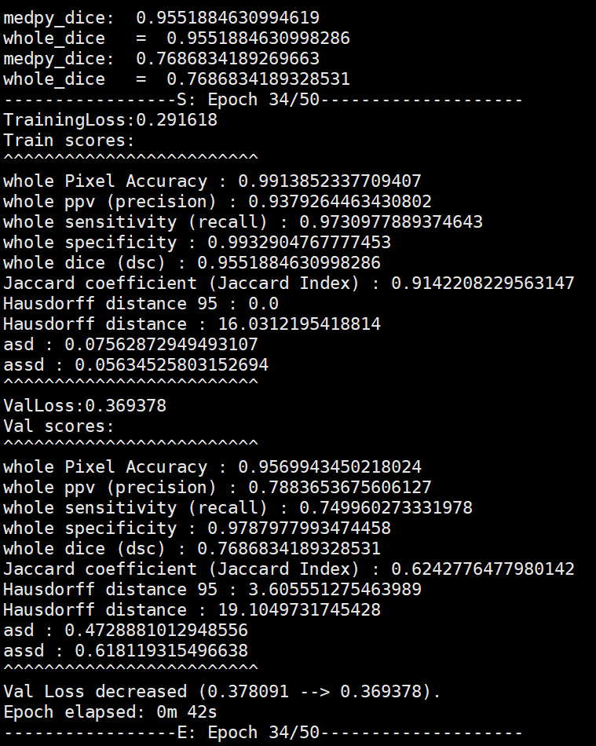
							- test
								- 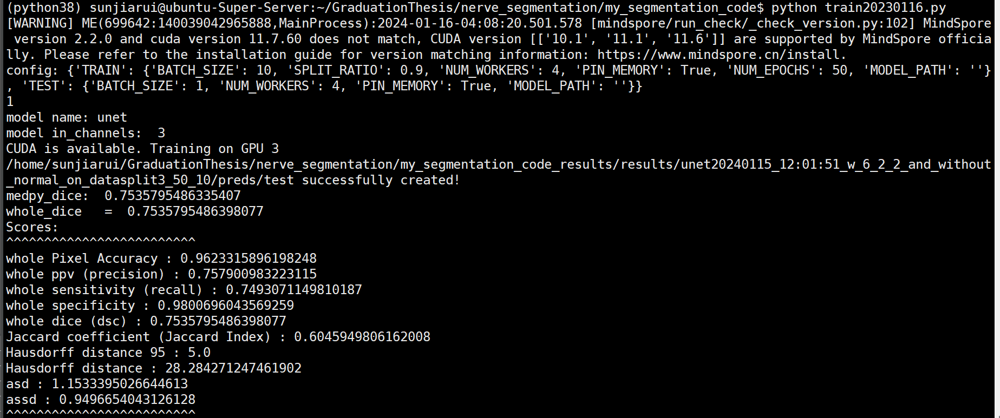
						- 这个数据划分不带normal是0.7536, 带上normal是0.7596
						- 这个数据划分下加上normal的要更好
					- 问了一下GPT是否要加入normal类的图片
						- 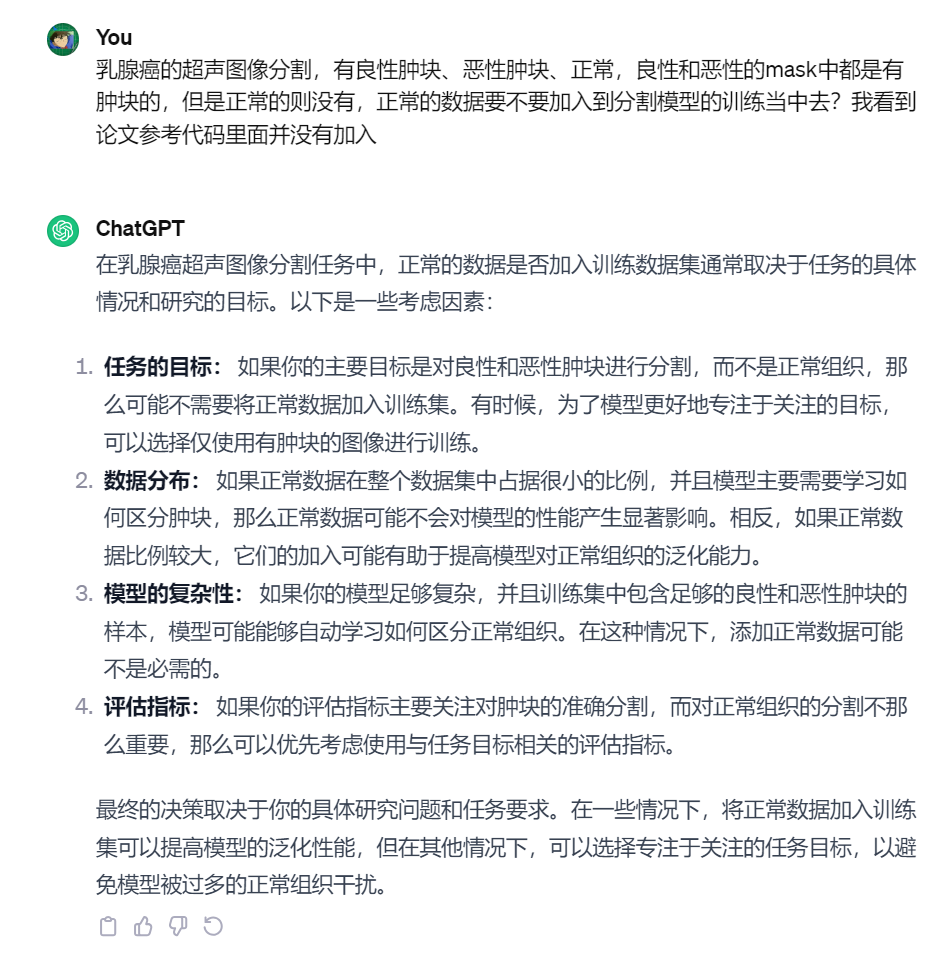
						- 
						- BUSI 中没有肿块的只有133张图片，在数据集中的比例是133 / 780 = 17.05%；
						- 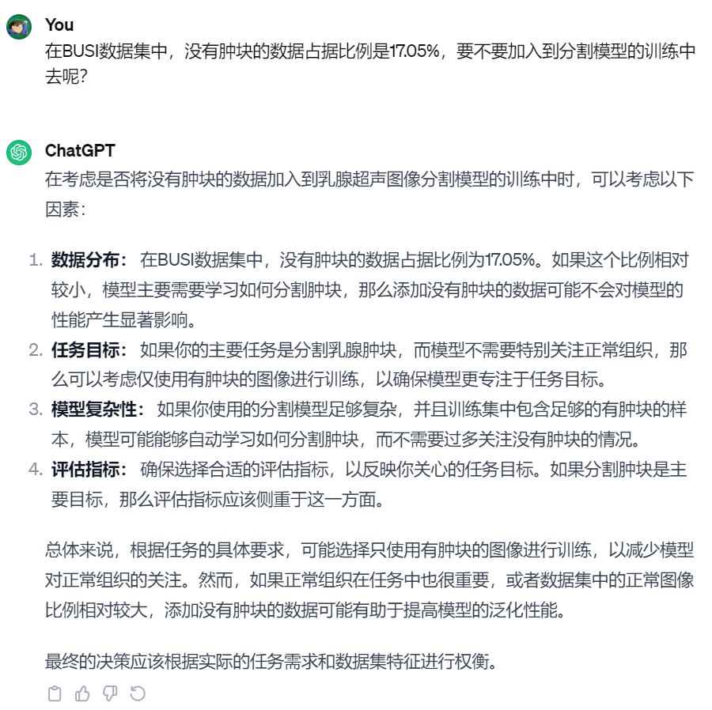
						- 理论分析是：如果加入没有肿块的数据，可以提高模型对于正常组织的泛化能力，但会降低区分良恶性肿块的能力。但是，一方面这里没有肿块的数据比例只有17.05%，对模型的性能不会产生显著影响；另一方面本论文使用的分割模型较为复杂，模型可能能自动学习如何区分非肿块和肿块。
					- DONE 选定最终批次的数据
					  :LOGBOOK:
					  CLOCK: [2024-01-21 Sun 20:39:47]
					  CLOCK: [2024-01-21 Sun 20:39:48]--[2024-01-21 Sun 20:40:00] =>  00:00:12
					  :END:
						- 选择第三批数据，添加了normal和没有normal的对比实验表明，加上了normal图片后泛化能力只提高了很小一部分，说明BUSI数据集中normal数据对于区分肿块和非肿块的作用非常有限，几乎可以忽略不计。同时，论文《Rethinking the Unpretentious U-net for Medical Ultrasound Image Segmentation》的代码部分 和《Breast mass segmentation in ultrasound with selective kernel U-Net convolutional neural network》的实验数据部分也都只使用了benign和malignant这两类肿块。故，本文不添加normal数据。
					- DOING 数据增强操作要怎么处理？
					  :LOGBOOK:
					  CLOCK: [2024-01-11 Thu 21:27:00]
					  CLOCK: [2024-01-11 Thu 22:30:56]
					  CLOCK: [2024-01-11 Thu 22:31:01]
					  :END:
						- 不采用弹性形变
						  collapsed:: true
						  :LOGBOOK:
						  CLOCK: [2024-01-21 Sun 02:52:18]
						  CLOCK: [2024-01-21 Sun 02:52:20]
						  :END:
							- 弹性形变可以引入局部的形状变化，可能导致 mask 边缘出现不规则锯齿
							- 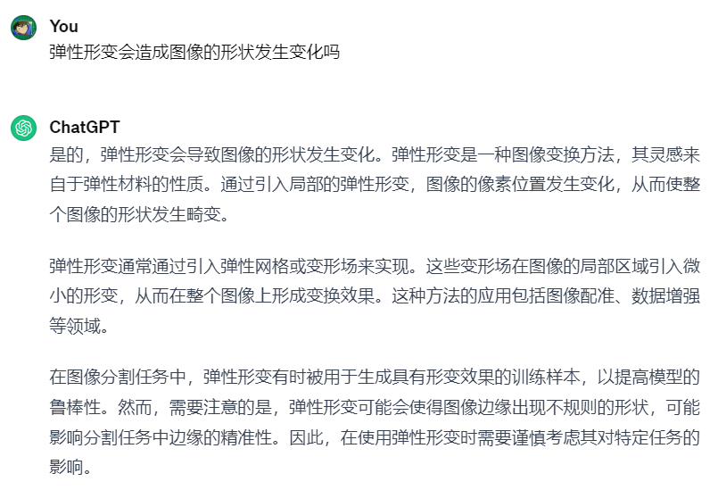
						- 关于gamma对比度变换，是否要采用？不采用
						  collapsed:: true
							- 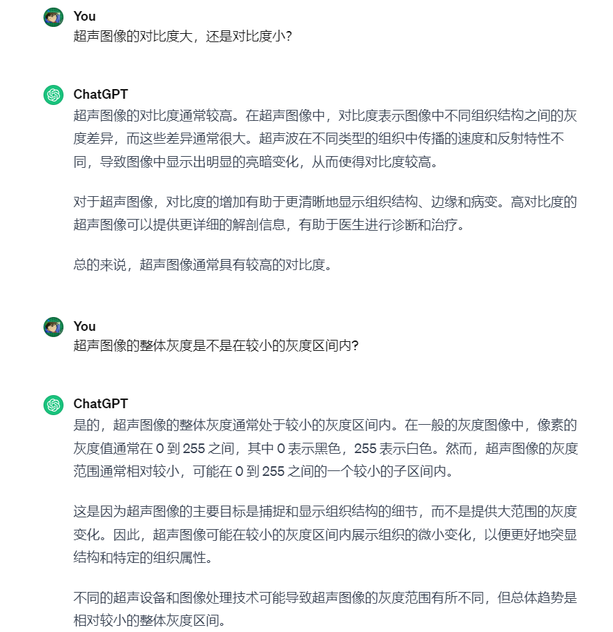
							- 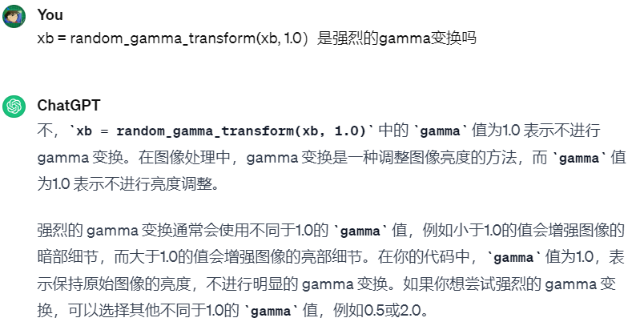
							- https://blog.csdn.net/Roaddd/article/details/112374289
							- 不采纳gamma变换的原因：乳腺超声图像中肿块区域几乎是全黑的，而乳腺组织等其他部分则是灰黑为主夹杂一小部分亮白。如果采用gamma < 1的对比度变换，那么肿块区域的灰度将会被拉升至很高，会和图像内其他的白色部分接近，这样就无法区分清肿块和非肿块了；如果采用gamma > 1的对比度变换，由于超声图像大部分像素都处于低灰度区间，那么非肿块区域的灰度会被大幅度地压缩，也就会与肿块区域更接近而难以区分。所以，这里不采用任何的gamma变换
							-
						- 不采用旋转  或者  只采用很低角度的旋转
							- 因为过高角度的旋转会带来一部分的全黑像素，会被错误分割为肿块的一部分了；也有可能把肿块区域给旋转出正方形的像素空间；同时，原图像中除了非肿块区域存在一部分全黑的空余空间，这部分空间旋转后可能也会被认为是肿块
						-
				- DOING 查看论文使用的几个基线网络，用于对比的
				  collapsed:: true
				  :LOGBOOK:
				  CLOCK: [2024-01-17 Wed 14:21:20]
				  CLOCK: [2024-01-17 Wed 14:21:27]
				  CLOCK: [2024-01-17 Wed 14:21:33]
				  :END:
					- rethinking论文里面的
						- 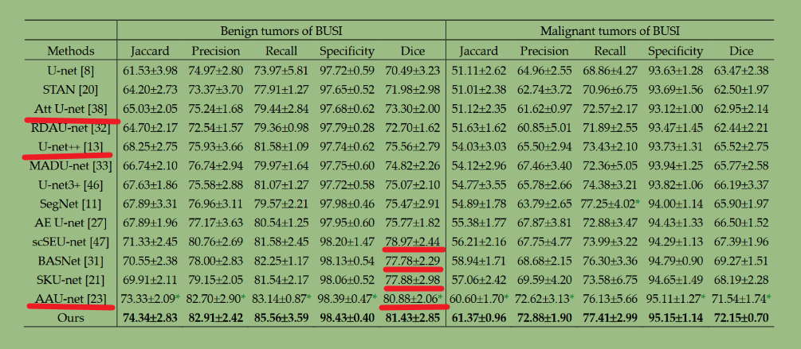
						  id:: 65a7722a-1ec4-42d5-8624-ac8a6244fa6c
					- 残差回馈网络论文里面的对比模型
					  collapsed:: true
						- 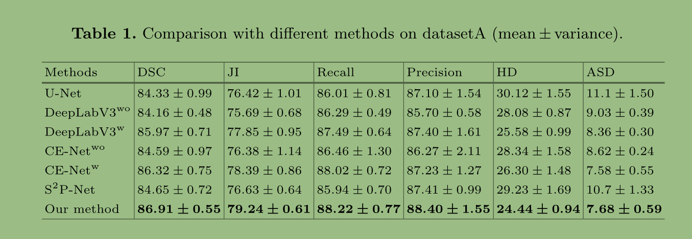
						-
					- 师兄论文里面的对比模型
					  collapsed:: true
						- 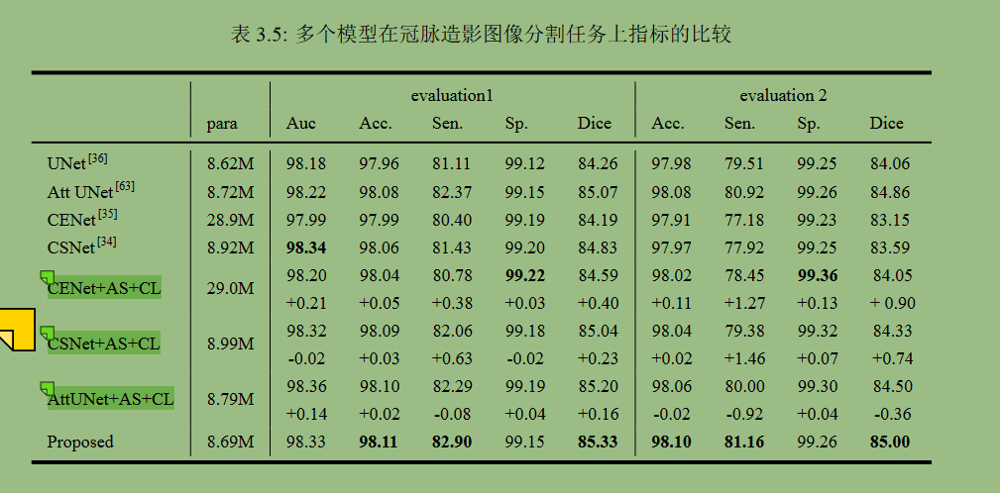
						-
					-
				- TODO 就是特殊的存在多个乳腺肿块的分割block的图片，这个可以单独拿出来讲一下
				  :LOGBOOK:
				  CLOCK: [2024-01-17 Wed 18:40:50]
				  CLOCK: [2024-01-17 Wed 18:40:54]--[2024-01-17 Wed 18:41:36] =>  00:00:42
				  :END:
				-
			- TODO 怎么修改rethink模型的主干网络，使得其具有相当效果
				- DOING 阅读rethink中的几个主要对比模型
				  collapsed:: true
				  :LOGBOOK:
				  CLOCK: [2024-01-17 Wed 22:10:59]
				  CLOCK: [2024-01-17 Wed 22:11:00]
				  :END:
					- DOING 阅读AAU-net
					  :LOGBOOK:
					  CLOCK: [2024-01-17 Wed 22:11:49]
					  CLOCK: [2024-01-17 Wed 22:11:52]
					  :END:
						- [[AAU-net: An Adaptive Attention U-net for Breast Lesions Segmentation in Ultrasound Images]] [[PaperInsight]]
							- 因为乳腺肿瘤的形态各异，所以通过捕获各种感受野下的特征能够获得形态在尺度上的鲁棒性，通过同时捕获空间和通道上的特征能够获得形态在不规则上的鲁棒性
							-
				- DOING 修改模型的损失函数做一些实验
				  :LOGBOOK:
				  CLOCK: [2024-01-19 Fri 00:21:29]
				  CLOCK: [2024-01-19 Fri 00:21:30]
				  :END:
				- DOING 修改新主干网络的模块的一些新参数
				  :LOGBOOK:
				  CLOCK: [2024-01-21 Sun 02:53:19]
				  CLOCK: [2024-01-21 Sun 02:53:21]
				  :END:
				- DOING 重新加diffusionUnit的实验
				  :LOGBOOK:
				  CLOCK: [2024-01-21 Sun 02:52:51]
				  :END:
			- TODO 怎么修改uncertainty map那块，使得其有效果
			- TODO 用一个端到端的网络来顺带完成乳腺肿块的分类
			-
			-
			-
			-
		- [[开始撰写毕设大论文]]
		  collapsed:: true
			- TODO 先确定三章每一章具体针对的问题是什么
			  :LOGBOOK:
			  CLOCK: [2024-01-21 Sun 20:43:45]
			  CLOCK: [2024-01-21 Sun 20:43:48]
			  CLOCK: [2024-01-21 Sun 20:44:03]--[2024-01-21 Sun 20:46:05] =>  00:02:02
			  :END:
			- TODO 先开始撰写第三章
			  :LOGBOOK:
			  CLOCK: [2024-01-21 Sun 20:44:25]
			  CLOCK: [2024-01-21 Sun 20:44:43]
			  CLOCK: [2024-01-21 Sun 20:44:44]--[2024-01-21 Sun 20:46:04] =>  00:01:20
			  :END:
			- TODO 在跑实验或者没有进度的时候开始写前两章
			  :LOGBOOK:
			  CLOCK: [2024-01-21 Sun 20:44:50]
			  CLOCK: [2024-01-21 Sun 20:45:02]
			  CLOCK: [2024-01-21 Sun 20:45:03]
			  CLOCK: [2024-01-21 Sun 20:45:06]--[2024-01-21 Sun 20:46:05] =>  00:00:59
			  :END:
			- TODO 划定章节的标题，然后估计下每章大概要写多少页
			-
- ## CountDownPlans
	- NOW CountDown100
	  collapsed:: true
	  :LOGBOOK:
	  CLOCK: [2023-10-26 Thu 09:50:56]
	  CLOCK: [2023-10-26 Thu 09:50:57]--[2023-11-08 Wed 19:16:23] =>  321:25:26
	  CLOCK: [2023-11-08 Wed 19:16:28]--[2023-11-08 Wed 19:16:29] =>  00:00:01
	  CLOCK: [2023-11-08 Wed 19:16:30]
	  :END:
		- DONE coundown93 + countdown92
		  :LOGBOOK:
		  CLOCK: [2023-10-26 Thu 09:51:11]
		  CLOCK: [2023-10-26 Thu 09:51:12]--[2023-10-26 Thu 09:55:26] =>  00:04:14
		  :END:
			- 完成了日企面试的hr面谈和实际面试 + 完成了大部分的材料协商工作
			- 了解了一些日本东京的地理知识：东京都市圈、大阪都市圈
			- 开始组建自己的：“自我保护系统”、“微期待系统”、“分心流管理系统”（每当不自觉因为无聊而产生分心时，随笔记录当时的内心想法）
		- DONE countdown91，90, 89, 88
		  :LOGBOOK:
		  CLOCK: [2023-10-26 Thu 09:52:28]
		  CLOCK: [2023-10-26 Thu 09:52:29]--[2023-10-30 Mon 09:48:20] =>  95:55:51
		  :END:
			- 完成了百度、浪潮和日企的面试，把广州银行、中信银行以及满帮集团的笔试都没做了
			- 玩了整整两天 + 一晚上，主要是纯发呆吧 =》就是一种什么也不想做的状态
			- 下定决心要完全改变自己的生活方式：尽量不要过于零散地进行对话 + 早起早睡了 + 每天不管心情或者状态如何一定要完成部分的工作量 + 不总是改变长期目标 + 短期内集中于实现短期目标 + 把自己的工作速度加速到1.5-1.75倍速（在其他需要细致的工作可能得降速0.75甚至0.5，这就是我最近的“调速系统”）+ 对自己要有要求（不能太惯着自己，这里的要求是：凡事一定要有一个结果、能够做到的事情坚决要实现、不断修正自己做事中的bug）+ 不能长时间陷入停顿状态 + 坚持通过阅读写作和讨论来学习（视频仅仅只能是作为参考）
		- DONE countdown87
		  :LOGBOOK:
		  CLOCK: [2023-10-30 Mon 09:52:06]--[2023-11-08 Wed 19:16:25] =>  225:24:19
		  :END:
			- [[长期主义]]
			-
	- DONE 自我检视
	  collapsed:: true
	  :LOGBOOK:
	  CLOCK: [2024-01-09 Tue 21:46:45]
	  CLOCK: [2024-01-09 Tue 21:46:50]--[2024-01-11 Thu 20:35:13] =>  46:48:23
	  :END:
		- 其实骨子里我是喜欢有一定的可以依赖的对象 =》依赖意味着当需要帮助时，不用从0开始探索 =》虽然baseline不一定很高，但是不用经过从0到baseline爬升的那一段最辛酸的时光 =》就是得尝试各种可能的路径，其中有些路径可能具有毁灭性的灾难，可行的路径如果没有坚持到正确的时间点可能就放弃了 =》本质上是我想探索已经挖掘好的现有的东西，却没有胆量、智慧和汗水去进行“真正的探索” =》也就是还是“畏难”，我缺乏真正的面对困难的勇气和信念 =》一旦我具有了，就能在各种困难面前独当一面，而不需要依靠别人的帮助
		- 我发现我其实并没有什么节省成本的概念 =》包括时间成本、机会成本、金钱的成本 =》特别是有一大块的时间，就特别只想用来做一件事 =》我感觉这种是时间的充足感充裕感，或者说冗余感 =》或者说，这是一种时间上的富裕感 =》“贫穷”导致的心理上紧巴巴的感觉，让我本能地排斥 =》时间上的紧张感，让我觉得自己在进行百米冲刺，或者是 抠搜搜地扣馒头末来吃 =》我想要可支配的时间变得富足
	- DONE 查找“数据架构”、“数据流图”、“数据流架构图”等的书籍
	  collapsed:: true
	  :LOGBOOK:
	  CLOCK: [2024-01-11 Thu 20:36:03]
	  CLOCK: [2024-01-13 Sat 18:01:35]
	  CLOCK: [2024-01-13 Sat 18:01:36]--[2024-01-13 Sat 19:08:28] =>  01:06:52
	  :END:
		- 务架构应用架构数据架构实战 温昱 PDF电子版
		- 业务架构解构与实践(博文视点出品)
		  王旭东 魏炜 等
		- 数据为王:打开工业数据治理之门 pdf
		- https://blog.csdn.net/SaixiCo/article/details/130976506
		- https://yd.qq.com/web/reader/0cb322b0720439750cbda36
		-
	- DOING 阅读《有序》1h
	  collapsed:: true
	  :LOGBOOK:
	  CLOCK: [2024-01-13 Sat 19:14:23]
	  CLOCK: [2024-01-13 Sat 19:14:24]
	  :END:
		- DOING 超级搜索术用来降低信息整理的成本
		  :LOGBOOK:
		  CLOCK: [2024-01-17 Wed 20:05:14]
		  CLOCK: [2024-01-17 Wed 20:05:16]
		  :END:
			- https://www.yojiang.cn/pc/lesson/117
			  id:: 65a7c288-d097-4656-b0e7-08a1ac4e717b
			- https://zhannicholas.github.io/library/%E8%B6%85%E7%BA%A7%E6%90%9C%E7%B4%A2%E6%9C%AF/
		- TODO 自己开发一款信息整理工具
		  :LOGBOOK:
		  CLOCK: [2024-01-17 Wed 20:06:47]
		  CLOCK: [2024-01-17 Wed 20:06:48]--[2024-01-17 Wed 20:07:26] =>  00:00:38
		  :END:
		-
	- DONE 去拿快递，因为有可能是比亚迪的材料
	  :LOGBOOK:
	  CLOCK: [2024-01-21 Sun 22:50:54]
	  CLOCK: [2024-01-21 Sun 22:50:56]--[2024-01-22 Mon 22:08:05] =>  23:17:09
	  CLOCK: [2024-01-22 Mon 22:08:42]--[2024-01-22 Mon 22:08:44] =>  00:00:02
	  :END:
		- DOING 记得四月份提交相关的三方，里面还有需要教务盖章的部分可能需要提前弄
		  :LOGBOOK:
		  CLOCK: [2024-01-22 Mon 22:08:50]
		  CLOCK: [2024-01-22 Mon 22:08:51]
		  :END:
	- DOING 成年人的第九步是严谨：列举生活中不严谨的诸多案例、在什么样的地方才需要严谨
	  :LOGBOOK:
	  CLOCK: [2024-01-22 Mon 22:09:18]
	  CLOCK: [2024-01-22 Mon 22:09:20]
	  :END:
	- DOING 成年人的第十步是处理矛盾的方法：错位结构法
	  :LOGBOOK:
	  CLOCK: [2024-01-22 Mon 22:09:36]
	  CLOCK: [2024-01-22 Mon 22:09:39]
	  :END:
	- DOING 成年人的第十一步是如何获得稀缺的资源
	  :LOGBOOK:
	  CLOCK: [2024-01-22 Mon 22:11:14]
	  CLOCK: [2024-01-22 Mon 22:11:17]
	  :END:
	- DOING 成年人的第十二步是实际利用理工科思维的实战系列
	  :LOGBOOK:
	  CLOCK: [2024-01-22 Mon 22:27:11]
	  CLOCK: [2024-01-22 Mon 22:27:13]
	  :END:
	-
- ## DistractionTracing
	-
	-
-
-
-
-