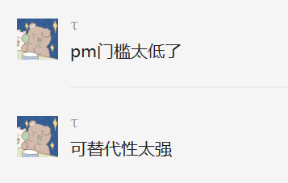
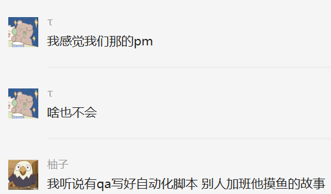
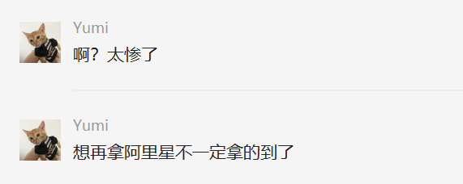

- # Purpose
	- 聊天内容很多时候是有启发性的，但是如果不及时记录和归纳这些东西，就会很快遗忘，也更谈不上应用了，所以必须要再次回味有些特别有价值的对话，从中提炼出自己的观点或者说insight，以便真的掌握别人给你提供的认知价值
- # Nov 11th, 2022
	- pm容易被裁的几点原因、qa不容易被裁以及容易摸鱼的原因：[[pm]] [[qa]]
	  collapsed:: true
		- QA(Quality Assurance) 是质量保证员
		- [[DialogRethink]]
		  collapsed:: true
			- 
			- 
			- 
		- [[findings]]
		  collapsed:: true
			- qa是刚需，工作内容简单、工资也低，所以没什么人卷
	- 注意就业offer的时效性：
		- [[DialogRethink]]
		  collapsed:: true
			- 
			- 
			- 
			-
			-
		- [[findings]]
			- 哪怕拿到的offer再好，当时效性过了，别人有了其他的可替换选项之后，也会空亏一篑
			-