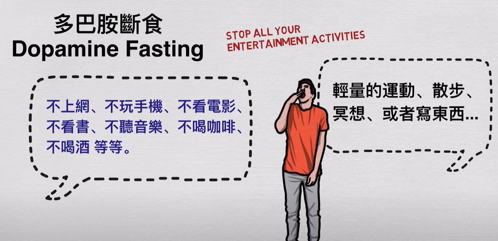
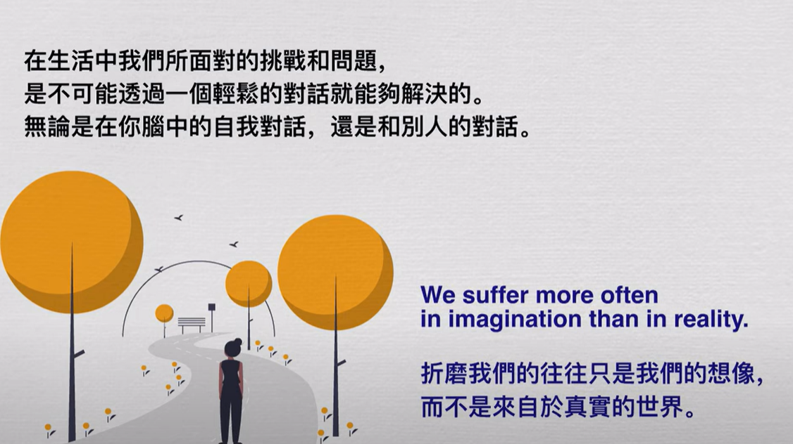
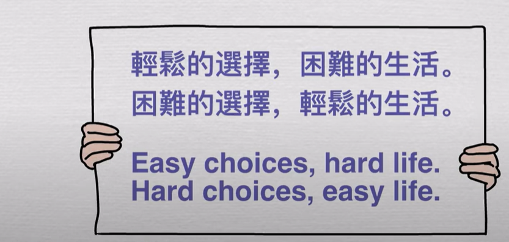

- 多巴胺断食
  collapsed:: true
	- 
		- 就是摆脱一切可以让我们能够逃避的事物，直面问题
		-
- [[SelfAnalysis]]:
  collapsed:: true
	- 今天你有感到不舒服吗？是心情上的不舒服，还是身体上的不舒服。具体描述这种状态。
	- 为什么会出现这种感觉？
	- 你现在可以做些什么来解决现在的问题？写下1到3件你认为至少可以改善这种情况的方法
	- 如果你现在什么都不做，那么3-5年后你的生活会变成怎么样？最坏的结果是什么呢？
	- 如果你做出了行动，解决了那些困难的问题，那你的生活将会变得怎么样呢？
	-
- 为何需要[[主动克服]]：
  collapsed:: true
	- 
	- 
		- [[TimFerris]] [[Celebrities]]
		-
	-