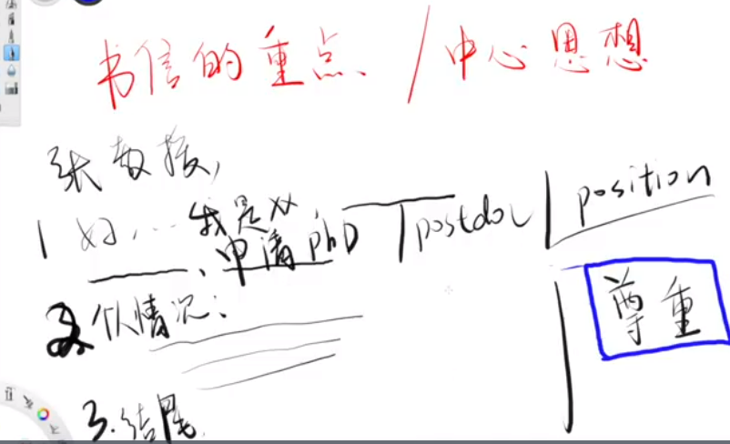
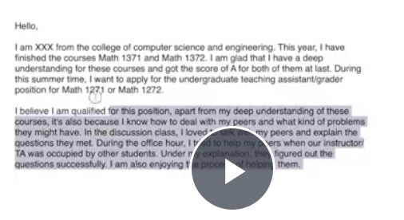
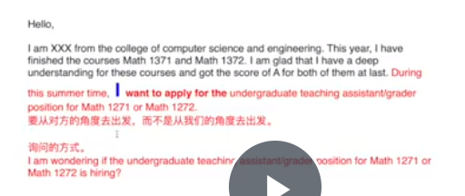
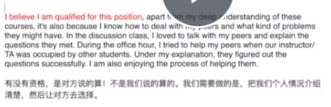
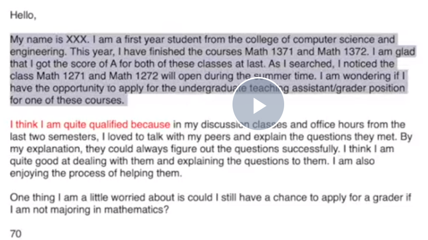
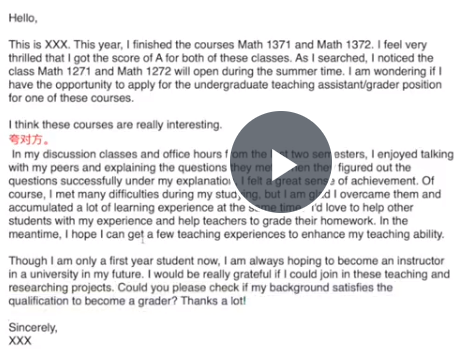
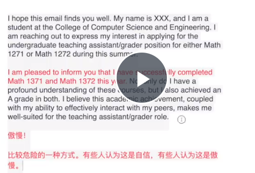
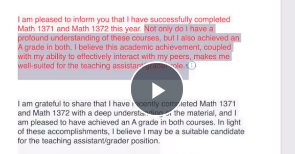
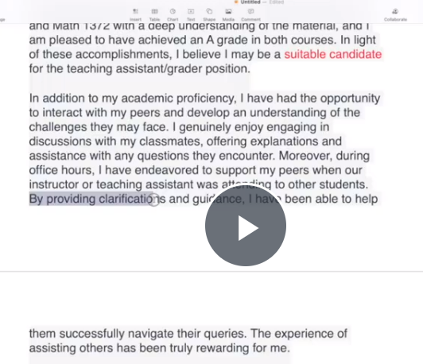
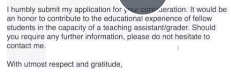

- https://youtu.be/Zdj4rqf-d-c
	- 邮件能够从侧面反映出你的背景：有没有海外留学经验、有没有基本的英文文化圈常识、有没有connection
	- chatGPT能完成95%的文书工作了，几乎是无往而不利
	- 向上社交是要与 [陌生的] [地位比你高的] 人交流
		- 比如某些学院的高层领导
		- 中国学生的缺点是不知道如何准确地表达尊重
		  collapsed:: true
			- 中国文化里的尊重：
				- 
				- 加上很多的敬语表示态度和懂礼貌，比如您好；称呼头衔时对方的头衔中哪个最大就叫什么，对方既是老师又是教授，那肯定称呼对方教授，如果人家还是副院长，那么就称呼是副院长
			- 英文文化里的尊重：
				- 我把情况交代清楚，然后把选择权交给对方
				- 案例版本1：
				  collapsed:: true
					- 
					- 
						- 对方可能会认为：难道这个岗位是你想申请就申请的吗？这个岗位这么不值钱的吗？
						- 不要经常用I作为主语开头
					- 
						- 有点喧宾夺主了
						- 后面的资格的详细描述内容上没有太大问题，但是逻辑性欠缺，车轱辘话反复说，
				- 案例版本2：
					- 
					- 内容方面欠缺，因为计算机系想要去给数学系的当助教，那么必须得拿出具有说服力的证据才行，要给对方一个足够合理的理由来接受你，比如这里申请助教可以说自己未来有读phd当教职的规划，想要提前体验一下教学的这种感觉
					- 内容上要有一种感人至深的感觉，但是不是卖惨或者是这里的“我很喜欢帮助它们的过程”这种类型的主观上的情感表达，而应该是一种客观上的表达，因为这种主观表达是一种主观需求，太弱了
					- 语言要尊重，还要委婉，委婉就是说要避免“I think” “I want” 这种特别主观的词
						- “我以为应该怎么怎么做”可以改成：“我已经尝试了三种方法，A方法是xxx，B方法xxx...结果，我想询问你，觉得应该做才是合适的呢？就我个人而言(as far as I know, as far as I understand）我觉得方法2应该是不错的”
					- 表达自己是qualified并不是“我很自信”的正确表达方式
				- 案例版本3：
					- 
					- 在描述自己的情况下，适当捧高对方
					-
		- GPT使用：
		  collapsed:: true
			- 原文：
				- Please rephrase the following email：
					- i am XXX from the college of computer science and engineering. This year, i have finished the courses Math 1371 and Math 1372. am glad that i have a deep understanding for thestcourses and got the score of A for both of them at last. During this summer time, I want toapply for the undergraduate teaching assistant/grader pasition for Math 1271 or Math 1272.
					- i think I am quite qualified, apart from my deep understanding of these courses, it's also because I know how to deal with my peers and what kind of problems they might have. In the discussion class, I loved to talk with my peers and eaplain the questions they met. During the office hour, I tried to help my peers when our instructor/TA was occupied by other students.Under my explanation, they figured out the questions successfully: I am also enjoying the process of helping them.
				- gpt：
					- Dear [Recipient's Name],
					- I hope this email finds you well. My name is XXX and I am a student at the College of Computer Science and Engineering. I am reaching out to express my interest in applying for the undergraduate teaching assistant/grader position for Math 1271 or Math 1272.
					- This year, I successfully completed Math 1371 and Math 1372, and I am proud to say that I achieved an A grade in both courses. I have developed a deep understanding of the subject matter and feel confident in my ability to assist others in their learning journeys.
					- Not only do I possess a strong grasp of the course material, but I also have experience working with my peers and addressing their concerns. During discussion classes, I enjoyed engaging with my classmates and helping them understand challenging concepts. Additionally, I took the initiative to assist my peers during office hours when our instructor or teaching assistant was occupied with other students. It was fulfilling to witness their successful comprehension of the material under my guidance.
					- I believe that my combination of academic achievement and interpersonal skills make me well-suited for the teaching assistant/grader role. I am enthusiastic about the opportunity to contribute to the learning experience of my fellow students and support the academic goals of the department.
					- Thank you for considering my application. I would be more than happy to provide any additional information or references upon request. I look forward to the possibility of joining the teaching team and making a positive impact on the academic community.
					- Best regards, XXX
				- 当然gpt也可能会存在一些问题：
					- 
					- 改变提问gpt的方式可能可以解决，具体还是得看内容：
					  collapsed:: true
						- Please rephrase the following email using a modest and respectful attitude:
						- 
						- 
						- 
						-
					- GPT的内容过于啰嗦了，且核心内容还是由我们自己来设计
					-
	-
	-
	-
	-
	-