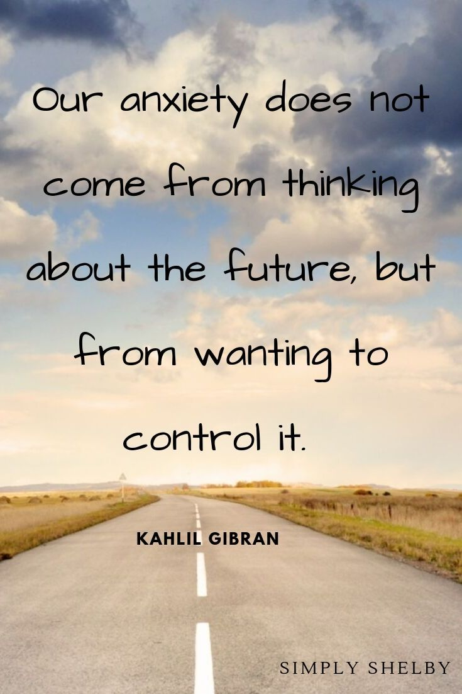

- # How to deal with my emotion sometimes out of control
	-
	- 出现不良情绪的时候，得先破后立
	  collapsed:: true
		- 破之法
			- 阅读书籍
				- 处理情绪本身
				- 处理问题本身
			- 看赤焰男孩等博主的b站视频
			- 打电话找朋友深度探讨解决之道
			- 宣泄情绪
				- 跑步
				- 打拳
				- 写文字
				- 睡觉
				- 吃东西、喝快乐水
		- 立之法
			- 若心情能平复：
				- 迅速列好马上要做的三件事并执行
			- 若心情不能平复：
				- 做一些需要做、不需要过高专注度的小事情
	- {{youtube https://www.youtube.com/watch?v=HYwwvCernlE}}
		- 被情绪绑架，最严重的[[影响(Influence)]]是什么？
			- 当处于情绪当中，会忘记[[#red]]==情绪本来的原因是什么、情绪的具体影响是什么==
			- 陷入情绪，而忽略真正需要做的事情，忘记生活的目标
			-
			-
-
- # sentences about emotion control
	- #mottos
	  collapsed:: true
		- Better to be patient than a warrior, and better to have self-control than to capture a city
		- 你感到烦恼、悲伤时，就走到美丽的地方去
		- 
- # Execution
- [[Jun 12th, 2022]]
  collapsed:: true
	- MoodHealing
		- Type：懒惰、无聊、苦闷
		- Date：
		- Reason：昨天晚上没有休息好，胸闷气短；老师给的完成论文写作的进度压力
		- Results：
			- Duration：从上午十点持续到晚上7点（其中两个小时半帮助我姐分析问题） ，也就是6个小时半
			- Influences：摆烂导致很多作业没写
		- Solution：7-9睡了两小时
		- Control Rating（对本次情绪控制的打分）：一颗星；因为觉得任务很好拖，所以无限拖延解决情绪的时间
		- Reward or punishment：
			- DONE 晚上跑步回宿舍
			  :LOGBOOK:
			  CLOCK: [2022-06-12 Sun 22:08:28]--[2022-06-14 Tue 13:54:56] =>  39:46:28
			  :END:
			- DONE 傻笑五分钟
			  :LOGBOOK:
			  CLOCK: [2022-06-12 Sun 22:10:43]--[2022-06-12 Sun 23:11:23] =>  01:00:40
			  :END:
			-
- [[Jun 14th, 2022]]
  collapsed:: true
	- MoodHealing
		- Type：对自己有点失望，
		- Date：
		- Reason：因为不够别人忙碌，不够别人投入、学习到成就感还不足够强
		- Results：
			- Duration：20分钟
			- Influences：娱乐转移了一下心情
		- Solution：继续做事
		- Control Rating（对本次情绪控制的打分）：2分
		- Reward or punishment：
			- DOING 赶紧报名托福考试
			  :LOGBOOK:
			  CLOCK: [2022-06-14 Tue 13:57:00]
			  CLOCK: [2022-06-14 Tue 13:57:18]
			  :END:
- [[Mar 12th, 2023]]
  collapsed:: true
	- 我觉得我的情绪已经表达还不够准确，你要说生气了就直接说生气了，为啥需要拐弯抹角
	- 关键是当你表达生气了的时候，你又担心人家会讨厌你，所以你就自动转换成了别扭模式，你希望他能以一种委婉的方式来看到你的需求，可是他很明显并没有，这一点你要学会死心，除非是心里专家否则都做不到每次都可以感知到
	- 我觉得让自己冷静下来吧，不要再去讨好别人，不要去获取别人的喜欢或者说制造产生喜欢的元素，让自己变成喜欢的组合体本身吧
	- 就是感觉没有冲劲，一种麻木感、空洞感和无聊感非常让人觉得压抑，我还是觉得说话使人快乐
	-
	-
-
-