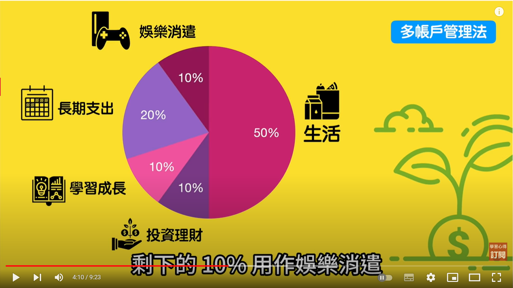

- 达到 [[财务自由]]的基础是什么？
  collapsed:: true
	- 要有足够多的[[资产]]
- 5个可以加快[[财务自由]]的方法：
  collapsed:: true
	- [[别放过任何一块钱的流向]]
		- 也就是[[记账]]
	- [[建构自动化存钱系统]]
		- 自动化存钱：把该存的钱存起来
		- 自动化缴款：信用卡账单、生活账单等可以设置在特定时间自动化扣费
	- [[开始学会做预算]][[专款专用]]
	  collapsed:: true
		- [[汤马斯]][[有钱人都这么做]]中的一点就是：
			- 尽可能[[量入为出]]，把多余的钱做投资理财；
		- [[预算]]的作用不仅仅是控制花费，更是弄清楚自己的[[财富状况]]
		- 做预算的一个方法：
		  collapsed:: true
			- [[多账户管理法]] 把支出划分为生活、投资理财、学习成长、长期支出、娱乐消遣这五个方面
				- 
		-
	- [[摆脱身上的消费型贷款]]
	  collapsed:: true
		- 也就是摆脱坏债。在理财之前需要理债：
			- 卡贷、车贷、信贷、保单借款、助学贷款
				- 这些债务的还债都是在开始工作的10年内
		- 需要认识到一个[[思维偏误]][[误区]]：
			- 将[[贷款]]里面的钱用去做投资理财并不一定就会[[稳赚不赔]]哦？
				- 因为天底下没有稳赚不赔的投资
			- 真正 [[稳赚不赔]]的 就只有及时还款，把原本要支付的[[利息]]留在口袋里面
		-
	- [[改变收入结构，开启多种收入来源]]
		- 建立稳定而且可以产生现金流的[[投资收入]]
			- 比如购买会分配现金股息的股票或者债券
		- 打造业余事业
			-
	-
- 你是[[超优理财族]]还是[[超逊理财族]]？
  collapsed:: true
	- [[超优理财族]] 指代的是在年龄、收入相近的族群属于[[净资产]]较高的那一群人；反之则为 [[超逊理财族]]
	- [[超优理财族]] 会比 [[超逊理财族]] 的 [[净资产]] 多出三到四倍
-