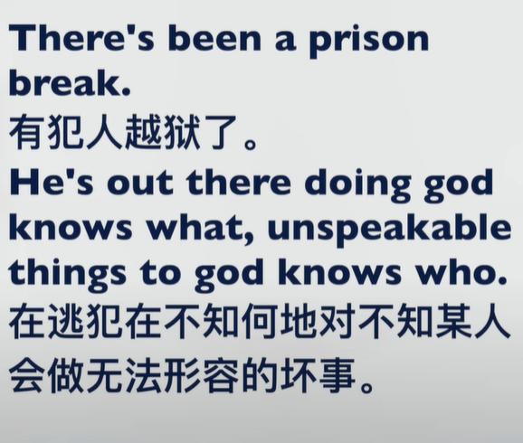
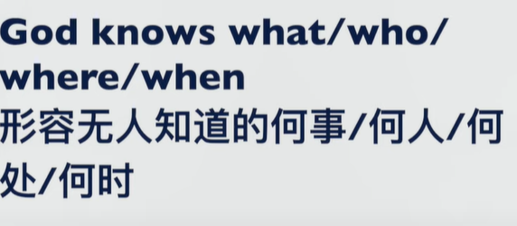

- # Episode1
  collapsed:: true
	- we are faced with the quandary(困境) of needing to train model with only subjectively labelled data available
	- anesthesia(麻醉) is performed before modern sugeries.
	- every flower has its own florescence(花期)
	- https://www.merriam-webster.com/dictionary/in%20its%20own%20right
	- Google Map is great in its own right. It gained its popularity not from the company's reputation.
	- Eileen Gu is great in her own right even if it has something to do with her mother.
	- In practical terms(实际上)， I am already a father of five cute boys and girls.
	- We need some posterior knowledge to solve this problem.(我们需要一些后验知识来解决此问题)
	- his behavior is not intentional.故意的
	- I do not know how to appeal to my mother about traveling abroad. (我不知道怎么呼吁我母亲出国旅游，travel的ing形式不需要双写)
	- The logo design for the 120th anniversary of Southeast University doesn't appeal to me very much.(东南大学120周年校庆的标志设计对我**不****太有吸引力**。)
	- Handling fees for the immigration services are pretty much. (移民服务的手续费非常多)
	- It is recognized that the hukou system is in the interest of Chinese senior officials, but not the common people. (众所周知，户口制度符合中国高级官员的利益，但不符合普通民众的利益。)
	- The spouse/children of Japanese nationals are not required to conform to rule1 or rule2. (-日本国民的配偶/子女无需遵守规则1或规则2。)
	- why do you curse me so virulently? (恶毒地咒骂我)
	- Those with vested interests are always incompatible with those whose interests are damaged. (既得利益者总是与利益受损者不相容)
	- I chortle with delight. (我哈哈大笑）
	- We guffaw at his jokes. 我们对他的笑话哄笑
	- She chuckled at the memory of being knocked down by her Prince Charming. 每当想起她对男神撞倒这件事，她就暗自发笑/悄悄地笑
	- "Yes， I do”， said the bride with a simper on her face at the wedding. (“是的，我愿意，”新娘在婚礼上啥笑着说。)
	- Please put away with your silly simper. (请不要再傻笑了)
	- He is famous as the "the boy with silly simpering". 他以“傻笑男孩”而闻名。
	- As a mother, she grinned from ear to ear at the wedding of her son. (作为一个母亲，她在儿子的婚礼上咧嘴笑得合不拢嘴。)
	- I cringe(畏缩) at the mention of large parties.
	- The medicine can mitigate(缓解) the pain at the source.
	- Memory FootPrint (内存占用) of the model is 1000 MB.
	- You should buy some protective gear to prevent damage.(你应该买一些防护用具来阻挡伤害)
	- Skydiving is a kind of sport that may stretch or tear the nerves. 跳伞是一种可能拉伸或者撕裂神经的运动.
	- His head is colliding with the floor at an angle after being hit by a car.  在被车袭击后，他的头正与地面以一定角度相撞.
	- He just tweaked these figures before showing them to the boss. 他在将数据展示给老板前，**略微改动了这些数字。**
	- My mom likes to tweak my ears whenever I make a mistake. 我妈妈当前犯错的时候就会喜欢揪着我耳朵。
	- Keep tweaking the arrangements in search of the right balance. **不断调整**合约内容以达到正确的平衡。
	- Preserve your sanity even with extreme angriness. 即使暴怒，也要保持你的理智。
	- The police plead for sanity among drivers. 警察提请驾驶人谨慎驾车。
	- The lawyer can oftentimes help the wealthy zero out their taxes. 律师常常可以帮助富人零税。
- # Episode2
  collapsed:: true
	- {{youtube https://www.youtube.com/watch?v=_dz9YJh3eug}}
	  collapsed:: true
		- We build our program around the idea that people need love and support.(以这个想法为核心)
		- We must build on our reputation to expand our business.我们必须建立在自己的声誉的基础上来拓展业务
		- I’d say in terms of strength, I am well versed in branding and recognizing customer personas. 我要说的是，就实力而言，我非常擅长品牌推广和识别客户角色。
		- The public personas that we present to the recruiter grow ever more significant. 我们向招聘者呈现的公众形象越来越重要
		- I like to dig in. 我喜欢深入挖掘问题
		- I would make publishing papers my priority during the master period.
		- The government is giving priority to school leavers in the job-creation program.
		- An inventory of such institutions as the labor union is a top/main/high priority. 工会等机构的清单是头等/主要/高度优先事项。
		- -How do you balance perfection and efficiency? -I would tend towards efficiency.
		- I 'm open-minded about different culture.
		- {{youtube-timestamp 253}}
			- difuse the situation 解决纠纷
			- lay out all the different perspectives on the table
		- {{youtube-timestamp 281}}
			- 替换speed up
			- faciliate long term planning and risk assessment
			- I would be a great addition and also a great candidate.
		- The entire planning and budgeting framework is result-oriented.
		- Every private enterprise is profit-oriented, which is the reason that they lay off old employees in no consideration for humanistic care. 每个民营企业都是以盈利为导向的，这也是他们不顾人文关怀而解雇老员工的原因。
		- What kind of results were you able to create for your last company? 你能为上家公司创造什么工作业绩？
		- My debating skills and communication strategies were honed in the students' union. 在学生会工作期间，我的辩论技巧和沟通策略得到了磨练。
		- Wow, that guy's physique was just honed to perfection. 那个家伙的体格简直被打磨到完美。
		- The grit is honed into a diamond. 砂砾被磨成钻石
		- I have to hone my coding skills as a programer. 作为一名程序员，我必须磨练我的编码技能。
		- I'd like to collaborate with a group of like-minded people. 我想与一群志同道合的人合作。
		- An agreement can never be resolved by the Russia and Ukraine group. 俄罗斯和乌克兰集团永远无法解决协议问题。
		- We all hope the dispute between mother-in-law and daughter-in-law can be resolved peacefully. 我们都希望婆媳之间的纠纷能够和平解决。
		- I received information that strengthen my resolve(决心) for studying abroad.
		- The customer with a missing order came storming in. I listened to their problems, apologized, and was able to resolve them by offering a 10% discount on the original price for their inconvenience. 订单丢失的客户冲了进来。我听取了他们的问题，向他们道歉，并且能够通过提供原价 10% 的折扣来解决他们给他们带来的不便。
		- I'm pretty quick to think on my feet.  我能够很快重新站起来思考。
		- My sister is on her feet all day when working in the milk tea shop. 我姐姐在奶茶店工作的时候整天都得站着
		- We'll soon have you on your feet again. 我们很快能够看见你重新振作起来。
		- He was suddenly on his feet near a tree, holding a book to read in the sunlight. 他在一棵树旁突然站起来，拿着一本书在阳光下阅读。
		- initiate可以替换 start、set up、begin
		- After the failure of private consultation, we initiated a legal proceeding against the company. 在私下协商失败后，我们对该公司提起了法律诉讼。
		- Doctors will initiate a series of tests to determine whether you are qualified for the vaccination.
		- My sister was in responsible for the orientation of new hires. 我姐姐负责新员工的指导。
	- The storm suddenly abated. 风暴突然减弱.
	- The bad social atmosphere contributed to the alienation of scientists from China. 恶劣的社会氛围导致科学家与中国的疏远。
	- Apple are too entrenched in China. 苹果在中国太根深蒂固\站稳脚跟。
	- China is on the way to a nationwide lockdown.
	- America is going through a nationwide oil price rising.
	- Are they really going to be up the creek later this year? 他们在今年的后半部分真的会经历困境吗？（creek愿意是小溪，up the creek表示的是in trouble, in a serious predicament 在严重的困境当中)
	- If the house loan doesn't arrive today, I'm up a creek. 如果房贷今天没有下来，我就会陷入困境。
	- The meta earnings will have to take a massive hit if they cannot make stuff to sell. meta的收入将会遭受重创.
	- Her talent shines through her piano playing. 她的才能在她的钢琴演奏中清晰、明显地显示出来
	- They'll have to onshore to the Americas with Mexican labor in 6 months if they want to keep earnings up. 如果他们想保持收入增长，他们将不得不在 6 个月内与墨西哥劳工一起到美洲大陆。(onshore不是副词，而是动词，表示从海洋向着大陆方向移动、或者待在陆地而不是海洋，Americas不是America的复数，其含义是美洲)
	- If Apple earings tank over the next few quarters（tank意为遭受快速的下降、失败或者是崩溃，这里可以翻译为收益下滑）then they'll take a big chunk of the market. (然后他们将占据市场的很大一部分。)
	- If it ain't （is not, am not, are not), broke, don't break it.
	- I ain't(have not, has not) got anything to say in face of such slander. 在这样的污蔑面前我无话可说
	- I hook up with that girl a year ago.
	- mind-boggling, mind-blowing,  eye-opening, stunning...Mind-blowing and mind-boggling
	  "mind-blowing" = brilliant, fantastic, amazing, unbelievable, makes me feel really great 
	  "mind-boggling" = confusing, doesn't make sense mind-blowing vs mind-boggling
	  I would say that mind-blowing leans more towards amazement and being impressive while mind-boggling leans more to being impressive as well as being puzzling.
- # Episode3
  collapsed:: true
	- {{youtube https://www.youtube.com/watch?v=tQcEz4VGVPY}}
		- Atheist 无神论者
		- I am not religious, but I respect all the religion.
		- we need to look/watch out for each other because help isn't coming.
		- Beautiful looking is admired in the usual sense of the world.
		- Not believing in the boss is my default position. 不相信公司老总是我的默认立场。
		- I am an atheist who believes in atheism. 我是一个相信无神论的无神论者.
		- Atheism is actually a lack of deity. 无神论其实是神的这一概念的丢失
		- humanity好或者坏与语境有关
			- Humanity（人性中好的一部分）. Despite its very obvious, and apparent, flaws. I believe we have it in us to excel and be better.  我们相信我们有能力能够超越并且变得更好。
			- I believe in humanity. 我相信人性本善. = I believe in the good of humanity.
			- Greed is part of humanity. 我们本性就有贪婪.
		- dope = awesome,adj; drug,noun;
			- Science, how dope nature is! 科学，大自然是多么酷啊！
			- -Check out my new sneakers. -They're pretty dope. 酷！炫！
			- NYPD found dope in Sara's car. No, someone must have put the drugs here deliberately.
			- There is a banner "Anti Doping"(反兴奋剂).
			- Doping scandals came out frequently in the athletics competition like high jump（跳高）、long jump (跳远)、three step jump(三级跳)、100-meter dash（100米短跑）.
		- unspeakable thing
			- There is nothing in this world preventing me to do unspeakable things(难以启齿的事情、不能说的意思，通常是坏事). Laws are words. They have no meaning and only apply if get caught.
			- There's a prison break（越狱）. He's out there doing god knows what, unspeakable things to god knows who.
				- 
				- 
		- It doesn't apply (here/in this situation).
		- Is it wrong to be a homebody? 当宅男有错吗
		- That noob is useless. 那个小菜鸟\新手毫无用处。
		- China is pitching itself as the high-tech hotbed of artificial technologies. 中国正将自己定位为人工智能技术的高科技温床。
		- we pitched in(to contribute to a common endeavour) to buy a gift for our birthday-to-be-came roommate. 我们为我们即将过生日的室友买了一份礼物。
		- Mobile technology is transforming the way that we live and work.
		- Online tools are transforming the communication into a more convenient way.
		- I never deserve to be in a high-end coffee shop like today. 我永远不配像今天这样在高端咖啡店。
		- America continues to leverage its AI strengths while fostering the best conditions for startups to scale up quickly. 美国继续利用其人工智能优势，同时为初创企业快速扩大规模创造最佳条件。
		- America has been taking top spots on the global military field. 美国一直在全球军事领域占据领先地位。
		- China is a leader in the fundamental infrastructure landscape. 中国在基础设施领域处于领先地位。
		- Standford is recognised internationally for its skilled talent pool.
		- Canada is playing a pioneering role in setting up the responsible use of AI.
		- I dangle the doll in front of my daughter. 我将玩具挂在我女儿面前
		- Her hair was dangling from the window of the classroom. 她的头发从教室的窗户垂下来。
		- Chinese use "。" to denote the period and use ":" to denote the colons. 中文使用。表示句号，用：表示冒号。
		- Participles ended usually with "-ed" or "-ing", in which participles ending with "ed" are called past participle, and participles ending with "ing" are called a present participle.
		- There are three kinds of mood in english: the indicative mood, the imperative mood and the subjunctive mood. 在英语中有三种语气：陈述语气，祈使语气和虚拟语气
		- We cannot tell the marital status from English names.
		- Are you aware these notes are counterfeit? 你觉察到这些钞票是伪造的吗？
		- Chinese like to counterfeit American products. 中国人喜欢伪造美国的产品。
		- She is held in very high regard （高度重视） by her colleagues. 她很受同事们的敬重。
		- Nuclear testing is actually an examination of attitudinal loyalty 态度忠诚.
		- Her job involves critiquing designs by fashion students. 她的工作包括评判时装专业学生的设计
		- Draw a line hastily at a point of instability. 在不稳定的点上匆忙划一条线
		- I win a concession from my mother. 取得某人的让步
		  id:: 62943e89-d62e-4b3f-99ba-c659bbfe7a57
		- Lotion can smooth the itching. 洗剂可以止痒。
		- this point may now seem obvious and trite. 这一点现在看起来很明显和陈词滥调
		- the interests of the child are of paramount importance.  孩子的利益是至关重要的
		- These prisoners were exempted by President Biden. 这些囚犯被赦免了.
		- In China, government executives always have various privileges, such as being exempted from the 14-day home quarantine. 在中国政府高管总是有各种特权，比如14天的居家隔离被豁免
		- My mom likes to take a sip of the green tea named Long Jing. 我妈妈喜欢一小口一小口地喝龙井茶.
		- Having the free time for sipping a cup of cappuccino is my necessity. 有空闲时间啜饮一杯卡布奇诺是我的必需品。
		- When I get to the point of what she meant, she had already committed suicide. 当我明白她的意思时，她已经自杀了。 （to reach the main or most important idea of something that is said or written）
		- I start to get to the point of this argument.  我开始谈到这个论点。
		  id:: 6296c0a5-aa58-46bb-b638-00b6532584a6
		- Chinese people are actually trying to find footing in this world. 中国人其实尝试在世界站稳脚跟。
		- We can dispose of slanders of our dreams with a sneer. 我们可以用冷笑来处理对我们梦想的诽谤。
		- How would you dispose of a bad mood?
		- Young people are just burnt out by the endless pressure. 年轻人只是被无尽的压力烧毁了。
		- Please take my blessings and go to your dreams with enthusiasm. 请带着我的祝福，热烈地奔赴你的梦想吧
		- Everyone has an admiration for the bliss of heaven. 每个人都对天堂的幸福充满崇拜。
		- She gave a sign of bliss seeing her son at the door of the house. 在看见房门口的儿子之后，她发出来极其幸福的叹息。
		- bliss = great joy; perfect happiness
		- non-fungible tokens = NFT 不可替代货币
		- crypto collectibles 加密收藏品
		- We hope to find exclusive art products in New York market. 我们希望在纽约市场上找到独家的艺术产品。
		- That woman journalist could always dig out exclusive news with her sharp insight. 那个女记者，凭借敏锐的洞察力，总能挖掘出独家新闻。
- # Episode4
  collapsed:: true
	- {{youtube https://www.youtube.com/watch?v=JQ8fU_0Cs3A}}
	- Let's cut straight to the chase. 让我们直奔主题
	- My sister is working late in Greece Company. 我姐今晚在格力加班.
	- Don't wait up.  Just hold a bouquet of flowers and confess to her.  别等了。 拿着一束鲜花，向她表白。
	- work overtime
		- 过去加班或者常常加班
			- I work late during the last project as a programmer. 作为一名程序员，我在上个项目期间经常加班。
			- The government project ended up being a lot more work than Zijie Xu's team expected, so they had to work overtime for several weeks to make deadlines. 政府项目的工作量比许子杰的团队预期的要多得多，所以他们不得不加班几个星期才能赶上最后期限。
		- 比喻
			- My imagination was working overtime. 我的想象力放飞了。
			- I was  making up all scenarios about the life of the hero and heroine in the drama menghualu in my mind/head.  梦华录中男女主角的生活，我都在脑中编造出来。
		- 工资是按照小时来计算的
			- But she has not asked her boss for overtime pay yet. 她还没有索要加班费
			- Do you offer overtime? 你们提供加班机会吗？付加班费吗？
	- work long hours 经常加班、
		- Expect to work long hours if you want to be a lawyer or doctor.
	- pick up extra shifts / an extra shift 多上几班公/多上一班
		- I have to pick up more shifts to cover my living expenses in Canada.
	- cover for someone's shift 给某人代班
		- Tom just called in (Tom生病了的意思). I need to cover for her shift tomorrrow.
		-
		-
- # Episode5
  collapsed:: true
	- Present miscreants 现在的恶棍 includes Youyong Kong and Huazhong Shu.
	- It is intended to be a straightforward way to get up and running with the Tex documentation production system.
		- 它旨在成为一种直观的方式来启动和运行Tex文档生成系统。
	- It is applicable for most flavors of Unix. 对于大多数的Unix都是适用的。
	- Chinese policies are targeted at most flavors of people. 中国的政策针对的是大多数人。
	- he entertained a fugitive idea that Barbara needed him. 他产生了一个逃亡的想法，认为芭芭拉需要他
	- I entertain a idea of starring in the new version Blade Runner. 我有一个在新版《银翼杀手》中主演的想法.
	- Blade Runner initially underperformed in North American theaters and polarized critics; some praised its thematic complexity and visuals, while others critiqued its slow pacing and lack of action. It later became an acclaimed cult film regarded as one of the all-time best science fiction films. Hailed for its production design depicting a high-tech but decaying future, Blade Runner is often regarded as both a leading example of neo-noir cinema as well as a foundational work of the cyberpunk genre. The film's soundtrack, composed by Vangelis, was nominated in 1982 for a BAFTA and a Golden Globe as best original score. 《银翼杀手》最初在北美影院和两极分化的评论家中表现不佳； 一些人称赞它的主题复杂性和视觉效果，而另一些人则批评它的缓慢节奏和缺乏动作。 它后来成为一部广受好评的邪典电影，被认为是有史以来最好的科幻电影之一。 《银翼杀手》因其描绘高科技但衰败的未来的制作设计而备受赞誉，它通常被视为新黑色电影的领先典范以及赛博朋克类型的基础作品。 这部电影的配乐由 Vangelis 创作，于 1982 年被提名为 BAFTA 和金球奖最佳原创配乐
	- In whatever topics  to be discussed， there would be polarized comments on weibo in China.
	- Chinese never analyses what's the cause of the underperformance of their chip industry. Instead, they only want the outperformance of the superficial results, that is to say, the index.
	- Some praised courage for Sister Feng's working and earning a living across the ocean, while others critiqued her accusations against the motherland which are although true facts.
	- He was an acclaimed master student in Southeast University. 他是东南大学著名的硕士生。
	- I love many genres of American Operas. 我喜欢很多种不同类型的美国戏剧。
	- On an individual level, up until I am alive I want to achieve goals. 从个人层面，只要我活着我都想实现目标。
	- Why do people shy away from stress? 为什么人会回避压力？
	- Do you think this is the right mentality or what is your comments on this approach？ 您认为这是正确的心态吗？
	- A whole generation of Chinese will make mistakes of hubris(狂妄自大) and arrogance（无知）.
	- Study joyfully and work lovingly. 快乐地学习、热情地工作.
	- You have no proof to substantiate the allegations.
	- Only when I am in a state of an emotional breakdown do I turn to people.
	- Only when people are in pleasant states of experience do your brain and your body work at their best.
	- Our body get immune to it.
	- You will find more and more exotic words for your negative behavior. 你会为你的消极行为寻找越来越多的异国词汇.
	- When you stress your muscle（对肌肉施压）， it grows when it breaks.
	- You do not need so many nourishments（营养品） to be healthy, you just need to work out.
	- There are 72 kinds of mental aliments（aliment的复数，精神食物、精神营养物）.
	- Once your intelligence has turned against you, no power in the universe can save you. If your intelligence is working for you，would you keep this （Referring to Oneself）blissfulness(幸福) or stressful， please tell me.    #mottos
	- He just demolished（拆除，爆破） the popular idea of working very hard leading to success.
	- If you are busy working joyfully, you don't have to work hard to be a success - you already are. #mottos
	-
	-
	-
	-
	-
	-
	-
- # Episode6
  collapsed:: true
	- You can incubate（孕育）a lot of either negative or positive things in sleep.
	- Either pleasantness or unpleasantness, you can incubate very effectively uninterrupted in sleep.
	- Three or four hours is the cycle time for digestion.
	- Go for a hukewarm shower. 温水淋浴
	- A certain purification happens if you run water over your skin.
	- inhalation（吸气）， I‘m not the body；exhalation（呼气），I'm not even my mind.
	- Resting means that you‘re changing the energy equation where consumption is lowered, and production is going at the same pace. So you feel rejuvenated because consumption has been lowered.
	- If you're on acute activities(剧烈的活动), consumption is more.
	- Come to a certain state of ease.
	- You are not at total ease.
	- Your sleep quota will naturally shrink. 你的睡眠量自然会减小。
	- Body has some inertia. 身体有惯性
	- You‘re deceased. = You're dead.
	- You have the disease because you're dis-eased.
	- Being agitated(激动) about everything is modern life.
	- He valued his life immensely.
	- You have a very vivid sense of memory and a fantastic sense of imagination.
	- I pray whatever you are streesing about gets better.
	- May god bless you.
	- May clarity replace confusion.
	- May peace and calmness fill your life.
	- May the dark thoughts, the overthinking, the doubt will exit your mind right now.
	- Plagiarism is not allowed in any paper writing. 剽窃
	- The 2022 GDP in China will not be in excess of two per cent. 中国2022年的GDP不会增长超过2%。
	- Students in China worked in excess of 70 hours（工作超过70个小时） to finish their academic task.
	- In old days 80 percent of needed goods in Tibet had to be transferred from the inland areas.
	- You just muddy the meaning of the sentence.  你只是混淆了这个句子的意思。
	- I can forsee he will come into the wealth one day.
	- What do you anticipate about the immigrant life in Canada?
	- This policy will lead to fiscal deficit in personal investment.
	- It is about encouraging the domestic and foreign investment.
	- 'Based on' is the more common phrase, and means as a basis for. 'Basing on' as an expression is unusual, but could occur in a phrase such as ' I'm basing my argument on certain assumptions'.
	- I think you're right, but there's no end to the inventiveness of people to verbally inflate what they are doing, or for organizations to create new jargon. 我认为你是对的，但人们在口头上夸大他们正在做的事情或组织创造新行话的创造力永无止境
	- Variation among models cannot be negligible. 模型之间的变化不能被忽视。
	
- # Episode7
  collapsed:: true
	- Nominalization could increase the information density and facilitate efficiency and accuracy of communication.
	- Separate use of lexical or syntactic paraphrasing  is not good.
		- Lexical Paraphrase:
		- Syntactic Paraphrase:
	- One of the key elements of the Conclusion section is a final judgement on the significance of the findings in terms of their implications and impact, along with possible applications to other areas.
	- Very likely he is the only child in his family.
	- Connotations（内含、隐含的意义） and Denotations（外延、意义）:
		- The word ‘professional’ has connotations of skill and excellence.
			- professional这个词隐含着技艺和专长的意思。
		- Dog has a lot of negative connotations（贬义） in Chinese.
		- The connotation of education ethic is rooted in human nature's mobility.
			- 教育伦理的内涵根源于人本性的变动性。
	- My mom has strong moral convictions. 我母亲有很强的道德信仰。
	- We should hold the conviction that all would be well in the end.  最终一切都会好起来的坚定信念
	- Organization models in literature review：
	- He is writing a discourse(论文) on issues of gender and sexuality.
	- Make a discourse analysis(语篇分析) for the thesis.
	- The office was bestowed on him by the chief of state. 国家元首将这个办公室授予/赐给他。
	- You are not eligible participant for this social experiment because you are not Canadian. 你不是合乎条件的关于这个社会实验的参与者。
	- Who are eligible to vote in China? 在中国谁有资格进行投票？
	- She is the eligible girl for me so far. 她是我目前为止最为合意的、中意的、满意的女孩
	- you are grumpy from your outlook on your life. 你的人生观让你脾气暴躁。
	- America is always full of zealous reformers. 美国一直有充满热情的改革者.
	- That girl is so zealous for her handsome neighbor. 那个女孩对他帅气的邻居过于热心、过于热情了.
	- He is a pesty/pesky boy for making loud noise in the park. 他是一个令人讨厌\惹怒人的男孩
		- pesty means behaving like a pest 表现得像个害虫一样.
	- What  genre do the 《梦华录》fall into, comedy or tragedy? 梦华录这部剧是什么艺术类型，悲剧还是喜剧？
	- I want to hail from a college named Yale. 我想从耶鲁毕业.
	- I hail from Anqing, Anhui. 我来自安徽安庆
	- The audiences of the concert hail from all part of the country. 这场音乐会的粉丝来自全世界.
	- In the meantime, Yale was founded in 1701.
	- Where to matriculate seems to be a problem for ElienGu. 对于埃林古来说，在哪里入学似乎是个问题。
	- You‘ll learn quintessential engineering knowledge(精髓的工科知识) from Southeast University.
	- This was the quintessential farming country of America. 这是美国典型的农场.
	- You have to find the quintessential charm（本质魅力） of his songs.
	- You'll get a first-rate education and thrive on people's conversation.
	- here is where we thread Shakespeare.  这就是我们解读莎士比亚的地方
	- Rest assured. 请放心.
	- The campus provided us with family and common ground（共同点）.
	- We reside in SEU together for three years, united by pride.
	- You can hone your abilities by using these facilities.
	- I’m gonna eat my fill. The restaurant just offers organic options for every meal.
		- 我要吃饱了。这家餐厅只为每顿饭提供有机选择。
	- I simply enjoying hanging out with Tom every Friday.
	- There’s butteries for snacks.  小吃有黄油。
	- Will these credits suffice? 这些学分够了吗
	- this fellowship is nice. 这个团体
		- a group of people or an organization with the same purpose
		- the American Fellowship of Reconciliation 美国和解团体
		  id:: 62b2789d-ce43-4897-b5b5-a1be025b05f7
	- Thank goodness that we have our dean. 谢天谢地我们有我们的院长.
	- What do your counselor say about you? 你的辅导员说了什么？
	- I’ll glad to subside （资助）if anyone wants to see a BroadWay show.
	- Come give a cheer. 来欢呼吧。
	- 17 dance troupes  17个舞蹈团
	- I joined the Indian dance troupe this year.
	- She's still at varsity. 她仍然在上大学.
	- 35 varsity sports team 35个校园运动队
	- She has been in the playoffs every year since she made the varsity.
		- 自从加入校队后，她每年都能参加季后赛。
	- 45 club sports teams
	- 28 intramural(学校内部的、机构内部的) sports teams
	- 21 singing groups
	- 4 cultural houses 4个文化馆
	- 8 comedy groups
	- 1 sustainable farm
	- 9 theater organizations
	- 22 music ensembles 22个音乐组合
	- 19 political organizations
	- 36 student publications 36份学生出版物
	- where do Plato and Picasso intersect?
	- Time to hit the ignition in science or in chemistry or as a musician.
	- How do you handle the 连字号 hyphenation?
	- I have to buy a bag of washing powder or a bucket of laundry detergent
		- 我得买一袋洗衣粉或者一桶洗衣液.
	- I don't want to be blackened by the big vat of Chinese Society.
		- 我不想被中国社会的大染缸给染黑.
	- There are universals in men's and women's behavior patterns.
		- 男性和女性的行为模式存在共性。
	- Historically speaking
	- The gangster fires a shot at a close range. 歹徒近距离开枪
	- Chinese apps can often have large throughput(吞吐量) due to the huge population base.
	- Tesla in China has larger throughput(生产量) than in any other country.
	- American education has many distinctions from China: a) they ask more why than how; b) they have less homework; c) they have more course selections;  d) they pay fine attention（细致的） to individual interests.
	- As a heuristic,  we tried to boil eggs by milk.
	- You have to flesh out all the ideas you have. 你必须充实你的所有想法。
	- Starting off （开个头，首先）, I  am going to introduce something about personal wiki.
	- That is where I started out with writing memos. 那是我开始写备忘录的地方。
	- Nothing beats the sensation of putting pen to paper.  没有什么比把笔放在纸上的感觉更胜一筹了。Nothing can replicate that.
	- Reading a physical book is more tactile than reading a digital one because you feel more in control.
		- 阅读实体书比阅读数字书更具触感，因为您感觉更可控。
	- Most people are bummed out about the unfinished building project and loan suspension risk.
		- 大多数人对未完成的建筑项目（烂尾工程）和贷款暂停风险感到沮丧和失望。
	- Organizing things in a binder is interesting， but maybe less aesthetically pleasing.
		- 在活页夹中组织事物很有趣, 但可能不太美观。
	- You need to have a binder to organize your loose-leaf notes for easy flipping.
		- 你需要有一个活页夹来整理你的活页笔记，以便于翻阅。
	- There is no fancy feature in flomo app.
		- flomo当中没有花哨的功能
	- If I want to write a full-on video script, top to bottom, start to finish, I want sth as empty as possible.
		- 如果我想写一个完整的视频脚本，从上到下，从头到尾，我希望……尽可能简洁。
	- I like write large chunks of text.
	- Xingfu He doesn't want to jeopardize losing his family.
		- 何幸福不想冒险失去他的家人.
	- I would like to search for a curated list（精选列表） before I buy something.
	- What will be the burgeoning industry in China in 2030?
		- 2030年中国的新兴/蓬勃发展的产业是什么？
	- You have a stereotypical impression on American people.
	- Never go for intensity or frequency while doing exercise. 切莫苛求锻炼时的强度或者频率
		- = Never overexert yourself with frequent and intense exercise.
			- overexert = push yourself too hard 用力过猛
			- exercise作为锻炼时是不可数名词
	- Just like a trickling book. 就像一本涓涓细流的书。
	- 只有细水长流才能成效。
		- It can only make a difference by sustaining effort over a long period of time.
	- he looked about me with a proprietary air.  他用一个专有的神情看着我。
	- This technology is based on a proprietary algorithm. 这个技术是基于具有自主知识产权的算法。
	
- # Episode8
  collapsed:: true
	- It's one of mothers' tricks, little understood.
		- （对小孩说不是亲生的）这是母亲们的玩笑，很少人窥破天机
	- Today's little effort and little action will carry the seed of tomorrow's repentence.
		- 今天的不努力和不作为预示着明天的懊悔
	- Inside every modern worker is a wheel, from home to work, from subways to flights, from paperwork to manual labor.
	- Her appearance always turns me from melancholy to happiness and from depression to exultation.
		- 她的出现总是让我从忧郁变成幸福，从沮丧变成狂喜。
	- Extreme melancholy or exultation often shows on her face.
		- 极度的忧郁或狂喜常常在她的脸上流露出来。
	- I will always advance, even if something tries to recede my steps.
		- 我将永远前进，即使有什么东西试图让我后退。
	- Glenn Jackman - for all-round technical prowess and friendly advice.
		- a superior skill that you can learn by study and practice and observation
	- It's a havoc caused by the local party.
		- 这是由当地政党造成的浩劫
	- I work so diligently to push my abilities in programming.
		- 我努力工作以提高我的编程能力。
	- When you gain impressive knowledge about any system, you could push its abilities easily.
		- 当您获得有关任何系统的令人印象深刻的知识时，您可以轻松地推动其能力。
	- This old pocket watch reminds me of the old time I spent with my grandpa.
		- 这只旧怀表让我想起了和爷爷一起度过的旧时光。
	- In broad terms, everyone has certain types of biases, shallow or deep.
		- 从广义上讲，每个人都有某些类型的偏见，浅的或深的。
	- The main quote from Harvard university accurately encapsulates what should I do: "Busy people can get things done, while dull people only speculate".
		- 哈佛大学的主要名言准确地概括了我应该做什么。"忙碌的人可以把事情做好，而迟钝的人只能投机取巧"。
	- Indecisive people can't follow through even after making a decision.
		- 优柔寡断的人即便做了决定，也不能贯彻到底
	- Personal emotional disputes should not be spread in the public domain
		- 个人情感纠纷不应该在公众范围内传播
	- To this end/In this aspect/For this reason, the shanghai unite imaging corporation just went public.
		- 为此/在这方面，上海联合影像公司刚刚上市。
	- You're just jealous of the depths of laziness to which I can descend.
	- Remember to sanitize the house every other week.
		- 每隔一周记得给房子消毒.
	- I can't make time for their funny discussions anymore.
		- 我不能再为他们有趣的讨论腾出时间了。
		  id:: 6305c555-f522-4b65-9235-40f2e76393a2
	- Can you colorize this blank image for me? I want to see how you define the world's landscape.
		- 你能帮我给这张空白图片上色吗？ 我想看看你是如何定义世界景观的。
	- You have to keep tossing to correct the cognition.
		- 你必须不断地折腾来纠正认知。
	- Linda tosses her school pack onto the sofa and starts watching tv when coming back from school.
		- Linda 把书包扔到沙发上，放学回来就开始看电视。
	- The autumn is coming, and the leaves starts to sway more powerfully.
		- 秋天来了，树叶开始摇摆得更厉害了。
	- Chances are that you don't expect to be addicted in video games.
		- 很可能你并没有预期到会对视频游戏上瘾.
	- Everyone must go through the process of quitting addiction on whatever to be more strong-willed.
		- 每个人都必须经历戒瘾的过程，才能变得更坚强。
	- Your addictive behavior of alcoholism will affect other parts of your life.
	- Do you need some medications to help you calm, Alice ?
	- Tell your dad to refrain from smoking in one month, otherwise I'll divorce with him.
		- 告诉你爸一个月内戒烟，不然我就跟他离婚。
	- "Staying on the wagon" is actually in reference to alcoholism resistance.
		- 留在马车上实际上是指对酗酒的抵抗.
	- Boss is in reference to academic instructor of graduate.
		- Boss是指研究生的学术导师。
	- Recently I was in a cycle of ambivalence. I'm of two minds about pursing a PHD.
		- 最近我陷入了矛盾的循环。 我对攻读博士学位有两种看法。
	- I have a mixed feeling of both wanting to meet her or escape from her presence.
		- 我有一种既想见她，又想逃离她的存在的复杂感觉。
	- The pursuit of mental freedom has be a strong motivator to make changes.
		- 追求精神自由一直是做出改变的强大动力。
	- Resolving poverty has always be my strongest motivator to study hard.
		- 解决贫困一直是我努力学习的最大动力。
	- Free-rider behavior doesn't fit with my own standards of right and wrong.
		- https://blog.csdn.net/Ultipa/article/details/115345611
	- There are some common justifications for procrastination, such as being ill, getting thigh broken when going up the stairs.
		- 拖延有一些常见的理由，例如生病，上楼梯时大腿骨折。
	- Only when you have defiance over difficulties, you start to address it.
		- 只有当你不畏惧/蔑视困难时，你才会开始解决它。
	- Don't make any rationalization for your misconducted behavior.
		- 不要为你的不当行为做任何合理化。
	- The so-called tanking or putting rotten is an rationalization for laziness.
		- 摆烂实际上是懒惰的一种合理化.
	- Baby, we have to know the lesser of the two evils. Better I do it than be impossible to live with. We must move away from your parents.
		- 宝贝，我们必须知道两害相权取其轻。 我这样做总比无法忍受要好。
	- You know what, the chocolate has medicinal uses.
		- 巧克力有药用价值
	- When taking polygamy out of  context of Chinese culture,  it is acceptable.
		- 如果把一夫多妻制从中国文化的语境中剔除，这是可以接受的。
		  id:: 630621b5-3aa1-45ab-bdcf-faa4acf82e38
	- Keqiang Wu helped me unravel the irrational part of my idea of quiting school early.
		- 吴克强帮助我解开了我提早退学想法中不合理的部分。
	- This psychotherapy has helped me unravel the knots I have accumulated over the years.
		- 这场心理治疗帮我解开了多年以来积攒在内心的结
	- When I'm alone, my mind is filled with more sobriety.
		- 当我独处时，我的头脑更清醒
	- Avoiding relapse is really important in the cure for mental-related illness.
		- 避免复发很重要
	- Everyone hopes to make choices that are in alignment with my goals.
	- Most parents' willnesses are in no alignment with childrens' dreams.
	- The implications of emerging and sharp social contradictions to the economy is devastating.
		- 新出现的尖锐社会矛盾对经济的影响是毁灭性的
	- Aside from interest rates and inflation, the currency exchange rate is one of the most important determinants of the economy.
		- 除了利率和通货膨胀外，货币汇率是经济最重要的决定因素之一
	- Every country has to improve the relative level of their economic health.
		- 每个国家都必须提高其经济健康的相对水平
	- You have to boost the absolute level of programming language.
	- He just told me a very hilarious story happened to himself.
		- = extremely amusing story
	- I'm hilarious in private.
		- 我私下很搞笑。
	- We start to stock up for the coming peroid of price increase.
	- The gang intimidated this timid guy with the menace of killing his family.
		- 该团伙以杀死他的家人的威胁恐吓这个胆小的家伙。
	- I hate menace in any kind of form, as it violates the basic human right of autonomy.
		- 我讨厌任何形式的威胁，因为它违反了自治的基本人权。
	- Do not be a patient with the delusional disorder the main manifestation of which is having an unrealistic desire for something that is not ones' own.
		- 不要成为妄想症患者，其主要表现是对不属于自己的东西有不切实际的渴望。
		- For example, Andy Lau's fanatical female fan would give her eyeteeth for meeting Andy Lau once.
			- 例如，刘德华的狂热女粉丝会不顾一切，只想与刘德华见面一次。
	- I have to be bent on my academic research.
		- 我得专注于我的学术研究
	
- # Episode9
  collapsed:: true
	- The invalid communication made me feel disinclined for work.
		- 无效沟通使得我对工作不感兴趣
	- I am disinclined for more arguments about the technological strength of China.
		- 我不想再就中国的科技实力展开辩论，因为世界都很清楚。
	- The rapid decreasing population became a pressing problem of China.
		- 下降的人口成为中国紧迫的问题。
	- The loss of depositors both in Nanjing Bank and Henan Bank points to a presssing problem- the economic recession.
		- 南京银行和河南银行的储户损失都说明了一个紧迫的问题-经济衰退。
	- He is tall and wealthy. In contrast, Judy is short and poor.
	- God has transcendental meaning in the religious.
		- 神具有超越一般的意义
	- Her music is so transcendental to stir the heart of the audience.
		- 她的音乐如此超群出众，以打动每个观众的心。
	- she felt transcendental love from uncle zhao.
		- 她感受到了赵大叔超凡的爱。
	- Zhaoliying has transcendental beauty.
		- 赵丽英有超凡的美。
	- Whatever financial troubles I am going to face, I will face my future with equanimity.
		- 平静地面对未来
	- She regained equanimity after five years of the tragedy.
		- 她重获平静。
	- Do you know the derivation of this formula?
		- 你知道这个公式的推导过程吗？
		-
		-
- # Episode10
  collapsed:: true
	- If your attitude of living abroad is ambivalent, you have to think it again.
	- I felt ambivalent about my parents. I love them and hate them.
	- People tend to have ambivalent attitudes to exercise. 既想锻炼，又怕吃苦。
	- Chinese universities have many procedure anomalies.
		- 中国大学有很多手续上的异常/不规范.
	- There is a huge anomaly in the Return on Investment of Chinese academic institutes.
		- 中国学术机构的投入产出比有很大的异常。
	- Lion's behavior is considered atypical of the cat family.
		- 狮子的行为在猫系家族中被认作是异常的。
	- He is an atypical Chinese student who likes to question people's opinions.
		- 他是一个非典型的中国学生，喜欢质疑别人的意见。
	- He made sarcastic comments/remarks about the fashion lady in Shanghai.
		- 他对上海时尚老太太做出了讽刺/挖苦/尖刻的评论.
	- Are you being sarcastic on me?
		- 你是在挖苦我吗？
	- People who failed many times like to tell themselves with heavy sarcasm: "You have been working so hard".
		- 对他们自己狠狠地挖苦道
	- I hate the sardonic smile on her face.
		- 我讨厌她脸上讥讽式的微笑。
	- About my height less than five feet, he just made a sardonic face.
		- 他做出了一个嘲讽的表情.
	- He made one snide remark about my height: "You are indeed a big guy!".
		- 他对我的身高做出了挖苦的评论：“你真是个大家伙啊！”
	- There is a paucity of information about the ingredients of LianHua Capsule.
		- 关于莲花清瘟胶囊只有少量的信息
	- You are the stranger with a paucity of info known by me.
	- People like to prattle when having lots of free time.
	- These housewives have been prattling on/about the newly moved neighbors all afternoon.
		- 这群家庭主妇已经就新搬来的邻居闲扯一下午了.
	- He is a droll person who always makes a show of himself.
		- 他是个滑稽的人，他总是出洋相/闹出笑话。
	- I can bet people in the future will consider the policy very droll.
	- I made a droll expression to uncle zhao.
		- 我对叔做出了一个滑稽的表情.
	- I don't like old but I like unorthodox ideas.
		- 我不喜欢陈旧，而喜欢非正规的想法.
	- Creativity lies in breaking the orthodox ideas.
		- 创意在于打破正统观念。
	- Great work needs painstaking efforts.
		- 伟大的工作需要艰苦的努力。
	- It took 22 years of painstaking research to prove the time complexity of the disjoint-set.
		- 并查集时间复杂度的证明经历了22年费劲心思的研究.
	- As a journalist, you have to be painstaking about every news to be reported.
		- 作为记者，你必须对每个报道的新闻认真且严谨。
	- Technicians have to be meticulous about experiments and papers.
		- 科研工作者对于实验和论文必须一丝不苟、保持严谨。
	- We should keep meticulous in receiving media news.
		- 接受媒体新闻要保持缜密。
		-
		-
		-
		-
		-
		-
- # Episode11
  collapsed:: true
	- He always behaved in a diffident manner due to the family of origin.
		- 由于原生家庭的缘故，他总是表现得不够自信。
	- Vitetnanese students are so apathetic about the political fact.
		- 越南人对政治真相漠不关心。
	- Don't be apathetic about your job looking. You cannot live off your parents again.
		- 自己找工作不要如此懈怠，不要如此吊儿郎当。你不能啃老。
	- Constructing unemployed programmers as lazy and apathetic is totally wrong.
		- 把失业的程序员说成懒惰和冷漠是完全错误的。
	- The industries pursue pragmatic solutions instead of idealistic ones.
		- 工业界追求具有实用效应的而非理解主义的解决方案。
	- He likes pragmatic goods and hastes luxury ones.
		- 他喜欢具有实用性的商品，讨厌奢饰品。
	- My evocation of my grandfather is kind and gentle.
		- 关于我祖父的回忆/记起来的东西是友善和温和的。
	- The noise-canceling headphones is an evocation of Uncle Zhao.
		- 降噪耳机让人想起赵叔叔。
	- Stacks of award certificates and honorary certificates are the elegant evocation of uncle's past.
		- 成堆的获奖证书和荣誉证书是对叔叔过去的优雅回忆。
	- It would be presumptuous of me to comment on their marriage. I can only express my blessings.
		- 我对他们的婚姻发表评论是冒昧的。我只能表达我的祝福。
	- It would be very presumptuous of him to borrow my coat without telling.
	- Before moving into the house, the tenant asked the landlord to finish repairs to the old building.
		- 在搬进房子之前，租客要求房东完成对旧楼的维修。
	- I petition the landlord not to evict me who just cannot pay the rent temporarily.
		- 我请求房东不要驱逐我，因为我暂时付不起房租。
	- I petition that girl not to leave me, but she just did.
		- 我请求那个女孩不要离开我，但她只是离开了。
	- I am recalcitrant to the unnecessary nuclear test.
		- 我反对不必要的核试验。
	- He seems to be recalcitrant to the changing environment.
		- 他似乎对不断变化的环境很抗拒。
	- The non-local means is recalcitrant to the aggregation function.
		- 非本地手段对聚合函数是顽固的/没有任何响应的.
	- The reformer is stalled.
		- 改革者停滞不前
	- He is an unrepentant, obdurate sinner for destroying the development of the domestic chip industry.
		- 他是不知悔改、顽固的罪人
	- Housing is an inelastic demand.
		- 房子是刚需，也就是说这个需求不具备弹性。
	- Nanjing Bank is facing credit crunch.
		- 南京银行正面临信用危机。
	- I am contemplating studying abroad for five years.
		- 我正在考虑出国学习五年.
	- It is too dangerous to contemplate.
		- 太危险而不能思考.
	- Uncle, you are the guy who is most masculine that I have ever met.  You are predominantly a tough guy, but you are also full of tenderness. You grapple with the hardships alone. You are with great masculinity to overcome all these. I have a bit of verbal sexism, but my words and my proses are not clumsy again after meeting you. It's not right to think of women as a side issue just because Eve was fashioned from Adam's rib, so it's also not proper to ignore your loneliness just because you were reborn on the way to pursue wealth. In this age of advocating emancipation, there is no fault for any form of emotional relationship. You are the divine godfather that provides salvation for my body and my soul. You are the proprietor, I am just your house, and you furnish me with a variety of loving styles. You are the insider, I am the laypeople, and you lead me to the door hand-in-hand. You are the painter who likes describing things with a broad brush, and I am the artist who enjoys outlining and sketching with a detailed stroke. You are the wooden stick that pulls me out of the quagmire that I am mired in for a long time. Your world seems to be inaccessible with lots of technicality or legalese, but I just knock it out with tongue-in-cheek words showing love and care. You are like a big-boned, rain-drenched puppy that needs a raised umbrella to hide you from the rain. I have to declare, many sentences that I sent you on the phone are in a figurative sense, not the literal meaning, and how I wish you could understand that point. I will never prescribe your behavior like a controlling mom because I hope we can illuminate each other and provide each other with the warmth that can at least sustain our existence. Uncle, this is all my heart, warm and pure, can you feel it beating? Will you let me get to know your comfort and belief system? Will you point out the thinking and behavior that limiting me?
	- Uncle, you are just a boon to my life full of spiritual loneliness, just like spring rains are a boon to the farmers who expect a good harvest, just like guided dogs are a boon to the partially sighted, just like the seawater is a boon to various types of marine creatures. The cell phone got wet was the bane of my yesterday's unhappiness, but not being able to see you is the bane of my today's sorrow. It doesn't matter that we just keep our affair clandestine. Have you noticed my surreptitious kisses and glances when you fall asleep? Can you imagine that kind of excited and nervous joy when I will make a surreptitious visit to you tomorrow night? Uncle, you just strike me as an affable sort of man, and I guess I just strike you as a poor and firm-eyed boy. You must be amiable to everyone around you, and I believe, where there is you, there is an amiable mood that you will render to the whole environment. You always behave in a genial manner even on things like folding the bath towel.  It seems that we are similar in personality, that is, we are both not so gregarious.
	- Uncle, I have got used to austere life, which means I could just live with things that are absolutely necessary.  I guess you also can resonate with this kind of austerity. Uncle, I hope you can upbraid me for being unmotivated sometimes, so I will never be an outdated commodity in society. Do you know what? I always imagined that I could have a healthy relationship with guys like you,  but my supposition is that only when I become really excellent someone can come out. You are an auspicious beginning to the second half of the year 2022. You will never become obsolete in my heart, even when you get older.  I guess uncle you don't believe the so-called solemn pledge of love, and I don't believe too. But at this moment is genuinely true.
	- Uncle, my roommate just castigated me for not having a dinner party with them. Do you know how I feel nostalgia for the old days when we can get along with each other with peace of mind?  There are so many conjectures about our conflicts spreading through the campus gossip. Uncle, it's not a propitious time to share all my secrets with you, because I have to overcome my morose period of worrying about the future. I have to find the positive aspects of the seemingly despondent situation. Only the brave can break the impasse, and there is no dead end for anyone who dares to practice. Uncle, conspicuously, we'll be parting, reuniting, parting, and reuniting in the not too distant future. I pledge my love to you, and I could never belie my longing for you. Your words with wisdom indeed enlighten me, and mitigate my inner restlessness. Your warm pats on my shoulder mollify me when I make awkward moves and get upset, and I believe the youthful breath in me will mollify you when you get angry for trivia at work. Switching restaurants could assuage your unpleasant emotions for the noisy dieting environment. You are the most coveted pearl for jewelers, you are the most coveted Noble Prize for scientists, you are the most coveted plum for thirsty walkers in the dessert, you are the most coveted lighthouse for sailors sailing around the sea, and you are the most coveted man for me. You have some common attractions of men like the appetite of protection, but you are the very antithesis in behavior pattern. Most of men are impetuous, but you are antithetical to consider things comprehensively and detailed;  most of men are irresponsible for their behaviors especially those are potential to ruin their reputations, but you are antithetical to be inclusive to accept all the natural occurrences and choices. Uncle,  our meeting is as amazing as the antipodal poles of the earth being tunneled by a pair of macroscopic hand blessed by the god of fate. The chance of our collision lies that we are both not aloof and are true to instinct ideas. Uncle, you say you develop a bad temper and are aloof to close relationship after work, and I just unleash all your inner desire. Our love can transcend over the hackneyed plot in the movie and I hope it will never get hackneyed but always get updated with the flow of time. Our love, the first time is curiosity, the second time is deep, the third time is attachment, will it be platitudinous after many times? No, I never hope so as long as we try to make something that's not platitudinous. The banal songs will be beautiful when we sing it together, the banal movie will be special when we watch it together, and the banal places will be impressive when we come there together. The pale insipid wine become tasty when we clink glasses, the insipid lyrics will be graceful when we read it together, and the insipid fictional character is transformed into quite a character when listen to the same digitally recorded book. I guess we must have the antecedent in the ancient time. The mild dog is the forerunner of you, and the docile dog is the forerunner of me.
	- Uncle, you are the precursor of the rainstorm, accumulating strength in a murmur. You are the implausible rainbow hanging in the sky on a sunny day. You are the prudent woodcarver that carefully sculpts the facial details of every carved figure. You are the enigmatic smile of Mona Lisa that can always arouse my curiosity. You are the inscrutable expression of Einstein that is full of future predictions. You are an ordinary but extraordinary person who has to acquiesce to something or to comprise your integrity to earn a small salary. You are a calm wiser who is never gullible to liars. You are kind enough to help credulous people find their right path back. You are making good use of the seemingly futile things to become the least futile among your peers. You are indigenous people of my land so you could understand me so well. You are one of the endemic species growing on my embrace, you are one of the endemic crimes that happened on the street of my night dream, and you are one of the endemic diseases that can only be suffered in my heart. You are the ubiquitous memory that could be caught from the Xiao Mi bracelet, noise-canceling headphones, and a new wallet. You are the pandemic ballad that always lingers in my ears. You are the man with great fortitude bearing with the pain of poor material. You have the diminutive size among the northeastern population because of malnutrition. You are like the diminutive star in the vast starry sky who has a special charm. You are the weapon for me to fight the minutiae of life. You exhort me to organize my clothes and fold my tissues. You are like the four seasons reincarnation that I will never have an antipathy towards. You show little animosity for the bad influence of your original family. You show no rancor against innocent people who couldn't help you. You never digress from what you have planned to do and keep focused all the time. You left me yesterday, and I hope I could just hold on to your arm with a tenacious grip forever. But I know I cannot be indulgent in my selfness of monopolizing you with the flood of emotion. Polarizing love is not advisable, and I'm sure that any divisive topic could not separate us. Uncle, you are like the nebulous mist, sometimes very near and very clear, sometimes very far and very vague. Your love for me is always a nebulous concept but it's always so true. Good times are always fleeting, and I've been looking forward to the moment when we meet again.
	- Uncle, I hope nobody will add some finishing touches to our relationship.
	-
	-
	-
	-
- # Episode12
  collapsed:: true
	- Women's suffrage was born in the democratic movement of America.
		- 妇女选举权
	- Knowing more lesser-known events and people will bring you infinitely closer to the truth.
		- 了解更多鲜为人知的事情和人将使你无限接近真相
	- We petition the court to grant my sister full custody of Levin.
		- 我们请求法院将levin的监护权完全判给我姐姐
	- I and uncle Zhao replied in unison, "yeah, we are distant relations".
		- 我和赵叔叔异口同声地说：“是的，我们是远房亲戚。”
	- I curl up in uncle Zhao's arm.
		- 我蜷缩在他的怀里
	- Uncle, let me wipe your sweat and eye/sleep discharge.
		- 叔叔，让我擦擦你的汗水和眼睛/睡眠分泌物(眼屎)
	- Thank you, uncle, for bring all my hidden issues to the forefront.
		- 谢谢你，叔叔把我所有的隐藏问题带到了最前沿
	- Uncle, you damn charisma, just enchant uninhibited me.
		- 叔，你这个该死的魅力，征服了放荡不羁的我。
	- Winter is coming, and you can see many homeless dogs huddle up in the warm corners.
		- 冬天来了，你可以看到许多无家可归的狗蜷缩在温暖的角落里
	- After suffering from the school bullying, the boy rolled up in the corner wiping tears.
		- 在遭受学校欺凌后，男孩在角落里擦眼泪。
	- Ideology is prohibited in discussion in China.
		- 意识形态被禁止讨论
	- To breathe fresh air into the fading embers of a smoldering dream.
		- 在阴燃的梦的余烬中呼吸新鲜空气
		- ember指代的是余火未尽的木块
		- smolder指的是闷烧、阴燃
	- Throwing up into a loved one.
		- 在喜欢的人身上呕吐
	- You have a special perspective to notice.
	- Can you help the old man hunker down?
		- 你能帮助老人蹲下来吗？
	- Be respectful of your true feelings to negative emotions.
		- 尊重你对负面情绪的真实感受
	- I want to journal about my leaden heart with a supportive friend.
		- 我想和一位支撑性的朋友谈论我沉重的心情
	- It is not as if you are purposely destroying yourself.
		- 这并不是说你是故意毁灭自己
	- I gain momentum from these small positive steps.
		- 我从这些小的积极步骤中获得了动力
	- The manual calculation of flying data is error-prone.
		- 飞行数据的手动计算容易出错
	- The buildings in Southeast University retain most of its original features.
		- 东大的建筑保留了大多数原始的特色
	- We should appraise the evidence before developing trust in them.
		- 评估证据
	- This emperor is with full complacency defeating all opponents by dishonorable means.
		- 这个皇帝正以充分的自鸣得意，以不光彩的手段击败所有的对手。
	- People with complacency are not welcome anywhere.
		- 自鸣得意的人在哪里都不受欢迎
		-
		-
- # Episode 13
	-
	-