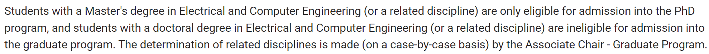
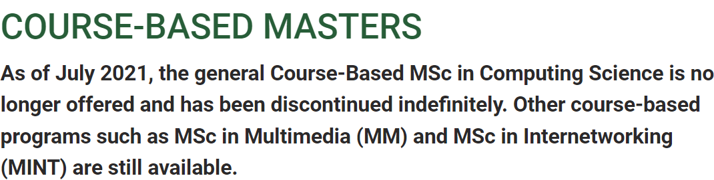

- [[The University of British Columbia]]
	- UBC 硕士需要读两年，有16个月的硕士和两年的硕士两种，但是两种都能拿到三年工签，而一年硕士只能拿到一年的工签
- [[University of Alberta]]
	- https://www.ualberta.ca/graduate-programs/electrical-and-computer-engineering.html 已经有Meng相关专业的硕士学历只能申请博士；
	  collapsed:: true
		- 
		-
	- https://www.ualberta.ca/computing-science/graduate-studies/programs-and-admissions/msc-program/index.html course-based master当中只有网络工程可以申请，CS则被永久取消；
	  collapsed:: true
		- 
		-
-