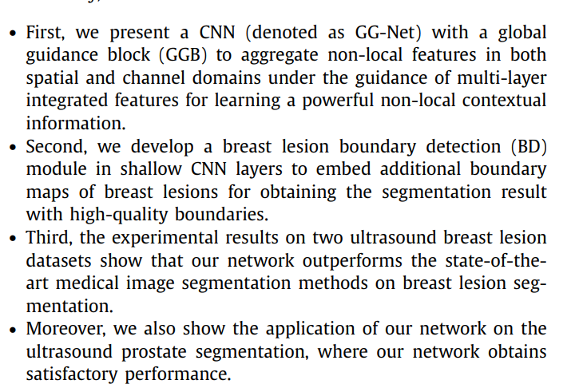
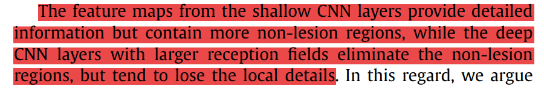

- 
	- 论文的核心创新点是使用GCB模块来聚合non-local的信息，用于捕捉上下文和长距离依赖
	- 使用辅助任务使得模型能关注到边缘信息
	- 在公开和本地两个数据集上进行测试
	- 在其他领域的超声分割数据（这里是前列腺分割）上进行测试
- 
	- Unet的浅层包含细节信息但是更多的是关于非肿块区域的，而深层次特征图去除了非肿块区域但丢失了细节信息
	- 思考：
		- 将Unet前两个浅层的信息进行整合得到特征图A，将后两个深层的信息进行整合得到特征图B，然后特征图A再整合进整合图B得到特征图C（A的信息应该要比B的信息占比少），利用C通过“卷积-池化-相减”的方式来增加边缘的分割输出，同时利用C来进行分类。C的理想结果应该是 全部的分割范围 + 一小部分的周围组织。
- 边缘思考：
	- 【1】对“卷积-池化-相减”的这个过程进行改进？
		- 参考像Canny这样的边缘检测算子等传统算法，然后将过程试图合并到卷积过程中？但是Canny算法明显本身就过于复杂？
	- 【2】直接使用单独卷积预测边缘的方法存在什么缺陷？
		- 必须要求原始的特征图就已经包含边缘信息了，所以是否可以先对原始图片进行形态学等边缘操作，然后再利用普通的卷积层来预测边缘，作为预测边缘的一个分支
	- 【3】从分割结果中和从mask中提取边缘，然后增加一个边缘的损失约束，这种方法是不是更简单？
		- 边缘损失有看到利用mse，也有利用交叉熵的，所以需要使用加权的吗？
	- 【4】如何使用像素差分网络？
		- 因为pixel difference network会检测出所有的边缘，如果要使用它，必须要保证没有超声图像自身各种边缘的干扰，所以能不能在预测的mask附近增加一定的长度和宽度，然后用这个extended_mask在原图中提取roi，然后再使用像素差分网络进行边缘检测？这时候的边缘仍然可能是多个，所以要怎么去除？或者说只把这个边缘信息加到分类信息就行了，而不用预测边缘结果？
	- 【5】如何使得预测的边缘具有多尺度信息？
		- 可以转变成“卷积-ASPP-池化-相减”流程或者“ASPP-卷积-池化-相减”
		- 从Unet的不同尺度预测对应的边缘？
	- 【6】不预测边缘，就不能使得模型增加边缘信息吗？不能用其他的任务或者模型结构来获取边缘信息吗？
		- 借助graph convolution有办法获取边缘相关的信息吗？
- 