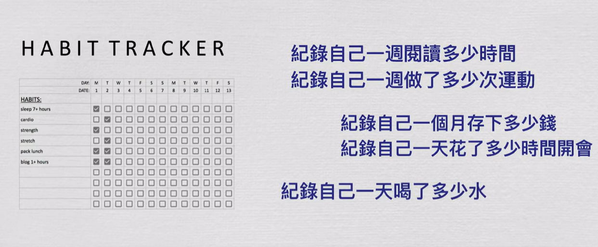

- 🦪记录一些有趣的新习惯，进行尝试并写下该习惯对自己的改变
	- TODO 把手机放在远离床头的位置 #habit-tracker
	- TODO 限制自己刷社交媒体的时间每次不超过30min #habit-tracker
	  collapsed:: true
	  :LOGBOOK:
	  CLOCK: [2023-01-07 Sat 22:18:43]--[2023-01-07 Sat 22:18:45] =>  00:00:02
	  :END:
		- [[SocialMediaManager]]
	- DONE 睡前30min记得关闭或者降低蓝光 #habit-tracker
		- 
		-
	- TODO 经常性跟陌生人打招呼
	- TODO 对失败的经历也要学会[[Gratitude]]
	-
-
-