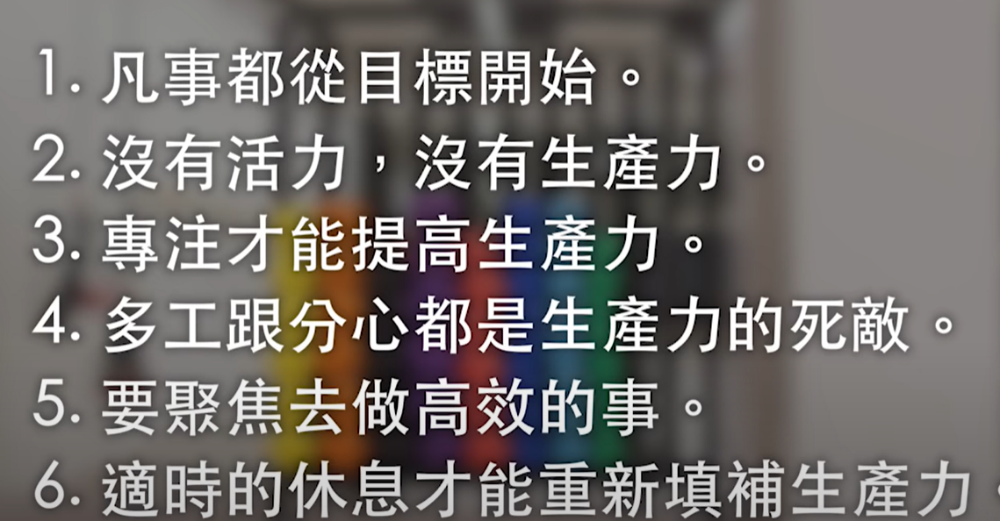

- {{youtube https://www.youtube.com/watch?v=_aAxScbkT14}}
	- [[HabitCandy]][[BrendonBurchard]]
		- [[高效(HighPerformance)]]和[[忙碌(Busy)]]的区别？
			- [[高效(HighPerformance)]]人士能够[[持续不断的产出好的结果]]，并且压力更少、更自信
		- [[高效(HighPerformance)]]人士有哪些好的习惯？
			- [[追求清晰度]]
				- 不止是目标的清晰，还有：[[WaitToBeAnswered]]
					- 你自己现在是一个什么样的人？
					- 未来你想要成为什么样的自己？
					- 无论是工作还是生活中，哪些事情对你来说是真的有意义的？
					- 你要成为怎么样的自己？未来5年、10年想要成为什么样的人，是受人尊敬，还是有自信？还是能够有能力帮助别人？可以做想做的事而不用担心生活？
					- 你想拥有什么样的能力？是能拍出令人感动的照片、流利的英文、读懂艰难的技术文档？
				- 把这些问题变成日常的一部分，不断反复问自己，直到这个答案变得越来越清晰
			- [[维持活力]]
				- [[产量]]和[[产能]]要维持平衡
					- 对于人，[[产能]]就是人的身体，人要有活力必须在身体上、心智上还有情绪上都维持精力
						- 身体上，要有充足的睡眠，要吃营养健康的食物
						- 心智上，要培养正面思考的能力
						- 情绪上，要有意识地去检视当下的情绪
							- 场所发生转换时，心情往往来不及转化，会把上一个场所的情绪带到下一个场所
							- 每当进入一个场所时，比如进入办公场所，要思考以什么样的情绪进入
			- [[提升必要性]]
				- 找到做某件事的热情，就会让这件事本身拉着你向前，而不是被动向前
					- 从优秀到卓越需要3个条件：[[做擅长的事]]、[[做能够获利的事]]、[[做有热情的事]]
					- [[必要性]]可能包括：为了亲人、为了小孩、[[改变环境的决心]]
			- [[扩充生产力]]
				- 
			- [[累积影响力]]
				- [[协助周围人的成长]]
				- [[感谢他人的帮助]]
			- [[展现勇气]]
				- 要持续的去学习解决新的问题，因为解决的新问题越多，你就对自己越有信心，你面对不确定情况也就越会有勇气
				- [[勇气(Courage)]]到底是什么呢?
					- [[忠于自我]] 勇敢地向不适合自己的东西说不、勇于说出自己的想法
					- [[做更好的自己]] 不要让自己在舒适圈待的太久，要继续挑战自己的极限，发挥自己的潜能
					- [[抛开恐惧]] 不要害怕承担责任、不要担心自己做不到，因为越是勇敢的去做，就越是能获得更多的经验
						- 
				-
		-