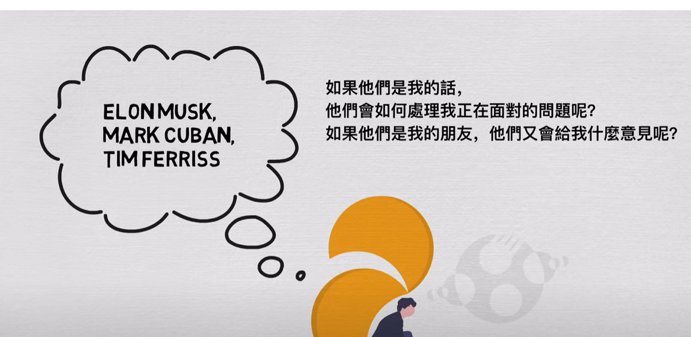

- .🍬管理自己的身份认同
  collapsed:: true
	- 我可以是一个爱运动的人
	- 我可以是一个能早起的人
	- 我可以是一个受欢迎的人
	- 我可以是一个爱干净的人
	- 我可以是一个学习能力超强的人
	- 我可以是一个动手能力超强的人
	- 我可以是一个十分专注的人
	- 我可以是一个细心的人
	- 我可以是能赚到很多钱的人
	- 我可以是唱歌不跑调的人
	- 我可以是一个掌控时间的人
	- 我可以是个口头表达能力超强的人
	- 我可以是能够同时学习多国语言的人
	- 我可以说摆脱上瘾症的人
	- 我可以是有独特见解的人
	- 我可以是能写出打动别人文字的人
	- 我可以是坚持到底的人
	- 我可以是能写出绝密推理小说或者剧本的人
	- 我可以是解决重大难题的理论学家
	- 我可以是解决实际问题一流的工程leader
	- 我可以是通过风投赚钱的人
	- 我可以是结识大佬的人
	- 我可以是创意无限的人
	- 我可以是突破职业发展瓶颈的人
	- 我可以是个露脸的自媒体博主
- ⚽ 可以证明自己就是自己想要成为的那个人
- 🎻如果我是大佬，该怎么解决我的问题呢？
  collapsed:: true
	- 
	-
-
-