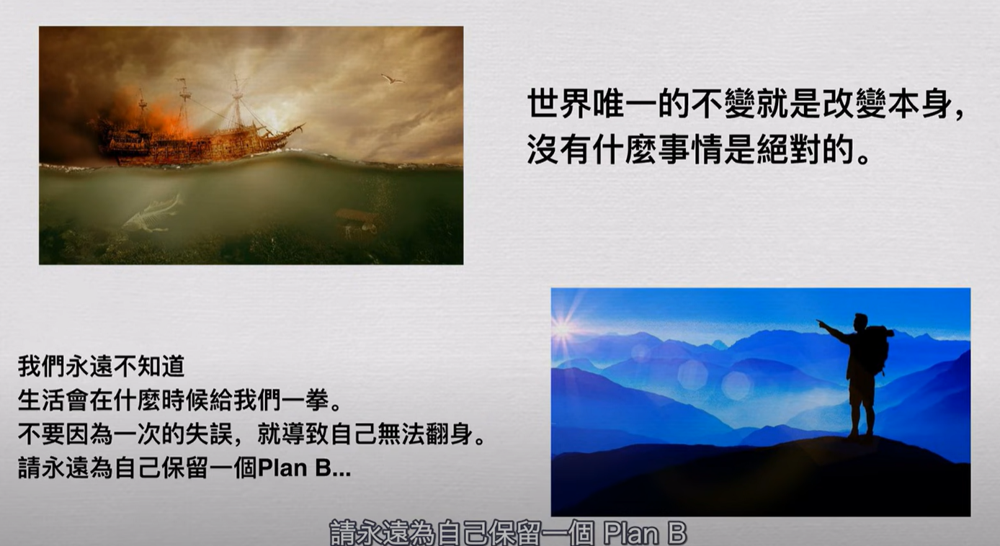
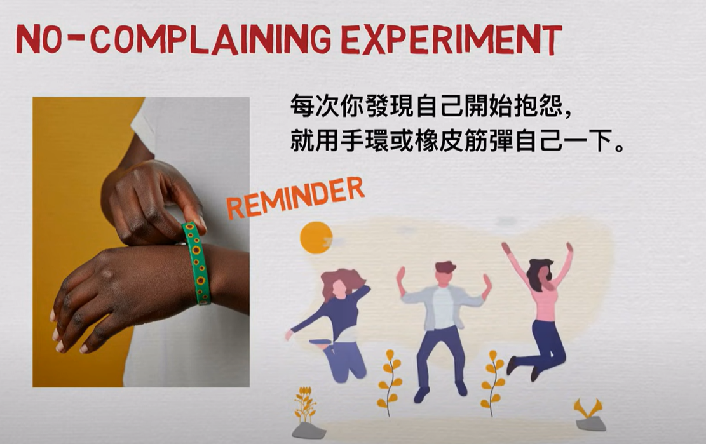
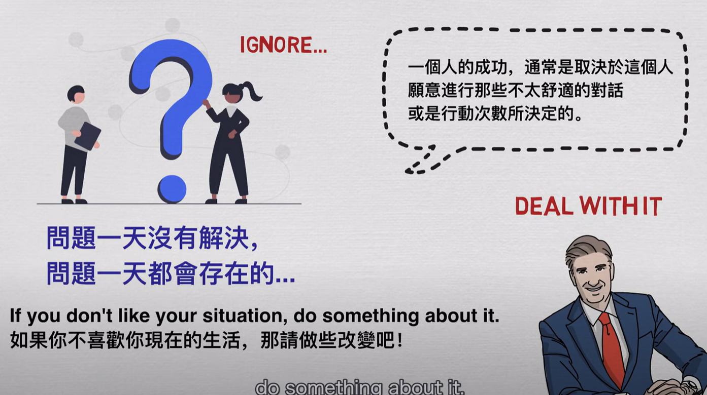
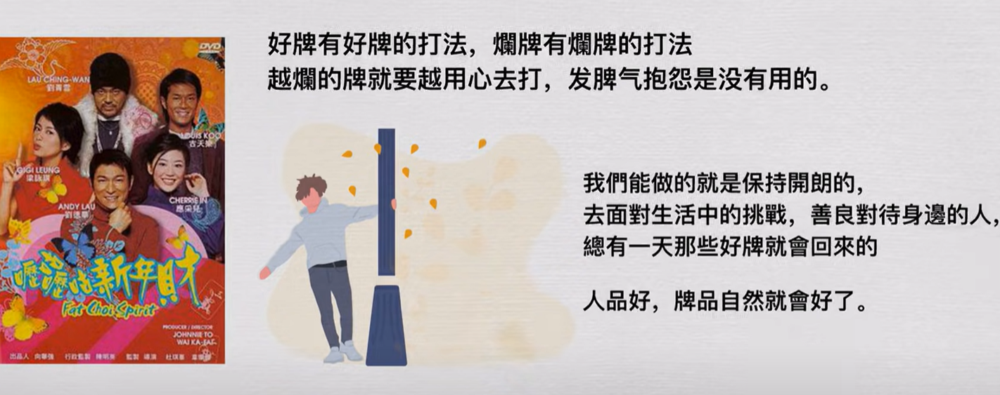

- 创新可以大幅超前现实世界，但是利用创新来进行创业时，创新不能过度破坏人们已经形成的习惯，否则难以被用户接受，最终会面临破产的命运
- 创新之所以难，是因为进行创新实验会面临很多风险，也会花费一笔不菲的成本
- {{youtube https://www.youtube.com/watch?v=5yVMIIhRWWA}}
	- 思维1：控制好风险 [[RishManagement]]
		- 
		- [[量化]]风险的一个方式是：假如该任务完全失败，则需要几个月才能弥补造成的损失？如果在五六个月以内，则可以尝试；如果多达一年及以上，则果断放弃。
		- [[测试]]风险的一个方式是：追问自己在现有的条件下，如何节省更多的钱？可以从创业的办公设备（可不可以不租门面，在出租屋内办公；在线合作办公）、人力资源（是否可以请家人和朋友帮忙）、筹钱（通过打造自己的宣传品牌，也就是自媒体账号等，卖广告流量来赚钱）这三个方面思考。
		- 为风险做出[[准备]]的方式是：提前攒够一笔钱，以及为自己设定PlanB，以便能够在计划失败时不至于彻底走投无路。
	- 思维2：负起责任，主动面对现实的挑战 [[GetItDone]][[HandleItSolveIt]]
		- [[SolutionNotes]]
			- Q: 如何提醒自己停止抱怨？
			  collapsed:: true
				- A：
					- 
		- 在公司里主动承担更大责任的项目，是在培养自己对抗风险的能力
		- 要想法设法地解决问题，即便是花费额外的金钱
		  collapsed:: true
			- 
			- 
			-