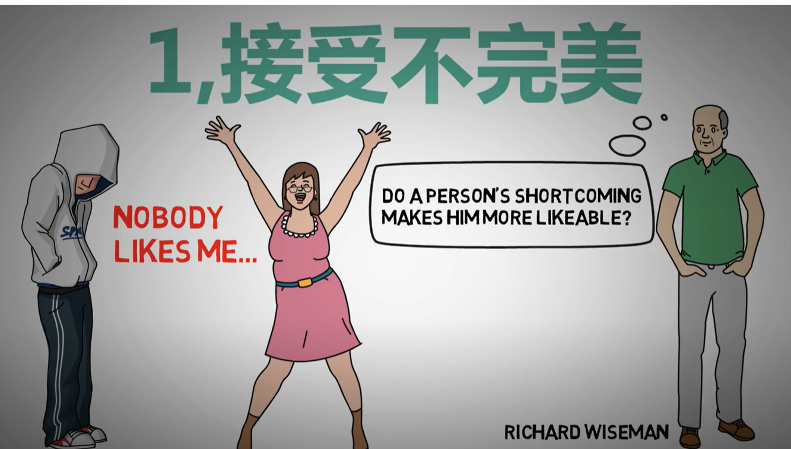
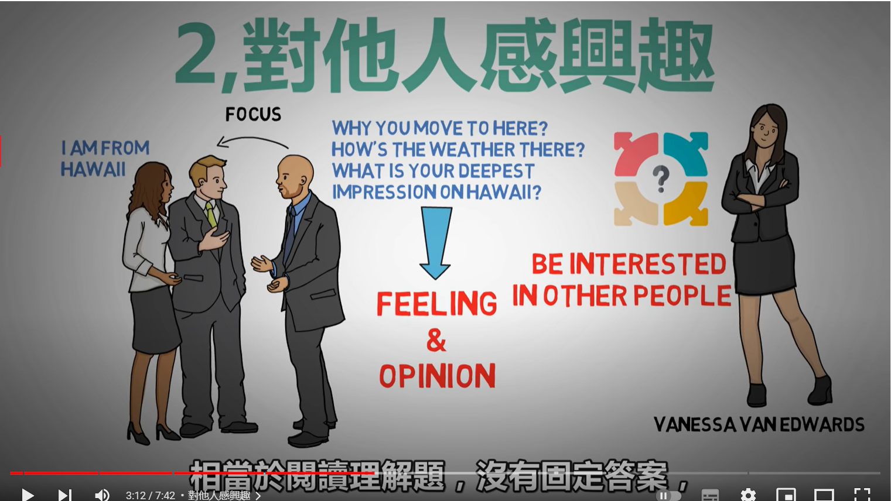
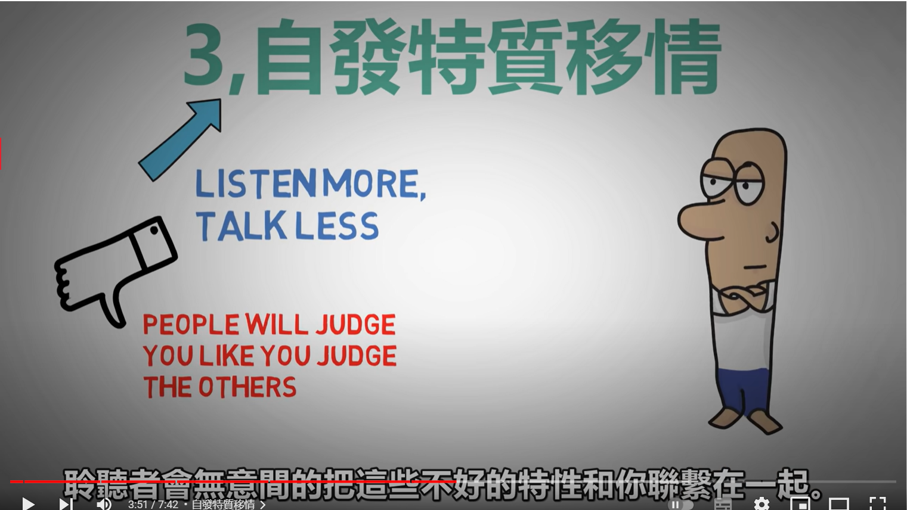
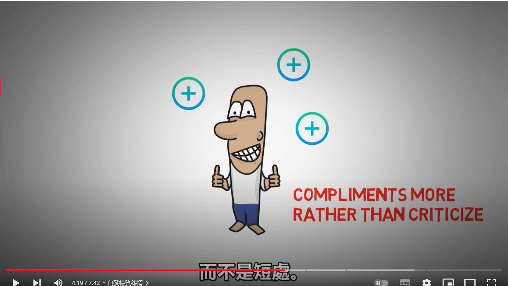
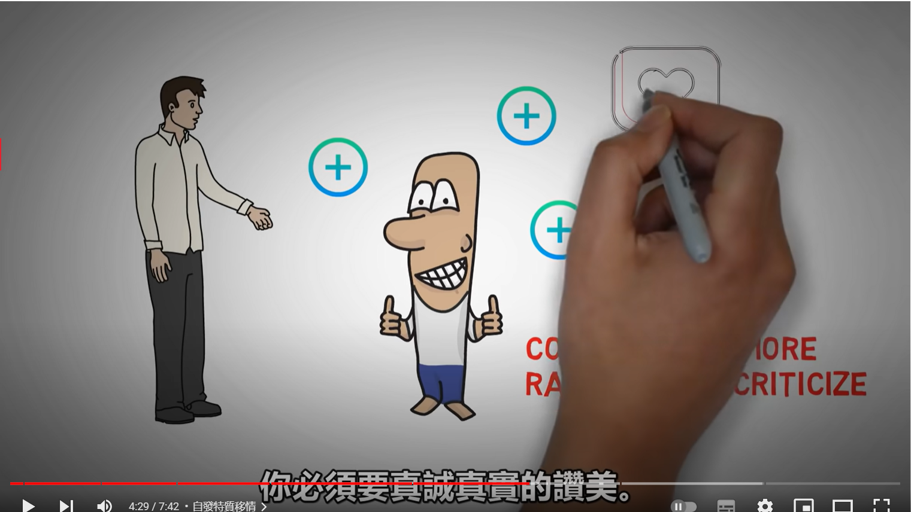
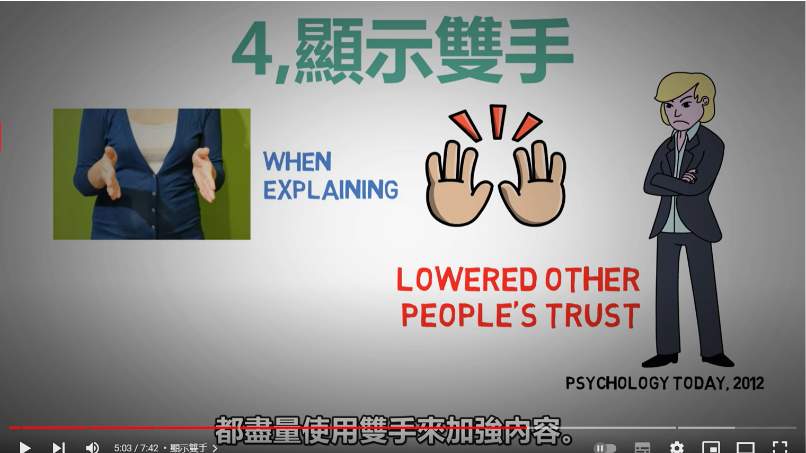
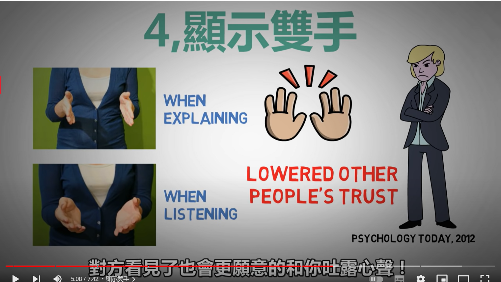
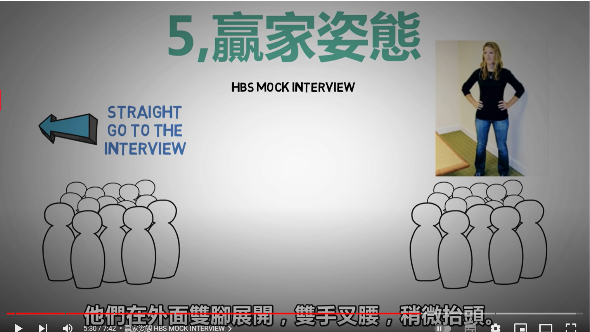
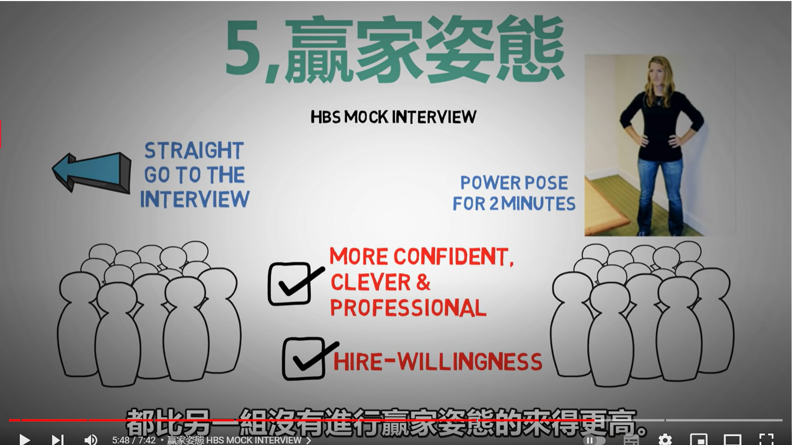
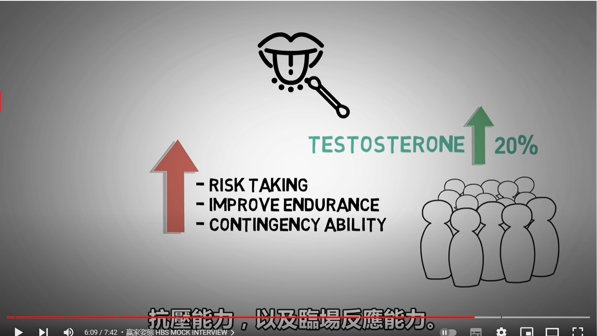

- {{youtube https://www.youtube.com/watch?v=HCiqj0qGjpA}}
	- [[接受不完美]] 不用隐藏不完美之处，反而这些不完美之处更容易引起共鸣，让大家觉得亲近
	  collapsed:: true
		- 
		-
	- [[对他人表现出兴趣]]
	  collapsed:: true
		- 
	- [[自发特质移情]]
	  collapsed:: true
		- 
		- 
		- 
		- 
		-
	- [[显示双手]]
	  collapsed:: true
		- 
		- 
		-
	- [[赢家姿态]][[睾丸素]]
	  collapsed:: true
		- 
		- 
		- 
		-
-
-
- 向别人 [[Marketing]]自己，其实是结交新朋友的有效方式
-
- 什么时候我们会选择[[隐藏秘密]]？
  collapsed:: true
	- 害怕损害[[个人形象]]
		- 也就是怕别人看到你更真实的一面会讨厌你
	- 害怕破坏[[与别人的关系]]
	- 害怕[[伤害别人]]
-
- 如何才能在[[聊天]]时聊到对方心坎里去？ [[ExpressionSkills]]
  collapsed:: true
	- [[被动式]]
	  collapsed:: true
		- 即使意见不同，也尊重对方有发言权
		  collapsed:: true
			- 最重要的是要有[[不说话]]的时刻：
			  collapsed:: true
				- [[聆听(Listening)]] ：[[尊重]]就是为对方打开自己的耳朵，人生中的智慧大多来自于聆听，而后悔大多来自于[[发言]]，所以在对话过程中有时候不说话比说话更重要
				-
				-
			-
		- 与对方产生[[共感]]
		  collapsed:: true
			- [[你都不懂我在说什么]]就是因为缺乏[[共感]]而导致的[[误会]][[误解]]
			- [[$red]]==如何让对方感受到“你真的在乎他==”？
				- [[$green]]==让对方知道：你是真的感受到他正在经历的事情==，因为[[共感]]的[[含义]]就是[[$red]]==表示要切身地感受对方、认同对方==
			- 要将心比心、感受对方的方式有很多种，但记得是要有[[同理心]]而不是[[同情心]]
			-
		- 要适时地回应对方
		  collapsed:: true
			- 可以借鉴[[聊天主持人]]的技巧：
				- 说一次：就是少说些，
				- 听两次：就是多听点
				- [[附和]]三次：就是多给予聊天对象正面的[[回馈]]
			- 只要不会让对方感到压力的话，看着对方的眼睛去听他说话
				- 一来使得我会更加投入到对话当中，再来是会给对方[[我有在听]]的意思
			- 在聊天过程中不时的：
				- 点头
				- 如果对内容有好奇的地方会用“真的吗”、“然后呢”、“哎，这真有趣”来表达我感受到的情绪
				- 自然地让身体去表达你的情绪而不是隐藏，不是为了刻意地去[[讨好]]对方
				- 把自己的好奇心和笑点调低一些
	- [[主动式]]
	  collapsed:: true
		- 试着练习把话讲的更简短、让结构更简洁，原因有：
		  collapsed:: true
			- 很多说话场合不适合冗长的内容，比如上课时的心得报告、会议中的发言和简报，尽量去除不必要的描述，这样能让对方更快记住，也能传递你的[[专业形象]]
			- 减少别人[[反感]]的可能
				- 最好不要在别人不适合的时间点长篇大论，比如[[婚宴]]、[[早会]]、[[典礼]]开始前
			- 把话讲的简洁的[[技巧]]:
				- 把重点整理在手机里，那么表达的时候就会更明确
				- 时间不够的话，练习抓[[关键字]]，然后记忆在脑子，在讲的时候就可以按关键字 [[回想]]与输出，那么整理[[关键字]]的话有哪些[[技巧]]呢？
					-
			-
		- 给人建议时要注意说法，不要随便批评别人
			- 不要认为自己的说法毫无缺陷，随便批评别人
			- 无论是自己主动还是别人请教，都要[[对事不对人]]
			- 可以[[指点]]，但不要[[指指点点]]，因为这样容易使问题脱离主题，进而变成人身攻击
			- 每个人都有[[指点]]别人的习惯，但是[[动嘴巴比动手要简单得多]]，所以这样会拉低自己的[[品格]]
			-
	- 总结：
		- 1.適當的沉默，反而能延續聊天內容
		  2.用同理心去感受對方經歷的事
		  3.用戶應來創造彼此的互動
		  4.把話說的簡短有力，去蕪存菁
		  5.不要批評別人，給建議是要對事不對人
		- [[$red]]==与人交谈不只是技术，也是态度。技术需要的是练习，态度需要的是体会。==
		-
-
-
- 如何构建朋友圈？
	- [[MyFriendsCircle]]
-
-
- 如何判断一个人说的到底是[[真实的]]还是[[虚假的]]？
	- 了解[[协商]]和 [[说服(Negotiate)]]的一些技巧，可能帮助你理解什么才是更加[[可信任的]]：
	  collapsed:: true
		- [[正面的杠杆]] 也就是[[我能给你带来什么帮助或者好处]]
		  collapsed:: true
			- 需要警惕别人[[预支承诺]]，因为这通常是一张无法兑现的[[空头支票]]
				- 比如“我会一直爱你”、“我永远不会欺骗你”，说这些并不是否认爱情或者友情等的可靠性，而是承认事情的复杂性和人的变化性，在爱的那些瞬间这些话的的确确是真的
				- 比如[[商业谈判]]中“如果你给我们这份订单的话，我们可以保证你将拥有我们最完善的产业链供应，也将与我们共享一部分人脉资源”
			- 一个更靠谱的做法是：给出[[此时]][[此地]]可以承诺的[[此事]]
				- 比如“我承诺在2023年的2月30日向你交付10万份我们的客户资料”
		- [[负面的杠杆]] 更像是一种威胁，就是[[如果你配合我完成XXX， 我就不会对你YYY，否则我就会剥夺你ZZZ]]
		  collapsed:: true
			- [[负向的表述]] 通常没有 [[正向的表述]] 靠谱
				- 也就是说“我不会向你撒谎”不如“我会对你诚实”、“我不会依赖和纠缠你了”不如“我会和你保持适当的距离，给你空间和自由”
				- 这是因为[[负向的表述]]并不一定是[[正向的]]意思，[[#red]]==比如“我不会伤害你”并不等同于“我会善待你”、“我不会欺骗你”并不等同于“我会把真相和事实告诉你”，“我不会怨恨你”并不等同于“我会好好爱你”==。 [[负向的表述]] 可能会让你在[[认知的连接]]方面理解成[[正向的]]，但通常未必是[[客观的事实]]
					- [[正向的表述]] 就是 明确告诉对方我要做什么事情
					- 大国外交的领导人擅长[[交替使用]] [[负向的表述]] 和 [[正向的表述]]，而这些往往都不靠谱
			- [[不恰当的怒气]]
				- 突然就发飙的人 利用情绪来 刺激我们的 [[杏仁核]]，逼迫我们做出[[非理性的]]决策
				- 跟任何人谈事情，如果对方有[[突然性的]][[情绪]]和[[暴怒]]时，那么我们宁可[[不置可否]]也不说话，木然地看着对方，一定要等待对方情绪好转之后再继续谈
		- [[道德的杠杆]] 最直白的意思就是，[[你必须是个好人]]
			- [[调包]] 是一种常见的手段，会把我们无意识变成道德的[[被谴责方]]
			  collapsed:: true
				- 比如“一个女大学生白天在学校上课，晚上去酒店陪酒”、和“一个没钱付学费的女孩晚上去酒店陪酒赚钱，白天去学校上课”，两种表述带来的结果完全不一样
				- 好好重新审视下自己的认知（包括对自我的固有印象），看看自己的哪些认知可能会被利用，通常是与[[对方的私心]]进行连接：
				  collapsed:: true
					- 比如“自己就必须是一个好哥哥或者好姐姐吗？”
					-
			- [[品格证词]]
				- 诸如[[认识我的朋友都值得我不会做这种事]]、[[熟悉我的朋友都觉得我不可能做这种事]]都是用他人对自己的 [[品格证词]] 调包了 [[他真的将要面对的问题]]
					- 还有[[我是基督徒耶，你怎么可以怀疑我]][[我是素食主义者耶，你怎么可以怀疑我]]
					- 还有[[某某诺贝尔奖得主他的某个观点是XXX]]、[[某某大学教授他说的话就是对的]]，我们必须秉持的观点是[[一个人学历高仅仅能够说明一件事，代表他有能力能够取得那个学位，不等于他的判断力就是正确的，也不等同于他就是个道德高尚的人，这些都需要切开来看]]
					-
	- 要学会理解对方[[不真的]]地方，不要着急戳破对方，而是要试着用一种[[圆满的方式]]来为别人指出一条不伤害他面子同时可执行的方法，要学会创造一种[[防卫可以被卸下来的]]的[[共识]]
	- 每个人都可能或多或少存在[[不真的]]地方，但这并不代表着我们自己就是一个坏人了，所以要适当理解别人的不真实
	- [[人生的圆满]]不在于[[证明自己是对的而别人是错的]]，而是要[[学会合作]]
	  collapsed:: true
		- [[要看在眼里、想在脑里、听到耳里、体会在心里，但是嘴巴上要卸除对方的防御，好好地走向彼此都能接受的地方]]
		- [[达成共识是我们每个现代人必须要好好学习的能力]]
		- [[只要是人，下意识地都会保护自己]][[你要永远都能够看懂听懂对方的讯息，还有对方讯息背后的担心和防御，你才能下一步有效地透过好的问句、透过好的引导来化解对方的防御]]
	- 学会辨别的目的不是为了学习更多的话术去控制或者防御别人，而是要[[以创造更多信任的前提下与自己在乎的事情在乎的人好好合作]]
-
	-
	-
- {{youtube https://www.youtube.com/watch?v=PrstHf-U76s}}
	- 为什么你的[[反应(Reaction)]]很重要？
		- 因为你对一件事的 [[反应(Reaction)]]，展现出来的是你自己的[[心里界限]]，而[[心里界限]] 决定了别人可以对你做什么、不可以对你做什么
	- 对事情正确的 [[反应(Reaction)]]态度是什么呢？
		- 你得首先确定这件事是否重要：
			- 如果是不重要的办公室打嘴炮、无聊的人所做的无聊的事，那么可以[[不反应(NoReaction)]]，因为 [[不反应(NoReaction)]]本身也是一种 [[反应(Reaction)]]，代表了你对这件事的态度就是不在乎
				- 对于想要激怒你、打压你的人或者无法妥协的事情，最好的态度就是 [[不反应(NoReaction)]]
			- 如果这件事是关于升职、换老板等重要的事，一点要[[有所反应]]，来展现出你的[[进取心]]和[[思考力]]
	-
-
- 如何才能在对话中[[制造话题]]？
	- https://www.youtube.com/watch?v=likmLBp7u-s
-
-
-
- 如何让别人觉得你[[很好聊]]？
	- 人际相处有一个[[镜像法则]]：我们会倾向与我们更相似的人，进行更多的相处和[[互动]]
		- 有人会尝试  模仿他人的语气、行为和动作，但是这存在的问题是：
			- 对方无法判断你的模仿是一种[[嘲笑]]，还是出于一种[[友好]]。也就是说，对方无法判断你的意图是好是坏
		- 可以使用[[语言回应镜像]]：
			- 也就是[[重复确认]]一遍对方的话，比如速食店的服务人员会重新说一遍你点的餐食可以让你获得更多的[[安全感]]
			- 其目的就是使得别人能够知道自己被[[听到]]、[[听懂]]，一定要去[[接住别人的话]][[接对方]]，因为这会给别人带来 [[确定感)(certainty)]]
			- 注意容易陷入[[卖弄知识]]的误区，比如别人说“今天天气很热”，你回答到“今天天气很热是由湿气造成的”，此时不妨可以说“对啊，真的好热，我想我们这因为天气更湿的关系，所以感觉起来会更热”。必须要知道的一个[[真相]]是，[[正确]]在[[人际关系]]里面未必是有用的，所以最好让自己的[[知识]]成为别人可以收的下来的[[礼物(Present)]]
		- [[聊天]]是建立[[信任网络]]的一个最直接的方式，所以聊天中不要只有你自己，要尊重对方的感受：
			- 比如“我好难过”，“如果我是你，我也会有同样的感觉，一样会感到很难过”
			- 一定要明确：自己是在想聊天呢，还是[[你想要证明自己很厉害呢]]。虽然可能有时候你没有这个意思，但是对方的感受就是如此
		-
		-
		-
		-
- 如何让自己的心不再那么[[疲惫]]？
	- 可能会存在[[绝对共存]]的[[信念]]或者说[[心理状态]]：把[[他人的需求]]置于[[自己的需求]]之上
	  collapsed:: true
		- 常见的表现有：
			- 过度干涉、[[自我牺牲]]、别人如果不接受自己的帮忙和建议那么他的自我感受和自我评价就会是很低的、强迫别人接受自己的关心、[[亲密关系]]中一方眼中只有自己的伴侣而没有了其他的任何东西、过分保护的父母、[[便利贴男孩]]和[[便利贴女孩]]
		- 当这种信念发展到一种极致时，会出现[[扭曲]]：别人就算烂在那里也不要找除了我以为的其他人帮忙
		- 简单概括的话，这类人自己的情绪是建立在别人的行为之上的，也就是别人做了什么会让他开心、别人不做什么会让他不开心
		- 其问题在于：
			- 没有去伸张自己存在的价值和意义，或者把自己的价值建立在别人如何对你或者在别人心中是否重要，而不是首先去认定自己重不重要。[[绝对共存]]的[[绝对]]是问题，[[共存]]本身并没有问题
			- 他会忘记自己是谁、忘记此时此刻最重要的事，这导致其付出的努力一样也没有少，但是却也一样也得不到
			-
			-
		-
		-
		-
	- 如何解决[[绝对共存]]导致的“我为啥吃力不讨好、为啥如此辛苦”？
		- [[要学会去确认自己的处境]]
			- 要学着去确认自己的时间、环境、还有自己正在相处的人。特别是关于[[相处的人]]，要有意识地判断出谁正在使用[[控制(Control)]]的手法，要把其中[[控制(Control)]]的部分给标记出来;
		- [[明确什么是可以的，什么是不可以的]]
			- 要明确哪些要求和控制 是你可以接受的，具体到[[程度]]和[[限度]]，比如朋友跟你借钱，你就可以限定额度在3w以内，超过3w可以给别人介绍银行资源；
		- [[爱自己]]
			- 从小地方开始给自己力量，练习[[如果怎样就怎样]]的句型，也就是练习[[前提]]和[[行为]]的[[思维模式]]，用[[条件式]]的[[内在语言]]和[[外在语言]]来武装自己：
				- [[如果福福超过24h对我没有任何回复，那么就一周内都不会再主动给他提供情绪价值，也不会对他说的话做出任何回应]]
				- [[如果福福的确在精神和物质上都不愿付出，那么我也就拒绝他对我的要求]]
-