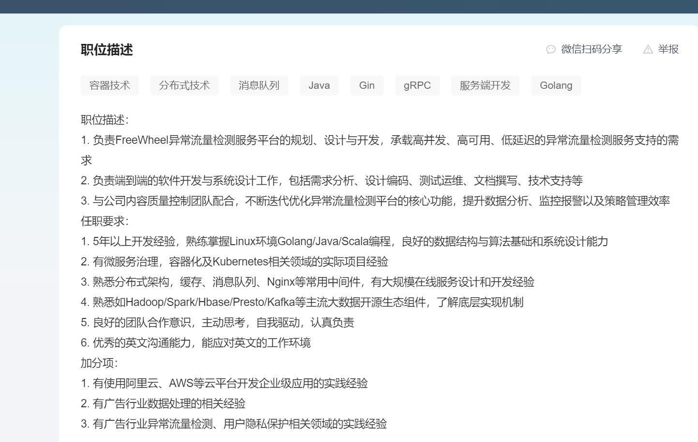
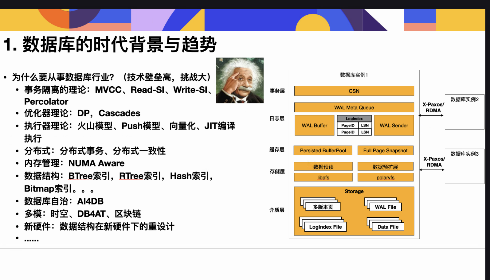
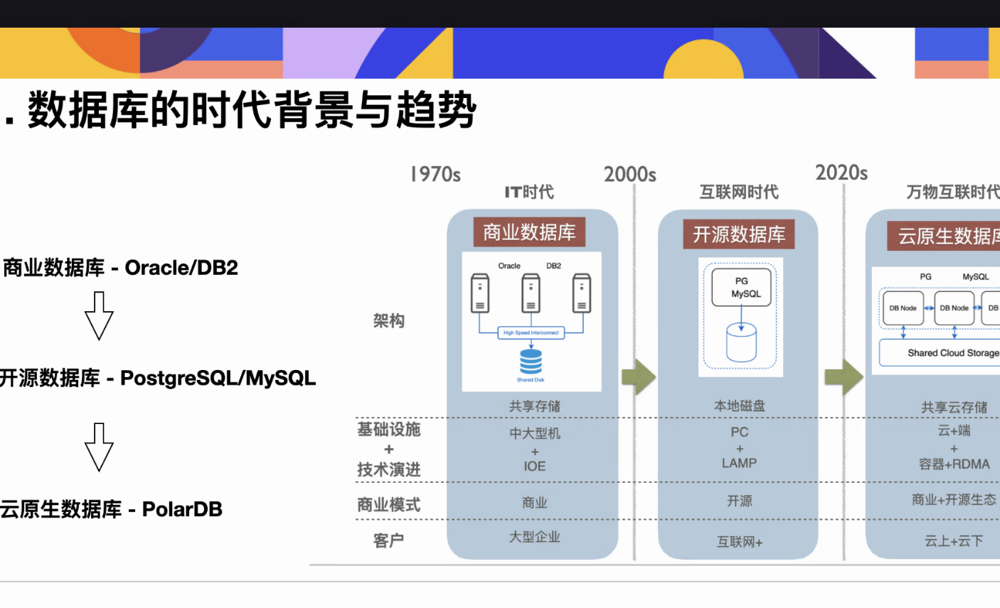
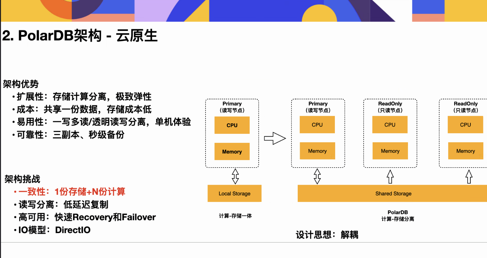
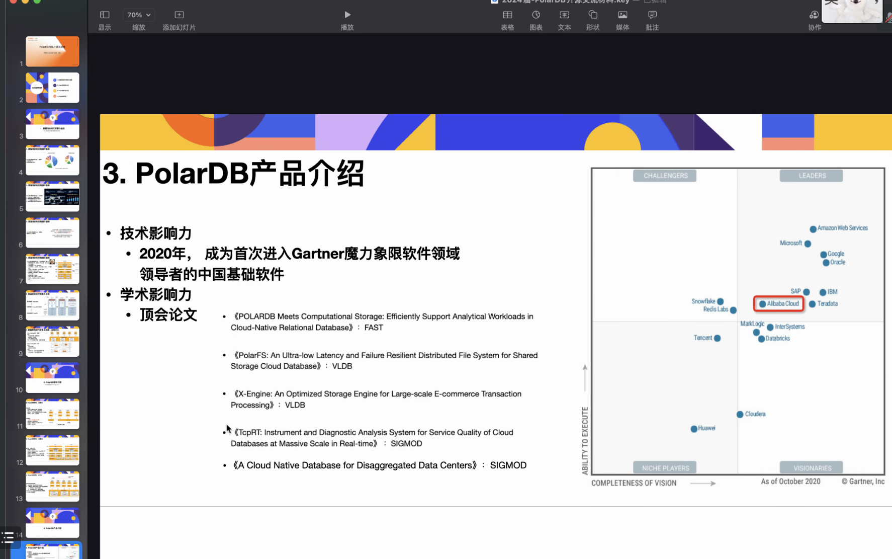
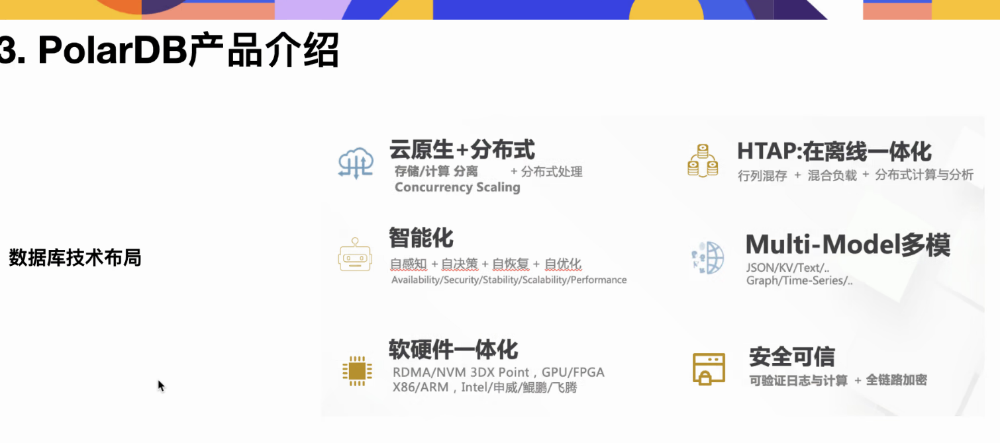
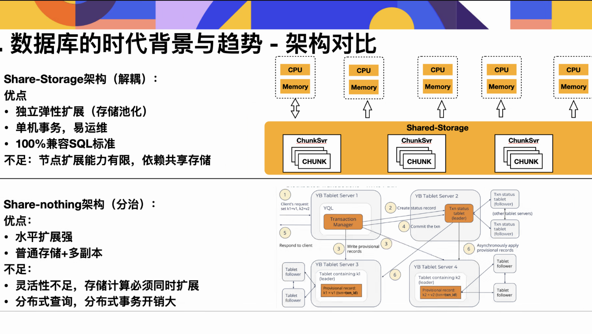

- [[ConceptDefinition]]
  collapsed:: true
	- 两方和三方：
	- 洽谈：
- [[Websites]]
  collapsed:: true
	- 牛客网
	- freelancer
		- https://www.freelancer.com/
		- https://www.upwork.com/freelance-jobs/
	- fiverr
		- https://www.fiverr.com/
- [[PhdSearch]]
  collapsed:: true
	- Find a PhD
	- EURAXESS
	- 小木虫
- Java:
  collapsed:: true
	- 重点就是Java se    spring  spring mvc
	  MySQL  mybatis 是数据库重点
	  Redis是中间件重点
	  还有就是任意一个mq是中间件重点
	-
	- 我是半路出家，在培训班出来的，培训班的课程安排是这样的
	  JavaSE ——> MySQL ——> JDBC ——> JavaWeb ——> Spring5 ——> SpringMVC ——> MyBatis--> Maven ——> Ssm框架整合案例 ——> Git/GitHub ——> Redis6 ——> MySQL高级优化 ——> MyBatisPlus ——> Spring注解驱动开发 ——> ZooKeeper ——> Dubbo ——> 消息中间件ActiveMQ ——> RabbitMQ ——>RocketMQ ——>SpringBoot2 ——> SpringCloud ——> 实战项目
	-
	- 小林图解主要讲一些重点知识，更细节的mysql，比较推荐看《mysql是怎么运行》这本书
	-
	- 八股文：
		- [【面试精选】美团大佬带你一周刷完Java面试八股文，比啃书效果好多了！_哔哩哔哩_bilibili](https://www.bilibili.com/video/BV1eD4y1w7Rp/?spm_id_from=333.1007.tianma.2-1-3.click&vd_source=f420feddc90c88f1b9b9f8da3fc2194b)
		- [【面试精选】成功上岸！！字节大佬带你一周刷完Java高频面试八股文，比啃书效果好多了！！_哔哩哔哩_bilibili](https://www.bilibili.com/video/BV1jg4y1p7wH/?spm_id_from=333.1007.tianma.3-3-7.click&vd_source=f420feddc90c88f1b9b9f8da3fc2194b)
		- 各种pdf：
			- [知识星球 | 深度连接铁杆粉丝，运营高品质社群，知识变现的工具 (zsxq.com)](https://wx.zsxq.com/dweb2/index/files)
			- JAVA GUIDE:
				- [Java 面试指南 | JavaGuide(Java面试+学习指南)](https://javaguide.cn/)
	- 代码随想录刷题：
		- [📚星球问答图谱 (zsxq.com)](https://articles.zsxq.com/id_th0rdvb3xz1e.html)
	- 牛客网的项目：
		- [课程列表_牛客网 (nowcoder.com)](https://www.nowcoder.com/study/live/246?headNav=www)
	-
	- 待学习知识清单：
	  collapsed:: true
		- TODO MySql系列
			- https://github.com/CyC2018/CS-Notes/blob/master/notes/MySQL.md
		-
	- [[面试题]]
		- 待学习知识清单：
		  collapsed:: true
			- TODO MySql系列
				- https://github.com/CyC2018/CS-Notes/blob/master/notes/MySQL.md
- [[Companies]]
  collapsed:: true
	- [[freewheel]]
	  collapsed:: true
		- 
		-
	- [[唯品会]]
	- [[快手]]
- [[数据库]][[PolarDB]]
  collapsed:: true
	- 
	- 综合了计算层面和存储层面
	- 
	-
	- [[云原生数据库]]
		- 
		- 
		- 
	- [[分布式数据库]]
		- 
		- 计算和存储解耦，可以分别扩展；
		-
- [[求职过程]]
	- [[抽奖系统]]
	- [[Spring源码]]
	- [[Resume]]
	  collapsed:: true
		- 组成部分：
			- 教育经历
			- 自我评价
			- 项目经历
				- 项目描述
				- 主要工作
				- 项目难点
				- 个人收获
			- 竞赛获奖  获奖经历
			- 专业技能
			  collapsed:: true
				- 技术文档写作能力：编程博客
			- 其他能力
		- 参考：
			- [FnEAODMCz6BFFP2FhvOYbpiVjsG7 (750×1063) (zsxq.com)](https://images.zsxq.com/FnEAODMCz6BFFP2FhvOYbpiVjsG7?imageMogr2/auto-orient/thumbnail/750x/format/jpg/blur/1x0/quality/75&e=1682870399&token=kIxbL07-8jAj8w1n4s9zv64FuZZNEATmlU_Vm6zD:5KrfRio1mc0BKckm9RJ8vtHKRNo=)
				- 把奖项和教育经历写在了一起
			- {:height 912, :width 746}
		- 总结一下JAVA中的技术重点：
		  collapsed:: true
			- RPC、MQ
			- Reddis的数据结构
			- MySql中的索引
			- 动态代理静态代理
			- 如何才能和面试官就项目能够聊得起来
			- spring的一整套体系：springMVC、SSM
			- spring源码中的重点知识：包括三级缓存到底是怎么实现的
			- 四大引用
			-
		- 项目描述：
		  collapsed:: true
			- 项目描述：数字钼靶技术因其低成本和高敏感性而成为乳腺癌筛查的首选手段，依据临床经验，**尺寸更小、分布密集且形状光滑的钙化区域是恶性的，相反则是良性的**。目前的研究方法仍然是**基于特征工程的传统机器学习**算法，但性能不佳。项目的目标是：设计出中一种**简单高效**的算法。
			  项目难点：特征工程部分包括**提取形态学和一阶统计学特征、特征归一化、特征降维**这三个部分，因为涉及对矩阵的复杂数学运算，所以**耗时长**；
			  不同病人的乳腺钙化点**成像数据具有较大的方差**；
			  工作和收获：
			- 使用python的pyradiomics工具来替代matlab进行传统算法的实现，增加了多尺度的钙化点拓扑特征提取，同时**解决了该库在提取二维医学图像和mask的特征时遇到的问题**（解决办法在本人的原创博客中共计收获了45个收藏）；
			- 设计了一种基于**多组相似性解码的策略**，用于**在全连接层集成**resnet18和densenet121模型，在测试集上达到了83.72%的准确率，目前论文仍然在投稿中
			-
			- 实验室科研项目：基于微钙化点的乳腺癌良恶性分类算法研究
		- [工作3_5年架构师简历模板【小傅哥】.pdf](file:///D:/AllExploreDownloads/Chrome/%E5%B7%A5%E4%BD%9C3_5%E5%B9%B4%E6%9E%B6%E6%9E%84%E5%B8%88%E7%AE%80%E5%8E%86%E6%A8%A1%E6%9D%BF%E3%80%90%E5%B0%8F%E5%82%85%E5%93%A5%E3%80%91.pdf)
		- https://blog.csdn.net/good18Levin
	- [[投递简历]]
	  collapsed:: true
		- [[方法论]]
		  collapsed:: true
			- 找人内推或者在官网上直接投递
				- 可以联系HR修改自己的简历
				- 需要准备一份英文简历
				- 需要明确该公司可以投递的部门、意愿的个数、暑期实习和秋招是否存在矛盾或者冲突
				- 同一家公司不要找多个人同时进行内推
				- 注意投递时的岗位匹配，不要投到一个不匹配的岗位在填写申请表时浪费时间
				- 要安排好自己投递简历、面试准备、面试三者之间的时间冲突
			- 及时查看投递公司的初筛反馈
				- 可以通过官网查看
				- 可以通过公众号查看
				- 可以通过与HR的对话或者电话来知晓
			- 参加公司的线上或者线下笔试
				- 在群里可以集中收集关于笔试的注意事项
				- 在牛客里可以查看目标公司的面经
				- 注意手撕代码和ACM模式的准备
				-
				-
				-
		- [[已经投递的公司]]
		  collapsed:: true
			- DONE 阿里巴巴
			  collapsed:: true
			  :LOGBOOK:
			  CLOCK: [2023-03-21 Tue 15:40:42]--[2023-03-21 Tue 15:40:43] =>  00:00:01
			  :END:
				- [研发工程师JAVA (alibaba.com)](https://talent.alibaba.com/campus/position-detail?code=566CZq70UmmBavwebs_HhA%3D%3D&lang=zh&positionId=2014903)
				- 闲鱼技术部
				- [阿里巴巴集团招聘官网 (alibaba.com)](https://talent.alibaba.com/personal/campus-application?lang=zh)
			- TODO 阿里云
			- TODO 蚂蚁集团
			- TODO 小红书
			- DONE 美团
			  :LOGBOOK:
			  CLOCK: [2023-03-17 Fri 22:11:41]--[2023-03-17 Fri 22:33:15] =>  00:21:34
			  :END:
				- [个人中心 | 美团招聘 (meituan.com)](https://zhaopin.meituan.com/web/personalCenter/deliveryRecord)
			- TODO 字节跳动
			- TODO 微众银行
			- DONE 拼多多
			  :LOGBOOK:
			  CLOCK: [2023-03-17 Fri 22:09:22]--[2023-03-17 Fri 22:09:22] =>  00:00:00
			  :END:
				- [拼多多校园招聘 (pinduoduo.com)](https://careers.pinduoduo.com/campus/personal-center)
			- DONE 百度
			  collapsed:: true
			  :LOGBOOK:
			  CLOCK: [2023-03-17 Fri 22:10:15]--[2023-03-17 Fri 22:10:15] =>  00:00:00
			  :END:
				- [百度校园招聘 (baidu.com)](https://talent.baidu.com/jobs/)
			- TODO 携程
			- TODO freewheel
			- TODO ebay
			- TODO paypal
				- https://mp.weixin.qq.com/s/27ealHZThhmkqKTxmNvlhQ
			- TODO 蔚来
			- TODO 七牛云
			- DOING 华为
			  :LOGBOOK:
			  CLOCK: [2023-03-23 Thu 20:30:53]
			  :END:
				- DONE 华为南研所
				  collapsed:: true
				  :LOGBOOK:
				  CLOCK: [2023-03-23 Thu 20:30:54]--[2023-03-23 Thu 20:30:55] =>  00:00:01
				  :END:
					- https://career.huawei.com/reccampportal/portal5/appjob-campus.html
			- TODO shopee
			- TODO lambada
			- TODO zoom
			- DONE shein
			  collapsed:: true
			  :LOGBOOK:
			  CLOCK: [2023-03-17 Fri 23:25:33]--[2023-03-17 Fri 23:25:37] =>  00:00:04
			  :END:
				- 初筛中
				-
			- DONE 搜狐
			  :LOGBOOK:
			  CLOCK: [2023-03-18 Sat 00:16:58]--[2023-03-18 Sat 00:16:58] =>  00:00:00
			  :END:
				- [搜狐 - 社会招聘 (sohu.com)](https://hr.sohu.com/social-recruitment/sohu/43256#/)
			- TODO 同城旅行
			- TODO 得物
			- TODO 腾讯云智
			- TODO 58同城
			- TODO 广发银行
				- [中国人寿招聘官网 (hotjob.cn)](https://chinalife.hotjob.cn/wt/chinalife/web/index/CompchinalifePageindex)
			- TODO 招商银行
			- TODO 360
			- TODO 快手
			- DONE 搜狐畅游
			- TODO 去哪儿
			- TODO 小米
			- TODO 京东
			- TODO MOMENTA
			- TODO vivo
			- TODO 唯品会
			- TODO 菜鸟网络
			- TODO 快递公司
			- TODO 招银网络
			- DONE 腾讯音乐
			  collapsed:: true
			  :LOGBOOK:
			  CLOCK: [2023-03-21 Tue 16:08:34]--[2023-03-21 Tue 16:08:35] =>  00:00:01
			  :END:
				- [社会招聘 | 腾讯音乐娱乐招聘 (tencentmusic.com)](https://join.tencentmusic.com/social?job_class=T)
			- TODO 智联招聘上一家南京公司
			  :LOGBOOK:
			  CLOCK: [2023-03-21 Tue 22:36:16]
			  :END:
			- TODO 杭州微策略
			- DONE 招商银行  学校内推渠道
			  collapsed:: true
			  :LOGBOOK:
			  CLOCK: [2023-03-21 Tue 23:24:32]
			  CLOCK: [2023-03-21 Tue 23:24:34]--[2023-03-21 Tue 23:24:48] =>  00:00:14
			  :END:
				- [招商银行招聘 (cmbchina.com)](https://social-recruit-front.paas.cmbchina.com/#reservationSchool)
				-
			- TODO 顺丰科技
			- TODO 花旗金融
			- TODO  网易
			- DONE 美团
			  collapsed:: true
			  :LOGBOOK:
			  CLOCK: [2023-03-25 Sat 09:46:51]--[2023-03-25 Sat 09:46:52] =>  00:00:01
			  :END:
				- https://zhaopin.meituan.com/web/position/detail?jobUnionId=1423015781&jobShareType=1&highlightType=campus
			- TODO 南京去哪儿
			- TODO 南京shein
			- TODO 摩根斯坦利
				- https://www.morganstanleychina.com/people/students-and-graduates/technology
			-
	- [[InterviewRecords]]
		- [[MorganStanley]]
		  collapsed:: true
			- [[笔试]]
				- 考察了使用链表来使用双向循环队列，问此时插入结点的时间复杂度是多少？
				- 考察了最小生成树的生成结果、以及一个图中可以有多少个不同的最小生成树？
				- 操作系统相关的：LRU、先进先出、Most Recently Used执行时的Page Fault是多少？
				- 重点考察了BFS、DFS相关的
				- 问可以用什么数据结构建模电话的连接？
				- 考察了一道事务相关的，给出了两个对A和B执行读和写的操作序列s1和s2，问s1和s2是不是 equivalent XXX的？看不懂这一题
				- 算法题最后一题是常规的矩形方格障碍问题，但是求跨过障碍从A到B的最小能量是多少，这一题没有AC，我使用了dp，但是栈溢出了
				- 代码中使用Arrays.sort字符数组和利用Collections来sort字符数组到底有什么区别呢？
		- [[众安保险]]
		  collapsed:: true
			- [[笔试]]
				- 考察了一些linux的命令：grep相关的
				- jvm查看相关信息的命令
			-
	- [[手撕算法]]
	- [[八股文资料]]
	  collapsed:: true
		- https://bugstack.cn/md/java/interview/2021-01-06-%E9%9D%A2%E7%BB%8F%E6%89%8B%E5%86%8C%20%C2%B7%20%E7%AC%AC25%E7%AF%87%E3%80%8AJVM%E5%86%85%E5%AD%98%E6%A8%A1%E5%9E%8B%E6%80%BB%E7%BB%93%EF%BC%8C%E6%9C%89%E5%90%84%E7%89%88%E6%9C%ACJDK%E5%AF%B9%E6%AF%94%E3%80%81%E6%9C%89%E5%85%83%E7%A9%BA%E9%97%B4OOM%E7%9B%91%E6%8E%A7%E6%A1%88%E4%BE%8B%E3%80%81%E6%9C%89Java%E7%89%88%E8%99%9A%E6%8B%9F%E6%9C%BA%EF%BC%8C%E7%BB%BC%E5%90%88%E5%AD%A6%E4%B9%A0%E6%9B%B4%E5%AE%B9%E6%98%93%EF%BC%81%E3%80%8B.html
		-
	- [[分布式中间件]]
	  collapsed:: true
		-
		-
-