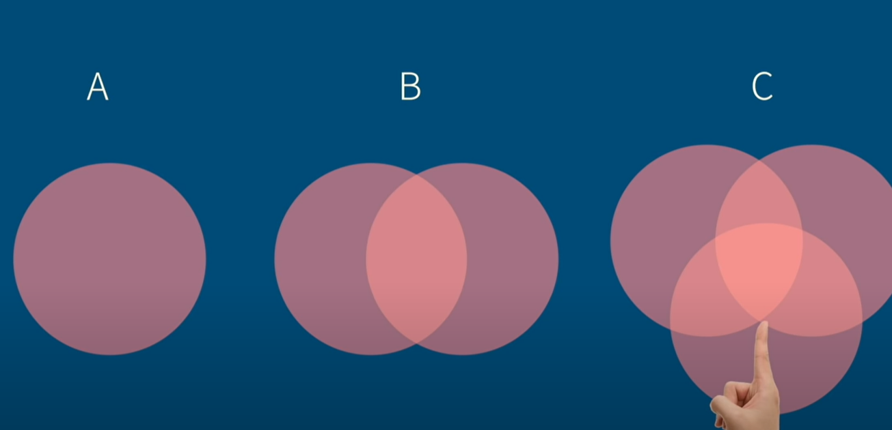

- [[自学力]]
	- 如何提高自学力？
	  collapsed:: true
		- [[要拉高你对这件事的期待]] 无论你现在有多么不喜欢它
			- [[提高期待]]这件事是可以学习和练习的，因为[[永远有办法从不喜欢的事情背后去找到支撑你去做的原因]]
		- [[建立回馈机制]]
			- [[回馈机制(Feedback)]]可能解决不了短期的很棘手的问题，不过却是进步的一个根本方式
			- 要建立自己的[[回馈机制(Feedback)]]，有哪些方式呢?
				- [[#red]]==定期去检查自己做某件事的进度==
				- 每天背诵的单词量
				- 投资股票或者基金时，要查看自己投资的那支股票或者基金的表现如何，[[#red]]==要分析赚钱或者赔钱的原因==
				- 对自己的工作周报[[#red]]==进行存档==，然后定期判断是否有问题
				- 定期回顾自己的目标 [[GoalMachine]]、对自我的认识
				- 检视自己的阅读主题是否偏向某一个，可以主动去[[#red]]==读一些比较难、主题比较有特色==的书，因为[[知识没有边界]]
					- 比如[[债的历史]]就很难读懂，但是告诉我们[[红包文化]]的[[来源]]、人与人之间[[讯息交换]]的[[原因]]，其实信任其实就是一种债务，为的是让我们之间产生更多的连接
			- 可以把[[回馈机制(Feedback)]]理解成[[与人生目标进行时刻对焦]]
				-
			-
			-
			-
		-
	- 在学习路上会遇到哪些类型的人？
		- 会遇到四种类型：
			- [[具有开创能力的人]] 可以练就别人现在还不具备的能力
			- [[学习和追求进步的人]]
			- [[有质疑别人学习能力的人]]
			- [[不仅质疑还会否定学习能力的人]]
-
-
- 为了使得观点尽可能客观、行动尽可能没有偏颇，需要具备哪些最重要的能力？
	- 确保达成目标的能力是：[[#green]]==将一个大的目标拆解成粒度适中的可执行的任务==
		- 这个拆分考验人的获取信息、指定计划、执行力、合理的自我评估等能力
	- [[#green]]==综合信息的能力：==
		- 现代社会无论是科学问题还是人际关系问题，都变得越来越复杂
		- 方法：
			- 学习强大的逻辑工具；
			- 多进行写作；
			- 多和别人沟通交流；
			- 多聆听外在的对话，包括辩论赛、访谈节目、自媒体；
			- 多提问题，特别是将困惑不已的小问题不断进行细化和推进；
	- [[#green]]==把人生的多个维度拎得清且随时调整focus的能力：==
		- 每个人生阶段都会有不同的重点，前期可能是读书，然后可能是自我发现、自我分析，再后来可能是恋爱结婚，再然后可能是养育孩子和赡养父母，再接着可能是参与社会公共事务，中间穿插着旅行、进修、升职等经历。但是很多情况下，这些重点会存在交织期，且多个重点的雷点可能会同时爆，也可能一次只爆一个。
			- 当多个雷点同时爆炸时，心态容易崩溃，这时需要：[[#red]]==按优先级来解决 + 实在解决不了的学会绕路而行；==
			- 而当单个雷点爆炸时，直接危害往往不大，但是情绪带来的间接危害因为持续时间久而破坏力极大，比如失恋的伤心情绪可能使得某些重感情的人一阕不振、虚度光阴，把自己的工作、学习、家庭关系等其他方面都搞得一塌糊涂。这就需要：[[#blue]]==将人生的发展划分为[[事业]]、[[爱情]]、[[学习]]、[[财产]]、[[家庭]]、[[公共事务]]这六个方面，当一个方面的问题无法解决时，可以暂时搁置，去发展其他维度，这样不至于蹉跎太多人生时光。==
	- [[#green]]==观察他人性格和随时调整相处模式的能力：== [[InterpersonalSkills]]
		- 人与人相互交流的作用是：
			- 促进信息的流通和传播
		- 可以从练习对身边的人写评语开始来增加对他人性格的观察能力 [[CommentsOnPeople]]
		- 设计相处模式的几个 [[关键]]： [[UncleFu]]
			- 知道对方喜欢什么
				- 喜欢看有营养或者休闲类或者两种性质兼具的书、练习书法、一些飞机模型的收藏品、间接大方但同时有品质的衣服、喜欢有趣有意思的话题或者句子 [[安静]] [[休闲(放松)]][[品质]][[趣味]]
			- 知道对方讨厌什么
				- 零散或者不完整的句子、逻辑上跳来跳去（或者说是修改次数太多、没有想好内容就随意发送的）导致不方便阅读的文字、重复性或者说他已经非常知晓的内容(因为他已经听过很多遍这样的内容)、过于花里胡哨的文字或者表达、不喜欢把东西摆放得太乱 [[简洁]] [[清晰]] [[拒绝重复性]][[拒绝混乱]]
			- 知道对方会对什么行为感到愤怒或者失望
				- 没有明确告知他有什么行为不对或者不满意就直接拉黑或者删除了好友 [[冷战]]
				- 揣测或者怀疑他行为背后会存在什么不好的动机，误解他原本善良的出发点 [[怀疑]]
				- 在他心情不好的时候不能体谅他反而埋怨他没有时间或者没有耐心陪伴 [[不能体谅他人]]
			- 了解对方的说话习惯：是喜欢打字还是线下交流、是喜欢打长段文字还是喜欢短篇文字
		- 引申的问题是： [[CurrentIssues]]
			- 如何和不同性格的人来相处？可以以身边的人来举例，来进行[[社交实验]]。
			- [[冰冷型]]：比如 [[UncleFu]]，如何能让对方感受到更多的温暖呢？
			- [[辩论型]]：比如我自己，喜欢对一个问题进行喋喋不休的辩论，如何避免对不必要的话题进行辩论呢？
			- [[当闲下来的时候，就要想想你需要解决的问题依旧很多，不够你总倾向于遗忘或者无法想象细节]]
	- [[#green]]==从语言深入到文化的交流能力：==
		- 只有进行广泛的在不同语言范围内的沟通，并通过这种沟通让自己成为一个受欢迎的人，才能为自己打开很多资源或者阶层的钥匙，最重要的是：[[#red]]==你要让自己具有吸引别人来与你沟通的能力，这种吸引力应该来自：==
			- 自身的经济实力
			- 自身的职业发展水平
			- 自身独特的人格特质
				- [[CurrentIssues]][[WhatShortMenCanDoToPolishThemselves]]
					- 问题：个子矮的话不仅难以混入国内的文化圈，更难以混入欧美遍地大长腿的社交圈，所以你必须具备其他的特质来为你打开这些地方的大门。所以，矮子需要拥抱或者体现哪些特质呢？
					- 答案：
						- 知识丰富但幽默风趣，将知识[[幽默化(Humor)]]
						- 着装简洁，但是有自己的特色和风格，比如只穿特别的灰色、特别的格子风格 [[MyClothesCabinetManager]]
						- 很强的动手能力
						- 洁白整齐的牙齿
						-
-
-
- {{youtube https://www.youtube.com/watch?v=hMOO8CotLds}}
	- 什么是最高的个人竞争力？
	  collapsed:: true
		- 真正的优势是学习未知的技能
	- 现代人学习的阻碍有哪些？
	  collapsed:: true
		- 睡眠的时间或者品质不足
		- 让人分心的事情变多
			- 分心使得大脑将新知识和旧知识连接的过程必须全部重来。此外，当大脑中原有的连接数目多时，学习新知识的速度也会更快。
		- 重复的次数不够多
			- 重复可以使得[[记忆烙印]]的范围变大变深
				- 
		-
	- 有哪些学习诀窍？
		- 把知识进行[[迁移]]
			- 小事中有最基本的逻辑，复杂的事都是由这些小事组成的
		- [[组块法(Chunking)学习]]
			- 记忆单词时分块记忆
		- [[回想]]
			- 尝试多回想一些时间，想不起来的时候也不要翻看答案，用自己的理解和能回想起的慢慢去推导。这种方式甚至比[[思维导图]]可能还要更 [[高效(HighPerformance)]]
		- [[发散式思考]]
			- 空出时间在座位上休息并思考问题
			- 比如[[爱因斯坦]]就是这样做的，手里拿着一个钥匙，当进入混沌入睡状态时，钥匙落在地上，就会把刚才的想法及时记录下来
		- [[类比法]]
			- 比如把投资中的收益和风险比作开车过程的速度和出事几率：
				- 开车速度越快，出事几率越大，同样投资的潜在收益越大，风险也越大
				- 每个人对速度的感知是不同的，同一个速度有些人觉得慢有些人觉得快，同样同一个大小的收益不同人的感受也是不同的
-
-
- [[生产力]]
	- {{youtube https://www.youtube.com/watch?v=79d0uxh7rSU}}
		- 如何提高生产力？
			- 生产力的[[关键]]是[[做出选择]]，提高生产力是为了看出别人忽略的选择
			- [[没有动机]]
				- 人的大脑会对[[不确定的(uncertain)]]事情产生抗拒 [[BrainScience]]
				- 所以，必须得 先工作一段时间 使得你对这件事 具有 一定的 [[掌控感(Control)]] 和 [[确定感)(certainty)]]
			- [[不懂聚焦，浪费资源]]
				- 要擅长使用[[心智模型]]，因为其会影响[[习惯性思维]]
				- [[对自己说故事]]
					- 你期待的生活愿景是什么样的？
					- 你期望那种生活可以给你带来什么样的改变？
				- [[MindsetManager]]
					- [[事情确实很多，但是不是每件事都值得去做]]
					- [[做最重要的事，永远是最重要的事]]
			- [[找出抱负，大目标拆解成小目标]]
				- [[抱负]]很重要，必须赋予自己的 [[GoalMachine]] 更大的意义，将其与想要的未来进行[[连接(Connection)]]
				- [[MindsetManager]]
					- [[做很多的事情，不代表是在做对的事]]
			- [[多方吸收资讯，然后有系统地进行解读]]
				- [[简化(Simplify)]] 吸收 与 解读 [[资讯]] 的 过程，将 [[资讯]] 变成 好吸收的东西
				- [[MindsetManager]] [[BrainScience]]
					- [[大脑很聪明，但是大脑也很笨]]
					- [[问对的问题，大脑才能给出对的答案]]
				-
				-
			-