public:: true

- # Q1
  collapsed:: true
	- #有序数组 #贪心 #二分搜索  #边界条件
	- 题目描述：
		- 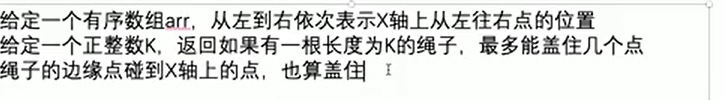
	- 对于从后往前的判断顺序，大于和等于很明显是等价的  因为刚刚好大于绳子左端点的那个点会被计算在内，并且需要找的是满足大于等于这个条件的最左边的点（index最小的位置）；
	  collapsed:: true
		- 思考一下这时候的二分法到底该如何设计吧：
			- l = 0，r = len - 1, mid = (l + r)， index是当前绳子的右端点
			- 二分法的比较对象 是  绳子的左端点对应的值，记作value
			- if arr[mid] >= value ，由于数组是从小到大进行排列的，所以[mid+1, r]这个范围内的所有值必然都会大于value
				- 将mid位置作为待返回变量的当前值
				- 所以在【l，mid-1】这个区间范围继续寻找，r = mid - 1。继续寻找的过程中，当找到一个更小的满足条件的值时，会更新待返回变量的值。
			- if arr[mid] < value,  由于数组是从小到大进行排列的，所以[l, mid - 1]这个范围内的所有值必然都会小于value
				- 当前mid位置不满足要求，所以不会更新待返回变量的值
				- 所以在【mid+1，r】这个区间范围继续寻找，l=mid+1。继续寻找的过程中，当找到一个更小的满足条件的值时，会更新待返回变量的值。
			- 以index为绳子右端点能覆盖的点数 = index - 待返回变量的最终值  + 1
	- 对于从前往后的判断顺序，小于和等于才是等价的，因为刚刚好小于绳子右端点的那个点会被计算在内，并且需要找的是满足小于等于这个条件的最右边的点（index最大的位置）。
	  collapsed:: true
		- 二分法的设计为：
			- l = 0, r = len - 1, mid = (l + r), index是当前绳子的左端点
			- 二分法的比较对象是  绳子的右端点对应的值，记作value
			- if arr[mid] <= value,  由于数组是从小到大进行排列的，所以[l，mid-1]这个范围内的所有值必然都会小于value
				- 将mid位置作为待返回变量的当前值
				- 所以在【mid+1，r】这个区间范围内继续寻找，l=mid+1。 继续寻找的过程中，当找到一个更大的满足条件的值时，会更新待返回变量的值。
			- if arr[mid] > value, 由于数组是从小到大进行排列的，所以[mid+1，r]这个范围内的所有值必然都会大于value
				- 当前mid位置不满足要求，所以不会更新待返回变量的值
				- 所以在【l，mid-1】这个范围内继续寻找，r=mid-1。继续寻找的过程中，当找到一个更大的满足条件的值时，会更新待返回变量的值。
			- 以index为绳子左端点能覆盖的点数 = 待返回变量的最终值 - index + 1
			-
- # Q2
  collapsed:: true
	- #括号匹配  #判断类  #字符串 #变量计数技巧
	- 题目描述：
		- 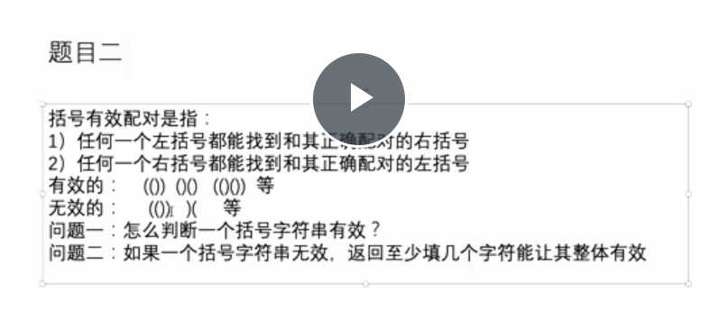
	- 问题分析：
		- 问题1也可以使用栈来实现，但没有这个必要，因为此时这个栈的作用仅仅是为了区分左括号和右括号到目前为止的累计数目分别是多少
			- 一般情况下有一个左括号就进栈，有一个右括号就出栈，之所以这样进行搭配就是因为“左括号是在右括号前面的”。这个方向是不能进行对调的，也就是不能说，有一个左括号就出栈，有一个右括号就进栈，这是因为栈对应的是一个物理空间，必须先装入元素然后才能取出元素。
			- 如果直接用一个变量来统计，则可以变换方向了。使用变量count，初始化为0。
				- 当有一个左括号时，count加一；当有一个右括号时，count减1；如果过程中count = -1，即可以判断当前右括号数多于左括号了，就可以返回无效；如果全部计数完成，count大于0，即可以判断当前左括号数多于右括号了。
				- 反方向的过程是：当有一个左括号时，count -= 1；当有一个右括号时，count +=1；如果过程中count > 0, 说明右括号数多于左括号了，就可以返回无效；如果全部技术完成，count小于0，即可以判断当前左括号数多于右括号了。
		- 问题2这里没有问具体有几种添加字符串使其整体有效的方式，比如（() 可以是(()), ()()
		- 问题2的解决方案：
			- 自己的理解：只需要返回count计算值的绝对值难道不就行了吗？count如果等于0，那就是有效的，不需要补充字符；count如果大于0，那就是需要补充count个右括号；count如果小于0，那就是需要补充-count个左括号。
			- 自己设想的解决方案：如果直接使用问题1的代码，肯定不行，因为问题1中当count等于-1时，就会直接返回了，不会遍历到字符串的每一个字符；可是如果只是把字符串的所有字符遍历一遍然后用count计数一下，这样难道不行吗？
			- 标准解决方案是：从头到尾依旧顺序遍历字符串的每个字符，遇（加1，遇）减1，当count = -1， need += 1， count = 0，need每增加1，也就是说明需要增加一个左括号；遍历完成之后，need += count，遍历完成时的count值代表的是需要增加的右括号的数目。
			-
	-
	-
- # Q3
  collapsed:: true
	- #括号匹配  #子串搜索 #字符串 #动态规划/空间压缩
	- 题目描述：
		- 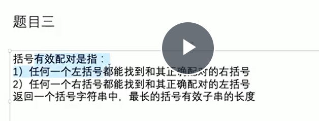
	- 难点在于在遍历的过程中找到所有的有效子串，并计算每个有效子串的长度。这样才能找出最长的或者最短的。
	- ( ( ) ) (  ( ( ) ( (
	- 一些误区：
		- 这里并没有说明这整个字符串是有效匹配还是无效匹配，所以是都有可能。没有特别指名，说明这对于问题的分析没有影响，所以无需纠结。
		- 这里返回的是有效子串的长度，很明显这必然是偶数。注意求的不是有效括号的对数！
		- 注意对于有效子串的理解，（（））这种是有效子串，但是（）（（（）））这种同样是有效子串，两者的区别是前者是括号的匹配是直到字符串的最后一个字符位置才算完成，后者则是在字符串的前一部分就已经完成一定数目的左右括号匹配了。如果仅仅以前者为定义，就会得出错误的解决方案，比如从前往后扫描每一个位置，对于每个位置i进行一轮判断：初始化变量count = 0，len = 0， 如果其是），则直接跳到下一个位置开始下一轮判断；如果其是（，count += 1，len+=1，再往后扫描，如果是（，count+=1，len+=1，如果是），count-=1，len+1,  当count = 0 的时候，停止向后移动，len即为子串长度。
	- 解题的思路：
		- 思路来源：对于这类与子串、子数组有关的问题都有一个通用的解题思路，就是计算出以每个位置开头或者结尾时的解。这样一来，既可以从暴力的角度对每个位置单独进行求解；也能够利用前后位置之间的关系来进行巧妙求解。后者中的方法应该非常多，但目前看的以两类为主：一是发现不同位置之间的解的关系，利用动态规划进行求解，具体来说分为  从前往后的以当前位置为子串开头、从前往后的以当前位置为子串结尾、从后往前的以当前位置为子串开头、从后往前的以当前位置为子串结尾 这四种，具体选择哪一种应该是以题目所求更为方便为标准，且很多时候四种基本上无异；二是窗口法，就是一个位置的解往往会覆盖其他位置的解，当在求解某个位置的解时，利用某些先决条件可以间接知道其他位置的解，进而可以减少不必要的计算，当然也有可能是一个位置对应的范围和另一个位置对应的范围存在重叠，在定位范围边界的时候可以减少计算量。
		- 本题具体思路：
			- 选择以当前位置为子串开头还是子串结尾？
				- 一样方便，为开头时，遇到）即可判断当前位置的解为0；为结尾时，遇到（即可判断当前位置的解为0.
			- 选择从前往后还是从后往前？
				- 如果是以当前位置为子串开头的话，这时候当前位置的解研究的是从数组中该位置到结尾的范围，可是很明显，这时候后面位置的解都没有计算出来。所以此种情况下应该从后往前遍历。
				- 如果是以当前位置为子串结尾的话，这时候当前位置的解研究的是从数组中开头到该位置以内的范围，如果需要利用动态规划，其前面位置的解都需要先计算出来，所以应该从前往后进行遍历。
				- 可发现：遍历的顺序  和  当前位置在子串的位置  是相反的
			- 下面以从后往前、以当前位置为子串开头为解决方案
				- dp数组的含义
					- dp[i] 表示i位置开始的有效子串的最大长度
				- dp数组初始化
					- 全部初始化为0。设字符串长度为L, 则dp[L-1]的最终值也是0，因为有效子串长度 >=2, 单字符必然不构成有效字串
				- dp数组的递归过程(i >= 2)
					- if s[i] = ')',  则 dp[i] = 0
					- if s[i] = '(’， 判断 s[ i + dp[i+1] ] 是否等于 ')'
						- 如果不等于，那么dp[i] = 0
							- 这时不可能有以下情况：即 i + s[i+1] 这个位置后面的几个子符形成1段有效子串，然后这个有效子串的后面是一个）
							- 原因是：这时候i+1位置处的dp[i+1]就不会是当前值了，而是会包含后面这段有效子串的长度，矛盾
						- 如果等于，那么我们有  dp[i] >= dp[i+1] + 2
						  collapsed:: true
							- 会不会更大？有可能的，因为i+dp[i+1]+1 这个位置 相对于 原先的 i+1 位置来说 不属于有效子串的一部分，或者更准确地说，该位置是 i+1这个位置处的最长有效子串限制不能继续延伸的原因，当i位置 和 该位置刚好配对成一组有效左右括号对时，这个限制就被打破了，这时候 i + dp[i+1] + 2 位置处开始的有效子串的长度 就需要被考虑到  当前位置的解中去，也就是 dp[i] = dp[i+1] + 2 + dp[i + dp[i+1] + 2].
							-
						-
						-
						-
	-
	-
	-
- # Q4
  collapsed:: true
	- #最少数目  #染色问题  #组合搜索  #数组分界线  #辅助数组 #空间换时间
	- 题目描述：
	  collapsed:: true
		- 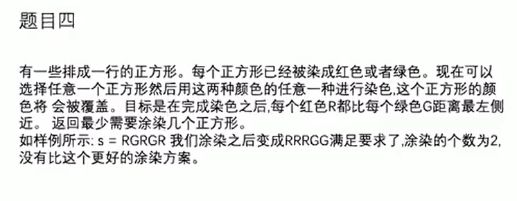
		  collapsed:: true
	- 题目理解上的误区：
	  collapsed:: true
		- 没有要求染色后两种颜色方块的数量保持不变，实际上如果这样要求，那么答案就是固定的了
		- 全部染色为R和全部染色为G也是可行染色方案
		- 设想过以某个字母为分界线：
			- 【A】如果当前位置的字母为R，计算一下字符串中前面所有位置上的R总数pre_r和G总数pre_g，同时也计算一下字符串中后面所有位置上的R总数post_r和总数post_g,  按照两类情况计算一下需要进行涂染的次数
				- 第一种情况是计算  pre_r + post_r + 1 与  pre_g + post_g 哪个大，也就是比较字符串中R和G的总数，如果R的总数更多，就全部染成R，否则全部染成G，记此时的涂染次数为num1 = min(pre_r + post_r + 1, pre_g + post_g);
				- 第二种情况是将该位置左边的所有位置都染成R，需要进行涂染的次数是pre_g, 将该位置右边的所有位置都染成G，需要进行涂染的次数是post_r, 记此时的涂染次数为 num2 = pre_g + post_r；
				- 取两者的最小值 num  = min(num1, num2);
			- 【B】如果当前位置的字母为G，计算一下字符串中前面所有位置上的R总数pre_r和G总数pre_g，同时也计算一下字符串中后面所有位置上的R总数post_r和总数post_g,  按照两类情况计算一下需要进行涂染的次数：
				- 第一种情况是计算  pre_r + post_r 与  pre_g + post_g + 1哪个大，也就是比较字符串中R和G的总数，如果R的总数更多，就全部染成R，否则全部染成G，记此时的涂染次数为num1 = min(pre_r + post_r, pre_g + post_g + 1);
				- 第二种情况是将该位置左边的所有位置都染成R，需要进行涂染的次数是pre_g, 将该位置右边的所有位置都染成G，需要进行涂染的次数是post_r, 记此时的涂染次数为 num2 = pre_g + post_r；
				- 取两者的最小值 num  = min(num1, num2)
			- 对字符串的每个位置都按照上述两类分别进行计算，逻辑上对当前字母进行了分类讨论，但是在代码上只需要用一个if判断来合并代码。
			- 实际上【A】和【B】类下的两种情况可能会出现重合。对于【A】类来说，若XXXXX...R中G的总数少于R, 则两种情况下都是RRRRR...R;  对于【B】类来说，若G...YYY中R的总数少于G，则两种情况下都是G...GGGGG。 重复了对结果来说没有影响，只是增加一次额外的计算量，在【A】类时只需要让第二种情况不考虑最后一个位置就行，在【B】类时只需让第二种情况不考虑最后一个第一个位置就行了。
			- 但是，这种思路存在一些问题：
				- 全R和全G这种染色方式与字母的不同位置其实是没有关系的，完全可以单独拎出来算，不用分两种情况。
				- 去除第一种情况后，以字符串长度为5举例，【A】类就变成了RGGGG，RRGGG，RRRGG, RRRRG，【B】类就变成了RGGGG, RRGGG, RRRGG,RRRRG，可以发现此时【A】类 和【B】类 居然完全是一样的？是的，因为题目的要求就是先R后G，这个条件导致具体每个位置上原始的字符是什么变得不重要了。
				- 由以上两点得出了正确的间接的思路。
				- 个人在以这种角度思考时的思维缺陷是：一是逻辑杂糅，一方面想着满足先R后G的条件，一边又想着通过统计当前位置左区间和右区间中R和G的原始数量关系进而通过投巧来达到最低的染色次数，事实上这两种逻辑不能兼容，两种逻辑的顺序是相反的，并且主要的逻辑问题在于后者，前者是：当R和G的先后顺序固定后，剩下的区别只是个数关系了，固定了当前考虑的位置后这个个数关系也确定了，所有不同的位置就能够对应所有的个数关系了，而后者是：考虑左边R多还是G多，选择数量少的那个，考虑右边R多还是G多，同样选择数量少的，当左边R少且右边R少、左边G少且右边G少、左边R少且右边G多时，都能很容易定位到最优染色方案，而当左边G少且右边R多时，会违背先R后G的逻辑关系，换句话说后者这种方式来寻找最佳染色方案变得很困难了；二是逻辑重复，这在前两个问题中都已说明，主要是很多逻辑可以进行归纳到一起去，从而变成更简单的逻辑。
		- 正确的思路：
			- 表面上该问题是一个面向字符序列整体对象的问题，而与字符序列具体每个位置无关，但是该问题所对应的所有可能解与位置有关，穷举所有位置的情况是为了穷举所有的可行解。然后又引申出“一个数组当中需要考虑的位置范围该如何确定”的问题，一般情况是整个数组的所有下标位置或者受到某个条件限制下的部分下标范围，特殊情况下是以数组中元素和元素之间的逻辑位置范围（或者说元素分界线组成的范围），本题就属于该特殊情况。
			  collapsed:: true
				- 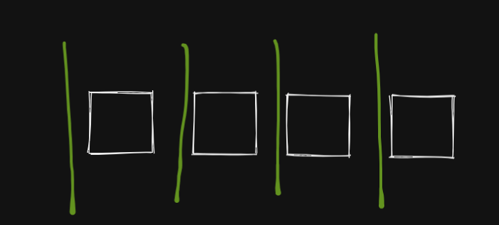
			- 长度为n的数组有 n+1 个元素分界线，分界线左边的方块全部染成R，分界线右边的方块全部染成G，所以最左边的分界线对应全部染成G，最右边的分界线对应全部染成R。
			- 于是问题就变成了怎么求每个分界线对应的一个可行解需要重新染色的数目？其实也就是计算 可行解代表的颜色字符串与原字符串有多少个元素不同。可以使用暴力方法，但这可以进行优化：使用预处理数组来解决。
				- 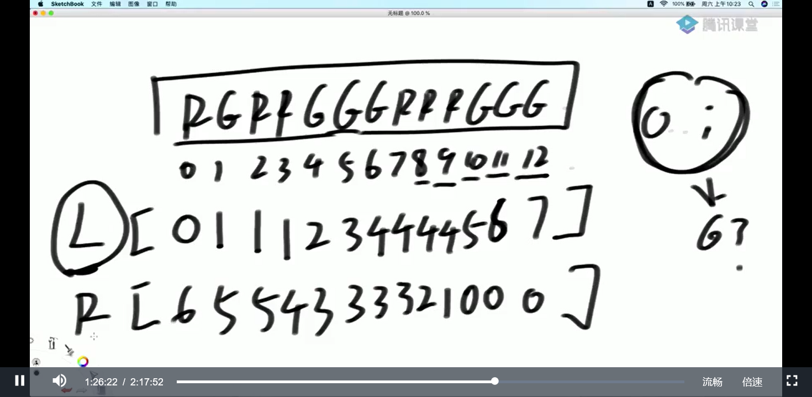
				- 因为对于每个分界线位置来说，只需要知道它左边有多少个G，右边有多少个R，两者相加就等于需要重新染色的数目。所以可以用L和R两个数组来得到这些信息，L[i]表示[0...i]区间内有多少个G，这只需要从左往右遍历一遍就行；R[i]表示[i...-1]区间内有多少个R，这只需要从右往左遍历就行。
				- 这两个数组可以只用其中的一个， 因为在遍历求解的时候另一个可以同时计算出来，且没有将每个位置的值都保存的需要。
					- 如果只要L, 那我们需要从其中计算出来右区间有多少个R，可以从右往左遍历，顺便计算有多少个R；
					- 如果只要R, 那我们只需要从其中计算出来左区间有多少个G，可以从左往右遍历，顺便计算有多少个G。
		- 代码上的注意事项：
			- 当给定的颜色字符串为空或者只有一个字符时，无需重新染色，直接返回0
- # Q5
  collapsed:: true
	- #矩阵搜索   #求解数目  #辅助数组 #空间换时间
	- 题目描述：
		- 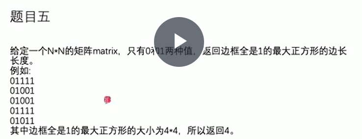
	- 题目理解：
	  collapsed:: true
		- 首先必须得弄清楚如何在一个N*N的矩阵中枚举所有的长方形或者正方形，并分析其复杂度。
			- 枚举长方形粗略分析：长方形只需要选择左上角点和右下角点就能确认，而选择左上角点和右下角点的时间复杂度都是O(N^2)，但是实际中一方面随意选取的左上角点和右下角点可能顺序刚好颠倒，也就是会重复得到一次相同的正方形，另一方面当选取的两个点在同一水平线上或者竖直线上时，也无法确定一个正方形，所以很多选择是无效的。但是粗略可以得到复杂度为  某个较小的小常数  * O(N^4).  不管是在正方形内部分析还是像第二张图堆叠多个正方形来分析，不会改变其复杂度。
				- 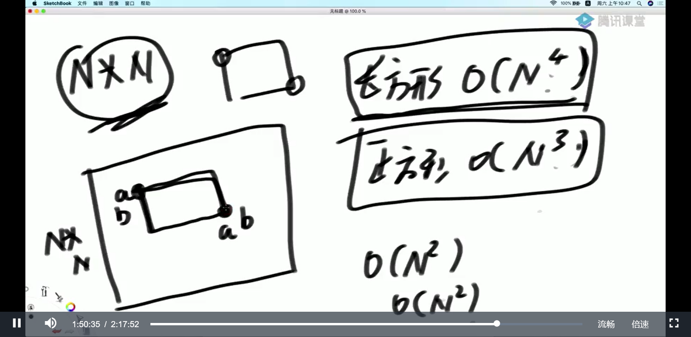
				- 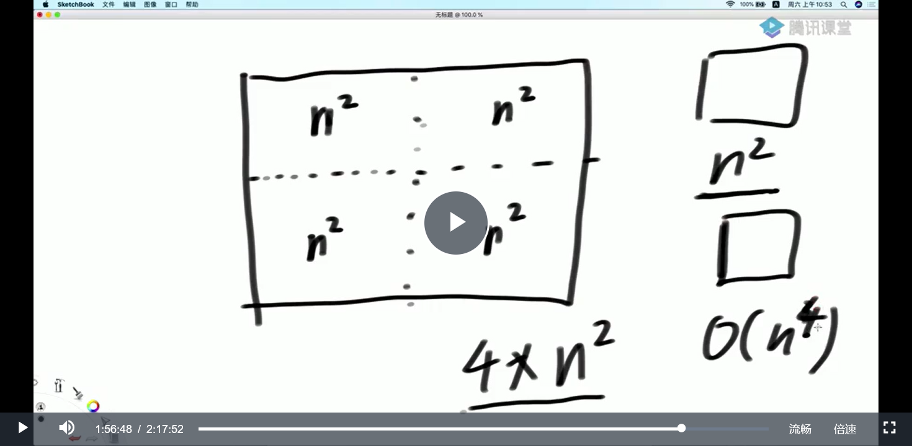
			- 枚举正方形粗略分析：正方形首先需要选择一个左上角点，花费O(N^2)，然后不断选择可能的半价，花费O(N)，所以总复杂度是O(N^3)。
				- 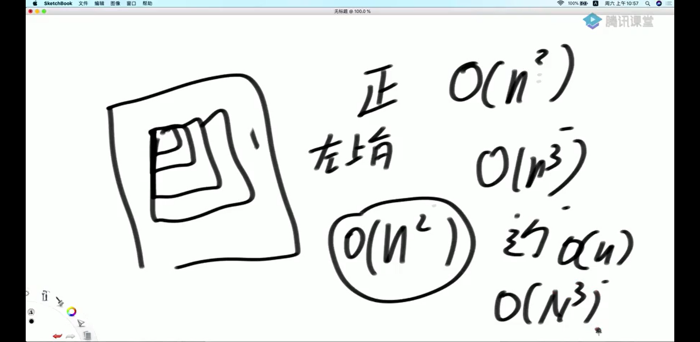
			- 精细化分析：完全可以推导出来精确的复杂度，并通过代码结果进行检验
				- 推导(下标从1开始)：
					- 先推导正方形：对于左上角位置（i，j），只要当 i <= N - 1,  j <= N -1时，都有对应的正方形；
						- 分析下其允许的正方形的个数，或者说边长的运行范围。很明显是 [1， min(N - i, N - j)]。
						- 由于正方形自身的规律
						  collapsed:: true
							- 对于第一行的点，其边长范围依次是N-1, N-2，N-3, N-4, ..., 3, 2, 1 （本行的天花板很明显是N-1, 然后依次减小）
							- 对于第二行的点，其边长范围依次是N-2, N-2,  N-3, N-4, ...., 3, 2, 1  （本行的天花板很明显是N-2）
							- 对于第三行的点，其边长范围依次是N-3, N-3,  N-3, N-4, ...., 3, 2, 1  （本行的天花板很明显是N-3）
							- 对于第四行的点，其边长范围依次是N-4, N-4,  N-4, N-4, ...., 3, 2, 1  （本行的天花板很明显是N-4）
							- 对于第5行的点，其边长范围依次是N-5, N-5,  N-5, N-5, N-5, ...., 3, 2, 1  （本行的天花板很明显是N-5）
							- ....
							- 对于第N-2行的点，其边长范围依次是N-(N-2), N-(N-2), N-(N-2), ..., N-(N-2), 1 （本行的天花板很明显是N-(N-2) = 2）
							- 对于第N-1行的点，其边长范围依次是N-(N-1)，N-(N-1)，N-(N-1)，N-(N-1), ..., N-(N-1)，（本行的天花板很明显是N-（N-1）=1）
							- 其总数为：S = (N-1) *  1 + (N - 2) *　３＋（Ｎ－３）＊５　＋ (N-4) * 7 + ... + 2 * ( 2(N - 2) - 1) + 1 * ( 2(N-1) - 1)
								- S = N * (1 + 3 + 5 + ... + 2(N-1) - 1) - (1×１ +２×３＋３×５＋４×７＋．．．＋（Ｎ－１）×　( 2(N-1) - 1))
								- S = N * [ 2(N-1) * (2N - 1) / 2 - 2 * (N-1) * N / 2] - (1×１ +２×３＋３×５＋４×７＋．．．＋（Ｎ－１）×　( 2(N-1) - 1))
								- S = N * [(N - 1) * (2N - 1) - (N - 1) * N] - (1×１ +２×３＋３×５＋４×７＋．．．＋（Ｎ－１）×　( 2(N-1) - 1))
								- S = N * (N - 1)^2 - ( 1 ×１ +２×３＋３×５＋４×７＋．．．＋（Ｎ－１）×　( 2(N-1) - 1))
								- S = N * (N - 1)^2 - ( 1 × (2 * 1 - 1) + 2 * ( 2 * 2 - 1) + 3 * ( 2 * 3 - 1) + 4 * ( 2 * 4 - 1) + ... + (N - 1) * ( 2 * (N - 1) - 1)
								- S = N * (N - 1)^2 - ( (2 * 1^2 - 1) + (2 * 2^2 - 2) + (2 * 3^2 - 3) + (2 * 4^2 - 4) + (2 * (N-1)^2 - (N-1))
								- S = N * (N - 1)^2 - 2 * (1^2 + 2^2 + 3^2 + ... + (N - 1) ^ 2 ) + (1+2+... + N - 1)
								- 由于1^2+2^2+3^2+…+n^2=n(n+1)(2n+1)/6
								- S = N * (N - 1)^2 + N(N-1) / 2 - 2 *（N-1）* N * (2N - 1)/6
								- S = N(N-1) * [(N-1) + 1/2 - 1/3(2N-1)]
								- S = N(N-1) ＊（1/3 N - 1/6）
							- 每一行的正方形总数其实有相互关系：第一行是N(N-1)/2，第二行比第一行少1，第三行比第一行少3，第四行比第一行少6，第五行比第一行少10， 第N-1行比第一行少 1 + 2 + 3 + ... + (N - 2) = (N-2)(N-1) / 2。
								- 如果N=6, 那么第一行就是15个、第二行14个、第三行12个、第四行9个、第五行5个、第六行0个.
								- 5,4,3,2, 1
								- 4,4,3,2, 1
								- 3,3,3,2, 1
								- 2,2,2,2, 1
								- 1, 1, 1, 1, 1
								- 与公式计算出来的结果完全一样，6 * 5 * (2 - 1/6) = 11 * 5 = 55
					- 推导长方形：对于左上角位置(i, j), 只要当i <= N - 1,  j <= N -1时（i对应的是竖直方向X（向下为正方向），j对应的是水平方向Y（向右为正方向）），都有对应的长方形。
					  collapsed:: true
						- 其右下角对应的矩形范围是 X 属于 【i+1，N】，Y属于【j+1, N】，这个矩形范围内除了主对角线上的点以为都可以作为长方形的右下角顶点位置，其数目为：(N- i) * (N - j) - min(N - i, N - j)；
						- 对于第一行来说，
							- 第1个元素（1,1）对应的长方形个数是：（N-1)^2 - (N-1) = (N - 1) (N - 2 )
							- 第2个元素（1,2）对应的长方形个数是：（N - 1）* （N - 2）- (N-2) = (N - 2) (N - 2)
							- 第3个元素（1,3）对应的长方形个数是：（N - 1）* （N - 3）- (N-3) = (N - 3) (N - 2)
							- 第4个元素（1,4）对应的长方形个数是：（N - 1）* （N - 4）- (N-4) = (N - 4) (N - 2)
							- ....
							- 第5个元素（1,N-1）对应的长方形个数是：（N - 1）* （N - (N-1)）- (N-(N-1)) = (N - (N - 1)) (N - 2) = N - 2
							- 第一行对应的长方形总数是：(N - 1) (N - 2 ) + (N - 2) (N - 2) + (N - 3) (N - 2) + ... + (N - (N - 1)) (N - 2)
							  collapsed:: true
								- = (N - 2) [(N - 1) + (N - 2) + (N - 3) + ... + (N - (N - 1)) ]
								- = (N - 2)[N * (N-1) - 1 - 2 - 3 - ... - (N - 1)]
								- = (N - 2)[N * (N-1) - (N - 1) * N / 2]
								- = (N - 2) * (N - 1) * N / 2
						- 对于第二行来说，
							- 第1个元素（2,1）对应的长方形个数是：（N - 2）* (N - 1) - (N - 2) = (N - 2)(N - 2)
							- 第2个元素（2,2）对应的长方形个数是： (N - 2) * (N - 2) - (N - 2) = (N - 2)(N - 3)
							- 第3个元素（2,3）对应的长方形个数是： (N - 2) * (N - 3) - (N - 3) = (N - 3)(N - 3)
							- 第4个元素（2,4）对应的长方形个数是： (N - 2) * (N - 4) - (N - 4) = (N - 4)(N - 3)
							- ...
							- 第N-1个元素（2,N-1）对应的长方形个数是： (N - 2) * (N - （N - 1）) - (N - (N - 1)) = (N - (N - 1)) * (N - 3)
							- 第二行对应的长方形总数是：(N - 2)(N - 2) + （N - 3）* [(N - 2) + (N - 3) + ... + (N - (N - 1))]
								- = （N - 2）(N - 2) + (N - 3) * [N * (N - 2)  - N * (N - 1) / 2 + 1]
								- = (N - 2) (N - 2) + (N - 3 ) * [ N * (N - 3) /  2 + 1]
						- 对于第三行来说，
							- 第1个元素（3,1）对应的长方形个数是：（N - 3）* (N - 1) - (N - 3) = (N - 3)(N - 2)
							- 第2个元素（3,2）对应的长方形个数是： (N - 3) * (N - 2) - (N - 3) = (N - 3)(N - 3)
							- 第3个元素（3,3）对应的长方形个数是： (N - 3) * (N - 3) - (N - 3) = (N - 3)(N - 4)
							- 第4个元素（3,4）对应的长方形个数是： (N - 3) * (N - 4) - (N - 4) = (N - 4)(N - 4)
							- ...
							- 第N-1个元素（3,N-1）对应的长方形个数是： (N - 3) * (N - （N - 1）) - (N - (N - 1)) = (N - (N - 1)) * (N - 4)
						- ...
						- 可以看出来每行的计算公式不太好进行统一，但是可知每行都N^3级别的，所以总的必然是N^4级别个长方形
	- 解决方案：
	  collapsed:: true
		- 对于所有正方形的搜索是不可避免的，因为矩阵中可能会存在多个边框全是1的正方形，这些正方形的边可能会存在重叠部分，有些正方形将其他正方形完全覆盖在内，两个正方形交叉的地方会出现新的小正方形。
		  collapsed:: true
			- 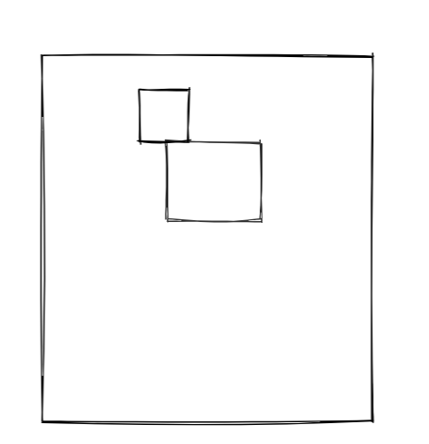
			- 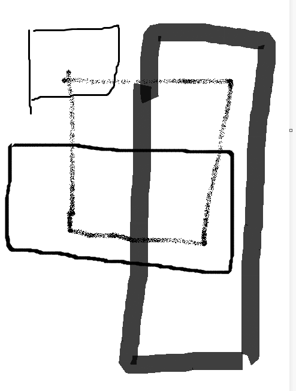
			-
		- 所以问题的关键在于如何优化“边框全是1”的这个判断过程，暴力方法就是确定该正方形的一个顶点（i,j）以及边长L，然后每条边的去进行判断，复杂度应该是O(N)。
			- 优化的办法是：
			  collapsed:: true
				- 使用两个预处理数组，r[i][j]表示的是（i，j）位置及其右边连续为1的个数，d[i][j]表示的是（i,j）位置及其下边连续为1的个数。这两个数组的求解非常简单，都只需要遍历一次整个二维数组就行了。r数组先初始化最后一列，然后从右往左逐列求解，该位置的数组元素为0则r数组对应位置也直接为0，不然等于下一列的r数组值加1；d数组先初始化最后一行，然后从下往上逐行求解。
					- 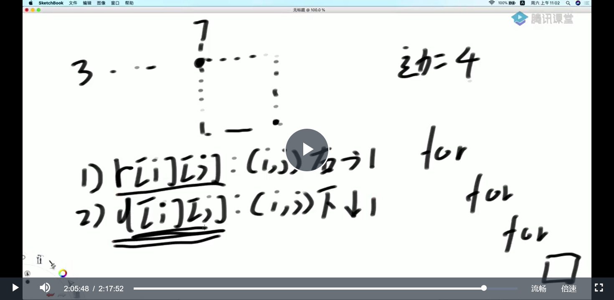
					- 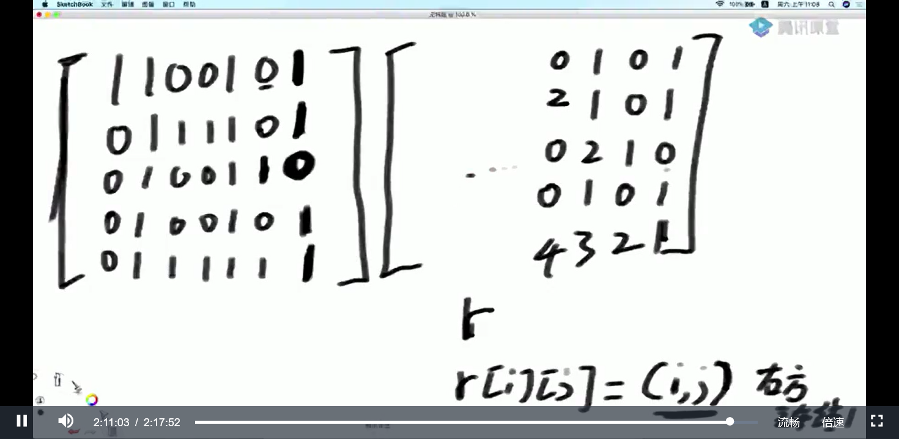
					- 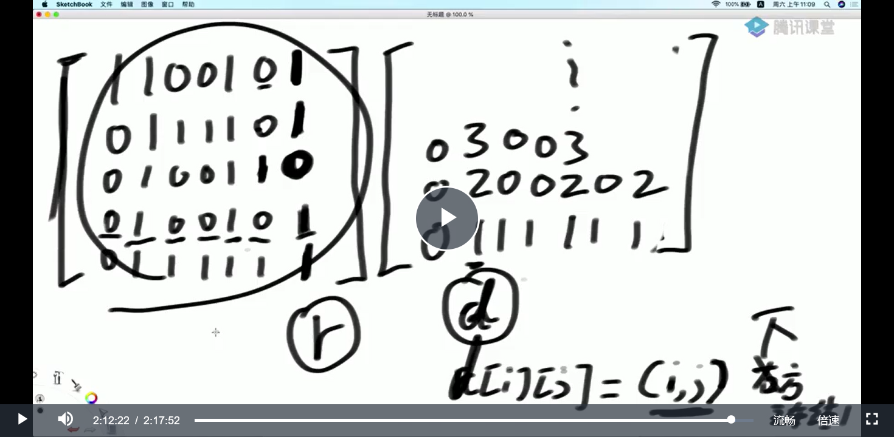
				- 顶点（i，j）的 r[i][j] 和 d[i][j]可以直接得到，如果r[i][j]和d[i][j]有一个小于L，则边框不全是1，否则 判断（i+L-1，j）对应的r[i+L-1][j] 是否大于等于L 和 （i, j + L - 1）对应的d[i][j + L - 1]是否大于等于L， 只要有一个不满足就都说明边框不全是1。
	- 代码实现时发现的注意事项：
	  collapsed:: true
		- 单独的一个1算作是边长为1的正方形，不应该被舍弃
		- 以某个位置为顶点时，计算其可能的正方形边长时  记得顶点位置 也是在边长里面的，切记不要将边长少计算了1个单位！不要把求长度和求个数混淆！
		-
- # Q6
  collapsed:: true
	- 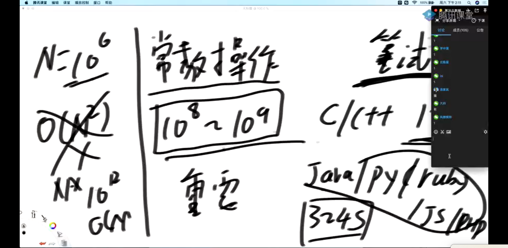
	- #构造数组  #奇偶数性质 #元素关系 #分治
	- 题目描述：
		- 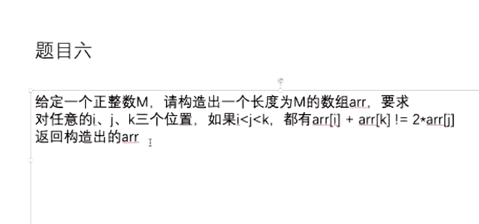
	- 难点：
	  collapsed:: true
		- 题目的类型：按照题目要求 构造数组
		- i，j，k只有简单的大小关系，没有准确的数量上的联系，在此处判断一个数组是否满足条件所需要验证的三元组 (i,j,k) 的数目接近于N^3级别，更不用说构造了；
		- 很明显，对于长度为1的数组和长度为2的数组，无论其元素组成是什么，都是满足条件的，因为其根本不存在第三个元素；当数组长度等于3时，也可以很容易找到无数组解；但是当长度等于4，如果前面三个元素X0, X1, X2已经确定好了，那么这个新增加的元素 需要 满足 X0 + X4 != 2X1,  X0 + X4!=2X2, X1+X4!=2X2这四个多出来的条件了，X0,X1,X2的数值决定了能否找到这个X4，有可能是找不到的；数组长度每增加1，就要增加约 当前数组长度^2 个级别的约束条件，很明显这个约束条件是没有办法推导出可行的数学规律的，所以就会无法求解了。
		- 试图通过dp寻找N+1长度的数组和N长度的数组之间的关系，从数学角度来说也是不可推导的
	- 解题突破点：
	  collapsed:: true
		- 从考虑不同数组间个别元素的差异  过渡到  考虑数组整体上的关系。换句话说，原先的思路是 从已有的数组元素中推导出单个新的数组元素，现在转变为 从已有数组  通过某种数学变换  获取一个新的数组。
		- 不等关系的不变性：这里的不等关系仅限于 大于、小于或者不等于。
			- 第一种情况：对左右这两个整体进行相同操作
				- 对左右两个不等式的整体进行相同加减操作时，不等关系必然不变；
				- 对整体进行乘除操作时，如果乘数或者除数是负数，则不等关系发生反转
			- 第二种情况：对每个变量进行相同操作
				- 若数学不等式左右两边变量的系数之和 是相等的，那么对左右两边的每个变量都施加相同的  加减等操作， 不等式依然成立
					- 加减操作非常好理解，如果左右两边的系数之和相等，那么 两边每个变量进行相同加减操作后，对两边造成的数值变化是 一样的
				- 施加相同的 乘除操作，不等式的不等关系在满足特定要求时可以确定
					- 比如 aA + bB < cC + dD + eE,
						- 认为不能确定不等关系变化的错误理由：
							- 若对A,B,C,D, E 同时都乘以k，则 左边的变化量 left_C = a(k - 1) A + b(k - 1)B,  右边的变化量 right_C = c(k - 1) C + d(k-1) D + e(k -1) E
								- 如果lef_C - right_C <= 0 或者 0 < left_C- right_C < [cC + dD + eE - aA - bB],  则不等关系不变; 否则会变化
							- 若对A, B, C, D, E同时都除以k，则左边的变化量 left_C = a(1/k - 1) A + b(1/k - 1)B, 右边的变化量 right_C = c(1/k-1)C + d(1/k - 1) D,
								- 同上只有获取具体left_C和right_C的具体值才能确定
						- 正确逻辑：
							- 如果不等关系的两边都没有常数项，就像aA + bB < cC + dD + eE这样，如果乘以或者除以的k是正数，则不等关系不变化；如果是负数，则不等关系颠倒
							- 如果不等关系的两边一方或者两方都含有常数项，就比如 aA + bB + M < cC + dD + eE,  对变量乘以正数k或者负数k之后，都不能确定。比如 -1 = 1 * 5 + 2 * 2 - 10 < 2 * 1 + 1 * 1 = 3，对变量乘以2之后，左边 = 2 * (1 * 5 + 2 * 2) - 10 = 8, 而右边 = 2 * (2 * 1 + 1 * 1) = 6, 不等号颠倒，但是如果是 -1 = 1 * 5 + 2 * 2 - 10 < 2 * 4 + 1 * 1 = 10,，不等号不变。
		- 这里 对数组整体  进行的数学变换  可以是在每个数组元素上进行相同的变换，也可以是 作用在数组中所有元素上的一种数学变换。
			- 关于后一种，通常是求和、求平均、求加权的和、求中位数、求众数等，隐形要求就是数组整体的性质是不会随着这类聚合操作而发生变化的，此种情况下数组通常是缩小长度的；
			- 而前者毫无疑问是等长的变换，但是如果同时施加多种相似变化，就能得到 整数倍于原先数组长度  的新数组了，这类变换包括求偶数、求奇数、求指数、求对数、求余数等。这里不同变化得到的数组是直接连接起来的，如果要得到的合并数组整体性质不变，就要求每个子数组内部、各个子数组之间都能维持相关性质。
	- 解题思路：
		- 思路：
			- 长度为3的整数数组 A =【a, b, c】满足条件 a + c != 2b； 对其进行奇数变化，得到 A1 =【2 * a - 1, 2 * b - 1, 2 * c - 1】，很明显这个数组中满足  2 * a - 1 + 2 * c - 1 < 2 * （2 * b - 1）,  因为“a + c != 2b” 既是左右系数和相等，也不含常数项；对其进行偶数变化，得到A2 = 【2*a,  2 * b, 2 * c】，很明显依旧满足。合并两者得到B = [A1  A2]， A1和A2内部必然满足条件，若从A1中取一个数a1, A2中取一个数a2， 然后取两种中间的一个数a_mid, 因为a1为奇数，a2为偶数，a1和a2的和必然为奇数，2 * a_mid 必然为偶数，所以自然就满足了。
			- 长度为6的数组B按照相同的方式可以产生B1, B2以及合并后的数组C。B数组中任意i<j<k满足条件，B1和B2中对应的任意i,j, k都满足条件。按照这种方式数组可以不断扩充下去。
			- 可以使用分治思想来求得一个长度为M的数组。
		- Check for mind gaps:
			- 长度为3的数组中的a，b，c可以是任意满足条件的数，但也可以通过递推过程推导出来。
			  collapsed:: true
				- 也就是说，长度为3并不一定是递推的起点，可以从长度为1的任意整数数组S开始推导。S可以推导出长度为2的数组M, M可以推导出长度为4的数组N, N删除最后一个元素即可得到长度为3的数组A。
			- 为啥这里必须得同时产生两个新的子数组？难道不能直接产生一个子数组然后和原来的数组进行拼接吗？或者为啥不能原数组的一个数产生两个对应的奇数项？
			  collapsed:: true
				- 为了方便拓展长度，这种方式比较快速；
				- 不能直接拼接，比如[1,  4,   10]， 得到的奇数数组是[1, 7, 19], 拼接在一起后[1, 4, 10, 1, 7, 19], 很明显 1 +  7  = 2 * 4、1 + 19 = 2 * 10不满足条件。[1 X  Y Z M K ...]的奇数数组是[1 2X - 1  2Y - 1  2Z - 1  2M-1  2K - 1 ...]，因为1 + （2K - 1） = 2K， 所以1、原数组中的一个数K、奇数数组中K对应的（2K-1）必然会组成一个不满足题设要求的组合，所以只要原来的子数组中含有1，这种做法必然会出现矛盾的三元组。
				- 任意一个数K可以产生2K - 1 和 2K + 1两个奇数，因为K >= 1, 所以 2K - 1和2K + 1必然不会相等，所以原数组A能够产生两个元素没有重复的奇数数组A1和奇数数组A2，A1和A2内部必然满足要求，但是A1和A2之间呢？从A1取一个奇数a1 = 2M - 1，从A2取一个奇数a2 = 2N + 1，a1 + a2 = 2(M + N), 若M + N 是一个奇数(这说明M和N必然为一个奇数和一个偶数)且在A1或者A2中出现，则必然出现一组矛盾。比如 A = [1，3， 4],  A1 = [1，5，7],  A2 = [3, 7,  9 ]，很明显 1 + 9 = 2 * 5， 这是矛盾的。
				- 可以发现和原数组拼接(M1)、两个奇数数组(M2)这两种方式里面都会产生重复元素的，M1中是1导致的，M2是原数组中存在差为1的两个元素导致的。而按照题解思路，产生的数组必然是每个元素都不重复的。
			- 这里求奇数和求偶数的表达式可以不限于将k变成2k+1(2k-1)和2k, 还可以变成4k+1(4k-1)或者4k，变成奇数的通用表达式为2N k + 1（2N k - 1），变成偶数的通用表达式为2N k.  其中N是正整数就行。
			- 这里两个数组合并时可以先奇数数组，后偶数数组，也可以先偶数数组，再奇数数组。但是不能将两个数组的元素进行混排，因为会破坏条件。
			- 这里需要注意数组长度不恰好是2的整数次幂的情况。比如长度为6的数组，可以是从长度为8的数组截掉最后2个元素，也可以是满足条件的长度为3的数组继续推广得到。这里的递归毫无疑问采用的是后一种方式。如果采用前者的话，首先是将数组长度M定位到 2^(k-1) - 2^k的区间范围内，然后通过递归方法构造长度为2^k的数组，再减取相应元素个数即可。
		- 视频截图：
		  collapsed:: true
			- 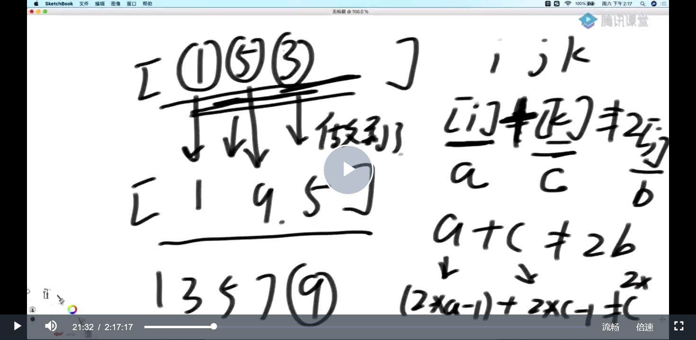
			- 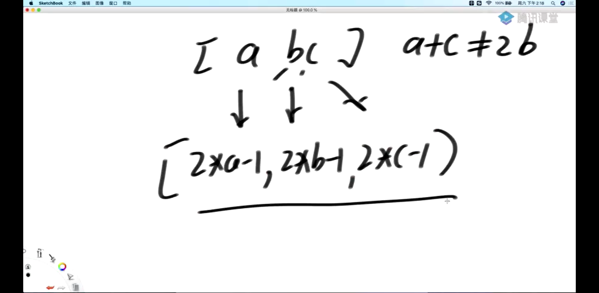
			- 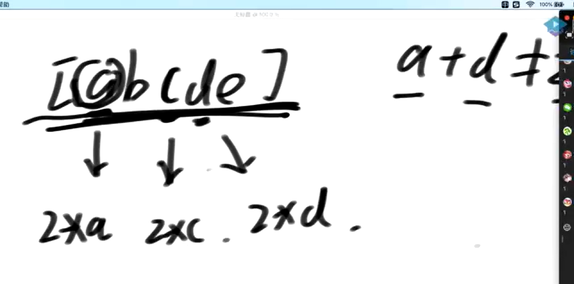
			- 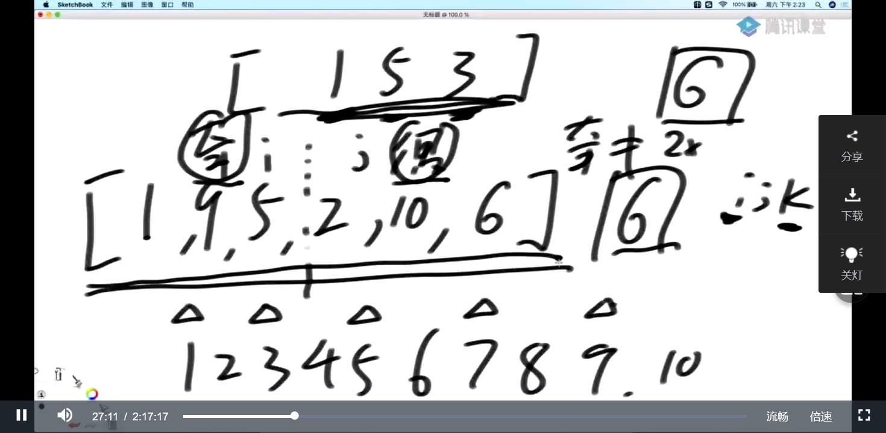
			- 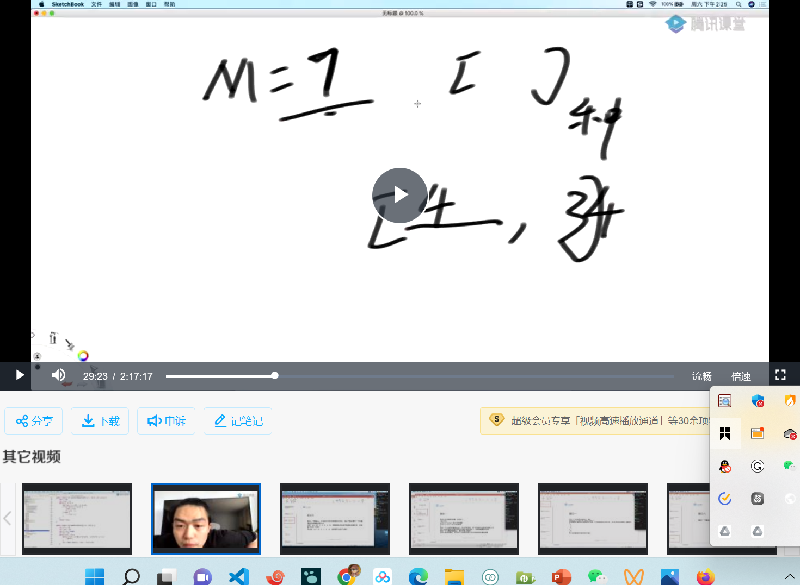
	- 拓展：
	  collapsed:: true
		- 奇数和偶数的其他特殊性质： #奇偶数性质
			- 两个连续整数之和或者之差必然为奇数
				- n和n+1的和是2n+1， 差是1或者-1
				- n-1和n的和是2n-1，差是1或者-1
			- 偶数 × 偶数 = 偶数，奇数 × 奇数 = 奇数， 奇数 × 偶数 = 偶数
				- 只要乘号里面含有1个2的因子，乘积必然就是偶数，乘号里面含有2个2的因子，则乘积必然就是4的倍数
				- 奇数的因子分解中不含有2以及2的倍数而全部都是奇数，两个奇数相乘也不可能生成包含2或者任意偶数的中间因子，因而还是奇数。
			- 在质数里面，只有一个偶数2，其余都是奇数
			-
		-
	- 时间复杂度分析：
		- 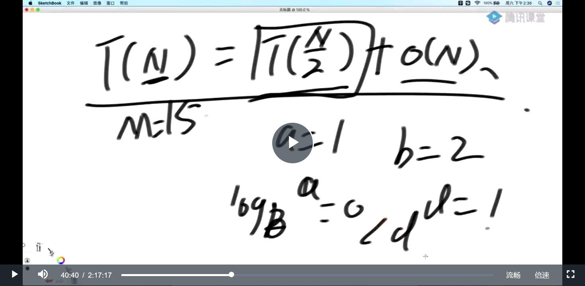{:height 515, :width 1036}
		- 所以复杂度还是O(N)
	-
	-
		-
		-
- # Q7
  collapsed:: true
	- #二叉树搜索  #最大路径和 #分治 #先序遍历 #情况分类 #隐式栈 #递归
	- 问题描述：
		- 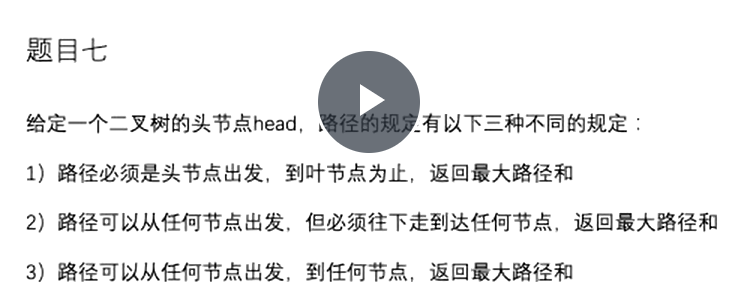
	- 难点：
		- 题意理解：
			- 这里的路径和在默认情况下指代的就是结点的取值之和，而不是叶子节点的值、路径的长度；
			  collapsed:: true
				- 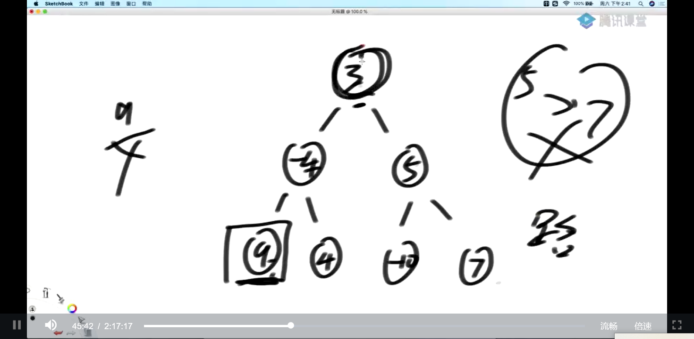
			- 第二个规定和第三个规定其实都放宽了路径起点和路径终点的限制，区别在于路径的方向，第二个规定强调“向下”，第三个规定强调“可以向上，也可以向下”
		- 三个规定的难点其实都是怎么能够搜索到所有的路径以及怎么计算每一条路径的路径和
	- 解题思路和突破口：
		- 第一个
		  collapsed:: true
			- 利用了先序遍历的特点，先序遍历中每当遍历到一个叶子结点时，恰好就形成了一条从根结点到叶子结点的路径，可以利用栈：先判断当前结点是否是叶子结点，是则比较【当前栈中的元素之和 + 当前元素值 】和【目前的最大值】，并进行更新；否则，若有左子树，则先将当前元素加入栈中，递归求解左子树之后，再从栈中移出当前元素，若有右子树，则先将当前元素加入栈中，递归求解左子树之后，再从栈中移出当前元素。这里用栈求解元素之和其实不太方便，用数组、列表求解、或者累计变量都比较方便，这里用栈主要还是利用其先入后出的特征来隔离不同深度和不同叶结点的路径，虽然只使用了一个共用的参数，但是却能同时描述多条路径的情况。
			- 优化的思路是：一种方法是将栈用一个累计变量来替代，栈的添加元素和丢弃元素操作使用累积变量的加和减操作等价替换；另一种方法是利用递归这个过程本身的栈机制，递归函数不停调用自身的过程会形成对应的方法栈，这时候递归函数的参数也在栈中，可以借用这个栈来达到我们所需要的目的。这两种优化方法其实用到的都是隐式栈，前者的栈中只保留加入栈中的元素和，而不单独保留每一个元素；后者中的栈其入栈和退栈操作分别对应递归函数的向下进入和向上返回。
			- 总结：通过前序遍历来搜索到了所有的路径，通过隐式栈求得了路径和
			  background-color:: #264c9b
		- 第二个
		  collapsed:: true
			- 暴力搜索路径的方法：因为开始结点和结束结点都不固定，所以路径的总个数可以说是爆炸的，针对开始结点和结束结点这两个不确定性可以进行类似于二维数组的二维遍历，将数组所有的结点集合记作A,  对A中的每一个结点a，搜索以a为开始结点的包含各种不同结束结点的路径中的最大路径和，或者对N中的每一个结点a，搜索以a为结束结点的包含各种不同开始结点的路径中的最大路径和。但是这样有什么样的问题呢？一是首先得遍历一遍整棵树，把每个结点的指针都保存到列表里面，多了一个预处理；二是“固定开始结点、包含不同结束结点”其实就是以这个固定的开始结点作为根来遍历子树的所有路径，这个时间复杂度等于子树中的结点数，如果树中结点总数为N，那么总复杂度必然是O(N^2)级别的。
			- 优化搜索路径的方法：对路径进行分类。以最大路径和包不包含根结点可以分为两类情况，1）包含根路径，2）是不包含根路径。这两类又可以分别进行细分：对于1），最大路径1 = 根路径 + 左子树中包含根结点的最大路径和，最大路径2 = 根路径 + 右子树中包含根结点的最大路径和；对于2），最大路径1 = 左子树的最大路径和，最大路径2 = 右子树的最大路径和，这两个很明显是子问题了。
			  background-color:: #497d46
			  collapsed:: true
				- 错！对于1），别忘了只包含根结点自身这种情况！
				  background-color:: #793e3e
				- 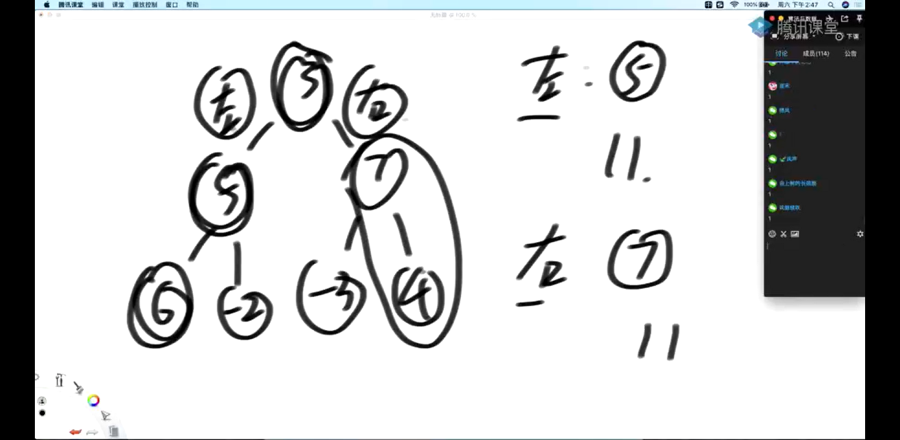
				- 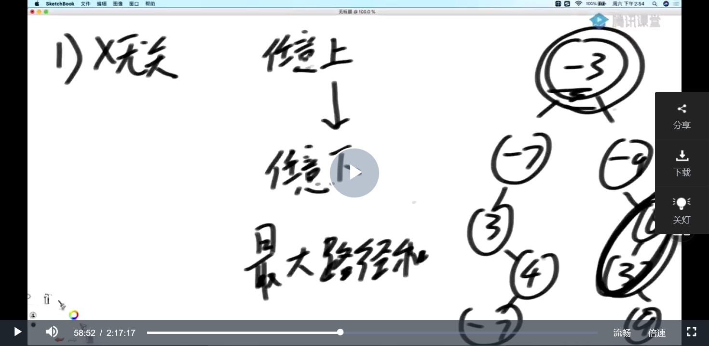
				- 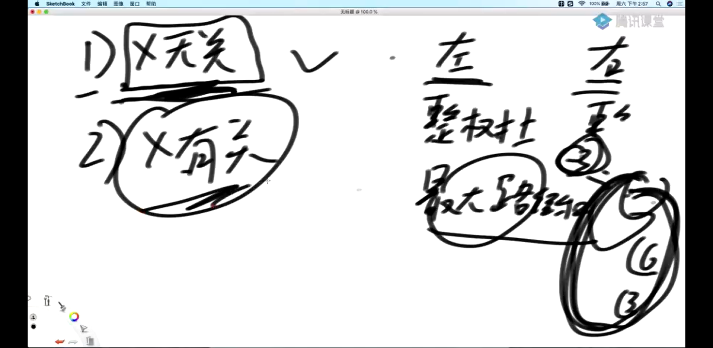
				- 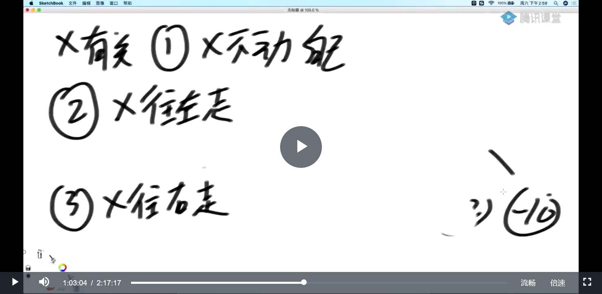
				- 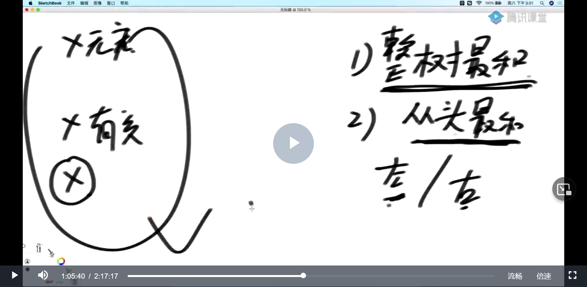
		- 第三个
		  collapsed:: true
			- 与第二个类似，只是分类结果中多了“左子树 + 当前结点 + 右子树”这一种
	- 问题拓展：
	  collapsed:: true
		- 从根结点向下到达任意结点
		- 从任意结点向下到达叶子结点
			- 只需要实现能够求出任意一个结点开头到达所有可能叶子结点的最大路径，就能够通过比较所有不同结点开头的最大路径来求解。从根结点出发能够达到的叶子结点数目也就对应路径数目，其等于左孩子和右孩子结点能够到达的叶子结点数目之和，所以从根结点出发到达叶子结点的最大路径和  其实在【左孩子出发的最大路径和 + 根结点值】和【右孩子出发的最大路径和 + 根结点值】这两者中比较产生，而这两者很明显是子问题了。求解最大值可以嵌套在递归过程中，可以有两种嵌套方法，这两套的不同点就在于递归终止条件的不同，第一套的递归终止条件是遇到空结点返回0，也就是说如果当前结点是叶子结点的话，还会继续向下遍历，这时候函数中只需要将  当前结点求得的最大路径和 和 全局变量max 进行比较和更新就行了；第二套的递归终止条件是遇到叶子结点返回叶子结点的结点值，也就是叶子结点不会继续向下遍历了，这时候叶子结点出发到叶子结点结束这种单结点树就被丢弃了，所以必须要在终止条件处增加与全局变量max的比较与更新。
		- 从左子树的叶子结点向上到达右子树的叶子结点，或者反过来
		-
		-
	- 代码Considerations:
		- 如果树上的结点的值原本就是Integer.MIN_VALUE的话，那么累计求和时int类型必然会丢失精度，导致计算错误等情况，所以此时可以改成long类型来求和
		-
- # Q8
  collapsed:: true
	- #贪心  #难以证明  #题意理解 #情况分类 #工业场景
	- 题目描述：
		- 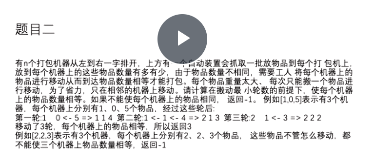
	- 题意理解的难点：
		- 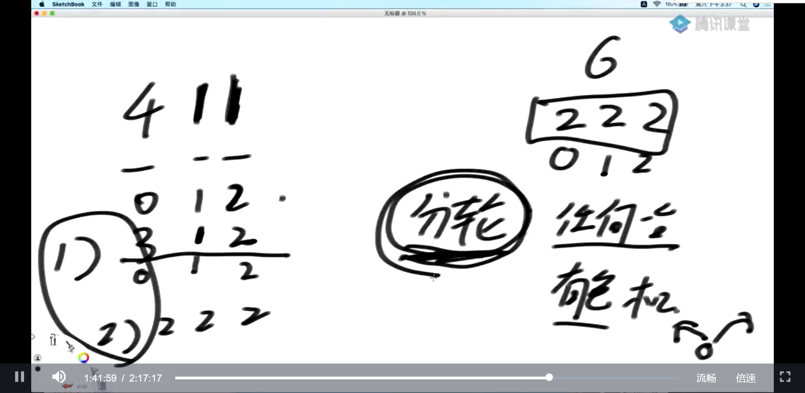
		- 为什么一轮当中多台机器上的物品数目都会变化？而不是一次只变换相邻的一组机器？
			- A, B, C 三台机器，A将物体t移动到B，然后再移动到C，这属于两步操作，也属于两轮；而物体t从A丢向B的同时，物体m从B丢向C，这个时间片还是一个物体在相邻机器间移动的时间，所以仍然属于一轮。
	- 解题难点：
		- 为何每个位置的瓶颈值能够约束整个问题的解？又为何瓶颈的最大值是问题的解？
		- 为什么不需要考虑具体的移动过程？能够把问题变成求解一个可行的移动路径吗？移动路径要怎么形式化表示呢？
		- 达到这个移动的终点是逐个把每个位置的物体数目移动到平均值，还是几乎同时把所有位置的物体数目拉到平均值？这个跟拼魔方的过程很像，是要同时把所有魔方的面都拼好的？魔方的公式到底是如何发挥作用的？
	- 解题思路：
	  collapsed:: true
		- 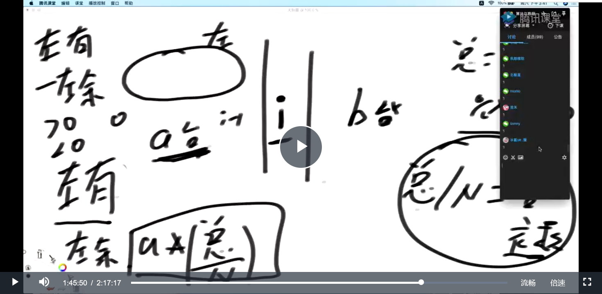{:height 515, :width 1036}
		- 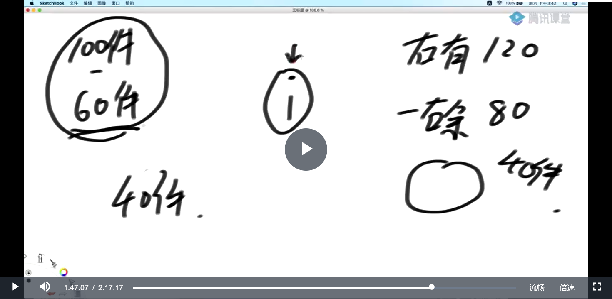
		- 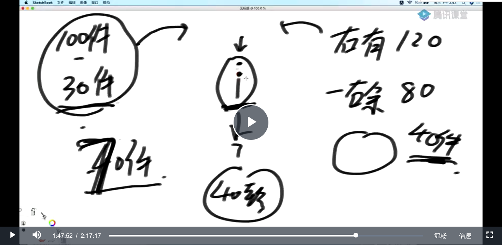
		- 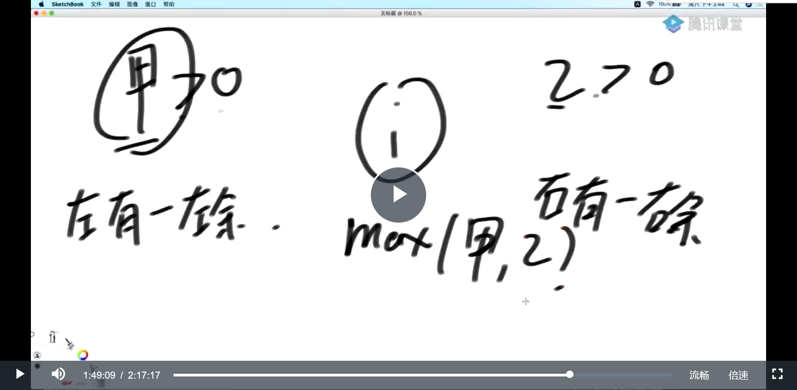
		- 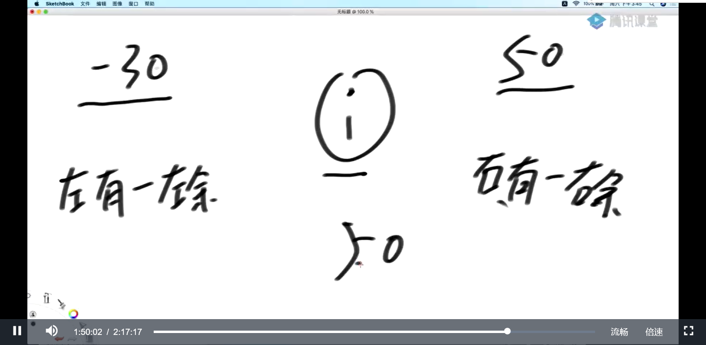
		- 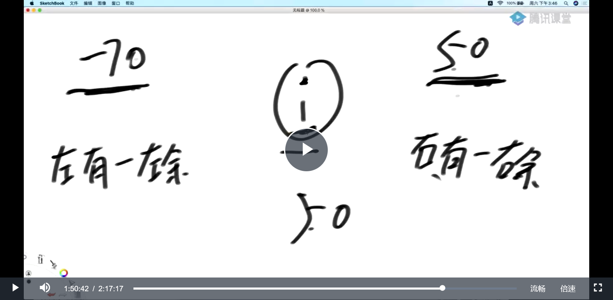
		- 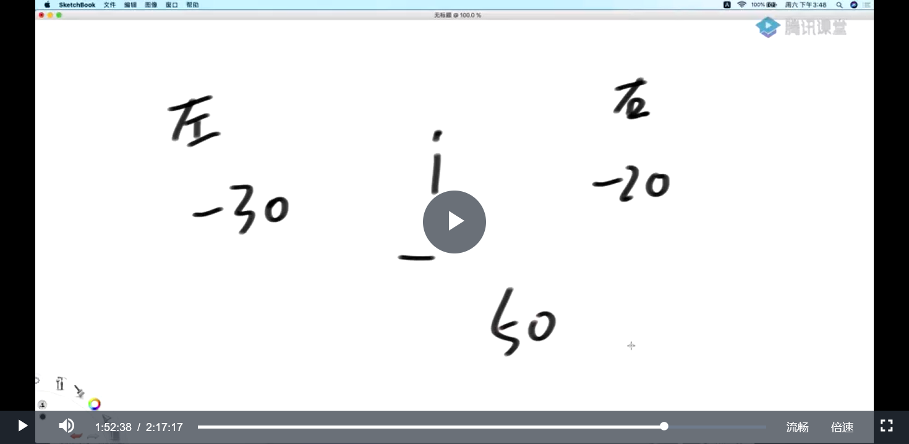
		- 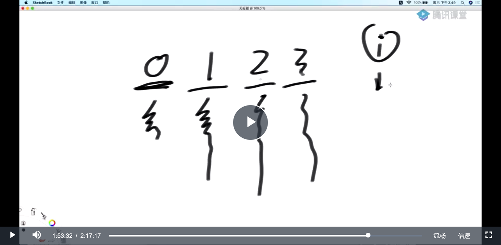
		- 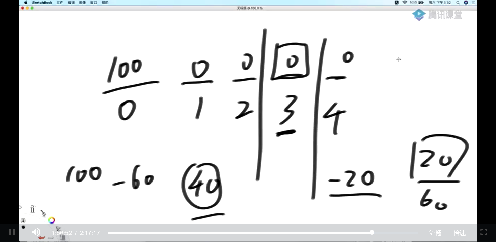
		- 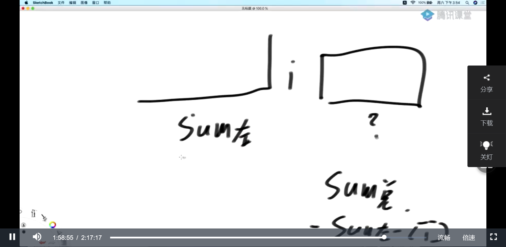
	-
- # Q9
  collapsed:: true
	- #数组 #差的绝对值 #数组分隔 #绝对值 #问题的重构 #绝对值去括号技巧
	- 算法描述：
		- 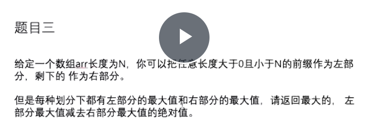
	- 题意难点突破
		- 绝对值是这类题目设置的最大障碍，或者说障眼法。
		- 其设问方法按照  绝对值和普通运算的顺序关系  可以分为两类：
			- 两个（少数情况下是三个）变量 和 或者 差 的 绝对值，形如| A + B |或者| A - B |
				- 如果要求该最终绝对值表达式的最大值和最小值会很困难，这是因为 由 “最大或者最小” 很难定位到 A 和 B各自的性质，其结果是由正负号和取值范围这两个共同决定的
				- [1]当A和B的可能取值范围都有正有负时：
					- |A + B|中Ａ和Ｂ的正负性　有四种，很明显　同正同负　比　异号　取得更大值的大，比如若A 属于 [-3，1 ], B属于 [-2，5]， 同正时 |A + B|最大为6，同负时|A + B| 最大为5，而相异时|A + B|最大为|-1 + 5| = 4；
					- |A - B| 中A和B相异时能取得最大值;
				- [2]当A的取值范围只有正，B的取值范围只有负时：
					- | A + B| 需要比较 |A 的最大正值 + B的最大负值| 和 | A的最小正值 + B的最小负值|；
						- 比如A 属于[2,5]，B属于[-1, -8],  | 5 - 1| = 4, |2 - 8| = 6；
						- 比如A 属于[2,5]，B属于[-1, -2],  | 5 - 1| = 4, |2 - 2| = 0；
						- 比如A 属于[2,5]，B属于[-1, -6],  | 5 - 1| = 4, |2 - 6| = 4；
					- | A - B| 固定为 | A的最大正值 - B的最小负值| ，利用坐标轴可以很容易搞懂这个；
				- [3]当A和B的取值范围为同正或者同负时：
					- 利用坐标轴关系，容易知道，同正时|A + B|当A和B都取得最大值时最大，同负时当A和B都取得最小值时最大
					- A属于【x1，x2】, B属于【y1, y2】, 则同正或者同负时|A-B|的最大值等于|max(x2, y2) - min(x1, y1)|
				- 由[1],[2],[3]可知，|A + B| 和 | A -B | 的最大值只有在A和B的范围明确之后才能进行优化
			- 两个（或者可能是多个）变量 绝对值 的 和或者差，形如 |A|  + |B| 或者 | A| - |B|
				- |A| +|B| 同时使得|A|和|B|获得最大值即可
				- |A| - |B| 肯定是 max(|A|) - min(|B|)
	- 解题思路：
		- 暴力方法是：对于每个分割位置，求出左部分和右部分的最大值的差的绝对值就行。可以通过辅助数组遍历一遍，从而方便获得左右部分的最大值。时间复杂度O(N)。但是这种方法并没有抓到这个问题的实质，非常依赖于每个位置所求的左右部分的最大值
		- 遍历数组，求出数组的最大值max。由题目设定，左右部分都不为空，所以要么左半部分包含最大值，要么右半部分包含最大值。然后，有一个最容易被忽略掉的逻辑关系，所求的绝对值表达式必包含数组的最大值，那么此时绝对值表达式退化成 = max - 另外一部分的最大值。能够将max划分到左半部分的划分方式有很多种，我们希望划分的有半部分的最大值最小，毫无疑问可以将右半部分划分为只包含数组最后一个元素，其他划分方式中有半部分的最大值必然是大于等于数组最后一个元素；同理对于能够将max划分到右半部分的方式中，毫无疑问将左半部分划分为只包含数组第一个元素时最好。
			- 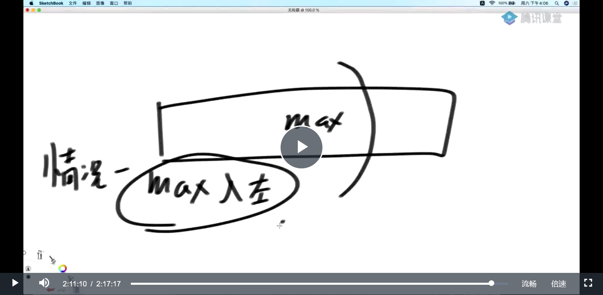
		-
- # Q10
  collapsed:: true
	- #集合  #公共因子 #并查集 #质数因子  #并查集构建的优化
	- 题目描述：
	  collapsed:: true
		- 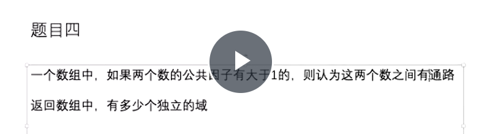{:height 227, :width 795}
	- 题意难点：
	  collapsed:: true
		- 这里的公共因子并不一定是质因子。所有的公共因子都可以拆解成质因子的乘积吗？
			- 是可以拆，但是最终的域却并不一定是以质因子为单位的。比如[12, 24, 36, 48]就只能是一个域。
		- 两个数之间的公共因子很多，这里指代的是两个数的最大公共因子吗？比如12和24的公共因子是12，还是2,3,4,6呢？
		- 这里的域是要求域中的数两两都能连通 还是说  只要整体上是连通关系就行了呢？ 同一个域中连通的数都必须是相同的公共因子吗？
			- 如果是整体连通，问题简单了，只有两个质数之前其公共因子才只有1，也就是说两个质数之间相互是没有通路的。
				- 如何判断两个数是否有除1以外的公共因子？
				- 如何快速跳过已经在已有域中的数组元素？
					- 错！已经在已有一个域内的元素有可能出现其在其他域的！也就是说这里的独立域中的独立并不是域和域之间元素不重合的意思，而是两个域中找不到任何一对元素之间是有大于1的公共因子的，不然这两个域就可以直接连接成一个域了！判断的过程应该是：arr[0]和哪些数组元素在一个域内？arr[1]和哪些数组元素（不需要判断与arr[0]了）在一个域内？... 。很明显这样的判断次数是n^2级别了。
	- 正确题意：
	  collapsed:: true
		- 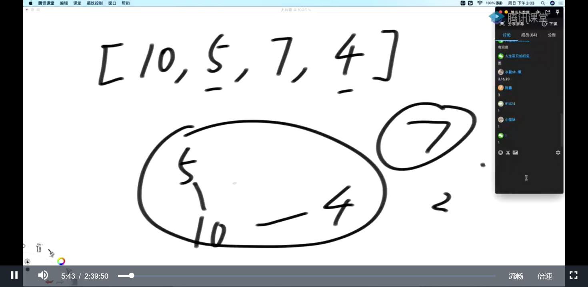
		- 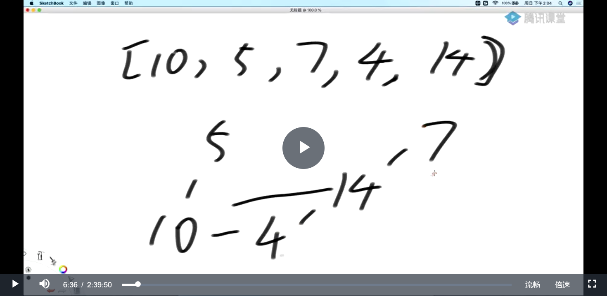
		-
	- 解题思路：
	  collapsed:: true
		- 方法1：基础的并查集
			- 并查集支持  判断两个集合是否属于同一个集合、合并集合  这两个操作，且复杂度都是O(1)。在这里可以认为数组中的每个元素最先开始都是单独的一个集合，然后通过多次执行【【判断X和Y集合是否issameset】和【合并X和Y集合】】这个流程，左神指出可以先执行多次【判断X和Y元素issameset】再多次执行【若同属一个集合，则合并】，也就是说两个子操作不一定需要打包在一起同时进行，为什么呢？那只能说因为这两个操作时逻辑上独立的，可是合并难道不依赖于是否issameset的结果吗？个人推测是前者的执行结果可以反映在某些变量上，而这些变量在第二个子操作的内部是可以直接获取的。个人觉得两者的顺序是不能颠倒的。
			  collapsed:: true
				- 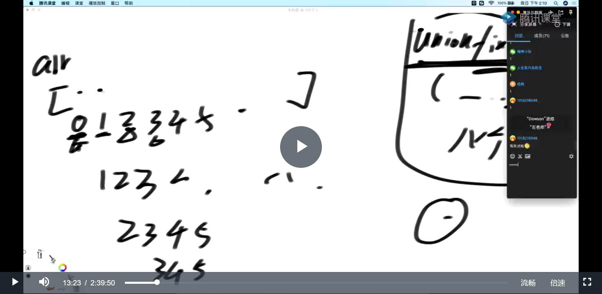
				- 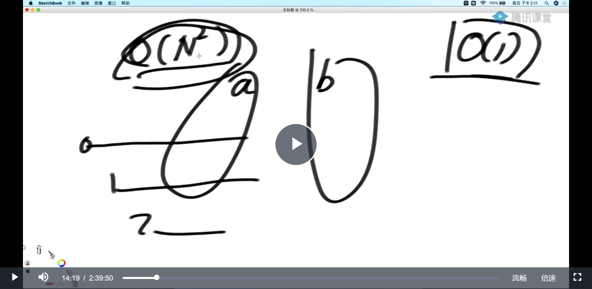
			- 对于arr[0]判断其与arr[1..N-1]等元素构成的并查集，对于arr[1]判断其与arr[2...N-1]等元素构成的并查集，...,  所以总的复杂度是O(N^2)。
		- 方法2：提取质数因子法
			- 原理和流程：
			  collapsed:: true
				- 依次遍历数组元素，对每个元素求其质数因子，使用map来记录包含同一质数因子所包含的元素集合，当该质数因子第一次出现的时候，则在map中创建对应的一条记录，记录的key值为质数因子值，value为当前数组元素的索引，当该质数因子不是第一次出现时，在map的对应记录的value中增加当前元素的索引值，最后得到的map表就是：数组中所有出现的质数因子  及其 出现的数组元素位置列表了，对map的value求并集，也就是说如何两个记录的value中有相同元素，就将他们进行合并。
				  collapsed:: true
					- Q1：map的key能是一个list吗？
					- Q2：这个合并过程也相对麻烦吧？
					- 所以上面必须优化为：出现一个新的质数因子时，就创建一个对应的arraylist， 将当前数组下标作为该arraylist的第一个元素，后面元素再次出现相同质数因子时，将下标加入到对应arraylist中。这样解决了map不好映射为list的问题，但是这时候arraylist的合并貌似也比较麻烦？
					- 所以继续优化：遍历元素时，若有新的质数因子出现，才新增一条记录，从第二个元素开始，判断其质数因子的分解结果中是否有已经在map中出现的，如果有，就将当前元素和map中相应记录中的元素合并到了一个并查集中去。
						- 比如[20, 7, 6, 14, 15]：
							- 20 =》map [2, 0] [5, 0]
							- 7 =》map [2, 0] [5, 0] [7, 1]
							- 6 =》map [2, 0] [5, 0] [7, 1] [3,  2]  20和6都有一个因子2，所以20和6合并，S1 = {6, 20}
							- 14 =》map [2, 0] [5, 0] [7, 1] [3,  2]  14和20有因子2，14和7有因子7，所以14和20合并，S1= {6, 20，14}, 14和7合并，S2= {14,  7}
							- 15 =》map [2, 0] [5, 0] [7, 1] [3,  2] [5, 4]  15和6都有因子3，随意15和6进行合并，S1 = {6, 20, 14, 15}
							- 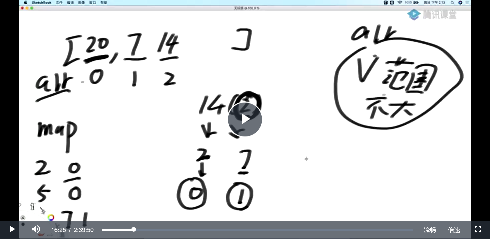
				- 
			- 复杂度：
			  collapsed:: true
				- 遍历一遍数组即O(N)，单个元素X进行质数因子分解为O(X)，也就是其复杂度与X的大小有关，假设数组元素中的最大值为V，则数组中元素进行质数因子分解的复杂度记作O(V)。总复杂度为O(NV)。
					- 
			- 总结：
				- 本质就是优化了并查集的构建，减少了无关集合是否在同一集合的比较次数，变被动地无序搜素变成有目标的寻找
				- 但是计算目标的过程需要耗费一定时间，所以当数组元素值过大时，时间消耗反而比基础的并查集法要高
		- 两种方法的选择：
			- 当V比较小，NV < N^2， 也就是当数组中元素的最大值 小于  数组长度N时，选择第二种方法更快；当V比较大，选择第一种更快
			  collapsed:: true
				- 
		- 终极优化版：
			- 为啥可以继续优化？
			  collapsed:: true
				- 提取质数因子法中的质数因子可以被拓展到“代表因子”这个更大的范畴，质数因子代表了数据之间相互连通的某种属性，可以换用其他“代表因子”来优化算法
					- 
			- 具体优化过程：
				- 不需要求质数因子，只需要求出其所有可能的 X * Y 的乘积分解式。如下图所示，X在【1，(int) sqrt(N)】之间进行搜索，然后 所有乘积分解式中 除了1以外的因子  都回被放入map当中，剩下过程与方法2相同。
					- 
				- 时间负杂度：
					- 固定为O(N sqrt(V))
					- 
					- 
				-
			-
		-
	- 相关：
		- 求解质数
		- 求解质数因子
		- 求最大公约数 #辗转相除法
		  collapsed:: true
			- 当两个数不是特别大时，可以认为这是一个O(1)的方法
			- 
- # Q11
  collapsed:: true
	- #贪心  #字典序  #字符串
	- 问题描述：
		- # 
	- 问题理解难点：
	  collapsed:: true
		- 字典序最小？是指每个字母的字典序号相加之和最小吗？
			- acb  与  bac 很明显如果按照这种理解 字典序就是一样的，所以不是。
			- 这里说的是逆序数之和吗？不是，按acb中的逆序只有cb, 逆序数为1; bac中的逆序只有ba, 逆序数也为1。所以逆序数并不能够完全区分两个字符串的不同字母排序组合。
		- 字典序最小的结果唯一吗？
			- 可以先从题设的例子来进行判断，"acbc"去重后要么是“abc”, 要么是“acb”，很明显答案是“abc”，此例解唯一；“dbcacbca”重复数大于1的包括a、b、和c，如果穷举每个字母可以删除的位置数，那用于进行筛选的结果有 2 * 2 * 3 = 12种，d只有1个，所以必然保留，后面的字串中直观观察到是存在“abc”这个完全顺序的组合的，且其需要删除的字母是固定的，如果把此例改成“dbcaaaccbbbcac”或者“dbcacabca”就会发现得到“dabc”这个最优解的删除位置不唯一了。于是，可以得到的结论是，字典序最小的结果唯一，但获取这个唯一结果的方式并不一定唯一。
		- 字典序最小问题中存在的隐含约束？
			- 这个过程可以看做是从字符串中依次选择特定字母。假设当前已经选择好的字母组成的字串为A, 目前正在字符串中挑选字母x，假设选中的位置为pos， 则pos+1开始的字串中必须要包含 除了 A + X以外的所有字母，否则当前进行的这趟字母选择就必然是失败的。
				- 所以要怎么保证这个约束能够满足呢？这个约束一定能够被满足吗？
					- 可以求出每个字母在字符串中最后一次出现的位置，每个字母都必须在这个最后位置之前被选中，否则会破环这个约束。
			- 要想让字典序最小，其实就是尽可能让 这个特定字母集中的字母按照字母表进行排序，如果能找到这个完美的子序列，则直接得出答案。可以万一找不到要怎么办呢？
			- 以上的字母顺序的预期性 和  字母选择的完整性 构成必须同时满足的两个约束， 可能会存在冲突，比如“dabc”如果按照预期性就会先选择“abc”，可是这时候的“d”就丢失了。字母选择的完整性必须得确保，在此基础上使得  字母顺序的预期性  达到最好。
		- 定义：
			- 
			- 长度相等，则按照字面值进行比较；长度不等，短的那个后面补充0进行比较。其实这个比较里面暗含了位置是具有优先级的，比较的时候逐个进行，如果当前字符相等，则继续向下比较，如果当前字符不等，那么当前字符小的那个必然要排在当前字符大的那个前面，此时无论后续的字串之间是什么关系都无需再进行比较了。
	- 解题思路：
		- 暴力思路：
		  collapsed:: true
			- 穷举法：按照字母表顺序，逐个判断以其开头是否存在满足的解，第一个找到的即为最终解。
				- 比如“dcaabeb”中包含的字母是a,b, c, e，d
					- 假设第一个字母选择a，则在beb中寻找后三个字母，很明显beb中不包含d，所以假设不成立
					- 假设第一个字母选择b, 则在eb中寻找后三个字母，很明显假设不成立
					- 假设第一个字母选择c，则在aabeb中选择后三个字母
						- 假设第二个字母选择a，则在beb中寻找后三个字母，很明显beb中不包含d，所以假设不成立
						- 假设第二个字母选择b，则在eb中寻找后三个字母，很明显eb中不包含a和d，所以假设不成立
						- 假设第二个字母选择e，则在b中寻找后三个字母，很明显b中不包含a和d，所以假设不成立
					- 假设第一个字母选择d
				- 可以看到：这种方法与字符串本身的值息息相关，最坏情况下的复杂度粗略估计是O(NK^K), 其中K是字母表中的字母种数
		- 思路概括：
		  collapsed:: true
			- 
		- 举例：
		  collapsed:: true
			- {:height 590, :width 1186}
			- 
			- 
			-
		- 误区：
		  collapsed:: true
			- 
	- 时间复杂度：
	  collapsed:: true
		- 
		-
- # Q12
  collapsed:: true
	- #情况分类  #几何关系  #复杂问题简化 #hashmap嵌套 #几何关系的等价性
	- 问题描述：
	  collapsed:: true
		- {:height 190, :width 705}
	- 题意难点：
	- 解题思路：
	  collapsed:: true
		- 基本流程：
		  collapsed:: true
			- 
			- 
		- 优化流程：
		  collapsed:: true
			- 
			-
		- 代码实现的难点：
			- 
			- 
			- 
			-
			-
		-
	-
- # Q13
  collapsed:: true
	- #递归问题  #穷举 #动态规划/空间压缩  #dp数组先构造后理解
	- 问题描述：
	  collapsed:: true
		- 
	- 解题思路-方法1：
	  collapsed:: true
		- 通过递归来穷举所有的贿赂与不贿赂的结果，在递归过程中来寻找这个最小钱数。那么递归的思路是什么？
		  collapsed:: true
			- 每次递归都对应于一个打怪兽的状态。当前我已经积累的能力记作ability, 目前需要通过第index号怪兽，每个状态都能获悉所有怪兽的能力和要求的钱。
			- 如果当前状态下的能力ability小于index号怪兽的能力，则只能贿赂，ability进行对应的增加；
			- 如果当前状态下的能力ability大于index号怪兽的能力，分别计算 【选择贿赂，ability增加】，【选择不贿赂】两种情况下的钱数，取两者的最小值就行。
			  collapsed:: true
				- 
				  collapsed:: true
					- 
					- 
	- 解题思路-方法2：
	  collapsed:: true
		- 递归方法的优化
		  collapsed:: true
			- 为啥可以被优化？
				- 因为递归过程的状态之间存在顺序上的依赖关系，其反映在dp数组上就是数组的坐标范围
			- 如何优化？
				- 这里dp数组构造的难点是什么呢？
					- 行坐标为每个递归的层次，或者说怪兽的序号。问题就是每个序号位置对应的结果是什么呢？或者说列坐标是什么呢？
				- 有两种可能的dp数组
					- dp[i][j]表示遇到第i号怪兽刚好花钱为j时的能力数
						- 对于二维几何问题的dp会发现每一个i和j对应的dp[i][j]都是有效的，也就是说每个dp[i][j]都是横坐标规模为i和纵坐标规模为j的一个有效解，但是很多问题中的dp[i][j]其实会对应一个无效解，通常表示为-1，也就是说当横坐标规模为i时，对应的纵坐标不可能为j，i和j同时出现一定是不可能的。
							- 这种无效解存在的意义是什么？其实就是排除搜索过程中的无效状态
						- 若用此种模式构建dp数组，则j=0的列必然全部赋值为-1，因为这里的d数组和p数组都是正数，而初始能力为0，所以通过任意个怪兽需要的money都不可能为0，或者说通过第0号怪兽就需要money了，对于i=0也就是第一行，只有当j = p[0]时才能通过，所以其余的dp[0][j]都赋值为-1，很明显这里当 j > p[0]时，很明显就是在花更多的钱来通过一个怪兽，这显然与所求违背。那么其余位置的dp[i][j]要怎么递推出来呢？
							- 考虑当前的i号怪兽需不需要贿赂
								- 如果当前怪兽贿赂了，则当前怪兽必然能够通过，
									- 但是需要检查一下dp[i-1][j-p[i]],  看看其是否是有效解
										- 如果为-1，则说明打败0到i-1号怪兽使用j-dp[j]的money是没法做到的，那么此时dp[i][j]也是无效的;
										- 如果不为-1，则说明打败0到i-1号怪兽使用j-dp[j]的money刚好可以做到，此时dp[i][j] = dp[i-1][j-p[i]] +  d[i];
								- 如果当前怪兽不进行贿赂，需要检查一下dp[i-1][j]是否是有效解
									- 如果是无效解，dp[i][j]也是无效的
									- 如果是有效解，得继续判断 dp[i-1][j] >= d[i]，如果满足，则 dp[i][j] = dp[i-1][j], 如果不满足，dp[i][j]依旧是无效解
							- 总结：
								- 可以看出这里的递归过程的分支有两个，但是其中一个子分支又分为两个分支，分支的判断条件都是dp[i][j]的值，也就是能力值。当前能力  与  怪兽能力  的不等关系，是推进这个递归过程往下进行  或者  说是路径向下搜索的  依据。
								- 根据这个递归过程可以知道，dp数据的每一行可能存在不止一个有效解，因为可能中间步骤有不同的选择但是最终都能够通过当前怪兽，可以举个例子：
									- d： [5,   4,  9]
									- p:    [3,  5,  7]
									- 一种选择是：花3元通过第一个怪兽，不花钱通过第二个怪兽，花7元通过第三个怪兽，花费的是总金额是10元，获得的总能力是14
									- 另外一种选择是：花3元通过第一个怪兽，花5元通过第二个怪兽，不花钱通过第三个怪兽，花费的总金额是8元，获得的总能力是9
									- 所以dp[2][10] = 14 和 dp[2][8] = 9 是两个有效解
							- 答案：假设怪兽的总个数为N， 则dp[N-1]那一行中不为-1的第一个值所对应的列序号即为所求。
						- 图示：
							- 
					- dp[i][j]表示遇到第i号怪兽刚好能力为j时的最小花钱数
						- 初始化
							- 当 j = 0时，任何怪兽都没办法通过，所以dp[i][0]全部赋值为-1
							- 当 i = 0时，当能力j < d[i]时，必须要贿赂怪兽，dp[i][j]都赋值为p[i],  当j >= d[i]时，可以选择贿赂怪兽，也可以不选择贿赂怪兽，dp[i][j]为两种选择中的最小值，很明显是不花钱贿赂的数目要小
								- 但是这里很明显存在一个问题，遇到0号怪兽的时候能力有可能达到任意的j吗，毫无疑问不可能，遇到0号怪兽时的实际能力要么为0（不能通过第0号怪兽），要么为d[i], 也就是说dp[0][0] = -1, dp[0][d[i]] = p[i], 中间的其他能力状态都是不可能的，所以这些能力状态对应的dp[0][j]其实都为-1。
						- 递推过程
							- dp[i][j]到底如何向上递归呢？
								- 贿赂当前的第i号怪兽，那么需要判断dp[i-1][j-d[i]]是否为有效解，如果有效，则当前也有效，且dp[i][j] = dp[i-1][j-d[i]] + p[i]，如果无效，则当前也无效
								- 不贿赂当前的第i号怪兽，那么判断dp[i-1][j]是否为有效解
									- 如果有效 且 j >= d[i], 则当前也有效，且dp[i][j] = dp[i-1][j];
									- 如果有效 且 j < d[i], 则当前无效
									- 如果无效，则当前无效
							- 此时dp数组中dp[i]所对应的行中有效解中的最小值即为最终答案
							-
					- 对比：
						- 两种方案都可以，但是前者找最小值比后者方便，后者需要进行一次额外的一维遍历;
						- 两种方案中的递推公式都需要进行分类，前后规模解之间  能力关系的不等式  是分类的依据
						-
			-
		- 举例：
		  collapsed:: true
			- 
			- 
			- 
			- 
			- 
		- 此dp数组适用于钱数之和不大的情况下，此时能力的值是数组的元素值，可以设置为long类型，并不决定dp数组的大小。
		  collapsed:: true
			- 
			- 下图是腾讯的原题，很明显这时候dp的列应该选择用钱数而非能力数，不然复杂度过高
			  collapsed:: true
				- 
					-
- # Q14
  collapsed:: true
	- #字符串  #回文串  #动态规划/空间压缩  #字符串中的动态规划
	- 问题描述：
	  collapsed:: true
		- 
	- 解题前思考：
	  collapsed:: true
		- 添加的位置是任意的
		- 如果本身是回文串，无需添加
		- 两个不同字符，比如mn, 则需要添加两个字符，成为nmmn或者mnnm
		- 最坏的情况就是字符串中没有任何可以成对的字符，比如abc，则最少需要添加成为acbca或cabac，需要添加两个字符
		- 关于原始字符串的中心轴没有成对的字符，但是有相同的字符，比如acdekamxymatk, 我觉得应该是以每对相同字符的中心轴来统计其对应的字符成对数目，以成对数目最多的中心轴来计算需要添加的字符数目，比如这里是以“amxyma”这个子串的中心轴来计算，添加字符的数目是 左边子串“acdek”的长度 + 右边子串“tk”的长度 + 中间不等子串“xy”的长度 = 5 + 2 + 2 = 9；
			- 需要添加字符的数目计算不对！只要中心线左右两边有相等的字符，其实都可以通过添加字符变成回文
				- 这里的acdekamxymatk可以变成acdektamxyyxmatkedca, 需要添加的字符数是 2 + 1 + 4 = 7；
				- 所以可以使用中心线方法来解题？字符长度为n，则有n+1个中心线位置，对于每个中心线，中心线左右两边相同的字符尽量凑成一对，但是不是所有相同的字符恰好都能凑成一对，比如“tamnqta”, 若分界线划分为 ta|mnqta，则t和a不能同时成对，因为在分界线左边，t在a的左边，在分界线右边，t依旧在a的左边，两者不是成镜像的，若选择分界线左右的t成对，则需要添加的字符数 = 左边“a” + 右边“mnq” + 右边“a” = 5， 若选择分界线右边的a成对，则 需要添加的字符数 = 左边“t” + 右边“mnqt” = 5。这种方法存在很多问题：
					- 如果分界线两边相同的字符不止一对呢？比如左边有1个a，右边有2个a
					- 两边出现的多对字符之间构建回文串可能会出现相互之间的矛盾？怎么选择添加字符最少的？
		- 使用分治？左边回文串 + 右边回文串 是否就是一个更大的回文串了？
			- ABBA + CDDC = ABBACDDC，不对
		-
		-
	- 解题思路：
	  collapsed:: true
		- 
		- 
		- 
		- 
		- 
		- 
		- 
		- 
		-
		-
	- 问题拓展：
	  collapsed:: true
		- 不仅仅求需要添加的字符数，还要求这样的一种结果/一种决策路径，该怎么求呢？
		  collapsed:: true
			- 利用动态规划表可以得到，但是需要一些加工过程
			- 案例：
				- 
				- 
				- 
				- 
				- 
				- 
				-
			- 如果动态数组进行了空间压缩，则路径不好回溯
	-
- # Q15
  collapsed:: true
	- #哈希表  #单链表  #背景理解  #多种数据结构混用
	- 问题描述：
		- 
	- 题意理解：
		- 视频直播场景：
		  collapsed:: true
			- 
	- 解题思路：
		- 头表和尾表
		  collapsed:: true
			- 
			- 
			- 
			- 
			- 
			- 
			- 
			- 
			- 
				- 彼此连接和查询的操作都是O(1)
				- 哈希表和单链表的合并
			- 
			-
- # Q16
  collapsed:: true
	- #零花钱问题 #双重动态规划 #线性组合问题使用动态规划  #计数问题 #动态规划/动态规划中的斜率优化
	- 题目描述：
		- 
	- 题意理解：
		- 纪念币中选一个3 + 2也可能有两种方案，因为纪念币中是可能有重复值的，所以3元和2元的纪念币也不止一个
		  collapsed:: true
			- 
		- 难点是可能的方案太多，而且没有规律可循，无非是只选择普通币，只选择纪念币，同时选择普通币和纪念币，但是这三类都没法具体分析种类数？
	- 解题思路：
		- 第一个动态规划-普通币
		  collapsed:: true
			- 对于无重复的普通币来说，构建如下dp数组
				- 行号0 1 2表示的是无重复普通币的币值数组，纵坐标表示的是面值总额，dp[i][j]表示的是在可以自由使用0到i号货币的情况下达到面值j元的方案数目
				  collapsed:: true
					- 
				- dp数组的初始化
					- 0列的初始化
						- 0元只有一种方案，那就是什么货币都不选择；**任何动态规划都来自暴力递归**，考虑面值为0元是暴力递归里面需要考虑到的终点情况
						  collapsed:: true
							- 
					- 第0行初始化
					  collapsed:: true
						- 0号普通币面值的整数倍
						  collapsed:: true
							- 
						-
					- 状态转移方程 【**通过枚举来优化转移方程**】
					  collapsed:: true
						- 
						- 当前i号普通币对应的纸张数最多可以使用多少张，是由dp[i-1][j-n * m[i]]中的j - n * m[i]不越界就可以了，j - n * m[i]一旦开始小于0，这个n数就过大了。
							- {:height 358, :width 714}
							- 
							- dp递推中可能会出现  当前dp值  = 若干（>=3）个其他dp值的和，但是这种情况可以优化成一般情况的递推式。优化如下
								- 
								- 
								  id:: 6321f664-2f8d-4afc-b4e1-feafb0d66e7a
							-
							-
		- 第二个动态规划-纪念币
		  collapsed:: true
			- 典型的0-1背包问题
			  collapsed:: true
				- 
		- 既选择普通币，也选择纪念币
		  collapsed:: true
			- 将面值拆分成两个整数a和b之和，a通过普通币来实现，b通过纪念币来实现，方法数的乘积即为最终方案数
			  collapsed:: true
				- 
			- **这种分类其实可以覆盖前两种分类，因为当a=0或者b=0时，就退化成前两类情况了，所以具体代码实现时可以只用这一种分类**
			-
		-
- # Q17
  collapsed:: true
	- #数位dp  #按照位置进行分类  #情况分类
	- 问题描述：
	  collapsed:: true
		- 
	- 问题理解：
	  collapsed:: true
		- 
	- dp模型的六种：
	  collapsed:: true
		- 以下是面试中涉及的（95%都是以下6中），但是学术中远不止这么多：
			- 
		- 面试中5%的dp包括数位dp
		-
	- 解题思路：
		- 整体思路：
			- 【1】当最高位为1时：（以13625为例）
				- 把给定的数拆解成两部分求解，一部分A使用非递归方式求解1的个数，另一部分B使用递归方式进行求解。可以发现，拆解的规律是A的范围是【原数去除最高位+1，原数】，B的范围是【1，原数去除最高位】。可以发现A中原数的最高位只有0和1两种选项，而其余位置均可以自由地选择0到9，且这些位置选择0到9时相互是没有干扰或者说是没有约束关系的，但是这时候最高位的0和1数值范围的约束则只能选择其中的一个值，最高位的数值由次高位的数值来决定，假设原数最高位的数字为s，次高位的数字为t，则当次高位的数值取在[0，t-1]时最高位必然取s,当次高位的数值取在t时最高位可以取0或者s，当次高位的数值取在[t+1,9]时最高位只能取0；B中则在其对应的每个数值位置上都有对应的范围，并不一定都能从0取9，但每个位置是相互不干扰的。
				- 为什么不按照位数来进行划分呢？比如下图中的13625，为何不划分为0-9999和10000-13625呢？
				  collapsed:: true
					- 从后面的分析中可发现前者这种划分中3626-13625之间的个十百千位置上的1都刚刚好是1000个，而0-9999和10000-13625若选择0-9999进行非递归计算，则其个十百千位置上的1也都刚刚好是1000个，若选择10000-13625进行非递归计算，其个十百千位上的1需要依据具体数值分别计算机，毫无疑问如果要选择肯定选择0-9999，但是10000-13625这个区间没有办法进行递归了，因为其区间起点不是从0开始的。
				- 为什么要使用非递归处理？
				  collapsed:: true
					- 因为这里的递归终点“个位数中只有一个1”没办法使用。
				- 示意图：
				  collapsed:: true
					- 
					- 
				- 过程详细说明：
					- 终止条件：
					  collapsed:: true
						- 当只有个位数时，必然只含有1个1
						  collapsed:: true
							- 
							-
					- 万位上包含1的数目是：
					  collapsed:: true
						- 
						- 
					- 千位上包含1的数目是：
					  collapsed:: true
						- 
						- 
					- 百位上包含1的数目是：
					  collapsed:: true
						- 
						- 
					- 十位上包含1的数目是：
					  collapsed:: true
						- 1000
					- 个位上包含1的数目是：
					  collapsed:: true
						- 1000
					- 1的总个数为：
						- 
						-
			- 【2】当最高位不为1时：（以3625为例）
			  collapsed:: true
				- 还是按照数值位统计1的个数：
				  collapsed:: true
					- 规律是每个数值位右侧更小的数值位在0-9内任意选择，左侧的数值位则需要考虑是否在整个数据的范围内
				- 最高位上1的个数：1000
				  collapsed:: true
					- 
					- 
					-
				- 次高位（或者说百位上1的个数）：300
				  collapsed:: true
					- 
					- 
					- 当百位上为1，比如126-3125时，1的个数也是3 * 100个，因为最先开始的126 127 ... 199和最后的3100 3101 ... 3125的这些合并起来一共是100个
				- 十位上1的个数：3 * 100 = 300
					- 
				- 个位上1的个数：3 * 100 = 300
				  collapsed:: true
					- 与前面一样，只考虑数值边界带来的问题。无论此时边界的个位值是否<=1,1的个数都是一样的，因为前后边界的个位数上1的和始终是10个。比如下面的这几组个位数上的1的总数都是10。
						- 620-1619
						- 621-1620
						- 627-1627
						- 628-1628
				- 1的总个数：
					- 1000 + 3 * 100 * 3
					- 如果N长度为k，N的第一个元素为a，则总个数应该是：10^(k-1) + a * 10^(k-2) * (k - 1)
					  collapsed:: true
						- 
						- 
						-
			- 时间复杂度：
				- 
				-
	- 核心突破点：
	  collapsed:: true
		- 不要按照数值区间来进行计数，而是按照数值的位置进行计数
- # Q18
  collapsed:: true
	- #子数组 #问题的重构 #代码技巧 #复杂问题简化
	- 问题描述：
	  collapsed:: true
		- 
	- 题意理解：
	  collapsed:: true
		- 这里的子数组值的是数组中连续元素组成的数组片段。这跟子串必须是连续，而子序列无需是连续的一样。
		- 这里的绝对值一词是一个干扰，因为这里说的是排序之后，即要么升序要么降序，所以要么差都是1，要么差都是-1。并不会出现1和-1交替出现的复杂情况。但是如果题目改成子数组在没有排序之前符合绝对值之差都为1，则可能会出现，比如[5, 4, 5, 6, 7, 6, 7, 8, 9, 10, 9, 8]满足，可以发现其模式是【连续增加-连续减少-连续增加-连续减少-...】，这时候的判断逻辑基本没有变化，只是增加了绝对值的运算。
	- 解题思路：
	  collapsed:: true
		- 暴力方法：
		  collapsed:: true
			- 固定数组位置作为子数组的左端，然后将当前位置以及其右边的所有位置依次作为子数组的右端；或者反过来，固定数组位置作为子数组的右端，然后将当前位置以及其左边的所有位置依次作为子数组的左端。这样便能够穷举所有的子数组可能。对于每种可能去判断是否为可整合数组，判断的逻辑很简单，先进行排序，然后进行遍历，如果出现当前元素与前面元素的差不为1的情况，即可判断不是可整合的。
			  collapsed:: true
				- 
这里不能直接在原数组上进行排序，比如[4, 3, 3, 3, 5]，当前考虑子数组[4, 3, 3, 3]，排序之后是[3, 3, 3, 4]，很明显不算可整合的，但是此时原来的子数组[3, 3, 5]变成了[3,4,5]，即直接从不可整合变成可整合的了，所以每个子数组在判断时不要改变子数组本身。

				- 
				- 
				- 
		- 优化方法：
		  collapsed:: true
			- 
对可整合进行重新定义：一是没有重复值，二是最大值和最小值差为数组长度减1， （无论数组升序还是降序都不影响该结论），两者缺一不可，二者是原始定义的充分必要条件。重定义相当于是对初始定义进行进一步的推导。

			  collapsed:: true
				- 
			- 
具体在每个子数组上如何来实现这个重定义的判断逻辑呢？

				- 
如果还是只单独考虑这个子数组本身，则最大值、最小值的计算需要遍历数组，重复值的判断要么排序后再遍历一遍判断，要么遍历一遍再利用hashmap的存储结果来判断。这样时间复杂度最低是O(N)，最多是O(NlogN)(因为排序的最快复杂度就是O(NlogN)。显然，复杂度并没有下降

				- 
优化的方法是：当固定了子数组的左端L时，向右移动右端点时，子数组的范围的扩大是不断增加一个元素，这种子数组范围变化的特点允许我们能够以O(N)的方式同时获得以L开始的一系列子数组的最大值和最小值以及判断是否重复，当当前右端位置R对应的子数组出现重复元素时，则子数组的右端不必再继续向右移动了

				-
				-
				-
			-
		- 思考：
		  collapsed:: true
			- 此题不便使用窗口法的原因是？
				- 窗口法中左右边界都向右边移动，右边界向右移动是增大窗口，左边界向右移动是缩小窗口。使用窗口法的前提是查找的条件具有单调性，即当所要求的条件不满足时，明确知道是扩大窗口还是缩小窗口。
				- 此题中窗口移动是有两个条件的，当前窗口可能有四种情况：
				  collapsed:: true
					- 一是两个条件都满足，此时在左端固定的情况下，应该增大窗口的右边界，因为包含当前数组范围的更大数组有继续满足两个条件的可能性；
					- 二是满足无重复条件，但是不满足max-min = 【长度 - 1】，则必然有max - min 大于 【长度 - 1】，则应该增大右边界，因为只要更大的窗口范围内包含一些更小的元素值，就可能满足max - min的条件，但是此时右移左边界也有可能满足条件，因为可能中间差大于等于2的恰好发生在第一个元素位置处
						- 比如数组【2，4，5，6，3】的子数组【2，4，5，6】, 增大窗口变成【2，4，5，6，3】或者减小窗口变成【4, 5, 6, 3】都是可行的
						- 很明显这时窗口的移动就不具备单调性了
					- 三是满足max - min 条件，但是有重复元素，此时必然是缺少中间的元素值，多了一些不必要的重复值，继续增大右边界显然不可取，因为当前窗口的重复值会依然保留，所以只能右移左边界，但是这样可能会遗漏可行解，比如【3，4，5，5，6，7】只能变成【5，6，7】,但是【3，4，5】也是可行解，原因就是右边界不能反向向左移动了；
					- 四是两个条件都不满足，则只能向左移动，会遗漏可行解。比如【4，5，6，6，7，8，9】的子数组【4，5，6，6，7】只能得到【6，7】，无法得到【4，5，6】和【6，7，8，9】这两个解
				- 原因概括：
					- 如下图所示，右窗口向右移动之后，并不能向左反向移动，这是窗口机制保持复杂度为O(N)的前提。这在此题中会遗漏很多的可行解，这是因为解本身不具备空间位置上的单调性。
				- 
		-
- # Q19
  collapsed:: true
	- #股票/股票三连
	- 题目描述：
	  collapsed:: true
		- 
		-
	- 题意理解：
	  collapsed:: true
		- 
		-
	- 解题思路：
	  collapsed:: true
		- 数组每个位置作为卖出时间，左边最小股票价格对应为买入时间，计算最小值即可
		-
- # Q20
  collapsed:: true
	- #股票/股票三连
	- 题目描述：
		- 
	- 题意理解：
		- 交易次数是随机的，可以进行多次交易。在任意一个时间点都可以买卖出股票，但是只有手里没有股票时才能买一股，手里有一只股票时才能卖出一股。
	- 解题思路：
		- 把股票曲线中每一个上升段的利润都赚到；这里的上升段或者下降段都是以一个时间单位来说的，因为这样方便代码实现，连续多个时间单位的上升或者下降在一次遍历中不太方便查找，不如按照单个时间单位进行结果累计，并不影响利润计算。
			- 
	-
- # Q21
  collapsed:: true
	- #股票/股票三连 #动态规划/空间压缩 #动态规划/动态规划中的斜率优化  #观察法  #动态规划/空间压缩 #递推式为求最大值
	- 问题描述：
		- {:height 222, :width 701}
	- 题意理解：
	- 解题思路：
		- 当K大于N/2，与无限次交易完全等价
			- 
			- 等价原因：
				- 将数组中连续上升的一整段称作一个大山坡，则数组中大上坡的个数不会超过N/2，因为任意两个大上坡之间必然有一个下坡，当大上坡的个数为N/2 + 1时，则下坡的个数必然为N/2,  两者之和很明显超过N了。大上坡个数达到N/2，恰好是 上坡-下坡-上坡-下坡 或者说是  下坡-上坡-下坡-上坡 这样的形式，且每个破恰好都是单个时间单位。
				  collapsed:: true
					- 
				- 如此，当K 大于 N/2 时，意味着数组中所有大上坡对应的交易都能够完成，这些交易对应的总额与第二类股票交易问题完全相同。
				- 注意: 这里暗含了每个大上坡都能用一次交易来完成的意思，也就是说买入一只股和卖出一只股只算作一比交易，而不算两笔交易。
				  background-color:: #49767b
		- 当K小于等于N/2，使用动态规划
			- 
			- 
			- 
			- 
			- 
			- 
			- 
			- 
			- 
			- 
			- 
			- 
			- 
			-
- # Q22
  collapsed:: true
	- #子数组  #前缀和  #后缀和 #TreeSet #数组三连
	- 题目描述：
		- 
	- 题意理解：
	  collapsed:: true
		- 求小于等于K范围内的累计和的最大值
	- 解题思路：
	  collapsed:: true
		- 利用前缀和可以避免对所有的子数组进行二维搜索，遍历一遍数组就可以得到每个数组位置上的前缀和。
		  collapsed:: true
			- 前缀和该如何利用呢？
				- 前缀和可以理解成以i结尾的、以0开头的子数组的数值之和，这样是不是漏掉了以i结尾的其他可能的子数组？并没有，我们可以直接利用i位置的前缀和找到以i结尾的这样一系列子数组中的可行解的最大值。如何利用的呢？可以将i位置的累计和分别与【0】【1】...【i-1】位置的累计和相减，然后选择其中小于等于K的最大值即可，在i位置处理的时间复杂度为O(N）。有没有办法继续降低复杂度呢？arr[0...i]假设被位置t划分为两部分x1 = arr[0：t]和x2 = arr[t+1：i +1]（A: B是左闭右开), t的取值范围是【0，i】，即确保x2部分至少包含一个元素，我们在这里希望x2部分的结果小于等于K且尽可能地大，因为x1 + x2 的 总和是确定的，x2 越大，x1就越小。**如果x2能够恰好取到K，则此时x1最小，sum[i] - K  = x1的前缀和；如果x2不能够取到K，当x2取到最接近K时，则此时x1最小，此时x1的前缀和 > sum[i] - K。综合这两种情况，当x2<=K时，x1的前缀和 = sum - x2 >= sum[i] - K，x2越大，x1越小，x1的前缀和就会越接近sum[i] - K,  所以只需要找到i位置之前前缀和大于等于sum[i] - K的最小值，即能找到X2最接近K的累加和。这个查找如果用TreeSet是O(1)的复杂度，否则还是需要进行一遍遍历O(N)**
			- 
		- 是否可以利用后缀和来达到相同的目的？
			- 从后往前遍历，可以依次求得每个位置上的后缀和
			- 固定每个位置i为子数组的开头，与之对应的有一系列的子数组
			- arr[i : N]可以划分为A = arr[i ： t] 和 B = arr[t+1 ：N ], t 的取值范围是 i+1-N，也就是A至少有1个元素
			- 让A的累计和 <= K,  则 B的累计和 = sum - A >= sum - K, A的累计和越大，则B的累计和越小，越接近于 sum - K，  所以只需要在i后面的位置找到大于等于sum - K的累计和，就能找到以i为开头的一系列子数组的最优解
		-
	- 问题拓展：
		- #数组三连  #维持只升不降技巧
			- 数组中如果子数组小于等于K就算达标，问这样达标的子数组最长有多长？
				- 与本题的区别在于：
					- 
对于以i结尾的这一系列数组，要找到小于等于K的最长子数组，其实就是找到前半段累加和 >=  sum[i] - K 的最短数组，这可以通过遍历一遍前缀和数组完成，复杂度为O(N)，所有位置查找时的复杂度为O(N^2)；

					- 
**可以对前缀和继续进行处理，此处的前缀和数组为help，当前缀和中当前位置的sum呈现下降趋势时，就将当前的sum值补成下降趋势中的第一个值，使得数组是只升不降的。如此一来，没有规律的前缀和数组就变成了从小到大排序的有序数组了，利用二分法查找可以将复杂度降低为O(logN), 进而降低总复杂度数为O(NlogN)**

						- 含有重复值的有序数组在二分查找时并不一定会查找到第一个不重复的数
						  collapsed:: true
							- 比如 arr = {2, 2, 2, 3, 3, 3, 4, 4, 5, 5, 5, 6} 查找3
								- 数组长度为12
								- l = 0， r =11， mid = 11 / 2 = 5，
								- arr[mid] = arr[5] =3, 所以直接返回 5了
							- 而arr = {2, 2, 2, 3, 3, 4, 4, 5, 5, 5, 6} 查找3
								- 数组长度为11
								- l = 0， r = 10， mid = 5
								- arr[mid] = 4, r = 5 - 1= 4
								- l = 0, r = 4, mid = 2
								- arr[mid] = 2, l = 2 + 1 = 3
								- l = 3, r =4, mid = 3
								- arr[mid] = 3, 所以直接返回3了
							- **可以看出，二分查找能够确保查找到等于target的数，但是不能确保找到第一个，原因是数组的长度以及元素在数组中的index会影响到 【元素 == 目标】这一判别式中的判别元素的先后顺序**
						- https://blog.csdn.net/weixin_42225141/article/details/80461460
				- 
				- 
				- 
				- 
				- 
				- 
				-
				-
- # Q23
  collapsed:: true
	- #数组三连  #二维转化成一维
	- 问题描述：
		- 
	- 题意理解：
	- 解题思路：
		- 
		- 
		- 
		- 
		-
- # Q24
  collapsed:: true
	- #记忆化搜索 #自顶向底的动态规划 #没有严格的位置依赖
	- 题目描述：
		- {:height 357, :width 797}
	- 题意理解：
	- 解题思路：
		- 
		- 
		-
- # Q25
  collapsed:: true
	- #前缀树 #超难递归 #递归优化
	- 问题描述：
		- 
	- 题目理解：
	  collapsed:: true
		- 不能重复走说的是一条路径不能包含两个相同的结点位置
			- 
	- 解题思路：
		- 本题的难点包括：
		  collapsed:: true
			- 递归思路的难点在本题中的体现是：不允许重复位置；走出的路径什么时候停止是通过判断“单词是否能被走出来”这一条件来决定的，当当前路径的下一步所有位置都没有可能走出一个单词时，那么这条路径搜索必然停止，但是当当前路径已经满足一个单词时，其继续向下走是有可能满足其他单词的，这是因为单词列表里面的单词之间可能是前后缀关系。
			- 在进行路径搜索的时候，怎么边遍历路径边与字符串进行匹配。在路径搜索时如果只与一个字符串进行匹配的话，那么只需要有一个动态指针来跟踪字符串中当前匹配的字符位置就可以了。可是当时words列表中的单词数目较多时，可能存在多个前缀相同的字符串可以匹配，这时候如果还采取这样顶的方法就比较麻烦了。
			- 进行匹配其实有两种出发点不同的思路：从数组中可能的初始位置穷举所有长度所有方向的没有重复结点的路径，然后看这些路径分别是否有命中words列表中的单词；对于每个单词，去找数组中是否存在一条路径能够满足。但是这两种思路都存在各自的一些问题：路径的穷举非常耗时，穷举出来的路径与words列表进行匹配的过程也很麻烦；如果不同单词之间存在相似性，查找路径的过程可能存在冗余。所以最好的办法就是边搜索边匹配，当搜索到某些位置知道已经没有匹配可能性时，就可以停止搜索，在搜索的过程中保留所有能够匹配成功的字符串。
		- 解决思路：
			- 前缀树可以用于存储words里面所有的word，并能够对含有相同前缀的单词进行归并，即用相同的前缀树结构表示相同的前缀，不同的分支表示不同的单词后缀。路径和前缀树进行匹配时，前缀树的指针可以作为递归参数向下传递，从而确保路径中当前字符的相对位置和匹配字符在字符串中的相对位置保持一致；前缀树中的end属性可以用来判断当前路径是否属于words中的一个完整单词了；前缀树中的pass属性记录了每种子字符序列在words里面出现的次数。
			- 
			- 
			- 
			- 
			- 
	- 优化：
		- 
		- 
		- 
		- 
		-
- # Q26
  collapsed:: true
	- #动态规化  #两个字符串  #方案数
	- 问题描述：
	  collapsed:: true
		- 
		-
	- 解题思路：
		- 
		- 
		- 
		- 
		- 
		- 
		- 
		- 
		- 
		- 
		- 
		-
		-
- # Q27
  collapsed:: true
	- #二维数组  #动态规划  #动规时每步存在约束条件
	- 问题描述：
	  collapsed:: true
		- ‘
	- 题意理解：
	  collapsed:: true
		- 走到任何一个位置时的血量不能少于1，说的是，进入该位置的时候血量不少于1，同时为了使得下一个位置进入时的血量也不少于1，当前位置应该满足：目前的血量 + 血瓶血量  或者  目前的血量 - 怪兽损失的血量 都要不少于1
		- “至少”何种意思？
			- 是说每次随便走上走下，也就是说为了满足所有可能路径的要求时的至少的初始血量？
			- 还是说消耗血量最少的那条路径上的至少的初始血量，换句话说，也就是说这个至少的初始血量能够满足起码一条线路的完整行走？正确理解是这一种。
	- 解题思路：
	  collapsed:: true
		- 
		-
- # Q28
  collapsed:: true
	- #递归  #分治 #记忆化搜索 #问题的重构
	- 一句话总结：
		- 递归本身是一种分治思想，先解决了规模更小的问题，才能解决更大的问题
	- 问题描述：
	  collapsed:: true
		- 
	- 问题理解：
	  collapsed:: true
		- 
		- 
		- 
		- 使用贪心的思路很明显是不行的，因为这里局部最优的累计不能推导出全局最优。比如上面的图从左上角到右下角行走时，如果贪心地选择含有最多1的路径，那么从右下角向左上角返回时，由于每次只能向左或者向上行走，所以必然无法在一次行走中同时通过第3行左右的1；而通过直接观察法可知，将原始的所有1拆分成两个不重叠的路径，这两个路径分别对应上下两条路径，这才是路径和最大的路径。
		- 【题意理解的误区】：“任意一个位置的数字只能获得一遍”并不是说上下路径不能经过同一个位置，而是说如果上下路径在位置上出现了重叠，这重叠的位置在计算路径和时只能计算一次。如果矩阵全为正数，那么在路径的总步骤数固定的情况下，必然是上下路径完全不重叠时和最大，可是题设并没有该规定，而且在增加了该规定的话其实就相当于对路径搜索增加了额外的条件，问题反而变得更困难了。
	- 解题思路：
	  collapsed:: true
		- 利用递归穷举每一步的走向，递归向下行进一层就是在进行下一步的选择，递归向上行进一层就是将后面所有步骤的路径和的可能结果向上进行一个反馈，本层或者说本步骤就可以进行一个选择。
		- 解题难点是：
			- 为何需要求从下到上和从下到上这两条路径的和，而不是只用求其中任意一条路径？两个路径的最大路径和难道不等于单条路径最大和的两倍吗？
				- 不是，题目给出的“同一位置只计算一次”的条件就是难点，如果上下路径相同，则两条路径和 = 一条路径和了。如果上下路径重叠的位置越多，那么参与求和的位置数也会相应减少，那么取得最大路径和的可能性也减少，所以换句话说，此题是求两条尽量不重叠的路径的最大和，具体不重叠到什么程度由矩阵上的具体数据来决定。
				- 
所以，穷举搜索过程中必须要同时计算两个路径上的和。所以，此问题等价于：两个人同时从左上角出发，同时到达右下角，任意一时刻两者所走的总步数是一样的，且两者的位置关系是不确定的。

		- 
		- 
		- 
		- 
		- 
		-
	- 解题优化：
		- 用dp数组来取代递归过程
			- a和b一点是从数组中同一个位置出发的
				- 如果固定从0,0出发，则dp[X][Y][Z]表示a在(X, Y)、b在(Z, X+Y-z)位置时后续所有可能路径中的最大路径和
					- 首先从dp[X+1][Y][Z+1]、dp[X+1][Y][Z]、dp[X][Y+1][Z+1]、dp[X][Y+1][Z]这四个中（如果对应的范围不越界）选择出最大的记作nextMax
					- 如果X == Z, dp[X][Y][Z] = arr[X][Y] + nextMax
					- 如果X != Z， dp[X][Y][Z] = arr[X][Y] + arr[Z][X + Y - Z] + nextMax
					- 很明显可以知道这种情况下dp数组中并不是每个位置都被赋为有效值，也就是说dp数组中的非0值都是针对从（0,0）-（N,M）任务中所有可能的路径的，所以不是任意的(i,j,k)位置的dp数组值都有意义。如果问题变成从数组中的任意左上角到任意右下角，其实只需要把这部分的局部矩阵块挖出来即可
				- X = [0, N - 1], Y = [0, M-1], X + Y = [0, M + N - 2], Z = [0, N - 1]
					- 所以第三维的size设置为跟第一维的size一样大
					-
- # Q29
  collapsed:: true
	- #难题  #取舍可能性  #桶  #数据模型的自定义 #鸽笼原理(抽屉原理)
	- 一句话总结：
	  collapsed:: true
		- 在已有的桶数据结构的基础上，通过对题意的理解，增加了每个桶上的最大值、最小值和是否有数这个三个数据项，同时改变了桶个数的定义方法。这种自定义的数据模型排除了桶内两个相邻元素差值的这种可能性，定义了一个不差的平凡解；通过观察和举例发现，最优解可能是两个相邻非空桶之间的相邻元素的差值，平凡解可以看做是逻辑上相邻的两非空桶、但是物理上中间存在空桶的特殊情况，从而在平凡解和最优解之间找到求解方法的共性，进而方便求解过程的统一。
	- 问题描述：
	  collapsed:: true
		- 
	- 解题思路：
	  collapsed:: true
		- 
		- 
		- 
		- 
		- 
		- 
		- 
		- 
		- 
		- 
		- 
		- 
		- 
		-
		-
	- 代码：
	  collapsed:: true
		- 
		- 
		- 
		-
- # Q30
  collapsed:: true
	- #递归  #前缀树 #一维动态规划
	- 一句话描述：
	- 问题描述：
		- 
	- 解题思路：
		- 
		- 
		- 
		- 
		- 
		- 
		- 
		- 
		- 
		- 
		- 
		- 
		- 
		- 
		- 
		-
- # Q31
  collapsed:: true
	- #数组和小于等于K的最长子数组  #递归  #路径累加和 #树中的最长路径
	- 题目描述：
		- 
	- 题意理解：
		-
	- 解题思路：
		- 
- # Q32
  collapsed:: true
	- #K进制的异或 #数制空间的转换 #位数组.按位求和 #位运算 #取模的妙用 #负数的K进制表示
	- 题目描述：
		- 
	- 题意理解：
		- 题目的难点在于数组arr中的元素是无序的。若使用暴力求解法，一遍遍历只能确定一个数的个数，每确定一个数，数组arr在下次判断时就可以少判断K个，这可以通过boolean数组来实现，但是因为boolean数组本身也需要按元素逐个判断，所以无论使不使用boolean数组每次都需要完整的遍历整个数组，暴力时最好的复杂度是O(N)，最坏的复杂度是O(N^2)。可以注意到的是，如果当元素只剩下k个时，如果还没有找到，不就说明k个元素中有1个是所求，剩下的k-1个必然重复，这显然与“剩余所有数都出现k次”相矛盾，所以最后一次找到所求数时剩余的候选元素数目必然大于k个。
	- 求解方案：
		- 方案的巧妙之处：将所有数转化成K进制的形式，相当于是将 每个数 从十进制空间 转换到 K进制空间，前后两个空间的基是不一样的，如果在十进制空间上 的每个数位上的数Xi进行求和再对10取模的得到（Xi * K mod 10） ，很明显结果是 没有显示语义的。
			- 本题的insight = 数制空间的转换 + 将数的计数问题（计算每个数的个数是1个还是K个）  转化成 判断问题 （通过【求和取模为0】一箭双雕，既能 判断 哪些数的个数出现了K次，又能够 把 这些出现了K次的数 的和 通通变成了0）
		- 
		- 
		- 
		- 
		- 
		-
- # Q33
  collapsed:: true
	- #对条件进行转换  #不需要考虑数组的元素值  #只考虑数组的元素大小关系
	- 一句话描述：
	  collapsed:: true
		- 经常会遇到这种形式的问题：求数组中满足XX条件的所有数中YY的，也就是说XX是第一个限定条件，YY是第二个限定条件，题目求解的是 XX ^ YY，但是必须先满足XX, 后满足YY。XX条件和YY条件通常是存在某种关联的，一般来说YY是【最小或者最大的或者次数最多或者次数最少的】。此题中的XX可以是“出现在该数组当中”，YY是"出现次数超过数组长度的一半”。
			- 这种题目的一般解法是：先找到XX条件的所有解M，再在M中找到剩余的所有解N。但是优化的解是：在一遍遍历的过程中巧妙地对两个条件进行同时判断。
	- 题目描述：
	  collapsed:: true
		- 
	- 问题难点：
	  collapsed:: true
		- 难点在于一次遍历中怎么直接排除掉“出现次数小于数组长度一半"的候选解，很明显当遍历到当前元素时并不能统计到当前元素在数组中出现的总次数，所以很明显这个条件在一次遍历中就无法进行判断了？
	- 解题思路：
		- 第一小问：可以对这个条件进行等价转换。
		  collapsed:: true
			- 1】 如果数组中确实存在出现次数超过数组长度一半的元素X，将这些X组成的子集合记作A，剩下元素中的重复情况不可知，但必然最多重复次数小于长度的一半，这部分元素组成的子集合记作B。A中的1个X和B中的1个Y进行配对，X 必然不等于 Y，那么当B完全配对结束时，A中必然还有|A| - |B| 个剩余元素。2】将A和B中的元素进行随机互换，|A|个X假设m个还保留在|A|中，则|A| - m个保留在|B|中， 无法确定交换后哪一边的X多，但两边都有X。先取出|B|中的|A| - m个X与|A|中的Y进行配对（|A|中恰好有|A|-m个Y），再从|A|中取出|B| - (|A| - m)个X与|B|中的Y进行配对(因为|B| - (|A| - m) = m + |B| - |A| < m，所以|A|边必然是有足够数量的X进行匹配的），则|A|中剩余的X个数是 m - （ m + |B| - |A|） = |A| - |B|，剩余的Y的个数是 |A| -m - (|A|  - m) = 0个Y，也就是说|A|中剩余的必然都是X了。
				- 
可以从上述两个推导中总结出一个结论：无论数组中元素是如何排序的，若存在出现次数超过数组长度一半的元素X，则只要每次消去两个不同的元素，剩下的元素必然都是X。代码中利用times方便地实现了一种找出不同元素来消去的方法，time++其实就是遇到相同元素就继续往后找不同，time--就是遇到一个不同的元素进行及时消去。

				- 
time=0是有解的必要但不充分条件。如果time最后的值为0，则必然不存在这样的X。

				  collapsed:: true
					- 如果不为0，则并不一定；
						- 当数组元素个数为奇数时，比如【X  Y   Z   M   N   O   P  】，每个元素都不相同，两两消去不同元素后，由于  奇数 - 偶数 = 奇数，所以times至少大于等于1；[M N O P X X X] 中最后必然是 times = 3，剩下3个X
						- 消除方式会对结果有影响，无论数组元素个数是偶数还是奇数。
						  collapsed:: true
							- 比如上面的[M N O P X X X]变为[X X X M N O P], 最后times=1，只剩下P
							- 比如[X Y Z Z]如果X和Y先消除则times = 2，而如果X和Z消除、Y和Z消除，则times = 0， 所以需要对这个数的个数进行double-check
			- 
			- 
			- 
		- 第二小问：候选解从1个变成K-1个。因为一个数组里面同时满足 次数 > N / K 的最多有K - 1个，这里的条件是不取等号的，所以不会是K个。于是，遍历一遍数组  通过【一次性删除K个不同数】来尽可能找全  出现次数最多的  （K-1）个候选数，这些数 具有最大的可能性 满足 次数这个条件，对每一个数进行double-check就能找到所有的解。具体流程如下：
		  collapsed:: true
			- 使用容量固定为3的map（key=数组元素值，value=该元素值出现的次数）来存储当前已经遍历的元素中 暂时可以确定的候选解，当继续遍历下一个元素时：
			  collapsed:: true
				- 如果该元素已经在map中的key中，则将该key对应的value加上1
				- 如果该元素不在，且map未满，则将（当前元素值，1）插入map中
				- 如果该元素不在，且map中元素已满，则map中的K个元素和当前的1个元素必然是4个不同的元素了，于是将map中的K个元素对应的value都自减1，如果某个key的value减小为0，则将该key从map中移除，其实也就是排除掉了该key在当前情况下是最终解的可能，该key有可能在后面的遍历中重新被添加上
				- 
				- 
				- 
				- 
				- 
				- 
			- 复杂度分析：使用一般哈希表方法的空间复杂度是O(N)，而这里的哈希表的空间复杂度为O(K)；一般哈希表法需要从头到尾遍历一遍数组，所以时间复杂度是O(N)，而这里每当出现一个与哈希表中当前元素都完全不同的新元素时，哈希表中所有元素的value都需要自减1时，所以时间复杂度是O(NK)。所以当K很大时，使用一般哈希法反而要更方便。
	- 问题扩展：
		- 摩尔投票：
		  collapsed:: true
			- 绝对不能看两张票上的身份证号是什么，这台选票机器只能判断两张票是否一样。如果某一个身份证号的数量超过一半，则投票过程有效，否则无效。
				- 
				- 
				-
- # Q34
  collapsed:: true
	- #堆结构
	- 咖啡机问题：
		- 问题描述：
		  collapsed:: true
			- 
			- N台咖啡机，arr[i]表示第i台咖啡机冲泡一杯咖啡所需要的完整时间，每台咖啡机只有冲完当前咖啡才能冲泡下一杯。N个人排队领取咖啡，求：如果拿到咖啡的总时间最少（也就是最后一个排队的人拿到咖啡的时间尽可能地早），每个人拿到咖啡合理的时间分别是什么？每台咖啡机能够冲泡的咖啡杯数多少才合适？
		- 解题思路：
			- 让每个人拿到咖啡的时间都尽可能地走
				- 
			- 
			- 
			- 
			- 
			- 
			- 
			-
- # Q35
  collapsed:: true
	- #递归转迭代 #hard  #分类讨论  #利用基础问题的解
	  问题描述：
		- 
	- 题意分析：
		- 暴力方法很简单，就是将A和B数组通过双指针从前往后扫描的方法合并成一个大的有序数组(有序数组)，然后从后往前数的k个数即为所求，时间复杂度和空间复杂度都是O(m+n)
		- 如果A和B数组从后往前通过双指针来合并的话，那空间复杂度为O(1)，时间复杂度为O(K)
	- 解题思路：
		- 拓展问题1：如何求解A和B数组中的第K小的数字？可以采取【二分法定位匹配法】。1）先找到A数组中的中间位置mid_A的数A[mid_A],  然后用A[mid_A]在B数组中去定位其可以有序插入的位置index_B，通过mid_A可以知道数组A中小于A[mid_A]的元素个数num1，通过index_B可以知道数组B中小于A[mid_A]的元素个数num2。若num1 + num2 刚好等于K-1，则说明A[mid_A]恰好是两数组有序合并后的第K小的数字；若 num1 + num2 小于K-1,  则说明A[mid_A]比第K小要小, 让left = mid_A + 1；若 num1 + num2 大于K - 1, 则说明A[mid_A]比第K小要大，让right = mid_A - 1。2）在A数组中一直进行二分，直到满足 num1 + num2 = K- 1 或者 left > right, 后者说明无论怎么二分也找不到，也就是说第K小的数不存在于A数组而存在于B数组中;  3）在B数组中重复上述过程，如果2）没结束，则必然在3）步骤中找到。这个过程中A和B中都使用的是二分法，时间复杂度是O(logN * logM)。
		  collapsed:: true
			- 
			- 
			- 
		-
		- 方法2：
			- 最好的复杂度是：
			  collapsed:: true
				- 
			- 先看一个相关的类似题目：求两个等长有序数组的上中位数
			  collapsed:: true
				- 
				- 如果A和B的长度为4，则总长度为8，上中位数的序号是排序后的第4位，下中位数的序号是排序后的第5号；如果A和B的长度为3，则总长度为6，上中位数是排序后的第3位，下中位数是排序后的第4位。因为奇偶数的2倍必然是偶数，所以中位数必然是存在两个的。
				- 此题中数组的长度为奇数还是偶数对结果有影响：
					- 当数组长度为偶数时：
					  collapsed:: true
						- 设A数组中上中位数的值为a, B数组中上中位数的值为b, 分三种情况进行讨论：[1]是a == b， 则 在A中有 2/len(A) - 1 个数 小于 a, 在B中也有 2/len(B) - 1个数 小于a， 则 a 必然 是 A merge B 后的上中位数；【2】a > b,  可以推测出此时   A中的左半部分数组 left_A_sub 和 B中的右半部分数组 right_B_sub 中的第2大的数 必然就是 A merge B的上中位数，很明显，此解 可以继续进行递归求解。
						- 
						- 
						- 
						- 
						- 
						- 
						-
					- 当数组长度为奇数时
					  collapsed:: true
						- 2与偶数的区别在于这是A和B的中位数都只有1个了。还是以A数组的上中位数a和B数组的上中位数b来划分不同情况：[1]a == b，依然 a 就是所求；[2] a > b， 通过图示例子可以知道 此时解 为   A中 左半部分子数组  left_sub_A 和   B 中 [b + 右半部分子数组] 组成的 right_sub_B 中的第二个，很明显，这时没有办法继续递归了，因为left_sub_A 的数组长度要比 right_sub_B 少1。**优化的方法是对 right_sub_B中的中位数b单独进行判断，如果b比 left_sub_A 的最后一个元素要大，则b就是解，无需再进行递归了，否则 在 right_sub_B - b 和  left_sub_A 之间进行递归求解。**
							- **第二种优化方法是：将A中的左半部分子数组补充进a这个数，很明显a必然不会是所求的解，也不会对下一层的递归结果有影响。**
							- {:height 324, :width 561}
							-
						- 这里不能通过在left_sub_A中增加Integer. MAX_VALUE来实现，因为A数组中可能本来就有Integer. MAX_VALUE这个元素值。奇数长度的数组的左半子数组和右半子数组的长度必然是偶数，偶数长度进行递归时其一半可能是偶数，可能是奇数，如果关于奇数和偶数的递归是写在同一个函数里面的两个分支，则没有影响；而如果是两个不同的函数，则会有影响。
						- 
奇数的调用链中如果进入了第二步的递归过程，则必然直接进入了偶数的调用链过程；而偶数的调用链过程具有的特征是，其下一步的递归分支是不确定的，也就是不确定是奇数还是偶数。

						- 
						- 
						- 
						- 
						- 
						- 
						- 
						-
						-
					-
					-
			- 回到当前问题：如何求第K小
				- 对K的取值范围进行分类讨论：
					- 假设：设两数组中A较短，B较长，以截图中的|A| = 10, |B| = 17 为例来具体说明分类的依据和对应的解决方案。K总体的取值范围是 【1，|A| + |B|】
					  collapsed:: true
						- 
					- 分类情况1：
					  collapsed:: true
						- 分类条件：当 1 <= K <= |A| = 10
						  collapsed:: true
							- 
						- 解决方案：
							- 首先，确定第K小可能的范围：
								- 很明显，A中的前K个数(i = 1, 2, ..., K)都是有可能的， 比如若A[1] > B[K-1] 且 A[1] < B[K],  则A[1]刚好是第K小，若A[2] > B[K-2] 且 A[2] < B[K - 1], 则 A[2]也刚好是第K小。对于A中的第i个数，其需要满足的条件是：
									- A[i] > B[ K - 1 - (i - 1)] = B[K - i] 且 A[i] < B[K  - i + 1]
								- 同理，B中的前K个数(j = 1, 2, ..., K)也都是有可能的，比如若 B[1] > A[K - 1] 且 B[1] < A[K]， 则B[1]刚好是第K小。对于B中的第j个数，其需要满足的条件是：
									- B[j] > A[K - 1 - (j - 1) ] = A[K - j] 且 B[j] < A[K - j + 1]
							- 所以，可以求A[:K]和B[:K]的上中位数，也就是这两个子数组的第K大的数。
							-
					- 分类情况2：
					  collapsed:: true
						- 分类条件：当 |A| < K <= |B|
							- 
						- 解决方案：
							- 首先，还是确定第K小可能的取值范围（可以15小为例思考分类）：
								- A中的每个位置i( i = 1, 2, ..., |A|)都是可能的，这是因为当满足：A[i] > B[K - 1 - (i-1)] = B[K - i] 且 A[i] < B[k - i + 1] 时，A[i]刚好是第K小，因为i的最大值也就是 |A| 是小于K的，所以1 <= K - |A| <= K - i <= K - 1 <= |B| - 1,  2 <= k - i + 1 <= |B|, 这两个index的取值范围都在合理区间内。
								- B中的位置j。
								  collapsed:: true
									- 当 j < K - |A| 时，都不可能是第K小，因为此时在B数组中比j小的元素有j - 1个，在A数组中比j小的元素的个数的范围是【0, |A|】, 则比j小的元素在 【A 合并 B】 中的总个数的范围是R =【j - 1, j - 1 + |A|】,  这个范围的有边界的上界是 j - 1 + |A| < K - |A| - 1 + |A| = K - 1, 所以 比 j 小的元素数目必然少于 K - 1， j必然不可能是第K小；
									- 当 j = K - |A| 时，范围的上界 j - 1 + |A| = K - 1， 所以有可能是第K小；
									- 当  K - |A| + 1 =< j <= K, 此时的上界 K  =< j - 1 + |A| <= K - 1 + |A|, 此时的下界 K - |A| =< j - 1 <= K - 1,  也就是说当j = K - |A| + 1时，对应的比j小的元素总个数范围在M = 【K - |A|,  K】, 当j = K时，对应的比j小的元素总个数范围在N =【K - 1, K - 1 + |A|】，而当j处于这两个端点值之间时，对应的总个数范围的左边界和右边界也都在M和N之间，因为R的左右边界都是随着j的增大而线性增大的。
									  collapsed:: true
										- 
当|A| = 1时，这两个端点为同一个，区间也退化为单个点，此时 M和N 都是【K - 1, K】， 所以是有可能取到 K - 1 这个值的; 当 |A| > 1时，0 < K - |A| < K - 1, K - 1 + |A| > K， 所以这个范围内的所有位置j都有可能取到K - 1这个值。这个是可能性证明的第一种方式。

										- 
这个可能性证明的第二种方式是：因为在这个范围内， 只要B[j] > A[K - 1 - （j - 1）] = A[K - j] 且B[j] < A[K - j + 1], 因为此时 K - j 的取值范围是【0，|A| - 1】， K - j + 1的取值范围是【1，|A|】，

									- 
									- 
							- 可以得到第K小的取值范围是A中的【1，|A|】 + B中的【K - |A|,  K】
							- 【1, |A|】的长度是|A|，【K - |A|,  K】的长度是 |A| + 1 ，因为后者比前者长1，所以不能直接利用“求两个等长有序数组的上中位数”。做法是：对 K - |A|这个位置先进行单独的判断，如果B[K- |A|] > A[|A|], 则 B[K-|A|]必然就是第K小；否则就在【1，|A|】和【K- |A| + 1, K】这两个等长区间内求第|A|小(记作t_|A|)，也就是在这两个子区间内有|A| - 1个数比t_|A|小，此外B中的【1, K - |A|】也必然比t_|A|小,  所以一共有 |A| - 1 + K - |A| = K - 1个数 比 t_|A|小。所以，t_|A|就是A和B的第K小。
					- 分类情况3：
					  collapsed:: true
						- 分类条件：当 |B| < K <= |A| + |B|
							- 
						- 解决方案：
							- 首先，还是确定第K小可能的取值范围（可以23小为例思考分类）：
								- 
A中的可能范围是【 K - |B|, |A|】。因为 比A[i]小的数的总个数最多为（i - 1）+ |B|个，若A[i]有作为第K小的可能性，则 （i - 1）+ |B| >= K - 1, 所以 i >= K - |B|; 比A[i]小的数的总个数最小为 (i-1)，若A[i]有作为第K小的可能性，则 i - 1 <= K - 1,  i <= K, 因为i的范围是【1， |A|】而 |A| < |B| < K,  所以此条件对应所有的i都是成立的。综合这两者可知，上界对i范围有约束，下界对i范围没有约束，所以总体的范围就是【 K - |B|, |A|】。

								- 
 B中的可能范围是【K - |A|，|B|】。因为 比 B[j]小的数的总个数最多为 (j- 1) + |A| 个， 若B[j]有作为第K小的可能性，则 (j- 1) + |A| >= K - 1,  所以 j>= K - |A|; 比 B[j] 小的数的总个数最小为 (j - 1), 若B[j]有作为第K小的可能性，则  j - 1 <= K - 1, 则 j - 1 <= K - 1,  j <= K, 因为j的范围是【1， |B|】而 |B| < K,  所以此条件对应所有的j都是成立的。综合这两者可知，上界对i范围有约束，下界对i范围没有约束，所以总体的范围就是【 K - |A|, |B|】 

							- 解决方案：
								- A和B中第K小的可能范围是等长的，长度都是|A| + |B| - K + 1。于是可以利用“从等长有序数组中求上中位数”的方法求得这两个可能的范围区间的第 （|A| + |B| - K + 1）小（记作S）， 此时 A【1，K-|B| - 1】中有 K - |B| - 1个数比S小，B【1, K - |A| - 1】中有 K - |A| - 1个数比S小，而(K - |B| - 1) + (K - |A| - 1) + （|A| + |B| - K + 1）= K - 1,  所以S 是A 和 B的第 （K - 1）小。
								- 但是，我们需要求的是第S小？可以将A中的 K - |B| 和 B中的 K - |A| 两个位置单独拿出来进行判断。对于前者，若A[K - |B|] > B[|B|],  则  A[K - |B|] 大于 K - |B| - 1 + |B| = K - 1 个数，A[K - |B|]刚好是第K小；对于后者，若B[K - |A|] > A[|A|], 则 B[K - |A|] 大于 K - |A| - 1 + |A| = K - 1个数，B[K - |A|]刚好是第K小。如果这两个位置都不满足条件，则 在A的【K - |B| + 1, |A|】和B的【K - |A| + 1, |B|】中求上中位数（记作T），可以证明此时的T就是A和B的第 K 小。
									- 
证明过程：此时 A的【K - |B| + 1, |A|】和B的【K - |A| + 1, |B|】 等长， 长度均为 |A| + |B| - K，这两个子范围的第(|A| + |B| - K) 小不妨记作 W。则 A的【1，K - |B|】和 B的【1，K - |A|】中的所有数都比W小，可以计算得到  W 刚好是 (K - |B|) + (K - |A|) + （|A| + |B| - K）= K 小

								- 
								- 
								- 
								- 
							-
				- 总结：
				  collapsed:: true
					- 
				- 重要代码片段：
					- 初步特殊情况的判定：
						- 如果两个数组有一个为空引用，问题的假设场景不存在，则返回-1
						- 给定的K值不合理：小于等于0 或者  大于两数组长度之和
					- 具体过程：
						- 依据数组的长度，明确出 较长的数组和较短的数组
						- 依据给定的K值，进行分类判断，并进行对应类别的查找过程
					- 
					  collapsed:: true
					- 
					-
- # Q36
  collapsed:: true
	- #约瑟夫环 #hard  #公式推导  #由已知推导未知  #公式优化
	- 问题描述：
	  collapsed:: true
		- 
		- 
		- 
		- 能不能将约瑟夫环问题的求解时间复杂度降低为O(N)？
	- 解题过程：
		- 
		- 
		- 
		- 
		- 
		- 
		- 
		- 
		- {:height 359, :width 716}
		- 
		- 
		- 
		- 
		- 
		- 
		- 
		- 
		- 
		- 
		- 
		- 
		- 
		-
	- 问题拓展：
		- 
		- 
		- 
		-
- # Q37
  collapsed:: true
	- #问题建模  #建模的效率  #复杂问题 #区间极值  #建模的关键点 #规律的寻找依赖直觉认识 #有序表
	- 问题描述：
	  collapsed:: true
		- 
	- 题目含义：
	  collapsed:: true
		- 难点就在于整体的轮廓线与原先的左边界顶点和右边界顶点的关系是没有规律的，不同楼层的重叠显然增加了这一规律的复杂度。
			- 
			- 
			- 
	- 解题思路：
		- 通过跟踪最大高度的变化来建模：
		  collapsed:: true
			- 
建筑的轮廓线也就是建筑的外围，而建筑是以宽度和高度确定的矩阵在同一水平轴上进行表示的，不同建筑在横轴上的范围存在交叉，在纵轴的范围上存在包含关系（一个矮的建筑的高度范围必然在一个高的建筑的高度范围之内），可以看到轮廓线的棱角上的每个点(x, y)是 所有建筑边界线上以x为横坐标的点中纵坐标最高的。

			- 
可以发现 一定的横轴坐标范围内 纵坐标的最高值是不变的，此时的轮廓线是水平的，而只有发生 最高纵坐标或者说最大高度的 变化时，才会出现竖直方向的轮廓线。

			- 
		- 实现难点：
			- 
每个建筑其实相当于维持了一段水平长度的特定高度。在这个水平范围之外，这个特定高度就会消失，或者说就不应该参与最大高度的计算了；当进入这个水平范围之内，最大高度的计算就要考虑其高度

			  collapsed:: true
				- 
			- 解决办法：
			  collapsed:: true
				- 对于每个建筑，我们只关注它的起始点和结束点，因为只有建筑的这两个点才会影响到整体上最大高度的变化， 其他位置的点不会发生最大高度的冲突，也就是说必然不会发生最大高度的变化。将所有建筑的起始点和关键点按照横坐标X的大小进行排序，计算每个点所在位置上的最大高度，得到了一个反映最大高度变化的表格。1位置的最大高度是3, 2位置的最大高度仍然是3, 3、4、5位置的最大高度是5，6位置的最大高度突变成2.5， 7位置的最大高度依然保持2.5，而9位置的最大高度突降为0。在得到了这张表之后，就可以对具有相同最大高度的点进行合并，也就得到了(1, 2+1 = 3, 3), (3, 5+1 = 6, 5), (6, 8+1 = 9, 2.5)， 某个最大高度的点若只有1个，则判断其是否已经出现在某个三元组的范围内，如果是，则该单个点无需再存储于1个三元组中，否则需要。
					- 
					- 
				- java实现思路：
					- 方法描述中的表格是通过肉眼观察的方式获取的，如果该位置只对应于1个对应的建筑的边界线，毫无疑问该位置的最大高度就是此建筑的高度；**如果该位置初有多个建筑的边界线，且有上有下，则不好判断了，**
					- S将每个建筑的三元组拆解成两个对象，（开始结点值，加操作，建筑物的高度）、（结束结点值，减操作，建筑物的高度）；将所有建筑的开始结点和结束结点组成的序号按照从小当大的顺序放入一个列表A中，同时设置一个空列表B，依次遍历A中的序号，对于该序号对应的所有三元组对象，如果是“加操作”就把对应的“建筑物高度”加入B中，如果是“减操作”就把对应的“建筑物高度”从B种移除，当所有的三元组对象都处理完毕之后，此时B数组中数值最大的元素即为当前序号对应的建筑物最大高度。**比如下图中的简单例子，3时B = [4]，最大高度为4；4时 B = [4, 6], 最大高度为6; 6时 B = [4]，最大高度为4；7时 B = []， 最大高度为0。所以最后可以得到建筑的总轮廓线是:[(3, 4, 4), (4, 6, 6), (6, 7,  4)]。**
					  collapsed:: true
						- 
						- 
						- 
					- 特殊情况是：可能很多建筑的高度完全一样，这样B数组中就会有很多相同的元素值。但是这对最终结果没有影响，因为三元组对象是成对出现的，彼此不会干扰。为了对这种情况进行优化，可以使用map来存储，key为建筑物高度，value为出现的次数，加操作变成value++， 减操作变成变成value--,  当value减小为0，对应的key项直接删除。
					  collapsed:: true
						- 
						- 
						- 
			- 实例：
			  collapsed:: true
				- 对于同一个序号的多个三元组操作，加操作一定要在减操作之间执行，不然程序会报错
				- 
				- 
				- 
				- 
				- 
				- 
				- 
				- 
				-
			- 注意事项：一个难点是当多个建筑之间有空白的间隔区域时，求得的轮廓线会在这个空白区域分成两段。这个需要在代码里面通过限制：当前面一个点对应的轮廓线的高度不为0时，才能将这一段添加为轮廓线。
	- 代码实现：
	  collapsed:: true
		- java中的堆实现使用优先级队列，其只能每次弹出大根堆的值，而不能定位到某个key的index；堆移除掉某个元素的底层方式是顺序遍历找到对应的key然后再重新调整整个堆，而不是通过索引定位到对应的key再进行堆的调整，其时间复杂度不会是O(logN)
			- 
- # Q38
  collapsed:: true
	- #明确博弈的子目标  #博弈一个来回的过程推导  #连续异或  #博弈过程  #Nim博弈  #博弈的双方均最优假设  #异或的性质
	- 问题描述：
	  collapsed:: true
		- 
	- 题意理解：
	  collapsed:: true
		- 
			- 先手赢
			- 如果是[3, 3]，后手必赢，只要后手始终在另一枚硬币上执行和先手同样的操作
			-
	- 解题思路：
	  collapsed:: true
		- 将数组内的所有数进行二进制的异或求和，如果不等于0，则先手赢，否则后手赢。当若干个0和若干个1一并进行异或时，异或的结果只与1的个数有关，因为 【奇偶数个0的异或结果都是0】 且  【与0异或的结果都等于本身，与1异或的结果是相反值】，偶数个1异或得0，奇数个异或得1。**如果 所有二进制数的异或总结果不为0，说明 这些数 的 相应位置 存在奇数个 1， 可以证明 此时必然可以：从其中的某一个数X减去Y后，得到的异或结果变为0**，这个数X和Y都很好定位，只需要通过减一个数达到把某个位上的1变成0或者在某些位置把0变成1的目的就行，可以举一下三个例子：
			- 
			- **从X减去Y的过程也就是先手从X中拿走Y个铜板的过程，此时无论后手从哪个位置拿走多少非0铜板，所有数进行异或的结果必然不可能是0了，然后再轮到先手时，先手故技重施，可以使得所有数的异或总结果变成0，如此不断循环，直到当先手实施后异或总结果为0时对应的所有铜板数都变成0.**
		- 
		- 
		- 
		- 
		- 
		- 
		-
- # Q39
  collapsed:: true
	- #贪心  #边界条件
	- 问题描述：
		- 
	- 解题思路：
		- 
		- 
		- 
		- 
		- 
		- 
		- 
		- 
		- 
		- 
		- 
		- 
		- 
		- 
		- 
		- 
		- 
		-
	- 代码：
		- 
		- 除2向上取整
		  collapsed:: true
			- 
			-
		- 
		- 
		- 
		-
- # Q40
  collapsed:: true
	- #回文串  #子序列  #最大长度  #情况分类  #边界分类  #动态规划中范围重叠
		-
	- 问题描述：
		- 
	- 一句话总结：
		- 区间范围存在交叉时，对应的解也可能发生交叉，需要通过对集合的重叠情况进行分析，消去重叠的部分才能得到正确的解。因为这里是最大值，所以即便解发生了重复，也不会影响最终结果
	- 解题思路：
		- 方法1：dp的行列对应模型
		  collapsed:: true
			- 
			- 
		- 方法2：dp中的范围模型
			- 
			- 
			- 
			- 
			-
- # Q41
  collapsed:: true
	- #双向队列  #四则运算  #运算符优先级  #递归操作
	- 问题描述：
	  collapsed:: true
		- 
	- 解决方法：
	  collapsed:: true
		- 
		- 
		- 
		- 
		- 
		- 
		- 
		- 
		- 
		- 
		- 
		- 
		- 
		-
	- 方法的复杂度分析：
		- 此方法将复杂的运算符边界判断问题巧妙地转化成了递归问题，每遇到一个左括号就进入下一层，递归的次数与表达式中的左括号层数相等，单次递归中是通过入队列操作来实现计算的。因此，时间复杂度和空间复杂度都是O(N)
	- 代码：注意在while循环结束后需要把num添加进去；注意在汇总最终结果时是从前往后进行计算（而不是从后往前），这也是为何代码中将linkedlist的name写成队列的原因，因为在进行表达式的整理操作时相当于是入栈出栈（或者说是从后面入队列以及出队列操作）操作，而在进行表达式的最终汇总求值操作时相当于是从前面出队列操作
	  collapsed:: true
		- 
		- 
		-
- # Q42
  collapsed:: true
	- #子序列的种类数  #基于范围的动态规划 #区间范围内解的重叠 #回文串  #情况分类
	- 问题描述：
	  collapsed:: true
		- 
	- 题目难点：
	  collapsed:: true
		- 最难的点在于回文的子序列不是从原字符串中完整地取下一段，而是带有缝隙地抽样得到的，也就是回文子序列对应原字符串的下标并非完全连续的
	- 解决方法：
	  collapsed:: true
		- 
		- 
		- 
		- 
		- 
		- 
		- 
		- 
		- 
		- 
		- 
		-
	- 代码：在得到了递推方程后，执行递推的顺序可以有两种，一种是从下面一行依次往上，每行对应的待填的数组元素个数依次加一，另一种是不断填充右上三角形的正对角线，正对角线的长度不断减1.
	  collapsed:: true
		- 
		- 
		- 
		- 
		- 
		-
		-
	- 问题：这里对标器的暴力方法用什么呢？
- # Q43
  collapsed:: true
	- #动态规划的斜率优化  #明确顺序  #动态规划  #从左到右模型
	- 一句话总结：
	  collapsed:: true
		- 当dp数组的元素值是累加和时，必须对累加和运算进行化简，因为累加和的复杂度固定为O(N)不变。化简时通常利用不同元素的累加和之间的重叠关系，也就是一个元素累加和对应的元素集合是另一个元素累加和对应的元素集合的子集
	- 问题描述：
	  collapsed:: true
		- 
	- 解题思路：
	  collapsed:: true
		- 暴力方法：利用dfs，然后筛选答案
		  collapsed:: true
			- 
			-
		- 第二种方法：
		  collapsed:: true
			- 
			- 
			- 
			- 
			- 
			- 
			- 
			-
		- dp：
		  collapsed:: true
			- 
			- 
			- 
			- 
			- 
			- 
			- 
			- 
			-
- # Q44
  collapsed:: true
	- #动态规划  #行列模型的特点  #位置依赖  ##blue
	- 一句话总结：
		- 对于行列模式的dp来说，通常来说关注结尾，此题就是行列模式；而对于范围模型的dp来说，既关注开头也关注结尾
	- 问题描述：
	  collapsed:: true
		- 
		- 
	- 解题思路：
	  collapsed:: true
		- 按照最后一个元素也就是n在序列末端摆放的位置来推导这个递归方程。以dp[7][3]为例来分析这个过程，如果最后一个元素放在前面6个元素的后面，那么当前不增加逆序对的数量，如果前6个元素已经形成了3个逆序对，那么这7个元素组成的总逆序对数量也是3；如果最后一个元素放在了前面6个元素中最后一个元素的前一位，也就是7个元素的倒数第二个位置，那么增加了一个逆序对，而前面6个元素的逆序对数保持不变，如果前6个元素的逆序对数是2，那么最终总的逆序对数也是3；...。所以dp[7][3] = dp[6][3] + dp[6][2] + dp[6][1] + dp[6][0].
		- 
		- 
		- 
		- 
		- 
		- 
		- 
		- 
		  collapsed:: true
			- dp[i][j]，如果i <= j(也就是 i + 1 <= j ), 则dp[i][j] = dp[i - 1][j...j-(i-1)]，而dp[i][j-1]= dp[i - 1][j - 1 ... j - 1 -（i  - 1）] = dp[i - 1][j - 1 ... j - (i - 1) - 1], 所以 dp[i][j] = dp[i][j - 1] + dp[i - 1][j] - dp[i-1][j - (i - 1) - 1] = dp[i][j - 1] + dp[i - 1][j] - dp[i - 1][j - i]
				- 需要注意i = j + 1这种特殊情况其是满足两个等式的，既满足dp[i][j] = dp[i-1][j ... 0], 也满足dp[i][j] = dp[i - 1][j ... j - (i - 1)] = dp[i - 1][j ... 0]。比如dp[7][6] = dp[6][6...0]。所以在上面这个推导中如果 i == j, 那么dp[i][j - 1]原本应该是用dp[i-1][j-1...0]表示，但是也可以用dp[i - 1][j- 1 ... (j - 1) - (i-1)]来表示。所以i == j 和 i < j 这两种情况就统一起来了！
			- 而当 i = 7, 也就是上图中 7 == 7的例子，dp[7][7] = dp[6][7...1], 而dp[7][6] = dp[6][6...0], dp[7][7] = dp[7][6] + dp[6][7] - dp[6][0]。
		- 
		- 
		- 
		-
- # Q45
  collapsed:: true
	- #最长递增子序列
	- 最长递增子序列的初始问题：
	  collapsed:: true
		- 
		- 
			- ends数组最先开始全部是无效区，引入ends数组是为了加速整个过程
		- 
			- ends[i]的含义是所有长度为i+1的递增子序列中的最小结尾
			- ends[0]的含义是说所有长度为1的递增子序列中的最小结尾是1
		- 
		- 
			- ends数组必然是有序的：
		- 
		  collapsed:: true
			- 长度为20的递增子序列的最小结尾是103，所以100必然不会是长度为21、22的递增子序列的最小结尾。因为当前元素为100时，已有的ends数组给出的含义就是：数组中前面的所有元素中长度为1的递增子序列的最小结尾是1，..., 长度为99的递增子序列的最小结尾是92，对于当前的数组元素值来说，如果其大于等于前面某个长度为len的递增子序列的最小结尾，就意味着当前元素加入到前面的递增子序列后可以形成一个长度为len + 1的递增子序列。就图中的例子来说，因为100 > ends[17] = 80, 所以可以形成一个长为18的、结尾元素为100的递增子序列，但是此时ends[17 + 1] = 85 < 100, 所以依据ends数组本身的定义，不会更新ends[18]；因为100 > ends[19] = 92, 所以可以形成一个长度为21,、结尾为100的递增子序列，显然100 < ends[19 + 1] = 103, 所以ends[20]被更新为100；因为ends[20] = 103, 说明前面的数组元素中长度为20的递增子序列的最小结尾是103，也就是说可能存在其他长度为20的递增子序列，但其结尾也一定是大于等于103了，而100 < 103, 这说明100这个元素不能与前面任何一个长度为20的递增子序列组成一个新的递增子序列了，所以ends[21]的候选值并没有增加，自然也不会发生改变了；同理index >= 22之后的所有ends都不会再更新
			- 这也是为何ends数组本身就是有序的：因为构造规则中规定了对于当前数组元素值value, 在ends数组的有效区中找第一个比value大的位置，如果找到，则将该位置的值替换为value，如果没有找到，则在ends数组中有效区的右边一个位置赋value值，并将该位置也纳入有效区。找到了位置index，那么index之前的所有ends值都比value小，index刚刚好其ends值比value大，index之后的所有ends值也比value大，这时的更新操作只是改变index位置的值的大小，但没有改变值的大小顺序；若没找到位置，则value必然大于index及其前面所有位置处的值。
			- 可以特别关注一下没有找到位置的情况：说明ends中有效区内所有index对应的长度为index+1的递增子序列的结尾到目前为止都依然会是最小的，那么加上当前元素value后，就可以得到一个长度为(index+2)的递增子序列。那么，如何证明value是当前所有长度为(index+2)的递增子序列中的最小结尾呢？
			  collapsed:: true
				- 因为按照ends数组生成的规则，当前形成的长度为（index+2）的递增子序列必然是第一个此长度的。每次遍历到一个数组元素，都是将该元素作为递增子序列的末尾元素来进行考察的，如果该值替换了ends中的某个值，那必然还是已经存在的某个长度的递增子序列。每考察一个新的数组元素，其实就是对该数组元素与之前所有数组元素能够形成的最长递增子序列进行了计算，所以如果ends数组新增加一个值，必然是形成了一个新长度的递增子序列。
			- 时间复杂度: 在ends中可以利用二分法来查找第一个大于value的元素值，所以复杂度是O(N * logN)
	- 拓展问题1：
	  collapsed:: true
		- 问题描述：给你一个数组，你只能执行把元素往前放的一种操作，问至少需要执行多少次才能把整个数组变成一个无降序的形式？
		  collapsed:: true
			- 
			- 把0往2,3前面放，这整个数组就变成非递减的了
		- 解决方案：
			- 求出该数组的最长子序列，把小于子序列左端点的元素放在前面，把大于子序列右端点的元素放在后面
			  collapsed:: true
				- 
				-
		-
	- 拓展问题2：
	  collapsed:: true
		- 问题描述：问数组中至少去掉几个人才能组成先上升后下降的样子(唱诗班的大小分布)?
		  collapsed:: true
			- 
			- 
			- 
			-
		- 解题思路：
		  collapsed:: true
			- 
			- 对数组从左往右遍历，求以i结尾对应的最长子序列的长度, 存入dp_left；对数组从右往左遍历，还是求以i结尾对应的最长子序列的长度（可以翻转数组，求解，再将解翻转；也可以让这时候ends数组也从右边开始统计）；对于dp_left[i]和dp_right[i]，求 size[i] = dp_left[i] + dp_right[i] - 1, 因为这里没有要求上升区间的长度和下降区间的长度相等，所以不用取最小值，对size数组求最大值即可，原数组总长度减去此最大值，即去掉的人数。
	- 拓展问题3：
		- 问题描述:
			- 
				- 数组中能构成多少个递增子序列？上述数组中的四个单个的2都属于不同的递增子序列，所以总共是4个，相等不算递增！
			- 
				- 字面值相同，但是属于的元素下标不同，那么仍然属于不同的子序列
		- 解题思路：
			- 先求解这个问题的变形：找到最长的递增子序列的个数，比如下图中就是2个。
				- 
				- 
					- map数组的含义：所有长度为1的递增子序列结尾大于1的个数有1个
				- 
				- 
				- 
				- 
				- 
				  collapsed:: true
					- map数组的构造规则：当当前的元素value构成了一个新的长度的递增子序列时，要在该value对应的index或者说位置处构建一个对应的新的map数据结构，并将新产生的pair记录在新的map里面，而不用在上一个map中进行记录了。比如这里遇到元素2时，因为2比当前1中的map的最后一个key（=1）要大，而1位置对应的map中的所有key都表明至少存在一个结尾大于等于key的长度为1的递增子序列（大于该key值的递增子序列是否存在是无法确定的，但是必然存在一个等于该key值的递增子序列，不然该key项无法建立），2这个值必然可以与结尾为1的长度为1的递增子序列构成一个新的长度为2的递增子序列，所以此时其实1对应的map可以添加一项(2, 1), 2对应的map也可以添加一项(2, 1), 但是为啥这里只用在2对应的map里进行添加呢？
					  collapsed:: true
						- 因为每遇到一个数组元素时，我们只对它的引入导致的 递增子序列的增长 或者 相同长度的递增子序列的最小末尾发生更新 这两个事实感兴趣，对于其余的变化：构成的递增子序列的长度已经存在，且当前元素要大于该长度已有的递增子序列的最小末尾。再具体的理解可以参考下面的解释。
						- 解释：
							- 先看加入17后，每个位置的map到底要怎么来更新：
							  collapsed:: true
								- case1:
								  collapsed:: true
									- 17 >5、9 and 12, 所以能形成6个长度为9的新的递增子序列，加上由9中已有的map我们可知，已有5个长度为9且最末尾元素大于等于18的递增子序列，那么长度为9的递增子序列末尾元素大于17的便有 6 + 5 = 11个了。此时，显然17可以替换掉长度为8的6个已有的递增子序列点最后一位，因为这些递增子序列的末尾元素的取值范围是【5,12】（因为这里12对应的值是1，所以确定不存在超过12的），所以替换后必然能够维持递增关系不变，所以完全可以在8的map里添加一项（17，6），但是这一项是没有意义的。
									- 
									- 
								- case2:
								  collapsed:: true
									- 长度为8的递增子序列中末尾元素在【5，17) 范围内的个数是 20 - 5 = 15个，那么加上17这个元素后，长度为9的末尾元素大于等于17的就多了15个，再加上原有的3个，也就变成了18个
									- 
								-
							- 
							- 
								- 如果当前元素是8，则会在maps添加上8这个key；如果当前元素是13，则没有必要添加上13这个key；如果当前元素是22，也无需再添加这个key。这是因为如果添加上13或者22，那么在map中这个key上面的所有key对应的value都需要再次进行修改了！[[InQuestion]][[HardPoint]]
							- 
							- 
							- 
							- 
				- 
					- 问：在已有map数组key=8、9、10的情况下，判断对于元素17，其可以形成的递增子序列的长度是多少？
					- 答：key=8, 截止到当前遍历的数组元素之前，形成的所有长度为8的递增子序列中，结尾元素 大于等于12 =【12，+∞）的有1个，结尾元素 大于等于9但小于12 【9,12）的有（3-1）= 2个，结尾元素 大于等于5但小于9 【5,9）的有(6 - 3) = 3个；key = 9 时，截止到当前遍历的数组元素之前，形成的所有长度为9的递增子序列中，结尾 【31，+∞）的 有2个，结尾 【27, 31）的 有1个，结尾【18，+∞)的 有 2个；key = 10时，截止到当前遍历的数组元素之前，形成的所有长度为10的递增子序列中，结尾 【31，+∞）的只有5个，结尾【25, 31)的只有5个。因为 17 > 5, 17 > 9, 17 > 12, 所以 17可以与已有的长度为8的递增子序列 必然形成3 + 2 + 1 = 6 个长度为9的递增子序列，因为长度为8的递增子序列中 大于等于 12的只有1个，其必然是以12结尾的，所以可以直接算上；17 < 18, 17 < 27, 17 < 31, 所以 17 无法与任意一个长度为9的递增子序列形成一个长度为10的新的递增子序列；17 < 25, 17 < 31, 所以 17 无法与任意一个长度为10的递增子序列形成一个长度为11的新的递增子序列。如果给定元素值为31，那么可以形成6条长度为9的新递增子序列，2条长度为10的新递增子序列，5条长度为11的新递增子序列。
					-
				- 实例：
				  collapsed:: true
					- 
					- 
					- 
					- 
					- 
					- 
					- 
					  collapsed:: true
						- num要么比key小，要么和key一样大
						-
				- 时间复杂度分析：
				  collapsed:: true
					- 
					- 用二分法定位最小尾巴小于num的最后一个位置index，复杂度O(logN)；然后在(index - 1)位置处的treemap中查找两个值，复杂度为O(logN); 最后在index位置的treemap修改记录，这也是O(logN)。对于每个节点是这样，所以总的就是O(NlogN)
				- 代码：
					- 
					- 
						- 二分法没有找到大于等于当前num的位置，这时候说明需要开辟一个新的map
					- 
					- 
					- 
					- 
						- 这里需要知道ceiling(key)的含义是什么。举个例子，若8位置对应的treemap包括(5, 10), (10, 5), (15, 2), 那么当当前value = 16时，16 > 5， 意味着16必然可以与前面的长度为8的递增子序列形成一个长度为9的新的递增子序列。长度为8的递增子序列中末尾元素大于等于15的有两个，末尾在【10， 15）的有3个，末尾元素在【5, 10)的有5个，16如果要与前面的长度为8的递增子序列进行拼接，那么递增子序列的末尾元素必须< 16, 怎么计算满足这一条件的递增子序列的个数呢？
							- 16 > 5 相当于是一个快捷键式样的判断方式，因为如果 X 《 5， 依据maps中key的规律，也就是key >= 5, 那么 X肯定无法与前面的8个数形成有序的递增关系，而16 > 5 就提供了起码一个保证，因为maps中的key项不管其对应的value是大于1还是等于1，都意味着存在这一个以key结尾的递增子序列，所以保证了起码存在一个长度为9、以16结尾的递增子序列了。
							- 但是如何计算具体数目呢？假设map中的keys组成的数组为[A, B, C, D, E, F, G, H, K, L, ...,  M, N]，那么keys对应的末尾元素在不同区间内的个数为：num[A, B)=map[A] - map[B], num[B, C) = map[B] - map[C], num[M, N) = map[M] - map[N], ... 。对于当前value, 我们要求的末尾元素的取值应该在区间[A，value),  所以我们需要求的值是num[A, value). 这个值的求解与区间范围有关，如果value == N, 那么 num[A, value) = num[A, B) + num[B, C) + ... + num[M, N) = map[A] - map[N]; 如果 value > N,  照理说 num[A, value) = map[A] - map[value], 可是map[value]要怎么求？map中的最后一个key对应的value无论是多少，其形成的递增子序列的最后一位元素应该都是key，而不可能出现比value要大的，这是因为依据map的构造规则，更大的value必然会用到更长的递增子序列的构建当中去了，其值根本不会在当前的map的最后一个key上有所反应（也就是最后一个key对应的value自增1）， 所以当value > N时，对应的map[value] = 0, num[A, value) = map[A]； 当value < N时，map中大于等于value的最小的key是ceiling(value), 此时 num[A, value) = map[A] - map[ceiling(value)], 貌似此等式将num[A, value) 算大了，因为在数轴上ceiling(value)在value的右边，但是实际上[value, ceiling(value))这个貌似遗漏的区间上并没有长度为当前长度的末尾元素值了，就比如下图中：若当前是19，则 [19, 27)这个范围内的长度为9的递增子序列的个数实际上是0个，这时候[18, 27）区间内的2个长度为9的递增子序列的末尾元素应该都是18。
								- 
是否可以认为map中只有key对应的末尾元素呢？可以通过上面那个实例来验证一下

								- 
								-
- # Q46
  collapsed:: true
	- #二叉树的递归套路  #superhard
	- 问题描述：
		- 
	- 题意理解难点：
		- 
		- 
	- 解题思路：
		- 暴力求解法：
			- 
			- 
			- 
		- O(N)法：
			- 
			- 
			- 
			- 
			- 
			- 
			-
		-
	-
	-
- # Q47
  collapsed:: true
	- #完美洗牌问题  #数论结论 #打表法  #逆序调整  #坐标映射  #问题分类  #灵活的循环移动数组元素
	  #时间复杂度和空间复杂度双要求  #凑整数  #凑规律
	- 问题描述：
	  collapsed:: true
		- 
	- 题意理解：
	  collapsed:: true
		- 就是将长度为偶数的数组的右半部分交错插入到左半部分的前面
	- 解题思路：
	  collapsed:: true
		- 暴力思路是：
		  collapsed:: true
			- 用空间换时间，创建一个长度为2N的新数组new_arr，然后双指针一个p指向原数组的左半部分的开始位置，另一个q指向原数组的右半部分的开始位置，然后交错赋值给new_arr之后双指针继续往后移动！时间复杂度和空间复杂度都是O(N)！
		- 优化算法：时间复杂度为O(N)，但是空间复杂度降低为O(1)
			- 算法的思路是：[[#green]]==利用打表法进行观察或者直接利用逻辑来进行推理，可以得到原始下标i和目标位置target_i的函数隐射关系，观察后发现可以通过数组整体上的循环移位来实现题设的要求；进一步观察发现循环移位可能会形成不止一个循环圈，且循环圈的个数和长度难以确定；利用数论中的知识，可以得到一个结论：[[#blue]]==[[#blue]]==长度为3^k - 1的数组，其达到题设要求的循环圈中必然有k个，且这k个循环圈的起始位置依次是：3^0 ，3^1, ..., 3^（k - 1）====；于是想办法将任意长度的数组拆解成可以利用该数论结论的多个数组，简言之“凑整法”，凑的过程是由大到小，每次都找到最大的满足条件的3^k-1（既要比剩余的数组长度小，又要满足该数学表达式），然后将数组左边 halfLen - (3^k - 1)个数组元素和数组右边的(3^k - 1)个元素进行整体调换，再进行循环移位操作即可==
			- 
			- 
			- 
			- 
			- 
			- 
			- 
			- 
			- 
			- 
			- 
			- 
			- 
			- 
				- 优化算法中的时间复杂度：如图所示，a是第一次计算出来的最大的3^k - 1，a = 3^k0 - 1,  则 此时图中 length(C) 必然 < a/2 * 2。利用反证法，如果length(C) >= a / 2 * 2, 那么length(C) + length(X) (也就是a / 2) 必然 >= a / 2 * 3,  此时 b = 3 ^ (k0 + 1) - 1 = 3 * 3^k0 - 1 = 3 * (3^k0 - 1) + 2 = 3 * a + 2, b / 2 = 3 * a / 2 + 1。[[#red]]==所以，当 length(C) = a / 2 * 2，此时的k必然无法取到b; 当 length(C) = a/2 * 2 + 1时，此时k恰好能取到b; 当length(C) > a/2 * 2 + 1时, 此时k必然可以取到b。所以，对于目前的a来说，C的长度必然是小于等于 a / 2 * 2,  也就是说C的长度必然是小于等于X长度的两倍的。==第一次的【左右部分元素位置交换 + 循环移位】的时间复杂度是O(a), 此时剩余的C部分和右半的D部分由于长度不超过X的两倍，所以对C+D进行一次递归操作的时间复杂度也是<=O(a)，[[#red]]==由于递归过程中的长度是非递增的（也就算减小或者不变），所以多个O(x)的累加和必然不会达到O(a^2)的级别！从整个过程来看，每一次循环移位的部分都只是处理了一次，所以总的时间复杂度仍然是O(N)！==
		-
	- 代码：
	  collapsed:: true
		- 
		- 
		- 
		- 
		- 
		- 
		- 
		-
- # Q48
  collapsed:: true
	- #求对数  #情况分类  #单调栈   #明确顺序  #由小到大  #去重策略 #打表法  #规律推导  #参考点
	- 问题描述：
		- 
	- 题意理解：
	  collapsed:: true
		- 
		- 
		- 
		-
	- 解题思路：
		- 当数组元素中不存在重复时：
		  collapsed:: true
			- 因为这里是求对数问题，而这里一对中的两个数字是没有先后顺序关系的，所以在暴力的列举过程中必然会遇到重复的两个数需要进行重复判断，[[#red]]==去重办法是: 规定好顺序(小数，大数), 比如对于数组[1, 2, 3, 4, 5]中的3来说只有(3,4)、（3,5）需要判断；这种去重也意味着小数会和更多的数进行匹配判断==。
				- 
				- 
				-
			- 在除了max和次max两个值之外的范围内任取一个值X，从X按顺时针方向出发寻找一个大于X的第一个数Y，很明显Y可能是max顺时针方向前面的数，也有可能刚刚就是max；从X按照逆时针方向出发寻找一个小于X的第一个数Z，很明显Z可能是次max顺时针方向后面（逆时针方向前面）的数，也可能是刚刚就是次max。[[#blue]]==Y和X之间存在的数必然都是小于X的，Z和X之间存在的数也必然都是小于X的，那么显然（X, Y）在顺时针方向可见而在逆时针方向不可见，(X, Z)在逆时针方向可见而在顺时针方向不可见，依据定义（X, Y）、(X, Z)都成对，且对于任意一个不在【X, Y】和【X, Z】区间段内的 或者 说是 (Y, Z)区间内的 比X大的元素M来说，m和X都无法成对，因为此时(X, M)在顺时针方向上已经有比X大的Y了，而在逆时针方向上已经有比X大的Z了，所以两个方向均是不可见的==。[[#green]]==所以，每个X都只能形成两个有效对，而X一共有（N - 2）个位置，所以一共有2(N- 2)个可见对。==
			  collapsed:: true
				- 
				- 
			- 上述方法并没有将两两相邻的情况单独拿出来讨论，这是因为在我们使用去重策略之后，两两相邻的元素如果不满足从小到大的关系，则不会再被计算为1对了，[[#green]]==运用此处的算法时：当X的左边相邻元素比X大时，那么找到的Y恰好就是该相邻元素；当X的右边相邻元素比X大时，那么找到的Z恰好就是该相邻元素。==
			- 综上可知，元素无重复时，可见对数 与 N直接相关，且固定：
				- 当 N < 2, 0 对
				- 当 N = 2,  1 对
				- 当 M = 3, 3 对
				- 当N > 3时，2(N-2) + 1 = 2N - 3, [[#red]]==（这里的1是max和次max组成的可见对）==
				- [[#red]]==时杂为O(1)==
			- [[#red]]==思路拓展：==
				- 可以用打表法发现这个规律，比如N = 4, [1, 3, 4, 2]中有(1, 3), (1, 2), (3, 4), (2, 4), (2, 3)一共5个可见对; [1, 2, 3, 4, 5]中有(1, 2), (2, 3), (2, 4), (2, 5), (3, 4), (3, 5), (4, 5)一共7个可见对，对换前两个元素1和2得到[2, 1, 3, 4, 5]，其中有(1, 2), (1, 3), (2, 3),(2, 5), (3, 4), (3, 5), (4, 5), 也还是7个可见对。但是列举耗时间
		- 当数组元素存在重复值时：
			- 这意味着数组最大值也有可能是多个：下图中存在两个max均为5，选择其中的一个max，那么从这个max出发逆时针方向走一圈会重新回到5；[[#red]]==设置一个有单调性要求的栈，栈中的每个元素都是一个pair[key, value]， key是数组中的元素值，value是该元素值出现的次数，或者说value是个伴随数，要求该栈中pair按照key从大到小进行放置==
			  collapsed:: true
				- 
				- 
			- 当第二次遇到元素4，一方面key=4的pair已经存在，另一方面4比当前栈顶的3要小，所以不能直接将(4, 1)入栈，因为这不符合单调性。[[#red]]==要满足单调性，必须将(3, 1)从栈中弹出，然后将栈顶的（4， 1）自增1得到（4， 2）==；[[#green]]==弹出（3,1）说明了有1个3在逆时针方向上位于第二个4的前面，且这个3在逆时针方向上位于第一个4的后面，这里的前面后面都是直接相连关系，所以，中间的1个3和前后各1个4形成了2个可见对;== [[#blue]]==此时（4,2）的含义是两个4在栈中相遇了，虽然两个4在实际连接中还可能存在若干个其他数other, 但是由栈的结算过程可知，other必然比4小，且可见对数已经计算过了，所以后续在最终结算时不需要考虑弹出栈的元素了，任何一个pair都可以视作有value个key直接相连==
			  collapsed:: true
				- 
				- 
				- 
			- 遇到元素2 < 4, 直接入栈
			  collapsed:: true
				- 
			- 遇到第三个4，弹出（2,1），增加2个均为（2,4）的可见对
			  collapsed:: true
				- 
			- 遇到第3个5，[[#red]]==3个4内部可以形成$C_{3}^{2}$个可见对，外部可以形成 3 * 2 = 6个可见对；当4的个数有k个时，可相应拓展==
			  collapsed:: true
				- 
				- 
				- 
			- [[#red]]==单独清算最终栈中剩余的所有元素==
			  collapsed:: true
				- 最终栈中存在多个元素的例子：
				  collapsed:: true
					- 
					- 
				- 结算方法：
				  collapsed:: true
					- 情况1: 如果栈顶元素Top下面仍然有两条及以上（假设有T条）的记录，也就说[[#red]]==明多个不同数值的数num1、num2、...、numT在逆时针方向上位于栈顶元素Top的前面（因为这里是按照逆时针方向来遍历一轮元素的，如果是顺时针遍历则情况同理），且有num1 > num2 > ... > numT-1 > numT > Top==，那么[[#green]]==从Top到numT在顺时针方向上是由小到大的，从Top到num1在逆时针方向上也是由小到大的，假设Top元素的个数有k个，则可见对的数目是：== $C_{k}^2 + 2 * k$
					  collapsed:: true
						- 
						- 
						- 
						-
					- 情况2：如果栈顶元素（Top，k）下面只有一条记录，或者说（Top，k）就是倒数第二条记录，[[#red]]==当栈底的记录为(max, 1)时，1个max和k个Top在逆时针方向上有序串联起来，此时可见对的数目：内部仍然为$C_{k}^2$不变，但是外部变成$1* k$；当栈底记录为(max, n) (n > 1)时，则外部又重新恢复成$2* k$==。[[$red]]==需要注意，对于最后一个元素(max, n)，如果n=1，则对内和对外都没有可见对，为0；如果n > 1,  则对内会存在$C_n^2$个可见对，而对外因为没有比max更大的元素值了，所以为0，总的是$C_n^2$==
						- 
						- 
						- 
						- 
						- 
			- 总体时间复杂度是O(N)：因为每个元素只遍历一次，且栈中的元素都是一进一出的来回，栈中元素的属于 <= N
	- 关于此解题思路的难点：
		- 为何需要从最大值开始遍历？
			- 用最大值来作为栈底，该栈底一直等到遍历完元素也不会被弹出
		- 数组元素不重时，为何要选定最大值和次最大值来作为判断可见对的参考点？是否存在其他更好的参考点？这种选择参考点的方式如何举一反三？ #参考点
			- 这配合了 #从小到大 来寻找可见对的方式。
			  collapsed:: true
				- 参考点作用1：保证了其他N-2个点每个点[[#red]]==都能找到两个可见点==。
					- 无论最大值和次最大值是否是相邻的，任何一个元素X必然处于这两个参考点所形成的半环的中间，所以以X为中心向两个方向拓展，必然能够确保找到两个可见对，只是可见对的另一端并不一定是max和次max，而是可能是max和次max前面的位置
				- 参考点作用2：保证每个点找到的[[#red]]==可见点的数目只有两个==。
					- 之前的位置不符合从小到大的定义，之后的位置违背了：逆时针或者顺时针方向上中间的元素必须小于min，显然max和次max在两个方向上都会破坏该条件的形成。
			- 如果没有这两个参考点，那么每个元素在查找其可见元素时首先会暴力查找到所有比它更大的元素，然后对这些元素进行逐一的判断。[[#green]]==而由上述推理可知，每个元素有且只有两个可见点，且是在两个方向上比自己大的第一个，求每个元素的两个可见点实际上是不需要用到两个参考点的，参考点只是为了辅助理解。==[[#red]]==通过定义参考点，然后通过分析，其实也就直接确定了每个元素对应的两个可见点的具体位置。==
			- 参考点的数值或者位置通常比较特殊，可以尝试对特殊位置进行分析。
	- 代码：
		- 
		- 
		-
- # Q49
  collapsed:: true
	- 问题描述：
		- 
		-
	- 题意理解：
		- 
	- 解题思路：
		- 对二叉树进行中序遍历，遍历数组中比如会出现两次降序对（A,B）（A > B），第一个降序对的第一个数字为一个错误节点（这个节点的值大了！），第二个降序对的第二个数字为一个错误节点（这个节点的值小了！）
			- 
		-
		-