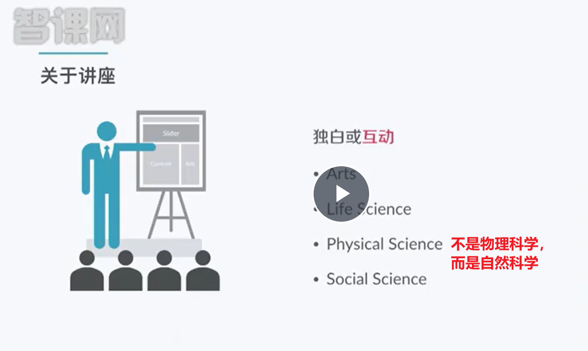
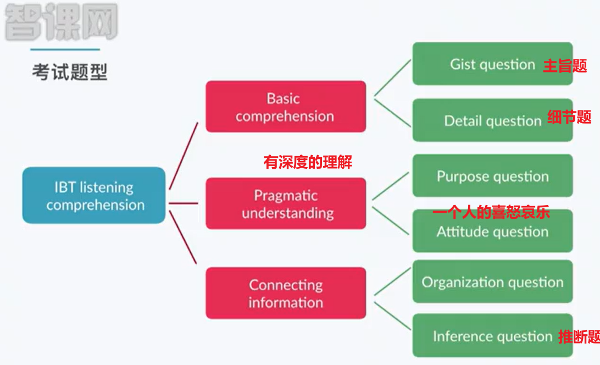
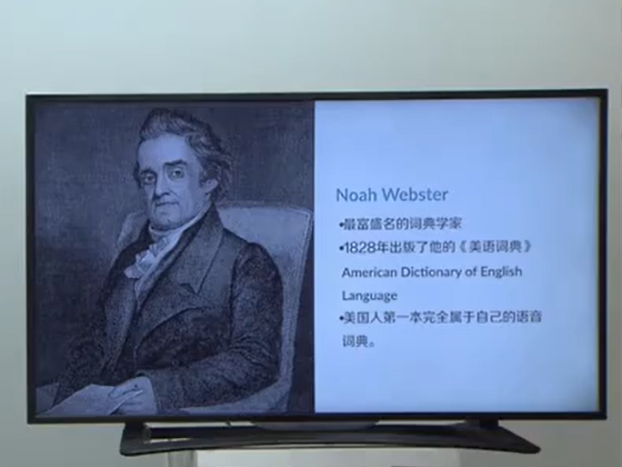
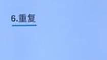
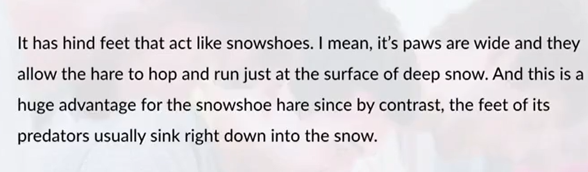
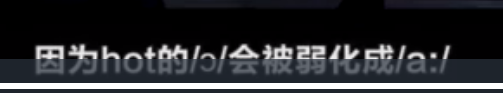

- # Basic Info
  collapsed:: true
	- 书架是bookshelf/case，但听力中使用stack（大书架）
	- 
	- 
	- 
		- Mosaics 马赛克    镶嵌工艺
		- Ceramics 陶瓷 制陶术
		- Physiology of sensory organs 感知器官的生理机能
		- Food foraging 捕食、觅食
		- Astronomy and cosmology 天文学与宇宙学
		- Particle physics  粒子物理
		- Seismology 地震学
		- Optics 光学
	- 
	- 
		- Purpose 询问本质的目的，由细节推到主旨
- # Mistakes in preparing for examination
  collapsed:: true
	- 
	- 
	- revolution 天体的公转 revolve的名词
	- not necessarily 委婉的否定
	- incorporate 吸收、纳入、吞并、保护、煎并
	- suite 与 sweet读音很像，注意suite和suit读音的区别，suite是套房、套间的意思
	- 
	-
	-
- # Suggestions
  collapsed:: true
	- 
	- step by step选择第二版或者第四版
	- 新概念有英音和美音的区别
	- 找根据TPO词汇的词频去编写或者学科分类或者按照听说读写分类的词汇书
	- 如果第一遍只能听懂大意，那就说明对于句式结构的听觉熟练度不够，需要精度训练
	- 语法可以看  无敌英语
	- 了解美国的校园生活背景
	  collapsed:: true
		- 
		-
	- 不了解天文学可以看记录片：
		- 
	-
- # Intensive Listening
  collapsed:: true
	- 
	- 
	- It is a mouthful I suppose.  很难发音/很拗口/很难解释
	- 
		- 农产品，重音在p
		- content的重音在t上面是adj，满意的，而如果重音在c上面，意思是内容和目录
		- 变词性、变重音、变词意
	- 
		- sport中p后面接了元音o，所以读的是 斯伯特
		- skirt中k后面接了元音i，所以读的是 斯格特儿
		- student中t后面接了元音u，所以读的 思丢顿特，而不是思tiu吨特
	- 
		- sense of  辅音和元音的连读
		- 句子的of的o发音时需要弱化，需要读成e f
		- meant注意英音和美音的区别
	- 
		- this was 或者this is 都要读成this‘s 的读音
		- 辅辅相遇，弃前保后：当前面一个单词的末尾是辅音，后面一个单词的开头也是辅音时，丢弃前面的发音而只是保留后面的发音
			- 比如 I‘d known 中的d和k都是辅音，丢弃d而只发known
			- good morning中的d和m都是辅音，丢弃d的读音
		- going to 直接读成gone
		- h被击穿：I‘d have taken it 中的have的h不发言，d和ave直接连接起来发音，读成“德芙”的口音， 爱德物
			- which和hour中的h也是没有发音的
			-  西班牙你好中的h不发音，读欧拉
		- 
			- 这里的d不发音，at中的a读音要弱化，因为at是一个介词，道理跟of中的o要弱化是一个原因
			- t后面是e，所以这里的t要变成浊化的/d/的发音
			  :LOGBOOK:
			  CLOCK: [2022-06-22 Wed 23:42:45]--[2022-06-22 Wed 23:42:46] =>  00:00:01
			  :END:
		- The watch doesn't keep good time. 这个手表不准了.
		-
- # BackGround Knowledge
  collapsed:: true
	- 
		- 名气够大、年代久远，所以奥班马不会考
	- 政治家
	  collapsed:: true
		- 
		  collapsed:: true
			- 一美元
		- 
			- 
			- 
				- 没有连任完第四节，其在最后一任上死了
				- 小布什是00魔咒的终结者，据称其和他爸大布什在美国总统的智商排名中垫底
				-
	- 作家和思想家
	  collapsed:: true
		- 
		- 
		- 
			- 哲学三贤，S是P的老师，P是A的老师，注意S的发音
		-
		-
	- 艺术
	  collapsed:: true
		- 
		  collapsed:: true
			- 一个国家的诞生和党同伐异
			  collapsed:: true
				- 
				-
			-
		- 
			- 给好几个总统排肖像
			- 
				- 美国南北战争死亡的第一天埋死尸
				- 在今天的马里兰州博物馆陈列
			- 
				- 自由女神像左手拿的是《独立宣言》，右手高举火炬
				- 由青铜制作而成，所以一年会遭遇四十多次雷击
			- 
				- 一词多意
				- 改动与英音不一样的发音方式
			- 
				- 达达主义画派，藐视传统，非常前卫
			-
- # High Frequency Listening Phrases
  collapsed:: true
	- floor plan
		- 对于消费者来说就是户型图
		- 对于开发商来说就是楼层平面规划图
	- anything but
		- 一点也不。 It was anything but boring. 一点也不无聊
		- nothing but 只不过是。It's nothing but a joke.  这只不过是个笑话
	- on such short notice
		- Hi, thanks for seeing me on such short notice. 谢谢你这么仓促来见我
	- in person
		- It's nice to finally meet you in person. 亲自、当面
		- personal 有人情味的
	- high-end 高端的 stuff
	- drive home
		- He really drove this augment home throughout his essay.
			- 把什么什么问题说得很明白，从头到尾都在说，弄得很透彻
			- 他在论文中非常透彻地阐述了这一论点
	- goof off
		- they were goofing off and talking. 游手好闲、吊儿郎当、混日子、无所事事
	- go down the drain
		- I know, but i didn't want to risk the project going down the drain.
		- All my hard work goes down the drain.
		- drain表示排水的意思，所以这里就是付诸东流、前空尽弃、化为乌有
	- start from scratch
		- 从头开始，白手起家
		- scratch line说的是运动员起跑时的那条起跑线
		- make stuff from scratch 从头开始制作工具
	- come down to 归结为
	- have an open spot
		- = job openings,空岗，虚位在招
	- not necessarily 未必、不一定，是委婉的否定，不是”不需要”的意思
	- at odds with 与谁谁不一致
	- lesser-known  不为所知、小众、名气稍逊的
	- come to light 显示暴露
		- I get to see a lot of the professors, like in a different light. 不同的方面
		- 光线找到人身上，有阴有暗
	- That's very nice of you, Eric, but it will be low key, not flashy.
		- 低调，没有那么炫耀
	- common denominators 共同、共性
		- 1/4和2/4都有相同的分母
	- Plants go to a lot of trouble to attract attention.
		- 植物费劲心思、费劲苦力、想方设法来吸引关注，从而更好得传粉
	- We don't just pull fiction characters from thin air， do we?
		- 我们不能凭空捏造小说人物对吧？
	- What I wouldn't give for a cold drink! 我太想要冷饮了，拿什么换都可以
		-
	-
	-
	-
	-
	-
	-
- # The essence of  Exam focus
  collapsed:: true
	- 
		- actually和in fact总体是做正向的，但是有时候会做反向否定
	- 
		- 02两个意思：解释说明、占比
	- 
		- 3和5是重点
		- 3：你看谁谁谁
		- 5：如果 ...  是为了举出一个小例子
	- 
		- 美国高中、英国高中是同向对比
		- 考试0分和考试满分是反向对比，属于极性
		- resemble 和谁谁谁像，后面直接接宾语
		- one one hand 和 one the other hand 表示极性对立
			- 表示两个角度 应该用on one hand, on another hand或者for one thing for another thing
	- 
		- 设问是自问自答的意思
		- 这里的回答是非正常回答
	- 
	- 
	- 
		- nOW和ok是语句分层的最重要的两个词汇
		- again很重要
		- also也是超级重点：容易出四选二或者选择题（同向并列）
		- by definition 常跟多项列举  需要记笔记
		- namely也就是说
	- 
		- 顺承式结巴：张三，我们晚上去~~~~哪里吃饭呢
		- 重启式结巴：张三，我们晚上去~~~~ 算了不去了
	- 
		- 引出文章主旨：I was wondering
		- 最后几句话是考验听力的注意力
	-
	-
- # Training Examples
  collapsed:: true
	- 
		- 占星术
	- 
	- 
	- 
		- hind 后面的  behind
	- 
		- 
	- 
	- 
		- let yourself come through 让你自己自始至终都在文章中体现出来
		- in own your life
	- 
		- dating technique溯源技术，某东西来自哪里
	- 
	-
- # Long Examples
  collapsed:: true
	- 
		- 印象日出
			- 
		- movements这里可以翻译成思潮
	- ‘’
		- tend to最好翻译成  常常
		- 这些画家喜欢浓墨重彩
			- apply paint really thickly
		- brushstroke  brush是画刷  stroke是笔画
			- 连接起来是个抽象含义“笔触”或者说“运笔”，强调的是画画的风格或者感觉
		- 画布的质地非常粗糙，也就是说有颗粒感
- # Conversation
  collapsed:: true
	- history section 图书馆的历史分区
	- could you help renew the book ?
		- 你能帮忙续借一下这本书吗
	- I fail to apply for admission for the spring quarter, but for the fall quarter.
		- 我没有申请春季学期的入学，而是秋季学期。
	- Refund procedure is fast in China, but slow in Canada.
		- 退款手续在中国很快，但是在加拿大很慢。
	- Have you finished the draft? The teacher is urging the first version.
		- 你完成论文初稿了吗？老师正在催要呢
	- We will open a session on dredging the flash floods.
		- 我们将开设一场关于疏浚山洪的座谈会。
	- The pipeline was finally dredged, and residents' water supply returned to normal.
		- 终于把这条管道疏浚了，居民供水恢复正常
	- SEU indeed provides with summer session and winter session.
		- 东大确实配备了暑期学校和寒假学校
	- He has to ask for extension to submit the course thesis for his recent schedule is full.
		- 他不得不申请延期提交课程论文，因为他最近的日程满了。
	- Literature review 不是文学综述，而是文献综述
	- The traffic cop gave him a ticket for not wearing a helmet and walking backwards.
		- 交警给了开了罚单 因为没戴头盔和逆行
	- Tell me about it.  同意/赞成对方的观点，你说的对
	- Be all ears. 洗耳恭听
	- I'm running out of water. 我喝完水了
	- In good condition
		- Are you in health?  -In good condition. 身体很好
		- I want to return this book.  -yeah, but it has to be in good condition.
	- 
	- 
	  collapsed:: true
		- 美音中adults发音 鹅大耳次，而非 唉大耳次
		- 
		- 
		- te会被发音成
			- 
	- 
	-