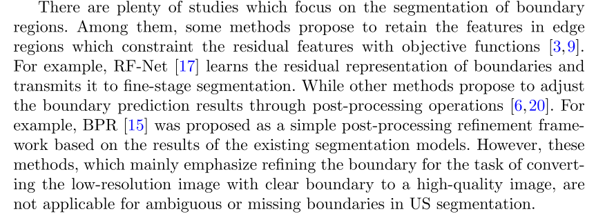
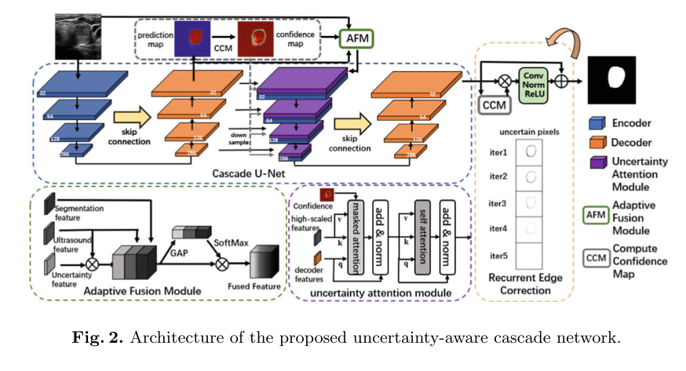
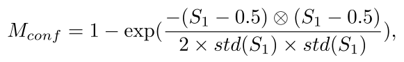
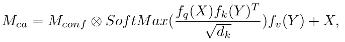
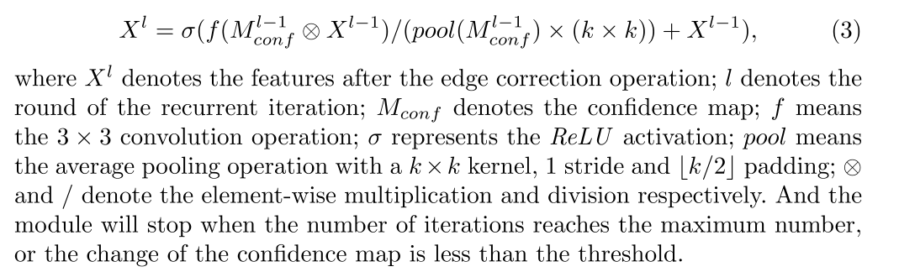

- 超声分割的难点：
	- 常用的编码器-解码器结构中上采样会导致边缘细节的丢失
	- 存在阴影噪声
	- 边缘模糊或者丢失
- 边缘问题的研究现状：
	- 
		- 使用目标函数来约束从边缘区域趋于提取的残差特征
		- 通过后处理来调整已有的边缘预测结果
- 模型的insight：
	- 不准确的分割结果主要集中在边缘和混乱的区域
- 模型的整体架构图：
	- 
- 模型理解和说明：
	- 论文的核心思想是：
		- 现象：
			- 因为**边缘的像素数远少于内部光滑的区域，普通unet训练时容易出现优化上的bias，所以预测结果中边缘实际上具有很高的不确定性**，换句话说是预测准确的概率值比较小
		- 解决方案：
			- **我们首先希望从粗糙的分割预测中计算得到confidence map以表征和衡量这种不确定性的大小，并利用这种不确定来修正边缘。**
	- 模型的整体结构：
		- **首先，利用两个unet级联形成的Cascade Unet：**
			- **从第一个unet的粗糙分割预测中获得confidence map**
				- 
【1】从预测的分割概率图推到得到confidence map，当对目标的预测概率越接近0.5，表示不确定性越强

					- 
具体方法
：
						- 
					- 
疑惑：为何不对前景1和背景0分开计算置信度？因为当S1的值关于0.5成镜像对称时计算得到的confidence value是一样的，可是一个是对前景1的正向预测概率，另外一个是负向的预测概率

						- 
因为confidence map是和预测分割的prob map一一对应的，当S1 < 0.5, S0 > 0.5, 预测即为背景，Mconf表示的自然也就是针对背景的确定性了

				- 
 【2】利用AFM即自适应的融合模块来融合【confidence map、原始的超声图像、粗糙的分割结果】

					- 
三个输入都是单通道图片，AFM首先让原始超声图像 和 confidence map 按位置进行乘积，相当于是得到了原图当中预测准确的部分，把预测不准确的部分进行了模糊；然后三张图片在通道方向进行连接，利用SE模块进行通道注意力的学习，最后按通道进行相乘，得到融合后的特征图

					- 
原图、原图进行边缘模糊处理 这两类图片相似，取值范围包括【0，255】，而分割图只包含0和255，对这三者进行融合的意义是什么？

						- 
 分割结果的引入能够侧重于前景的目标区域，边缘模糊处理使得模型能够同时关注原图和分割结果中的边缘部分；

						- 
 下一个unet的输入也变成了单通道了；

			- **利用confidence map中的不确定性来增强粗糙预测的特征图**
				- 
【1】为了减少或者说弱化 造成不确定分割的特征，使用UAM（不确定注意力）模块来提取到真正对结果产生影响的特征

					- 
Masked Cross Attention: 使用上一个unet的解码特征作为query tokens,  当前unet上一层的编码特征作为key tokens，两者的内积得到像素之间的权重，本层的编码特征同时也作为value tokens, 如此一来，每个像素的特征进行了一轮更新; 再使用confidence map进行mask，用来降低或者弱化不确定边缘的像素的特征

						- 
						- collapsed:: true
						  
疑惑：key和query的选择能够互换吗？为啥key和query token要分别来自两个特征图？

							- 
疑惑：上一个unet的解码特征可以理解为原始的特征，当前unet的编码特征可以理解为弱化后的特征。因为原始特征本身的不确定性就比较强，如果key和query都来自原始特征，则不确定性会加强；如果key和query都来自弱化特征，则更新后的主要还是来自自身，这不利于融合其他有效特征；如果query来自原始特征，key来自弱化特征，原始特征和弱化特征之间的相似性必然比较小，且弱化特征图中实际上只有一部分特征被弱化了，这样能够保留原始的一部分上下文信息。

					- 
Self Attention: 对更新后的特征图捕获长距离依赖 

		- **然后，增加边缘（具有不确定性）周围像素特征的确定性，进而修正原始边缘的像素**
			- 
			- 
是一个迭代的过程，每次都从原本的分割结果中提取对应的confidence map, 然后将其作为mask并结合局部的平均池化来提取出每个像素处的特征需要进行变化的量，与原始的分割结果进行相加，就得到了一轮新的分割结果了。

			- 
疑惑1：池化的作用参见论文[[Multi-phase liver tumor segmentation with spatial aggregation and uncertain region inpainting]]

			- 
疑惑2：这里的X是分割的预测概率还是说unet输出的特征图、输出的0-1分割结果？应该是预测概率

	- 模型的损失函数：
		- boundary iou
-
-