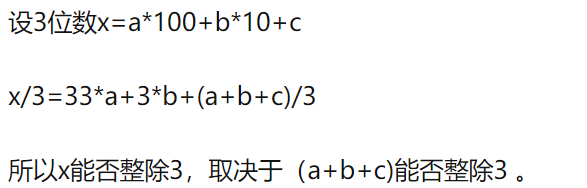

- 为什么各个位数之和是3的倍数的数能被三整除？
	- 
	- 3位数时各个位数之和为9的倍数的数也能被9整除
	- 假如把数扩展到4位，则此时3和9仍然能够继续满足
		- x = a * 1000 + b * 100 + c * 10 + d = a * 999 + b * 99 + c * 9 + (a + b + c + d)
			- x / 3 = 333a + 33b + 3c + (a + b + c + d) / 3
		- x = a * 1000 + b * 100 + c * 10 + d = a * 999 + b * 99 + c * 9 + (a + b + c + d)
			- x / 9 = 111a + 11b + 1c + (a + b + c + d) / 9
		- 同理可知，当数的个数 m > 4 时，都满足 各个位数之和是3/9的倍数的数能被3/9整除
			- 当 m = 2 和 m = 1， 显然成立
			- 随意可以说，对于任意长度的10进制数，都能满足 各个位数之和是3/9的倍数的数能被3/9整除
				- 从推导过程可以看出，因为9是3的倍数，所以9999、999、99、9能被9整除，也就必然能够被3整除，所以 从第一个等式 都能顺利推导到 第二个等式
	- 拓展：n进制下(n-1)的因子都可以
		- 依然假设这个数有m个位置，则 num = a * n^(m-1) + b * n^(m-2) + c * n^(m-3) + ... + k * n^0
			- num = (a *  n^(m-1) - a) + ( b * n^(m-2) - b ) + ( c * n^(m-3) - c ) + ... + (a + b + c + ... + k)
				- =  a * [ n^(m-1) - 1] + b * [ n^(m-2) - 1 ] +  c * [ n^(m-3) - 1] + ...  + (a + b + c + ... + k)
				- = a * [(n-1) * n ^ (m - 2) + (n - 1) * n ^ (m - 3) + ... + (n - 1) * n ^ 0] + b * [ (n - 1) * n ^ (m - 3) + (n - 1) * n ^ (m - 4) + ... + (n - 1) * n ^ 0] + ... + (a + b + c + ... + k)
				- 备注：
					- 10^3 - 1 = 999
					- 1000 - 1 = n ^ ( m - 1 ) - 1 (m = 4, n = 10)
						- = (n-1)* n^(m-2) + (n-1) * n ^ (m-3) + ... + (n -1 ) * n ^ 0
						- = 9 * 10 ^ 2 + 9 * 10 ^ 1 + 9 * 10 ^ 0
						- **=  (n - 1) * [n ^ (m - 2) + n ^ (m - 3)  + ... + n ^ 0]**
						- **= (n - 1) * (1 - n ^ (m - 2 + 1) / (1 - n))**
						- **= (n - 1) * ( n ^ ( m - 1 ) - 1 ) / (n - 1)**
						- = 9 * [ ( 10 ^ 3 - 1 ) / 9] = 9 * 111
						- = n ^ ( m - 1 ) - 1 (m = 4, n = 10)
			- 由备注中的推导过程可得：
				- num = a * (n - 1) * [ (n ^ (m - 1) - 1) / (n - 1) ] + b * (n - 1) * [ (n ^ (m - 2) - 1) / (n - 1)] + ... + (a + b + c + ... + k)
				- num / (n - 1) = a * [ (n ^ (m - 1) - 1) / (n - 1) ]  + b * [ (n ^ (m - 2) - 1) / (n - 1)] + c *  [ (n ^ (m - 3) - 1) / (n - 1)] + ... + (a + b + c + ... + k) / (n - 1)
				- 而备注中： (n ^ (m - 1) - 1) / (n - 1) 《=》
					- n ^ (m - 2) + n ^ (m - 3)  + ... + n ^ 0  《=》
					- 1 * n ^ ( m - 2) + 1 * n ^ (m - 3) + ... + 1 * n ^ 0 = 111...1 (一共m-1个1)
					- 也就是说这一项必然是整数
					- 同理可证 (n ^ (m - 2) - 1) / (n - 1) 是 (m - 2)个1，
					- (n ^ (m - 3) - 1) / (n - 1）是(m - 3)个1
				- 所以 num / (n - 1) 是否为整数 《==》(a + b + c + ... + k) / (n - 1) 是否为整数
				-
-