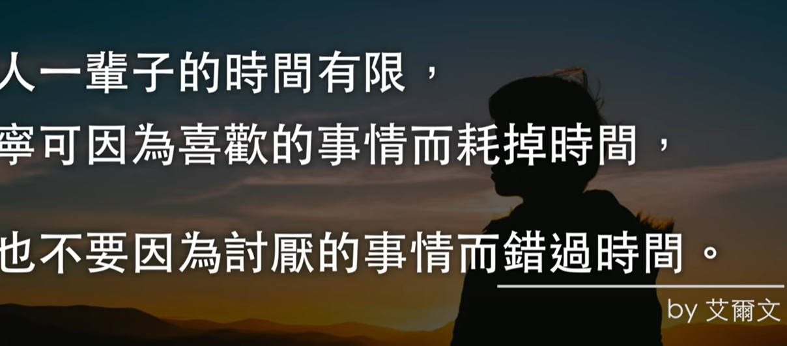

- 
- [[GetItDone]]
- [[FocusOnWhatYouCanControl]]
- [[HandleItSolveIt]]
- [[Aim for the moon,if you miss,you may hit a star]]
- [[BeingExcellent]]
- [[StartOverAgain]]
- [[HeIsAlreadyNice]]
- [[YouAreNotInnocent]]
- [[JustLetItGo]]
- [[JustDoIt]]
- [[StopUnnecessaryHelp]]
- [[PutIntoMoreThan80PrecentOfYourCurrentResources]]
  collapsed:: true
	- {{youtube https://www.youtube.com/watch?v=ZZ9zGgr2yY8}}
	  collapsed:: true
		- 要想翻身，实现一个阶级到另一个阶级的跨域，必须投入80%以上自己已有的资源，包括：时间、金钱等等，从而实现[[能力维度]]的跨域
		- [[时间是不会停下来的]]，所以要随时随地都能从时间中获取进步
			-
- [[觉得不去做什么和觉得去做什么一样重要]]
- [[非常成功的人几乎对一切事情都说不]]
  collapsed:: true
	- 不应该过度重视直接结果，而忽略后续结果，这是[[因小失大]]
	- 不论是害怕[[不合群]]，还是害怕[[赶不上别人做的事]]，都是一种[[讨好]]行为：[[讨好别人]]和[[讨好社会]]。这是一种[[讨好症]]，这是大脑的原始本能。
	- 为了克服[[讨好症]]，就必须专注于自己真正想要做的事
		- 问问哪些是自己想做的、哪些是想[[讨好社会]]的、哪些是想[[讨好别人]]
	- 
	-
	-
	-
	-
- [[要先有一个好的现在才会有一个好的未来]]
- [[时间才是自己最重要的资产]]
- [[存钱理财真的很重要]]
- [[会跟着自己的能力才是积累]]
- [[自由工作者其实一点也不自由]]
- [[财务自由的前提是财务自律]]
- [[如果你不是忙着成长就是忙着死去]]
- [[你对未来想象的轮廓是来自你过去的经验]]
	- [[我们无法想象一件事会发生是因为我们无法想象这件事发生的环境]]
	- [[我们真正缺乏的是自己的想象力]]
- [[当你手里拿着铁锤，看到什么都是钉子]]
- [[始终以完善性思维、以综合性视角来思考问题]]
- [[生命中最棒的东西是免费的，第二棒的东西则非常非常贵]][[CocoChanel]]
- [[这一种归零心态，对于成功而言非常重要。有时候，我们不是不能去学习，而是在于——我们认为自己不必学习。一旦有这样的傲慢，你去获取知识技能，或者对行业了解，都是给自己设置障碍]]
- [[当你痛苦难受，就不得不改变了。**你发现这种状态不行，就越早允许自己去体验痛苦，****充分体验它，反而能让改变发生。那时候转变就这么来的。]]
- [[既不需要装苦，也不需要装厉害。]]
-
-
- [[GoalMachine]] [[ProfessionPlanning]]
	- [[把一件事思考清楚了，除非环境因素变动特别大，不然没有必要再次思考或者说一直思考]]
	- [[紊乱的时间管理会让人心烦意乱，所以必须得保持相对稳定的日常惯例]]
	- [[不要在事情做到一半的时候，就迫切期待别人的认可，因为别人的观会影响你下一步的行动]]
	- [[如果一件事真的比较无聊且不得不做，那么要么快点做，要么勇敢跳跃不必要的部分]]
	- [[当你顾好了最基本的东西，其实没多少东西值得你浪费生命，你很可能早就已经拥有最重要的东西了]]
	- [[避免在实现目标的过程中引入过多的外在激励物，比如各种偶像头像，因为这些东西的激励有限，一定要从认知角度去激励]]
	-
	-
- [[MakingMoneyNotes]]
	- [[不要觉得这个东西俗套而不去做，找到俗套中可以复用的价值点]]
	- [[不要觉得某种赚钱方式低俗或者薪水不够高，如果需要培养相关的能力，如果金钱处于急缺的状态，就去做]]
	- [[杂活需要有技巧地去做]]
	- [[金钱只是实现目标的工具，但并不是目标本身]]
	-
	-
- [[RelationShip]] [[InterpersonalSkills]]
	- [[无论是口头交流 还是 在线聊天，记得在心里打一个草稿，不要随便张口就说，特别是伤害人的话和行动。因为这通常让关系没有后悔药可吃]]
	- [[每个人都可以看做一棵幼苗长成的大树。关系作为一种能量，大部分时间应该是你自身能力不足时的脉动或者红牛，偶尔是一瓶横扫疲惫的快乐水，但绝不是供养你日常生命的水。所以，不要消耗自己成为别人可饮用水中的全部的养料，而是要互相补充彼此养料中缺少的部分，就像各种互惠而生的各种植物那样]]
	- [[如果你想让别人对你好，你就必须得为别人付出点什么]]
	- [[如果你时而觉得有很多朋友，时而觉得没有朋友，那就是因为你的说话习惯、脾气、待人态度非常不稳定；如果你时而对别人很热情，时而对别人很冷漠，那就是因为你的同理心并不稳定而对环境敏感，或者说为他人考虑的习惯并没有真正养成]]
	- [[与人相处的时候其实目标明确是一件好事，而无需觉得功利。可以是为了情绪价值而交朋友，可以是为了共享知识而交朋友，可以是规划一致而交朋友，可以是兴趣爱好一致而交朋友，可以是欣赏别人而交朋友，可以是为了欲望而交朋友，可以是需要资源而交朋友，可以是为了陪伴或者生活而交朋友。无论是哪一种目标，都要展现你的真诚和价值，不如大方点，不如直接点]]
	- [[什么时候该彻底结束一段关系？如果双方确实没有互爱的基础了，那就应该结束；否则，可以先分开一段时间各自冷静一下]]
	- [[别人送给你礼物不管是处于巴结还是出于建立友好关系的目的，都是表达他们的需求，所以如果不是特别贵重的礼物或者可能对自身造成其他负面影响的礼物，都应该接受，这代表了你满足了他们的需求，向他们表达了自己的善意和接纳，即便这个礼物可能你并不是真的需要或者喜欢的，你的接纳本身也就有了意义，更何况这个礼物将来可能会变成有用的，谁说的准呢；但是如果你回绝了他们的礼物并没有给出合理的理由，就会让他们不敢再向你送出礼物或者纠结于该送什么礼物给你了，最终他们会因为觉得和你建立友好成本的关系太大而疏远你]]
	- [[自恃清高是穷人的缺点，是穷人的病，穷人除了尊严也没有剩下其他的了；富人需要处理很多复杂的关系，且需要对穷人表达出慈善和友好以维护自己的声誉；每个人都不要摆出高傲清高的姿态来对待任何人，因为这对于任何人来说都不容易接受，只有是谦逊柔和的姿态才能赢得更多的尊重]]
	- [[当你觉得别人对你做的某一件事不好时，通常不要针对性地认为他这种行为是针对你的，因为可能是他一直以来为人处世或者做事的习惯，比如对于高管来说，他需要处理的微信消息很多，所以养成了抓重点信息以及分析意图的习惯，所以通常只会给出非常针对性的简短回复，有时候会让人觉得冷漠]]
	- [[其实任何一段关系都有着很美好的时刻，后面随着时间的发展，可能因为彼此对于事物的价值观差异悬殊或者彼此1做出了对于双方有实质伤害性的行为，导致关系出现了裂痕，但这并不代表着曾经的美好就不存在了，不代表这个人一瞬间就从朋友变成了敌人，也不代表着你就马上拉黑删除他，不代表你就要做出更加恶劣的报复行为，因为很多时候没有到那种程度，除了个别极端情况下。对待任何关系，都需要保持平衡的状态；也需要意识到关系是有非常丰富的层次，有同事之间关于合作的关系，有上下级之间的关系，有不同的亲密关系，不同的关系有不同的重要性，但是都需要你妥善处理好它们]]
	- [[不要总靠着试错来进步，要学会从身边的人观察，从历史或者电视剧的故事请求中去思考事物发生以及发展的原因，提取出共性]]
	- [[一定要学会转换视角，特别是当这个视角与自己当前的角色或者利益完全对立时，比如公司的视角，当一个管理者和一个员工发生了纠纷，但是员工是道德受损方时，公司还是可能会开除员工而保全管理者，因为这个管理者可能是为公司带来了更多的利益，除非这个管理者上级也已经很久对他不爽了]]
	- [[现在研发工作难找，是因为没有企业业务了，所以他们很欠缺拉市场拉业务的人，你完全可以去做一些不同的工作]]
	-
	-
- [[SelfEncouragement]]
	- [[忘记结果和目标，专注在能够实现目标的整个运转系统上，花精力去设计和迭代这个系统]]
	- [[可能有邪恶的想法，可能有懒惰的冲动，可能有难过的情绪，但是只要你最终做出了正确的选择，你还是那个善良的你，你还是那个勤奋的你，你还是那个阳光的你]]
		- [[你的感受和想法都不是你，你做出的行动才是你]]
		- [[因为现实世界的复杂和偏差，表达者的宿命可能是误解，行动者的宿命可能是歪打正着或者相背而驰]]
	- [[对于一切渲染焦虑实则是推销产品的广告，没有必要关注；真正能促使你进步的是，别人富有成效的学习习惯、坚持到底的毅力；努力只是一种现象，如果不能深入理解对方努力的why和way，是没有办法真的进步的]]
	- [[你不是要尽量赚钱，你是一定可以、一定能、一定要赚到钱，这一切都是为了帮助你和身边人连根拔起式地脱离泥坑里的环境，为了去除生活中不必要的噪声，为了可以酣畅淋漓地追求自己的热爱，为了可以坦然面对不确定性并从中收获精彩，为了不再恐惧被抛弃被伤害被孤立被冷落被仇视被攻击被打压被鄙视]]
	- [[只要抱着能从每件事当中认真学点东西，你就不会对这件事产生抗拒]]
	- [[抵抗诱惑最有用的几句质问是：你到底是在确实实现目标，还是只是当成遥不可及的梦想？你到底是在损耗未来，还是在增益未来, 或者说，你是让自己赚到未来的钱了，还是又让未来的本金少了100块大洋？你到底是为自己铺就一条充满救赎、充满希望、充满劳动的道路，还是眼睁睁地把成果、胜利和幸福拱手让诸于他人？]]
	- [[当闲下来的时候，就要想想你需要解决的问题依旧很多，不够你总倾向于遗忘或者无法想象细节]]
	- [[你要相信你有能力将任何一件从没做过的事情做好]]
		- [[我现在的确对于这个东西一无所知或者一窍不通，我承认我现在的确什么都不会，但我一定可以循着清晰的逻辑、踏着缓慢但顺畅流动的节奏、拥抱着打破常规或者传统的勇气、谦逊地向他人请教、靠着日积月累的增量变化，来达到我热以渴求的学习目的]]
	- [[黎明前的黄昏是最黑暗的，因为 内核的改变 是缓慢且艰难的 行进的，需要时间 让改变发生]]
	- [[如何不能飞，就用跑的；如果不能跑，就用走的；如果不能走了；就用爬的，但是无论如何都必须向前进]]
	-
	-
- [[情绪(emotion)]]
	- [[知道一件事的道理是什么样的，绝大多数情况下不能解决问题，因为你必须把这个道理和自己的期望或者目标联结起来，如果你不能心甘情愿地 彻底改变自己的期望 或者说 降低自己的期望，情绪依旧会产生且复发。]]
	- [[当你出现情绪失控时，很大可能是因为你潜意识里因为某个事情不开森，你得把这些潜意识里的坏家伙及时找出来，然后个个击破]] [[FindBadGuysInSubconsciousnessEveryNight(每晚找出潜意识里的坏家伙)]]
	- [[物理的宣泄情绪，往往比精神上的宣泄来得更为有效]]
	- [[如果别人情绪不好，要学会理解，因为别人可能此时此刻遇到了困难、压力、焦虑和难过，要学会温柔地解决问题，别人对你态度不好也不能说明别人是真的对你坏]]
	- [[柔和地解决情绪，不要愤怒地或者悲伤地解决情绪，也就是不带情绪的解决情绪]]
	- [[日常的生活中不要投入太多的时间进行精神类的阅读，而是要进行如何做事的阅读]]
	- [[不要陷入过度思考和过度分析，因为往往会与最终目标越偏移越远]]
	- [[不管是亲密朋友还是陌生人，应该尽量保持无太多情绪的精简理智对话模式，可以变化的是题材，但总体上风格尽量保持稳定。记住，让你的文字和对话去可执行性地帮到别人，或者让他们快乐。优雅如画和轻松诙谐的文字 总是自己最好的名片！]]
	- [[生活是由5%高兴的事情+5%不高兴的事情+90%说不清高兴还是不高兴的事情组成的]]
	- [[避免在单方面思考后做出单方面的行动，因为这时候你的认知频宽一定非常狭窄，所以一定要与矛盾方进行面对面或者视频式的深度沟通后再做决定，可以定义其为双向行动]]
	-
	- [[避免在夜晚或者造成刚起床时做决定或者思考一个令人生气的问题，因为有起床气和晚睡气]]
	- [[对于引发争吵的问题，一是心里不要憋着，二是要见面谈！见面谈！见面谈！，三是不要一上来就说狠话，要先把问题了解清楚，对方到底是不是这么做的]]
	- [[当短期利益的同龄人对比让你失望时，记得回想长远的未来]]
	- [[情绪突然失控时，记得喝水、散步和上下楼，以及疯狂地写作来输出情绪]]
	- [[当发生某件影响你情绪的事，你对这个人或者这件事的基础假设是最重要的。这个人 到底 是为了故意欺骗你伤害你，还是只是蠢和无知；这件事 对你来说 到底是 无意义的时间浪费，还是可以学习可以成长的经历]]
	-
- [[救赎之道，就在其中]]
	- [[设置某个动作或者行为来作为情绪转换点：意识到情绪正在失控，开始在公众号或者logseq写作10分钟-20分钟，可以是抒发情绪，可以是提出问题，写完就继续做下一件事]]
	- [[我的有效专注力不行，我总结了几个原因：睡眠不足导致的生理性思维发散；对于枯燥的任务很难发现乐趣，容易陷入死记硬背式和承认式的学习（就是自己觉得那段话可能都有问题，但是总觉得很成熟的知识体系就不会有问题，主要是自己提出的质疑自己没有办法解答）；容易被各种新鲜的刺激的表面式的有趣夺走注意力，并不能判别何为深度有趣；容易被与人的关系、别人说过的比较犀利的话、非常想要达成但是需消耗很久时间的目标或者欲望、别人的进度所控制]]
	- [[要学会做最有效最直接的事情，打破规则也是建立在这一直觉的基础上，而不是随性为了打破而不同。我做过的一些非常无效且多余的事情：1）与其天天喊着退学，不如将这个过程优化为：增加自己想做的事情清单，让自己在忙碌中忘记等待的煎熬；同时试着用更简单更高效的策略完成毕设，保证自己能学到东西但又不会花费太多时间；2）与其责怪别人对你不够好，不如让自己变得“别人心甘情愿地主动对你好”；3）与其在陷入负面情绪时责备自己，不如把每一次负面情绪看作成长的契机，即“善用危局”；4）一次性表达太多然后又重复表达，使你说话的效果大打折扣；4）对别人的话扣字眼，无差别地喜欢多揣测别人的目的，真相确是大多数人活得无端散漫，仅凭直觉来说话做事；5）总是喜欢在短时间想要求得一个现实问题的终极答案，并且沉迷于互联网上能够直接提供的解决方案，而真相是很多真实答案并不高级，其依靠的是在积累中迸发的创造性；6）沉迷于自己的短缺所带来的匮乏感和心力不足: 不要纠结于没有钱，你肯定不会饿死；不要纠结于能力不足，能力本来就是需要持续积累的；不要纠结于做的事情是否没有回报，自己的享受就是回报；不要纠结于天塌下来了或者外部环境的答辩化，因为即便你提前知道了，也可能还是没有能力躲避或者逃脱，知道有些事情只是将你摆脱厄运的概率增大了不到10%; 7) 总是在看完某些thrilling的文本或者电影或者音乐之后久久无法从中释怀，总觉得意犹未尽或者尚有未能参透或者理解的部分，于是就停在那里空想或者发呆：把你的感受、思绪等暂时写下来，但是不要public sharing，后面不断完善就行，不必急着一时得到best self-perceived happiness,  所有的精华都需要你去反复锤炼，因为锤炼和修改才是生产任何有价值的内容的必经之路; 8) 停止不必要的内心戏：希望别人能对你公众号的文章偷偷赞扬、希望福子能随时注意到你的不开心或者嫉妒或者失望、希望别人能够理解你的痛苦并表示一定的同情和友善、希望别人能够主动地挽回或者修复你们之间的关系、希望独行或者独立做事时有人能够关注到你、希望展示一些自己的特别之处来获得别人的关注或者欣赏; 9) 先把手头已经有的资料用完，不要不停地搜索各种所谓的advanced material； 10）事情还没有开始做，就有点傲慢地想要做出一个完美的逻辑或者完美的solution，其实科学和生活还有工作都是在一块大的布上不断修修补补的]]
	- [[关于学习和进步，获得几个basic and important insights: 1) 建立一些简单的直觉或者single thought/perception来帮助自己掌控行为：比如你想坚持做一件事，可以说“今天做了百分之几”来对进度有一个直觉上的感知，因为这才是符合大脑有些懒惰的工作习惯；2）向大佬和书本学习是减少内耗和进步的最佳方式；3）为自己建立和优化各种思维模型，不同的场景打出不同的牌；4）思维的完善性无比重要，甚至超过思维的深度；5）在任何事情上都可以发挥创造性，这将让你真的享受学习; 6）专注和投入一件事要以一个月为单位持续不断地来做，你无法专注的原因很多时候是没有找到专注的point在那里，当无法专注时写下[[FocusPoints]]; 7) 对瓶颈产生的原因进行自我测试，直到测试出受限点[[BottleNeckTestPoints]]; 8) 在真正优质的内容面前，所有的形式都是次要的，所以务必确保让你的内容越来越优质，而不是越来越杂；9）找到让杂活变得优美的点; ]]
- [[InterpersonalSkills]]
-
-