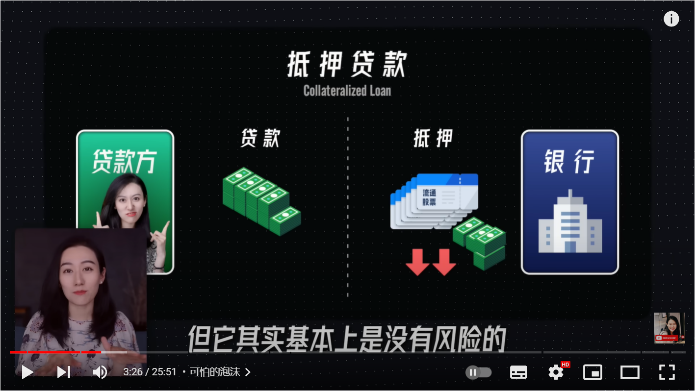

- YOE, Years of Experience
- African Wildlife Foundation: Home AWF是一家公司，非洲野生动物基金会
- 更高的汇率会使得一个国家的进口变得便宜，而出口变得昂贵。这个很好理解，是否可以假设汇率变化了，但是产品的价格暂且不变动？那么进口时，你用更少的人民币就可以换得跟原来一样数量的外币，从而购买到相同数量的产品；出口时，别人需要用更多的外币才能换得跟原来一样的人民币，从而卖出去相同数量的产品。简单概括就是，高汇率方便进口，不利于出口。同理，低汇率不利于进口，但是方便出口。判断汇率变化对国家经济的影响主要是需要知道国家是依赖出口还是依赖进口。中国是依赖于出口的，中国是世界上第一的出口国，所以需要低汇率；美国是世界上第一大的进口国，同时也是世界上第二大的出口国，但美国总体上来说进口的商品和服务远多余出口。
- 文治武功，读音：wén zhì wǔ gōng，定义：汉语成语，释义：指政治军事，常用于描述古代君主在统治国家或地区时的表现，如汉唐盛世。 现也扩展到对一般管理者任内成绩的概述，或比喻推行措施中刚柔并济、软硬兼施。 出处：西汉·戴圣《礼记·祭法》：“汤以宽治民而除甚虐，文王以文治，武王以武功，去民之灾，此皆有功烈于民者也.
- 冒天下之大不韪（拼音：mào tiānxià zhī dà bù wěi）是一则来源于历史故事的成语，成语相关典故最早见于《 左传 ·隐公十一年》。 [1] “冒天下之大不韪”意指公然去做天下人认为是最大的错事（不韪：不是，错误）出处: 《左传》
- 苍蝇馆子，是指四川一些没有经过精美装修但是味道很好的小饭馆，在成都是指那些价格低廉铺面窄小的饭馆，形容它们的小和廉价，是一个爱称，而非贬义。"苍蝇馆子"是一个爱称,而非贬义,隐含着成都人幽默的自我嘲讽。"苍蝇馆子"的东西或许不是最好吃的,却一定有着神秘的吸引力和特别的味道,让人欲罢不能;"苍蝇馆子"的环境或许并不尽人意,却一定有着最热情的老板和宾至如归的亲切温馨感;"苍蝇馆子"还有着令人开怀的便宜贴心价,师傅不错的厨艺和倾尽心力的菜品创意;更有着可以无所顾忌大快朵颐的酣畅淋漓的家庭气氛。
- 寻租（外文名：rent seeking, 又称为竞租）是指在没有从事生产的情况下，为垄断社会资源或维持垄断地位，从而得到垄断利润（亦即经济租）所从事的一种非生产性寻利活动。 政府运用行政权力对企业和个人的经济活动进行干预和管制，妨碍了市场竞争的作用，从而创造了少数有特权者取得超额收入的机会。
	- 通俗的讲法就是“以权谋私”
	- 官员拥有权力，商人有钱。商人用手中的钱去买官员手中的权。官员用手中的权寻求买主。实际上就是官员把权利商品化，作为一种东西租出去。
	  或者是说以权力为资本，去参与商品交换和市场竞争，谋取金钱和物质利益。即通常所说的权物交易、权钱交易、权权交易、权色交易等等。
- 中概股
	- 中国概念股，是指外国投资者对所有海外上市的中国股票的统称。由于同一家企业既可以在国内上市，也可以在国外上市，所以这些中国概念股中也有一些是在国内同时上市的。
	- 中国概念股主要包括两大类：一类是在我国大陆注册、国外上市的企业；另一类是虽然在国外注册，可是主体业务和关系仍然在我国大陆的企业。
	- 公司注册是开始创业的第一步。一般来说，公司注册的流程包括：企业核名→提交材料→领取执照→刻章，就可以完成公司注册，进行开业了。但是，公司想要正式开始经营，还需要办理以下事项：银行开户→税务报到→申请税控和发票→社保开户。
- 血小板有什么作用？
  collapsed:: true
	- 血小板低对身体最主要的危害是出血，血小板在身体中主要的作用是止血。如果出现出血，血小板会立即到达出血部位并发挥作用，启动凝血过程。如果血小板减少，机体会出现出血表现，最常见的是皮肤黏膜出血，比如磕碰时皮肤出现瘀斑表现。
	- 血小板严重减低时会出现自发出血，包括消化道出血、脑出血等严重危害身体健康的情况。出血继续可以造成严重失血、贫血及血容量不足、休克等表现。如果血小板严重减少，会出现危及生命的出血。因此血小板减少对于身体最主要的影响，是会造成凝血功能不良，一旦发现血小板减少，应该积极预防出血，同时针对血小板减少进行治疗。如果机体中发现有出血倾向，应该进行血小板数量和功能的检测，以避免由于血小板减少导致出血，而对身体造成进一步伤害。
	- 血小板低的原因较复杂，具体如下：
		- 1、免疫性血小板减少性紫癜；
		- 2、自身免疫性疾病：如红斑狼疮引起血小板减少；
		- 3、内分泌疾病：如甲状腺功能亢进也可以引起血小板减少；
		- 4、血液系统肿瘤：恶性疾病如急性白血病可以引起血小板减少；良性疾病如再生障碍性贫血，除表现为白细胞低、血红蛋白低，也可以出现血小板减少。
		- 血小板减少病因不同，其临床表现不同，治疗不同，预后也不同。血小板的功能复杂，如可以帮助止血；或有内分泌功能，可以分泌介质，可在人体整个生理过程中发挥重要作用。
- 红细胞和白细胞有什么作用？
- 四种快乐物质：
  collapsed:: true
	- 多巴胺
		- 喜欢意外的惊喜，总是想要更多，是成瘾的重要原因
		- 多巴胺的对手是当下因子，当下因子喜欢真实的体验，当下分子的分泌会抑制多巴胺
			- 所以是说，生活体验越真实，多巴胺就会越少？越不真实，体验越奇幻、越新奇，多巴胺就会增多？
		- 制造当下因子的方式：
			- 关注此时此刻所做事情的结果，不提前考虑
			- 一次只做一件事
			- 学会奖励自己
			- 不断精进，让自己更擅长这件事
	- 内腓肽
		- 内腓肽才是真正的快乐物质，又名胺多酚，先苦后甜
		- 制造方法：
			- 延迟满足
			- 体育运动
			- 尝试新挑战
	- 血清素
		- 血清素能够帮助你更好地感受快乐
		- 制造方法：
			- 早起早睡能够促进血清素的分泌，而血清素也是睡意产生的关键
			- 健康饮食
			- 感恩日记
			- 多亲近大自然
	- 催产素
		- 和家人朋友相处的时候就会产生，并非只会在生孩子时才产生
		- 制造方法：
			- 拥抱你爱的人
			- 多抽时间陪伴家人
			- 和小动物玩耍
	- 
	-
	-
- CPI:
	- https://www.investopedia.com/terms/c/consumerpriceindex.asp
- ChromeBook:
	- 是一种新型计算机，可帮助您更轻松、更快捷地处理事务。 Chromebook 运行的是Chrome 操作系统，该系统配有云端存储空间、内置各种Google 精华应用，并能提供多重安全防护。
- 查体：就是对身体的健康情况进行检查，简称查体
- 政治上所谓的“白手套”：简单说来，就是充当“黑钱”漂白的中间人，或是实际从事“非法”事务的“合法”外衣。 从手套一词不难了解，真正做事的“手”是隐藏在“手套”之中。如果“手”很肮脏，没法见人，那么就戴上一个“白”的手套，别人就无法察觉手很脏，反而还可能觉得“手”被保护的很好，应该很干净。 所以，从事某些见不得人的事，通常必须寻找“合法”、“合理”的理由来加以掩饰，而从事这种掩饰工作的个人、单位、组织等等，我们都可以称之为“白手套”。
- 客座教授，是一个荣誉称号。 客座教授是有义务的，要为对方做事，通常是做报告，或者是合作研究，因此需要资格审批。 “客座教授”，是“客情”聘请的学者，不定期的来作报告或搞讲座。 本人可能不是教授，而是名人、官员、企业家、发明者等等。
- 不闻不若闻之，闻之不若见之，见之不若知之，知之不若行之。学至于行之而止矣
	- 没有听到的不如听到的，听到的不如见到的，见到的不如了解到的，了解到的不如去实行，学问到了实行就达到了极点
- 肯德基疯狂星期四
- 事急马行田，读音是shì jí mǎ xíng tián，是个俗语，释义原指中国象棋中马改走“田”，现形容事态紧急，不得不做出非常规性的无奈之举
- 淦 gan
- D-Link公司是做什么的？
  collapsed:: true
	- 友讯科技股份有限公司（D-Link Corporation）是一间台湾科技公司，总部位于台北市内湖区，于1986年由高次轩成立。公司专注于电脑网络设备的设计开发，自创“D-Link”品牌，主要生产制造消费者及企业所使用的无线网络和以太网硬件产品
- 一亩三分地？
  collapsed:: true
	- 来源就与先农坛里皇帝“亲耕”的这块籍田有关。当时皇帝“亲耕”的这块地的面积恰好为市制的“一亩三分地”，于是，人们推而广之，将个人利益或个人势力范围称为“一亩三分地”
- 做多、做空、平仓
  collapsed:: true
	- 
	- 做多或者做空都是为了赚取差额赚钱。多或者空是累计量的概念，对应的是个人所有金融产品的累计量，而不是市场的累计量。做多或者做空是考虑当前时间和未来时间这个时间段能赚钱，而不是说当下就一定能够赚钱。拿股票举例，做多其实就是购入更多的股票，很明显应该当前股票价格较低，而股票有上涨趋势，将来的股票价格会升高，那么只要等到那时再卖出股票，就能赚钱，做多是当前花钱，未来赚钱；做空就是减少股票持有量，也就是卖出股票，很明显应该是股票有下跌趋势，等到那时再低价买入，做空是当前赚钱，未来花钱。两个都是假设要保证当前和未来的股票持有量不变的情况下说的，在股票数量没变的条件下赚钱。
	- 这里小lin所说的背景是：两个相似的产品，价格变化应该趋于一致，但是某一时刻两者出现了分歧，就可以有机会进行套利。做多那个价格低的，做空那个价格高的，等到两个的价格回归一致时，就可以进行平仓。平仓的含义就是将多头也就是这里价格低的产品卖出，将空头也就是这里价格高的产品买入。这里看上去和股票交易不一致，实际上是一致的。这是这里的描述方法变了，股票里面做多做空描述的是价格的变化趋势，而这里描述的是当前的起始价的高低，因为这里是两个相似产品，暗含了两者最终会回到同一水平，也就是暗含了价格低的产品会呈现升值模式，价格高的产品会呈现贬值模式。
		- 
- 清仓？
  collapsed:: true
	- 投资者对股市后期不看好的前提下，在股票已有较大涨幅的情况下，将买入的和已经持有的所有股票全部卖出。
	- 目的是把到手的利润直接套现，可以规避股市的下沉风险。
- 利空和利多
  collapsed:: true
	- 利空指代促使股票下跌的信息。利空会导致股市大盘的整体下跌，不断的利空会导致股市价格继续下跌，从而形成熊市。
	- 利空是刺激股票上涨的信息。比如社会资金充足、经营业绩好转
- 房地产价格的影响因素
  collapsed:: true
	- 需求端：
		- 
		- 人口和经济都是底层起决定性的因素，都是与市场相关的；而利率和政策属于行政方面的因素，一般在短期内就会生效。
		- 人口上涨，人们的收入也在增加，利率处于降息的周期，政策没有非常利空方式，就一定会导致房价上涨吗？
			- 正常情况下会持续上涨，这也是专业房地产人员的分析结果。
			- 但房地产泡沫、信用泡沫也都满足这四个条件。因为信用泡沫一般都是在这种利率低的宽松环境下培育出来的一种经济过热的现象。房地产专业人员的分析会进一步正向反馈，促使这个泡沫继续增长。
			- 因而，这四个因素之外还要分析其他的点。
	- 住房供给端涉及的周期较长，弹性不足，所有影响力一般不如需求端
	  collapsed:: true
		- 如果地区是地广人稀地方，比如芬兰房价最主要的因素就是房屋供给。芬兰的劳动力短缺，所以供给相对少，房地产市场 is tightening 处于收紧状态。
			- https://www.bofbulletin.fi/en/2019/3/what-factors-influence-house-prices-and-residential-construction/
			-
- 全世界房价最高的地方：
  collapsed:: true
	- 摩纳哥
		- 因为没有税收，所有富人都集中在哪里
- 房地产市场的特点是什么？
  collapsed:: true
	- 
- 为什么房地产与信用挂钩？
  collapsed:: true
	- 房地产是大部分人的主要资产，一般都需要贷款买房。
	- 房地产行业能够迅速扩张的原因，不是因为有钱人越来越多，而是因为信用扩张。下图中17个国家的房屋放贷/GDP的比例均值在过去100年的增速超过工资增速。
	  collapsed:: true
		- 
		-
	- 房地产抵押贷款具有一般贷款不具备的特点：
	  collapsed:: true
		- 炒股时找券商借钱的杠杆炒股
		  collapsed:: true
			- 
			- 
			- 
			- 
			- 
			- {:height 444, :width 774}
			- 
			- 
			-
		- 抵押贷款 Collateralized Loan
			- 
			- 当你无法还贷时：
				- 
				- 
				- 
				- 
				- 
				- 
				- 
				- 
				- 当房价下跌时，并且很多人还不上贷款或者不想还贷时，银行拍卖房子赚不到本金，并且还会有拍卖的额外成本，银行就会承担巨大的经济损失
- 房地产危机的原因是什么？
  collapsed:: true
	- 
	- 本质上是信用危机和银行危机。
	- 经济活跃度下降，会导致一系列的企业因为资金链断裂而破产
	- 房地产泡沫会导致信用泡沫，慢慢的会拓展到实体经济
	- 房地产泡沫 + 信用泡沫 合并会摧毁一个国家的经济，因为房地产泡沫要远比股市泡沫可怕
		- 美国2008次贷危机
		- 欧洲2010欧债危机
		- 日本90年代的经济危机
	- 出现信用危机怎么办呢？为什么经济很难挽救了？
		- 美国和日本可以印钱拯救银行，进而银行不会收紧放贷，也不会挤压到实体经济了。
		- 欧姆则难以解决，因为印钱不是欧洲某一个国家说了算，印欧元是欧洲央行的事情，欧盟不让随便发债券。2010欧洲危机中西班牙因此只能向欧盟借了1000亿来救自己的银行，一致还不上，且意大利、爱尔兰也是类似情况。
			- 债券（Bonds / debenture）是一种金融契约，是政府、金融机构、工商企业等直接向社会借债筹借资金时，向投资者发行，同时承诺按一定利率支付利息并按约定条件偿还本金的债权债务凭证。 债券的本质是债的证明书，具有法律效力。
			-
- 公务员的财政收入来自哪些地方？
- 医保系统到底是如何运作的？
  collapsed:: true
	- 医疗保险一般指基本医疗保险，是为了补偿劳动者因疾病风险造成的经济损失而建立的一项社会保险制度。 通过用人单位与个人缴费，建立医疗保险基金，参保人员患病就诊发生医疗费用后，由医疗保险机构对其给予一定的经济补偿。
	- 
	-
- 养老金的来源、流向、以及更新机制是什么？
- 关税是什么？
- 囚徒困境是什么意思？
- 绿肥红瘦到底说的是什么意思？
- 全世界的剥削体系可以使用什么框架来描述？剥削和反剥削是不是相互存在的概念，也就算双方同为剥削和被剥削方？剥削一词的正义性该如何来理解？
- 打工人被剥削是因为某些能力的不足，所以打工人如何才能完成自身的转变？打工人只能从被剥削者转化为剥削者吗？
- 原神为什么能火起来？
- tiktok为何在欧美国家也能火起来？
- 为何中国的互联网行业能够迅速发展起来？
- 日本人到底活得开不开心？
- 拉丁美洲包括哪些国家？墨西哥属于北美还是南美？
- 印度安人是什么概念？
- 哥伦布发现新大陆为何意义如此重大？为啥之前没有发现这块土地？新大陆本来就有原住民，为啥还称作新大陆？
- 叙述理论会影响人们对同一个观点的接受度，如何才能拍出不同叙述方式所造成的认知bias？
- 马太效应是什么？
- 资本主义的周期性经济危机问题如何理解？
  collapsed:: true
	- 
	-
- 熊彼得的创造性破坏理论？
- 天眼查、企查查这种APP是怎么赚钱的？它是怎么获取到各个企业的股权信息以及相关的企业代表人信息的？其APP中所展示的风险又是如何得到的？
- 高德地图和百度地图背后的核心技术是什么？有什么区别呢？
- 如何阅读一个企业的财报？
- 技美？ [[ConceptDefinition]]
	- 游戏领域的技术美术
- SLAM [[ConceptDefinition]]
	- https://robot.ofweek.com/2020-12/ART-8321202-11000-30476098.html
	- https://www.slamtec.com/en/News/Detail/313
	- https://en.wikipedia.org/wiki/Simultaneous_localization_and_mapping
	- Simultaneous localization and mapping 同时定位和构图
- 黑天鹅事件是什么？
- PDD怎么赚钱的？东西那么便宜不会亏本吗？
- 2008次贷危机是怎么形成的？
- 影子银行是什么？
- 什么是犬儒主义者？你是否支持犬儒主义？
	- 犬儒主义，一般认为是苏格拉底的弟子安提斯泰尼创立的，另一人物第欧根尼则因为住在木桶里的怪异行为而成为更有名的犬儒主义者。当时奉行这一主义的哲学家或思想家，他们的举止言谈行为方式甚至生活态度与狗的某些特征很相似，他们旁若无人、放浪形骸、不知廉耻，却忠诚可靠、感觉灵敏、敌我分明、敢咬敢斗。
- 如何全面且完整地理解旁氏骗局？
- 心理学测试在哪些方面是可靠的？在哪些方面是不可靠的呢？
- “主义”一词的来源和含义到底是什么样的？
-
-
-
-
-
-