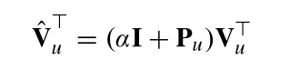

- 把所有病人的数据都放在了一个模型里面，所以这里可以借鉴的是只使用单个病人的部分：将病人的不同模态数据都转换成一个一维向量，然后不同模态对应的向量使用自注意力机制进行融合，此处的注意力机制有点不同，其权重矩阵还加上了identity矩阵：
	- 
- 融合后又分出了两个分支：一是将更新后的多模态矩阵数据进行向量化，然后再进行线性转化；二是直接将权重矩阵进行向量化，两者连接之后得到一个新的分支。