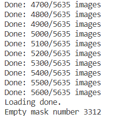

- 11270/2 = 5635张训练集图片，5453张测试集图片
- 
	- 1011号图片有问题，直接删掉了，对测试代码没有影响
- 全黑的预测结果写入磁盘时会警告是低对比度图像
- **与Unet结构相同，只是改变了相关参数**，五个连续下采样对应的图片通道数变化为【32，64，128，256，512】，五个连续的上采样对应的图片通道数变化为【512，256，128，64，32】。而原始的Unet对应的下采样通道数变化为【64，128，256，512，1024】，上采样通道数变化为【1024, 512, 256, 128, 64】。**总结来说，U型结构的高度和各级采样的倍数关系没有变化，只是改变了第一层的通道数**
- 
	- 第二种处理方式获得的数据集大小：8:2的比例划分训练集和验证集
- 
	- 空分割的图片很多
- 
- 
- 一是没有明白为啥之前的阈值函数识别了：照理说超过240都已经变成255了，为啥还有254？
- 二是搞不懂为啥这个sigmoid之前和之后的数值都非常的小，所以二值化的时候这个阈值就不好确定了，分割的结果也完全不对？
	- 是不是不需要这里的sigmoid呢？这得看你写的模型里面有没有包含最后的sigmoid激活层，如果包含了就不需要再输出上调用sigmoid，如果不包含就还是需要调用sigmoid。我看到我这里模型里是没有加上
	- sigmoid之后的图像到底需不需要进行阈值化？需要。到底是不是因为模型训练的问题导致的呢，也就是说模型训练得不好，导致sigmoid的结果不好，可是我看sigmoid的结果的确是在这个区域的。正常情况下这个阈值应该设置为0.5吗？我觉得应该是的，小于0.5设置为0，大于0.5设置为1。只能重新跑下再看看了。
- 之前那个loss的size到底要不要×？
- 三是没有搞懂这个训练速度为啥比keras慢，也不能这样说，因为并没有实际统计keras的运行时间
- 将单纯的dsc损失改为加权的交叉熵和dsc损失后，在测试的时候发现阈值分割结果仍然不正确，所以真的是因为数据集中空白分割结果过多导致的吗 HP1？还是说每个病人的数据有矛盾导致的 HP2？或者是两者的综合作用吗 HP3？还是说阈值分割的代码有问题 HP4？
	- 现在对于数据有3种新的尝试情况：M1是按照第二种方式针对每个病人进行过滤，M2是直接丢弃掉所有空白的分割结果，M3是M1和M2结合（先过滤再丢弃空白）。HP1需要按照M2进行验证、HP2需要按照M1进行验证、HP3需要按照M3进行验证（其实如果HP1和HP2只要有1个验证有效果，就不需要对HP3进行验证了，只有当HP1和HP2都不能验证成功的时候才需要考虑验证HP3）
	- 首先考查 HP4吧
	- 是不是直接在模型里加上sigmod就好？为啥都用sigmoid不用softmax呢？
	-
	-