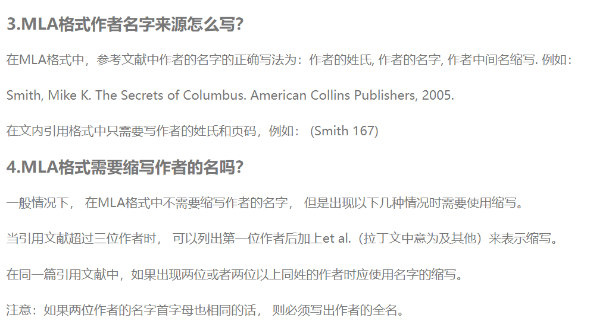

- [[Dec 30th, 2022]]
  collapsed:: true
	- The centimetre-gram-seconds (CGS) and the metre-kilogram-seconds (SI) unit systems
		- 厘米-克-秒 (CGS) 和米-千克-秒 (SI) 单位系统
	- hyphen
	- homophones
	-
	-
	- Manuscript received August 14, 2021; NirAndFar.com/Indistractable November 23, 2021;
	  accepted December 13, 2021. Date of publication December 20, 2021;
	  date of current version June 6, 2022. This work was supported in part
	  by the National Key Research and Development Program of China
	  under Grant 2018YFA0704102, in part by the National Natural Science
	  Foundation of China under Grants 81827805 and NSFC61771130, and
	  in part by the Basic Research Project of Shenzhen Science and T ech-
	  nology Innovation Commission under Grants JCYJ20200109114610201
	  and JCYJ20200109114812361. (Jianan He and Guangquan Zhou con-
	  tributed equally to this work.) (Corresponding authors: Shoujun Zhou;
	  Y ang Chen.)
	- Jianan He is with the Lab of Image Science and T echnology, Key
	  Laboratory of Computer Network and Information Integration (Ministry
	  of Education), Southeast University , Nanjing 210096, China (e-mail:
	  jiananhe@seu.edu.cn).
	  Guangquan Zhou is with the State Key Laboratory of Bioelectronics,
	  School of Biological Science and Medical Engineering, Southeast Uni-
	  versity, Nanjing 210096, China (e-mail: guangquan.zhou@seu.edu.cn).
	  Shoujun Zhou is with the Shenzhen Institutes of Advanced T echnol-
	  ogy, Chinese Academy of Sciences, Shenzhen 518055, China (e-mail:
	  sj.zhou@siat.ac.cn).
	  Y ang Chen is with the Lab of Image Science and T echnology, Key
	  Laboratory of Computer Network and Information Integration (Min-
	  istry of Education), Southeast University, Nanjing 210096, China, and
	  also with the Jiangsu Provincial Joint International Research Labora-
	  tory of Medical Information Processing, School of Computer Science
	  and Engineering, Southeast University , Nanjing 210096, China (e-mail:
	  chenyang.list@seu.edu.cn).
	  Digital Object Identifier 10.1109/JBHI.2021.3136597
	-
	-
	- Accepted February 9, 2021. Resubmitted for review on December
	  31, 2020. First submission on September 1, 2020. The authors acknowledge support from NIH grants 1R01DA038215-01A1 (PI Grewen),
	  R01-HD055741-12 (PI Piven), 1R01HD088125-01A1 (PI Botteron),
	  1R01MH118362-01 (PI Pruett) and 2R01EY013178-15 (PI Schumann).
	- * These authors contributed equally. All authors are with the Department of Computer Science and Engineering at New York University Tandon School of Engineering, Brooklyn, NY 11201 USA (e-mail addresses:
	  {mengwei.ren, neel.dey, james.fishbaugh, gerig}@nyu.edu).
	-
	-
	- Manuscript received August 14, 2021; revised November 23, 2021;
	  accepted December 13, 2021. Date of publication December 20, 2021;
	  date of current version June 6, 2022.
	-
	-
	- Accepted XXX  YYYY, 2022. Resubmitted for review on October 31, 2022. First submission on July 1, 2022. The work was supported in part by the National Key Research and Development Program of China under Grant 2018YFA0704102, in part by the First Affiliated Hospital of Nanjing Medical University under Grant XXX.
	- Liuwen Zou is with the Lab of Image Science and Technology, Key Laboratory of Computer Network and Information Integration (Ministry
	  of Education), Southeast University, Nanjing 210096, China (e-mail: 220212099@seu.edu.cn).
	- Yang Chen is with the Lab of Image Science and Technology, Key Laboratory of Computer Network and Information Integration (Min-
	  istry of Education), Southeast University, Nanjing 210096, China, and also with the Jiangsu Provincial Joint International Research Labora-
	  tory of Medical Information Processing, School of Computer Science and Engineering, Southeast University, Nanjing 210096, China (e-mail:
	  chenyang.list@seu.edu.cn).
	- Jingyu Li is with the Lab of Image Science and Technology, Key Laboratory of Computer Network and Information Integration (Ministry
	  of Education), Southeast University, Nanjing 210096, China (e-mail: 220212115@seu.edu.cn).
	- Digital Object Identifier XX/YY
	-
	-
	- 与拼接融合、简单的加权融合需要进度对比，这属于对比实验的内容，为了证明融合方式的有效性
	- 与传统的特征工程模型对比，需要证明获取到的特征比传统手工特征更为有效
	- 与经典的参数量稍微大、参数量很大的模型进行对比，证明当前模型非常适用于小样本（参数量小且效果不错）
	-
	- 其实我觉得在方法里没有特别的必要去写这个对比
	- 但是你需要写的是你这个方法的一个思想来源
	- 我觉得直接写在introduction部分，因为你要建立现有的工作与已有的工作联系
	-
	- 对比还是分小段来写比较清楚
		- 与特征工程方法对比
			- 我们用两种模式与这种方法进行对比。一种是基于特征工程的传统机器学习模型，包括SVM、随机森林；另一种是我们发明出来的极简模型（见图），即将该特征向量直接经过两层全连接层得到预测结果。从实验结果中可以得出，；不管怎么调整全连接层的参数，预测结果的准确率也不会超过，这说明了。。。。
		- 与其他简单模型对比
		- 与串接融合方式对比
			- 串接融合在验证集上的效果要比本文提出的方法要好
			- Concatenation fusion worked better on the validation set than the proposed SDWFM with a 0.0455 higher auc score, but worked much poorer on test set with a 0.0477 lower auc score. In addition, its difference of auc score between the validation and test set was 0.0693 while that of the proposed was 0.0239. Therefore, the proposed had better generalizability. Since the proposed had almost half less parameters at the same time, then we can say the proposed was better than concatenation fusion.
			-
			-
	-
	- 消融实验
		- 我们可以从表1的消融实验结果中得出两点结论。
		- Two conclusions can be inferred from results of ablation experiment displayed in Table I:
		- The fusion mechanism proved to be correct from the fact that the proposed outperformed resnet18 and densenet121 in all four metrics. Concretely, the proposed achieved 0.0703 higher auc score than both resnet18 and densenet121 on the validation set and 0.1169 higher auc score than resnet18, 0.0920 higher auc score than densenet121 on the test set.
		- The validity of multi-output weighted loss was verified from the comparison between the proposed and the w/o multi-output. The latter was 0.0270 lower auc score on validation set and 0.0942 lower auc score on test set.
		- 加权融合机制有效。提出的模型在验证集和测试集的四个指标上都要比resnet18和denseent121要好，具体来说，在训练家上有 。。。在测试集上，
		- 多输出的加权损失函数有效。
	-
	- In functionality, SDWFM has the potential to replace the average pooling which operates right before the classification head. As shown in Fig,  the 4 * 4 feature map is first downscaled by half through average pooling; then the four tokens in the derived feature map is fused into one vector through SDWFM.  We called this adaptation of average pooling Weighted Pooling, and tried to place it in resnet18 and densenet121.
	-
	-
	-
	- We present a similarity-decoding-based weighted fusion mechanism (SDWFM) with a novel multi-output weighted loss.  As quantified by improved auc/acc score demonstrated in ablation analysis and as qualified by grad-cam visual analysis, our method well combines the different characteristics of resnet18 and densenet121 and accelerates the convergence simultaneously. Further, we compared the proposed with three types of common approaches: resnet18 and densenet121 with concatenation fusion, machine learning models and deep model based on features from feature engineering, and classic classification models, which proved its effectiveness and low level of parameters. We also find that the designed fusion framework can also be applied in the pooling layer of resnet18 to achieve weighted pooling, resulting in even better performance than the proposed.
	- Some open issues exist and will be addressed in future work,
		- 模型的输入必须是裁剪且resize到固定尺寸的ROI，而不是原始的完整钼靶图片。也就是说，不能做到对ROI区域的自动检测。
			- The model must take as input an ROI which is cropped and resized to a fixed size, but not the original full mamographic image. In other words, automatic detection of the ROI region is not reachable.
		- The fusion mechanism in this study acts in a limited way on the resnet and densenet architectures. It is a challenge to effectively fuse several different kinds of models, for example, fusion of one vgg11, two resnet50 and three densenet169. The reasons for this come from two sources: the difficulty of training due to the large number of models, and the fact that the information from different models does not always be complementary but may even be contradictory to each other.
		- ROI在不同病人的钼靶图像上有较大的位置差异，部分ROI会包含过多的黑色底片背景，部分ROI会包含大量白色的周边组织，这会导致图片数据在灰度上差异较大，进而被模型视作不均匀分布的。这一点可以从损失函数曲线看出，验证集上的损失曲线正常下降，但测试集上的损失曲线变化频繁，并不能随迭代次数呈现规律的U型，这一点在所有模型的损失曲线中都是一致的，并非是由训练参数设置导致的。有试图对原始图片增加均衡直方图变化，如图所示，但最终结果不理想了。
			- Images tend to be seen as unevenly distributed by the model owing to the large differences in the grayscale between images. The reason behind this is that there is a large variation in the location of ROIs on mammogram images among patients, with some ROIs containing too much black background of the negative and some ROIs containing a large amount of white peripheral tissue. Thus, while the loss curve on the validation set decreases normally, the loss curve on the test set changes frequently and does not show a regular U-shape with the number of iterations, which is consistent across all models and is not caused by the training parameter settings. An attempt to enforce balanced histogram to the original image as shown in the Fig was made, but with a unsatisfactory result.
			-
	-
	-
	-
	- 参考文献
	- \bibitem{b1} F. Bray et al., ``GLOBOCAN estimates of incidence and mortality worldwide for 36 cancers in 185 countries,'' \emph{CA: a Cancer Journal for Clinicians}, vol. 71, no. 2021, pp. 209--249, 2020.
	- \bibitem{b2} L. Tabar et al., ``Mammography service screening and mortality in breast cancer patients: 20-year follow-up before and after introduction of screening,'' \emph{The Lancet}, vol. 361, no. 9367, pp. 1405--1410, 2003.
	- \bibitem{b3} American Cancer Society, ``Breast Cancer Early Detection and Diagnosis,'' emph{The Society}, 2008.
	- \bibitem{b4} D. Sankar, and T. Thomas, ``A new fast fractal modeling approach for the detection of microcalcifications in mammograms,'' Journal of Digital Imaging, vol. 23, no. 5, pp. 538--546, 2010.
	- \bibitem{b5} Y. Ma et al., ``A novel shape feature to classify microcalcifications,'' in \\emph{2010 IEEE International Conference on Image Processing}, pp. 2265--2268, 2010.
	-
	-
	- Cancer facts & figures
	-
	-
	-
	-
	-
	- \bibitem{b1} American Cancer Society, ``Breast Cancer Early Detection and Diagnosis'', US [Online]. Available:\underline{https://www.cancer.org/cancer/breast-cancer/}, Accessed on: July. 6, 2022
	- \bibitem{b2} R. Bonfiglio et al., ``Radiological, histological and chemic-al analysis of breast microcalcifications: diagnostic value and biological significance,'' \emph{Journal of Mammary Gland Biology and Neoplasia}, vol. 23, no. 1, pp. 89--99, 2018.
	- \bibitem{b3} M. Alsheh Ali,  K. Czene,  P. Hall, and K. Humphreys, ``Association of microcalcification clusters with short-term invasive breast cancer risk and breast cancer risk factors,'' \emph{Scientific reports}, vol. 9, no. 1, pp. 1--8, 2019.
	- \bibitem{b4}  F.  D.  Agide et al., ``A systematic review of health promotion interventions to increase breast cancer screening uptake: from the last 12 years,'' \emph{European journal of public health}, vol. 28, no. 6, pp. 1149--1155, 2018.
	- \bibitem{b5}  The American society of clinical oncology (ASCO) Breast Cancer, ``Breast Cancer: Screening'', US [Online]. Available: \underline{https://www.cancer.net/cancer-types/breast-cancer/screening}, Accessed on: July. 6, 2022
	- \bibitem{b6}  P. A. Hernández et al., ``Breast calcifications: description and classification according to bi-rads 5th edition,'' \emph{Rev. Chil. Radiol}, vol. 22, pp. 80--91, 2016.
	- \bibitem{b7}  Y. Jiang  et al., ``Evaluation of the role of dynamic contrast-enhanced MR imaging for patients with BI-RADS 3–4 microcalcifications,'' \emph{PLoS One}, vol. 9, no. 6, pp. e99669, 2014.
	- \bibitem{b8}  R. M. Haralick, K. Shanmugam, and I. H. Dinstein, ``Textural features for image classification,'' \emph{IEEE Transactions on systems, man, and cybernetics}, vol. 6, pp. 610--621, 1973.
	- \bibitem{b9}  M. W. Davidson, and M. Abramowitz, ``Molecular expressions microscopy primer: Digital image processing-difference of gaussians edge enhancement algorithm,'' \emph{Olympus America Inc., and Florida State University}, 2006.
	- \bibitem{b10}  T. Ojala, M. Pietikainen, and T. Maenpaa , ``Multiresolution gray-scale and rotation invariant texture classification with local binary patterns,'' \emph{IEEE Transactions on pattern analysis and machine intelligence}, vol. 24, no. 7,  pp. 971--987, 2002.
	- \bibitem{b11}   G. Guo,  H. Wang,  D. Bell, Y. Bi, and K. Greer, ``KNN model-based approach in classification,'' in \emph{OTM Confederated International Conferences" On the Move to Meaningful Internet Systems",} Berlin, Heidelberg, 2003, pp. 986-996.
	- \bibitem{b12}  M. Collins,  R. E. Schapire, and Y. Singer, ``Logistic regression, AdaBoost and Bregman distances,'' \emph{Machine Learning}, vol. 48, no. 1,  pp. 253--285, 2002.
	- bibiitem{b13}  L. Breiman, ``Random forests,'' \emph{Machine Learning}, vol. 45, no. 1,  pp. 5--32, 2001.
	- \bibitem{b14}   G. Guo,  H. Wang,  D. Bell, Y. Bi, and K. Greer, ``A non-parametric mixture of Gaussian naive Bayes classifiers based on local independent features,'' in \emph{Artificial intelligence and signal processing conference (AISP),} 2017, pp. 209--212.
	- bibitem{b15}  K. Fukushima, and S. Miyake, ``Neocognitron: A self-organizing neural network model for a mechanism of visual pattern recognition,'' in \\emph{Competition and cooperation in neural nets,} Berlin, Heidelberg, 1982, pp. 267--285.
	- bibitem{b16} F. Yu, and V. Koltun, ``Multi-scale context aggregation by dilated convolutions, ", \\emph{arXiv preprint arXiv: arXiv preprint arXiv:1511.07122}, 2017.
	- bibitem{b17}  A. Vaswani, et al., ``Attention is all you need, ",  \\emph{Advances in neural information processing systems}, vol. 30, 2017.
	- bibitem{b18}  D. H. Ballard, ``Modular learning in neural networks, " in \\emph{AAAI, } vol. 647, pp. 279--284, 1987.
	- bibitem{b19}  K. He, X. Zhang, S. Ren, and J. Sun, ``Deep residual learning for image recognition," in \\emph{Proceedings of the IEEE conference on computer vision and pattern recognition (CVPR), } pp. 770--778, 2016.
	- bibitem{b20} G. Huang et al., ``Densely connected convolutional networks," in \\emph{Proceedings of the IEEE conference on computer vision and pattern recognition}, pp. 4700--4708, 2017.
	-
	-
	- bibitem{21}   A. Krizhevsky,  I. Sutskever, and G. E. Hinton, ``Imagenet classification with deep convolutional neural networks, '' \\emph{Advances in neural information processing systems, } vol. 25, 2012.
	- bibitem{22}  K.  Simonyan, and A.  Zisserman, ``Very Deep Convolutional Networks for Large-Scale Visual Recognition,'' \\emph{arXiv preprint arXiv:1409.1556, } 2014.
	-
	- bibitem{23}  A. G. Howard et al,  ``Mobilenets: Efficient convolutional neural networks for mobile vision applications, '' \\emph{arXiv preprint arXiv:1704.04861, } 2017.
	-
	- bibitem{24}  Z. Liu et al., ``Swin transformer: Hierarchical vision transformer using shifted windows," in \\emph{Proceedings of the IEEE/CVF International Conference on Computer Vision, } pp. 10012--10022, 2021.
	-
	- bibitem{25} A. Dosovitskiy et al., ``An image is worth 16x16 words: Transformers for image recognition at scale," \\emph{arXiv preprint arXiv: 2010.11929, } 2020.
	-
	- bibitem{26}  H. Touvron,  M. Cord,  A. Sablayrolles,  G. Synnaeve, and H. Jégou, ``Going deeper with image transformers,'' in \\emph{Proceedings of the IEEE/CVF International Conference on Computer Vision}, pp. 32-42, 2021.
	-
	- bibitem{27}  X. Ouyang et al., ``Self-adversarial learning for detection of clustered microcalcifications in mammograms,'' in \\emph{International Conference on Medical Image Computing and Computer-Assisted Intervention}, pp. 78--87, 2021.
	-
	-
	-
	-
	-
	- bibitem{27}  D. Zhou et al., ``Deepvit: Towards deeper vision transformer, '' \\emph{arXiv preprint arXiv:2103.11886,} 2021.
	-
	-
	-
	- bibitem{28} Y. Chen et al., ``Dual path networks, " \\emph{Advances in neural information processing systems,} vol. 30, 2017.
	-
	- bibitem{29}  X. Pan et al., ``On the Integration of Self-Attention and Convolution," \\emph{arXiv preprint arXiv:2111.14556,} 2021.
	-
	- bibitem{30}  W. Shen et al.,  ``Deep regression forests for age estimation,'' in \\emph{Proceedings of the IEEE conference on computer vision and pattern recognition, } pp. 2304-2313, 2018.
	-
	- bibitem{31}  A. Roy, and S. Todorovic, ``Monocular depth estimation using neural regression forest,'' in \\emph{Proceedings of the IEEE conference on computer vision and pattern recognition,} pp. 5506-5514, 2016.
	-
	- bibitem{32}  P. Kontschieder, M. Fiterau, A. Criminisi, and S. R. Bulo, ``Deep neural decision forests, ''  in \\emph{Proceedings of the IEEE international conference on computer vision, } pp. 1467-1475, 2015.
	-
	- bibitem{33}  R. Tanno, K. Arulkumaran, D. Alexander, A. Criminisi, and A. Nori, ``Adaptive neural trees," in \\emph{International Conference on Machine Learning,} pp. 6166-6175, 2019.
	-
	-
	- bibitem{34} Z. H. Zhou, and J. Feng, ``Deep forest,''  \\emph{National Science Review,} vol. 6, no. 1, pp. 74--86, 2019.
	- bibitem{35}  L. K. Hansen, and P. Salamon, ``Neural network ensembles, '' \\emph{IEEE transactions on pattern analysis and machine intelligence, } vol. 12, no. 10, pp. 993--1001, 1990.
	- bibitem{36}  L. Breiman, ``Bagging predictors,'' \emph{Machine learning,} vol. 24, no. 2, pp. 123--140, 1996.
	- bibitem{37} R. E. Schapire, ``The strength of weak learnability,'' \\emph{Machine learning,} vol. 5, no. 2, pp. 197--227, 1990.
	- bibitem{38}  L. Breiman, ``Stacked regressions,'' \emph{Machine learning,} vol. 24, no. 1, pp. 49--64, 1996.
	- bibitem{39} M. Li, L. Zhu, G. Zhou, J. He, Y. Jiang, and Y. Chen, ``Predicting the pathological status of mammographic microcalcifications through a radiomics approach,'' \\emph{Intelligent Medicine,} vol. 1, no. 03, pp. 95--103, 2021.
	-
	- bibitem{40}  M. Tan, and Q. Le, ``Efficientnet: Rethinking model scaling for convolutional neural networks,'' in \\emph{International conference on machine learning,} pp. 6105--6114, 2019.
	-
	- bibitem{41}  R. R. Selvaraju et al., ``Grad-cam: Visual explanations from deep networks via gradient-based localization,'' in \emph{Proceedings of the IEEE international conference on computer vision,} pp. 618-626, 2017.
	-
	-
	-
	- 摘要
	- It has seen the growing use of artificial intelligence technologies in predicting the pathological status of non-palpable suspicious breast microcalcifications. However, traditional machine learning methods based on radiomics are time-consuming while deep learning models are limited in the range of simple ones like resnet50 due to the small size of medical datasets. The study aims to design a slightly complex model by trying to fuse different information from different sources. The proposed model created two blocks for fusion: model fusion block and feature fusion block. The former used vector averaging strategy for the output vectors of different models; the latter used adapted transformer and feature widening. The experiment results revealed that our model outperformed all other models in the overall performance with an acc of 98.70% (sensitivity=99.49%, specificity=97.88%) on the training set and an acc of 83.72% (sensitivity=86.36%, specificity=80.95%) on the testing set, concluded from which the prediction performance was improved greatly especially on the malignant label. The experiment demonstrates the validity of our fusion mechanism and boosts confidence on the proposed research direction.
	-
	-
	- Artificial intelligence technologies, including machine learning based on radiomics and deep models, have been widely used in predicting the pathological status of non-palpable suspicious breast microcalcifications. However, either they are time-consuming or they tend to be undertrained due to the small size of medical images; model fusion strategies that integrate information from multiple models are then explored, but existing ones lack of interpretability and operational simplicity.  In this paper, we propose a similarity-decoding-based weighted fusion mechanism to ensemble resnet18 and densenet121, which is inspired from ordinary weighting strategy. In our method, a shared latent embedding is used to decode the similarity of values at the same position of two vectors and generate the weights through softmax. We also invent a multi-output loss function to help the model train in one pass. The experiment results showed that the propose outperformed all other methods with an auc of 0.8387 on the validation set and an auc of 0.8626 on the test set. In addition, the expansion experiment and grad-cam analysis further proved the effectiveness and reasonableness of the novel fusion mechanism. More work on the workflow of weighted fusion is worth exploring.
	-
	-
	- A Similarity-Decoding-Based Weighted Fusion Mechanism for Predicting the Pathological State of Mammogram Microcalcifications
	-
	-
	- 感觉特别懵逼，不知道到底几个人才需要写成et al
	- 还有一个就是这个名字的问题，我发现自己其实压根就没有搞懂
		- 一般英文论文里面是 名字 + 姓氏 这样的形式，只有GB/T和APA里面才是 姓氏 + 名字 这样的
		- 所以可以直接把GB/T的顺序颠倒就可以了
		- APA中名字的顺序与GB/T是相同的：APA格式规定“参考文献”部分的人名必须以姓(Family name)的字母顺序来排列，包括名(first name)的前缀。 譬如，James Smith应被改成“Smith,J.,”；Saif Al Falasi则改成“Al-Falasi, Saif.”
		- APA和GB/T中都是把名字对应的单词进行了缩写，而姓氏对应的单词不进行缩写
			- 即：姓氏的全称单词 + 名字的缩写单词
			- 但是：ＧＢ/T 中 姓氏的全称单词 与 名字的缩写单词之间是没有任何额外的分割符的，但是APA格式中使用 “，”作为分割符
		- TMI格式中为： 名字的缩写单词 + 点号 +　姓氏的全称
			- 或者　将 GB/T格式或者APA格式 中的 顺序进行颠倒，然后替换相应的分割符号就行了
		- 
		-
-
- [[Dec 31st, 2022]]
  collapsed:: true
	- A feature-level ensemble method based on similarity decoding for deep models to classify the Pathological State of Mammogram Microcalcifications
	  :LOGBOOK:
	  CLOCK: [2022-12-31 Sat 16:40:23]
	  :END:
	- A feature-level similarity-decoding-based method for deep models ensemble in the classification of Mammogram Microcalcifications
	- A Multi-Group Similarity-Decoding-Based Weighted Fusion Mechanism for Predicting the Pathological State of Mammogram Microcalcifications
	- 在现有的乳腺钼靶图像分类研究中，通常使用多任务的方法。
	- Multi-task strategy has been employed in the current research.
	- 然而，由于深度学习的参数量巨大，这些模型非常容易过拟合而导致泛化性能差。
	- 为了提高泛化性能，深度集成学习发展起来。
	- 其指的是用集成学习的方法来集成深度模型，因为集成方法通过将多个模型结合起来从而具有更好地泛化性能，而深度学习模型通常比浅层模型或者传统模型具有更好地性能。
	- To improve the generalization performance, deep ensemble learning has been rapidly developed,  22.5\% of whose applications lie in image classification [28]. It combines deep learning and ensemble learning, therefore obtaining both advantages.
	-
	- As is known, ensemble learning could obtain better generalization performance through combing several individual models. Therefore,  deep ensemble learning, which combines deep learning and ensemble learning, has been rapidly developed. Since it obtains both advantages, 22.5\% of its applications lie in image classification [28].
	-
	- Z Hameed et al.
	-
	-
	- It, therefore obtaining both advantages.
	-
	- As is known, ensemble learning could obtain better generalization performance through combing several individual models. Therefore, deep ensemble learning models, which combines deep learning and ensemble learning, has been rapidly developed. Since it obtains both advantages, it has been widely applied in image classification, approximately 22.5\% in its total applications [28]. For breast cancer, deep ensemble learning has been applied on breast histopathology images. For example, Z Hameed et al. [33] took the average of predicted probabilities to ensemble VGG16 and VGG19. However, it has been seldom explored on mammograms.
	- 因为后面的大量篇幅都提到的是模型融合、并且描述思路也是说融合，我觉得要么就把后面的这些全部改正，要么就设计一个巧妙的过渡方式。第一个到底还要不要用multi-group，可以描述这样的操作过程，但是方法名称里面还是用feature-level；第二个是就是将这个集成方法具体实现后的模型到底要不要取新的名称，还是说直接用proposed就行；第三个后续图片里面写的都是fusion，而不是ensemble。针对两个问题来进行描述：从传统方法的特征提取过程可以受到启发，不同的特征对于分类具有不同的相关性和重要性，现有的模型集成方法是给一个模型整体赋值一个权重，这会使得单个模型对最终结果的影响过大，且没有考虑到模型提取到的所有单个特征之间的区别；使用基于相似性解码的方法来实现动态的权重参数计算，这个方法的参数量小、思路简单，并且具有一定的可解释性。
	- 传统方法特征提取过程的启发（不同特征对于分类具有不同的相关性）+ 单个模型的特征也因此有重要的也有不重要的（或者说有相关性高的，也有相关性低的）+ 将模型集成过程转化为特征级别的融合过程 + 具体的大概流程（先分组，每组内进行权重的计算和加权融合，每组对应一个级别的特征？，每组内的特征是相同位置的）； + 一两句话概括权重计算过程 + 简单、参数量低、有一定可解释性
	  collapsed:: true
		- The sensitivity of average method comes from the
		-
		- 普通的平均集成策略中，一个权重对应于一个模型，这也就是说该模型输出的所有特征都对应于同一个权重。这是敏感度的来源。但是事实上，即便是单个模型，其提取到的所有特征与分类任务也具有不同的相关性。This conclusion can be inspired from the feature extraction step in traditional methods。所以，我们将模型集成转化为特征级别的、数据自适应的加权融合过程。To achieve feature-level ensembling, we design a multi-group strategy. 假设每个模型都输出相同数量的特征，也就是说相同长度的特征向量。To make weights calculation data-adaptive, we design a similarity-decoding-based method. A learnable latent vector L is firstly introduced to denote most essential features related to classification. Then, individual features within every group are linearly transformed into vectors. These vectors are used to calculate the inner product with L respectively. Undoubtedly,  the operation of inner product can decode the similarity between L and each individual feature. Therefore, the normalized results can reflect the relative importance of different features.  In summary, this new method of model ensembling is called as multi-group similarity-decoding-based weighted fusion mechanism (MG-SDWFM).
		-
		- In the emsembling procedure of naive averaging, a weight corresponds to a model, which means that all features produced by that model are assigned the same weight. The sensitivity comes from this. But in fact, even for a single model, all the features extracted by it have varying degrees of relevance to the classification task. This conclusion can be verified from the feature extraction step in traditional methods. Therefore, we transform model ensembling into a feature-level, data-adaptive weighted fusion process. To achieve feature-level ensembling, we design a multi-group strategy. Assume that each model outputs the same number of features, i.e. a feature vector with the same length. Then we group features according to their positions in the feature vector. Individual features at the same index in the feature vectors of different models form a group, and feature fusion is performed only within each group. To make weights calculation data-adaptive, we design a similarity-decoding-based method. A learnable latent vector L is firstly introduced to denote most essential features related to classification. Then, individual features within every group are linearly transformed into vectors. These vectors are used to calculate the inner product with L respectively. Undoubtedly,  the operation of inner product can decode the similarity between L and each individual feature. Therefore, the normalized results can reflect the relative importance of different features.  In summary, this new method of model ensembling is called as multi-group similarity-decoding-based weighted fusion mechanism (MG-SDWFM).
		-
		- We propose a multi-group similarity-decoding-based weighted fusion mechanism (MG-SDWFM) to  achieve a feature-level data-adaptive process for deep models ensembling.
		-
		- To achieve a feature-level data-adaptive process for deep model ensembling, we propose a multi-group similarity-decoding-based weighted fusion mechanism (MG-SDWFM). We successfully apply MG-SDWFM to ensemble resnet18 and densenet121 on the classification of mammograms MCs. On our own hospital-collected dataset, the proposed model outperforms resnet18 or densenet121 alone and the concatenation fusion strategy, demonstrating the effectiveness of our scheme. In addition, the approach beats machine learning and traditional deep models in terms of both qualitative and quantitative performance. Through grad-cam visualizations, we find that our method can locate calcifications more precisely.
		-
		- Analyzing the pathological status from breast microcalcifications in mammograms is very challenging because of tiny and shape-variant lesions. The current state-of-the-art approaches rely on radiomics-based machine learning and deep learning methods. However, the former is time-consuming, and the latter tends to underfit due to the small size of the medical dataset. Recently, decision fusion in ensemble deep learning has shown promise in medical image analysis, but the existing fusion strategies still lack interpretability and operational simplicity. In this paper, a multi-group similarity-decoding-based weighted fusion mechanism, dubbed MG-SDWFM, is proposed, which is an adaption of vanilla weighted averaging. We divide all individual features into multiple groups according to the position and execute fusion only within the group. In the fusion process, a shared latent embedding $L$ is introduced to represent the most essential features for classification. With the help of the inner product, the similarity between $L$ and each vectorized feature is calculated and the relative importance of different features is then obtained in the form of weights. Additionally, we add an auxiliary output for each model to provide supervision and devise a multi-output loss to help the model train. The experimental results on the in-house dataset show the effectiveness of the proposed over other state-of-the-art methods, achieving an AUC of 0.885.
		-
		-
		- Then we treat all the individual features in the same position of all feature vectors as in the same group and fuse the features only within each group.
		- 我们按照特征在特征向量中的位置进行分组。不同模型特征向量中同一位置的单个特征组成一组，同时特征融合也只在每组内进行。
			- We group features according to their positions in the feature vector. Individual features at the same index in the feature vector of different models form a group, and feature fusion is performed only within each group.
		-
	- 应用到我们的问题时 + 为何要选择两类模型 + 多任务的损失函数辅助训练过程（普通的集成指代的输出是经过全连接层后的结果，但是这里是未经过全连接层后的结果，我觉得直接把这一点在前面的创新之处就指代出来，解释一下sensitivity的原因是这样的。这样差不多就行了
	- 然后三个贡献：
	- we aim to improve the prediction of the pathological state of MCs by adapting the fusion scheme of vanilla weighted averaging. Firstly, we execute weighted fusion on the level of the individual feature instead of the whole model. In the original method, a weight corresponds to all the individual features (i.e. the feature vector) extracted by a single model. Obviously, this is unfair because different features have different degrees of interpretability and relevance, which can be learned from radiomics.  Therefore, we propose the strategy of multi-group weighted fusion. We treat all the individual features in the same position of feature vectors as in the same group and fuse the features only within each group. Secondly, the within-group weights must be dynamically calculated and data-adaptive. This is required by the large variance of calcification points among images and the richness of model combinations. We address the problem by designing a multi-group similarity-decoding-based weighted fusion mechanism, abbreviated as MG-SDWFM. A learnable latent vector L is introduced to denote the most essential features related to classification. Individual features within every group are linearly transformed into vectors and then these vectors are used to calculate the inner product with L respectively. Undoubtedly,  the inner product operation can decode the similarity between L and each individual feature, and the normalized results represent the relative importance of different features.
	- assigns all the individual features extracted by a single model the same weights and
	-
	-
	- [[$red]]==The classification of mammograms scored at BI-RADS 4 is very challenging as MCs have great variance in shape and distribution. Traditional machine learning and deep models are either time-consuming or cannot be well generalized. Recently, deep ensemble learning, enjoying the advantage of better generalization, has been rapidly developed. However, common ensembling strategies around weighted average are sensitive to biased learners and need complex tricks to achieve data-adaption. In this paper, we propose a feature-level data-adaptive method for deep model ensembling, which can resolve above two issues. The core idea is that we transform model ensembling into a feature-level fusion process. We design a multi-group similarity-decoding-based weighted fusion mechanism, dubbed MG-SDWFM, to achieve this. Specifically, we first make a feature-level division by grouping all individual features of different models according to the index. Then we perform feature fusion within each group respectively. In the fusion process, a shared latent embedding $L$ is introduced to represent the most essential features for classification. With the help of the inner product, the similarity between $L$ and each vectorized feature is calculated and the relative importance of different features is then obtained in the form of weights. We then ensemble resnet18 and densenet121 using MG-SDWFM and apply it on mammograms. The experimental results on the in-house dataset show the effectiveness of the proposed over other state-of-the-art methods, achieving an AUC of 0.885.==
	-
	- The current state-of-the-art approaches include  . However, the former is , and the latter has poor generalization performance. To improve generalization,  mainly focusing  on weighted averaging   But current strategies are sensitive to biased learners and need complex tricks to achieve data-adaption.
	-
	- This conclusion can be obtained from the feature extraction step in traditional methods.
	-
	-
	- However,  tends to underfit due to the small size of the medical dataset. Recently, decision fusion in ensemble deep learning has shown promise in medical image analysis, but the existing fusion strategies still lack interpretability and operational simplicity. In this paper, a multi-group similarity-decoding-based weighted fusion mechanism, dubbed MG-SDWFM, is proposed, which is an adaption of vanilla weighted averaging. We divide all individual features into multiple groups according to the position and execute fusion only within the group. In the fusion process, a shared latent embedding $L$ is introduced to represent the most essential features for classification. With the help of the inner product, the similarity between $L$ and each vectorized feature is calculated and the relative importance of different features is then obtained in the form of weights. Additionally, we add an auxiliary output for each model to provide supervision and devise a multi-output loss to help the model train. The experimental results on the in-house dataset show the effectiveness of the proposed over other state-of-the-art methods, achieving an AUC of 0.885.
	-
	- So in this work, we aim to design a new method for deep models ensembling to address aforementioned two issues:
	  sensitivity to biased learners and complexity to achieve data-adaption, and adopt it in the classification of mammograms MCs. In the procedure of averaging, a weight corresponds to a model, which means that all features produced by that model are assigned the same weight. The sensitivity comes from this as all the features extracted by a single model should have varying degrees of relevance to the classification task. Therefore, we transform model ensembling into a feature-level ensembling process using invented multi-group strategy. Assume that each model outputs the same number of features, i.e. a feature vector with the same length. Then we group features according to their positions in the feature vector. Individual features at the same index in the feature vectors of different models form a group, and feature fusion is performed only within each group. To make data-adaption simpler, we design a similarity-decoding-based method. A learnable latent vector L is firstly introduced to denote most essential features related to classification. Then, individual features within every group are linearly transformed into vectors. These vectors are used to calculate the inner product with L respectively. Undoubtedly,  the operation of inner product can decode the similarity between L and each individual feature. Therefore, the normalized results can reflect the relative importance of different features.  In brief, this new method of model ensembling is called as multi-group similarity-decoding-based weighted fusion mechanism (MG-SDWFM). When applying on classification of mamograms MCs, we choose two models, resnet18 and densenet121, to ensemble. We limit the number of models to 2 to reduce the complexity. As for model selection, resnet18 and densenet121 can theoretically capture features that complement each other. The former is good at extracting shallow features and reusing them, and the latter is good at extracting deep features and discovering new ones [33]. Additionally, resnet18 and densenet121 are separately the one with the fewest parameters in the network architectures of resnet and densenet, which is suitable for our small in-house dataset.
- [[Jan 15th, 2023]]
  collapsed:: true
	- Analyzing the pathological status from breast microcalcifications in mammograms is very challenging because of tiny and shape-variant lesions. The current state-of-the-art approaches rely on radiomics-based machine learning and deep learning methods. However, the former is time-consuming, and the latter tends to underfit due to the small size of the medical dataset. Recently, decision fusion in ensemble deep learning has shown promise in medical image analysis, but the existing fusion strategies still lack interpretability and operational simplicity. In this paper, a multi-group similarity-decoding-based weighted fusion mechanism, dubbed MG-SDWFM, is proposed, which is an adaption of vanilla weighted averaging. We divide all individual features into multiple groups according to the position and execute fusion only within the group. In the fusion process, a shared latent embedding $L$ is introduced to represent the most essential features for classification. With the help of the inner product, the similarity between $L$ and each vectorized feature is calculated and the relative importance of different features is then obtained in the form of weights. Additionally, we add an auxiliary output for each model to provide supervision and devise a multi-output loss to help the model train. The experimental results on the in-house dataset show the effectiveness of the proposed over other state-of-the-art methods, achieving an AUC of 0.885.
	-
	- We proposed a feature-level data-adaptive method for deep model ensembling, which works through our multi-group similarity-decoding-based weighted fusion mechanism (MG-SDWFM). For the classification task of mammograms MCs, we successfully ensemble resnet18 and densenet121 using MG-SDWFM. On our own hospital-collected dataset, the proposed model outperforms resnet18 or densenet121 alone and the concatenation fusion strategy, demonstrating the effectiveness of our scheme. In addition, the approach beats machine learning and traditional deep models in terms of both qualitative and quantitative performance. Through grad-cam visualizations, we find that our method can locate calcifications more precisely.
	-
	- Later, deep learning methods, have been successfully applied to many medical image analysis tasks, including image classification [24][25]. In the network structures of these models, feature extraction is implemented by a feature extraction block and a max pooling operation, and feature classification is via fully connected layers (FCs). Multi-task strategy has gained popularity in its employment. Y. C. Hsieh et al. [26] first used VGG16 and Mask RCNN to find MCs, and then used Inception V3 to identify benignity and malignancy. But this is a multi-stage method. X. Ouyang et al. [27] proposed an end-to-end model combining classification, segmentation and clustering detection. However, these models tend to be overfitting and have poor generalization performance due to huge parameters.
-
- transforming model ensembling into a feature-level fusion process. \
- [[Feb 21st, 2023]]
	- In this work, we aim to design a new strategy for deep models ensembling to address aforementioned two issues: sensitivity to biased learners and complexity to achieve data-adaption. The sensitivity comes from the fact that all features produced by single model are assigned the same weight in the procedure of averaging. However, inspired from radiomics, these features should have varying degrees of relevance to the classification object. In order to calculate a unique weight for every feature, we invented a multi-group strategy. We group features according to their positions in the feature vector and perform feature-level weighted fusion within each group. To achieve data-adaption in a simple way, we design a similarity-decoding-based pipeline to calculate weights within each group. A learnable latent vector L is firstly introduced to denote most essential features related to classification. Then we decode the similarity between L and each vectorized feature using inner product, which can reflect the relative importance of different features. For brevity, we denote this feture-level data-adaptive strategy for deep models ensembling as multi-group similarity-decoding-based weighted fusion mechanism (MG-SDWFM).
		-
		- 把问题和解决方案能够对应起来就好，这样写确实别人不能直观的看出来
		- 对于这个问题的描述用了两个名词短语，是否能让别人理解，是否准确呢
		- 到底要不要在这里写应用的这个目的呢
		- 描述两个问题的解决方案时读起来很混乱，因为一下子有then，later等词汇，一下子又没有
		-
	- 我发现我脑子转速特别慢，所以说不出实质性的话，只能是用抽象概念来搪塞问题。
	- 概览部分该怎么重表述呢：
	  collapsed:: true
		- We have two innovations in the architecture of  deep model ensembling. Firstly,  we adjust backbones' structures from a conventional single Fc (fully connected layer) into two Fcs $fc_1$ and $fc_2$ (see Fig. 4). And two $c_1$-lengthy feature vectors $m$ and $n$ are obtained right after corresponding $fc_1$. The reason is that the number of output neurons of the Fc (i.e. the number of categories N) is insufficient for effective fusion. To provide supervision for feature extraction, we also allow addition outputs of classification from $fc_2$ and adopt the multi-output weighted loss function to train the model. Secondly,  $m$ and $n$ are fused into  vector $f$ with the same length of $c_1$ in the model ensembling block. The block functions through our proposed MG-SDWFM.
		-
		- 在摘要中已经说明了缩写的东西，还需要再次在method里面写一遍吗
		-
		-
		- As for backbone selection, we limit the number of models here to 2 to reduce the complexity.  In terms of model performance, resnet18 is good at extracting shallow features and reusing them while densenet121 is good at extracting deep features and discovering new ones [33]. Therefore, they can theoretically capture complementary features.  In terms of computational efficiency, resnet18 and densenet121 are separately the one with the fewest parameters in the corresponding network architectures, which is suitable for our small in-house dataset.
		- 论文写作也是得找到一个大纲性的线索，如果没有线索，就没有办法接着写下去。
		-
	- 自适应的作用、实现和创新：
		- 使得计算出的权重与数据本身密切相关，因为MCS本身数据的复杂性就比较高
		- 自适应的关键其实就是权重的动态计算
		- 创新就是利用内积来计算相似性，利用相似性来measure分类的重要性或者说相关性
		- we make it data-adaptive to calculate weights using our invented similarity-decoding-based method. As the  MCs have great variance in shape and distribution, data-adaptive weights  will help obtain more accurate features and improve accuracy even on some hard samples. Our method only utilises inner product and softmax operation to calculate weights, greatly reducing the complexity compared to traditional mathematical methods.
	- The inner product of $L$ and the vectorized feature can be used approximatively as a measure of relevance. This is because a larger inner product indicates a greater similarity between $L$ and that feature.
	-