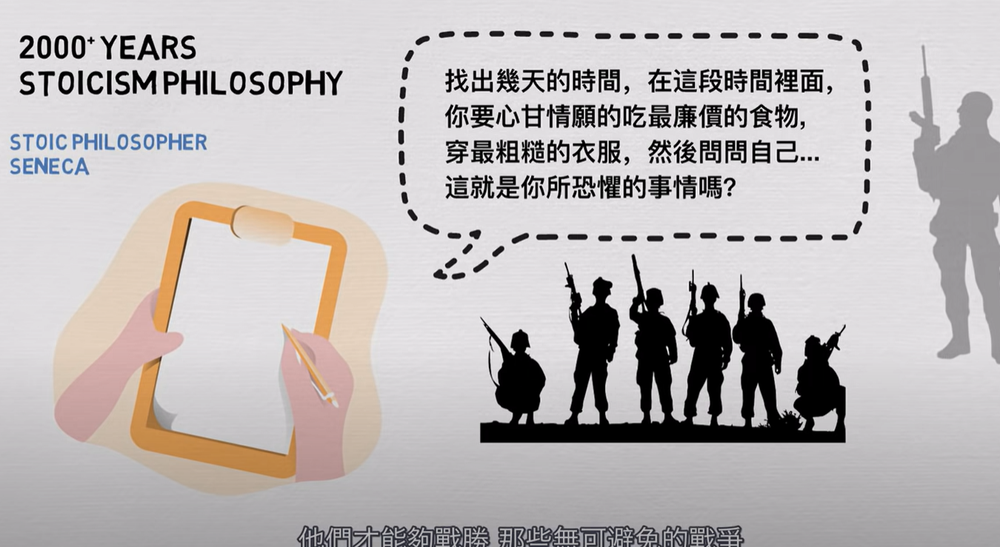
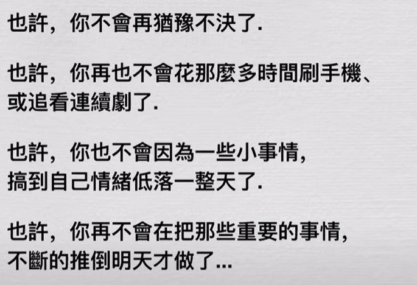
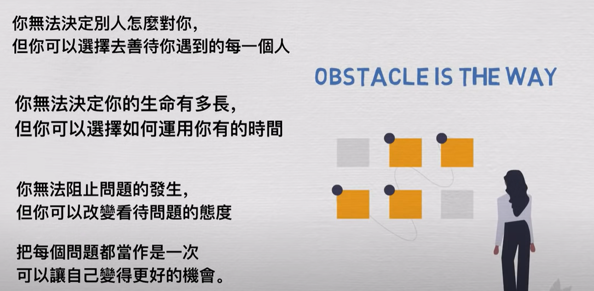

- [[斯多葛主义(Stoicism)]] [[MindModels]]
	- [[提前思考最坏的结果(PremeditatioMalorum)]]
	  collapsed:: true
		- 
		- 这个生活哲学需要 [[刻意练习]]，一定要非常仔细地去描述最坏的结果，并给自己创办条件去[[模拟练习]]，比如：
			- 给自己一个星期的时间，限定自己只能花费100元，然后去体验一下在这种极端的情况下，要如何去行动？你会怎么样重新出发？
				- 吃便宜的食物比如泡面、在优惠的商家购买食品、购买比较能够充饥的食物
		- 对最坏情况的预测是消极的思维方式吗？[[思维方式(WayOfThinking)]] [[MindsetManager]]
			- 并不是，反而会使得我们在应对问题时更加坦荡，减少焦虑。
			- [[如果不想在危机来临时感到害怕的话，那就在危机来临之前训练自己吧]]
			- [[不断地去接触自己害怕的事情，那么你的恐惧就不会那么大了]]
			- [[AnythingThatCanGoWrongWillGoWrong]][[LowExpectationWillBringYouSurprise]]
			- [[HopeForTheBestWhilePrepareForTheWorst]]
			-
	- [[思考死亡(MementoMori)]] [[MindsetManager]]
	  collapsed:: true
		- 对死亡的意识才是获得快乐的关键：[[WeAreNotGivenAShortLifeButWeMakeItShort]]
		- [[对时间保持基本的敬畏，即思考哪些事情你应该少花一些时间，哪些事情你应该多花一些时间]]
		- [[意识到时间选择的成本，就能督促我们采取有效的行动，避免遗憾]]
		  collapsed:: true
			- 
			-
	- [[遵循美德就是面对一切问题的答案了]] [[MindsetManager]]
	  collapsed:: true
		- 作为一名付出者，并不会帮你赢得100米冲刺，但是可以帮助你赢得马拉松
		- 适当地不带私心的去帮助别人，保持善良的来生活，好事就会发生在你身上的
		- 你越是不带私心地去帮助别人，好事终究会发生在你身上的
		- [[ItIsNotThingsThatUpsetUs-ItIsOurJudgementAboutThings]]
		-
	- 总结：永远都是由选择的
	  collapsed:: true
		- 
-
-