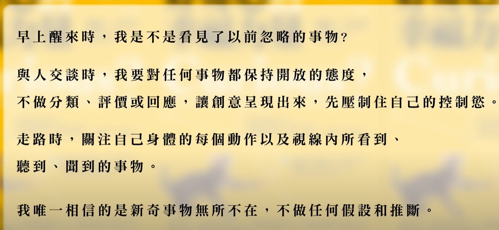
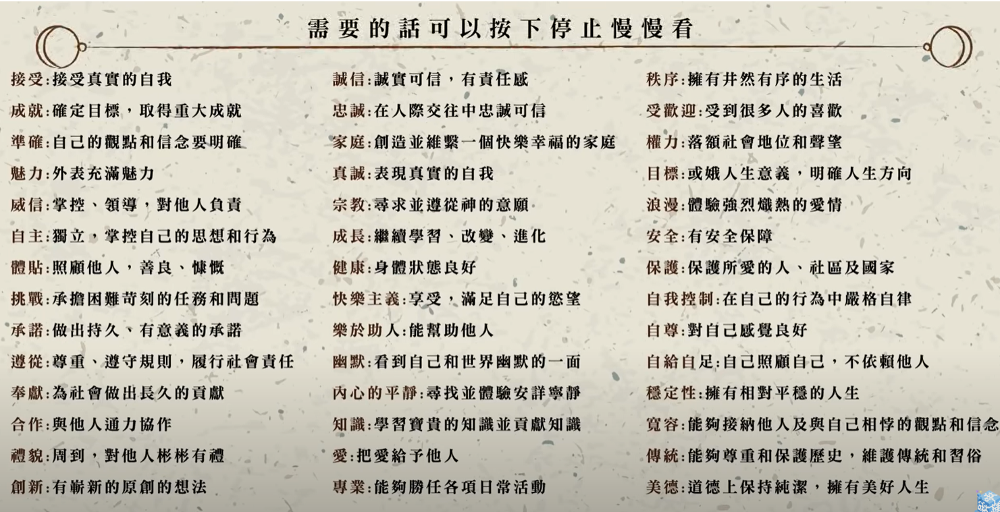

- 如何减压？ [[SolutionNotes]]
	- [[听音乐]]
		- 听莫扎特的古典音乐，而不听摇滚音乐（会刺激[[愤怒荷尔蒙(去甲肾上腺素)]]）
	- [[离开案发现场]]
		- 去洗手间洗脸或者打电话
		- 到楼下快走散步
	- [[冥想(Meditation)]][[呼吸式冥想]]
		- 会帮助分泌[[抗压荷尔蒙(血清素)]]
		- 吸气时想象把能量吸收进来，呼气时想象把压力释放出去
	- [[代理体验法]]
		- 寻找与自己水平相当但成功的人，通过代理他们成功的体验让自己重获[[信息]]
	- [[Gratitude]]
		- 每天写下三件自己感恩的事，这有利于让自己保持幸福感
	- [[为他人祷告]]
		- 为自己带来爱的力量
	- [[每天大笑15min]]
		- 身心合一，不开心也要笑
	- [[不把快乐当做唯一目标，追求快乐的过程中保持随时的好奇心]]
		- 
			- 不要开启思维的[[自动驾驶]]模式
		- 
			- 将价值观和自己要做的事情结合
		-
- 解压实践：
	- DONE 撕卫生纸
	- DONE 整理相册
	- DONE 整理衣物
	- DONE 跑步后洗澡
	- DONE 疯狂输出文字
	- DONE 疯狂阅读文字
	-