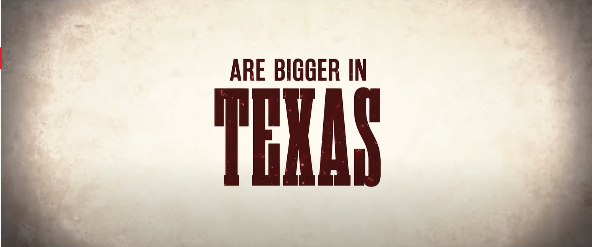

- # Blowing Bubble
  collapsed:: true
	- 
		- 这样的封面图是怎么制作出来的？
	- 美国人为啥也想要移民出去？ 美国人移民的终点站在哪里？
	- 增加脑洞的英文youtube或者电子书？怎么增加自己的脑洞？
	- 多看看法律知识以及法律相关的案列，这对于保护好自己、全面思考问题很重要
	- 为什么加拿大出了这么牛的科学家？
	- 美国人和中国人对于生命的追求有什么不同？ 美国政府真的不爱护自己人民的生命？美国人民自己不戴口罩就是自私？中国人的自私体现在哪里？
	- 为啥印度人脑洞很大？对于个人而言如何增大自己的脑洞？
	- 脑科学的好看书籍有哪些？
	- 中国人的创新为啥这么弱鸡，真的是因为笼统的发展不足的问题？
	- 中国底层人民薪资低和美国底层人民薪资不低的原因是供需关系还是权利结构导致的？是发展问题导致的，还是发展以外的其他问题导致的？
	- 你如何形成一套合理的信息管理范式？ 现代社会有不少有价值的信息，可是也有很多垃圾不营养的信息，怎么去设计一个模板去查找自己需要的东西？
	- 逻辑辩论的核心因素有哪些？辩论的核心步骤有哪些，各自起到什么作用呢？英语辩论的学习书籍或者节目有哪些呢？中文辩论和英文辩论的区别是什么？ 辩论的终点在哪里？
	- 西方的民主到底是怎么产生的？西方的民主有哪些缺陷？西方民主的优势又是哪些？
	- 如何看待侵略？
	- 美式脱口秀的笑点在哪里？
	- 美国的核心价值观是什么？
	- 股指期货是什么？基本盘又是什么？抄底又是什么？
	- 买入和卖出对股价价格的影响是什么？
	- 清仓是什么意思？
	- 没有人指导怎么自学ACM? ACWIng的成功之处在哪里呢？
	- 看了那么多思维误差，但是自己仍然陷入其中，如何尽量减少呢？
	- 首先我得学会总结以及发现自己无法控场的情景，然后试图针对这些场景一个一个解决，所以有哪些我不能handle的点呢？
	- 漫画的发展史是怎么样呢？有哪些不容错过的经典漫画？日本为啥能孕育漫画的土壤？
	- 普通人可以实现像手工耿一样类似的风险吗？小小发明对于当今中国的普通人来说真的有可能实现吗？
	- 商业分析（与统计学和计算机科学紧密联系的那种）在美国发展前景如何？薪资、就职公司有哪些？
	- 计算机和金融学结合的发展方向真的不行吗？比特币和web3到底本质是什么？NFT可以怎么玩？
	- 除了英语最值得中国人学习的第二外语是什么？一生学多门外语真的难吗？
	- 英国人和美国人有什么相似性和不同之处？
	- 从事工科行业如何摆脱工具人的现状？
	- 思维的层次到底是如何训练起来的？已有的现成的思维层次有哪些？如何针对一个陌生的问题来思考相关的所有层次？
	- 如何避免得出一个比较specific而不是general的结论？
	- 毒品为啥能在西方国家发展起来？毒品如此有害，为啥西方禁止不了呢？
	- 中介赚钱的方式包括哪些呢？不同国家的中介有什么区别？不同中介之间的区别大吗？哪些中介赚钱，哪些中介不赚钱？
	- 为啥古代是士农工商，商业排在最后？
	- 如何理解“过刚则易断“？
	- 现代商战的关键点在什么地方？
	- 如何理解艺术作品的超高价值行为？是因为物以稀为贵吗？
	- 古代人怎么除蚊子的？
	- 怎么才能去联合国工作？
	- 为啥在美国国人也只是和国人完？难道真的融入不了美国人的朋友圈？
	- 国外有没有类似手工耿、我爱发明这种类似的科技创新项目？
	- spacex程序员工作体验会是什么样的呢？
	- 科研工作怎么及时找到正反馈呢？
	- 多雨、多阴天的地方会让人觉得比较压抑，所以英国人的抑郁倾向比其他地方高吗？如果必须待在像温哥华、多伦多相对雨天多一些的地方，怎么保持心情愉快？
	- 美国不禁抢的全面分析结果会是什么？
	- 为啥药膏能够渗透进入皮肤？纯水能够进入皮肤还是不能呢？ 皮肤有哪些天然膨胀呢？
	- 对于日常生活中每个人接触到的信息具体可以怎么分类？哪些是不必要的，可以采取什么方式屏蔽掉？
	- 计算机与哪些科学是相通的？脑科学的生物学研究已经做出了哪些贡献呢？
	- 可以从哪些层面去观察一个人？洞察力这种东西到底是怎么培养出来的？
	- 不利用搜索引擎，强大的搜索能力需要学习什么知识？网络通信、爬虫、网络安全？有哪些超级牛的搜索项目可以学习？
	- 怎么制作一款插件？基于插件的软件项目有哪些？如何开发logseq中的一款插件？如何开发bootcamp插件？如何开发油泼猴中的插件？
	- 关于编译原理的工程项目有哪些？
	- 对人过于热情 我发现从长远来看绝对不是一件好事，所以要学会如何从过度热情降低到平和？
	- 克制和压抑之间的界限到底是什么？到底要不要克制，要克制到什么样的程度才算健康？
	- 现代生活中欺骗消费者时间和金钱的小套路有哪些，比如盲盒、部分优惠券是否是智商锐？
	- 音乐和视频非常容易放大人的感受，让悲伤的事情变得更悲伤，让喜悦变成亢奋，让平淡开始变得有趣，如何抵制这种放大导致的不利影响呢？
	- 为什么大多数的人会对电影电视剧上瘾而只有少部分不会？这少部分人是怎么做到的？
	- 怎么消除黑眼圈？
	- 南方的蚊子为啥比北方的蚊子毒？为啥皮肤为红一大块，但是没过多久自己就好了？
	- 生活中哪些事情是越要做越做不好，越不做反而自然而然变好了？
	- 为啥西方人这么喜欢吃甜食？中国人为啥大多喜欢吃咸食？
	- 据说中国人比西方人智商更高，这是一个群体性的结论：中国人整体比西方人智商更高，还是一个个体性的结论：中国人高智商人群比西方高智商人群更多？这一点的出处到底在哪里？这里的智商是指原始的智商水平还是说经过训练后的智商水平？中国人高强度的训练是否对这个结论的得出有影响？
	- 法论功到底是什么？是好的东西被误解了、一开始是好的后来变坏了、还是一直就是坏的东西？】
	- 有些看起来很离谱的骗局为什么还是有人不停的上当？
	- 美国有哪些常见的骗局？
	- 人做什么事情的时候会迅速陷入懒惰状态？人在做什么事情的时候又会迅速陷入勤奋状态呢？好像只要开始吃东西、开始看电视剧、开始和同学聊八卦、参加业余和闲杂活动，堕落就自然而然的开始了？
	- 经济中的放水指的是什么意思？放水对于经济的发展肯定是希望起到正面作用的，是否有可能会起到反面作用，什么情况下会导致反面作用呢？美国经济放水多还是中国经济放水多？有没有国家经济是不放水的？
	- 各种社会矛盾是否存在本质性和根本性的解决办法？
	- 马克思主义的主张到底是什么？
	- 如何看待中国古代的风水学？是否存在一定的科学价值？风水学到底是愚昧，还是说控制人的一种手段？
	- 国外的星座学是否存在一定的科学价值？星座学是谁第一个提出的，最先开始提出这一点的目的是什么？
	- 美国的社会矛盾存在于哪些地方？
	- 理想国讲的到底是怎样的故事？
	- 哲学看上去没什么用，但却又如此吸引人呢？
	- 网上关于凤姐的消息是凤姐自己营销的吗？如果不是，又是谁对凤姐的消息如此关注呢？
	- 网上散步不实消息的人究竟有哪几类呢？各自的动机和目的又是什么呢？
	- 知易行难，难在哪里？有没有不依赖于意志力的执行方法，如何化被动执行为主动执行？
	- 哲学、科学、宗教的结合诞生了哪些超级技术？
	- 国内为什么没有大规模社会实验的群体基础？
	- 有没有一本书在讲关于发明创造的故事的？
	- 语言表达有哪些常见的错误方式？不同的错误方式会导致什么样的后果？有没有书本讲这个的？
	- 哪些从0-1的科学创造的发明过程能给我们具体的启发？
	- 有没有训练逻辑过程的游戏？
	- 有没有书教授你怎么去求证问题的？
	- 如果你怀疑一个人有可能在已经做的某件事上欺骗了你，你要怎么去在不伤害或者不干预人性预期的前提下去证实这一点？
	- 人性经不起考验，这句话是否存在逻辑上的问题？经不起考验的种种情形下，很多人将其归结于提出测试的人，可很多情况下提出测试的人本性都不坏，问题的权衡在于测试可能带来的代价与测试本身的意义之间的矛盾？
	- 怎么识别鸡汤是否有毒？有毒的鸡汤对于某些人可能是良药？
	- 辩论中开放心态的边界到底是什么？什么时候应该选择还击？什么时候应该选择退让？
	- 小组多人进行答辩时统一风格的PPT，但是有办法能将差别很大的风格融合在一起？模板相同但使用不同的纯色？还是颜色相近但稍微调整不同组件的形状特点？
	- 网络搜索的形式还能变化吗？
	- 不同材质的镜子效果区别很大吗，不然为啥学校卫生间的镜子、手机的相机、专业摄像机在相似距离下的人脸胖瘦观感差异那么大？镜子中脸比实际胖还是要瘦呢？
	- 发型为啥会影响人的颜值呢？
	- 有没有咖啡因的咖啡吗？喝多了咖啡或者茶这类含有神经兴奋剂的饮品对身体的伤害到底是什么？
	- 为啥咖啡这种有点苦味的饮料会受到人们的欢迎？难道是咖啡店所营造的附加价值？
	- 哪些商品的附加价值（与商品配套的一系列包括人工在内的服务）大于商品本身呢？既然如此，为什么人们还是要购买这些商品？
	- 不管是社会科学还是自然科学，都有很多相应的模型。这些模型的原型又可以分为哪几类呢？比如层次模型、嵌套模型？如何让模型真正的动起来，《MIT深度学习思考法》中的系统动力学中的“动”更像是一种pipeline式的固定式的“动”，怎么让这个“动”变成流动式的“动”呢，也就是时随时能够修改和变化？
	- 美国政府是邪恶的吗，发动的战争的性质到底是如何的呢？美国人不谈自己国家对别国的侵略，真的是一种双标吗？如何看待双标行为呢，双标就一定是不可取的吗？
	- 高烧真的会烧坏神经纤维，以至于导致智力发育迟缓或者是精神类疾病吗？
	- 当你观察到身边的人举止怪异的时候，要怎样恰当的伸出援助之手？
	- 中国出现的邪教组织都有哪些？这些邪教为何会在中国发展起来？
	- 堕落或者放纵机制的逻辑链是什么？这个逻辑链的weak point在哪里？如何破除这些weak point？
	- excel的难点在哪里？有没有比excel更好用的适合普通人的工具？
	- 如何系统性对一个youtuber或者b站up主内容上的客观判断？是否可以尝试给自己敬佩的自媒体博主以不错的意见和建议？
	- 有哪些工业级的算法？
	- 你认为未来的自媒体当中什么方向会最火？是关于情感、人际交往、社会规则的吗？你觉得现在的自媒体还缺少什么方向？
	- 如何判断一个插座的质量好坏？插座之间的互相连接方式会导致出现安全事故吗？
	- 有哪些以写作作为副业的人，可以从他们的经历当中学习到什么？
	- 如何在互联网测试自己的隐私被泄露的程度？
	- 诈骗团伙是通过哪些渠道获知我们的电话号码的？窃取通讯录使用的是什么技术？
	- 美国的专利律师需要考什么试？
	- 当有人从远处看到你或者你从远处看别人，你或者别人都能够感受到有人在看你？这背后的科学解释是什么？
	- 如何搜索相关论文来解决生活中的各种问题呢？不只是单单做科研的时候使用
	- 美国的毒品交易究竟有多可怕？美国和加拿大现在仍然存在很多黑帮吗？
	- 很多你接受的思想观点都是源自某个已经形成的思想派系的分支或者部分，如果了解自己思维形态所属的哲学分支呢？如何溯源思想流派，溯源的意义在于理解思想诞生的现实基础，还有什么其他意义呢？
	- 很多情况都是思想本身的价值观没有任何问题，但是实践造成了许多灾难，你觉得这些实践错误的重要原因可以分为哪些？执行力中的错误包括哪些？
	- 人控制自己大脑的机制是什么？
	- 美国和中国在追求强大、追求自豪感方面非常相似，所以美国人之间真的没有攀比吗？
	- 美国贫富差距的原因是什么？看上去美国给底层人民的福利虽然没有欧洲国家那么好，但是比中国也要好很多，为啥会比中国的贫富差距更为严重呢？
	- 美国教育公平与否？美国不同大学的教育资源相差没有那么大，是否是一种公平？申请制就一定不如考核式公平？
	- 国家犯罪率与哪些因素有关？
	- 克林顿的生平经历是怎么样的？为啥克林顿会被爆头？
	- 联合国为什么会诞生？这样的机构难道真的不是噱头吗？
	- 如何找到俄罗斯程序员的编程学习资料？俄罗斯人怎么学习数学的？俄罗斯人怎么学习编程的？
	- 为啥国内公交站牌上都是口腔、男科、妇科医院等广告？是这些公司给的广告费多吗？这些广告的可信度怎么样呢？
	- 玩了一段时间，接着就更想玩下去，这是因为惯性吗？这背后的行为科学是什么？
	- 让一个疯狂玩耍，最多玩多少天后这个人就会觉得玩耍也很无聊？让一个人疯狂学习，最多学习多少天之后这个人就会觉得学习也会很无聊？
	- 中国人为什么会隐藏自己对于别人的恶意？
	- 关于行为科学的书籍有哪些呢？
	- 亚洲的人口为啥会比欧美多这么多？
	- 为啥白人女生不喜欢亚洲男，仅仅是因为身材？
- # Blowing Pearly Shells
  collapsed:: true
	- 洗发露可以洗身体吗？会有什么不良影响吗？
	- typec接口比USB接口好在哪里？
	- 为啥昨天晚上想起来的东西第二天一早就玩的干干净净？梦也是这样的，这就是梦被遗忘的根本原因吗？
	- 获得美国L1签证的途径有哪些？每条途径的难易程度如何？
	- 为什么美国的法律制度如此细致且全面？美国的政治制度和法律制度是怎么进行优化的，优化的流程是什么？
	- 统战价值是什么意思？
	- 小粉红为啥加个小字？为啥是粉红而不是红？为啥颜色会被用来指代政治倾向，美国的红色和蓝色分别又指代什么？
	- 眼镜为啥里面会脏？是灰尘在垂直下落过程中会粘在镜片上吗，还是说主要是拿下眼镜放置于桌面的时候才会有灰尘积累？
	- 影视剧到底有没有营养？
	- 剪切图片时到底传递的是什么数据格式，为啥有一种凭空传递数据的感觉？
	- 为啥俄罗斯乌克兰战争会导致通货膨胀？石油与通货膨胀为啥关系这么密切？
	- 通货膨胀和通货紧缩总感觉理解起来不是那么直观，这个名字到底为啥这样起？通货膨胀会啥埋怨声会这么多，却很少有听到关于紧缩的批评呢？
	- 明明每栋建筑都没有写名字，为啥高德地图可以自动检测到这个地方叫什么？难道采用的是注册机制，每增加一个房屋就会增加一个注册的名字？
	- 阿拉伯国家包括哪些？中东全是由阿拉伯国家组成的吗？阿拉伯地区的宗教问题是什么？
	- 如果看待世界小国所扮演的作用，有哪些不起眼但很牛皮的小国？
	- 经济危机到底是什么意思？我对这个概念的理解非常模糊
	- 债券到底是什么东西？国债又是什么？如何依据债券的价格反推出利率？
	- 美股和A股的区别？
	- 为啥金融当中黄金和债券需要进行对比？黄金指代的是黄金的价格，还是说黄金相关的产业？
	- 货币难道不是越升值就越好吗？为啥既有贬值也有升值的压力？
	- 货币的相对价格高低反应了什么？价格越高反应了经济实力越强吗？中国GDP这么高，为啥人民币还不如加拿大、新加坡值钱呢？
	- 通过看游泳教学视频能够学会游泳吗？人在正常情况下在水面会沉，为啥呛了一肚子的水反而漂浮起来了，这时候难道人体的自重不是更大了吗？人体游泳能漂浮在水面的依据是什么？人的游泳是只能停留在水面的浅层吗，能在水面的深层游泳吗？谁发明的游泳？为啥动物天生就能游泳？
	- 如何从生理学角度来增加头脑的认知能力？
	- 大脑的容量是什么概念？是脑细胞的数量还是大脑的容积？如果是神经链接的梳理的话，那它是怎么进行测量的？
	- 谷歌地图、高德地图、百度地图有什么不同？
	- 好莱坞大片吸引人的地方在哪里？它的哪些东西容易被观众忽略其实是商业化的东西？
	- 
		- 为啥私募基金不用还款？
		- 为啥国内有些企业倒闭了也不用还款呢？
	- 文宣是什么意思？
	- 在中国的企业与政府之间的合作关系有哪些形式？什么类型的企业需要与政府之间进行密切合作？国有企业和政府之间有哪些关系？
	- 在中国开餐馆的坑有哪些？在美国开餐馆与在国内开餐馆有什么不同？
	- 说教心理的成因有哪些？
	- 荷尔蒙为啥在LGBT群体内不能发挥作用？
	- 如何快速获知一个行业内的潜规则？怎么让大佬愿意给你传授商业知识？
	- 企业家的心狠体现在哪些具体的事项上，比如裁员？不给产假？
	- b站up主或者某些知名博主的素材来自哪里， 收集这些素材的渠道有哪些？素材的加工艺术包括什么？
	- 到底要不要把感情做生意？很多电视剧或者影视剧作品批判“喜欢用钱收买感情”，这种现象在现实生活中真的存在？为啥频繁设置这样的环节？
	- 影视剧中哪些请假很老套却又让人欲罢不能，比如男女主角的纠葛不清的感情戏，如何从马斯洛的需求理论来解释？
	- 客套话是否有必要？
	- 怎么免费获取一些商业项目的分析报告？
	- 开一个公司需要从哪些角度来考虑，投资、定位、财务、法律、人员管理、以及对手管理？
	- 五大洲哪个州的面积最大？亚洲的地域优势相对明显，但是为啥发展不起来？为啥亚洲的人口会比欧美多这么多？
	- 集体利益和个人利益平衡的最佳解决方法是什么？
	- 为啥美国要分州而治？
	- 如何理解三国？我好像对此毫无概念。三国的核心思想是什么？
	- 三权分立的立法、司法、行政这三个权利对应的具体任务是什么？
	- 为啥国内会有饭圈文化？日本、韩国有吗？为啥粉丝会有窥探别人隐私的强烈好奇心？
	- 有哪些美国底层人民励志成功的故事？底层人逆袭的比例到底有多大？
	- 历史上的发明家、科学家都有着什么相似的人生经历呢？
	- 必须看的人物传记有哪些呢？
	- 有些惯性是有意义的，但是有时候需要尝试新事物，如何来打破一些老旧且没用的习惯呢？
	- 怎么判断一个中介机构或者说一个推广人是否靠谱呢？如何对网络名人进行一个validate and check？、
	- 硬件和软件本身都会存在无法发现的bug，生活中有哪些硬件明明是不完善的但是人们依然照常使用它？
	- 为什么如今工业界相比于学术界反而容易被淘汰？
	- 德国工业界的发展历史是怎么样的？德国有哪些世界知名的企业？
	-
	-
	-
	-
	-
	-
	-
	-
	-
	-
	-
	-
	-
	-
	-
- # Blowing Iridescent Imaginations
	- 为啥建立的认知除非经历过不然没有办法形成很深的印象或者说建立很牢固的链接？所以即便是脑子中已经有了很多正确的是非观，还是会做出错误的行动
	- 有哪些伟大的发明是从很小的事情中受到启发的？
	- 什么才算是有效的观察者？生活中很多人会试图努力将一个事物描述得很仔细，然后说出一些别人没有看到的细节，我觉得这顶多算细致的观察但未必有效，有效的观察应该具有更明确的目标？有效的观察是否需要一些技巧？
	- 出口必然是能赚钱的，可是进口能赚钱吗？
	- 国家之间的金钱往来主要体现在哪些行业呢？
	- 为啥军工方面的业务各个国家之间反而有不少密切的合作？具体有哪些合作项目呢？
	- 什么情况下才会在街道旁边设置路标呢？
	- 美国的城市规划遵循的是什么设计原则？国内的城市规划存在哪些严重不合理的地方？越南的道路为啥歪七扭八？
	- 美国是如何保持环境质量呢？按照工业和城市化水平来说，纽约是不是美国空气质量最差的地方？
	- 美国是如何进行污水处理的？
	- 既然自来水可以喝，为啥加拿大人还是喜欢出去买水喝？
	- 欧洲为什么会存在浓重的艺术气息？
	- 欧洲和英国的关系到底是怎么样的？
	- 德国为什么会孕育出一系列的哲学家？这些德国哲学家的哲学思想又大体可以怎样理解呢？
	- 英文中行文流畅的秘诀是什么？因为总觉得自己的表达非常不自然，可是别人也只是用了非常简单的词汇，是因为我对句子结构掌握得还不熟练吗？
	- 在美国读书工作能以什么身份、以什么工作快速拿到加拿大的绿卡呢？
	- 美国人空调温度开那么低，难道不冷吗？猜测要么他们的温度感受系统不够敏感，要么就是身体机能好从而不会在寒冷环境中迅速失温？
	- 美国存在工位这样的等价概念吗？美国的工位设计与中国有什么不同？
	- 散射空调既然散热不均匀，为何有存在的必要？是因为只要时间足够长，就可以保持不同位置的室温基本均衡吗？
	- DONE 空调外机的作用是什么？所有空调都需要有外机吗？
	  collapsed:: true
	  :LOGBOOK:
	  CLOCK: [2022-09-16 Fri 09:14:03]--[2022-09-16 Fri 09:14:06] =>  00:00:03
	  :END:
		- 将由室内机中排出的高压高温气体在室外（通过风扇）降温散热，冷凝之后的制冷剂液体再经过毛细管送到室内机的蒸发器中去蒸发变成气体以吸收室内的热量，如此反复循环，室内的温度就会逐渐下降。简单说空调中的制冷剂在循环过程中所起的作用是--在室内吸热---在室外散热--散热之后又回到室内吸热。
		- 移动空调不需要。不同的是风道循环设计，移动空调的风量循环是针对室内的空气循环，普通空调是降低室内的空气温度的同时，又吸进室外新鲜的空气，本质上普通空调通过室外压缩机进行冷热交换制冷热，而移动空调则是由室内机单独完成。
	- 为何最贫穷的印度人却拥有发达的英语水平？
	-
	-
	-