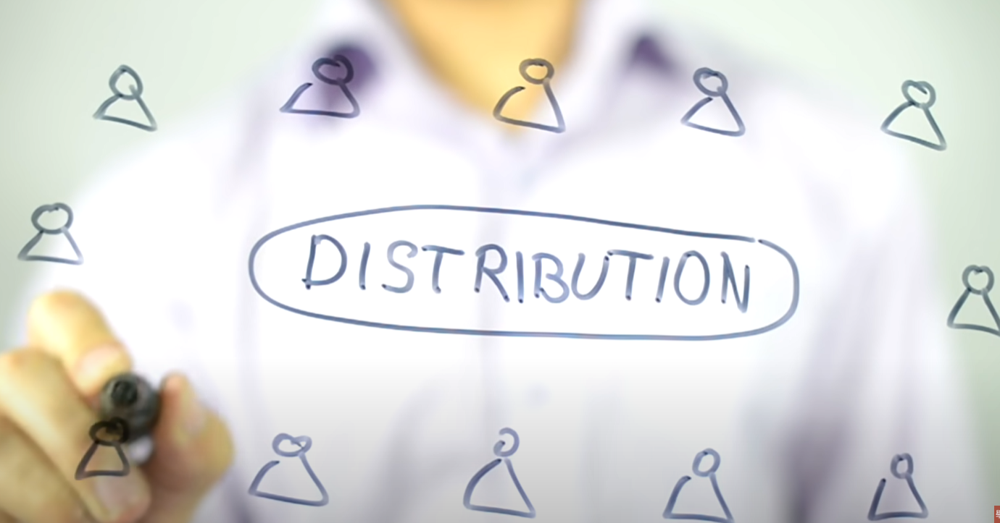

- 怎样才算是好的阅读者呢？
	- 既有[[阅读的进度]]，也有[[阅读的品质]]
-
- 阅读的好处该怎么理解？
	- 就像[[金钱]]能够增加[[购买力]]一样，阅读可以增加[[知识力]]
-
- 阅读有哪些方法呢？
	- [[阅读前]]
		- 在阅读前建立[[$red]]==清晰的阅读目标==（占据了50%的重要性）
			- 问你自己：[[SelfQuestioning]]
				- 为什么我要阅读这本书？到底是为了解决你人生上面的困难，还是解决一些[[时效性]]的问题，比如可以立即套用在你自己的工作或者生活中的一些问题上？
					- 这可以提升[[内在动机]]，从而加快阅读效率
				- 要分辨当前的阅读是属于[[休闲的阅读]]还是[[修炼的阅读]]？
					- 前者指的是小说之类的，后者指各种工具、能力、技巧之类的书
					- [[$red]]==但是工具书也有可能变成[[休闲的阅读]]，而小说也有可能变成 [[修炼的阅读]]，关键在于你自己的动机是什么==。
						- 比如[[#green]]==读小说可以培养我们写作的能力：怎么去[[阐述]]一个故事、怎么去[[形容]]一个内容==
						- 比如[[#green]]==有些理财书籍使用夸张和耸动的标题“从几万元到几亿元”来吸引眼球；只是为了满足自己的快感==
		- 怎么保证自己能够建立[[$red]]==清晰的阅读目标==呢？
			- 使用[[苏格拉底提问法]]或者[[诊断式提问法]]
				- 就是用连续的自问自答让自己有种在进行Q & A的感觉，就好比是医生在问医生一连串的问题才能知道接下来该怎么做或者开什么药，
	- [[阅读中]]
		- 用书写问题的方式来记笔记
		- 使用什么方法[[$red]]^^保证自己能够读完一本书^^呢？（占据高效阅读20%的重要性）
			- 通过[[设定阶段性的阅读进度]]
				- [[阅读目标切割法]] 按照页数或者章节来划分阅读进度
					- 
				- 早上阅读10min、中午再阅读10min、晚上再阅读10min；阅读30min就休息10min
				-
	- [[阅读后]]
		- 为什么[[$red]]==还会有阅读之后这个阶段==？
			- 有句话是[[想法带出行动，行动带出结果]]。看书的过程就是在培养自己的想法，如果没有之后的行动，就不会有最终的结果。所以阅读之后必须要有[[行动准则]]。
		- 该怎么设计自己阅读后的 [[行动准则]]呢？
			- 一是要做马上要做的事情：
				- [[回想]]书中的内容，使用[[关键字]]或者[[关键词]]的方法把脑中的[[记忆残存]]整理下来
			- 另一个是设计明天要做的事情
				- 第二天写下300-500字的[[读书感想]]，[[#green]]==此时应该能够回答当初阅读之处提出的问题了==
				- 将第一天的[[关键字]]或者句子勾勒出更完整的框架
			- 第三个是计划持续要做的事
				- 思考：[[#red]]==我还可以做什么去延伸书本里面的知识？==
					- 找更多相关主题的书本继续阅读总结
					- 立刻实践书中的习惯和方法
-
-
- 到底什么才是阅读的重点呢？
	- [[#red]]==是你吸收了什么，以及你要怎么去应用==
-
- 如何使得阅读一本书的时间更多？
	- 方法一:
		- 看书前先了解整本书的大方向。（先看封面封底一般都会有出版社的内容总结和两点概括。然后看目录了解各大章节、小节介绍，顺便快速翻阅整本书的大小章节，看到感兴趣的地方可以稍作阅读）
	- 方法二:
		- [[#red]]==不要停留在看不懂的地方==。（看到不懂的地方，尝试几次还是无法理解，继续往后面阅读）
	- 方法三:
		- [[#red]]==不要一开始就想把笔记做完整。（不要打断你的阅读节奏，可以采用先标记后补充的方式。先记录主要的句子和想法==
-
-
- [[$red]]==阅读中容易走向的误区有哪些？== [[思维谬误]]
	- [[瓦纳尔]]的读书建议中给出了一个答案：
		- [[阅读的基础]]很重要，[[#red]]==如果以不正确的顺序来阅读书籍，就会得出错误的世界观和认识基础==，因为所有后续想法都是以之前的理解为基础
		- 如果提升[[阅读的基础]]？
			- [[坚持科学]]、[[坚持基础理论]]，也就是阅读 [[Math(数学）]]、[[NaturalScience(自然科学)]]和 [[MicroEconomics(微观经济学）]], 阅读这些可以帮助我们提升[[辨别真伪优劣]]的能力
			-
-
-
-