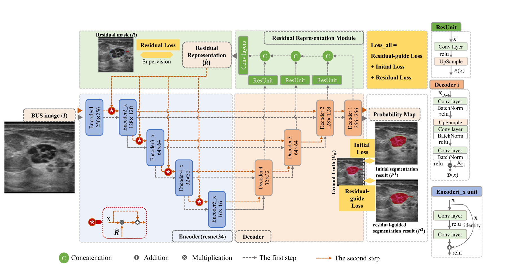
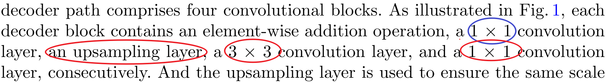
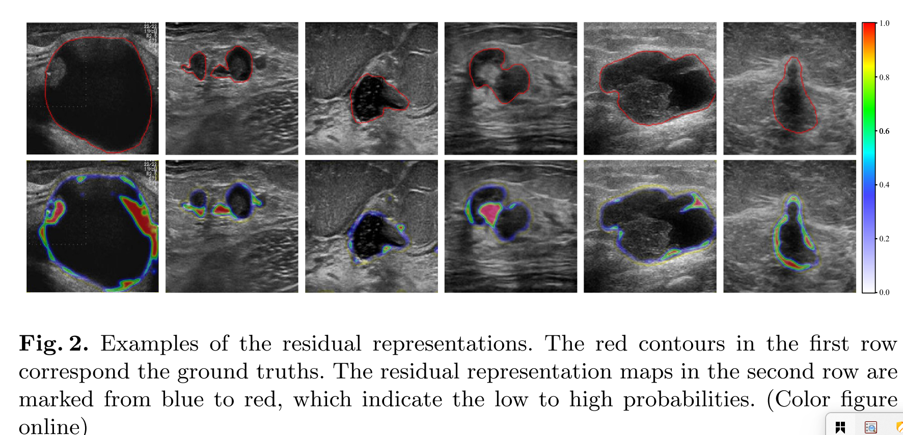
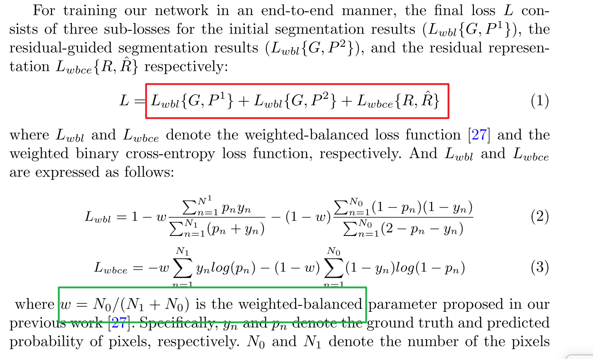

- 贡献：
	- 设计出一个[[$red]]==残差表示模块==来学习 [[#blue]]==模糊/丢失的边缘 + 难以判断的区域==  的 残差表示，[[#blue]]==使得网络能够更多地关注难以预测的像素点==
	- 设计出一个[[$red]]==残差反馈传递策略==，通过  [[#blue]]==结合原始特征和残差特征== 来 [[#blue]]==更新编码块的输入==
- 模型架构图：
	- 
	- 此处Unet的encoder-decoder的子结构都发生了修改：
		- encoder是连续的五层，第一个encoder只有1个7*7的卷积，后面四个encoder分别是3、4、6、3个连续的双卷积结构；
		- decoder是连续的四层
			- 
	- 残差表示模块：
		- [[#blue]]==每个残差单元都包含一个3*3的卷积层和上采样，使得三个连续的decoder经过这三个残差单元之后都输出大小同为 256 * 256 的特征图。这三个特征图按照通道方向进行连接，最后再经过若干卷积层，就得到了最终的残差表示图。==[[#green]]==残差表示图可以利用初始分割结果和GT的差（也就是残差mask）来进行监督==。[[#red]]==残差表示图可以帮忙定位出：模糊/丢失 的边缘  + 难以区分的区域==
			- 
	- 残差反馈传递策略：
		- 残差表示模块得到的[[#green]]==残差表示 被送入到 2,3,4,5这四个编码器的输入端，其通过 按位置相加 和 按通道方向相乘 和 原始图片特征进行结合==， [[#red]]==目的是对粗糙分割结果中 确定度低或者不确定度高 + 难以区分的区域 的这些像素点进行加权。==
	- 训练策略：
		- 
		- 为何w对应的是为0的像素点，（1-w）则对应的是为1的像素点？不应该反了吗？
			-
		- 这里wbl使用的是普通的dice损失函数吗
-
- 思考：这里定位 hard pixels的方式有什么借鉴之处？
	- 和uncertainty map[[#red]]==的共同之处就是 都是在decoder层来寻找hard pixels==；但是[[#blue]]==不同之处时，hard pixels只从最后一层decoder的输出特征图上进行寻找，而这里是利用多尺度融合特征来进行定位。==
	- 我觉得 uncertainty map + 动态阈值 的方法是不太合理的，因为：
		- 原理做过的实验当中最终分割对应的uncertainty map设置为0.5时，基本上已经能够定位hard pixels, 设置为0.45或者0.55时差别不大，但当设置得过高或者过低时，结果都不正常；[[#green]]==从uncertainy的计算过程来说，softmax的归一化结果应该在性质上是无差别的==
		- [[#green]]==如果阈值是动态的，必须为阈值的设置也设置一个指标来指示，很明显阈值设置的结果一直都是利用人眼观察的==
	- 后续计划：
		- [[$green]]==先进行多尺度融合，再进行uncertainty map的计算；或者在每个解码器层都增加分割输出，都计算uncertainty map, 然后想办法对uncertainty map进行多尺度融合；==
		- [[$green]]==其他多尺度和uncertain map结合的策略==
		-
		-