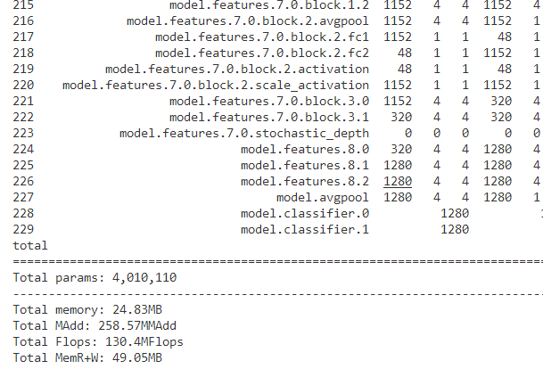

- 记录论文中实际用到的实验数据
- 提出的论文模型
  collapsed:: true
	- 损失比1:1:1  d=5
	  collapsed:: true
		- 
	- 损失比 1：1： 1  d=8 （最终论文使用的结果）
	  collapsed:: true
		- 
		- 
	- 
	-
	-
- 消融实验
  collapsed:: true
	- densenet121
		- 
		- 
	- resnet18
	  collapsed:: true
		- 
		- 
	- proposed without multi-output
	  collapsed:: true
		- 
		- 
		-
- 对比实验
  collapsed:: true
	- SVC
	  collapsed:: true
		- 
	- 随机森林
	  collapsed:: true
		- 
	- K-近距离
	  collapsed:: true
		- 
	- FDFFE
	  collapsed:: true
		- 中间维度设置为500
		  collapsed:: true
			- 
			- 
			-
		- 中间维度设置为100
			- 
			- 
			-
	- propopsed with 拼接融合方式
	  collapsed:: true
		- 
		- 
		-
	- inception 输入图片的大小为 299 * 299， 且使用第三个版本的训练和测试函数（因为inception_v3有辅助输出）
		- 
		- 
		-
		- 
		-
	- vgg11（一层fc）
	  collapsed:: true
		- 
		- 
		- 
		- auc修正结果
			- test
				- 
			-
			-
	- vgg11-2（两层fc）
	  collapsed:: true
		- 
		- 
	- vgg16（一层fc）
	  collapsed:: true
		- 
		- 
		- 
	- vgg16(两层fc)
	  collapsed:: true
		- 
		- 
		-
	- efficientnet(一层fc)
	  collapsed:: true
		- 
		- 
		- 
	- efficientnet(两层fc)
	  collapsed:: true
		- 
		- 
		- 
		-
	- alexnet
	  collapsed:: true
		- 
		- 
		- 
		-
		-
		-
		-
	- FDFE
	  collapsed:: true
		- 
		-
	- resnet18 and densenet121 w concatenation fusion
	  collapsed:: true
		- 
	- proposed
	  collapsed:: true
		- 
		-
	-
	-
	-
	-
	-
- 拓展实验
	- resnet_change_pool3  不使用任何池化，直接SDWFM（设置的d为32） 学习率设置为0.0005
		- 
		- 
		- 
	- DenseNet2_W_WeightPool  先平均池化，再直接SDEFM（d设置为100） 学习率设置为0.0005  只使用一层全连接层
		- 
		- 
		- 
	- DenseNet2_W_WeightPool  先平均池化，再直接SDEFM（d设置为100） 学习率设置为0.0005  使用2层全连接层
	  collapsed:: true
		- 
		- {:height 359, :width 1042}
	- DenseNet2_W_WeightPool2  直接SDEFM（d设置为100） 学习率设置为0.0005
	-
-
- 参数量
  collapsed:: true
	- 原生的densenet121
		- 
	- 原生的resnet50
		- 
- CAM
  collapsed:: true
	- 很明显CAM是针对每个预测类别来说的，可以用二分类来举例说明
		- 对于每一张输入图片，模型预测结果可能是对的，也可能是错的
		- 对于良性或者恶性来说，其对应的全连接层的权重是在模型训练好后就已经确定了的
		- 不同的输入图片在最后一层会有不同的输出特征图，但对同一张图片来说这个输出特征图一定是固定的
		- 同一张图片的输出特征图使用良性和恶性的对应的两个权重就能够得到两个CAM图
		  collapsed:: true
			- 一个CAM图是模型将改图片分类为良性的原因
			- 另一个CAM图是模型将图片分类为恶性的原因
			- 可以只输出预测结果所对应的CAM图
				- 如果预测结果正确，CAM图能够捕捉到正确分类的原因
				- 如果预测结果错误，CAM图能够发现造成错误分类的原因
			- 可以同时画出两种类别对应的CAM图
				- 此时结合真实结果和预测结果，能更为准确地分析分类与预测是否匹配的原因
			-
	- 本论文对应的模型中有一个难点：对应的全连接层不止一层，而是两层
		- 问题1：直接使用第一层全连接层的权重进行CAM图的生成是否有意义？
			- 我觉得是可行的  因为第一层fc的权重是用于生成第二个fc的输出的 毫无疑问第二个fc的权重与最终的预测是直接相关的
			- 你觉得这两个fc层的权重能不能进行一个数学公式的合成呢 可以分析一下这个fc层的数学操作过程
			- 假设GAP之后的输入为【5, 2048】
			- 第一次fc：【5,2048】 * 【2048,32】+ 【5,32】=【5,32】
			- 第二次fc：【5,32】* 【32,2】 + 【5,2】= 【5,2】
			- 两层fc进行合并就是：
				- （【5,2048】* 【2048,32】+【5,32】）*【32,2】+ 【5,2】
				- = 【5,2048】*  【2048,32】* 【32,2】+ 【5,32】*  【32,2】+【5,2】
				- =  I ×　Ｗ１×　Ｗ２　＋　ｂ１　×　Ｗ2＋ ｂ２
			- 将两个ｆｃ视作一层ｆｃ就是：
				- = I * W + b
				- 其中 W = W1 × W 2，b = b1 × W2 + b2
			- 新的问题又出现了：因为我这里面有三个出口，中间的出口会对fc层进行变化
-
- 可视化分析
	- 不好分析，主要结果中有几点特殊之处
		- 同一个模型在训练集、测试集、验证集上的定位位置不同
		- 不同模型在同一个数据集合上的定位位置不同
	- 疑问：
		- 这里如果我要分析模型融合的效果需要怎么做
			- 与串联融合的结果进行对比？
			- 与单独的resnet18或者densenet121进行对比？
		- 这里如果要分析扩展实验的效果需要怎么做
			- 拓展之后与拓展之前的进行对比？
			-
-
- ![roc_curve_paper [7].jpg](../assets/roc_curve_paper_[7]_1657251224013_0.jpg)
-
- ![roc_curve_paper [12].jpg](../assets/roc_curve_paper_[12]_1657258005248_0.jpg){:height 808, :width 1000}
-
-
- 
-
-
- Here for each image we generated three pairs of visualization results: one was about resnet18 and densenet121 in the proposed model; one was about individual resnet18 and individual densenet121; and the last was about resnet18 with weighted pooling and densenet121 with weighted pooling.
-
-