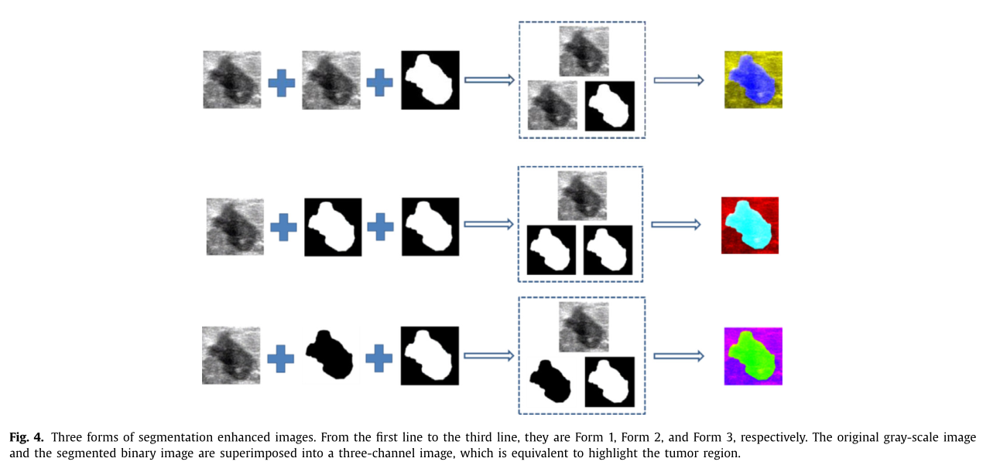

- 模型：
	- 整体结构：
		- 
	- 整体描述：
		- 模型由分割网络、两个并行的特征提取网络、基于通道注意力的特征聚合网络、分类网络这四个部分组成。
			- 【1】分割网络是普通的Unet结构，但是在最后一次下采样层和瓶颈层都是用了0.5的dropout；二元分割结果用于增强原始图像中乳腺肿块的形状和形态信息，增强的方式有三种，增强的结果作为新的模型输入：
			  collapsed:: true
				- 
					- 三种方式都是原图和分割图作为单通道图像进行堆叠，最终形成三通道的输入。
						- 第一种是两通道的原图，一通道的分割图
						- 第二种是一通道的原图，两通道的分割图
						- 第三种是一通道的原图，一通道的分割图，一通道的分割图的灰度反转
			- 【2】特征提取网络是普通的reset50，分别提取原图和分割增强图像的特征；
			- 【3】融合两个特征分支提取的特征，先进行拼接，然后通过全局池化、两个全连接层得到通道方向的注意力权重，最后按通道方向进行求和得到融合后的特征；
			- 【4】融合后的特征通过分类头输出预测结果
	- 一些细节：
		- 已有数据集划分为A和B两部分，A部分既有分类诊断的标签也有分割的标签，B部分只有分类标签而没有分割标签；
		- 只在A部分上进行Unet的预训练；
		- 两个特征提取分支分别在B数据集上事先进行微调，然后才训练整个模型。
- 模型的思考和质疑：
	- 为啥需要两个特征提取分支，这样提取的特征难道冗余度不大吗或者说训练难道不变得更麻烦了吗？这里的分割增强图像本身不是既包含分割信息，又包含原图信息吗？
	- 这里的特征融合方式感觉过于简单，通道注意力的权重计算过程利用的先验信息太少了，不是吗？
- 